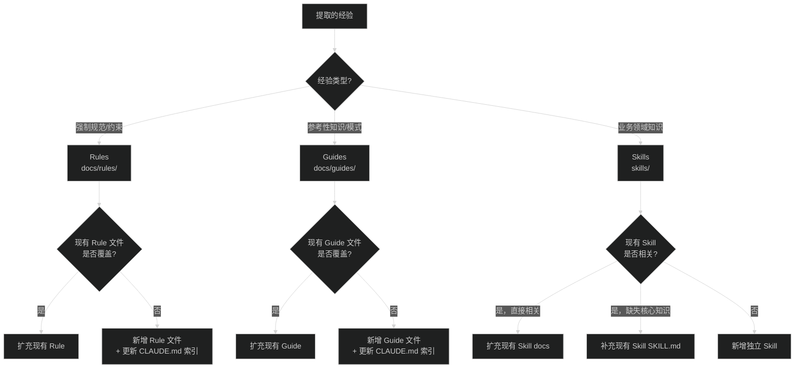

# 对话经验总结与知识沉淀

## 📋 概述

此 skill 用于在对话任务完成后，系统性地总结经验教训并沉淀到仓库的三层知识体系中：

| 层级 | 路径 | 定位 | 更新策略 |
|------|------|------|---------|
| **Rules** | `docs/rules/` | 强制遵守的规范约束 | 只扩充，不轻易新增 |
| **Guides** | `docs/guides/` | 参考性的开发指南 | 优先扩充，可新增 |
| **Skills** | `skills/` | 业务领域知识 | 三级策略（扩充→补充→新增） |

---

## 🎯 触发时机

当以下情况发生时使用此 skill：
- 用户请求总结本轮对话的经验
- 用户询问是否需要补充/更新 skills/rules/guides
- 一个复杂任务成功完成后，主动询问用户是否需要沉淀经验
- 用户使用关键词：总结经验、沉淀、学习、skill 补充、规范更新、指南优化

---

## 📝 执行流程

### 第一步：对话上下文分析

1. **回顾对话历史**，识别：
   - 任务目标是什么
   - 遇到了哪些挑战或问题
   - 最终解决方案是什么
   - 任务是否成功完成

2. **提取关键信息**：
   - 涉及的技术领域
   - 使用的工具或命令
   - 发现的最佳实践
   - 踩过的坑和解决方法

### 第二步：经验教训分析

**仅在任务成功完成时**进行深度分析：

1. **成功因素分析**：
   - 什么方法/策略有效
   - 哪些工具使用得当
   - 发现了什么规律或模式

2. **可复用知识提炼**：
   - 通用的解决方案模板
   - 可重复使用的代码模式
   - 值得记录的注意事项

3. **失败教训总结**（如果过程中有失败）：
   - 走过的弯路
   - 错误的假设
   - 需要避免的陷阱

### 第三步：知识沉淀与分发

#### 3.1 经验分类

按类型将经验分发到三层目标：



**类型判断标准：**

| 经验特征 | 归属层级 | 示例 |
|----------|---------|------|
| "必须/禁止/不允许" 类约束 | Rules | 发现编码规范遗漏了某条强制规则 |
| "推荐/参考/可以这样" 类知识 | Guides | 发现新的服务调用模式值得记录 |
| 业务领域知识、流程规则、接口关系 | Skills | 电子标加密流程有新的理解 |

#### 3.2 定位目标文件

**Rules 定位表：**

| 经验领域 | 目标文件 |
|----------|---------|
| 命名/分层/编码约束 | `docs/rules/coding-standards.md` |
| 接口设计规范 | `docs/rules/api-standards.md` |
| 数据库设计 | `docs/rules/database-standards.md` |
| 安全相关 | `docs/rules/security-standards.md` |
| 异常处理 | `docs/rules/exception-handling.md` |
| 日志记录 | `docs/rules/logging-standards.md` |
| 数据模型 | `docs/rules/data-model.md` |
| Git 操作 | `docs/rules/git-standards.md` |
| 开发检查 | `docs/rules/checklist.md` |
| 交互协议 | `docs/rules/interaction-protocol.md` |

**Guides 定位表：**

| 经验领域 | 目标文件 |
|----------|---------|
| 模块架构/依赖 | `docs/guides/module-architecture.md` |
| 包结构 | `docs/guides/package-structure.md` |
| 服务调用 | `docs/guides/service-call-guide.md` |
| 动态服务 | `docs/guides/dynamic-service.md` |
| 配置管理 | `docs/guides/configuration.md` |
| 设计模式 | `docs/guides/design-patterns.md` |
| 技术栈 | `docs/guides/tech-stack.md` |
| 测试策略 | `docs/guides/testing-guide.md` |
| 开发命令 | `docs/guides/dev-commands.md` |
| 基础组件 | `docs/guides/base-components.md` |
| 代码模板 | `docs/guides/ai-assist/code-templates.md` |
| 接口复用检查 | `docs/guides/ai-assist/interface-reuse-check.md` |

**Skills 定位表：**

| 经验领域 | 目标 Skill | 典型文件 |
|----------|-----------|---------|
| 招投标全流程规则 | `zbd-tender-flow-rules` | `context/flow-stages/*.md`, `references/development-guide.md` |
| 电子标业务（加密、签章） | `zbd-ele-tendering` | `context/*/*.md`, `references/development_guide.md` |
| 其他全新领域 | 新增 Skill | `SKILL.md` + `context/` + `references/` |

#### 3.3 更新策略

| 目标层级 | 更新策略 |
|----------|---------|
| Rules | 只扩充，不新增。新规则追加到现有文件对应章节。如确属全新规范领域，新增文件并更新 `CLAUDE.md` 索引 |
| Guides | 优先扩充，可新增。扩展现有指南章节；如属全新主题，新增文件并更新 `CLAUDE.md` 索引 |
| Skills | 沿用现有三级策略（扩充 docs → 补充 SKILL.md → 新增 Skill） |

### 第四步：生成更新建议

输出格式：

```markdown
## 📊 对话总结

**任务**: [简述任务目标]
**结果**: ✅ 成功 / ❌ 失败 / ⏳ 进行中

## 💡 经验教训

### 成功经验
1. [经验1]
2. [经验2]

### 踩坑记录
1. [坑点1] - [解决方案]

## 📝 知识沉淀建议

### Rules 更新
**目标文件**: [具体文件路径]
**更新内容**: [具体内容草稿]

### Guides 更新
**目标文件**: [具体文件路径]
**更新内容**: [具体内容草稿]

### Skills 更新
**更新类型**: 扩充 docs / 补充 SKILL.md / 新增 skill
**目标文件**: [具体文件路径]
**更新内容**: [具体内容草稿]
```

### 第五步：用户确认

**必须使用 `AskUserQuestion` 工具**询问用户是否需要执行更新，**禁止**直接通过文本对话询问。

**工具调用配置：**

- `questions`: 包含一个问题对象
  - `header`: "知识沉淀"
  - `question`: "根据上述分析，是否需要我帮你更新 Rules/Guides/Skills？"
  - `options`:
    - 选项 1:
      - `label`: "更新全部"
      - `description`: "应用所有建议的 Rules/Guides/Skills 更新"
    - 选项 2:
      - `label`: "暂不更新"
      - `description`: "结束当前任务，不进行更改"

**处理用户选择：**

1. **用户选择"更新全部"**：直接执行第四步中列出的所有更新建议。如涉及新增文件，同步更新 `CLAUDE.md` 索引。
2. **用户选择"暂不更新"**：结束任务，不进行任何文件修改。

---

## ⚠️ 注意事项

1. **不要过度总结** - 只提取真正有价值的、可复用的经验
2. **保持简洁** - 每条经验应该简明扼要，避免冗长
3. **优先扩充** - 始终优先考虑扩充现有文档，而非创建新的
4. **尊重用户** - 任何更新都必须先征得用户同意
5. **避免重复** - 更新前检查是否已存在类似内容
6. **保持一致** - 新内容应与现有文档的风格保持一致
7. **跨层去重** - 同一知识点不应同时写入 Rules 和 Guides。如果是强制约束，只写 Rules；如果是推荐做法，只写 Guides

---

## 📐 更新规范

### Rules 文件更新

- 追加到现有文件对应章节末尾
- 使用与现有规则一致的格式：编号 + 规则描述 + 示例（如适用）
- 新增文件时，必须同步更新 `CLAUDE.md` 的规范文件索引表
- Rules 语言风格：祈使句，明确无歧义

### Guides 文件更新

- 追加到现有文件对应章节末尾
- 包含：背景说明 + 用法示例 + 注意事项
- 新增文件时，必须同步更新 `CLAUDE.md` 的指南文件索引表
- Guides 语言风格：说明性，配合代码示例

### 扩充 Skills docs 文件

遵循现有文档的结构和风格，通常包括：
- 简短的概述
- 具体的代码示例
- 注意事项或常见问题

### 补充 Skills SKILL.md

通常添加到以下位置：
- 路由表（新增场景-文档映射）
- 快速索引（新增常用条目）
- 注意事项（新增通用提醒）

### 新增独立 Skill

必须包含：
- `SKILL.md` - 核心说明文件
- `context/` 目录 - 业务领域知识
- `references/` 目录 - 开发规范

---

## 🔗 相关资源

### 知识体系目录

| 层级 | 目录路径 | 说明 |
|------|---------|------|
| Rules | `docs/rules/` | 强制遵守的规范约束 |
| Guides | `docs/guides/` | 参考性开发指南 |
| Skills | `skills/` | 业务领域知识 Skill |

### 文档索引

- CLAUDE.md 规范索引: `CLAUDE.md`（规范文件 + 指南文件索引表）
- 招投标流程 Skill: `skills/zbd-tender-flow-rules/`
- 电子标 Skill: `skills/zbd-ele-tendering/`
