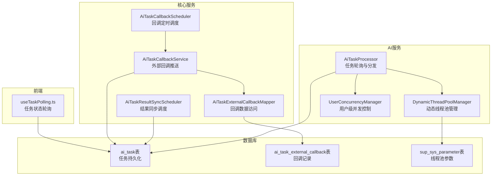
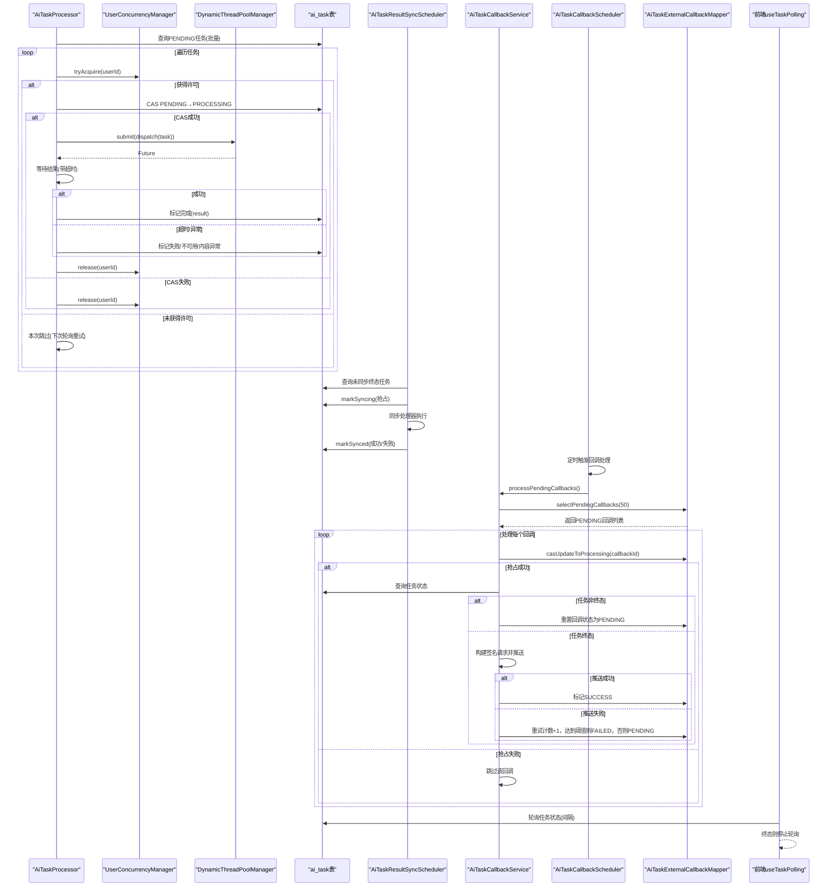
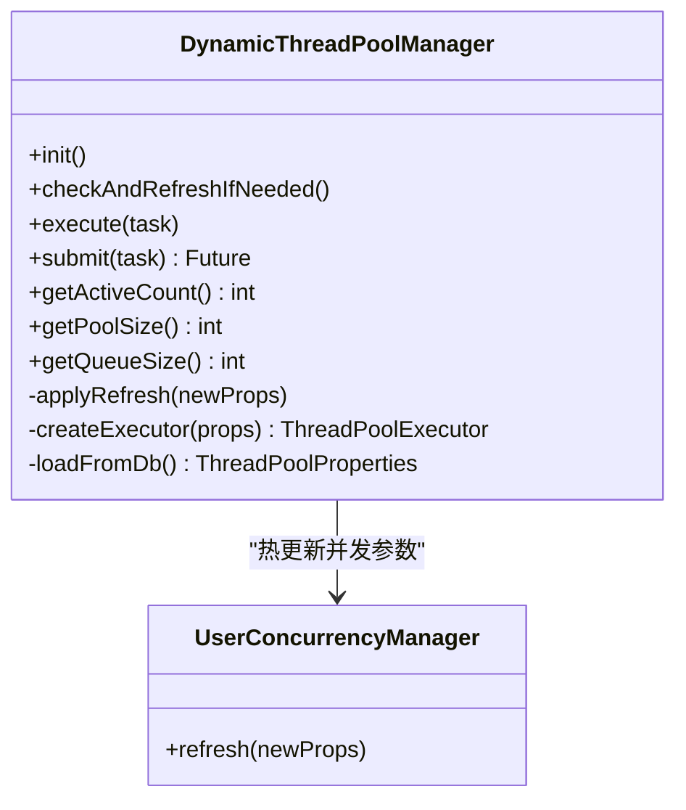
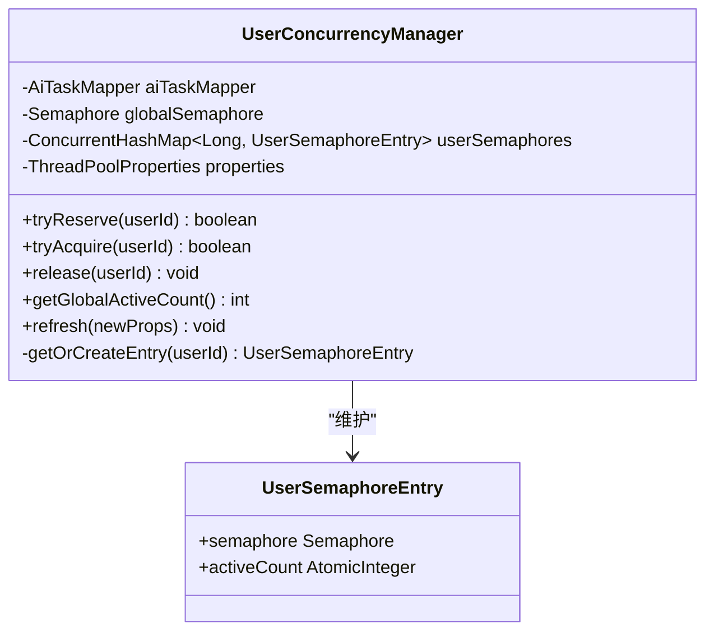
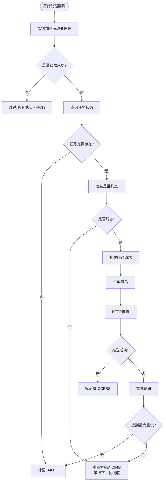
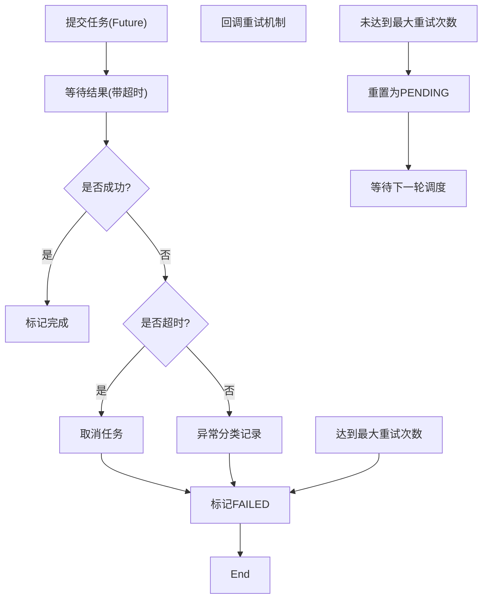
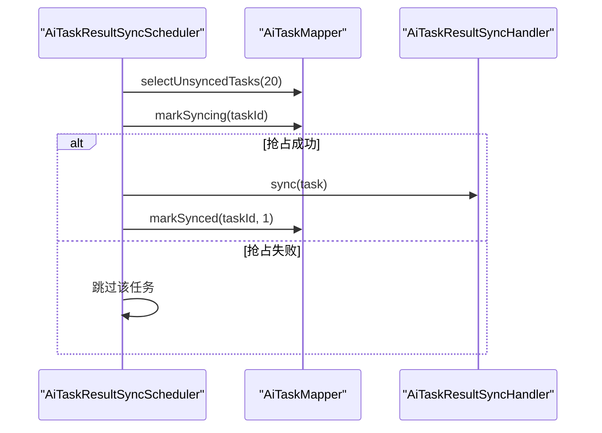
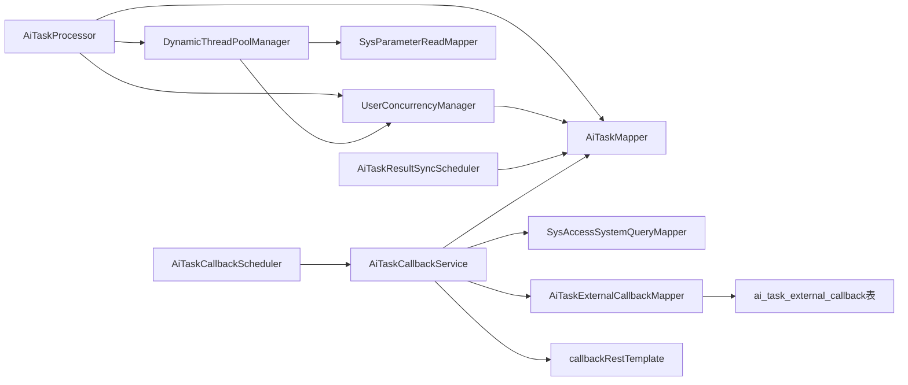

# AI任务调度

<cite>
**本文引用的文件**   
- [AiTaskProcessor.java](file://ele-ai-tender-system/ele-ai-tender-ai/src/main/java/com/jy/eleaitender/ai/processor/AiTaskProcessor.java)
- [DynamicThreadPoolManager.java](file://ele-ai-tender-system/ele-ai-tender-ai/src/main/java/com/jy/eleaitender/ai/threadpool/DynamicThreadPoolManager.java)
- [UserConcurrencyManager.java](file://ele-ai-tender-system/ele-ai-tender-ai/src/main/java/com/jy/eleaitender/ai/threadpool/UserConcurrencyManager.java)
- [AiTaskResultSyncScheduler.java](file://ele-ai-tender-system/ele-ai-tender-core/src/main/java/com/jy/eleaitender/core/scheduler/AiTaskResultSyncScheduler.java)
- [AiTaskCallbackService.java](file://ele-ai-tender-system/ele-ai-tender-core/src/main/java/com/jy/eleaitender/core/service/external/AiTaskCallbackService.java)
- [AiTaskExternalCallbackMapper.java](file://ele-ai-tender-system/ele-ai-tender-core/src/main/java/com/jy/eleaitender/core/mapper/AiTaskExternalCallbackMapper.java)
- [AiTaskCallbackScheduler.java](file://ele-ai-tender-system/ele-ai-tender-core/src/main/java/com/jy/eleaitender/core/scheduler/AiTaskCallbackScheduler.java)
- [CallbackRestTemplateConfig.java](file://ele-ai-tender-system/ele-ai-tender-core/src/main/java/com/jy/eleaitender/core/config/CallbackRestTemplateConfig.java)
- [AiTaskExternalCallback.java](file://ele-ai-tender-system/ele-ai-tender-common/src/main/java/com/jy/eleaitender/common/entity/ai/AiTaskExternalCallback.java)
- [AiTaskResultCallbackRequest.java](file://ele-ai-tender-system/ele-ai-tender-common-interaction/src/main/java/com/jy/eleaitender/common/interaction/dto/AiTaskResultCallbackRequest.java)
- [init.sql](file://ele-ai-tender-system/ele-ai-tender-core/sql/init.sql)
- [useTaskPolling.ts](file://ele-ai-tender-frontend/src/composables/useTaskPolling.ts)
</cite>

## 更新摘要
**变更内容**   
- 更新了外部回调处理机制，改进了非终态任务状态的处理逻辑
- 增强了回调可靠性，避免回调记录卡在PROCESSING状态
- 优化了回调查询性能，增加按创建时间排序的索引支持
- 完善了回调重试机制和错误处理流程

## 目录
1. [简介](#简介)
2. [项目结构](#项目结构)
3. [核心组件](#核心组件)
4. [架构总览](#架构总览)
5. [详细组件分析](#详细组件分析)
6. [依赖关系分析](#依赖关系分析)
7. [性能与资源特性](#性能与资源特性)
8. [故障排查指南](#故障排查指南)
9. [结论](#结论)
10. [附录](#附录)

## 简介
本文件面向AI任务调度系统，聚焦于基于动态线程池的任务分发与并发控制实现。内容覆盖：
- 任务队列管理与负载均衡策略
- AiTaskProcessor的任务轮询机制与Dispatch分发逻辑
- DynamicThreadPoolManager的动态线程池配置与热更新
- UserConcurrencyManager的用户级并发控制
- 任务优先级、超时处理与失败重试机制
- 任务执行监控、性能统计与资源使用分析
- 与核心服务的事件同步与状态管理机制
- **新增**：外部回调服务的可靠性改进与非终态任务处理优化

## 项目结构
AI任务调度相关代码主要分布在以下模块：
- AI服务模块（ele-ai-tender-ai）：包含任务处理器、动态线程池与并发控制
- 核心服务模块（ele-ai-tender-core）：包含结果同步调度器与回调推送服务
- 前端（ele-ai-tender-frontend）：提供任务状态轮询能力

**图表来源**
- [AiTaskProcessor.java:1-196](file://ele-ai-tender-system/ele-ai-tender-ai/src/main/java/com/jy/eleaitender/ai/processor/AiTaskProcessor.java#L1-L196)
- [DynamicThreadPoolManager.java:1-190](file://ele-ai-tender-system/ele-ai-tender-ai/src/main/java/com/jy/eleaitender/ai/threadpool/DynamicThreadPoolManager.java#L1-L190)
- [UserConcurrencyManager.java:1-131](file://ele-ai-tender-system/ele-ai-tender-ai/src/main/java/com/jy/eleaitender/ai/threadpool/UserConcurrencyManager.java#L1-L131)
- [AiTaskResultSyncScheduler.java:1-64](file://ele-ai-tender-system/ele-ai-tender-core/src/main/java/com/jy/eleaitender/core/scheduler/AiTaskResultSyncScheduler.java#L1-L64)
- [AiTaskCallbackService.java:32-190](file://ele-ai-tender-system/ele-ai-tender-core/src/main/java/com/jy/eleaitender/core/service/external/AiTaskCallbackService.java#L32-L190)
- [AiTaskCallbackScheduler.java:1-36](file://ele-ai-tender-system/ele-ai-tender-core/src/main/java/com/jy/eleaitender/core/scheduler/AiTaskCallbackScheduler.java#L1-L36)
- [AiTaskExternalCallbackMapper.java:15-30](file://ele-ai-tender-system/ele-ai-tender-core/src/main/java/com/jy/eleaitender/core/mapper/AiTaskExternalCallbackMapper.java#L15-L30)
- [init.sql:251-272](file://ele-ai-tender-system/ele-ai-tender-core/sql/init.sql#L251-L272)
- [useTaskPolling.ts:1-48](file://ele-ai-tender-frontend/src/composables/useTaskPolling.ts#L1-L48)

## 核心组件
- AiTaskProcessor：定时轮询待处理任务，进行并发许可获取、状态CAS变更与任务分发；支持直接提交与带并发控制的提交路径。
- DynamicThreadPoolManager：从数据库加载线程池参数，运行时热更新核心/最大线程数、队列容量与存活时间；暴露execute/submit接口供任务执行。
- UserConcurrencyManager：维护全局与用户级信号量，限制并发执行数量；支持热更新并发上限并保证刷新后并发控制不失效。
- AiTaskResultSyncScheduler：定期扫描已完成但未同步的任务，安全抢占后调用同步处理器完成业务表落库。
- **AiTaskCallbackService**：对外部系统进行回调推送，具备重试与失败标记能力，**现已改进为非终态任务正确处理**。
- **AiTaskCallbackScheduler**：定时调度器，周期性触发回调处理任务。
- **AiTaskExternalCallbackMapper**：回调记录的CRUD操作，**已优化查询性能**。
- 前端useTaskPolling：周期性查询任务状态，在终态时停止轮询。

**章节来源**
- [AiTaskProcessor.java:1-196](file://ele-ai-tender-system/ele-ai-tender-ai/src/main/java/com/jy/eleaitender/ai/processor/AiTaskProcessor.java#L1-L196)
- [DynamicThreadPoolManager.java:1-190](file://ele-ai-tender-system/ele-ai-tender-ai/src/main/java/com/jy/eleaitender/ai/threadpool/DynamicThreadPoolManager.java#L1-L190)
- [UserConcurrencyManager.java:1-131](file://ele-ai-tender-system/ele-ai-tender-ai/src/main/java/com/jy/eleaitender/ai/threadpool/UserConcurrencyManager.java#L1-L131)
- [AiTaskResultSyncScheduler.java:1-64](file://ele-ai-tender-system/ele-ai-tender-core/src/main/java/com/jy/eleaitender/core/scheduler/AiTaskResultSyncScheduler.java#L1-L64)
- [AiTaskCallbackService.java:32-190](file://ele-ai-tender-system/ele-ai-tender-core/src/main/java/com/jy/eleaitender/core/service/external/AiTaskCallbackService.java#L32-L190)
- [AiTaskCallbackScheduler.java:1-36](file://ele-ai-tender-system/ele-ai-tender-core/src/main/java/com/jy/eleaitender/core/scheduler/AiTaskCallbackScheduler.java#L1-L36)
- [AiTaskExternalCallbackMapper.java:15-30](file://ele-ai-tender-system/ele-ai-tender-core/src/main/java/com/jy/eleaitender/core/mapper/AiTaskExternalCallbackMapper.java#L15-L30)
- [useTaskPolling.ts:1-48](file://ele-ai-tender-frontend/src/composables/useTaskPolling.ts#L1-L48)

## 架构总览
整体流程包括：
- 任务拉取与并发控制：AiTaskProcessor每5秒拉取PENDING任务，先尝试获取用户级与全局并发许可，再CAS将状态由PENDING改为PROCESSING，随后提交到动态线程池执行。
- 任务执行与超时：通过Future.get设置任务超时，异常分类记录为不可用、内容异常或失败。
- 结果同步与回调：核心服务定时扫描未同步的终态任务，安全抢占后执行同步；同时对外部系统进行回调推送，**现已改进为非终态任务重置为PENDING状态，避免卡死**。
- 前端轮询：前端周期查询任务状态，在终态时停止轮询。

**图表来源**
- [AiTaskProcessor.java:60-167](file://ele-ai-tender-system/ele-ai-tender-ai/src/main/java/com/jy/eleaitender/ai/processor/AiTaskProcessor.java#L60-L167)
- [UserConcurrencyManager.java:63-88](file://ele-ai-tender-system/ele-ai-tender-ai/src/main/java/com/jy/eleaitender/ai/threadpool/UserConcurrencyManager.java#L63-L88)
- [DynamicThreadPoolManager.java:87-96](file://ele-ai-tender-system/ele-ai-tender-ai/src/main/java/com/jy/eleaitender/ai/threadpool/DynamicThreadPoolManager.java#L87-L96)
- [AiTaskResultSyncScheduler.java:29-62](file://ele-ai-tender-system/ele-ai-tender-core/src/main/java/com/jy/eleaitender/core/scheduler/AiTaskResultSyncScheduler.java#L29-L62)
- [AiTaskCallbackService.java:58-190](file://ele-ai-tender-system/ele-ai-tender-core/src/main/java/com/jy/eleaitender/core/service/external/AiTaskCallbackService.java#L58-L190)
- [AiTaskCallbackScheduler.java:24-34](file://ele-ai-tender-system/ele-ai-tender-core/src/main/java/com/jy/eleaitender/core/scheduler/AiTaskCallbackScheduler.java#L24-L34)
- [AiTaskExternalCallbackMapper.java:21-29](file://ele-ai-tender-system/ele-ai-tender-core/src/main/java/com/jy/eleaitender/core/mapper/AiTaskExternalCallbackMapper.java#L21-L29)
- [useTaskPolling.ts:11-48](file://ele-ai-tender-frontend/src/composables/useTaskPolling.ts#L11-L48)

## 详细组件分析

### AiTaskProcessor：任务轮询与分发
- 轮询策略：固定延迟5秒拉取最多10条PENDING任务。
- 并发控制：
  - 无用户ID任务走直接提交路径，不经过用户级并发控制。
  - 有用户ID任务先tryAcquire获取用户级与全局并发许可，再CAS改状态为PROCESSING，避免并发弹跳。
- 任务提交：
  - 直接提交：无返回值，异常分类记录。
  - 带并发控制提交：Future.get设置超时，异常分类记录，finally释放并发许可。
- 分发逻辑：根据任务类型分派至文本优化、需求生成、评审项生成、文档集成、检测引擎等处理器。

```mermaid
flowchart TD
Start(["进入processPendingTasks"]) --> Fetch["查询PENDING任务(最多10条)"]
Fetch --> Empty{"是否为空?"}
Empty --> |是| End(["结束"])
Empty --> |否| Loop["遍历任务"]
Loop --> HasUser{"是否有userId?"}
HasUser --> |否| Direct["casUpdateStatus(PENDING→PROCESSING)<br/>submitDirectly()"]
HasUser --> |是| Acquire["concurrencyManager.tryAcquire(userId)"]
Acquire --> Acquired{"是否获得许可?"}
Acquired --> |否| Skip["跳过(排队等待)"] --> Next["下一个任务"]
Acquired --> |是| Cas["casUpdateStatus(PENDING→PROCESSING)"]
Cas --> CasOk{"CAS成功?"}
CasOk --> |否| Release["release(userId)"] --> Next
CasOk --> |是| Submit["submitWithConcurrencyControl(task)"]
Submit --> Next
Next --> Loop
Loop --> End
```

**图表来源**
- [AiTaskProcessor.java:60-101](file://ele-ai-tender-system/ele-ai-tender-ai/src/main/java/com/jy/eleaitender/ai/processor/AiTaskProcessor.java#L60-L101)
- [AiTaskProcessor.java:106-125](file://ele-ai-tender-system/ele-ai-tender-ai/src/main/java/com/jy/eleaitender/ai/processor/AiTaskProcessor.java#L106-L125)
- [AiTaskProcessor.java:130-167](file://ele-ai-tender-system/ele-ai-tender-ai/src/main/java/com/jy/eleaitender/ai/processor/AiTaskProcessor.java#L130-L167)

**章节来源**
- [AiTaskProcessor.java:60-167](file://ele-ai-tender-system/ele-ai-tender-ai/src/main/java/com/jy/eleaitender/ai/processor/AiTaskProcessor.java#L60-L167)

### DynamicThreadPoolManager：动态线程池与热更新
- 初始化：启动时从数据库加载线程池参数，创建线程池实例。
- 热更新：每10秒轮询数据库参数Hash变化，若变更则应用新配置：
  - 队列容量变更：重建线程池，优雅关闭旧实例。
  - 其他参数：动态调整核心/最大线程数与存活时间。
- 并发控制联动：热更新时通知UserConcurrencyManager刷新并发上限。
- 任务提交：提供execute与submit接口，内部使用CallerRunsPolicy作为拒绝策略。

**图表来源**
- [DynamicThreadPoolManager.java:46-82](file://ele-ai-tender-system/ele-ai-tender-ai/src/main/java/com/jy/eleaitender/ai/threadpool/DynamicThreadPoolManager.java#L46-L82)
- [DynamicThreadPoolManager.java:113-145](file://ele-ai-tender-system/ele-ai-tender-ai/src/main/java/com/jy/eleaitender/ai/threadpool/DynamicThreadPoolManager.java#L113-145)
- [DynamicThreadPoolManager.java:147-161](file://ele-ai-tender-system/ele-ai-tender-ai/src/main/java/com/jy/eleaitender/ai/threadpool/DynamicThreadPoolManager.java#L147-L161)
- [DynamicThreadPoolManager.java:166-187](file://ele-ai-tender-system/ele-ai-tender-ai/src/main/java/com/jy/eleaitender/ai/threadpool/DynamicThreadPoolManager.java#L166-L187)
- [UserConcurrencyManager.java:105-116](file://ele-ai-tender-system/ele-ai-tender-ai/src/main/java/com/jy/eleaitender/ai/threadpool/UserConcurrencyManager.java#L105-L116)

**章节来源**
- [DynamicThreadPoolManager.java:46-187](file://ele-ai-tender-system/ele-ai-tender-ai/src/main/java/com/jy/eleaitender/ai/threadpool/DynamicThreadPoolManager.java#L46-L187)

### UserConcurrencyManager：用户级并发控制
- 并发模型：
  - 全局Semaphore：限制全局并发执行数量。
  - 用户级Semaphore：按用户维度限制并发执行数量。
- 许可获取：先尝试用户级许可，再尝试全局许可；任一失败均返回false，表示需要排队等待。
- 许可释放：任务完成后释放用户级与全局许可。
- 热更新：根据当前活跃数计算新的全局许可数，确保刷新后并发控制不失效。

**图表来源**
- [UserConcurrencyManager.java:23-35](file://ele-ai-tender-system/ele-ai-tender-ai/src/main/java/com/jy/eleaitender/ai/threadpool/UserConcurrencyManager.java#L23-L35)
- [UserConcurrencyManager.java:63-88](file://ele-ai-tender-system/ele-ai-tender-ai/src/main/java/com/jy/eleaitender/ai/threadpool/UserConcurrencyManager.java#L63-L88)
- [UserConcurrencyManager.java:105-123](file://ele-ai-tender-system/ele-ai-tender-ai/src/main/java/com/jy/eleaitender/ai/threadpool/UserConcurrencyManager.java#L105-L123)

**章节来源**
- [UserConcurrencyManager.java:23-123](file://ele-ai-tender-system/ele-ai-tender-ai/src/main/java/com/jy/eleaitender/ai/threadpool/UserConcurrencyManager.java#L23-L123)

### 外部回调服务增强与可靠性改进

**更新** 外部回调服务现在正确处理非终态任务状态，避免回调记录卡在PROCESSING状态。

#### AiTaskCallbackService：智能回调处理
- **改进的非终态处理**：当检测到任务未到终态时，不再跳过处理，而是将回调状态重置为PENDING，等待下一轮调度。
- **CAS加锁机制**：防止多实例重复处理同一回调记录。
- **智能重试策略**：根据重试次数自动决定标记为FAILED或重置为PENDING继续重试。
- **完整的错误处理**：记录详细的错误信息，便于问题追踪。

#### AiTaskCallbackScheduler：定时调度器
- 可配置的调度间隔，默认10秒执行一次。
- 支持开关控制，可通过配置禁用回调功能。
- 异常保护，确保调度器自身稳定性。

#### AiTaskExternalCallbackMapper：性能优化
- **查询优化**：增加`ORDER BY create_time ASC`确保按创建时间顺序处理。
- **索引支持**：数据库表包含`idx_callback_status`和`idx_task_id`索引。
- **乐观锁机制**：使用版本号防止并发更新冲突。

**图表来源**
- [AiTaskCallbackService.java:74-140](file://ele-ai-tender-system/ele-ai-tender-core/src/main/java/com/jy/eleaitender/core/service/external/AiTaskCallbackService.java#L74-L140)
- [AiTaskCallbackService.java:167-185](file://ele-ai-tender-system/ele-ai-tender-core/src/main/java/com/jy/eleaitender/core/service/external/AiTaskCallbackService.java#L167-L185)
- [AiTaskExternalCallbackMapper.java:21-29](file://ele-ai-tender-system/ele-ai-tender-core/src/main/java/com/jy/eleaitender/core/mapper/AiTaskExternalCallbackMapper.java#L21-L29)

**章节来源**
- [AiTaskCallbackService.java:58-190](file://ele-ai-tender-system/ele-ai-tender-core/src/main/java/com/jy/eleaitender/core/service/external/AiTaskCallbackService.java#L58-L190)
- [AiTaskCallbackScheduler.java:1-36](file://ele-ai-tender-system/ele-ai-tender-core/src/main/java/com/jy/eleaitender/core/scheduler/AiTaskCallbackScheduler.java#L1-L36)
- [AiTaskExternalCallbackMapper.java:15-30](file://ele-ai-tender-system/ele-ai-tender-core/src/main/java/com/jy/eleaitender/core/mapper/AiTaskExternalCallbackMapper.java#L15-L30)

### 任务优先级与负载均衡
- 优先级：当前实现未显式实现优先级队列，任务按数据库查询顺序拉取，可通过扩展AiTaskMapper的查询排序字段实现优先级。
- 负载均衡：
  - 多实例部署下，CAS状态更新避免重复执行。
  - 用户级并发控制防止单用户独占资源。
  - 全局并发控制保障系统整体吞吐稳定。

**章节来源**
- [AiTaskProcessor.java:91-96](file://ele-ai-tender-system/ele-ai-tender-ai/src/main/java/com/jy/eleaitender/ai/processor/AiTaskProcessor.java#L91-L96)
- [UserConcurrencyManager.java:63-88](file://ele-ai-tender-system/ele-ai-tender-ai/src/main/java/com/jy/eleaitender/ai/threadpool/UserConcurrencyManager.java#L63-L88)

### 超时处理与失败重试
- 超时处理：
  - 任务提交时使用Future.get设置超时分钟数，支持任务级timeoutMinutes覆盖默认值。
  - 超时时取消任务并标记失败。
- 失败重试：
  - 任务执行层未内置重试逻辑，但外部回调推送具备重试计数与失败标记。
  - 对于AI服务不可用与内容异常，分别记录不同错误类型以便后续处理。
  - **新增**：回调重试达到最大次数后标记为FAILED，未达最大次数则重置为PENDING继续重试。

**图表来源**
- [AiTaskProcessor.java:130-167](file://ele-ai-tender-system/ele-ai-tender-ai/src/main/java/com/jy/eleaitender/ai/processor/AiTaskProcessor.java#L130-L167)
- [AiTaskCallbackService.java:167-185](file://ele-ai-tender-system/ele-ai-tender-core/src/main/java/com/jy/eleaitender/core/service/external/AiTaskCallbackService.java#L167-L185)

**章节来源**
- [AiTaskProcessor.java:130-167](file://ele-ai-tender-system/ele-ai-tender-ai/src/main/java/com/jy/eleaitender/ai/processor/AiTaskProcessor.java#L130-L167)
- [AiTaskCallbackService.java:167-185](file://ele-ai-tender-system/ele-ai-tender-core/src/main/java/com/jy/eleaitender/core/service/external/AiTaskCallbackService.java#L167-L185)

### 任务执行监控、性能统计与资源使用分析
- 线程池指标：
  - 活跃线程数、池大小、队列长度可通过DynamicThreadPoolManager提供的接口获取。
- 并发控制指标：
  - 全局活跃任务数可通过UserConcurrencyManager获取。
- 前端展示：
  - 前端通过useTaskPolling轮询任务状态，结合终态判断停止轮询。
- **新增**：回调监控
  - 回调重试次数、最后回调时间、错误信息均可通过回调记录表查询。
  - 支持按回调状态筛选和统计。

**章节来源**
- [DynamicThreadPoolManager.java:98-108](file://ele-ai-tender-system/ele-ai-tender-ai/src/main/java/com/jy/eleaitender/ai/threadpool/DynamicThreadPoolManager.java#L98-L108)
- [UserConcurrencyManager.java:93-99](file://ele-ai-tender-system/ele-ai-tender-ai/src/main/java/com/jy/eleaitender/ai/threadpool/UserConcurrencyManager.java#L93-L99)
- [useTaskPolling.ts:11-48](file://ele-ai-tender-frontend/src/composables/useTaskPolling.ts#L11-L48)
- [AiTaskExternalCallback.java:18-37](file://ele-ai-tender-system/ele-ai-tender-common/src/main/java/com/jy/eleaitender/common/entity/ai/AiTaskExternalCallback.java#L18-L37)

### 事件同步与状态管理（与核心服务）
- 结果同步：
  - AiTaskResultSyncScheduler定时扫描未同步的终态任务，使用markSyncing进行安全抢占，成功后调用同步处理器，最终标记同步成功或失败。
- 外部回调：
  - AiTaskCallbackService查询终态任务，构建签名请求并推送至外部系统，记录回调状态与重试次数。
  - **改进**：非终态任务回调会重置为PENDING状态，避免卡死。

**图表来源**
- [AiTaskResultSyncScheduler.java:29-62](file://ele-ai-tender-system/ele-ai-tender-core/src/main/java/com/jy/eleaitender/core/scheduler/AiTaskResultSyncScheduler.java#L29-L62)

**章节来源**
- [AiTaskResultSyncScheduler.java:29-62](file://ele-ai-tender-system/ele-ai-tender-core/src/main/java/com/jy/eleaitender/core/scheduler/AiTaskResultSyncScheduler.java#L29-L62)
- [AiTaskCallbackService.java:58-190](file://ele-ai-tender-system/ele-ai-tender-core/src/main/java/com/jy/eleaitender/core/service/external/AiTaskCallbackService.java#L58-L190)

## 依赖关系分析
- AiTaskProcessor依赖：
  - AiTaskMapper：任务CRUD与状态更新
  - DynamicThreadPoolManager：任务执行与指标
  - UserConcurrencyManager：并发控制
  - 各处理器：文本优化、需求生成、评审项生成、文档集成、检测引擎
- DynamicThreadPoolManager依赖：
  - SysParameterReadMapper：读取线程池参数
  - UserConcurrencyManager：热更新并发控制
- UserConcurrencyManager依赖：
  - AiTaskMapper：发起数统计（预留方法）
- 核心服务依赖：
  - AiTaskResultSyncScheduler依赖AiTaskMapper与AiTaskResultSyncHandler
  - **AiTaskCallbackService**依赖AiTaskMapper、SysAccessSystemQueryMapper、RestTemplate与AiTaskExternalCallbackMapper
  - **AiTaskCallbackScheduler**依赖AiTaskCallbackService
  - **AiTaskExternalCallbackMapper**依赖数据库回调记录表

**图表来源**
- [AiTaskProcessor.java:33-55](file://ele-ai-tender-system/ele-ai-tender-ai/src/main/java/com/jy/eleaitender/ai/processor/AiTaskProcessor.java#L33-L55)
- [DynamicThreadPoolManager.java:33-38](file://ele-ai-tender-system/ele-ai-tender-ai/src/main/java/com/jy/eleaitender/ai/threadpool/DynamicThreadPoolManager.java#L33-L38)
- [UserConcurrencyManager.java:25-35](file://ele-ai-tender-system/ele-ai-tender-ai/src/main/java/com/jy/eleaitender/ai/threadpool/UserConcurrencyManager.java#L25-L35)
- [AiTaskResultSyncScheduler.java:20-24](file://ele-ai-tender-system/ele-ai-tender-core/src/main/java/com/jy/eleaitender/core/scheduler/AiTaskResultSyncScheduler.java#L20-L24)
- [AiTaskCallbackService.java:39-50](file://ele-ai-tender-system/ele-ai-tender-core/src/main/java/com/jy/eleaitender/core/service/external/AiTaskCallbackService.java#L39-L50)
- [AiTaskCallbackScheduler.java:18-19](file://ele-ai-tender-system/ele-ai-tender-core/src/main/java/com/jy/eleaitender/core/scheduler/AiTaskCallbackScheduler.java#L18-L19)
- [AiTaskExternalCallbackMapper.java:15-16](file://ele-ai-tender-system/ele-ai-tender-core/src/main/java/com/jy/eleaitender/core/mapper/AiTaskExternalCallbackMapper.java#L15-L16)

**章节来源**
- [AiTaskProcessor.java:33-55](file://ele-ai-tender-system/ele-ai-tender-ai/src/main/java/com/jy/eleaitender/ai/processor/AiTaskProcessor.java#L33-L55)
- [DynamicThreadPoolManager.java:33-38](file://ele-ai-tender-system/ele-ai-tender-ai/src/main/java/com/jy/eleaitender/ai/threadpool/DynamicThreadPoolManager.java#L33-L38)
- [UserConcurrencyManager.java:25-35](file://ele-ai-tender-system/ele-ai-tender-ai/src/main/java/com/jy/eleaitender/ai/threadpool/UserConcurrencyManager.java#L25-L35)
- [AiTaskResultSyncScheduler.java:20-24](file://ele-ai-tender-system/ele-ai-tender-core/src/main/java/com/jy/eleaitender/core/scheduler/AiTaskResultSyncScheduler.java#L20-L24)
- [AiTaskCallbackService.java:39-50](file://ele-ai-tender-system/ele-ai-tender-core/src/main/java/com/jy/eleaitender/core/service/external/AiTaskCallbackService.java#L39-L50)
- [AiTaskCallbackScheduler.java:18-19](file://ele-ai-tender-system/ele-ai-tender-core/src/main/java/com/jy/eleaitender/core/scheduler/AiTaskCallbackScheduler.java#L18-L19)
- [AiTaskExternalCallbackMapper.java:15-16](file://ele-ai-tender-system/ele-ai-tender-core/src/main/java/com/jy/eleaitender/core/mapper/AiTaskExternalCallbackMapper.java#L15-L16)

## 性能与资源特性
- 线程池参数：
  - 核心/最大线程数、队列容量、存活时间均可热更新。
  - CallerRunsPolicy作为拒绝策略，有助于在高负载时回压上游。
- 并发控制：
  - 用户级与全局并发信号量可热更新，刷新时考虑当前活跃数，避免并发失控。
- 任务超时：
  - 支持任务级超时覆盖，避免长尾任务占用资源。
- 指标采集：
  - 活跃线程数、池大小、队列长度、全局活跃任务数可用于监控告警。
- **新增**：回调性能优化
  - 回调查询增加按创建时间排序，确保处理顺序性。
  - 数据库索引优化，提升查询性能。
  - 批量处理机制，每次最多处理50条回调记录。

## 故障排查指南
- 任务无法执行：
  - 检查并发控制是否已满：查看用户级与全局信号量使用情况。
  - 检查CAS状态更新是否被抢占：确认是否存在多实例竞争。
- 任务超时：
  - 核对任务级timeoutMinutes与默认超时配置。
  - 观察线程池活跃数与队列长度，评估是否需要扩容。
- 结果未同步：
  - 查看AiTaskResultSyncScheduler日志，确认markSyncing是否成功。
  - 检查同步处理器异常与markSynced标记状态。
- **外部回调失败**：
  - 查看AiTaskCallbackService重试计数与错误信息。
  - 校验外部系统URL、密钥与签名是否正确。
  - **新增**：检查回调状态是否为PENDING，避免卡在PROCESSING状态。
  - **新增**：确认任务是否到达终态，非终态任务会自动重置回调状态。
- **新增**：回调处理异常
  - 检查AiTaskCallbackScheduler是否正常运行。
  - 查看回调记录表的create_time字段，确认按时间顺序处理。
  - 验证数据库索引idx_callback_status和idx_task_id是否存在。

**章节来源**
- [AiTaskProcessor.java:130-167](file://ele-ai-tender-system/ele-ai-tender-ai/src/main/java/com/jy/eleaitender/ai/processor/AiTaskProcessor.java#L130-L167)
- [AiTaskResultSyncScheduler.java:45-62](file://ele-ai-tender-system/ele-ai-tender-core/src/main/java/com/jy/eleaitender/core/scheduler/AiTaskResultSyncScheduler.java#L45-L62)
- [AiTaskCallbackService.java:167-185](file://ele-ai-tender-system/ele-ai-tender-core/src/main/java/com/jy/eleaitender/core/service/external/AiTaskCallbackService.java#L167-L185)
- [AiTaskCallbackScheduler.java:24-34](file://ele-ai-tender-system/ele-ai-tender-core/src/main/java/com/jy/eleaitender/core/scheduler/AiTaskCallbackScheduler.java#L24-L34)
- [AiTaskExternalCallbackMapper.java:21-29](file://ele-ai-tender-system/ele-ai-tender-core/src/main/java/com/jy/eleaitender/core/mapper/AiTaskExternalCallbackMapper.java#L21-L29)

## 结论
本调度系统通过动态线程池与用户级并发控制实现了高可用、可扩展的AI任务处理能力。任务轮询、并发许可、状态CAS与超时控制共同保障了系统的稳定性与公平性。结果同步与外部回调机制完善了端到端闭环。**最新的回调服务改进显著提升了系统可靠性，正确处理非终态任务状态，避免了回调记录卡死的问题，并通过查询优化提升了整体性能**。建议后续引入任务优先级队列与更丰富的监控指标，以进一步提升调度效率与可观测性。

## 附录
- 数据模型要点：
  - ai_task表包含status、result、error_msg、completed_at、timeout_minutes等关键字段，用于任务生命周期管理与结果持久化。
  - **新增**：ai_task_external_callback表包含callback_status、retry_count、last_callback_time、error_msg等字段，用于外部回调记录与重试管理。
  - **新增**：回调表包含create_time字段，支持按创建时间排序查询。

**章节来源**
- [init.sql:251-272](file://ele-ai-tender-system/ele-ai-tender-core/sql/init.sql#L251-L272)
- [AiTaskExternalCallback.java:18-37](file://ele-ai-tender-system/ele-ai-tender-common/src/main/java/com/jy/eleaitender/common/entity/ai/AiTaskExternalCallback.java#L18-L37)