# AI功能集成

<cite>
**本文引用的文件**
- [AiApplication.java](file://ele-ai-tender-system/ele-ai-tender-ai/src/main/java/com/jy/eleaitender/ai/AiApplication.java)
- [pom.xml](file://ele-ai-tender-system/ele-ai-tender-ai/pom.xml)
- [application.yml](file://ele-ai-tender-system/ele-ai-tender-ai/src/main/resources/application.yml)
</cite>

## 目录
1. [简介](#简介)
2. [项目结构](#项目结构)
3. [核心组件](#核心组件)
4. [架构总览](#架构总览)
5. [详细组件分析](#详细组件分析)
6. [依赖分析](#依赖分析)
7. [性能考虑](#性能考虑)
8. [故障排查指南](#故障排查指南)
9. [结论](#结论)
10. [附录](#附录)

## 简介
本文件面向“招标文件AI编制系统”的AI能力集成，聚焦基于Spring AI 1.1.0的智能处理实现。文档覆盖多模型路由机制、提示词工程、向量知识库构建与检索、AI任务调度、智能文档生成（需求分析、内容生成、格式优化、质量检测）、模型配置管理与动态切换策略、性能监控方案、与Milvus向量数据库的集成（文档向量化、相似度检索、知识图谱构建思路）、异步调用与回调、错误重试与成本控制，以及扩展与自定义模型接入方法。

## 项目结构
AI服务模块采用Spring Boot应用形态，提供Web接口、AI能力编排、任务调度、向量检索等能力；通过Maven管理依赖，引入Spring AI OpenAI/ZhiPuAI启动器、Tika文档解析、Milvus SDK等关键组件。

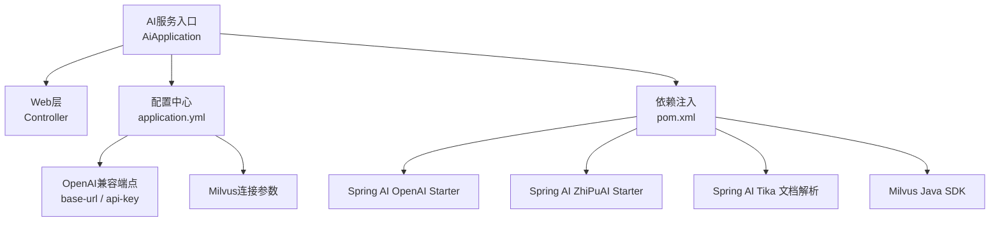

图表来源
- [AiApplication.java:1-26](file://ele-ai-tender-system/ele-ai-tender-ai/src/main/java/com/jy/eleaitender/ai/AiApplication.java#L1-L26)
- [pom.xml:81-104](file://ele-ai-tender-system/ele-ai-tender-ai/pom.xml#L81-L104)
- [application.yml:28-54](file://ele-ai-tender-system/ele-ai-tender-ai/src/main/resources/application.yml#L28-L54)

章节来源
- [AiApplication.java:1-26](file://ele-ai-tender-system/ele-ai-tender-ai/src/main/java/com/jy/eleaitender/ai/AiApplication.java#L1-L26)
- [pom.xml:1-129](file://ele-ai-tender-system/ele-ai-tender-ai/pom.xml#L1-L129)
- [application.yml:1-72](file://ele-ai-tender-system/ele-ai-tender-ai/src/main/resources/application.yml#L1-L72)

## 核心组件
- 应用启动与装配：启用定时任务扫描、Mapper与组件包扫描，排除特定自动配置以避免冲突。
- 外部模型接入：通过Spring AI OpenAI/ZhiPuAI启动器统一接入不同大模型后端，使用OpenAI兼容协议进行对话与文本生成。
- 文档解析：借助Spring AI Tika Reader对多种办公文档进行结构化抽取，为后续向量化与生成提供素材。
- 向量检索：通过Milvus SDK建立向量索引，支撑相似性检索与知识增强。
- 运行时配置：集中化配置端口、数据源、Redis、AI端点、Milvus连接、JWT与内部文件服务地址等。

章节来源
- [AiApplication.java:12-18](file://ele-ai-tender-system/ele-ai-tender-ai/src/main/java/com/jy/eleaitender/ai/AiApplication.java#L12-L18)
- [pom.xml:81-104](file://ele-ai-tender-system/ele-ai-tender-ai/pom.xml#L81-L104)
- [application.yml:1-72](file://ele-ai-tender-system/ele-ai-tender-ai/src/main/resources/application.yml#L1-L72)

## 架构总览
整体架构围绕“请求入站—AI编排—模型路由—向量检索—结果回写”展开，结合任务调度与异步处理，形成高可用、可扩展的AI能力平台。

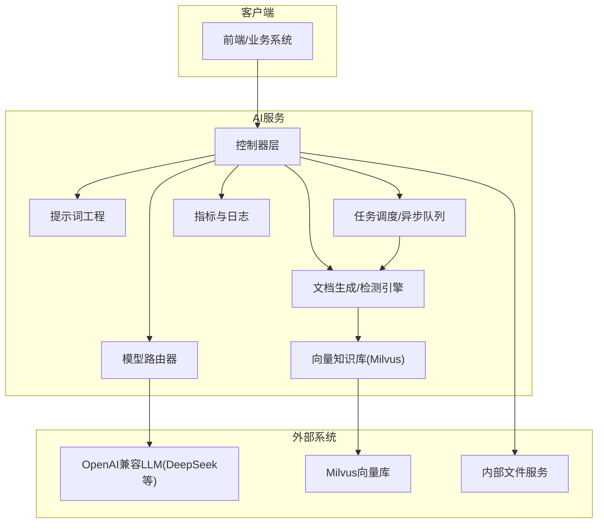

图表来源
- [application.yml:28-54](file://ele-ai-tender-system/ele-ai-tender-ai/src/main/resources/application.yml#L28-L54)
- [pom.xml:81-104](file://ele-ai-tender-system/ele-ai-tender-ai/pom.xml#L81-L104)

## 详细组件分析

### 多模型路由机制
- 目标：根据场景、成本、质量、可用性等因素动态选择最优模型。
- 设计要点：
  - 抽象统一的模型调用接口，屏蔽底层差异。
  - 维护模型清单与属性（能力、价格、配额、健康状态）。
  - 路由策略可插拔（按权重、按命中率、按延迟、按预算）。
  - 失败降级与熔断：当某模型不可用时自动切换到备选模型。
- 与Spring AI集成：
  - 通过OpenAI兼容客户端发起请求，便于接入多家厂商。
  - 在路由层封装重试、超时、限流与统计。

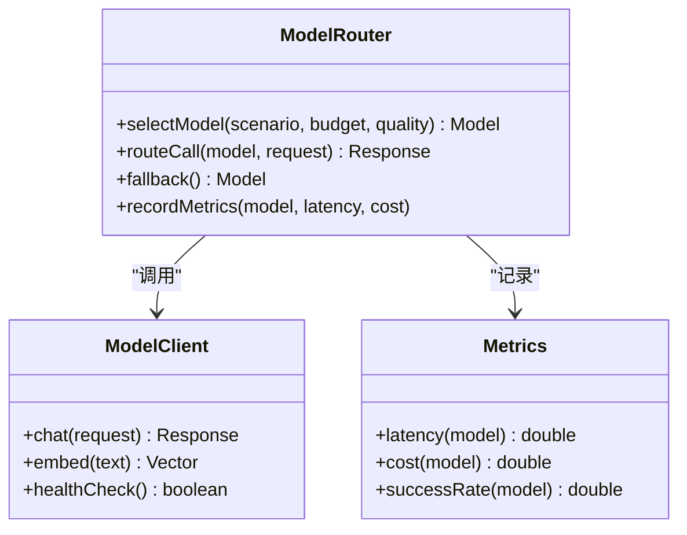

图表来源
- [pom.xml:81-91](file://ele-ai-tender-system/ele-ai-tender-ai/pom.xml#L81-L91)
- [application.yml:28-35](file://ele-ai-tender-system/ele-ai-tender-ai/src/main/resources/application.yml#L28-L35)

章节来源
- [pom.xml:81-91](file://ele-ai-tender-system/ele-ai-tender-ai/pom.xml#L81-L91)
- [application.yml:28-35](file://ele-ai-tender-system/ele-ai-tender-ai/src/main/resources/application.yml#L28-L35)

### 提示词工程
- 目标：将领域知识、模板与上下文组织为高质量Prompt，提升生成稳定性与一致性。
- 实践建议：
  - 分层Prompt：角色设定、任务描述、约束条件、输出格式。
  - 变量注入：项目名称、阶段信息、历史版本、规则集。
  - 安全过滤：敏感词、合规校验、越权访问拦截。
  - 评测回归：建立Prompt基准集，持续评估效果。

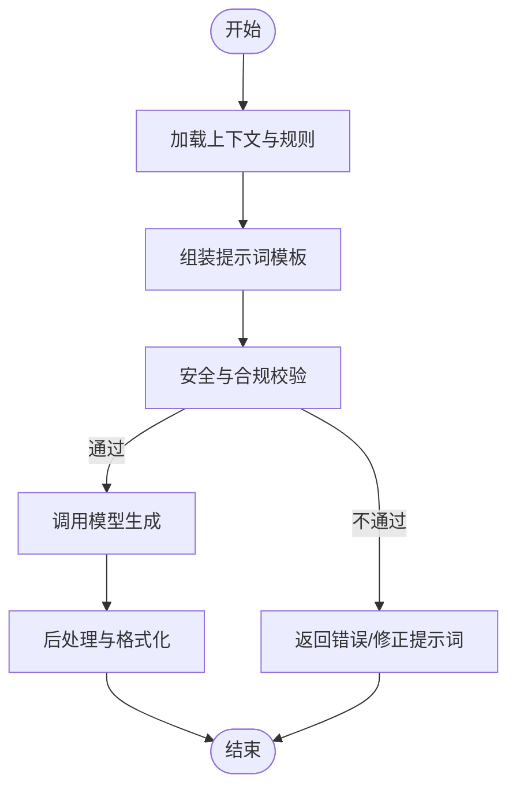

[本节为概念说明，无需代码来源]

### 向量知识库构建与检索（Milvus）
- 目标：将招标相关文档、制度规范、历史标书等转化为向量并入库，支持语义检索与知识增强。
- 流程：
  - 文档解析：使用Tika Reader提取文本与元数据。
  - 文本切分：按段落/主题/固定长度切块，保留引用来源。
  - 向量化：通过Embedding模型生成向量。
  - 入库：写入Milvus集合，建立索引。
  - 检索：按查询向量召回Top-K片段，拼接为上下文。
- 配置项：host、port、database等。

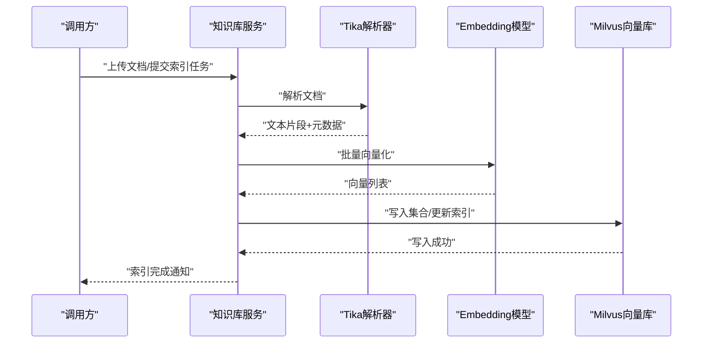

图表来源
- [pom.xml:92-104](file://ele-ai-tender-system/ele-ai-tender-ai/pom.xml#L92-L104)
- [application.yml:50-54](file://ele-ai-tender-system/ele-ai-tender-ai/src/main/resources/application.yml#L50-L54)

章节来源
- [pom.xml:92-104](file://ele-ai-tender-system/ele-ai-tender-ai/pom.xml#L92-L104)
- [application.yml:50-54](file://ele-ai-tender-system/ele-ai-tender-ai/src/main/resources/application.yml#L50-L54)

### AI任务调度与异步处理
- 目标：将耗时AI任务（生成、检测、向量化）异步化，保障吞吐与用户体验。
- 关键点：
  - 任务建模：类型、状态机、优先级、重试次数、超时时间。
  - 执行器：线程池隔离、背压控制、资源配额。
  - 回调：结果持久化、事件通知、前端轮询或WebSocket推送。
  - 幂等：任务ID去重、重复提交保护。

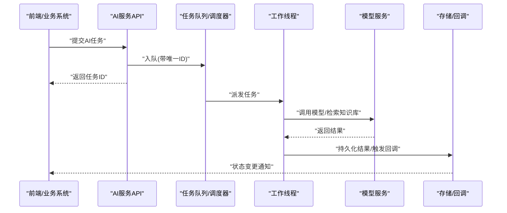

[本节为概念说明，无需代码来源]

### 智能文档生成功能
- 需求分析：从项目背景、招标文件、历史案例中提取关键要素，形成结构化需求摘要。
- 内容生成：基于Prompt与知识库检索结果，生成章节草稿，支持多轮迭代与人工编辑。
- 格式优化：统一标题层级、表格样式、编号体系、交叉引用修复。
- 质量检测：完整性检查、合规性校验、敏感信息过滤、重复率检测。

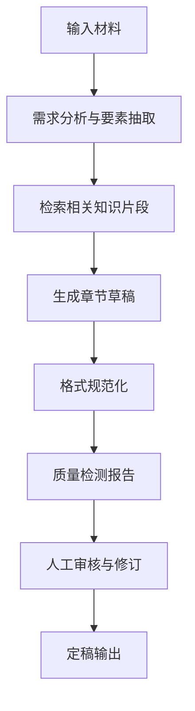

[本节为概念说明，无需代码来源]

### 模型配置管理与动态切换
- 配置项：
  - OpenAI兼容端点：base-url、api-key、默认模型。
  - 多模型清单：名称、能力、价格、配额、健康阈值。
- 动态切换：
  - 基于路由策略实时选择模型。
  - 健康检查失败自动降级。
  - 灰度发布与A/B测试。

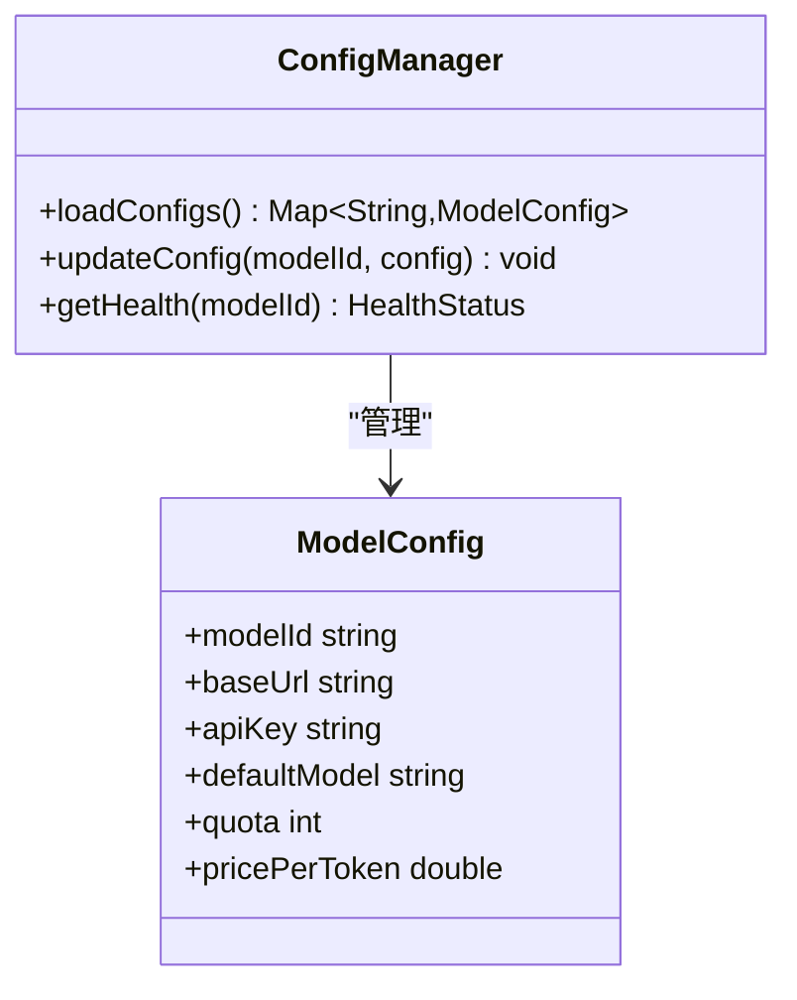

图表来源
- [application.yml:28-35](file://ele-ai-tender-system/ele-ai-tender-ai/src/main/resources/application.yml#L28-L35)

章节来源
- [application.yml:28-35](file://ele-ai-tender-system/ele-ai-tender-ai/src/main/resources/application.yml#L28-L35)

### 性能监控与成本控制
- 监控维度：
  - 延迟分布、成功率、错误码分类。
  - Token用量、费用估算、配额剩余。
  - 模型健康度与熔断状态。
- 采集方式：
  - 在路由层埋点，聚合到指标系统。
  - 日志追踪traceId贯穿全链路。
- 告警策略：
  - 延迟超阈、错误率上升、配额不足、健康检查失败。

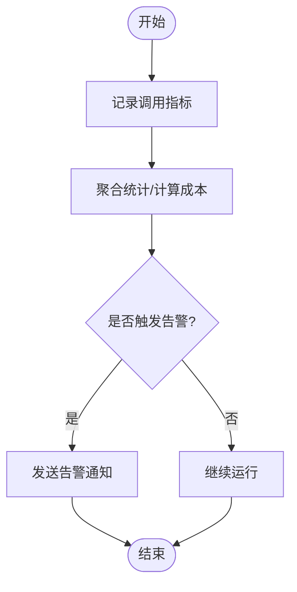

[本节为概念说明，无需代码来源]

### 与Milvus的集成实现
- 文档向量化：
  - 解析→切块→Embedding→写入集合。
- 相似度检索：
  - 查询向量→Top-K召回→相关性排序→上下文拼装。
- 知识图谱构建（思路）：
  - 实体抽取与关系识别，构建三元组。
  - 以图结构存储，支持路径推理与关联推荐。

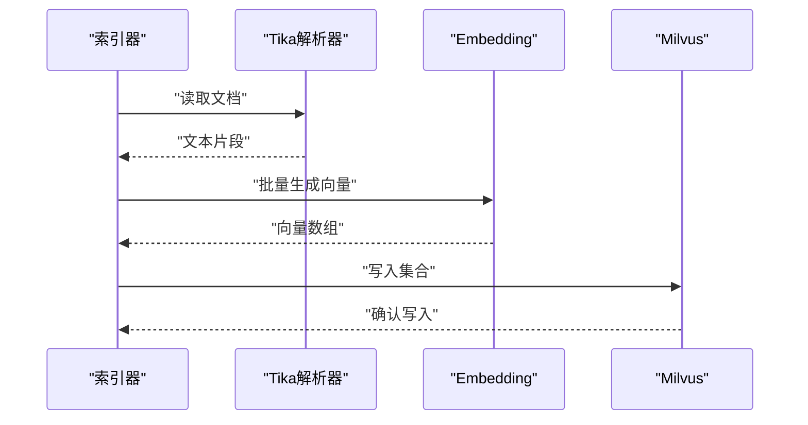

图表来源
- [pom.xml:92-104](file://ele-ai-tender-system/ele-ai-tender-ai/pom.xml#L92-L104)
- [application.yml:50-54](file://ele-ai-tender-system/ele-ai-tender-ai/src/main/resources/application.yml#L50-L54)

章节来源
- [pom.xml:92-104](file://ele-ai-tender-system/ele-ai-tender-ai/pom.xml#L92-L104)
- [application.yml:50-54](file://ele-ai-tender-system/ele-ai-tender-ai/src/main/resources/application.yml#L50-L54)

### 异步调用、结果回调、错误重试与成本控制
- 异步调用：
  - 任务入队、工作线程消费、结果落库。
- 结果回调：
  - 回调URL/消息队列/事件总线通知。
- 错误重试：
  - 指数退避、最大重试次数、死信队列。
- 成本控制：
  - 按模型计费、预算上限、配额预警、低优先级任务削峰。

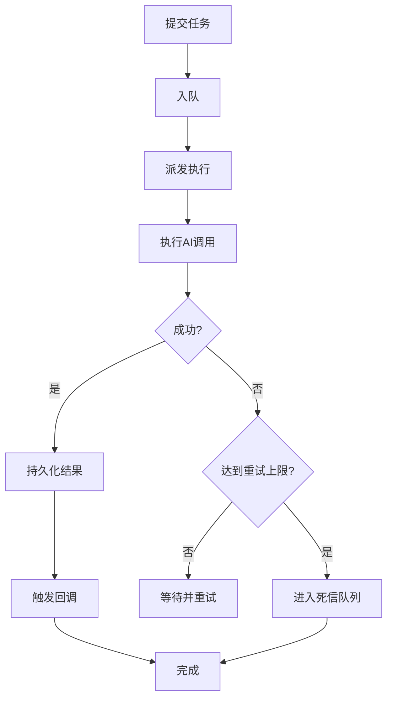

[本节为概念说明，无需代码来源]

### AI功能扩展与自定义模型接入
- 扩展点：
  - 新增模型客户端：实现统一接口，注册到路由表。
  - 新增提示词模板：按场景拆分，支持热更新。
  - 新增检测器/生成器：插件化接入，遵循SPI约定。
- 接入步骤：
  - 添加依赖与配置项。
  - 实现健康检查与计量上报。
  - 加入路由策略与灰度开关。
  - 编写用例与回归基线。

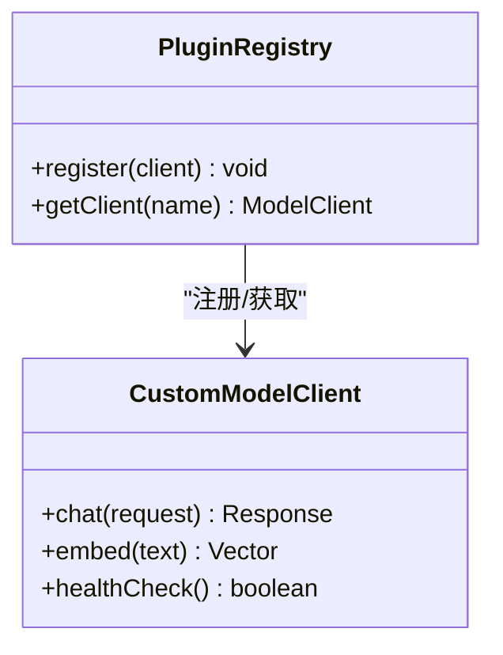

[本节为概念说明，无需代码来源]

## 依赖分析
AI服务模块的关键依赖包括Spring AI OpenAI/ZhiPuAI启动器、Tika文档解析、Milvus SDK、Web与Actuator、MyBatis Plus、MySQL、Redis等。

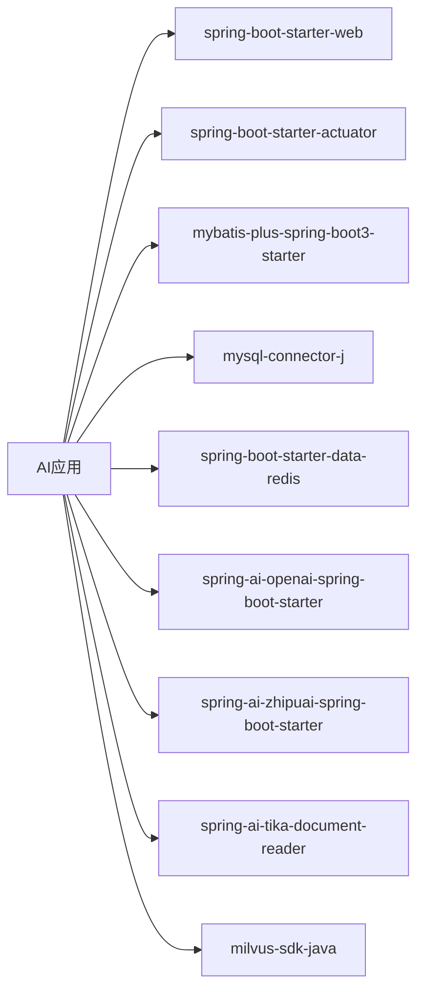

图表来源
- [pom.xml:26-104](file://ele-ai-tender-system/ele-ai-tender-ai/pom.xml#L26-L104)

章节来源
- [pom.xml:26-104](file://ele-ai-tender-system/ele-ai-tender-ai/pom.xml#L26-L104)

## 性能考虑
- 并发与线程池：为AI调用、向量化、IO密集型任务划分独立线程池，避免相互阻塞。
- 缓存策略：对高频Prompt、静态模板、检索结果进行缓存，降低重复开销。
- 批处理：向量化与文档解析尽量批量执行，减少往返与序列化成本。
- 连接复用：HTTP客户端与Milvus客户端保持长连接，合理设置超时与重试。
- 观测性：开启Actuator端点，采集JVM、线程池、外部调用指标，配合日志追踪定位瓶颈。

[本节为通用指导，无需代码来源]

## 故障排查指南
- 常见问题：
  - 模型不可用：检查健康检查、网络连通、鉴权密钥、配额限制。
  - 向量检索异常：核对Milvus集合名、维度、索引类型、数据一致性。
  - 文档解析失败：确认文件格式、编码、权限与大小限制。
  - 任务堆积：观察线程池利用率、队列深度、下游依赖延迟。
- 排查手段：
  - 查看Actuator指标与日志，定位慢调用与错误堆栈。
  - 使用traceId串联跨服务调用链。
  - 对热点模型与集合做专项压测与容量评估。

[本节为通用指导，无需代码来源]

## 结论
本方案以Spring AI为核心，结合Milvus向量库与Tika文档解析，构建了可扩展、可观测、可治理的AI能力平台。通过多模型路由、提示词工程、任务调度与成本控制，满足招标文件编制的复杂场景需求。后续可按需扩展更多模型与检测器，持续提升生成质量与效率。

[本节为总结，无需代码来源]

## 附录
- 环境变量与配置参考：
  - 服务器端口、字符集、时区
  - 数据源与Redis连接
  - OpenAI兼容端点与默认模型
  - Milvus主机、端口、数据库
  - JWT密钥与过期时间
  - 内部文件服务地址与鉴权

章节来源
- [application.yml:1-72](file://ele-ai-tender-system/ele-ai-tender-ai/src/main/resources/application.yml#L1-L72)