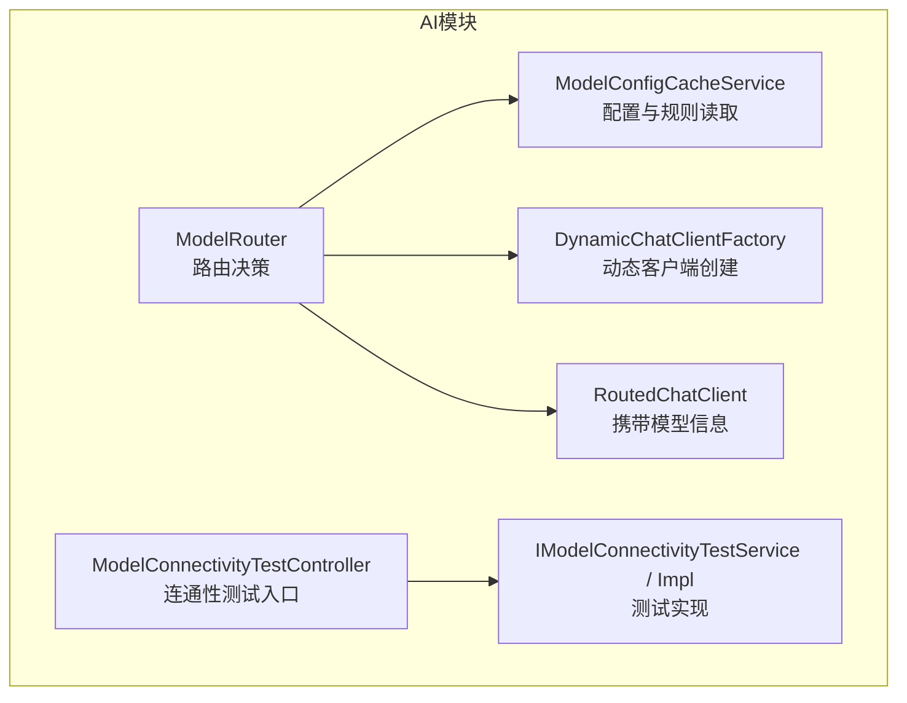
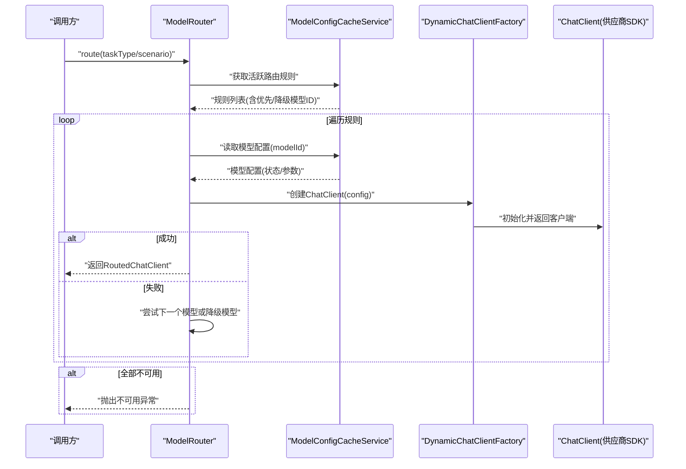
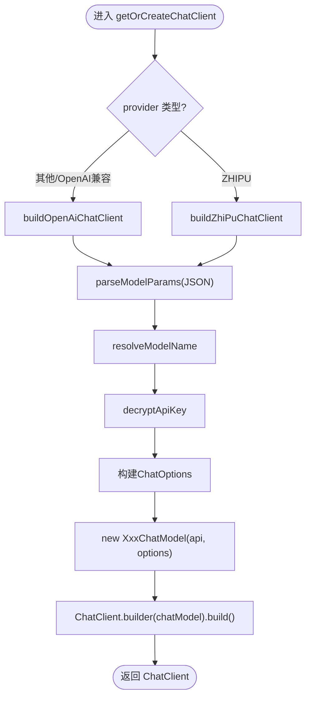
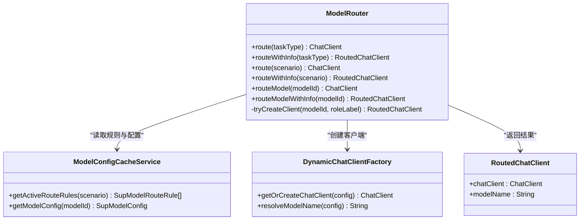
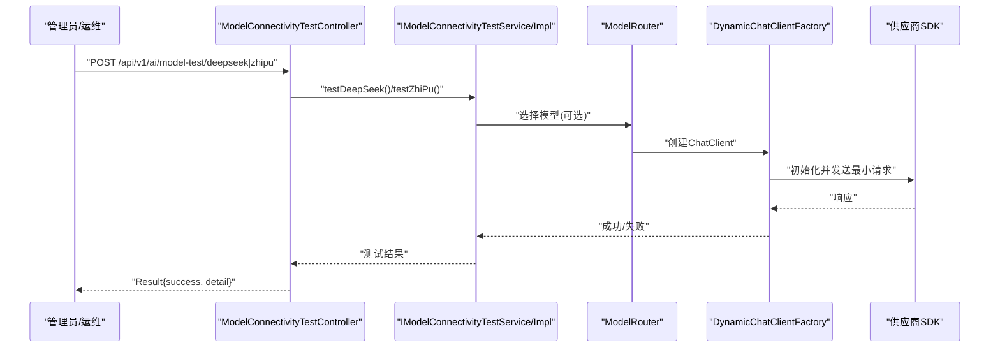
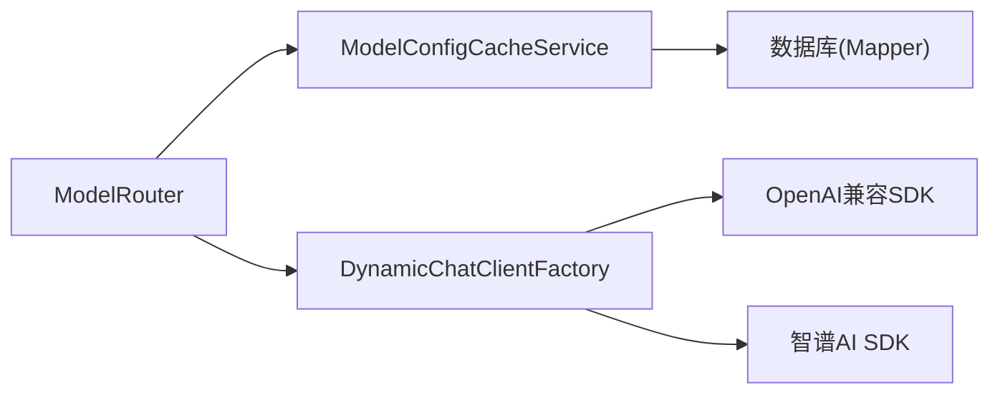

# AI模型路由机制

<cite>
**本文引用的文件**
- [DynamicChatClientFactory.java](file://ele-ai-tender-system/ele-ai-tender-ai/src/main/java/com/jy/eleaitender/ai/processor/model/DynamicChatClientFactory.java)
- [RoutedChatClient.java](file://ele-ai-tender-system/ele-ai-tender-ai/src/main/java/com/jy/eleaitender/ai/processor/model/RoutedChatClient.java)
- [ModelConfigCacheService.java](file://ele-ai-tender-system/ele-ai-tender-ai/src/main/java/com/jy/eleaitender/ai/processor/model/ModelConfigCacheService.java)
- [ModelRouter.java](file://ele-ai-tender-system/ele-ai-tender-ai/src/main/java/com/jy/eleaitender/ai/processor/model/ModelRouter.java)
- [ModelConnectivityTestController.java](file://ele-ai-tender-system/ele-ai-tender-ai/src/main/java/com/jy/eleaitender/ai/controller/ModelConnectivityTestController.java)
- [IModelConnectivityTestService.java](file://ele-ai-tender-system/ele-ai-tender-ai/src/main/java/com/jy/eleaitender/ai/service/IModelConnectivityTestService.java)
- [ModelConnectivityTestServiceImpl.java](file://ele-ai-tender-system/ele-ai-tender-ai/src/main/java/com/jy/eleaitender/ai/service/impl/ModelConnectivityTestServiceImpl.java)
</cite>

## 目录
1. [简介](#简介)
2. [项目结构](#项目结构)
3. [核心组件](#核心组件)
4. [架构总览](#架构总览)
5. [详细组件分析](#详细组件分析)
6. [依赖关系分析](#依赖关系分析)
7. [性能与连接池](#性能与连接池)
8. [健康检查、故障转移与监控](#健康检查故障转移与监控)
9. [自定义路由规则与扩展指南](#自定义路由规则与扩展指南)
10. [故障排查](#故障排查)
11. [结论](#结论)

## 简介
本文件面向AI模型动态路由机制，围绕Spring AI的多模型接入与动态选择进行系统化说明。重点覆盖：
- 基于数据库的模型配置管理与实时生效策略
- 动态客户端创建流程（DynamicChatClientFactory）
- 路由策略与负载均衡（ModelRouter）
- 请求转发与上下文封装（RoutedChatClient）
- 配置查询服务（ModelConfigCacheService）
- 连通性测试与健康检查能力
- 可扩展的路由策略与外部服务连接管理建议

## 项目结构
AI模块中与“模型路由”直接相关的代码集中在处理器模型子包中，并通过控制器与服务暴露连通性测试能力。整体组织遵循分层职责：
- 路由层：根据任务类型或使用场景选择模型
- 工厂层：按供应商动态构建ChatClient
- 数据访问层：读取模型配置与路由规则
- 运维层：提供连通性测试接口

图表来源
- [ModelRouter.java:1-106](file://ele-ai-tender-system/ele-ai-tender-ai/src/main/java/com/jy/eleaitender/ai/processor/model/ModelRouter.java#L1-L106)
- [ModelConfigCacheService.java:1-60](file://ele-ai-tender-system/ele-ai-tender-ai/src/main/java/com/jy/eleaitender/ai/processor/model/ModelConfigCacheService.java#L1-L60)
- [DynamicChatClientFactory.java:1-187](file://ele-ai-tender-system/ele-ai-tender-ai/src/main/java/com/jy/eleaitender/ai/processor/model/DynamicChatClientFactory.java#L1-L187)
- [RoutedChatClient.java:1-7](file://ele-ai-tender-system/ele-ai-tender-ai/src/main/java/com/jy/eleaitender/ai/processor/model/RoutedChatClient.java#L1-L7)
- [ModelConnectivityTestController.java:1-37](file://ele-ai-tender-system/ele-ai-tender-ai/src/main/java/com/jy/eleaitender/ai/controller/ModelConnectivityTestController.java#L1-L37)
- [IModelConnectivityTestService.java](file://ele-ai-tender-system/ele-ai-tender-ai/src/main/java/com/jy/eleaitender/ai/service/IModelConnectivityTestService.java)
- [ModelConnectivityTestServiceImpl.java](file://ele-ai-tender-system/ele-ai-tender-ai/src/main/java/com/jy/eleaitender/ai/service/impl/ModelConnectivityTestServiceImpl.java)

章节来源
- [ModelRouter.java:1-106](file://ele-ai-tender-system/ele-ai-tender-ai/src/main/java/com/jy/eleaitender/ai/processor/model/ModelRouter.java#L1-L106)
- [ModelConfigCacheService.java:1-60](file://ele-ai-tender-system/ele-ai-tender-ai/src/main/java/com/jy/eleaitender/ai/processor/model/ModelConfigCacheService.java#L1-L60)
- [DynamicChatClientFactory.java:1-187](file://ele-ai-tender-system/ele-ai-tender-ai/src/main/java/com/jy/eleaitender/ai/processor/model/DynamicChatClientFactory.java#L1-L187)
- [RoutedChatClient.java:1-7](file://ele-ai-tender-system/ele-ai-tender-ai/src/main/java/com/jy/eleaitender/ai/processor/model/RoutedChatClient.java#L1-L7)
- [ModelConnectivityTestController.java:1-37](file://ele-ai-tender-system/ele-ai-tender-ai/src/main/java/com/jy/eleaitender/ai/controller/ModelConnectivityTestController.java#L1-L37)

## 核心组件
- DynamicChatClientFactory：根据数据库中的模型配置动态创建ChatClient实例，支持OpenAI兼容协议与智谱AI两种供应商；不缓存客户端，保证配置变更实时生效。
- ModelRouter：依据任务类型或使用场景从数据库加载路由规则，依次尝试优先模型与降级模型，返回可用的ChatClient及模型名称。
- ModelConfigCacheService：提供模型配置与路由规则的读取能力，当前为直连数据库查询，确保配置实时生效。
- RoutedChatClient：轻量记录对象，承载实际ChatClient与目标模型名，便于上层统一处理。
- 连通性测试：通过控制器与服务暴露DeepSeek/OpenAI兼容与智谱模型的连通性测试接口，用于健康检查与排障。

章节来源
- [DynamicChatClientFactory.java:1-187](file://ele-ai-tender-system/ele-ai-tender-ai/src/main/java/com/jy/eleaitender/ai/processor/model/DynamicChatClientFactory.java#L1-L187)
- [ModelRouter.java:1-106](file://ele-ai-tender-system/ele-ai-tender-ai/src/main/java/com/jy/eleaitender/ai/processor/model/ModelRouter.java#L1-L106)
- [ModelConfigCacheService.java:1-60](file://ele-ai-tender-system/ele-ai-tender-ai/src/main/java/com/jy/eleaitender/ai/processor/model/ModelConfigCacheService.java#L1-L60)
- [RoutedChatClient.java:1-7](file://ele-ai-tender-system/ele-ai-tender-ai/src/main/java/com/jy/eleaitender/ai/processor/model/RoutedChatClient.java#L1-L7)
- [ModelConnectivityTestController.java:1-37](file://ele-ai-tender-system/ele-ai-tender-ai/src/main/java/com/jy/eleaitender/ai/controller/ModelConnectivityTestController.java#L1-L37)

## 架构总览
下图展示了从业务调用到具体模型调用的完整链路，包括路由决策、客户端创建与请求转发。

图表来源
- [ModelRouter.java:32-85](file://ele-ai-tender-system/ele-ai-tender-ai/src/main/java/com/jy/eleaitender/ai/processor/model/ModelRouter.java#L32-L85)
- [ModelConfigCacheService.java:34-58](file://ele-ai-tender-system/ele-ai-tender-ai/src/main/java/com/jy/eleaitender/ai/processor/model/ModelConfigCacheService.java#L34-L58)
- [DynamicChatClientFactory.java:38-124](file://ele-ai-tender-system/ele-ai-tender-ai/src/main/java/com/jy/eleaitender/ai/processor/model/DynamicChatClientFactory.java#L38-L124)

## 详细组件分析

### DynamicChatClientFactory：动态客户端创建
- 功能要点
  - 根据SupModelConfig.provider分发至OpenAI兼容或智谱AI构建路径
  - 解析modelParams JSON，支持temperature、maxTokens、topP、model等参数
  - 解密apiKey，兼容历史明文数据
  - 不缓存ChatClient，每次按需创建，保证配置变更即时生效
- 关键流程
  - getOrCreateChatClient -> buildChatClient -> 供应商特定构建方法 -> ChatClient.builder(...)
  - resolveModelName：优先使用modelParams中的model字段，否则回退到配置的modelName
- 复杂度与性能
  - 每次创建均涉及JSON解析与SDK初始化，存在一定开销；适合低频或需要强一致配置的场景
  - 若需高频复用，可在上层引入短生命周期缓存或连接池（见“性能与连接池”）

图表来源
- [DynamicChatClientFactory.java:38-124](file://ele-ai-tender-system/ele-ai-tender-ai/src/main/java/com/jy/eleaitender/ai/processor/model/DynamicChatClientFactory.java#L38-L124)
- [DynamicChatClientFactory.java:129-175](file://ele-ai-tender-system/ele-ai-tender-ai/src/main/java/com/jy/eleaitender/ai/processor/model/DynamicChatClientFactory.java#L129-L175)

章节来源
- [DynamicChatClientFactory.java:1-187](file://ele-ai-tender-system/ele-ai-tender-ai/src/main/java/com/jy/eleaitender/ai/processor/model/DynamicChatClientFactory.java#L1-L187)

### ModelRouter：路由策略与负载均衡
- 路由策略
  - 将AiTaskType映射为AiUsageScenario，再按场景加载活跃路由规则
  - 对每条规则依次尝试primaryModelId与fallbackModelId，首个可用即返回
- 负载均衡
  - 当前实现为顺序尝试+首次命中策略，未内置加权轮询或一致性哈希
  - 可通过扩展规则表或增加权重字段实现更丰富的负载策略
- 错误处理
  - 无可用规则或所有模型不可用时抛出不可用异常，便于上层熔断或告警

图表来源
- [ModelRouter.java:32-104](file://ele-ai-tender-system/ele-ai-tender-ai/src/main/java/com/jy/eleaitender/ai/processor/model/ModelRouter.java#L32-L104)
- [ModelConfigCacheService.java:34-58](file://ele-ai-tender-system/ele-ai-tender-ai/src/main/java/com/jy/eleaitender/ai/processor/model/ModelConfigCacheService.java#L34-L58)
- [DynamicChatClientFactory.java:38-47](file://ele-ai-tender-system/ele-ai-tender-ai/src/main/java/com/jy/eleaitender/ai/processor/model/DynamicChatClientFactory.java#L38-L47)
- [RoutedChatClient.java:5-6](file://ele-ai-tender-system/ele-ai-tender-ai/src/main/java/com/jy/eleaitender/ai/processor/model/RoutedChatClient.java#L5-L6)

章节来源
- [ModelRouter.java:1-106](file://ele-ai-tender-system/ele-ai-tender-ai/src/main/java/com/jy/eleaitender/ai/processor/model/ModelRouter.java#L1-L106)

### ModelConfigCacheService：配置与规则读取
- 能力
  - 按usageScenario获取活跃且未删除的路由规则，并按优先级升序排序
  - 按modelId获取模型配置，过滤已停用或已删除项
- 设计取舍
  - 当前直连数据库，不引入本地缓存，确保配置变更即时生效
  - 在高并发下可考虑引入短期缓存或读多写少场景的二级缓存

章节来源
- [ModelConfigCacheService.java:1-60](file://ele-ai-tender-system/ele-ai-tender-ai/src/main/java/com/jy/eleaitender/ai/processor/model/ModelConfigCacheService.java#L1-L60)

### RoutedChatClient：请求转发上下文
- 作用
  - 封装ChatClient与目标modelName，供上层在日志、监控与重试时明确归属
- 使用方式
  - 路由成功后返回该记录，调用方可直接使用chatClient发起对话

章节来源
- [RoutedChatClient.java:1-7](file://ele-ai-tender-system/ele-ai-tender-ai/src/main/java/com/jy/eleaitender/ai/processor/model/RoutedChatClient.java#L1-L7)

### 连通性测试与健康检查
- 入口
  - 控制器暴露DeepSeek/OpenAI兼容与智谱两类测试接口
- 流程
  - 控制器调用服务实现，服务内部构造对应客户端并执行最小化调用以验证连通性
- 用途
  - 部署后快速验证模型可达性与鉴权正确性
  - 作为健康检查探针或灰度发布前的预检手段

图表来源
- [ModelConnectivityTestController.java:25-35](file://ele-ai-tender-system/ele-ai-tender-ai/src/main/java/com/jy/eleaitender/ai/controller/ModelConnectivityTestController.java#L25-L35)
- [IModelConnectivityTestService.java]
- [ModelConnectivityTestServiceImpl.java]
- [ModelRouter.java:32-85](file://ele-ai-tender-system/ele-ai-tender-ai/src/main/java/com/jy/eleaitender/ai/processor/model/ModelRouter.java#L32-L85)
- [DynamicChatClientFactory.java:38-124](file://ele-ai-tender-system/ele-ai-tender-ai/src/main/java/com/jy/eleaitender/ai/processor/model/DynamicChatClientFactory.java#L38-L124)

章节来源
- [ModelConnectivityTestController.java:1-37](file://ele-ai-tender-system/ele-ai-tender-ai/src/main/java/com/jy/eleaitender/ai/controller/ModelConnectivityTestController.java#L1-L37)
- [IModelConnectivityTestService.java]
- [ModelConnectivityTestServiceImpl.java]

## 依赖关系分析
- 耦合关系
  - ModelRouter依赖ModelConfigCacheService与DynamicChatClientFactory，职责清晰、内聚度高
  - DynamicChatClientFactory依赖Spring AI各供应商SDK与通用工具（如AES解密、JSON解析）
- 外部依赖
  - Spring AI OpenAI兼容与智谱AI客户端
  - 数据库读写（通过MyBatis Plus Mapper）
- 潜在风险
  - 频繁创建ChatClient可能带来资源抖动，建议在热点路径引入受控缓存或连接池
  - 规则与配置变更即时生效的策略在高并发下需关注DB压力

图表来源
- [ModelRouter.java:23-27](file://ele-ai-tender-system/ele-ai-tender-ai/src/main/java/com/jy/eleaitender/ai/processor/model/ModelRouter.java#L23-L27)
- [DynamicChatClientFactory.java:9-14](file://ele-ai-tender-system/ele-ai-tender-ai/src/main/java/com/jy/eleaitender/ai/processor/model/DynamicChatClientFactory.java#L9-L14)
- [ModelConfigCacheService.java:22-26](file://ele-ai-tender-system/ele-ai-tender-ai/src/main/java/com/jy/eleaitender/ai/processor/model/ModelConfigCacheService.java#L22-L26)

章节来源
- [ModelRouter.java:1-106](file://ele-ai-tender-system/ele-ai-tender-ai/src/main/java/com/jy/eleaitender/ai/processor/model/ModelRouter.java#L1-L106)
- [DynamicChatClientFactory.java:1-187](file://ele-ai-tender-system/ele-ai-tender-ai/src/main/java/com/jy/eleaitender/ai/processor/model/DynamicChatClientFactory.java#L1-L187)
- [ModelConfigCacheService.java:1-60](file://ele-ai-tender-system/ele-ai-tender-ai/src/main/java/com/jy/eleaitender/ai/processor/model/ModelConfigCacheService.java#L1-L60)

## 性能与连接池
- 现状
  - DynamicChatClientFactory不缓存ChatClient，每次按需创建，利于配置实时生效但存在初始化成本
  - ModelConfigCacheService直连数据库，避免缓存不一致问题
- 优化建议
  - 客户端级缓存：对相同SupModelConfig的ChatClient进行短生命周期缓存（如TTL分钟级），降低重复创建开销
  - 连接池：在HTTP层引入连接池（如OkHttp/RestTemplate池化），控制最大连接数、空闲回收与超时
  - 超时控制：为网络请求设置合理的connect/read/write超时，避免雪崩
  - 限流与熔断：结合网关或服务侧限流，配合熔断器防止下游不可用导致级联失败
  - 指标采集：统计成功率、延迟分位、错误码分布，纳入监控大盘

[本节为通用性能建议，不涉及具体文件分析]

## 健康检查、故障转移与监控
- 健康检查
  - 使用连通性测试接口对各类模型进行最小化调用验证
  - 可将测试结果持久化或暴露为健康端点，供编排系统探测
- 故障转移
  - 路由层已支持优先模型与降级模型顺序尝试，当主模型不可用时自动回退
  - 可在规则表中增加更多层级或条件分支，实现更细粒度的故障转移
- 监控告警
  - 记录每次路由选择的模型ID、是否降级、耗时与错误码
  - 对不可用异常与超时异常设置阈值告警，联动自动扩缩容或切换流量

章节来源
- [ModelRouter.java:55-70](file://ele-ai-tender-system/ele-ai-tender-ai/src/main/java/com/jy/eleaitender/ai/processor/model/ModelRouter.java#L55-L70)
- [ModelConnectivityTestController.java:25-35](file://ele-ai-tender-system/ele-ai-tender-ai/src/main/java/com/jy/eleaitender/ai/controller/ModelConnectivityTestController.java#L25-L35)

## 自定义路由规则与扩展指南
- 配置维度
  - 使用场景：GENERATION/OPTIMIZATION/DETECTION等
  - 优先级：priority决定尝试顺序
  - 主备模型：primaryModelId与fallbackModelId组合实现基础故障转移
- 扩展方向
  - 新增权重字段实现加权轮询
  - 新增地域/租户/业务线匹配条件实现多租户隔离
  - 新增动态评分（如最近N分钟成功率）实现自适应路由
- 实现步骤
  - 在路由规则实体与Mapper中扩展字段
  - 在ModelConfigCacheService中调整查询与排序逻辑
  - 在ModelRouter中实现新的选择算法（如加权随机、一致性哈希）
  - 在DynamicChatClientFactory中扩展新供应商（新增provider分支与构建方法）

章节来源
- [ModelConfigCacheService.java:34-41](file://ele-ai-tender-system/ele-ai-tender-ai/src/main/java/com/jy/eleaitender/ai/processor/model/ModelConfigCacheService.java#L34-L41)
- [ModelRouter.java:48-70](file://ele-ai-tender-system/ele-ai-tender-ai/src/main/java/com/jy/eleaitender/ai/processor/model/ModelRouter.java#L48-L70)
- [DynamicChatClientFactory.java:52-58](file://ele-ai-tender-system/ele-ai-tender-ai/src/main/java/com/jy/eleaitender/ai/processor/model/DynamicChatClientFactory.java#L52-L58)

## 故障排查
- 常见问题
  - 无可用路由规则：检查usageScenario是否正确、规则是否启用且未删除
  - 模型不可用：检查模型配置是否激活、API Key是否有效、endpoint是否可达
  - 创建客户端失败：查看日志中“创建...模型ChatClient失败”的错误堆栈
- 定位手段
  - 使用连通性测试接口分别验证OpenAI兼容与智谱模型
  - 核对modelParams JSON格式与字段名是否与解析逻辑一致
  - 确认apiKey是否为密文以及解密是否成功

章节来源
- [ModelRouter.java:51-70](file://ele-ai-tender-system/ele-ai-tender-ai/src/main/java/com/jy/eleaitender/ai/processor/model/ModelRouter.java#L51-L70)
- [DynamicChatClientFactory.java:129-140](file://ele-ai-tender-system/ele-ai-tender-ai/src/main/java/com/jy/eleaitender/ai/processor/model/DynamicChatClientFactory.java#L129-L140)
- [ModelConnectivityTestController.java:25-35](file://ele-ai-tender-system/ele-ai-tender-ai/src/main/java/com/jy/eleaitender/ai/controller/ModelConnectivityTestController.java#L25-L35)

## 结论
本方案通过“规则驱动+动态工厂”的方式实现了多模型动态路由与快速故障转移，具备配置实时生效、供应商解耦与易于扩展的优势。针对高并发与稳定性需求，建议在上层引入客户端级缓存、连接池、超时与熔断策略，并结合连通性测试与监控体系形成闭环保障。