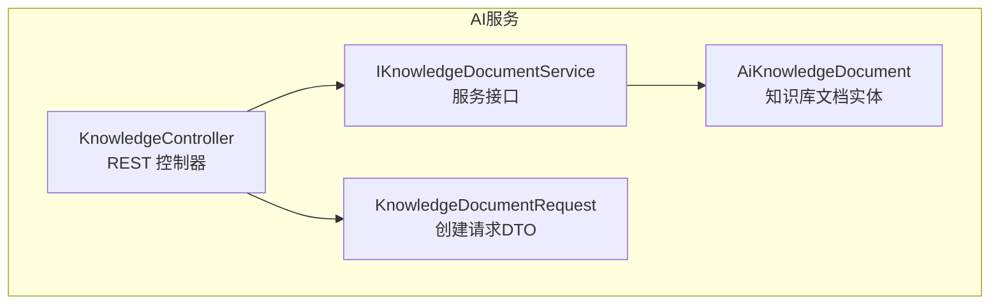
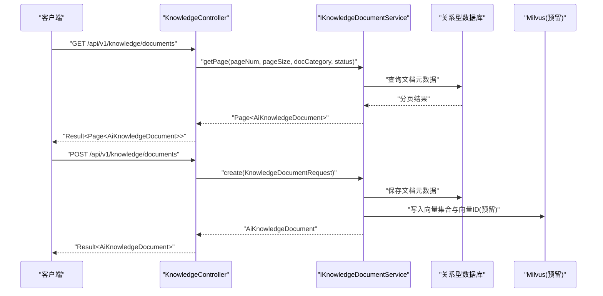
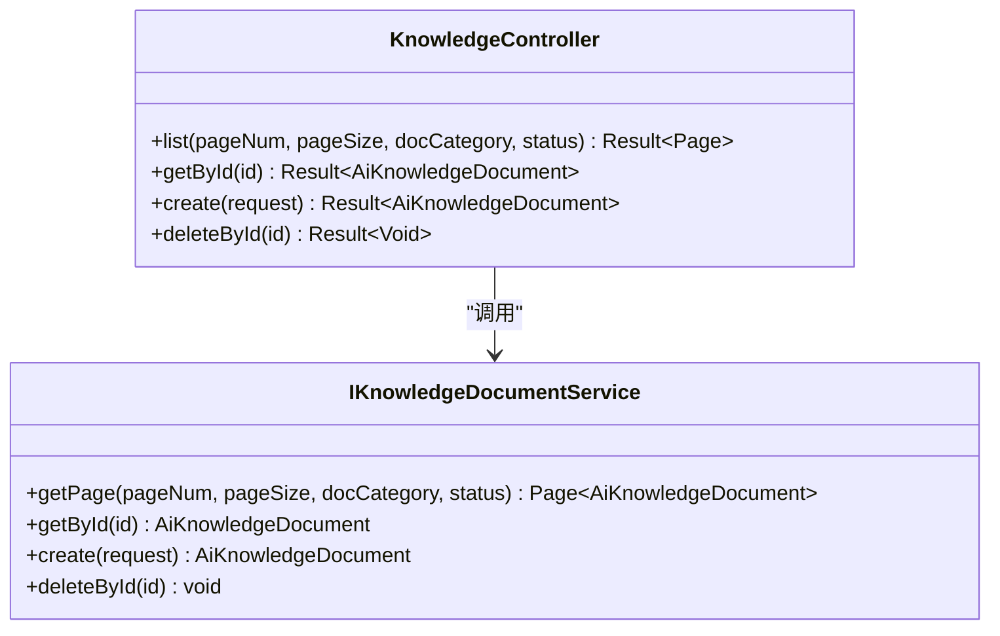
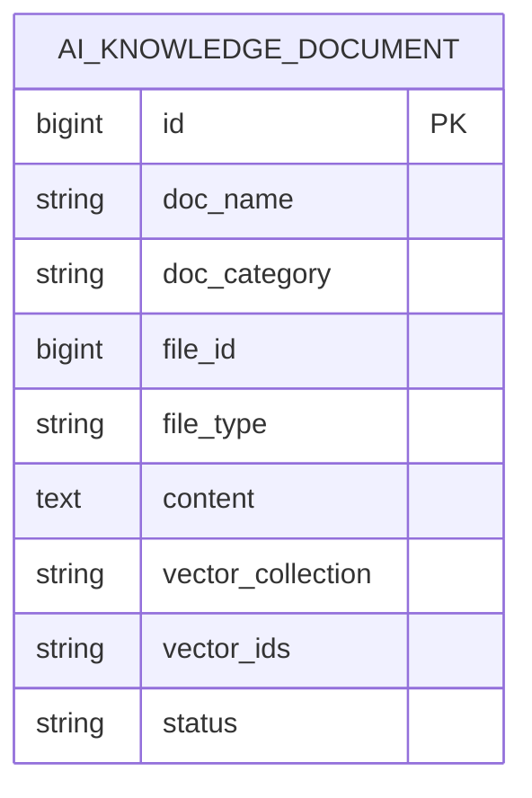

# 向量知识库

<cite>
**本文引用的文件**   
- [KnowledgeController.java](file://ele-ai-tender-system/ele-ai-tender-ai/src/main/java/com/jy/eleaitender/ai/controller/KnowledgeController.java)
- [IKnowledgeDocumentService.java](file://ele-ai-tender-system/ele-ai-tender-ai/src/main/java/com/jy/eleaitender/ai/service/IKnowledgeDocumentService.java)
- [AiKnowledgeDocument.java](file://ele-ai-tender-system/ele-ai-tender-common/src/main/java/com/jy/eleaitender/common/entity/ai/AiKnowledgeDocument.java)
- [KnowledgeDocumentRequest.java](file://ele-ai-tender-system/ele-ai-tender-ai/src/main/java/com/jy/eleaitender/ai/dto/request/KnowledgeDocumentRequest.java)
</cite>

## 目录
1. [简介](#简介)
2. [项目结构](#项目结构)
3. [核心组件](#核心组件)
4. [架构总览](#架构总览)
5. [详细组件分析](#详细组件分析)
6. [依赖分析](#依赖分析)
7. [性能考虑](#性能考虑)
8. [故障排查指南](#故障排查指南)
9. [结论](#结论)
10. [附录](#附录)

## 简介
本文件面向“向量知识库”能力，围绕基于Milvus向量数据库的知识检索实现进行系统化说明。内容覆盖文档向量化处理、相似度检索与知识图谱构建思路；详述知识文档的索引建立、向量嵌入生成与语义搜索算法；给出知识文档的生命周期管理、版本控制与权限访问机制；提供向量检索的性能优化策略与索引调优方法；说明与AI模型的集成方式及检索结果的上下文注入技术；并补充知识库维护工具与监控指标建议。

## 项目结构
当前仓库中，向量知识库相关后端入口位于AI服务模块内，包含控制器、服务接口与通用实体定义：
- 控制器层：暴露知识库文档的增删查等HTTP接口
- 服务接口层：定义文档分页查询、详情获取、创建与删除等能力
- 通用实体层：定义知识库文档的数据模型（含向量集合名与向量ID列表字段）

图表来源
- [KnowledgeController.java:14-54](file://ele-ai-tender-system/ele-ai-tender-ai/src/main/java/com/jy/eleaitender/ai/controller/KnowledgeController.java#L14-L54)
- [IKnowledgeDocumentService.java:7-12](file://ele-ai-tender-system/ele-ai-tender-ai/src/main/java/com/jy/eleaitender/ai/service/IKnowledgeDocumentService.java#L7-L12)
- [AiKnowledgeDocument.java:9-30](file://ele-ai-tender-system/ele-ai-tender-common/src/main/java/com/jy/eleaitender/common/entity/ai/AiKnowledgeDocument.java#L9-L30)
- [KnowledgeDocumentRequest.java:7-19](file://ele-ai-tender-system/ele-ai-tender-ai/src/main/java/com/jy/eleaitender/ai/dto/request/KnowledgeDocumentRequest.java#L7-L19)

章节来源
- [KnowledgeController.java:14-54](file://ele-ai-tender-system/ele-ai-tender-ai/src/main/java/com/jy/eleaitender/ai/controller/KnowledgeController.java#L14-L54)
- [IKnowledgeDocumentService.java:7-12](file://ele-ai-tender-system/ele-ai-tender-ai/src/main/java/com/jy/eleaitender/ai/service/IKnowledgeDocumentService.java#L7-L12)
- [AiKnowledgeDocument.java:9-30](file://ele-ai-tender-system/ele-ai-tender-common/src/main/java/com/jy/eleaitender/common/entity/ai/AiKnowledgeDocument.java#L9-L30)
- [KnowledgeDocumentRequest.java:7-19](file://ele-ai-tender-system/ele-ai-tender-ai/src/main/java/com/jy/eleaitender/ai/dto/request/KnowledgeDocumentRequest.java#L7-L19)

## 核心组件
- 控制器：提供知识库文档的列表、详情、创建与删除接口，统一返回结果封装，并启用登录校验注解
- 服务接口：定义文档分页查询、按ID获取、创建与删除等方法签名
- 数据模型：知识库文档实体包含名称、类别、关联文件信息、文本内容、向量集合名、向量ID列表与状态等字段
- 请求DTO：创建文档时携带名称、类别、文件ID与类型等必要信息

章节来源
- [KnowledgeController.java:22-53](file://ele-ai-tender-system/ele-ai-tender-ai/src/main/java/com/jy/eleaitender/ai/controller/KnowledgeController.java#L22-L53)
- [IKnowledgeDocumentService.java:7-12](file://ele-ai-tender-system/ele-ai-tender-ai/src/main/java/com/jy/eleaitender/ai/service/IKnowledgeDocumentService.java#L7-L12)
- [AiKnowledgeDocument.java:13-30](file://ele-ai-tender-system/ele-ai-tender-common/src/main/java/com/jy/eleaitender/common/entity/ai/AiKnowledgeDocument.java#L13-L30)
- [KnowledgeDocumentRequest.java:9-19](file://ele-ai-tender-system/ele-ai-tender-ai/src/main/java/com/jy/eleaitender/ai/dto/request/KnowledgeDocumentRequest.java#L9-L19)

## 架构总览
从调用链路看，客户端通过REST接口访问知识库文档管理能力，控制器将请求委派给服务接口，服务接口再与持久化层交互。实体模型中的“向量集合名称”和“向量ID列表”为后续接入Milvus向量库预留了关键扩展点。

图表来源
- [KnowledgeController.java:22-45](file://ele-ai-tender-system/ele-ai-tender-ai/src/main/java/com/jy/eleaitender/ai/controller/KnowledgeController.java#L22-L45)
- [IKnowledgeDocumentService.java:7-12](file://ele-ai-tender-system/ele-ai-tender-ai/src/main/java/com/jy/eleaitender/ai/service/IKnowledgeDocumentService.java#L7-L12)
- [AiKnowledgeDocument.java:24-27](file://ele-ai-tender-system/ele-ai-tender-common/src/main/java/com/jy/eleaitender/common/entity/ai/AiKnowledgeDocument.java#L24-L27)

## 详细组件分析

### 控制器：KnowledgeController
- 职责：对外暴露知识库文档的CRUD接口，统一使用登录校验与Swagger注解
- 关键路径：
  - GET /api/v1/knowledge/documents：分页查询，支持按类别与状态过滤
  - GET /api/v1/knowledge/documents/{id}：按ID获取详情
  - POST /api/v1/knowledge/documents：创建文档
  - DELETE /api/v1/knowledge/documents/{id}：删除文档

图表来源
- [KnowledgeController.java:22-53](file://ele-ai-tender-system/ele-ai-tender-ai/src/main/java/com/jy/eleaitender/ai/controller/KnowledgeController.java#L22-L53)
- [IKnowledgeDocumentService.java:7-12](file://ele-ai-tender-system/ele-ai-tender-ai/src/main/java/com/jy/eleaitender/ai/service/IKnowledgeDocumentService.java#L7-L12)

章节来源
- [KnowledgeController.java:14-54](file://ele-ai-tender-system/ele-ai-tender-ai/src/main/java/com/jy/eleaitender/ai/controller/KnowledgeController.java#L14-L54)

### 服务接口：IKnowledgeDocumentService
- 职责：定义知识库文档的分页查询、详情获取、创建与删除能力
- 设计要点：
  - 分页参数与过滤条件清晰
  - 返回值与输入输出类型明确，便于后续实现类对接Milvus与ORM层

章节来源
- [IKnowledgeDocumentService.java:7-12](file://ele-ai-tender-system/ele-ai-tender-ai/src/main/java/com/jy/eleaitender/ai/service/IKnowledgeDocumentService.java#L7-L12)

### 数据模型：AiKnowledgeDocument
- 关键字段：
  - 文档名称、类别、文件ID、文件类型、文本内容
  - 向量集合名称、向量ID列表JSON、状态
- 作用：承载知识库文档的元数据与向量索引关联信息，为后续Milvus集成提供映射基础

图表来源
- [AiKnowledgeDocument.java:13-30](file://ele-ai-tender-system/ele-ai-tender-common/src/main/java/com/jy/eleaitender/common/entity/ai/AiKnowledgeDocument.java#L13-L30)

章节来源
- [AiKnowledgeDocument.java:9-30](file://ele-ai-tender-system/ele-ai-tender-common/src/main/java/com/jy/eleaitender/common/entity/ai/AiKnowledgeDocument.java#L9-L30)

### 请求DTO：KnowledgeDocumentRequest
- 用途：创建知识库文档时的入参载体
- 约束：文档名称必填，其他字段可选

章节来源
- [KnowledgeDocumentRequest.java:7-19](file://ele-ai-tender-system/ele-ai-tender-ai/src/main/java/com/jy/eleaitender/ai/dto/request/KnowledgeDocumentRequest.java#L7-L19)

## 依赖分析
- 控制器依赖服务接口，服务接口依赖实体模型
- 实体模型继承基础实体，具备通用审计字段
- 向量库（Milvus）尚未在现有代码中出现具体实现，但实体已预留向量集合与向量ID字段，便于后续扩展

图表来源
- [KnowledgeController.java:14-54](file://ele-ai-tender-system/ele-ai-tender-ai/src/main/java/com/jy/eleaitender/ai/controller/KnowledgeController.java#L14-L54)
- [IKnowledgeDocumentService.java:7-12](file://ele-ai-tender-system/ele-ai-tender-ai/src/main/java/com/jy/eleaitender/ai/service/IKnowledgeDocumentService.java#L7-L12)
- [AiKnowledgeDocument.java:9-12](file://ele-ai-tender-system/ele-ai-tender-common/src/main/java/com/jy/eleaitender/common/entity/ai/AiKnowledgeDocument.java#L9-L12)

章节来源
- [KnowledgeController.java:14-54](file://ele-ai-tender-system/ele-ai-tender-ai/src/main/java/com/jy/eleaitender/ai/controller/KnowledgeController.java#L14-L54)
- [IKnowledgeDocumentService.java:7-12](file://ele-ai-tender-system/ele-ai-tender-ai/src/main/java/com/jy/eleaitender/ai/service/IKnowledgeDocumentService.java#L7-L12)
- [AiKnowledgeDocument.java:9-12](file://ele-ai-tender-system/ele-ai-tender-common/src/main/java/com/jy/eleaitender/common/entity/ai/AiKnowledgeDocument.java#L9-L12)

## 性能考虑
- 向量检索优化
  - 合理设置Milvus索引类型（如IVF_FLAT、HNSW、SCANN），依据数据规模与延迟要求选择
  - 调整nlist/nprobe或M/C参数以平衡召回率与延迟
  - 对高并发场景采用连接池与批量查询，减少网络往返
- 文档处理优化
  - 分块策略：按段落/标题切分，避免单块过大导致嵌入质量下降
  - 异步流水线：解析→清洗→分块→嵌入→入库，结合消息队列削峰填谷
- 缓存与预取
  - 热点查询结果短期缓存，降低重复计算
  - 预计算常用分类下的Top-K候选集，缩短首响时间
- 资源隔离
  - 向量嵌入与检索任务使用独立线程池，避免阻塞主业务

[本节为通用性能指导，不直接分析具体文件]

## 故障排查指南
- 接口鉴权失败
  - 现象：未登录或令牌异常导致401/403
  - 排查：确认登录态与@RequireLogin注解生效范围
- 参数校验失败
  - 现象：创建文档时报错“文档名称不能为空”
  - 排查：检查请求体是否包含docName且非空
- 分页查询无结果
  - 现象：pageNum/pageSize配置不当或过滤条件过严
  - 排查：放宽docCategory/status过滤，核对分页参数
- 删除后仍可见
  - 现象：缓存未失效或前端未刷新
  - 排查：清理缓存、强制刷新页面或重新拉取列表

章节来源
- [KnowledgeController.java:22-53](file://ele-ai-tender-system/ele-ai-tender-ai/src/main/java/com/jy/eleaitender/ai/controller/KnowledgeController.java#L22-L53)
- [KnowledgeDocumentRequest.java:10-12](file://ele-ai-tender-system/ele-ai-tender-ai/src/main/java/com/jy/eleaitender/ai/dto/request/KnowledgeDocumentRequest.java#L10-L12)

## 结论
当前代码已为向量知识库提供了清晰的API与服务边界，并在实体层预留了Milvus向量集合与向量ID字段，具备良好的可扩展性。建议在后续迭代中完善服务实现，打通Milvus索引与检索流程，同时引入异步处理、缓存与监控体系，以提升整体性能与可观测性。

[本节为总结性内容，不直接分析具体文件]

## 附录

### 生命周期管理与版本控制
- 生命周期阶段
  - 草稿：上传后待审核
  - 已发布：通过审核后进入检索可用
  - 已归档：历史版本保留，不再参与检索
- 版本控制建议
  - 每次更新生成新版本号，保留历史向量快照
  - 变更时仅增量更新差异分块的向量，提升效率

[本节为概念性说明，不直接分析具体文件]

### 权限访问机制
- 接口级鉴权：通过登录校验注解保护所有知识库接口
- 数据级权限：可在服务层根据用户角色/组织维度过滤docCategory或status
- 审计日志：记录创建、删除与检索操作，便于追溯

章节来源
- [KnowledgeController.java:22-53](file://ele-ai-tender-system/ele-ai-tender-ai/src/main/java/com/jy/eleaitender/ai/controller/KnowledgeController.java#L22-L53)

### 与AI模型的集成与上下文注入
- 集成方式
  - 在创建文档时触发文本分块与向量嵌入，写入Milvus
  - 检索时先向量召回Top-K片段，再拼接为提示词上下文
- 上下文注入
  - 将检索到的片段作为系统提示的一部分，增强回答准确性
  - 附带来源引用（文档名、章节、页码）以便溯源

[本节为概念性说明，不直接分析具体文件]

### 维护工具与监控指标
- 维护工具
  - 索引重建：全量重算向量并重建索引
  - 健康检查：验证Milvus连通性与集合存在性
  - 清理过期：按策略清理归档文档及其向量
- 监控指标
  - 检索延迟P95/P99、QPS、错误率
  - 向量入库耗时、分块数量、嵌入失败率
  - 索引大小、内存占用、磁盘IO

[本节为通用运维建议，不直接分析具体文件]