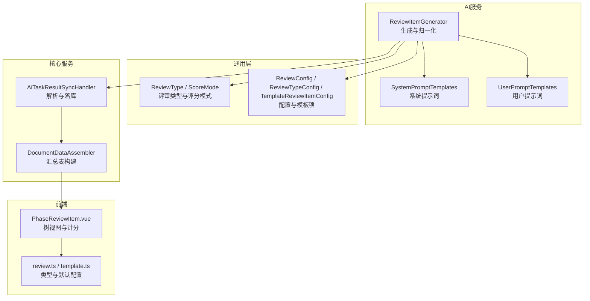
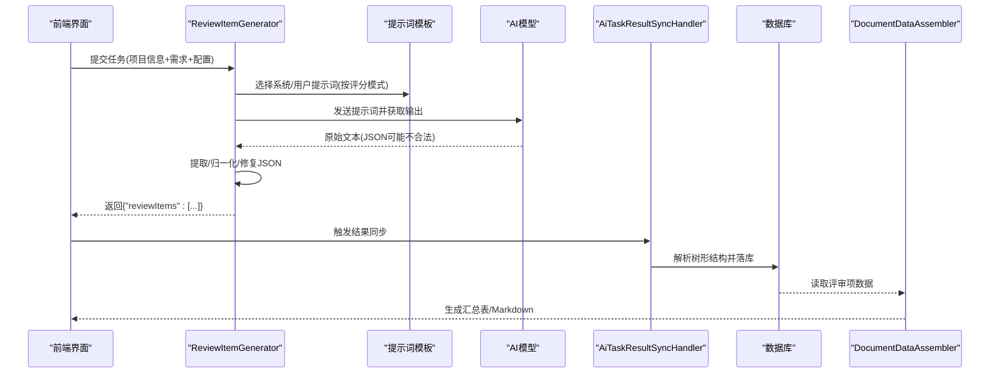
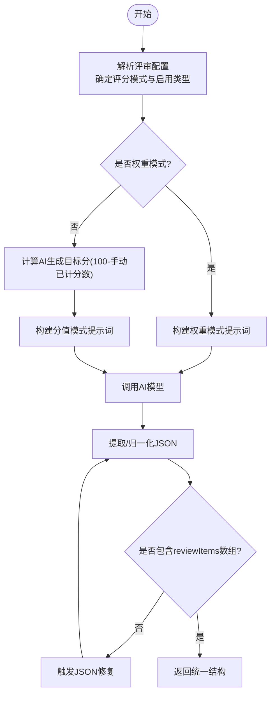
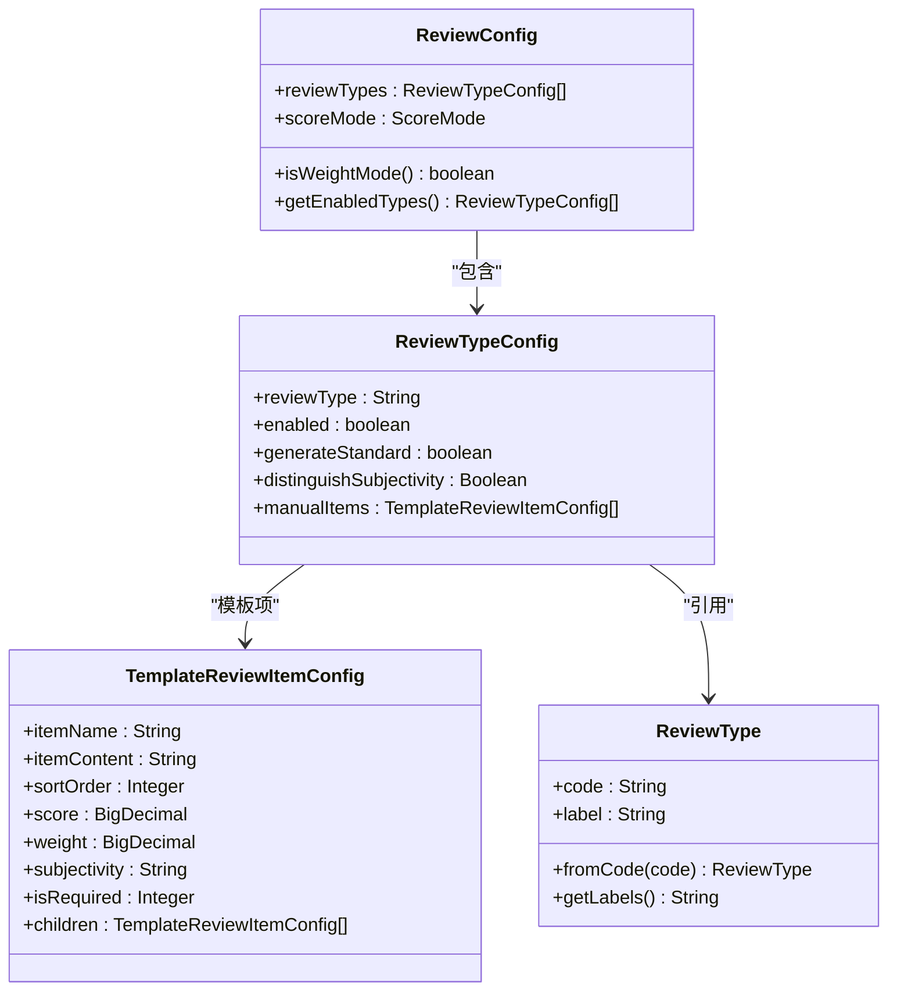
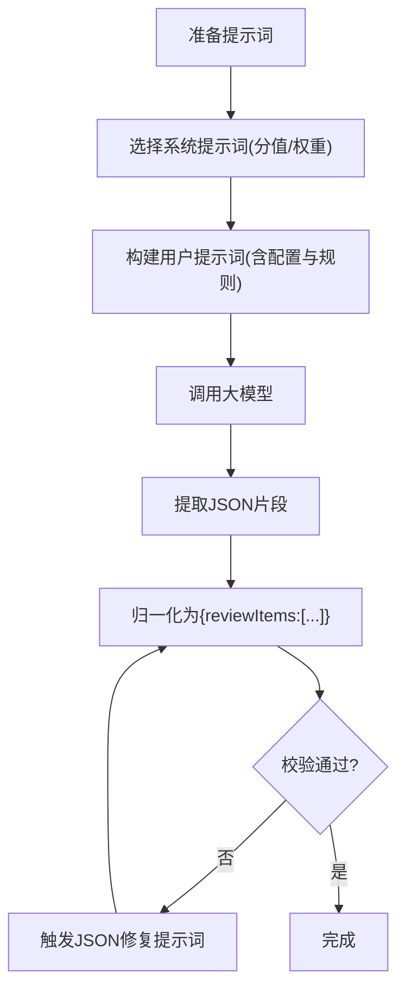
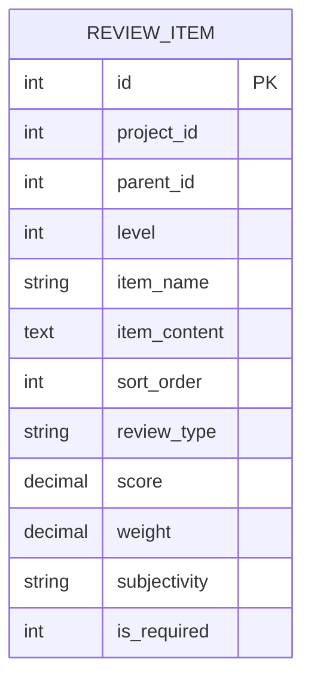
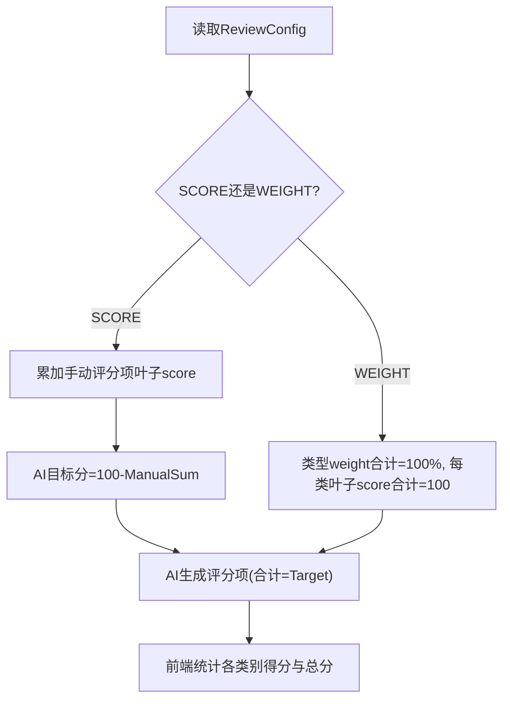
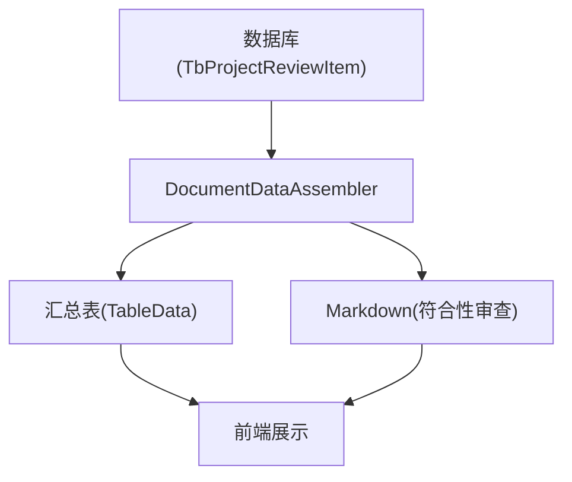
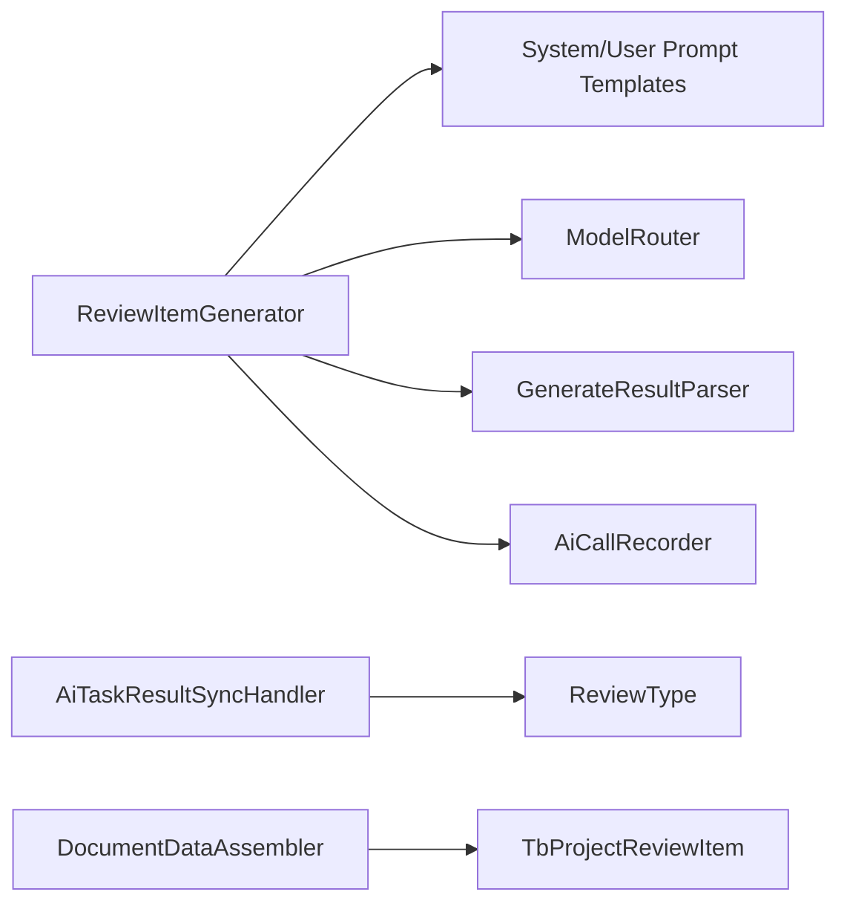

# 审查项生成器

<cite>
**本文引用的文件**   
- [ReviewItemGenerator.java](file://ele-ai-tender-system/ele-ai-tender-ai/src/main/java/com/jy/eleaitender/ai/processor/generator/ReviewItemGenerator.java)
- [SystemPromptTemplates.java](file://ele-ai-tender-system/ele-ai-tender-ai/src/main/java/com/jy/eleaitender/ai/processor/prompt/SystemPromptTemplates.java)
- [UserPromptTemplates.java](file://ele-ai-tender-system/ele-ai-tender-ai/src/main/java/com/jy/eleaitender/ai/processor/prompt/UserPromptTemplates.java)
- [ReviewType.java](file://ele-ai-tender-system/ele-ai-tender-common/src/main/java/com/jy/eleaitender/common/enums/ReviewType.java)
- [ScoreMode.java](file://ele-ai-tender-system/ele-ai-tender-common/src/main/java/com/jy/eleaitender/common/enums/ScoreMode.java)
- [ReviewConfig.java](file://ele-ai-tender-system/ele-ai-tender-common/src/main/java/com/jy/eleaitender/common/dto/ReviewConfig.java)
- [ReviewTypeConfig.java](file://ele-ai-tender-system/ele-ai-tender-common/src/main/java/com/jy/eleaitender/common/dto/ReviewTypeConfig.java)
- [TemplateReviewItemConfig.java](file://ele-ai-tender-system/ele-ai-tender-common/src/main/java/com/jy/eleaitender/common/dto/TemplateReviewItemConfig.java)
- [AiTaskResultSyncHandler.java](file://ele-ai-tender-system/ele-ai-tender-core/src/main/java/com/jy/eleaitender/core/scheduler/AiTaskResultSyncHandler.java)
- [DocumentDataAssembler.java](file://ele-ai-tender-system/ele-ai-tender-core/src/main/java/com/jy/eleaitender/core/engine/DocumentDataAssembler.java)
- [PhaseReviewItem.vue](file://ele-ai-tender-frontend/src/views/project/phases/PhaseReviewItem.vue)
- [review.ts](file://ele-ai-tender-frontend/src/types/review.ts)
- [template.ts](file://ele-ai-tender-support-frontend/src/types/template.ts)
- [ReviewItemGeneratorTest.java](file://ele-ai-tender-system/ele-ai-tender-ai/src/test/java/com/jy/eleaitender/ai/processor/generator/ReviewItemGeneratorTest.java)
- [ReviewItemPromptTemplatesTest.java](file://ele-ai-tender-system/ele-ai-tender-ai/src/test/java/com/jy/eleaitender/ai/processor/prompt/ReviewItemPromptTemplatesTest.java)
</cite>

## 目录
1. [简介](#简介)
2. [项目结构](#项目结构)
3. [核心组件](#核心组件)
4. [架构总览](#架构总览)
5. [详细组件分析](#详细组件分析)
6. [依赖关系分析](#依赖关系分析)
7. [性能与可扩展性](#性能与可扩展性)
8. [故障排查指南](#故障排查指南)
9. [结论](#结论)
10. [附录](#附录)

## 简介
本文件面向“审查项生成器”（ReviewItemGenerator），系统性阐述其智能审查标准匹配、评分计算逻辑、分类体系、AI驱动的审查标准提取算法、层次化结构设计、评分模型配置与计算方法，以及结果可视化与报告生成机制。文档以代码为依据，结合前后端实现，帮助读者快速理解从招标文件到评审标准树的端到端流程。

## 项目结构
围绕审查项生成器的关键代码分布在以下模块：
- AI 服务层：负责根据项目信息与需求内容调用大模型生成评审项树，并进行JSON归一化与修复。
- 通用枚举与DTO：定义评审类型、评分模式、模板级评审项配置等。
- 核心调度与持久化：将AI输出解析为数据库实体，并构建汇总表格。
- 前端展示：按评审类型分组渲染树形结构，实时计算分值与权重，提供交互编辑能力。

图表来源
- [ReviewItemGenerator.java:74-154](file://ele-ai-tender-system/ele-ai-tender-ai/src/main/java/com/jy/eleaitender/ai/processor/generator/ReviewItemGenerator.java#L74-L154)
- [SystemPromptTemplates.java:195-340](file://ele-ai-tender-system/ele-ai-tender-ai/src/main/java/com/jy/eleaitender/ai/processor/prompt/SystemPromptTemplates.java#L195-L340)
- [UserPromptTemplates.java:90-157](file://ele-ai-tender-system/ele-ai-tender-ai/src/main/java/com/jy/eleaitender/ai/processor/prompt/UserPromptTemplates.java#L90-L157)
- [ReviewType.java:14-36](file://ele-ai-tender-system/ele-ai-tender-common/src/main/java/com/jy/eleaitender/common/enums/ReviewType.java#L14-L36)
- [ScoreMode.java:8-29](file://ele-ai-tender-system/ele-ai-tender-common/src/main/java/com/jy/eleaitender/common/enums/ScoreMode.java#L8-L29)
- [ReviewConfig.java:16-120](file://ele-ai-tender-system/ele-ai-tender-common/src/main/java/com/jy/eleaitender/common/dto/ReviewConfig.java#L16-L120)
- [ReviewTypeConfig.java:10-46](file://ele-ai-tender-system/ele-ai-tender-common/src/main/java/com/jy/eleaitender/common/dto/ReviewTypeConfig.java#L10-L46)
- [TemplateReviewItemConfig.java:12-32](file://ele-ai-tender-system/ele-ai-tender-common/src/main/java/com/jy/eleaitender/common/dto/TemplateReviewItemConfig.java#L12-L32)
- [AiTaskResultSyncHandler.java:494-522](file://ele-ai-tender-system/ele-ai-tender-core/src/main/java/com/jy/eleaitender/core/scheduler/AiTaskResultSyncHandler.java#L494-L522)
- [DocumentDataAssembler.java:106-121](file://ele-ai-tender-system/ele-ai-tender-core/src/main/java/com/jy/eleaitender/core/engine/DocumentDataAssembler.java#L106-L121)
- [PhaseReviewItem.vue:56-84](file://ele-ai-tender-frontend/src/views/project/phases/PhaseReviewItem.vue#L56-L84)
- [review.ts:1-43](file://ele-ai-tender-frontend/src/types/review.ts#L1-L43)
- [template.ts:1-53](file://ele-ai-tender-support-frontend/src/types/template.ts#L1-L53)

章节来源
- [ReviewItemGenerator.java:74-154](file://ele-ai-tender-system/ele-ai-tender-ai/src/main/java/com/jy/eleaitender/ai/processor/generator/ReviewItemGenerator.java#L74-L154)
- [ReviewType.java:14-36](file://ele-ai-tender-system/ele-ai-tender-common/src/main/java/com/jy/eleaitender/common/enums/ReviewType.java#L14-L36)
- [ScoreMode.java:8-29](file://ele-ai-tender-system/ele-ai-tender-common/src/main/java/com/jy/eleaitender/common/enums/ScoreMode.java#L8-L29)
- [ReviewConfig.java:16-120](file://ele-ai-tender-system/ele-ai-tender-common/src/main/java/com/jy/eleaitender/common/dto/ReviewConfig.java#L16-L120)
- [ReviewTypeConfig.java:10-46](file://ele-ai-tender-system/ele-ai-tender-common/src/main/java/com/jy/eleaitender/common/dto/ReviewTypeConfig.java#L10-L46)
- [TemplateReviewItemConfig.java:12-32](file://ele-ai-tender-system/ele-ai-tender-common/src/main/java/com/jy/eleaitender/common/dto/TemplateReviewItemConfig.java#L12-L32)
- [AiTaskResultSyncHandler.java:494-522](file://ele-ai-tender-system/ele-ai-tender-core/src/main/java/com/jy/eleaitender/core/scheduler/AiTaskResultSyncHandler.java#L494-L522)
- [DocumentDataAssembler.java:106-121](file://ele-ai-tender-system/ele-ai-tender-core/src/main/java/com/jy/eleaitender/core/engine/DocumentDataAssembler.java#L106-L121)
- [PhaseReviewItem.vue:56-84](file://ele-ai-tender-frontend/src/views/project/phases/PhaseReviewItem.vue#L56-L84)
- [review.ts:1-43](file://ele-ai-tender-frontend/src/types/review.ts#L1-L43)
- [template.ts:1-53](file://ele-ai-tender-support-frontend/src/types/template.ts#L1-L53)

## 核心组件
- 审查项生成器（ReviewItemGenerator）
  - 职责：解析任务参数、选择评分模式、构建提示词、调用模型、归一化与修复JSON、校验输出结构。
  - 关键点：支持SCORE与WEIGHT两种评分模式；兼容多种AI输出格式；自动将分类对象转换为统一树结构。
- 提示词模板（SystemPromptTemplates / UserPromptTemplates）
  - 职责：约束AI输出的结构与评分规则，确保符合招投标法规与行业惯例。
  - 关键点：明确“符合性审查不计入总分”“叶子节点合计必须等于目标分或权重合计=100%”等硬性规则。
- 配置与枚举（ReviewConfig / ReviewTypeConfig / TemplateReviewItemConfig / ReviewType / ScoreMode）
  - 职责：定义评审类型、是否启用、是否由AI生成标准、是否区分主客观、手动模板项、评分模式等。
  - 关键点：向后兼容null值，默认回退SCORE模式；支持模板级manualItems作为AI未生成时的兜底。
- 结果同步与入库（AiTaskResultSyncHandler）
  - 职责：递归解析AI返回的树形JSON，映射中文分类名为英文枚举，写入数据库。
- 文档组装（DocumentDataAssembler）
  - 职责：基于评审项构建汇总表与Markdown，用于导出或预览。
- 前端展示（PhaseReviewItem.vue + review.ts / template.ts）
  - 职责：按类型分组渲染树，实时计算各类型得分与总分，支持权重模式下的权重分配显示。

章节来源
- [ReviewItemGenerator.java:74-154](file://ele-ai-tender-system/ele-ai-tender-ai/src/main/java/com/jy/eleaitender/ai/processor/generator/ReviewItemGenerator.java#L74-L154)
- [SystemPromptTemplates.java:195-340](file://ele-ai-tender-system/ele-ai-tender-ai/src/main/java/com/jy/eleaitender/ai/processor/prompt/SystemPromptTemplates.java#L195-L340)
- [UserPromptTemplates.java:90-157](file://ele-ai-tender-system/ele-ai-tender-ai/src/main/java/com/jy/eleaitender/ai/processor/prompt/UserPromptTemplates.java#L90-L157)
- [ReviewConfig.java:16-120](file://ele-ai-tender-system/ele-ai-tender-common/src/main/java/com/jy/eleaitender/common/dto/ReviewConfig.java#L16-L120)
- [ReviewTypeConfig.java:10-46](file://ele-ai-tender-system/ele-ai-tender-common/src/main/java/com/jy/eleaitender/common/dto/ReviewTypeConfig.java#L10-L46)
- [TemplateReviewItemConfig.java:12-32](file://ele-ai-tender-system/ele-ai-tender-common/src/main/java/com/jy/eleaitender/common/dto/TemplateReviewItemConfig.java#L12-L32)
- [ReviewType.java:14-36](file://ele-ai-tender-system/ele-ai-tender-common/src/main/java/com/jy/eleaitender/common/enums/ReviewType.java#L14-L36)
- [ScoreMode.java:8-29](file://ele-ai-tender-system/ele-ai-tender-common/src/main/java/com/jy/eleaitender/common/enums/ScoreMode.java#L8-L29)
- [AiTaskResultSyncHandler.java:494-522](file://ele-ai-tender-system/ele-ai-tender-core/src/main/java/com/jy/eleaitender/core/scheduler/AiTaskResultSyncHandler.java#L494-L522)
- [DocumentDataAssembler.java:106-121](file://ele-ai-tender-system/ele-ai-tender-core/src/main/java/com/jy/eleaitender/core/engine/DocumentDataAssembler.java#L106-L121)
- [PhaseReviewItem.vue:56-84](file://ele-ai-tender-frontend/src/views/project/phases/PhaseReviewItem.vue#L56-L84)
- [review.ts:1-43](file://ele-ai-tender-frontend/src/types/review.ts#L1-L43)
- [template.ts:1-53](file://ele-ai-tender-support-frontend/src/types/template.ts#L1-L53)

## 架构总览
审查项生成器的工作流如下：
- 输入：项目信息、需求内容、评审配置（包含启用类型、评分模式、是否由AI生成标准、手动模板项）。
- 处理：
  - 根据评分模式选择系统提示词和用户提示词。
  - 路由至合适的模型进行生成。
  - 对AI输出进行JSON提取、归一化、修复与校验。
- 输出：统一的{"reviewItems": [...]}结构，随后被解析入库并用于报表与前端展示。

图表来源
- [ReviewItemGenerator.java:74-154](file://ele-ai-tender-system/ele-ai-tender-ai/src/main/java/com/jy/eleaitender/ai/processor/generator/ReviewItemGenerator.java#L74-L154)
- [SystemPromptTemplates.java:195-340](file://ele-ai-tender-system/ele-ai-tender-ai/src/main/java/com/jy/eleaitender/ai/processor/prompt/SystemPromptTemplates.java#L195-L340)
- [UserPromptTemplates.java:90-157](file://ele-ai-tender-system/ele-ai-tender-ai/src/main/java/com/jy/eleaitender/ai/processor/prompt/UserPromptTemplates.java#L90-L157)
- [AiTaskResultSyncHandler.java:494-522](file://ele-ai-tender-system/ele-ai-tender-core/src/main/java/com/jy/eleaitender/core/scheduler/AiTaskResultSyncHandler.java#L494-L522)
- [DocumentDataAssembler.java:106-121](file://ele-ai-tender-system/ele-ai-tender-core/src/main/java/com/jy/eleaitender/core/engine/DocumentDataAssembler.java#L106-L121)

## 详细组件分析

### 智能审查标准匹配与评分计算逻辑
- 评分模式
  - SCORE（分值模式）：所有非符合性的叶子评审项score合计必须正好等于100分；符合性审查不计入总分且score为0或省略。
  - WEIGHT（权重模式）：每个评分类型满分100分，类型间用weight百分比分配，所有非符合性类型的weight合计=100%；每类型内叶子score合计=100分。
- 配置驱动
  - 通过ReviewConfig决定启用哪些评审类型、是否由AI生成标准、是否区分主客观。
  - 在SCORE模式下，若存在手动配置的评分项，会先累计其叶子score并从100中扣除，得到AI需生成的目标分。
- 分类识别
  - 支持将AI返回的分类对象（如“技术评审”“商务评审”等键名）转换为统一的一级分类节点，再挂载children。
- 健壮性
  - 当AI输出无法解析时，自动触发JSON修复流程，仅修复格式而不改写实质内容。

图表来源
- [ReviewItemGenerator.java:74-154](file://ele-ai-tender-system/ele-ai-tender-ai/src/main/java/com/jy/eleaitender/ai/processor/generator/ReviewItemGenerator.java#L74-L154)
- [ReviewItemGenerator.java:156-206](file://ele-ai-tender-system/ele-ai-tender-ai/src/main/java/com/jy/eleaitender/ai/processor/generator/ReviewItemGenerator.java#L156-L206)
- [ReviewItemGenerator.java:222-302](file://ele-ai-tender-system/ele-ai-tender-ai/src/main/java/com/jy/eleaitender/ai/processor/generator/ReviewItemGenerator.java#L222-L302)
- [SystemPromptTemplates.java:195-340](file://ele-ai-tender-system/ele-ai-tender-ai/src/main/java/com/jy/eleaitender/ai/processor/prompt/SystemPromptTemplates.java#L195-L340)
- [UserPromptTemplates.java:90-157](file://ele-ai-tender-system/ele-ai-tender-ai/src/main/java/com/jy/eleaitender/ai/processor/prompt/UserPromptTemplates.java#L90-L157)

章节来源
- [ReviewItemGenerator.java:74-154](file://ele-ai-tender-system/ele-ai-tender-ai/src/main/java/com/jy/eleaitender/ai/processor/generator/ReviewItemGenerator.java#L74-L154)
- [ReviewItemGenerator.java:156-206](file://ele-ai-tender-system/ele-ai-tender-ai/src/main/java/com/jy/eleaitender/ai/processor/generator/ReviewItemGenerator.java#L156-L206)
- [ReviewItemGenerator.java:222-302](file://ele-ai-tender-system/ele-ai-tender-ai/src/main/java/com/jy/eleaitender/ai/processor/generator/ReviewItemGenerator.java#L222-L302)
- [SystemPromptTemplates.java:195-340](file://ele-ai-tender-system/ele-ai-tender-ai/src/main/java/com/jy/eleaitender/ai/processor/prompt/SystemPromptTemplates.java#L195-L340)
- [UserPromptTemplates.java:90-157](file://ele-ai-tender-system/ele-ai-tender-ai/src/main/java/com/jy/eleaitender/ai/processor/prompt/UserPromptTemplates.java#L90-L157)

### 审查项分类体系
- 一级分类（类别）
  - 符合性审查（COMPLIANCE）：不参与打分，score为0或省略。
  - 技术标评审（TECHNICAL）：可设置主观/客观属性，参与打分或权重。
  - 资信标评审（CREDIT）：可设置主观/客观属性，参与打分或权重。
  - 商务评审（COMMERCIAL）：参与打分或权重。
- 二级及以下（子项）
  - 叶子节点承载score（分值模式）或subjectivity/isRequired等属性；分类节点score为0或省略。
- 名称映射
  - AI返回中文分类名，后端将其映射为英文枚举值存储，保证一致性。

图表来源
- [ReviewType.java:14-36](file://ele-ai-tender-system/ele-ai-tender-common/src/main/java/com/jy/eleaitender/common/enums/ReviewType.java#L14-L36)
- [ReviewConfig.java:16-120](file://ele-ai-tender-system/ele-ai-tender-common/src/main/java/com/jy/eleaitender/common/dto/ReviewConfig.java#L16-L120)
- [ReviewTypeConfig.java:10-46](file://ele-ai-tender-system/ele-ai-tender-common/src/main/java/com/jy/eleaitender/common/dto/ReviewTypeConfig.java#L10-L46)
- [TemplateReviewItemConfig.java:12-32](file://ele-ai-tender-system/ele-ai-tender-common/src/main/java/com/jy/eleaitender/common/dto/TemplateReviewItemConfig.java#L12-L32)

章节来源
- [ReviewType.java:14-36](file://ele-ai-tender-system/ele-ai-tender-common/src/main/java/com/jy/eleaitender/common/enums/ReviewType.java#L14-L36)
- [ReviewConfig.java:16-120](file://ele-ai-tender-system/ele-ai-tender-common/src/main/java/com/jy/eleaitender/common/dto/ReviewConfig.java#L16-L120)
- [ReviewTypeConfig.java:10-46](file://ele-ai-tender-system/ele-ai-tender-common/src/main/java/com/jy/eleaitender/common/dto/ReviewTypeConfig.java#L10-L46)
- [TemplateReviewItemConfig.java:12-32](file://ele-ai-tender-system/ele-ai-tender-common/src/main/java/com/jy/eleaitender/common/dto/TemplateReviewItemConfig.java#L12-L32)

### AI驱动的审查标准提取算法
- 提示词设计
  - 系统提示词强调专家角色、合规要求、主客观区分、防倾向性等原则。
  - 用户提示词注入项目信息、需求内容、评审方式、启用类型与目标分/权重规则。
- 结构化输出约束
  - 强制根节点为reviewItems且为数组；禁止使用data/result/content/output等包装字段。
  - 分值模式：非符合性叶子score合计=100；权重模式：非符合性类型weight合计=100%，每类型内叶子score合计=100。
- 容错与修复
  - 首次解析失败时，触发JSON修复提示词，仅修复格式，保留原意。

图表来源
- [SystemPromptTemplates.java:195-340](file://ele-ai-tender-system/ele-ai-tender-ai/src/main/java/com/jy/eleaitender/ai/processor/prompt/SystemPromptTemplates.java#L195-L340)
- [UserPromptTemplates.java:90-157](file://ele-ai-tender-system/ele-ai-tender-ai/src/main/java/com/jy/eleaitender/ai/processor/prompt/UserPromptTemplates.java#L90-L157)
- [ReviewItemGenerator.java:222-302](file://ele-ai-tender-system/ele-ai-tender-ai/src/main/java/com/jy/eleaitender/ai/processor/generator/ReviewItemGenerator.java#L222-L302)

章节来源
- [SystemPromptTemplates.java:195-340](file://ele-ai-tender-system/ele-ai-tender-ai/src/main/java/com/jy/eleaitender/ai/processor/prompt/SystemPromptTemplates.java#L195-L340)
- [UserPromptTemplates.java:90-157](file://ele-ai-tender-system/ele-ai-tender-ai/src/main/java/com/jy/eleaitender/ai/processor/prompt/UserPromptTemplates.java#L90-L157)
- [ReviewItemGenerator.java:222-302](file://ele-ai-tender-system/ele-ai-tender-ai/src/main/java/com/jy/eleaitender/ai/processor/generator/ReviewItemGenerator.java#L222-L302)

### 层次化结构设计
- 一级审查项：对应评审类型（符合性审查、技术标评审、资信标评审、商务评审）。
- 二级审查项：具体评审维度或子主题。
- 检查要点：更细粒度的评分点，通常为叶子节点，承载score、subjectivity、isRequired等属性。
- 转换策略：当AI返回分类对象时，自动将每个分类键转为一级节点，并将其数组作为children。

图表来源
- [AiTaskResultSyncHandler.java:494-522](file://ele-ai-tender-system/ele-ai-tender-core/src/main/java/com/jy/eleaitender/core/scheduler/AiTaskResultSyncHandler.java#L494-L522)

章节来源
- [AiTaskResultSyncHandler.java:494-522](file://ele-ai-tender-system/ele-ai-tender-core/src/main/java/com/jy/eleaitender/core/scheduler/AiTaskResultSyncHandler.java#L494-L522)

### 评分模型的配置与计算方法
- 配置入口
  - ReviewConfig.scoreMode：SCORE或WEIGHT。
  - ReviewTypeConfig.enabled/generateStandard/distinguishSubjectivity/manualItems。
- 分值模式（SCORE）
  - 非符合性叶子score合计=100；符合性审查score=0或省略。
  - 若存在手动评分项，先从100中扣除其叶子score总和，剩余部分由AI生成。
- 权重模式（WEIGHT）
  - 非符合性类型weight合计=100%；每类型内叶子score合计=100。
  - 符合性审查不参与权重与计分。
- 前端计算
  - 前端按类型收集叶子score并求和，显示各类别得分与总分；权重模式下同时展示权重。

图表来源
- [ReviewConfig.java:16-120](file://ele-ai-tender-system/ele-ai-tender-common/src/main/java/com/jy/eleaitender/common/dto/ReviewConfig.java#L16-L120)
- [ReviewItemGenerator.java:156-206](file://ele-ai-tender-system/ele-ai-tender-ai/src/main/java/com/jy/eleaitender/ai/processor/generator/ReviewItemGenerator.java#L156-L206)
- [PhaseReviewItem.vue:56-84](file://ele-ai-tender-frontend/src/views/project/phases/PhaseReviewItem.vue#L56-L84)

章节来源
- [ReviewConfig.java:16-120](file://ele-ai-tender-system/ele-ai-tender-common/src/main/java/com/jy/eleaitender/common/dto/ReviewConfig.java#L16-L120)
- [ReviewItemGenerator.java:156-206](file://ele-ai-tender-system/ele-ai-tender-ai/src/main/java/com/jy/eleaitender/ai/processor/generator/ReviewItemGenerator.java#L156-L206)
- [PhaseReviewItem.vue:56-84](file://ele-ai-tender-frontend/src/views/project/phases/PhaseReviewItem.vue#L56-L84)

### 审查结果的可视化展示与报告生成
- 可视化
  - 前端按评审类型分组渲染树，显示各类别得分与总分；权重模式下展示权重。
- 报告
  - 后端将评审项聚合为汇总表（类别、评审标准、最高分值、主客观属性、响应文件目录等），并可合并相同类别行。
  - 同时支持构建符合性审查的Markdown列表，便于导出与审阅。

图表来源
- [DocumentDataAssembler.java:106-121](file://ele-ai-tender-system/ele-ai-tender-core/src/main/java/com/jy/eleaitender/core/engine/DocumentDataAssembler.java#L106-L121)
- [PhaseReviewItem.vue:56-84](file://ele-ai-tender-frontend/src/views/project/phases/PhaseReviewItem.vue#L56-L84)

章节来源
- [DocumentDataAssembler.java:106-121](file://ele-ai-tender-system/ele-ai-tender-core/src/main/java/com/jy/eleaitender/core/engine/DocumentDataAssembler.java#L106-L121)
- [PhaseReviewItem.vue:56-84](file://ele-ai-tender-frontend/src/views/project/phases/PhaseReviewItem.vue#L56-L84)

## 依赖关系分析
- 组件耦合
  - ReviewItemGenerator依赖提示词模板、模型路由、结果解析与记录器。
  - AiTaskResultSyncHandler依赖ReviewType枚举进行中文→英文映射。
  - DocumentDataAssembler依赖评审项数据构建报表。
- 外部依赖
  - 大模型API（通过RoutedChatClient调用）。
  - JSON序列化（ObjectMapper）。
- 潜在循环
  - 当前无直接循环依赖；生成器与同步处理器职责清晰分离。

图表来源
- [ReviewItemGenerator.java:74-154](file://ele-ai-tender-system/ele-ai-tender-ai/src/main/java/com/jy/eleaitender/ai/processor/generator/ReviewItemGenerator.java#L74-L154)
- [AiTaskResultSyncHandler.java:494-522](file://ele-ai-tender-system/ele-ai-tender-core/src/main/java/com/jy/eleaitender/core/scheduler/AiTaskResultSyncHandler.java#L494-L522)
- [DocumentDataAssembler.java:106-121](file://ele-ai-tender-system/ele-ai-tender-core/src/main/java/com/jy/eleaitender/core/engine/DocumentDataAssembler.java#L106-L121)

章节来源
- [ReviewItemGenerator.java:74-154](file://ele-ai-tender-system/ele-ai-tender-ai/src/main/java/com/jy/eleaitender/ai/processor/generator/ReviewItemGenerator.java#L74-L154)
- [AiTaskResultSyncHandler.java:494-522](file://ele-ai-tender-system/ele-ai-tender-core/src/main/java/com/jy/eleaitender/core/scheduler/AiTaskResultSyncHandler.java#L494-L522)
- [DocumentDataAssembler.java:106-121](file://ele-ai-tender-system/ele-ai-tender-core/src/main/java/com/jy/eleaitender/core/engine/DocumentDataAssembler.java#L106-L121)

## 性能与可扩展性
- 性能
  - 生成过程为同步调用，建议在高并发场景下配合线程池与限流策略。
  - JSON归一化与修复为轻量操作，复杂度主要取决于AI输出大小。
- 可扩展
  - 新增评审类型：扩展ReviewType枚举并在分类映射处补充。
  - 新增评分模式：在ScoreMode与提示词模板中增加相应规则。
  - 增强修复策略：可在JSON修复阶段引入二次校验与重试上限控制。

[本节为通用指导，无需源码引用]

## 故障排查指南
- 常见问题
  - AI输出不包含reviewItems数组：触发JSON修复流程；若仍失败，检查提示词与模型连通性。
  - 分值合计不为100或权重不为100%：确认配置是否正确、是否存在手动评分项未计入。
  - 分类名映射错误：检查AiTaskResultSyncHandler中的中文→英文映射逻辑。
- 定位方法
  - 查看生成日志与AI调用记录，确认system/user提示词与返回内容。
  - 使用单元测试覆盖边界情况（如仅启用符合性审查、空配置等）。

章节来源
- [ReviewItemGeneratorTest.java:102-219](file://ele-ai-tender-system/ele-ai-tender-ai/src/test/java/com/jy/eleaitender/ai/processor/generator/ReviewItemGeneratorTest.java#L102-L219)
- [ReviewItemPromptTemplatesTest.java:1-33](file://ele-ai-tender-system/ele-ai-tender-ai/src/test/java/com/jy/eleaitender/ai/processor/prompt/ReviewItemPromptTemplatesTest.java#L1-L33)

## 结论
审查项生成器通过“配置驱动+提示词约束+JSON归一化与修复”的组合，实现了从招标文件到标准化评审标准树的自动化生成。其支持分值与权重两种评分模式，兼容多种AI输出格式，并提供完善的可视化与报告能力。建议在后续迭代中持续优化提示词质量、增强修复策略与监控指标，以提升稳定性与可用性。

[本节为总结，无需源码引用]

## 附录
- 术语
  - 符合性审查：不参与打分的资格与合规性检查。
  - 技术标评审：针对技术方案、实施能力等的评分。
  - 资信标评审：针对企业信用、资质、业绩等的评分。
  - 商务评审：针对报价、商务条款等的评分。
- 参考
  - 相关测试用例验证了分类转换、JSON修复与评分模式选择等行为。

章节来源
- [ReviewItemGeneratorTest.java:102-219](file://ele-ai-tender-system/ele-ai-tender-ai/src/test/java/com/jy/eleaitender/ai/processor/generator/ReviewItemGeneratorTest.java#L102-L219)
- [ReviewItemPromptTemplatesTest.java:1-33](file://ele-ai-tender-system/ele-ai-tender-ai/src/test/java/com/jy/eleaitender/ai/processor/prompt/ReviewItemPromptTemplatesTest.java#L1-L33)