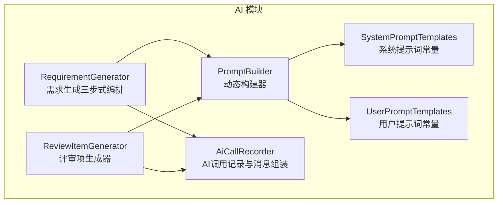
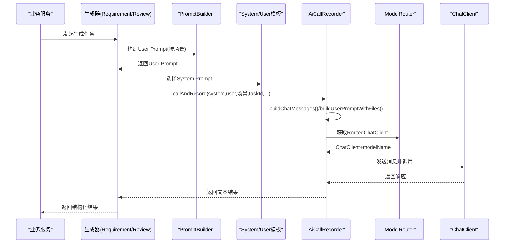
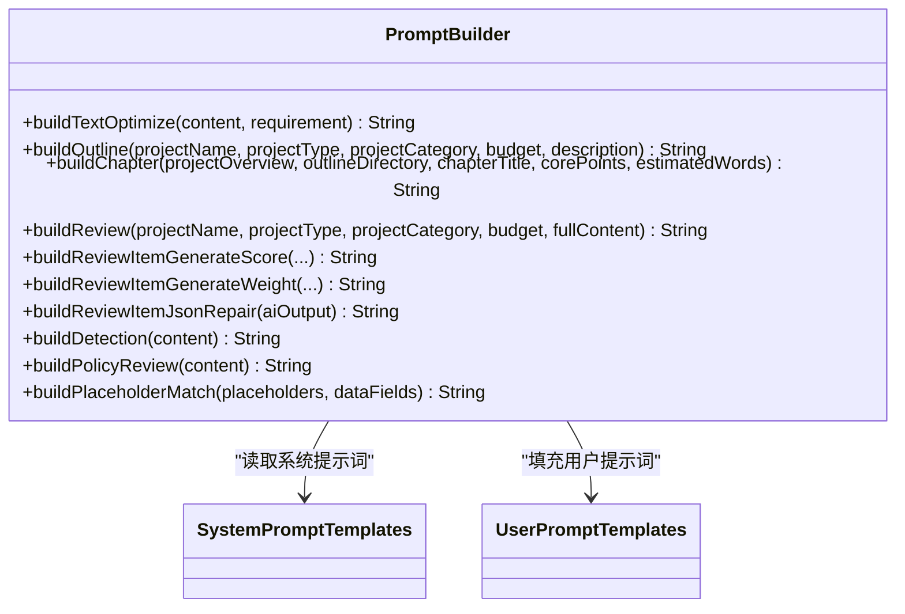
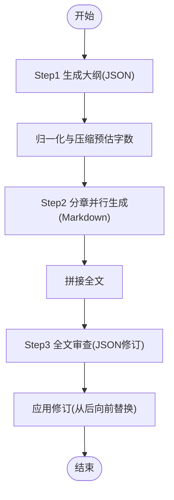
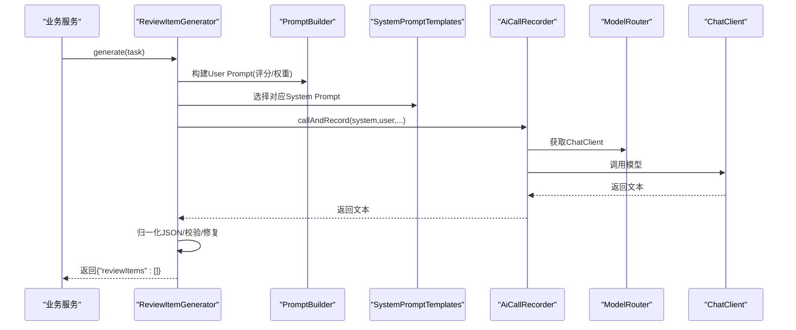
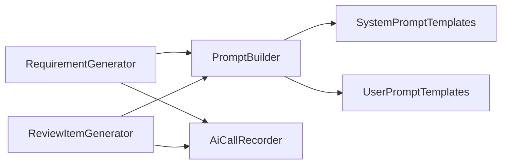

# 提示词工程框架

<cite>
**本文引用的文件**   
- [PromptBuilder.java](file://ele-ai-tender-system/ele-ai-tender-ai/src/main/java/com/jy/eleaitender/ai/processor/prompt/PromptBuilder.java)
- [SystemPromptTemplates.java](file://ele-ai-tender-system/ele-ai-tender-ai/src/main/java/com/jy/eleaitender/ai/processor/prompt/SystemPromptTemplates.java)
- [UserPromptTemplates.java](file://ele-ai-tender-system/ele-ai-tender-ai/src/main/java/com/jy/eleaitender/ai/processor/prompt/UserPromptTemplates.java)
- [RequirementGenerator.java](file://ele-ai-tender-system/ele-ai-tender-ai/src/main/java/com/jy/eleaitender/ai/processor/generator/RequirementGenerator.java)
- [ReviewItemGenerator.java](file://ele-ai-tender-system/ele-ai-tender-ai/src/main/java/com/jy/eleaitender/ai/processor/generator/ReviewItemGenerator.java)
- [AiCallRecorder.java](file://ele-ai-tender-system/ele-ai-tender-ai/src/main/java/com/jy/eleaitender/ai/processor/recorder/AiCallRecorder.java)
- [CORE_MODULE_SPEC.md](file://docs/rules/CORE_MODULE_SPEC.md)
</cite>

## 目录
1. [引言](#引言)
2. [项目结构](#项目结构)
3. [核心组件](#核心组件)
4. [架构总览](#架构总览)
5. [详细组件分析](#详细组件分析)
6. [依赖关系分析](#依赖关系分析)
7. [性能与可扩展性](#性能与可扩展性)
8. [故障排查指南](#故障排查指南)
9. [结论](#结论)
10. [附录：模板库与复用模式](#附录模板库与复用模式)

## 引言
本文件面向“提示词工程”在招标文档工具中的落地实践，围绕 SystemPromptTemplates、UserPromptTemplates 的设计模式与最佳实践，系统阐述 PromptBuilder 的动态构建机制（参数注入、上下文管理、模板组合），并解释系统提示词与用户提示词的分离原则。同时提供优化策略（约束条件、示例引导、思维链）、版本管理与A/B测试方案、效果评估指标与调优工具使用建议，以及常见业务场景的模板库与复用模式。

## 项目结构
本项目采用分层与按能力域组织的方式，提示词工程相关代码集中在 AI 模块的 prompt 包中，并由生成器（generator）与调用记录器（recorder）协同完成端到端流程。

图示来源
- [PromptBuilder.java:1-173](file://ele-ai-tender-system/ele-ai-tender-ai/src/main/java/com/jy/eleaitender/ai/processor/prompt/PromptBuilder.java#L1-L173)
- [SystemPromptTemplates.java:1-497](file://ele-ai-tender-system/ele-ai-tender-ai/src/main/java/com/jy/eleaitender/ai/processor/prompt/SystemPromptTemplates.java#L1-L497)
- [UserPromptTemplates.java:1-225](file://ele-ai-tender-system/ele-ai-tender-ai/src/main/java/com/jy/eleaitender/ai/processor/prompt/UserPromptTemplates.java#L1-L225)
- [RequirementGenerator.java:1-800](file://ele-ai-tender-system/ele-ai-tender-ai/src/main/java/com/jy/eleaitender/ai/processor/generator/RequirementGenerator.java#L1-L800)
- [ReviewItemGenerator.java:1-305](file://ele-ai-tender-system/ele-ai-tender-ai/src/main/java/com/jy/eleaitender/ai/processor/generator/ReviewItemGenerator.java#L1-L305)
- [AiCallRecorder.java:65-98](file://ele-ai-tender-system/ele-ai-tender-ai/src/main/java/com/jy/eleaitender/ai/processor/recorder/AiCallRecorder.java#L65-L98)

章节来源
- [PromptBuilder.java:1-173](file://ele-ai-tender-system/ele-ai-tender-ai/src/main/java/com/jy/eleaitender/ai/processor/prompt/PromptBuilder.java#L1-L173)
- [SystemPromptTemplates.java:1-497](file://ele-ai-tender-system/ele-ai-tender-ai/src/main/java/com/jy/eleaitender/ai/processor/prompt/SystemPromptTemplates.java#L1-L497)
- [UserPromptTemplates.java:1-225](file://ele-ai-tender-system/ele-ai-tender-ai/src/main/java/com/jy/eleaitender/ai/processor/prompt/UserPromptTemplates.java#L1-L225)
- [RequirementGenerator.java:1-800](file://ele-ai-tender-system/ele-ai-tender-ai/src/main/java/com/jy/eleaitender/ai/processor/generator/RequirementGenerator.java#L1-L800)
- [ReviewItemGenerator.java:1-305](file://ele-ai-tender-system/ele-ai-tender-ai/src/main/java/com/jy/eleaitender/ai/processor/generator/ReviewItemGenerator.java#L1-L305)
- [AiCallRecorder.java:65-98](file://ele-ai-tender-system/ele-ai-tender-ai/src/main/java/com/jy/eleaitender/ai/processor/recorder/AiCallRecorder.java#L65-L98)

## 核心组件
- SystemPromptTemplates：集中定义系统级角色、任务边界、输出规范与硬性规则，确保模型行为一致性与可审计性。
- UserPromptTemplates：承载具体任务的输入上下文与指令，通过占位符注入业务数据。
- PromptBuilder：统一封装各场景的 User Prompt 构建方法，屏蔽模板细节，提供默认值与类型标签映射等能力。
- RequirementGenerator / ReviewItemGenerator：编排提示词构建、模型路由、结果解析与后处理，形成端到端流水线。
- AiCallRecorder：负责消息组装（SystemMessage/UserMessage）、文件内容注入、调用记录与日志。

章节来源
- [SystemPromptTemplates.java:1-497](file://ele-ai-tender-system/ele-ai-tender-ai/src/main/java/com/jy/eleaitender/ai/processor/prompt/SystemPromptTemplates.java#L1-L497)
- [UserPromptTemplates.java:1-225](file://ele-ai-tender-system/ele-ai-tender-ai/src/main/java/com/jy/eleaitender/ai/processor/prompt/UserPromptTemplates.java#L1-L225)
- [PromptBuilder.java:1-173](file://ele-ai-tender-system/ele-ai-tender-ai/src/main/java/com/jy/eleaitender/ai/processor/prompt/PromptBuilder.java#L1-L173)
- [RequirementGenerator.java:1-800](file://ele-ai-tender-system/ele-ai-tender-ai/src/main/java/com/jy/eleaitender/ai/processor/generator/RequirementGenerator.java#L1-L800)
- [ReviewItemGenerator.java:1-305](file://ele-ai-tender-system/ele-ai-tender-ai/src/main/java/com/jy/eleaitender/ai/processor/generator/ReviewItemGenerator.java#L1-L305)
- [AiCallRecorder.java:65-98](file://ele-ai-tender-system/ele-ai-tender-ai/src/main/java/com/jy/eleaitender/ai/processor/recorder/AiCallRecorder.java#L65-L98)

## 架构总览
下图展示从业务入口到模型调用的完整链路，突出提示词构建、上下文注入与记录归档的关键节点。

图示来源
- [RequirementGenerator.java:197-238](file://ele-ai-tender-system/ele-ai-tender-ai/src/main/java/com/jy/eleaitender/ai/processor/generator/RequirementGenerator.java#L197-L238)
- [ReviewItemGenerator.java:74-154](file://ele-ai-tender-system/ele-ai-tender-ai/src/main/java/com/jy/eleaitender/ai/processor/generator/ReviewItemGenerator.java#L74-L154)
- [PromptBuilder.java:23-162](file://ele-ai-tender-system/ele-ai-tender-ai/src/main/java/com/jy/eleaitender/ai/processor/prompt/PromptBuilder.java#L23-L162)
- [AiCallRecorder.java:83-98](file://ele-ai-tender-system/ele-ai-tender-ai/src/main/java/com/jy/eleaitender/ai/processor/recorder/AiCallRecorder.java#L83-L98)

## 详细组件分析

### SystemPromptTemplates 设计模式与最佳实践
- 角色与职责明确：每个系统提示词以专家角色开场，限定领域知识与回答风格。
- 任务边界清晰：明确输入材料、任务目标与禁止事项，减少歧义。
- 输出规范前置：强制 JSON/Markdown 格式、字段名、根节点约束，降低解析成本。
- 硬性规则内嵌：如总分=100、权重合计=100%、字数上限等，作为不可违背的硬约束。
- 防偏差设计：强调“不要输出解释说明”“不要包裹外层字段”，提升稳定性。

章节来源
- [SystemPromptTemplates.java:11-41](file://ele-ai-tender-system/ele-ai-tender-ai/src/main/java/com/jy/eleaitender/ai/processor/prompt/SystemPromptTemplates.java#L11-L41)
- [SystemPromptTemplates.java:71-122](file://ele-ai-tender-system/ele-ai-tender-ai/src/main/java/com/jy/eleaitender/ai/processor/prompt/SystemPromptTemplates.java#L71-L122)
- [SystemPromptTemplates.java:127-152](file://ele-ai-tender-system/ele-ai-tender-ai/src/main/java/com/jy/eleaitender/ai/processor/prompt/SystemPromptTemplates.java#L127-L152)
- [SystemPromptTemplates.java:157-188](file://ele-ai-tender-system/ele-ai-tender-ai/src/main/java/com/jy/eleaitender/ai/processor/prompt/SystemPromptTemplates.java#L157-L188)
- [SystemPromptTemplates.java:195-251](file://ele-ai-tender-system/ele-ai-tender-ai/src/main/java/com/jy/eleaitender/ai/processor/prompt/SystemPromptTemplates.java#L195-L251)
- [SystemPromptTemplates.java:257-304](file://ele-ai-tender-system/ele-ai-tender-ai/src/main/java/com/jy/eleaitender/ai/processor/prompt/SystemPromptTemplates.java#L257-L304)
- [SystemPromptTemplates.java:309-340](file://ele-ai-tender-system/ele-ai-tender-ai/src/main/java/com/jy/eleaitender/ai/processor/prompt/SystemPromptTemplates.java#L309-L340)
- [SystemPromptTemplates.java:347-374](file://ele-ai-tender-system/ele-ai-tender-ai/src/main/java/com/jy/eleaitender/ai/processor/prompt/SystemPromptTemplates.java#L347-L374)
- [SystemPromptTemplates.java:379-405](file://ele-ai-tender-system/ele-ai-tender-ai/src/main/java/com/jy/eleaitender/ai/processor/prompt/SystemPromptTemplates.java#L379-L405)
- [SystemPromptTemplates.java:410-438](file://ele-ai-tender-system/ele-ai-tender-ai/src/main/java/com/jy/eleaitender/ai/processor/prompt/SystemPromptTemplates.java#L410-L438)
- [SystemPromptTemplates.java:443-470](file://ele-ai-tender-system/ele-ai-tender-ai/src/main/java/com/jy/eleaitender/ai/processor/prompt/SystemPromptTemplates.java#L443-L470)
- [SystemPromptTemplates.java:478-494](file://ele-ai-tender-system/ele-ai-tender-ai/src/main/java/com/jy/eleaitender/ai/processor/prompt/SystemPromptTemplates.java#L478-L494)

### UserPromptTemplates 设计模式与最佳实践
- 参数化模板：使用占位符将业务数据注入，保持模板稳定、数据可变。
- 上下文分层：先给出全局背景（项目名称、类型、预算），再聚焦当前任务（章节要点、字数上限）。
- 强约束显式化：对评分合计、权重合计、JSON 根节点等进行重复强调，提高一致性。
- 示例引导：在模板中嵌入目标结构或样例片段，帮助模型对齐输出。

章节来源
- [UserPromptTemplates.java:14-21](file://ele-ai-tender-system/ele-ai-tender-ai/src/main/java/com/jy/eleaitender/ai/processor/prompt/UserPromptTemplates.java#L14-L21)
- [UserPromptTemplates.java:43-51](file://ele-ai-tender-system/ele-ai-tender-ai/src/main/java/com/jy/eleaitender/ai/processor/prompt/UserPromptTemplates.java#L43-L51)
- [UserPromptTemplates.java:57-70](file://ele-ai-tender-system/ele-ai-tender-ai/src/main/java/com/jy/eleaitender/ai/processor/prompt/UserPromptTemplates.java#L57-L70)
- [UserPromptTemplates.java:76-82](file://ele-ai-tender-system/ele-ai-tender-ai/src/main/java/com/jy/eleaitender/ai/processor/prompt/UserPromptTemplates.java#L76-L82)
- [UserPromptTemplates.java:90-122](file://ele-ai-tender-system/ele-ai-tender-ai/src/main/java/com/jy/eleaitender/ai/processor/prompt/UserPromptTemplates.java#L90-L122)
- [UserPromptTemplates.java:128-157](file://ele-ai-tender-system/ele-ai-tender-ai/src/main/java/com/jy/eleaitender/ai/processor/prompt/UserPromptTemplates.java#L128-L157)
- [UserPromptTemplates.java:163-184](file://ele-ai-tender-system/ele-ai-tender-ai/src/main/java/com/jy/eleaitender/ai/processor/prompt/UserPromptTemplates.java#L163-L184)
- [UserPromptTemplates.java:192-196](file://ele-ai-tender-system/ele-ai-tender-ai/src/main/java/com/jy/eleaitender/ai/processor/prompt/UserPromptTemplates.java#L192-L196)
- [UserPromptTemplates.java:202-207](file://ele-ai-tender-system/ele-ai-tender-ai/src/main/java/com/jy/eleaitender/ai/processor/prompt/UserPromptTemplates.java#L202-L207)
- [UserPromptTemplates.java:215-223](file://ele-ai-tender-system/ele-ai-tender-ai/src/main/java/com/jy/eleaitender/ai/processor/prompt/UserPromptTemplates.java#L215-L223)

### PromptBuilder 动态构建机制
- 参数注入：通过 String.format 将业务参数注入 User 模板，支持默认值与枚举标签映射。
- 上下文管理：根据场景选择不同模板与方法，保证上下文最小必要且足够充分。
- 模板组合：System 与 User 模板解耦，由生成器在运行时组合；避免在模板中混入控制逻辑。
- 安全注意：注释明确指出避免使用 Spring AI 的 PromptTemplate 变量语法，防止花括号被误解析。

图示来源
- [PromptBuilder.java:23-162](file://ele-ai-tender-system/ele-ai-tender-ai/src/main/java/com/jy/eleaitender/ai/processor/prompt/PromptBuilder.java#L23-L162)
- [SystemPromptTemplates.java:1-497](file://ele-ai-tender-system/ele-ai-tender-ai/src/main/java/com/jy/eleaitender/ai/processor/prompt/SystemPromptTemplates.java#L1-L497)
- [UserPromptTemplates.java:1-225](file://ele-ai-tender-system/ele-ai-tender-ai/src/main/java/com/jy/eleaitender/ai/processor/prompt/UserPromptTemplates.java#L1-L225)

章节来源
- [PromptBuilder.java:1-173](file://ele-ai-tender-system/ele-ai-tender-ai/src/main/java/com/jy/eleaitender/ai/processor/prompt/PromptBuilder.java#L1-L173)

### 需求生成三步式编排（大纲→分章→审查修订）
- Step1 大纲：基于项目信息生成结构化大纲，包含章节标题、核心要点与预估字数。
- Step2 分章并行：按并发上限生成各章节正文，实时推送进度。
- Step3 审查修订：全文审查并输出修订列表，代码层精确替换，避免误改。

图示来源
- [RequirementGenerator.java:124-195](file://ele-ai-tender-system/ele-ai-tender-ai/src/main/java/com/jy/eleaitender/ai/processor/generator/RequirementGenerator.java#L124-L195)
- [RequirementGenerator.java:197-238](file://ele-ai-tender-system/ele-ai-tender-ai/src/main/java/com/jy/eleaitender/ai/processor/generator/RequirementGenerator.java#L197-L238)
- [RequirementGenerator.java:347-428](file://ele-ai-tender-system/ele-ai-tender-ai/src/main/java/com/jy/eleaitender/ai/processor/generator/RequirementGenerator.java#L347-L428)
- [RequirementGenerator.java:494-507](file://ele-ai-tender-system/ele-ai-tender-ai/src/main/java/com/jy/eleaitender/ai/processor/generator/RequirementGenerator.java#L494-L507)
- [RequirementGenerator.java:646-692](file://ele-ai-tender-system/ele-ai-tender-ai/src/main/java/com/jy/eleaitender/ai/processor/generator/RequirementGenerator.java#L646-L692)
- [RequirementGenerator.java:702-764](file://ele-ai-tender-system/ele-ai-tender-ai/src/main/java/com/jy/eleaitender/ai/processor/generator/RequirementGenerator.java#L702-L764)

章节来源
- [RequirementGenerator.java:1-800](file://ele-ai-tender-system/ele-ai-tender-ai/src/main/java/com/jy/eleaitender/ai/processor/generator/RequirementGenerator.java#L1-L800)

### 评审项生成（评分/权重双模式）
- 评分模式：AI 生成叶子节点分数，要求非符合性类型叶子合计=目标分。
- 权重模式：一级分类设置权重%，每类内叶子合计=100分。
- JSON 修复：若初始输出不合法，触发二次修复提示词，仅修正格式不改实质内容。

图示来源
- [ReviewItemGenerator.java:74-154](file://ele-ai-tender-system/ele-ai-tender-ai/src/main/java/com/jy/eleaitender/ai/processor/generator/ReviewItemGenerator.java#L74-L154)
- [ReviewItemGenerator.java:202-206](file://ele-ai-tender-system/ele-ai-tender-ai/src/main/java/com/jy/eleaitender/ai/processor/generator/ReviewItemGenerator.java#L202-L206)
- [PromptBuilder.java:95-133](file://ele-ai-tender-system/ele-ai-tender-ai/src/main/java/com/jy/eleaitender/ai/processor/prompt/PromptBuilder.java#L95-L133)
- [SystemPromptTemplates.java:195-304](file://ele-ai-tender-system/ele-ai-tender-ai/src/main/java/com/jy/eleaitender/ai/processor/prompt/SystemPromptTemplates.java#L195-L304)

章节来源
- [ReviewItemGenerator.java:1-305](file://ele-ai-tender-system/ele-ai-tender-ai/src/main/java/com/jy/eleaitender/ai/processor/generator/ReviewItemGenerator.java#L1-L305)

### 上下文管理与文件注入
- 文件内容注入：在需要时通过 Recorder 将文件内容追加到用户提示词末尾，避免重复注入。
- 消息组装：优先使用 SystemMessage/UserMessage 直接发送完整提示词，规避模板解析风险。

章节来源
- [AiCallRecorder.java:65-98](file://ele-ai-tender-system/ele-ai-tender-ai/src/main/java/com/jy/eleaitender/ai/processor/recorder/AiCallRecorder.java#L65-L98)

## 依赖关系分析
- 低耦合：PromptBuilder 仅依赖模板常量与枚举，无外部状态。
- 高内聚：生成器聚合了提示词构建、模型路由、结果解析与后处理。
- 记录与可观测：AiCallRecorder 贯穿调用生命周期，便于追踪与回溯。

图示来源
- [PromptBuilder.java:1-173](file://ele-ai-tender-system/ele-ai-tender-ai/src/main/java/com/jy/eleaitender/ai/processor/prompt/PromptBuilder.java#L1-L173)
- [RequirementGenerator.java:1-800](file://ele-ai-tender-system/ele-ai-tender-ai/src/main/java/com/jy/eleaitender/ai/processor/generator/RequirementGenerator.java#L1-L800)
- [ReviewItemGenerator.java:1-305](file://ele-ai-tender-system/ele-ai-tender-ai/src/main/java/com/jy/eleaitender/ai/processor/generator/ReviewItemGenerator.java#L1-L305)
- [AiCallRecorder.java:65-98](file://ele-ai-tender-system/ele-ai-tender-ai/src/main/java/com/jy/eleaitender/ai/processor/recorder/AiCallRecorder.java#L65-L98)

章节来源
- [PromptBuilder.java:1-173](file://ele-ai-tender-system/ele-ai-tender-ai/src/main/java/com/jy/eleaitender/ai/processor/prompt/PromptBuilder.java#L1-L173)
- [RequirementGenerator.java:1-800](file://ele-ai-tender-system/ele-ai-tender-ai/src/main/java/com/jy/eleaitender/ai/processor/generator/RequirementGenerator.java#L1-L800)
- [ReviewItemGenerator.java:1-305](file://ele-ai-tender-system/ele-ai-tender-ai/src/main/java/com/jy/eleaitender/ai/processor/generator/ReviewItemGenerator.java#L1-L305)
- [AiCallRecorder.java:65-98](file://ele-ai-tender-system/ele-ai-tender-ai/src/main/java/com/jy/eleaitender/ai/processor/recorder/AiCallRecorder.java#L65-L98)

## 性能与可扩展性
- 并发控制：分章生成使用信号量限制并发度，避免触发 API 速率限制。
- 虚拟线程：使用虚拟线程执行器提升 I/O 密集型任务吞吐。
- Token 优化：审查阶段不传文件列表，减少 token 消耗。
- 降级策略：大纲生成失败时使用预设模板兜底，保障可用性。

章节来源
- [RequirementGenerator.java:347-428](file://ele-ai-tender-system/ele-ai-tender-ai/src/main/java/com/jy/eleaitender/ai/processor/generator/RequirementGenerator.java#L347-L428)
- [RequirementGenerator.java:197-238](file://ele-ai-tender-system/ele-ai-tender-ai/src/main/java/com/jy/eleaitender/ai/processor/generator/RequirementGenerator.java#L197-L238)
- [RequirementGenerator.java:284-343](file://ele-ai-tender-system/ele-ai-tender-ai/src/main/java/com/jy/eleaitender/ai/processor/generator/RequirementGenerator.java#L284-L343)

## 故障排查指南
- 输出格式异常：检查是否违反“只输出JSON”“根节点为 reviewItems”等硬性规则；必要时走 JSON 修复流程。
- 字数超限：确认章节预估字数是否超过上限，查看是否触发了压缩逻辑。
- 进度同步：参考进度映射表，确认 COMPLETED/result_synced 状态含义。
- 调用记录：通过 AiCallRecorder 的记录定位请求/响应与耗时。

章节来源
- [CORE_MODULE_SPEC.md:197-213](file://docs/rules/CORE_MODULE_SPEC.md#L197-L213)
- [ReviewItemGenerator.java:202-206](file://ele-ai-tender-system/ele-ai-tender-ai/src/main/java/com/jy/eleaitender/ai/processor/generator/ReviewItemGenerator.java#L202-L206)
- [RequirementGenerator.java:240-279](file://ele-ai-tender-system/ele-ai-tender-ai/src/main/java/com/jy/eleaitender/ai/processor/generator/RequirementGenerator.java#L240-L279)
- [AiCallRecorder.java:65-98](file://ele-ai-tender-system/ele-ai-tender-ai/src/main/java/com/jy/eleaitender/ai/processor/recorder/AiCallRecorder.java#L65-L98)

## 结论
本框架通过“系统提示词+用户提示词”的解耦设计、PromptBuilder 的参数化构建、生成器的编排与 Recorder 的可观测性，实现了稳定、可控、可演进的提示词工程体系。配合严格的输出规范与后置修复机制，显著提升了大模型输出的可用性与一致性。

## 附录：模板库与复用模式
- 文本优化：系统提示词强调专业性与规范性；用户提示词传入原文与优化要求。
- 需求生成：三步式 Agent（大纲→分章→审查），系统提示词分别定义规划、编写与审查角色与规则。
- 评审项生成：评分/权重双模式，系统提示词规定计分口径与 JSON 结构；用户提示词注入项目信息与配置。
- 检测类：敏感词、错别字、政策合规、格式检查，系统提示词定义检测范围与评分规则。
- 占位符匹配：系统提示词定义语义匹配规则；用户提示词传入占位符与数据字段列表。

章节来源
- [SystemPromptTemplates.java:30-41](file://ele-ai-tender-system/ele-ai-tender-ai/src/main/java/com/jy/eleaitender/ai/processor/prompt/SystemPromptTemplates.java#L30-L41)
- [UserPromptTemplates.java:14-21](file://ele-ai-tender-system/ele-ai-tender-ai/src/main/java/com/jy/eleaitender/ai/processor/prompt/UserPromptTemplates.java#L14-L21)
- [SystemPromptTemplates.java:71-122](file://ele-ai-tender-system/ele-ai-tender-ai/src/main/java/com/jy/eleaitender/ai/processor/prompt/SystemPromptTemplates.java#L71-L122)
- [UserPromptTemplates.java:43-70](file://ele-ai-tender-system/ele-ai-tender-ai/src/main/java/com/jy/eleaitender/ai/processor/prompt/UserPromptTemplates.java#L43-L70)
- [SystemPromptTemplates.java:157-188](file://ele-ai-tender-system/ele-ai-tender-ai/src/main/java/com/jy/eleaitender/ai/processor/prompt/SystemPromptTemplates.java#L157-L188)
- [UserPromptTemplates.java:76-82](file://ele-ai-tender-system/ele-ai-tender-ai/src/main/java/com/jy/eleaitender/ai/processor/prompt/UserPromptTemplates.java#L76-L82)
- [SystemPromptTemplates.java:195-304](file://ele-ai-tender-system/ele-ai-tender-ai/src/main/java/com/jy/eleaitender/ai/processor/prompt/SystemPromptTemplates.java#L195-L304)
- [UserPromptTemplates.java:90-157](file://ele-ai-tender-system/ele-ai-tender-ai/src/main/java/com/jy/eleaitender/ai/processor/prompt/UserPromptTemplates.java#L90-L157)
- [SystemPromptTemplates.java:347-470](file://ele-ai-tender-system/ele-ai-tender-ai/src/main/java/com/jy/eleaitender/ai/processor/prompt/SystemPromptTemplates.java#L347-L470)
- [UserPromptTemplates.java:192-207](file://ele-ai-tender-system/ele-ai-tender-ai/src/main/java/com/jy/eleaitender/ai/processor/prompt/UserPromptTemplates.java#L192-L207)
- [SystemPromptTemplates.java:478-494](file://ele-ai-tender-system/ele-ai-tender-ai/src/main/java/com/jy/eleaitender/ai/processor/prompt/SystemPromptTemplates.java#L478-L494)
- [UserPromptTemplates.java:215-223](file://ele-ai-tender-system/ele-ai-tender-ai/src/main/java/com/jy/eleaitender/ai/processor/prompt/UserPromptTemplates.java#L215-L223)