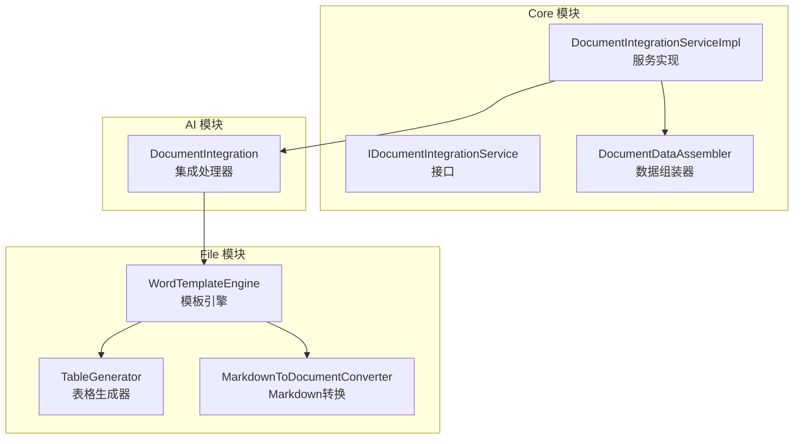
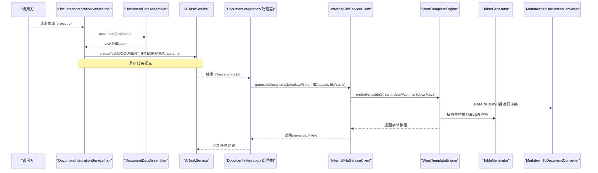
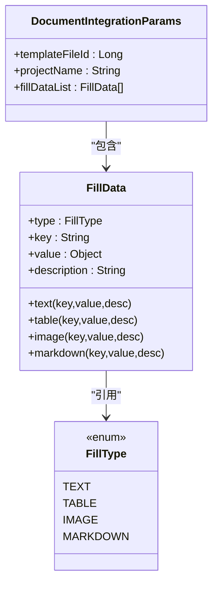
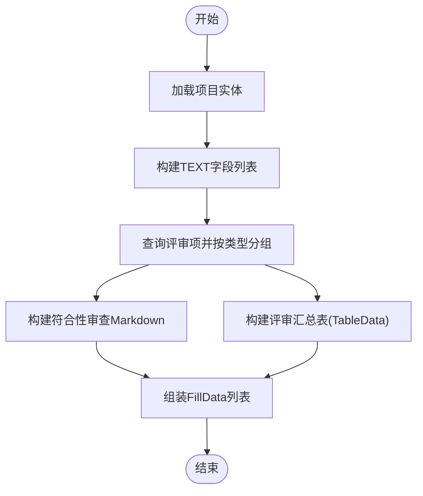
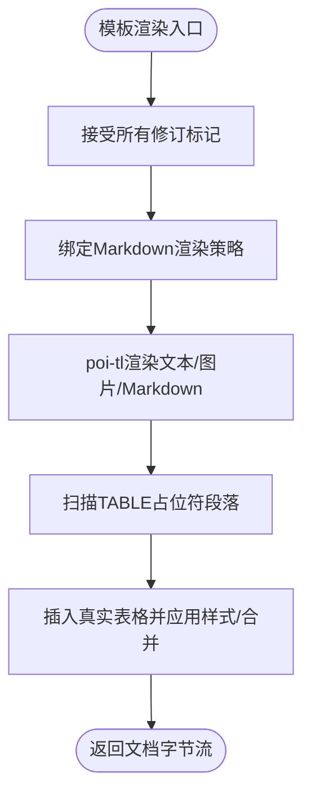
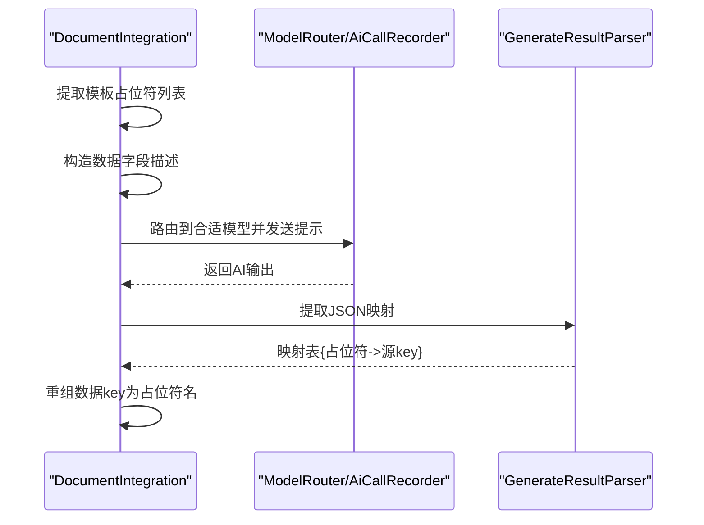
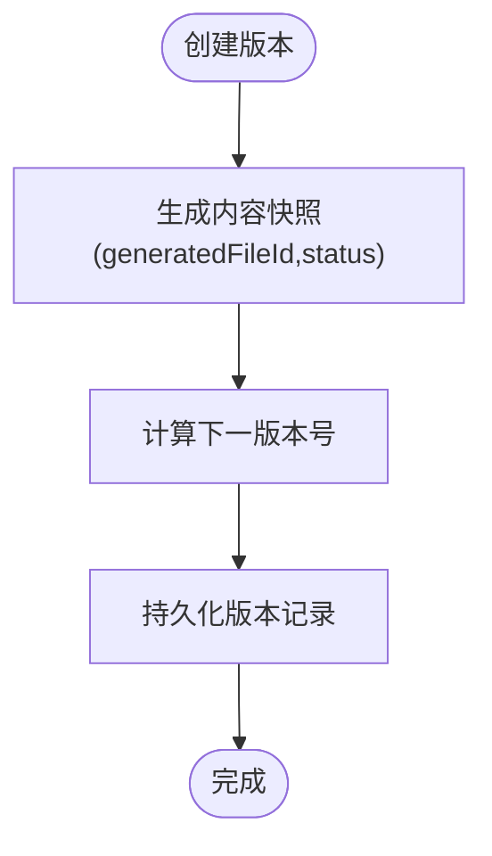
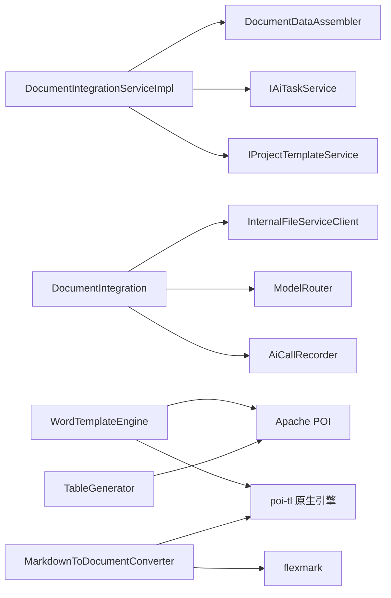

# 文档集成引擎

<cite>
**本文引用的文件**
- [IDocumentIntegrationService.java](file://ele-ai-tender-system/ele-ai-tender-core/src/main/java/com/jy/eleaitender/core/service/IDocumentIntegrationService.java)
- [DocumentIntegrationServiceImpl.java](file://ele-ai-tender-system/ele-ai-tender-core/src/main/java/com/jy/eleaitender/core/service/impl/DocumentIntegrationServiceImpl.java)
- [DocumentDataAssembler.java](file://ele-ai-tender-system/ele-ai-tender-core/src/main/java/com/jy/eleaitender/core/engine/DocumentDataAssembler.java)
- [DocumentIntegrationParams.java](file://ele-ai-tender-system/ele-ai-tender-common/src/main/java/com/jy/eleaitender/common/dto/ai/DocumentIntegrationParams.java)
- [FillData.java](file://ele-ai-tender-system/ele-ai-tender-common/src/main/java/com/jy/eleaitender/common/dto/FillData.java)
- [FillType.java](file://ele-ai-tender-system/ele-ai-tender-common/src/main/java/com/jy/eleaitender/common/dto/FillType.java)
- [DocumentIntegration.java](file://ele-ai-tender-system/ele-ai-tender-ai/src/main/java/com/jy/eleaitender/ai/processor/generator/DocumentIntegration.java)
- [WordTemplateEngine.java](file://ele-ai-tender-system/ele-ai-tender-file/src/main/java/com/jy/eleaitender/file/engine/WordTemplateEngine.java)
- [TableGenerator.java](file://ele-ai-tender-system/ele-ai-tender-file/src/main/java/com/jy/eleaitender/file/engine/TableGenerator.java)
- [MarkdownToDocumentConverter.java](file://ele-ai-tender-system/ele-ai-tender-file/src/main/java/com/jy/eleaitender/file/engine/MarkdownToDocumentConverter.java)
- [FILE_SERVICE_SPEC.md](file://docs/rules/FILE_SERVICE_SPEC.md)
- [ProjectVersionServiceImpl.java](file://ele-ai-tender-system/ele-ai-tender-core/src/main/java/com/jy/eleaitender/core/service/impl/ProjectVersionServiceImpl.java)
</cite>

## 目录
1. [简介](#简介)
2. [项目结构](#项目结构)
3. [核心组件](#核心组件)
4. [架构总览](#架构总览)
5. [详细组件分析](#详细组件分析)
6. [依赖关系分析](#依赖关系分析)
7. [性能与扩展性](#性能与扩展性)
8. [故障排查指南](#故障排查指南)
9. [结论](#结论)
10. [附录](#附录)

## 简介
本文件为“文档集成引擎”的技术文档，聚焦于多源数据融合与模板填充机制。系统通过结构化、半结构化与非结构化文本的统一抽象（FillData），结合 poi-tl 模板引擎与自定义渲染策略，实现 Word 文档的自动化生成。同时提供占位符语义匹配、条件渲染与循环处理能力，并配套版本控制与变更追踪、质量控制流程以及可扩展的模板开发指南。

## 项目结构
文档集成相关代码分布在 core、ai、file 三个模块：
- core 模块负责业务编排与数据组装（服务接口、实现、数据装配器）
- ai 模块负责任务执行与外部调用（文档集成处理器、AI 辅助占位符匹配）
- file 模块负责模板渲染与文档生成（Word 模板引擎、表格生成器、Markdown 转换器）

图表来源
- [IDocumentIntegrationService.java:1-25](file://ele-ai-tender-system/ele-ai-tender-core/src/main/java/com/jy/eleaitender/core/service/IDocumentIntegrationService.java#L1-L25)
- [DocumentIntegrationServiceImpl.java:1-112](file://ele-ai-tender-system/ele-ai-tender-core/src/main/java/com/jy/eleaitender/core/service/impl/DocumentIntegrationServiceImpl.java#L1-L112)
- [DocumentDataAssembler.java:1-267](file://ele-ai-tender-system/ele-ai-tender-core/src/main/java/com/jy/eleaitender/core/engine/DocumentDataAssembler.java#L1-L267)
- [DocumentIntegration.java:1-180](file://ele-ai-tender-system/ele-ai-tender-ai/src/main/java/com/jy/eleaitender/ai/processor/generator/DocumentIntegration.java#L1-L180)
- [WordTemplateEngine.java:1-121](file://ele-ai-tender-system/ele-ai-tender-file/src/main/java/com/jy/eleaitender/file/engine/WordTemplateEngine.java#L1-L121)
- [TableGenerator.java:1-287](file://ele-ai-tender-system/ele-ai-tender-file/src/main/java/com/jy/eleaitender/file/engine/TableGenerator.java#L1-L287)
- [MarkdownToDocumentConverter.java:1-481](file://ele-ai-tender-system/ele-ai-tender-file/src/main/java/com/jy/eleaitender/file/engine/MarkdownToDocumentConverter.java#L1-L481)

章节来源
- [IDocumentIntegrationService.java:1-25](file://ele-ai-tender-system/ele-ai-tender-core/src/main/java/com/jy/eleaitender/core/service/IDocumentIntegrationService.java#L1-L25)
- [DocumentIntegrationServiceImpl.java:1-112](file://ele-ai-tender-system/ele-ai-tender-core/src/main/java/com/jy/eleaitender/core/service/impl/DocumentIntegrationServiceImpl.java#L1-L112)
- [DocumentDataAssembler.java:1-267](file://ele-ai-tender-system/ele-ai-tender-core/src/main/java/com/jy/eleaitender/core/engine/DocumentDataAssembler.java#L1-L267)
- [DocumentIntegration.java:1-180](file://ele-ai-tender-system/ele-ai-tender-ai/src/main/java/com/jy/eleaitender/ai/processor/generator/DocumentIntegration.java#L1-L180)
- [WordTemplateEngine.java:1-121](file://ele-ai-tender-system/ele-ai-tender-file/src/main/java/com/jy/eleaitender/file/engine/WordTemplateEngine.java#L1-L121)
- [TableGenerator.java:1-287](file://ele-ai-tender-system/ele-ai-tender-file/src/main/java/com/jy/eleaitender/file/engine/TableGenerator.java#L1-L287)
- [MarkdownToDocumentConverter.java:1-481](file://ele-ai-tender-system/ele-ai-tender-file/src/main/java/com/jy/eleaitender/file/engine/MarkdownToDocumentConverter.java#L1-L481)

## 核心组件
- 文档集成服务接口与实现：定义 integrate/getPreview/editContent 等能力，协调模板、数据与任务创建。
- 数据组装器：从项目实体与评审项聚合出 FillData 列表，覆盖 TEXT/TABLE/MARKDOWN 类型。
- 文档集成处理器：解析任务参数，反序列化 FillData，调用 File 服务生成 Word。
- 模板引擎与渲染：WordTemplateEngine 使用原生 poi-tl 配置，支持 Markdown 绑定；TableGenerator 以 POI API 编程生成表格；MarkdownToDocumentConverter 将 Markdown AST 转为 DocumentRenderData。
- 数据类型与填充模型：FillData/FillType 统一描述待填充内容及其类型。

章节来源
- [IDocumentIntegrationService.java:1-25](file://ele-ai-tender-system/ele-ai-tender-core/src/main/java/com/jy/eleaitender/core/service/IDocumentIntegrationService.java#L1-L25)
- [DocumentIntegrationServiceImpl.java:1-112](file://ele-ai-tender-system/ele-ai-tender-core/src/main/java/com/jy/eleaitender/core/service/impl/DocumentIntegrationServiceImpl.java#L1-L112)
- [DocumentDataAssembler.java:1-267](file://ele-ai-tender-system/ele-ai-tender-core/src/main/java/com/jy/eleaitender/core/engine/DocumentDataAssembler.java#L1-L267)
- [DocumentIntegration.java:1-180](file://ele-ai-tender-system/ele-ai-tender-ai/src/main/java/com/jy/eleaitender/ai/processor/generator/DocumentIntegration.java#L1-L180)
- [FillData.java:1-60](file://ele-ai-tender-system/ele-ai-tender-common/src/main/java/com/jy/eleaitender/common/dto/FillData.java#L1-L60)
- [FillType.java:1-19](file://ele-ai-tender-system/ele-ai-tender-common/src/main/java/com/jy/eleaitender/common/dto/FillType.java#L1-L19)

## 架构总览
整体采用“服务编排 + AI 处理器 + 模板引擎”的分层架构。core 层负责业务编排与数据准备，ai 层负责任务执行与外部调用，file 层专注模板渲染与文档生成。

图表来源
- [DocumentIntegrationServiceImpl.java:49-78](file://ele-ai-tender-system/ele-ai-tender-core/src/main/java/com/jy/eleaitender/core/service/impl/DocumentIntegrationServiceImpl.java#L49-L78)
- [DocumentDataAssembler.java:47-99](file://ele-ai-tender-system/ele-ai-tender-core/src/main/java/com/jy/eleaitender/core/engine/DocumentDataAssembler.java#L47-L99)
- [DocumentIntegration.java:55-75](file://ele-ai-tender-system/ele-ai-tender-ai/src/main/java/com/jy/eleaitender/ai/processor/generator/DocumentIntegration.java#L55-L75)
- [WordTemplateEngine.java:42-63](file://ele-ai-tender-system/ele-ai-tender-file/src/main/java/com/jy/eleaitender/file/engine/WordTemplateEngine.java#L42-L63)
- [TableGenerator.java:31-53](file://ele-ai-tender-system/ele-ai-tender-file/src/main/java/com/jy/eleaitender/file/engine/TableGenerator.java#L31-L53)
- [MarkdownToDocumentConverter.java:75-88](file://ele-ai-tender-system/ele-ai-tender-file/src/main/java/com/jy/eleaitender/file/engine/MarkdownToDocumentConverter.java#L75-L88)

## 详细组件分析

### 数据模型与类型体系
- FillData：统一的数据填充项，包含 type/key/value/description。value 根据 type 映射到具体类型（TEXT→String、TABLE→TableData、IMAGE→ImageData、MARKDOWN→String）。
- FillType：枚举定义四种填充类型，驱动后续渲染分派。
- DocumentIntegrationParams：任务参数封装，包含模板文件ID、项目名称与 FillData 列表。

图表来源
- [FillData.java:1-60](file://ele-ai-tender-system/ele-ai-tender-common/src/main/java/com/jy/eleaitender/common/dto/FillData.java#L1-L60)
- [FillType.java:1-19](file://ele-ai-tender-system/ele-ai-tender-common/src/main/java/com/jy/eleaitender/common/dto/FillType.java#L1-L19)
- [DocumentIntegrationParams.java:1-19](file://ele-ai-tender-system/ele-ai-tender-common/src/main/java/com/jy/eleaitender/common/dto/ai/DocumentIntegrationParams.java#L1-L19)

章节来源
- [FillData.java:1-60](file://ele-ai-tender-system/ele-ai-tender-common/src/main/java/com/jy/eleaitender/common/dto/FillData.java#L1-L60)
- [FillType.java:1-19](file://ele-ai-tender-system/ele-ai-tender-common/src/main/java/com/jy/eleaitender/common/dto/FillType.java#L1-L19)
- [DocumentIntegrationParams.java:1-19](file://ele-ai-tender-system/ele-ai-tender-common/src/main/java/com/jy/eleaitender/common/dto/ai/DocumentIntegrationParams.java#L1-L19)

### 多源数据融合与填充机制
- 结构化数据：项目基础信息（编号、名称、类别、预算、单位、地点、联系人等）以 TEXT 类型注入。
- 半结构化数据：评审项汇总以 TABLE 类型注入，支持列定义、行数据与合并规则。
- 非结构化文本：需求内容与符合性审查项以 MARKDOWN 类型注入，经 flexmark 解析后由 DocumentRenderPolicy 渲染。

图表来源
- [DocumentDataAssembler.java:47-99](file://ele-ai-tender-system/ele-ai-tender-core/src/main/java/com/jy/eleaitender/core/engine/DocumentDataAssembler.java#L47-L99)
- [DocumentDataAssembler.java:106-121](file://ele-ai-tender-system/ele-ai-tender-core/src/main/java/com/jy/eleaitender/core/engine/DocumentDataAssembler.java#L106-L121)
- [DocumentDataAssembler.java:132-166](file://ele-ai-tender-system/ele-ai-tender-core/src/main/java/com/jy/eleaitender/core/engine/DocumentDataAssembler.java#L132-L166)

章节来源
- [DocumentDataAssembler.java:47-99](file://ele-ai-tender-system/ele-ai-tender-core/src/main/java/com/jy/eleaitender/core/engine/DocumentDataAssembler.java#L47-L99)
- [DocumentDataAssembler.java:106-121](file://ele-ai-tender-system/ele-ai-tender-core/src/main/java/com/jy/eleaitender/core/engine/DocumentDataAssembler.java#L106-L121)
- [DocumentDataAssembler.java:132-166](file://ele-ai-tender-system/ele-ai-tender-core/src/main/java/com/jy/eleaitender/core/engine/DocumentDataAssembler.java#L132-L166)

### 模板引擎工作原理
- 占位符解析：poi-tl 原生引擎使用 Map.get() 访问数据，缺失字段返回空字符串，天然容错。语法支持 {{var}}、{{?items}}...{{/items}}、{{@image}}、{{+include}}、条件区块等。
- 条件渲染与循环处理：通过区块对标签实现，循环需以 ? 标识开始标签，条件以同名变量包裹。
- Markdown 渲染：MARKDOWN 类型的 FillData 在模板中绑定 DocumentRenderPolicy，先将 Markdown 转换为 DocumentRenderData，再由 poi-tl 渲染为段落、列表、表格等。
- 表格生成：TABLE 类型不依赖 poi-tl 循环标签，而是阶段一渲染为占位文本，阶段二由 TableGenerator 扫描并替换为真实表格，避免相邻标签合并导致的错误。

图表来源
- [WordTemplateEngine.java:42-63](file://ele-ai-tender-system/ele-ai-tender-file/src/main/java/com/jy/eleaitender/file/engine/WordTemplateEngine.java#L42-L63)
- [WordTemplateEngine.java:71-89](file://ele-ai-tender-system/ele-ai-tender-file/src/main/java/com/jy/eleaitender/file/engine/WordTemplateEngine.java#L71-L89)
- [TableGenerator.java:31-53](file://ele-ai-tender-system/ele-ai-tender-file/src/main/java/com/jy/eleaitender/file/engine/TableGenerator.java#L31-L53)
- [FILE_SERVICE_SPEC.md:33-71](file://docs/rules/FILE_SERVICE_SPEC.md#L33-L71)

章节来源
- [WordTemplateEngine.java:42-63](file://ele-ai-tender-system/ele-ai-tender-file/src/main/java/com/jy/eleaitender/file/engine/WordTemplateEngine.java#L42-L63)
- [WordTemplateEngine.java:71-89](file://ele-ai-tender-system/ele-ai-tender-file/src/main/java/com/jy/eleaitender/file/engine/WordTemplateEngine.java#L71-L89)
- [TableGenerator.java:31-53](file://ele-ai-tender-system/ele-ai-tender-file/src/main/java/com/jy/eleaitender/file/engine/TableGenerator.java#L31-L53)
- [FILE_SERVICE_SPEC.md:33-71](file://docs/rules/FILE_SERVICE_SPEC.md#L33-L71)

### 占位符语义匹配（可选增强）
当模板占位符名与数据 key 不一致时，可通过 AI 模型进行语义匹配，将模板占位符映射到源数据字段，从而自动适配不同命名风格。当前实现预留了匹配逻辑与回退策略。

图表来源
- [DocumentIntegration.java:111-166](file://ele-ai-tender-system/ele-ai-tender-ai/src/main/java/com/jy/eleaitender/ai/processor/generator/DocumentIntegration.java#L111-L166)

章节来源
- [DocumentIntegration.java:111-166](file://ele-ai-tender-system/ele-ai-tender-ai/src/main/java/com/jy/eleaitender/ai/processor/generator/DocumentIntegration.java#L111-L166)

### 数据映射与转换规则配置
- 字段映射：通过 FillData.key 与模板占位符对应；若存在差异，可使用 AI 占位符匹配功能建立映射。
- 格式转换：FillData.value 按 FillType 转换为具体类型（TEXT→String、TABLE→TableData、IMAGE→ImageData、MARKDOWN→String）。
- 数据验证：在数据组装阶段进行空值安全处理与必要字段检查；在模板渲染前清理修订标记以避免异常。

章节来源
- [DocumentIntegration.java:81-100](file://ele-ai-tender-system/ele-ai-tender-ai/src/main/java/com/jy/eleaitender/ai/processor/generator/DocumentIntegration.java#L81-L100)
- [DocumentDataAssembler.java:47-99](file://ele-ai-tender-system/ele-ai-tender-core/src/main/java/com/jy/eleaitender/core/engine/DocumentDataAssembler.java#L47-L99)
- [WordTemplateEngine.java:71-89](file://ele-ai-tender-system/ele-ai-tender-file/src/main/java/com/jy/eleaitender/file/engine/WordTemplateEngine.java#L71-L89)

### 文档版本控制与变更追踪
- 版本快照：基于项目生成的文件ID与状态快照创建版本记录，版本号递增。
- 变更描述：每次创建版本时可附带变更说明，便于追溯。
- 查询排序：按版本号降序获取历史版本。

图表来源
- [ProjectVersionServiceImpl.java:49-65](file://ele-ai-tender-system/ele-ai-tender-core/src/main/java/com/jy/eleaitender/core/service/impl/ProjectVersionServiceImpl.java#L49-L65)

章节来源
- [ProjectVersionServiceImpl.java:49-65](file://ele-ai-tender-system/ele-ai-tender-core/src/main/java/com/jy/eleaitender/core/service/impl/ProjectVersionServiceImpl.java#L49-L65)

### 文档生成质量控制流程
- 内容完整性检查：确保项目模板已绑定且包含文件；校验项目是否存在；检查活跃任务避免重复生成。
- 格式校验：模板修订标记预处理，防止 poi-tl 编译阶段异常；遵循 poi-tl 原生引擎约束与标签语法规范。
- 一致性验证：表格生成强制边框与默认样式；Markdown 转换保留行内格式与列表结构；占位符与数据 key 一致或经 AI 映射。

章节来源
- [DocumentIntegrationServiceImpl.java:51-78](file://ele-ai-tender-system/ele-ai-tender-core/src/main/java/com/jy/eleaitender/core/service/impl/DocumentIntegrationServiceImpl.java#L51-L78)
- [FILE_SERVICE_SPEC.md:33-71](file://docs/rules/FILE_SERVICE_SPEC.md#L33-L71)
- [TableGenerator.java:234-285](file://ele-ai-tender-system/ele-ai-tender-file/src/main/java/com/jy/eleaitender/file/engine/TableGenerator.java#L234-L285)

### 自定义模板开发与扩展点
- 模板语法：遵循 poi-tl 原生引擎语法，使用 {{var}}、{{?items}}...{{/items}}、{{@image}}、{{+include}} 等标签。
- 数据绑定：在模板中放置与 FillData.key 一致的占位符；如需中文占位符，可启用 AI 占位符匹配。
- 扩展点：
  - 新增 FillType：扩展 FillData/FillType 并在渲染管线增加分派逻辑。
  - 自定义渲染策略：在 WordTemplateEngine 中绑定新的 DocumentRenderPolicy。
  - 表格样式与合并：在 TableGenerator 中调整默认样式与合并规则。
  - Markdown 转换：在 MarkdownToDocumentConverter 中扩展节点处理与样式映射。

章节来源
- [FILE_SERVICE_SPEC.md:33-71](file://docs/rules/FILE_SERVICE_SPEC.md#L33-L71)
- [WordTemplateEngine.java:42-63](file://ele-ai-tender-system/ele-ai-tender-file/src/main/java/com/jy/eleaitender/file/engine/WordTemplateEngine.java#L42-L63)
- [TableGenerator.java:147-184](file://ele-ai-tender-system/ele-ai-tender-file/src/main/java/com/jy/eleaitender/file/engine/TableGenerator.java#L147-L184)
- [MarkdownToDocumentConverter.java:92-116](file://ele-ai-tender-system/ele-ai-tender-file/src/main/java/com/jy/eleaitender/file/engine/MarkdownToDocumentConverter.java#L92-L116)

## 依赖关系分析
- 服务层依赖：
  - DocumentIntegrationServiceImpl 依赖 IAiTaskService、TbProjectMapper、DocumentDataAssembler、IProjectTemplateService。
- 处理器依赖：
  - DocumentIntegration 依赖 GenerateResultParser、InternalFileServiceClient、ModelRouter、AiCallRecorder、ObjectMapper。
- 渲染层依赖：
  - WordTemplateEngine 依赖 poi-tl 原生引擎与 Apache POI DOM 操作。
  - TableGenerator 依赖 Apache POI XWPF API 与 OpenXML schema。
  - MarkdownToDocumentConverter 依赖 flexmark 解析与 poi-tl DocumentRenderData。

图表来源
- [DocumentIntegrationServiceImpl.java:37-47](file://ele-ai-tender-system/ele-ai-tender-core/src/main/java/com/jy/eleaitender/core/service/impl/DocumentIntegrationServiceImpl.java#L37-L47)
- [DocumentIntegration.java:34-47](file://ele-ai-tender-system/ele-ai-tender-ai/src/main/java/com/jy/eleaitender/ai/processor/generator/DocumentIntegration.java#L34-L47)
- [WordTemplateEngine.java:1-32](file://ele-ai-tender-system/ele-ai-tender-file/src/main/java/com/jy/eleaitender/file/engine/WordTemplateEngine.java#L1-L32)
- [TableGenerator.java:1-24](file://ele-ai-tender-system/ele-ai-tender-file/src/main/java/com/jy/eleaitender/file/engine/TableGenerator.java#L1-L24)
- [MarkdownToDocumentConverter.java:1-36](file://ele-ai-tender-system/ele-ai-tender-file/src/main/java/com/jy/eleaitender/file/engine/MarkdownToDocumentConverter.java#L1-L36)

章节来源
- [DocumentIntegrationServiceImpl.java:37-47](file://ele-ai-tender-system/ele-ai-tender-core/src/main/java/com/jy/eleaitender/core/service/impl/DocumentIntegrationServiceImpl.java#L37-L47)
- [DocumentIntegration.java:34-47](file://ele-ai-tender-system/ele-ai-tender-ai/src/main/java/com/jy/eleaitender/ai/processor/generator/DocumentIntegration.java#L34-L47)
- [WordTemplateEngine.java:1-32](file://ele-ai-tender-system/ele-ai-tender-file/src/main/java/com/jy/eleaitender/file/engine/WordTemplateEngine.java#L1-L32)
- [TableGenerator.java:1-24](file://ele-ai-tender-system/ele-ai-tender-file/src/main/java/com/jy/eleaitender/file/engine/TableGenerator.java#L1-L24)
- [MarkdownToDocumentConverter.java:1-36](file://ele-ai-tender-system/ele-ai-tender-file/src/main/java/com/jy/eleaitender/file/engine/MarkdownToDocumentConverter.java#L1-L36)

## 性能与扩展性
- 两阶段渲染：先由 poi-tl 渲染文本/图片/Markdown，再以 POI 编程生成表格，避免复杂循环标签带来的性能与稳定性问题。
- 修订标记预处理：在渲染前清除修订标记，降低 poi-tl 编译阶段的异常风险。
- 可扩展性：通过 FillData/FillType 扩展新数据类型；通过 DocumentRenderPolicy 扩展新渲染策略；通过 TableGenerator 扩展表格样式与合并规则；通过 MarkdownToDocumentConverter 扩展 Markdown 元素处理。

[本节为通用指导，无需列出具体文件来源]

## 故障排查指南
- 模板未绑定或无文件：检查项目模板是否关联有效文件ID。
- 重复集成任务：若存在 PENDING/PROCESSING 状态的任务，会拒绝重复创建。
- 模板修订标记导致异常：确认模板已接受所有修订，或在渲染前执行清理。
- 表格占位符未替换：检查占位符位置与 TableGenerator 的识别逻辑，确保段落文本包含正确前缀。
- Markdown 渲染异常：确认 Markdown 内容合法，必要时简化结构或检查 flexmark 扩展是否启用。

章节来源
- [DocumentIntegrationServiceImpl.java:51-78](file://ele-ai-tender-system/ele-ai-tender-core/src/main/java/com/jy/eleaitender/core/service/impl/DocumentIntegrationServiceImpl.java#L51-L78)
- [WordTemplateEngine.java:71-89](file://ele-ai-tender-system/ele-ai-tender-file/src/main/java/com/jy/eleaitender/file/engine/WordTemplateEngine.java#L71-L89)
- [TableGenerator.java:31-53](file://ele-ai-tender-system/ele-ai-tender-file/src/main/java/com/jy/eleaitender/file/engine/TableGenerator.java#L31-L53)
- [MarkdownToDocumentConverter.java:75-88](file://ele-ai-tender-system/ele-ai-tender-file/src/main/java/com/jy/eleaitender/file/engine/MarkdownToDocumentConverter.java#L75-L88)

## 结论
文档集成引擎通过统一的数据模型与分层架构，实现了多源数据的融合与高质量 Word 文档的自动生成。借助 poi-tl 原生引擎与自定义渲染策略，系统在条件渲染、循环处理与 Markdown 渲染方面具备良好稳定性与扩展性。配合版本控制与质量控制流程，可满足招标文档生产的规范性与可追溯性要求。

[本节为总结性内容，无需列出具体文件来源]

## 附录
- 模板语法参考：详见 FILE_SERVICE_SPEC.md 中的 poi-tl 引擎约束与标签语法表。
- 数据模型参考：FillData、FillType、DocumentIntegrationParams 的定义与用法。
- 渲染策略参考：WordTemplateEngine、TableGenerator、MarkdownToDocumentConverter 的实现细节。

章节来源
- [FILE_SERVICE_SPEC.md:33-71](file://docs/rules/FILE_SERVICE_SPEC.md#L33-L71)
- [FillData.java:1-60](file://ele-ai-tender-system/ele-ai-tender-common/src/main/java/com/jy/eleaitender/common/dto/FillData.java#L1-L60)
- [FillType.java:1-19](file://ele-ai-tender-system/ele-ai-tender-common/src/main/java/com/jy/eleaitender/common/dto/FillType.java#L1-L19)
- [DocumentIntegrationParams.java:1-19](file://ele-ai-tender-system/ele-ai-tender-common/src/main/java/com/jy/eleaitender/common/dto/ai/DocumentIntegrationParams.java#L1-L19)
- [WordTemplateEngine.java:42-63](file://ele-ai-tender-system/ele-ai-tender-file/src/main/java/com/jy/eleaitender/file/engine/WordTemplateEngine.java#L42-L63)
- [TableGenerator.java:234-285](file://ele-ai-tender-system/ele-ai-tender-file/src/main/java/com/jy/eleaitender/file/engine/TableGenerator.java#L234-L285)
- [MarkdownToDocumentConverter.java:92-116](file://ele-ai-tender-system/ele-ai-tender-file/src/main/java/com/jy/eleaitender/file/engine/MarkdownToDocumentConverter.java#L92-L116)