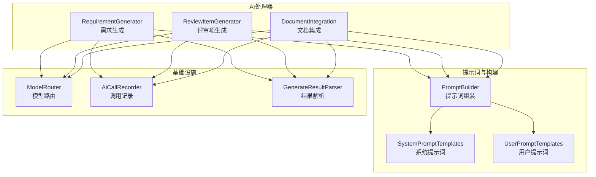
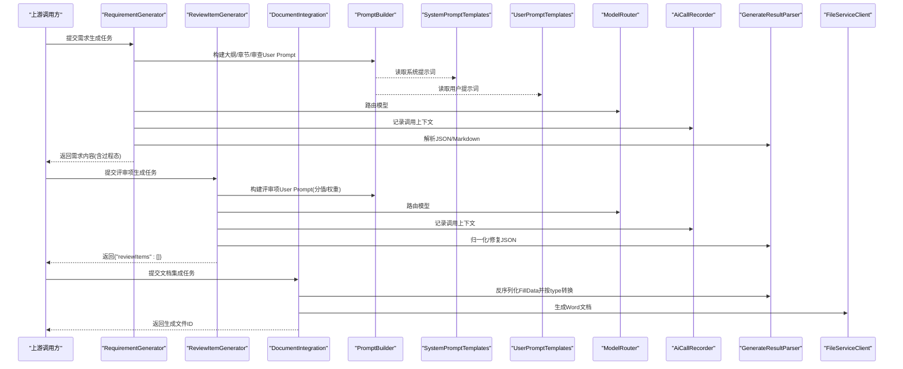
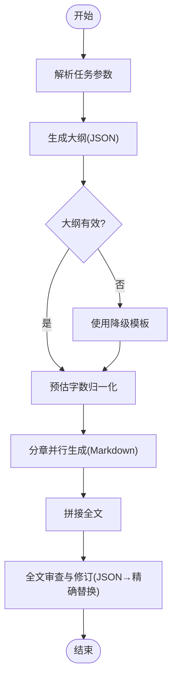
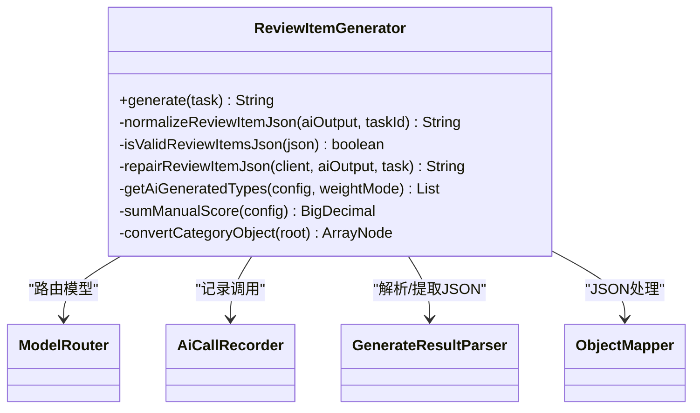
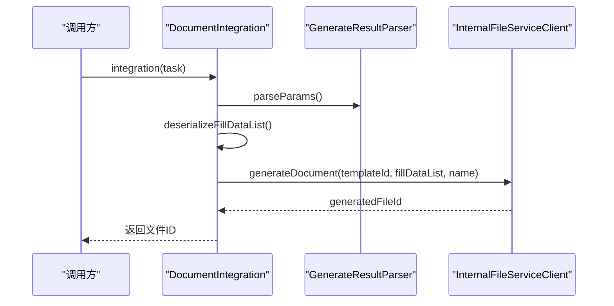
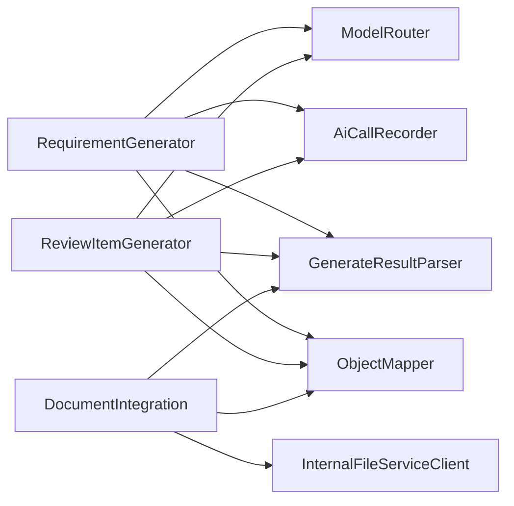

# 智能文档生成

<cite>
**本文引用的文件列表**
- [RequirementGenerator.java](file://ele-ai-tender-system/ele-ai-tender-ai/src/main/java/com/jy/eleaitender/ai/processor/generator/RequirementGenerator.java)
- [ReviewItemGenerator.java](file://ele-ai-tender-system/ele-ai-tender-ai/src/main/java/com/jy/eleaitender/ai/processor/generator/ReviewItemGenerator.java)
- [DocumentIntegration.java](file://ele-ai-tender-system/ele-ai-tender-ai/src/main/java/com/jy/eleaitender/ai/processor/generator/DocumentIntegration.java)
- [SystemPromptTemplates.java](file://ele-ai-tender-system/ele-ai-tender-ai/src/main/java/com/jy/eleaitender/ai/processor/prompt/SystemPromptTemplates.java)
- [UserPromptTemplates.java](file://ele-ai-tender-system/ele-ai-tender-ai/src/main/java/com/jy/eleaitender/ai/processor/prompt/UserPromptTemplates.java)
- [PromptBuilder.java](file://ele-ai-tender-system/ele-ai-tender-ai/src/main/java/com/jy/eleaitender/ai/processor/prompt/PromptBuilder.java)
</cite>

## 目录
1. [引言](#引言)
2. [项目结构](#项目结构)
3. [核心组件](#核心组件)
4. [架构总览](#架构总览)
5. [详细组件分析](#详细组件分析)
6. [依赖关系分析](#依赖关系分析)
7. [性能与可扩展性](#性能与可扩展性)
8. [质量控制、格式校验与一致性保证](#质量控制格式校验与一致性保证)
9. [故障排查指南](#故障排查指南)
10. [结论](#结论)

## 引言
本文件围绕“智能文档生成”能力，系统性梳理并解读基于提示词工程的文档自动生成实现。重点覆盖：
- 需求分析：从项目信息到结构化大纲与分章内容生成的三步式Agent编排
- 审查项生成：评审标准匹配与评分计算逻辑（含权重模式与分值模式）
- 文档集成：多源数据融合与模板填充机制（占位符语义匹配与类型转换）
- 提示词设计：SystemPromptTemplates与UserPromptTemplates的设计模式与优化策略
- 质量保障：质量控制、格式校验与内容一致性方法

## 项目结构
智能文档生成功能位于AI模块的处理器层，采用“生成器+提示词模板+结果解析+调用记录”的分层组织方式：
- 生成器：负责业务编排与流程控制
- 提示词模板：系统级与用户级提示词集中管理
- 结果解析：统一抽取JSON/Markdown等结构化输出
- 调用记录：统一封装模型调用、日志与上下文注入

图表来源
- [RequirementGenerator.java:124-195](file://ele-ai-tender-system/ele-ai-tender-ai/src/main/java/com/jy/eleaitender/ai/processor/generator/RequirementGenerator.java#L124-L195)
- [ReviewItemGenerator.java:74-154](file://ele-ai-tender-system/ele-ai-tender-ai/src/main/java/com/jy/eleaitender/ai/processor/generator/ReviewItemGenerator.java#L74-L154)
- [DocumentIntegration.java:55-75](file://ele-ai-tender-system/ele-ai-tender-ai/src/main/java/com/jy/eleaitender/ai/processor/generator/DocumentIntegration.java#L55-L75)
- [SystemPromptTemplates.java:69-188](file://ele-ai-tender-system/ele-ai-tender-ai/src/main/java/com/jy/eleaitender/ai/processor/prompt/SystemPromptTemplates.java#L69-L188)
- [UserPromptTemplates.java:43-82](file://ele-ai-tender-system/ele-ai-tender-ai/src/main/java/com/jy/eleaitender/ai/processor/prompt/UserPromptTemplates.java#L43-L82)
- [PromptBuilder.java:65-88](file://ele-ai-tender-system/ele-ai-tender-ai/src/main/java/com/jy/eleaitender/ai/processor/prompt/PromptBuilder.java#L65-L88)

章节来源
- [RequirementGenerator.java:124-195](file://ele-ai-tender-system/ele-ai-tender-ai/src/main/java/com/jy/eleaitender/ai/processor/generator/RequirementGenerator.java#L124-L195)
- [ReviewItemGenerator.java:74-154](file://ele-ai-tender-system/ele-ai-tender-ai/src/main/java/com/jy/eleaitender/ai/processor/generator/ReviewItemGenerator.java#L74-L154)
- [DocumentIntegration.java:55-75](file://ele-ai-tender-system/ele-ai-tender-ai/src/main/java/com/jy/eleaitender/ai/processor/generator/DocumentIntegration.java#L55-L75)
- [SystemPromptTemplates.java:69-188](file://ele-ai-tender-system/ele-ai-tender-ai/src/main/java/com/jy/eleaitender/ai/processor/prompt/SystemPromptTemplates.java#L69-L188)
- [UserPromptTemplates.java:43-82](file://ele-ai-tender-system/ele-ai-tender-ai/src/main/java/com/jy/eleaitender/ai/processor/prompt/UserPromptTemplates.java#L43-L82)
- [PromptBuilder.java:65-88](file://ele-ai-tender-system/ele-ai-tender-ai/src/main/java/com/jy/eleaitender/ai/processor/prompt/PromptBuilder.java#L65-L88)

## 核心组件
- RequirementGenerator：实现“大纲生成→分章并行生成→全文拼接→审查修订”的三步式Agent编排，支持降级模板与字数归一化、并发限流与进度上报。
- ReviewItemGenerator：根据项目信息与需求内容生成评审标准体系，支持分值模式与权重模式，内置JSON归一化与AI修复。
- DocumentIntegration：将多源数据按FillData类型转换为表格/图片/文本，并通过File服务生成Word；提供占位符语义匹配能力（可选）。
- SystemPromptTemplates / UserPromptTemplates：集中定义系统级与用户级提示词，约束输出格式、计分规则与合规要求。
- PromptBuilder：将业务参数拼装为最终User Prompt，屏蔽模板细节，提升可维护性。

章节来源
- [RequirementGenerator.java:124-195](file://ele-ai-tender-system/ele-ai-tender-ai/src/main/java/com/jy/eleaitender/ai/processor/generator/RequirementGenerator.java#L124-L195)
- [ReviewItemGenerator.java:74-154](file://ele-ai-tender-system/ele-ai-tender-ai/src/main/java/com/jy/eleaitender/ai/processor/generator/ReviewItemGenerator.java#L74-L154)
- [DocumentIntegration.java:55-75](file://ele-ai-tender-system/ele-ai-tender-ai/src/main/java/com/jy/eleaitender/ai/processor/generator/DocumentIntegration.java#L55-L75)
- [SystemPromptTemplates.java:69-188](file://ele-ai-tender-system/ele-ai-tender-ai/src/main/java/com/jy/eleaitender/ai/processor/prompt/SystemPromptTemplates.java#L69-L188)
- [UserPromptTemplates.java:43-82](file://ele-ai-tender-system/ele-ai-tender-ai/src/main/java/com/jy/eleaitender/ai/processor/prompt/UserPromptTemplates.java#L43-L82)
- [PromptBuilder.java:65-88](file://ele-ai-tender-system/ele-ai-tender-ai/src/main/java/com/jy/eleaitender/ai/processor/prompt/PromptBuilder.java#L65-L88)

## 架构总览
下图展示智能文档生成的端到端流程：从任务输入、提示词构建、模型路由、结果解析到文档落盘。

图表来源
- [RequirementGenerator.java:124-195](file://ele-ai-tender-system/ele-ai-tender-ai/src/main/java/com/jy/eleaitender/ai/processor/generator/RequirementGenerator.java#L124-L195)
- [ReviewItemGenerator.java:74-154](file://ele-ai-tender-system/ele-ai-tender-ai/src/main/java/com/jy/eleaitender/ai/processor/generator/ReviewItemGenerator.java#L74-L154)
- [DocumentIntegration.java:55-75](file://ele-ai-tender-system/ele-ai-tender-ai/src/main/java/com/jy/eleaitender/ai/processor/generator/DocumentIntegration.java#L55-L75)
- [PromptBuilder.java:65-88](file://ele-ai-tender-system/ele-ai-tender-ai/src/main/java/com/jy/eleaitender/ai/processor/prompt/PromptBuilder.java#L65-L88)
- [SystemPromptTemplates.java:69-188](file://ele-ai-tender-system/ele-ai-tender-ai/src/main/java/com/jy/eleaitender/ai/processor/prompt/SystemPromptTemplates.java#L69-L188)
- [UserPromptTemplates.java:43-82](file://ele-ai-tender-system/ele-ai-tender-ai/src/main/java/com/jy/eleaitender/ai/processor/prompt/UserPromptTemplates.java#L43-L82)

## 详细组件分析

### RequirementGenerator（需求生成）
- 目标：基于项目信息生成结构化招标需求文档，包含大纲、分章正文、全文拼接与审查修订。
- 关键流程：
  - Step1 大纲生成：构造User Prompt，调用模型，解析JSON大纲；若失败则使用降级模板；对estimatedWords进行总量归一化，确保不超过上限。
  - Step2 分章并行生成：以固定并发度发起章节生成请求，实时上报每章完成状态与可用内容片段；超时取消未完成任务。
  - Step3 全文拼接：按大纲顺序拼接各章Markdown内容。
  - Step4 审查修订：对全文进行一致性、合规性与量化性审查，输出修订列表后在代码层精确替换，避免误替换。
- 并发与限流：使用信号量限制并发数，虚拟线程执行器提升吞吐。
- 进度上报：通过持久化任务结果字段，前端可拉取大纲、章节状态与草稿内容。

图表来源
- [RequirementGenerator.java:124-195](file://ele-ai-tender-system/ele-ai-tender-ai/src/main/java/com/jy/eleaitender/ai/processor/generator/RequirementGenerator.java#L124-L195)
- [RequirementGenerator.java:199-238](file://ele-ai-tender-system/ele-ai-tender-ai/src/main/java/com/jy/eleaitender/ai/processor/generator/RequirementGenerator.java#L199-L238)
- [RequirementGenerator.java:240-279](file://ele-ai-tender-system/ele-ai-tender-ai/src/main/java/com/jy/eleaitender/ai/processor/generator/RequirementGenerator.java#L240-L279)
- [RequirementGenerator.java:347-428](file://ele-ai-tender-system/ele-ai-tender-ai/src/main/java/com/jy/eleaitender/ai/processor/generator/RequirementGenerator.java#L347-L428)
- [RequirementGenerator.java:494-507](file://ele-ai-tender-system/ele-ai-tender-ai/src/main/java/com/jy/eleaitender/ai/processor/generator/RequirementGenerator.java#L494-L507)
- [RequirementGenerator.java:646-692](file://ele-ai-tender-system/ele-ai-tender-ai/src/main/java/com/jy/eleaitender/ai/processor/generator/RequirementGenerator.java#L646-L692)

章节来源
- [RequirementGenerator.java:124-195](file://ele-ai-tender-system/ele-ai-tender-ai/src/main/java/com/jy/eleaitender/ai/processor/generator/RequirementGenerator.java#L124-L195)
- [RequirementGenerator.java:199-238](file://ele-ai-tender-system/ele-ai-tender-ai/src/main/java/com/jy/eleaitender/ai/processor/generator/RequirementGenerator.java#L199-L238)
- [RequirementGenerator.java:240-279](file://ele-ai-tender-system/ele-ai-tender-ai/src/main/java/com/jy/eleaitender/ai/processor/generator/RequirementGenerator.java#L240-L279)
- [RequirementGenerator.java:347-428](file://ele-ai-tender-system/ele-ai-tender-ai/src/main/java/com/jy/eleaitender/ai/processor/generator/RequirementGenerator.java#L347-L428)
- [RequirementGenerator.java:494-507](file://ele-ai-tender-system/ele-ai-tender-ai/src/main/java/com/jy/eleaitender/ai/processor/generator/RequirementGenerator.java#L494-L507)
- [RequirementGenerator.java:646-692](file://ele-ai-tender-system/ele-ai-tender-ai/src/main/java/com/jy/eleaitender/ai/processor/generator/RequirementGenerator.java#L646-L692)

### ReviewItemGenerator（评审项生成）
- 目标：依据项目信息与需求内容生成评审标准树形结构，支持分值模式与权重模式。
- 关键流程：
  - 解析配置：根据ReviewConfig决定启用类型与是否权重模式；分值模式下自动计算AI可分配总分。
  - 提示词选择：按模式选择对应System Prompt与User Prompt构建方法。
  - 模型调用与记录：路由模型并记录调用上下文。
  - JSON归一化：识别常见偏差结构，提取或转换出{"reviewItems": [...]}；必要时触发AI修复。
  - 校验与异常：若仍不合法，抛出明确错误以便重试。
- 评分规则：严格区分符合性审查不计分；叶子节点score合计必须等于目标值；权重模式下各类别weight合计=100%且类别内score合计=100。

图表来源
- [ReviewItemGenerator.java:74-154](file://ele-ai-tender-system/ele-ai-tender-ai/src/main/java/com/jy/eleaitender/ai/processor/generator/ReviewItemGenerator.java#L74-L154)
- [ReviewItemGenerator.java:222-302](file://ele-ai-tender-system/ele-ai-tender-ai/src/main/java/com/jy/eleaitender/ai/processor/generator/ReviewItemGenerator.java#L222-L302)

章节来源
- [ReviewItemGenerator.java:74-154](file://ele-ai-tender-system/ele-ai-tender-ai/src/main/java/com/jy/eleaitender/ai/processor/generator/ReviewItemGenerator.java#L74-L154)
- [ReviewItemGenerator.java:222-302](file://ele-ai-tender-system/ele-ai-tender-ai/src/main/java/com/jy/eleaitender/ai/processor/generator/ReviewItemGenerator.java#L222-L302)

### DocumentIntegration（文档集成）
- 目标：将多源数据融合至Word模板，生成最终文档。
- 关键流程：
  - 参数解析：从任务中解析模板ID、项目名称与FillData列表。
  - 类型转换：将FillData.value按type转为TableData/ImageData/String，确保模板引擎正确渲染。
  - 文档生成：调用File服务接口生成Word并返回文件ID。
  - 占位符匹配（可选）：通过AI进行占位符与数据字段的语义映射，解决中英文命名不一致问题。
- 容错：类型转换异常时跳过该项并记录警告，不影响整体生成。

图表来源
- [DocumentIntegration.java:55-75](file://ele-ai-tender-system/ele-ai-tender-ai/src/main/java/com/jy/eleaitender/ai/processor/generator/DocumentIntegration.java#L55-L75)
- [DocumentIntegration.java:81-100](file://ele-ai-tender-system/ele-ai-tender-ai/src/main/java/com/jy/eleaitender/ai/processor/generator/DocumentIntegration.java#L81-L100)

章节来源
- [DocumentIntegration.java:55-75](file://ele-ai-tender-system/ele-ai-tender-ai/src/main/java/com/jy/eleaitender/ai/processor/generator/DocumentIntegration.java#L55-L75)
- [DocumentIntegration.java:81-100](file://ele-ai-tender-system/ele-ai-tender-ai/src/main/java/com/jy/eleaitender/ai/processor/generator/DocumentIntegration.java#L81-L100)

### 提示词工程与设计模式
- SystemPromptTemplates：定义角色、原则、输出格式与硬性规则（如评分口径、合规要求、禁止行为），确保模型输出稳定可控。
- UserPromptTemplates：承载具体业务参数与上下文，强调约束条件（如字数上限、必填字段、禁用包装字段）。
- PromptBuilder：将业务对象与枚举标签安全地拼入模板，屏蔽格式化细节，便于测试与扩展。
- 优化策略：
  - 分层提示词：系统提示词定调，用户提示词聚焦实例数据
  - 强约束输出：明确要求根节点字段、禁止多余文字与包装字段
  - 自检规则：在提示词中嵌入“输出前逐项累加自检”，降低二次修复概率
  - 降级与修复：当解析失败时，优先本地归一化，再尝试AI修复

章节来源
- [SystemPromptTemplates.java:69-188](file://ele-ai-tender-system/ele-ai-tender-ai/src/main/java/com/jy/eleaitender/ai/processor/prompt/SystemPromptTemplates.java#L69-L188)
- [SystemPromptTemplates.java:195-340](file://ele-ai-tender-system/ele-ai-tender-ai/src/main/java/com/jy/eleaitender/ai/processor/prompt/SystemPromptTemplates.java#L195-L340)
- [UserPromptTemplates.java:43-82](file://ele-ai-tender-system/ele-ai-tender-ai/src/main/java/com/jy/eleaitender/ai/processor/prompt/UserPromptTemplates.java#L43-L82)
- [UserPromptTemplates.java:90-157](file://ele-ai-tender-system/ele-ai-tender-ai/src/main/java/com/jy/eleaitender/ai/processor/prompt/UserPromptTemplates.java#L90-L157)
- [PromptBuilder.java:65-88](file://ele-ai-tender-system/ele-ai-tender-ai/src/main/java/com/jy/eleaitender/ai/processor/prompt/PromptBuilder.java#L65-L88)
- [PromptBuilder.java:112-133](file://ele-ai-tender-system/ele-ai-tender-ai/src/main/java/com/jy/eleaitender/ai/processor/prompt/PromptBuilder.java#L112-L133)

## 依赖关系分析
- RequirementGenerator依赖：
  - ModelRouter：按任务类型路由到合适模型
  - AiCallRecorder：统一记录调用上下文、耗时与结果
  - GenerateResultParser：抽取JSON/Markdown并反序列化为领域对象
  - ObjectMapper：序列化/反序列化过程态与结果
- ReviewItemGenerator依赖：
  - 同上，并额外使用Jackson JsonNode进行复杂结构归一化
- DocumentIntegration依赖：
  - InternalFileServiceClient：调用File服务生成Word
  - GenerateResultParser：解析任务参数
  - ObjectMapper：FillData类型转换

图表来源
- [RequirementGenerator.java:98-116](file://ele-ai-tender-system/ele-ai-tender-ai/src/main/java/com/jy/eleaitender/ai/processor/generator/RequirementGenerator.java#L98-L116)
- [ReviewItemGenerator.java:41-51](file://ele-ai-tender-system/ele-ai-tender-ai/src/main/java/com/jy/eleaitender/ai/processor/generator/ReviewItemGenerator.java#L41-L51)
- [DocumentIntegration.java:34-47](file://ele-ai-tender-system/ele-ai-tender-ai/src/main/java/com/jy/eleaitender/ai/processor/generator/DocumentIntegration.java#L34-L47)

章节来源
- [RequirementGenerator.java:98-116](file://ele-ai-tender-system/ele-ai-tender-ai/src/main/java/com/jy/eleaitender/ai/processor/generator/RequirementGenerator.java#L98-L116)
- [ReviewItemGenerator.java:41-51](file://ele-ai-tender-system/ele-ai-tender-ai/src/main/java/com/jy/eleaitender/ai/processor/generator/ReviewItemGenerator.java#L41-L51)
- [DocumentIntegration.java:34-47](file://ele-ai-tender-system/ele-ai-tender-ai/src/main/java/com/jy/eleaitender/ai/processor/generator/DocumentIntegration.java#L34-L47)

## 性能与可扩展性
- 并发与限流：
  - 分章生成使用信号量限制并发，避免触发API速率限制
  - 使用虚拟线程执行器提升I/O密集型任务吞吐
- 超时与取消：
  - 分章生成设置总体等待超时，超时后取消未完成任务，防止资源泄漏
- 降级与回退：
  - 大纲生成失败时使用预设模板，保障可用性
  - FillData类型转换失败时跳过并记录警告，不影响整体生成
- 可扩展点：
  - 新增评审类型或评分模式仅需扩展提示词与归一化逻辑
  - 新增模板字段可通过占位符匹配增强适配性

[本节为通用指导，无需特定文件引用]

## 质量控制、格式校验与一致性保证
- 大纲与字数控制：
  - 对estimatedWords进行总量归一化，确保不超过全局上限
  - 章节生成强制字数上限，超出视为无效输出
- 审查与修订：
  - 全文审查输出修订列表，代码层进行精确替换
  - 防护策略：原文过短跳过、多处匹配跳过、从后向前替换避免偏移漂移
- 评审项JSON健壮性：
  - 先尝试本地归一化（识别数组/包装字段/分类对象）
  - 失败时触发AI修复，仅修正格式不改变实质内容
  - 最终校验根节点reviewItems存在且为数组
- 模板填充一致性：
  - FillData按type强转，避免模板渲染异常
  - 可选AI占位符匹配，解决中英文命名不一致导致的填充失败

章节来源
- [RequirementGenerator.java:240-279](file://ele-ai-tender-system/ele-ai-tender-ai/src/main/java/com/jy/eleaitender/ai/processor/generator/RequirementGenerator.java#L240-L279)
- [RequirementGenerator.java:702-764](file://ele-ai-tender-system/ele-ai-tender-ai/src/main/java/com/jy/eleaitender/ai/processor/generator/RequirementGenerator.java#L702-L764)
- [ReviewItemGenerator.java:222-302](file://ele-ai-tender-system/ele-ai-tender-ai/src/main/java/com/jy/eleaitender/ai/processor/generator/ReviewItemGenerator.java#L222-L302)
- [DocumentIntegration.java:81-100](file://ele-ai-tender-system/ele-ai-tender-ai/src/main/java/com/jy/eleaitender/ai/processor/generator/DocumentIntegration.java#L81-L100)

## 故障排查指南
- 需求生成阶段
  - 大纲为空：检查系统提示词与用户提示词参数完整性；确认降级模板分支是否命中
  - 章节生成失败：查看并发许可获取与超时日志；关注单章异常堆栈
  - 审查修订未生效：核对修订项original是否唯一匹配且长度满足最小阈值
- 评审项生成阶段
  - JSON解析失败：观察归一化路径是否命中；必要时触发AI修复
  - 分数合计不为目标值：检查分值模式下的手动分数求和与AI可分配总分计算
- 文档集成阶段
  - 模板渲染异常：检查FillData.type与value类型是否一致；关注转换异常日志
  - 占位符未填充：启用AI占位符匹配并核对映射结果

章节来源
- [RequirementGenerator.java:199-238](file://ele-ai-tender-system/ele-ai-tender-ai/src/main/java/com/jy/eleaitender/ai/processor/generator/RequirementGenerator.java#L199-L238)
- [RequirementGenerator.java:347-428](file://ele-ai-tender-system/ele-ai-tender-ai/src/main/java/com/jy/eleaitender/ai/processor/generator/RequirementGenerator.java#L347-L428)
- [RequirementGenerator.java:702-764](file://ele-ai-tender-system/ele-ai-tender-ai/src/main/java/com/jy/eleaitender/ai/processor/generator/RequirementGenerator.java#L702-L764)
- [ReviewItemGenerator.java:222-302](file://ele-ai-tender-system/ele-ai-tender-ai/src/main/java/com/jy/eleaitender/ai/processor/generator/ReviewItemGenerator.java#L222-L302)
- [DocumentIntegration.java:81-100](file://ele-ai-tender-system/ele-ai-tender-ai/src/main/java/com/jy/eleaitender/ai/processor/generator/DocumentIntegration.java#L81-L100)

## 结论
本方案通过“提示词工程+结构化解析+稳健编排”的方式，实现了高质量、可追溯的智能文档生成。其核心优势在于：
- 明确的系统/用户提示词分层与强约束输出规范
- 面向业务的评分规则与权重模式，兼顾灵活性与合规性
- 完善的容错与降级机制，保障生产稳定性
- 细粒度的质量控制与一致性校验，减少人工复核成本

[本节为总结性内容，无需特定文件引用]