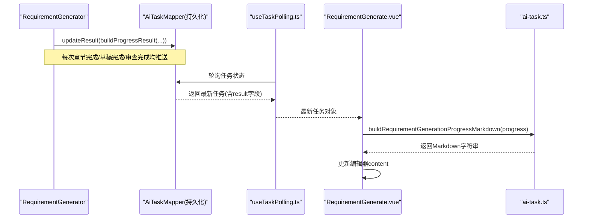
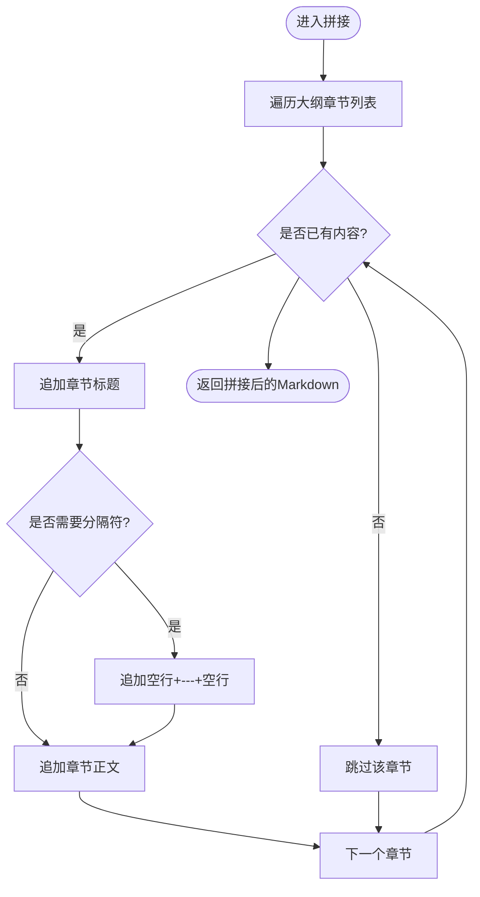
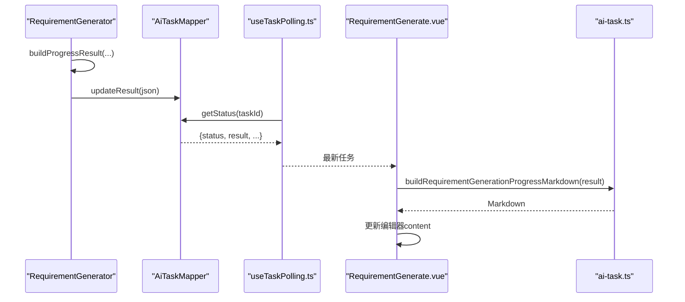
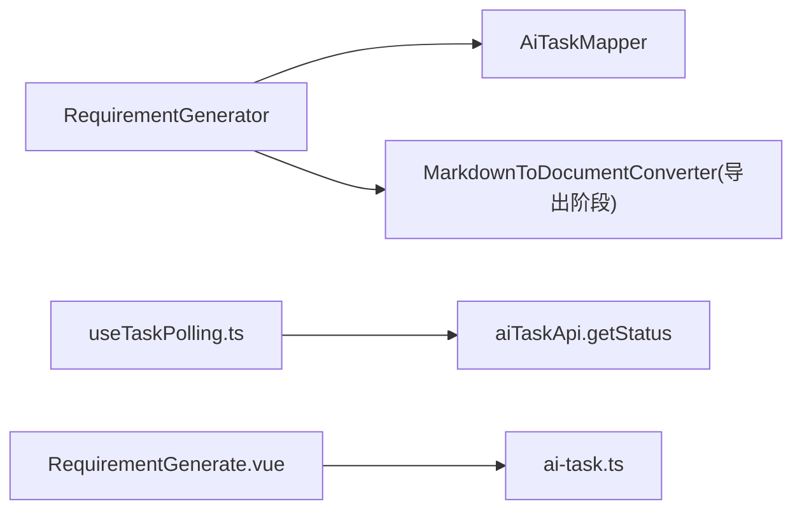

# 内容拼接阶段

<cite>
**本文引用的文件**   
- [RequirementGenerator.java](file://ele-ai-tender-system/ele-ai-tender-ai/src/main/java/com/jy/eleaitender/ai/processor/generator/RequirementGenerator.java)
- [ai-task.ts](file://ele-ai-tender-frontend/src/types/ai-task.ts)
- [RequirementGenerate.vue](file://ele-ai-tender-frontend/src/views/requirement/RequirementGenerate.vue)
- [useTaskPolling.ts](file://ele-ai-tender-frontend/src/composables/useTaskPolling.ts)
- [MarkdownToDocumentConverter.java](file://ele-ai-tender-system/ele-ai-tender-file/src/main/java/com/jy/eleaitender/file/engine/MarkdownToDocumentConverter.java)
</cite>

## 目录
1. [简介](#简介)
2. [项目结构](#项目结构)
3. [核心组件](#核心组件)
4. [架构总览](#架构总览)
5. [详细组件分析](#详细组件分析)
6. [依赖关系分析](#依赖关系分析)
7. [性能考量](#性能考量)
8. [故障排查指南](#故障排查指南)
9. [结论](#结论)
10. [附录](#附录)

## 简介
本章节聚焦“内容拼接阶段”的实现与前后端协作机制，围绕以下目标展开：
- 深入解析 assembleFullContent 与 assembleAvailableContent 的拼接逻辑、Markdown 标准化与章节分隔符处理。
- 说明进度推送机制 publishProgress 如何实时更新任务状态并驱动前端展示。
- 解释容错策略：缺失章节内容的降级显示与占位符插入。
- 阐述 JSON 结果构建 buildProgressResult 的数据结构与序列化过程。
- 提供输出格式示例与前端集成指南，帮助快速对接实时进度与增量预览。

## 项目结构
内容拼接阶段涉及后端生成器与前端渲染两大模块：
- 后端：需求生成器负责大纲生成、分章并行生成、全文拼接、审查修订与进度推送。
- 前端：类型定义与视图组件负责解析后端推送的进度 JSON，并在编辑器中增量渲染 Markdown。

```mermaid
graph TB
subgraph "后端"
RG["RequirementGenerator<br/>内容拼接与进度推送"]
MDC["MarkdownToDocumentConverter<br/>Markdown转文档后续导出"]
end
subgraph "前端"
AT["ai-task.ts<br/>进度JSON解析与Markdown拼装"]
RGV["RequirementGenerate.vue<br/>进度定时器与内容更新"]
UTP["useTaskPolling.ts<br/>轮询任务状态"]
end
RG --> |写入任务结果(JSON)| UTP
UTP --> |返回最新任务| RGV
RGV --> |调用| AT
AT --> |渲染| RGV
RG --> |Markdown文本| MDC
```

图表来源
- [RequirementGenerator.java:494-530](file://ele-ai-tender-system/ele-ai-tender-ai/src/main/java/com/jy/eleaitender/ai/processor/generator/RequirementGenerator.java#L494-L530)
- [ai-task.ts:99-132](file://ele-ai-tender-frontend/src/types/ai-task.ts#L99-L132)
- [RequirementGenerate.vue:434-472](file://ele-ai-tender-frontend/src/views/requirement/RequirementGenerate.vue#L434-L472)
- [useTaskPolling.ts:1-48](file://ele-ai-tender-frontend/src/composables/useTaskPolling.ts#L1-L48)
- [MarkdownToDocumentConverter.java:209-235](file://ele-ai-tender-system/ele-ai-tender-file/src/main/java/com/jy/eleaitender/file/engine/MarkdownToDocumentConverter.java#L209-L235)

章节来源
- [RequirementGenerator.java:494-530](file://ele-ai-tender-system/ele-ai-tender-ai/src/main/java/com/jy/eleaitender/ai/processor/generator/RequirementGenerator.java#L494-L530)
- [ai-task.ts:99-132](file://ele-ai-tender-frontend/src/types/ai-task.ts#L99-L132)
- [RequirementGenerate.vue:434-472](file://ele-ai-tender-frontend/src/views/requirement/RequirementGenerate.vue#L434-L472)
- [useTaskPolling.ts:1-48](file://ele-ai-tender-frontend/src/composables/useTaskPolling.ts#L1-L48)
- [MarkdownToDocumentConverter.java:209-235](file://ele-ai-tender-system/ele-ai-tender-file/src/main/java/com/jy/eleaitender/file/engine/MarkdownToDocumentConverter.java#L209-L235)

## 核心组件
- RequirementGenerator：实现内容拼接、进度推送与最终结果构建。
- ai-task.ts：定义进度结果类型与前端 Markdown 拼装函数。
- RequirementGenerate.vue：维护进度定时器，将后端推送的进度内容同步到编辑器。
- useTaskPolling.ts：定时轮询任务状态，保证 COMPLETED+resultSynced=0/3 时继续等待结果同步。
- MarkdownToDocumentConverter：在后续导出阶段对 Markdown 进行规范化转换（软换行处理等）。

章节来源
- [RequirementGenerator.java:494-530](file://ele-ai-tender-system/ele-ai-tender-ai/src/main/java/com/jy/eleaitender/ai/processor/generator/RequirementGenerator.java#L494-L530)
- [ai-task.ts:99-132](file://ele-ai-tender-frontend/src/types/ai-task.ts#L99-L132)
- [RequirementGenerate.vue:434-472](file://ele-ai-tender-frontend/src/views/requirement/RequirementGenerate.vue#L434-L472)
- [useTaskPolling.ts:1-48](file://ele-ai-tender-frontend/src/composables/useTaskPolling.ts#L1-L48)
- [MarkdownToDocumentConverter.java:209-235](file://ele-ai-tender-system/ele-ai-tender-file/src/main/java/com/jy/eleaitender/file/engine/MarkdownToDocumentConverter.java#L209-L235)

## 架构总览
内容拼接阶段的端到端流程如下：
- 后端在分章生成过程中，每完成一个章节即调用 publishProgress 写入任务结果，包含当前可用内容片段。
- 前端通过轮询获取任务状态，若存在进度 JSON，则使用 buildRequirementGenerationProgressMarkdown 拼装为 Markdown 并更新编辑器。
- 当草稿完成或审查完成后，后端推送完整 content；前端直接使用该 content 覆盖编辑器内容。
- 后续导出阶段，Markdown 由转换器进行规范化处理，确保软换行与段落结构符合预期。



图表来源
- [RequirementGenerator.java:532-580](file://ele-ai-tender-system/ele-ai-tender-ai/src/main/java/com/jy/eleaitender/ai/processor/generator/RequirementGenerator.java#L532-L580)
- [useTaskPolling.ts:1-48](file://ele-ai-tender-frontend/src/composables/useTaskPolling.ts#L1-L48)
- [RequirementGenerate.vue:434-472](file://ele-ai-tender-frontend/src/views/requirement/RequirementGenerate.vue#L434-L472)
- [ai-task.ts:99-132](file://ele-ai-tender-frontend/src/types/ai-task.ts#L99-L132)

## 详细组件分析

### 内容拼接方法：assembleFullContent 与 assembleAvailableContent
- assembleFullContent：按大纲顺序遍历章节，逐章追加标题与正文，章节之间以“空行 + 水平分割线 + 空行”作为分隔符，形成完整的 Markdown 全文。
- assembleAvailableContent：仅拼接有实际文本的章节，跳过空内容或缺失章节，同样以相同分隔符连接，用于分章生成过程中的增量预览。



图表来源
- [RequirementGenerator.java:494-530](file://ele-ai-tender-system/ele-ai-tender-ai/src/main/java/com/jy/eleaitender/ai/processor/generator/RequirementGenerator.java#L494-L530)

章节来源
- [RequirementGenerator.java:494-530](file://ele-ai-tender-system/ele-ai-tender-ai/src/main/java/com/jy/eleaitender/ai/processor/generator/RequirementGenerator.java#L494-L530)

### Markdown 标准化与章节分隔符
- 章节分隔符：统一采用“\n\n---\n\n”，既清晰区分章节，又兼容常见 Markdown 渲染器。
- 标题层级：每个章节以二级标题“## 章节名”开头，便于前端与导出工具识别章节边界。
- 软换行处理：在后续导出阶段，Markdown 转换器会将软换行转换为段落内换行，避免编号条款挤在同一行。

章节来源
- [RequirementGenerator.java:494-530](file://ele-ai-tender-system/ele-ai-tender-ai/src/main/java/com/jy/eleaitender/ai/processor/generator/RequirementGenerator.java#L494-L530)
- [MarkdownToDocumentConverter.java:209-235](file://ele-ai-tender-system/ele-ai-tender-file/src/main/java/com/jy/eleaitender/file/engine/MarkdownToDocumentConverter.java#L209-L235)

### 进度推送机制：publishProgress
- 触发时机：
  - 大纲生成完成：推送 OUTLINE_GENERATED，包含 outline 与空 chapters。
  - 分章生成进行中：每完成一个章节，推送 CHAPTER_GENERATING，包含已完成的章节内容与状态。
  - 草稿完成：推送 DRAFT_COMPLETED，包含完整 content。
  - 审查进行中：推送 REVIEWING，标记 reviewStatus 为 PROCESSING。
  - 审查完成：推送 COMPLETED，包含最终 refined content 与 reviewStatus 为 COMPLETED。
- 数据写入：通过 updateTaskResult 调用 AiTaskMapper.updateResult 持久化 JSON 结果。
- 前端消费：轮询任务状态后，解析 result 字段，使用 buildRequirementGenerationProgressMarkdown 拼装为 Markdown 并更新编辑器。



图表来源
- [RequirementGenerator.java:532-580](file://ele-ai-tender-system/ele-ai-tender-ai/src/main/java/com/jy/eleaitender/ai/processor/generator/RequirementGenerator.java#L532-L580)
- [useTaskPolling.ts:1-48](file://ele-ai-tender-frontend/src/composables/useTaskPolling.ts#L1-L48)
- [RequirementGenerate.vue:434-472](file://ele-ai-tender-frontend/src/views/requirement/RequirementGenerate.vue#L434-L472)
- [ai-task.ts:99-132](file://ele-ai-tender-frontend/src/types/ai-task.ts#L99-L132)

章节来源
- [RequirementGenerator.java:532-580](file://ele-ai-tender-system/ele-ai-tender-ai/src/main/java/com/jy/eleaitender/ai/processor/generator/RequirementGenerator.java#L532-L580)
- [useTaskPolling.ts:1-48](file://ele-ai-tender-frontend/src/composables/useTaskPolling.ts#L1-L48)
- [RequirementGenerate.vue:434-472](file://ele-ai-tender-frontend/src/views/requirement/RequirementGenerate.vue#L434-L472)
- [ai-task.ts:99-132](file://ele-ai-tender-frontend/src/types/ai-task.ts#L99-L132)

### 容错处理：缺失章节与占位符
- 分章生成失败或中断：章节内容回退为提示性占位符，引导用户手动补充。
- 收集结果时异常：读取章节结果失败也会插入占位符，确保整体流程不中断。
- 可用性过滤：assembleAvailableContent 会跳过空内容或缺失章节，避免在增量预览中出现空白章节。

章节来源
- [RequirementGenerator.java:380-428](file://ele-ai-tender-system/ele-ai-tender-ai/src/main/java/com/jy/eleaitender/ai/processor/generator/RequirementGenerator.java#L380-L428)
- [RequirementGenerator.java:494-530](file://ele-ai-tender-system/ele-ai-tender-ai/src/main/java/com/jy/eleaitender/ai/processor/generator/RequirementGenerator.java#L494-L530)

### JSON 结果构建：buildProgressResult
- 数据结构设计：
  - contentStage：当前内容阶段（OUTLINE_GENERATED / CHAPTER_GENERATING / DRAFT_COMPLETED / REVIEWING / COMPLETED）。
  - outline：大纲信息，包含 projectOverview 与 chapters 列表（每章含 chapterNo、chapterKey、chapterTitle、corePoints、estimatedWords）。
  - chapters：章节进度列表，除大纲字段外，还包含 status 与可选 content。
  - completedChapterCount / totalChapterCount：已完成章节数与总章节数。
  - reviewStatus：审查状态（NOT_STARTED / PROCESSING / COMPLETED）。
  - content：可选的完整 Markdown 内容（仅在草稿完成、审查中或完成后出现）。
- 序列化与兜底：
  - 优先使用 ObjectMapper 序列化为 JSON 字符串。
  - 若序列化失败，回退为仅包含 content 的最小 JSON 结构，确保前端可解析。

```mermaid
classDiagram
class ProgressResult {
+string contentStage
+Outline outline
+ChapterProgress[] chapters
+int completedChapterCount
+int totalChapterCount
+string reviewStatus
+string content
}
class Outline {
+string projectOverview
+ChapterInfo[] chapters
}
class ChapterInfo {
+int chapterNo
+string chapterKey
+string chapterTitle
+string corePoints
+int estimatedWords
}
class ChapterProgress {
+int chapterNo
+string chapterKey
+string chapterTitle
+string corePoints
+int estimatedWords
+string status
+string content
}
ProgressResult --> Outline : "包含"
ProgressResult --> ChapterProgress[] : "包含"
Outline --> ChapterInfo[] : "包含"
```

图表来源
- [RequirementGenerator.java:554-644](file://ele-ai-tender-system/ele-ai-tender-ai/src/main/java/com/jy/eleaitender/ai/processor/generator/RequirementGenerator.java#L554-L644)

章节来源
- [RequirementGenerator.java:554-644](file://ele-ai-tender-system/ele-ai-tender-ai/src/main/java/com/jy/eleaitender/ai/processor/generator/RequirementGenerator.java#L554-L644)

### 前端集成指南
- 解析进度 JSON：
  - 使用 parseProgressResult 安全解析 result 字段，忽略非法 JSON。
  - 使用 buildRequirementGenerationProgressMarkdown 将进度对象转换为 Markdown 字符串。
- 更新编辑器内容：
  - 监听 generationProgress 变化，若存在有效 Markdown 且与当前 content 不同，则替换。
- 进度条计算：
  - 在 PROCESSING 或 SSE 生成期间，基于已运行时间计算指数曲线进度（上限 90%）。
  - 其他状态使用固定映射，并确保进度只增不减。
- 轮询策略：
  - 使用 useTaskPolling 自动轮询任务状态，终态停止；COMPLETED+resultSynced=0/3 仍需继续轮询等待结果同步。

章节来源
- [ai-task.ts:92-132](file://ele-ai-tender-frontend/src/types/ai-task.ts#L92-L132)
- [RequirementGenerate.vue:434-472](file://ele-ai-tender-frontend/src/views/requirement/RequirementGenerate.vue#L434-L472)
- [useTaskPolling.ts:1-48](file://ele-ai-tender-frontend/src/composables/useTaskPolling.ts#L1-L48)

## 依赖关系分析
- RequirementGenerator 依赖 AiTaskMapper 持久化进度 JSON。
- 前端 useTaskPolling 依赖 aiTaskApi.getStatus 获取任务状态。
- RequirementGenerate.vue 依赖 ai-task.ts 中的解析与 Markdown 拼装函数。
- 后续导出阶段依赖 MarkdownToDocumentConverter 进行 Markdown 规范化。



图表来源
- [RequirementGenerator.java:543-552](file://ele-ai-tender-system/ele-ai-tender-ai/src/main/java/com/jy/eleaitender/ai/processor/generator/RequirementGenerator.java#L543-L552)
- [useTaskPolling.ts:1-48](file://ele-ai-tender-frontend/src/composables/useTaskPolling.ts#L1-L48)
- [RequirementGenerate.vue:434-472](file://ele-ai-tender-frontend/src/views/requirement/RequirementGenerate.vue#L434-L472)
- [ai-task.ts:99-132](file://ele-ai-tender-frontend/src/types/ai-task.ts#L99-L132)
- [MarkdownToDocumentConverter.java:209-235](file://ele-ai-tender-system/ele-ai-tender-file/src/main/java/com/jy/eleaitender/file/engine/MarkdownToDocumentConverter.java#L209-L235)

章节来源
- [RequirementGenerator.java:543-552](file://ele-ai-tender-system/ele-ai-tender-ai/src/main/java/com/jy/eleaitender/ai/processor/generator/RequirementGenerator.java#L543-L552)
- [useTaskPolling.ts:1-48](file://ele-ai-tender-frontend/src/composables/useTaskPolling.ts#L1-L48)
- [RequirementGenerate.vue:434-472](file://ele-ai-tender-frontend/src/views/requirement/RequirementGenerate.vue#L434-L472)
- [ai-task.ts:99-132](file://ele-ai-tender-frontend/src/types/ai-task.ts#L99-L132)
- [MarkdownToDocumentConverter.java:209-235](file://ele-ai-tender-system/ele-ai-tender-file/src/main/java/com/jy/eleaitender/file/engine/MarkdownToDocumentConverter.java#L209-L235)

## 性能考量
- 分章并发控制：通过信号量限制最大并发章节数，避免触发 AI 服务速率限制。
- 超时保护：分章生成等待设置超时，取消未完成章节，防止长时间阻塞。
- 增量推送：每完成一个章节即推送进度，减少前端等待时间，提升用户体验。
- 序列化容错：JSON 序列化失败时回退最小结构，避免阻塞主流程。

章节来源
- [RequirementGenerator.java:360-428](file://ele-ai-tender-system/ele-ai-tender-ai/src/main/java/com/jy/eleaitender/ai/processor/generator/RequirementGenerator.java#L360-L428)
- [RequirementGenerator.java:554-580](file://ele-ai-tender-system/ele-ai-tender-ai/src/main/java/com/jy/eleaitender/ai/processor/generator/RequirementGenerator.java#L554-L580)

## 故障排查指南
- 进度未更新：
  - 检查 AiTaskMapper.updateResult 是否成功执行。
  - 确认前端轮询是否正常，是否存在网络错误或接口异常。
- 内容缺失：
  - 查看分章生成日志，确认章节是否生成失败或结果为空。
  - 检查 assembleAvailableContent 是否正确跳过空内容。
- JSON 解析失败：
  - 确认 result 字段是否为合法 JSON，必要时查看后端序列化日志。
  - 前端解析函数应具备容错能力，忽略非法 JSON 并降级处理。

章节来源
- [RequirementGenerator.java:543-552](file://ele-ai-tender-system/ele-ai-tender-ai/src/main/java/com/jy/eleaitender/ai/processor/generator/RequirementGenerator.java#L543-L552)
- [RequirementGenerator.java:554-580](file://ele-ai-tender-system/ele-ai-tender-ai/src/main/java/com/jy/eleaitender/ai/processor/generator/RequirementGenerator.java#L554-L580)
- [ai-task.ts:92-97](file://ele-ai-tender-frontend/src/types/ai-task.ts#L92-L97)

## 结论
内容拼接阶段通过清晰的章节分隔与 Markdown 标准化，结合实时的进度推送与前端增量渲染，实现了高效、健壮的用户体验。容错机制确保了在章节生成失败或 JSON 序列化异常时系统仍能稳定运行。后续导出阶段的 Markdown 规范化进一步保障了文档质量。

## 附录

### 输出格式示例（简化）
以下为进度 JSON 的结构示意（非真实值）：
- contentStage: "CHAPTER_GENERATING"
- outline:
  - projectOverview: "项目概述..."
  - chapters:
    - chapterNo: 1
      - chapterKey: "project_overview"
      - chapterTitle: "项目概况"
      - corePoints: "背景、范围、预算"
      - estimatedWords: 800
- chapters:
  - chapterNo: 1
    - status: "COMPLETED"
    - content: "## 项目概况\n\n正文内容..."
- completedChapterCount: 1
- totalChapterCount: 5
- reviewStatus: "NOT_STARTED"
- content: null（尚未完成草稿）

章节来源
- [RequirementGenerator.java:554-644](file://ele-ai-tender-system/ele-ai-tender-ai/src/main/java/com/jy/eleaitender/ai/processor/generator/RequirementGenerator.java#L554-L644)