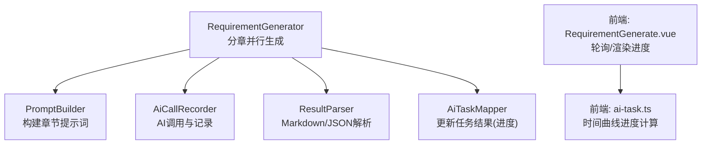
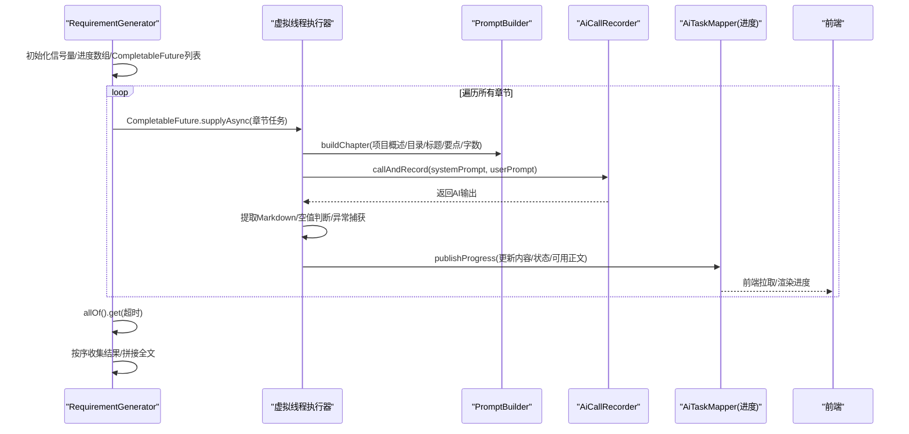
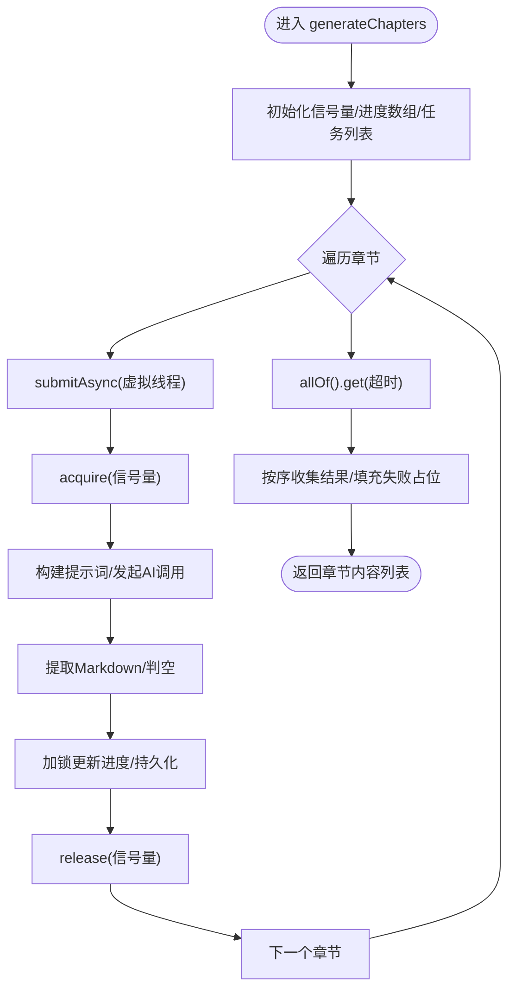
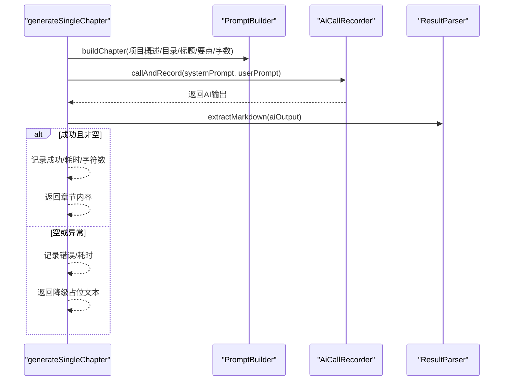
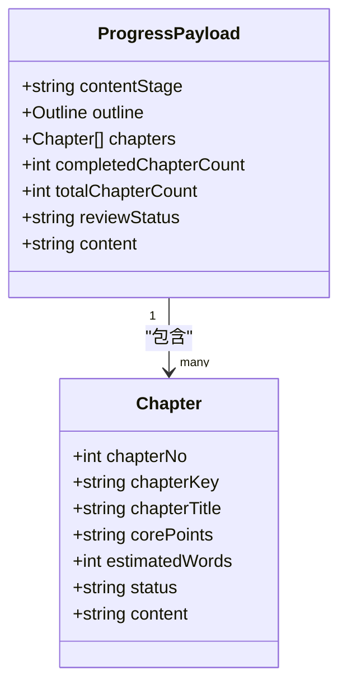
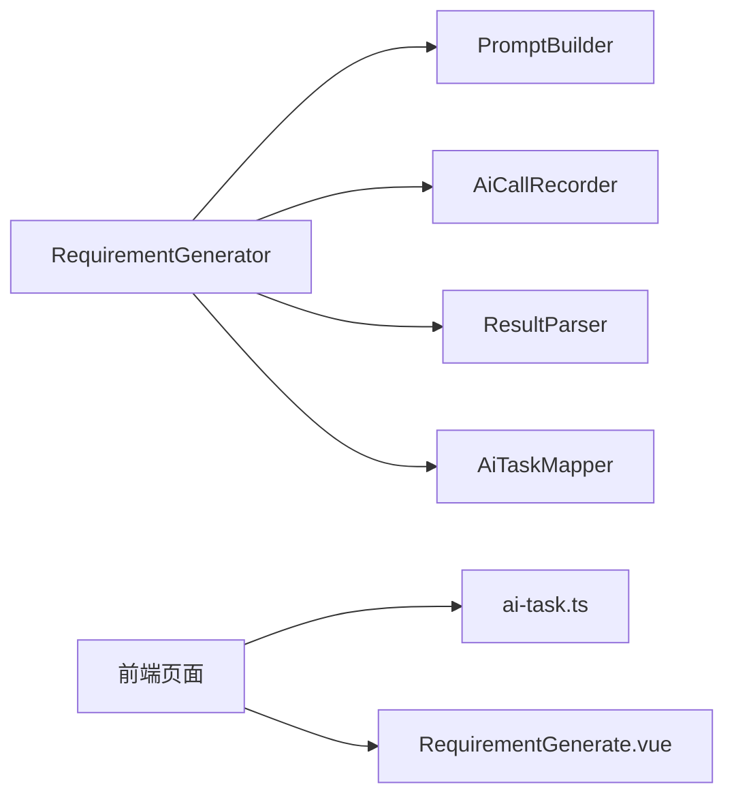

# 分章并行生成阶段

<cite>
**本文引用的文件**
- [RequirementGenerator.java](file://ele-ai-tender-system/ele-ai-tender-ai/src/main/java/com/jy/eleaitender/ai/processor/generator/RequirementGenerator.java)
- [PromptBuilder.java](file://ele-ai-tender-system/ele-ai-tender-ai/src/main/java/com/jy/eleaitender/ai/processor/prompt/PromptBuilder.java)
- [AiCallRecorder.java](file://ele-ai-tender-system/ele-ai-tender-ai/src/main/java/com/jy/eleaitender/ai/processor/recorder/AiCallRecorder.java)
- [UserConcurrencyManager.java](file://ele-ai-tender-system/ele-ai-tender-ai/src/main/java/com/jy/eleaitender/ai/threadpool/UserConcurrencyManager.java)
- [DynamicThreadPoolManager.java](file://ele-ai-tender-system/ele-ai-tender-ai/src/main/java/com/jy/eleaitender/ai/threadpool/DynamicThreadPoolManager.java)
- [AiTaskProcessor.java](file://ele-ai-tender-system/ele-ai-tender-ai/src/main/java/com/jy/eleaitender/ai/processor/AiTaskProcessor.java)
- [GlobalExceptionHandler.java](file://ele-ai-tender-system/ele-ai-tender-ai/src/main/java/com/jy/eleaitender/ai/handler/GlobalExceptionHandler.java)
- [ai-task.ts](file://ele-ai-tender-frontend/src/types/ai-task.ts)
- [RequirementGenerate.vue](file://ele-ai-tender-frontend/src/views/requirement/RequirementGenerate.vue)
</cite>

## 目录
1. [引言](#引言)
2. [项目结构](#项目结构)
3. [核心组件](#核心组件)
4. [架构总览](#架构总览)
5. [详细组件分析](#详细组件分析)
6. [依赖关系分析](#依赖关系分析)
7. [性能考量](#性能考量)
8. [故障排查指南](#故障排查指南)
9. [结论](#结论)

## 引言
本章节聚焦“分章并行生成阶段”（Step2）的实现与优化，围绕以下目标展开：
- 虚拟线程并发控制与信号量限流机制的设计原理
- generateChapters方法的核心逻辑：Semaphore并发控制、CompletableFuture异步处理、进度实时推送
- 单个章节生成的完整流程：从提示词构建到AI调用与结果解析
- 错误处理策略：降级处理与超时控制
- 性能优化建议：并发度调优、内存管理与API速率限制最佳实践

## 项目结构
Step2位于需求生成器中，采用三步式Agent编排：大纲生成→分章并行生成→审查修订。分章并行生成阶段由RequirementGenerator负责，使用JDK21虚拟线程执行器配合信号量进行并发控制，并通过CompletableFuture收集各章节结果；同时通过进度状态持久化实现前端实时展示。

图表来源
- [RequirementGenerator.java:347-428](file://ele-ai-tender-system/ele-ai-tender-ai/src/main/java/com/jy/eleaitender/ai/processor/generator/RequirementGenerator.java#L347-L428)
- [PromptBuilder.java:65-74](file://ele-ai-tender-system/ele-ai-tender-ai/src/main/java/com/jy/eleaitender/ai/processor/prompt/PromptBuilder.java#L65-L74)
- [AiCallRecorder.java:42-62](file://ele-ai-tender-system/ele-ai-tender-ai/src/main/java/com/jy/eleaitender/ai/processor/recorder/AiCallRecorder.java#L42-L62)
- [ai-task.ts:190-204](file://ele-ai-tender-frontend/src/types/ai-task.ts#L190-L204)
- [RequirementGenerate.vue:434-512](file://ele-ai-tender-frontend/src/views/requirement/RequirementGenerate.vue#L434-L512)

章节来源
- [RequirementGenerator.java:347-428](file://ele-ai-tender-system/ele-ai-tender-ai/src/main/java/com/jy/eleaitender/ai/processor/generator/RequirementGenerator.java#L347-L428)

## 核心组件
- RequirementGenerator：Step2分章并行生成主控制器，负责并发调度、进度推送、全文拼接与异常兜底
- PromptBuilder：按章节信息动态构建用户提示词
- AiCallRecorder：封装ChatClient调用、消息组装、Token统计与日志落库
- UserConcurrencyManager / DynamicThreadPoolManager：全局与用户级并发控制、线程池参数热更新（与Step2的局部并发控制互补）
- 前端进度组件：基于后端返回的contentStage/chapterStatuses/content字段，结合时间曲线计算显示进度

章节来源
- [RequirementGenerator.java:347-428](file://ele-ai-tender-system/ele-ai-tender-ai/src/main/java/com/jy/eleaitender/ai/processor/generator/RequirementGenerator.java#L347-L428)
- [PromptBuilder.java:65-74](file://ele-ai-tender-system/ele-ai-tender-ai/src/main/java/com/jy/eleaitender/ai/processor/prompt/PromptBuilder.java#L65-L74)
- [AiCallRecorder.java:42-62](file://ele-ai-tender-system/ele-ai-tender-ai/src/main/java/com/jy/eleaitender/ai/processor/recorder/AiCallRecorder.java#L42-L62)
- [UserConcurrencyManager.java:57-88](file://ele-ai-tender-system/ele-ai-tender-ai/src/main/java/com/jy/eleaitender/ai/threadpool/UserConcurrencyManager.java#L57-L88)
- [DynamicThreadPoolManager.java:84-117](file://ele-ai-tender-system/ele-ai-tender-ai/src/main/java/com/jy/eleaitender/ai/threadpool/DynamicThreadPoolManager.java#L84-L117)
- [ai-task.ts:190-204](file://ele-ai-tender-frontend/src/types/ai-task.ts#L190-L204)
- [RequirementGenerate.vue:434-512](file://ele-ai-tender-frontend/src/views/requirement/RequirementGenerate.vue#L434-L512)

## 架构总览
Step2的整体数据与控制流如下：
- 入口：generateChapters接收大纲与模型客户端
- 并发控制：每个章节提交至虚拟线程执行器，内部以信号量限制最大并发数
- 单章生成：构建提示词→AI调用→Markdown提取→失败降级
- 进度推送：每完成一个章节即写入任务结果，包含当前已完成的章节内容与状态
- 汇总等待：allOf+超时控制，最终按顺序收集结果并拼接全文

图表来源
- [RequirementGenerator.java:347-428](file://ele-ai-tender-system/ele-ai-tender-ai/src/main/java/com/jy/eleaitender/ai/processor/generator/RequirementGenerator.java#L347-L428)
- [PromptBuilder.java:65-74](file://ele-ai-tender-system/ele-ai-tender-ai/src/main/java/com/jy/eleaitender/ai/processor/prompt/PromptBuilder.java#L65-L74)
- [AiCallRecorder.java:42-62](file://ele-ai-tender-system/ele-ai-tender-ai/src/main/java/com/jy/eleaitender/ai/processor/recorder/AiCallRecorder.java#L42-L62)

## 详细组件分析

### Step2并发控制与进度推送（generateChapters）
- 并发模型：每个章节任务以CompletableFuture提交到虚拟线程执行器，避免传统线程上下文切换开销
- 限流机制：使用Semaphore限制同时执行的章节数量，防止触发外部API速率限制
- 进度同步：维护固定大小的进度数组与状态数组，在获取许可后、生成完成后加锁更新，并立即持久化
- 超时控制：allOf().get(固定分钟)，超时或异常时取消未完成任务，保证整体可控
- 结果收集：按原始顺序读取future结果，缺失或异常则回退为占位文本

图表来源
- [RequirementGenerator.java:347-428](file://ele-ai-tender-system/ele-ai-tender-ai/src/main/java/com/jy/eleaitender/ai/processor/generator/RequirementGenerator.java#L347-L428)

章节来源
- [RequirementGenerator.java:347-428](file://ele-ai-tender-system/ele-ai-tender-ai/src/main/java/com/jy/eleaitender/ai/processor/generator/RequirementGenerator.java#L347-L428)

### 单个章节生成流程（generateSingleChapter）
- 提示词构建：PromptBuilder.buildChapter根据项目概述、目录、章节标题、核心要点与预估字数生成userPrompt
- AI调用：AiCallRecorder.callAndRecord封装系统提示词与用户提示词，调用ChatClient并记录响应、Token用量等
- 结果解析：尝试提取Markdown内容；若为空或异常，记录日志并返回降级占位文本
- 耗时统计：记录等待延迟、AI耗时、字符长度等指标，便于后续分析与优化

图表来源
- [RequirementGenerator.java:433-490](file://ele-ai-tender-system/ele-ai-tender-ai/src/main/java/com/jy/eleaitender/ai/processor/generator/RequirementGenerator.java#L433-L490)
- [PromptBuilder.java:65-74](file://ele-ai-tender-system/ele-ai-tender-ai/src/main/java/com/jy/eleaitender/ai/processor/prompt/PromptBuilder.java#L65-L74)
- [AiCallRecorder.java:42-62](file://ele-ai-tender-system/ele-ai-tender-ai/src/main/java/com/jy/eleaitender/ai/processor/recorder/AiCallRecorder.java#L42-L62)

章节来源
- [RequirementGenerator.java:433-490](file://ele-ai-tender-system/ele-ai-tender-ai/src/main/java/com/jy/eleaitender/ai/processor/generator/RequirementGenerator.java#L433-L490)

### 进度实时推送机制
- 数据结构：contentStage、outline、chapters（含status与content）、completedChapterCount、totalChapterCount、reviewStatus、content
- 推送时机：每完成一个章节即更新进度，前端可据此增量渲染
- 前端渲染：轮询或事件驱动，结合时间曲线算法平滑过渡

图表来源
- [RequirementGenerator.java:532-580](file://ele-ai-tender-system/ele-ai-tender-ai/src/main/java/com/jy/eleaitender/ai/processor/generator/RequirementGenerator.java#L532-L580)
- [RequirementGenerator.java:610-626](file://ele-ai-tender-system/ele-ai-tender-ai/src/main/java/com/jy/eleaitender/ai/processor/generator/RequirementGenerator.java#L610-L626)
- [ai-task.ts:190-204](file://ele-ai-tender-frontend/src/types/ai-task.ts#L190-L204)
- [RequirementGenerate.vue:434-512](file://ele-ai-tender-frontend/src/views/requirement/RequirementGenerate.vue#L434-L512)

章节来源
- [RequirementGenerator.java:532-580](file://ele-ai-tender-system/ele-ai-tender-ai/src/main/java/com/jy/eleaitender/ai/processor/generator/RequirementGenerator.java#L532-L580)
- [ai-task.ts:190-204](file://ele-ai-tender-frontend/src/types/ai-task.ts#L190-L204)
- [RequirementGenerate.vue:434-512](file://ele-ai-tender-frontend/src/views/requirement/RequirementGenerate.vue#L434-L512)

### 错误处理与降级策略
- 中断处理：等待信号量被中断时，记录警告并返回降级占位文本
- 超时控制：allOf().get(固定分钟)超时或异常时取消未完成任务，避免资源泄漏
- 结果缺失：读取future结果为null或异常时，填充降级占位文本，确保最终内容完整性
- 单章异常：AI调用异常或结果为空时，记录错误日志并返回降级占位文本

章节来源
- [RequirementGenerator.java:390-428](file://ele-ai-tender-system/ele-ai-tender-ai/src/main/java/com/jy/eleaitender/ai/processor/generator/RequirementGenerator.java#L390-L428)
- [RequirementGenerator.java:482-490](file://ele-ai-tender-system/ele-ai-tender-ai/src/main/java/com/jy/eleaitender/ai/processor/generator/RequirementGenerator.java#L482-L490)

### 与全局并发控制的协同
- 用户级与全局并发：UserConcurrencyManager通过双层Semaphore控制用户与全局并发上限，适用于任务调度层
- 动态线程池：DynamicThreadPoolManager支持运行时刷新线程池参数，保障系统弹性
- Step2局部并发：generateChapters使用独立信号量控制章节并发，与全局并发控制互补，避免跨模块耦合

章节来源
- [UserConcurrencyManager.java:57-88](file://ele-ai-tender-system/ele-ai-tender-ai/src/main/java/com/jy/eleaitender/ai/threadpool/UserConcurrencyManager.java#L57-L88)
- [DynamicThreadPoolManager.java:84-117](file://ele-ai-tender-system/ele-ai-tender-ai/src/main/java/com/jy/eleaitender/ai/threadpool/DynamicThreadPoolManager.java#L84-L117)

## 依赖关系分析
- RequirementGenerator依赖：
  - PromptBuilder：构建章节提示词
  - AiCallRecorder：统一AI调用与记录
  - ResultParser：Markdown/JSON提取与解析
  - AiTaskMapper：持久化进度与结果
- 前端依赖：
  - ai-task.ts：时间曲线进度计算
  - RequirementGenerate.vue：轮询与渲染

图表来源
- [RequirementGenerator.java:347-428](file://ele-ai-tender-system/ele-ai-tender-ai/src/main/java/com/jy/eleaitender/ai/processor/generator/RequirementGenerator.java#L347-L428)
- [PromptBuilder.java:65-74](file://ele-ai-tender-system/ele-ai-tender-ai/src/main/java/com/jy/eleaitender/ai/processor/prompt/PromptBuilder.java#L65-L74)
- [AiCallRecorder.java:42-62](file://ele-ai-tender-system/ele-ai-tender-ai/src/main/java/com/jy/eleaitender/ai/processor/recorder/AiCallRecorder.java#L42-L62)
- [ai-task.ts:190-204](file://ele-ai-tender-frontend/src/types/ai-task.ts#L190-L204)
- [RequirementGenerate.vue:434-512](file://ele-ai-tender-frontend/src/views/requirement/RequirementGenerate.vue#L434-L512)

章节来源
- [RequirementGenerator.java:347-428](file://ele-ai-tender-system/ele-ai-tender-ai/src/main/java/com/jy/eleaitender/ai/processor/generator/RequirementGenerator.java#L347-L428)

## 性能考量
- 并发度调优
  - 章节并发：CHAPTER_GENERATION_CONCURRENCY用于限制同时发起的章节请求，避免触发外部API速率限制
  - 全局并发：UserConcurrencyManager提供用户级与全局并发上限，适合任务调度层
  - 线程池：DynamicThreadPoolManager支持运行时刷新线程池参数，提升弹性
- 内存管理
  - 使用固定大小预分配进度数组，减少扩容开销
  - 仅持久化必要字段，避免大对象频繁序列化
- API速率限制
  - 信号量限流是首选方案，结合外部网关/限流策略更佳
  - 对高延迟模型可适当降低并发度，提高稳定性
- 超时控制
  - 合理设置allOf().get()超时时间，避免长时间阻塞
  - 超时后及时取消未完成任务，释放资源

章节来源
- [RequirementGenerator.java:95-96](file://ele-ai-tender-system/ele-ai-tender-ai/src/main/java/com/jy/eleaitender/ai/processor/generator/RequirementGenerator.java#L95-L96)
- [UserConcurrencyManager.java:57-88](file://ele-ai-tender-system/ele-ai-tender-ai/src/main/java/com/jy/eleaitender/ai/threadpool/UserConcurrencyManager.java#L57-L88)
- [DynamicThreadPoolManager.java:84-117](file://ele-ai-tender-system/ele-ai-tender-ai/src/main/java/com/jy/eleaitender/ai/threadpool/DynamicThreadPoolManager.java#L84-L117)

## 故障排查指南
- 常见问题定位
  - 章节生成失败：检查单章异常日志与降级占位文本是否出现
  - 进度不更新：确认publishProgress是否被调用、数据库写入是否成功
  - 超时未结束：检查allOf().get()超时配置与外部API响应时间
- 关键日志点
  - 分章生成等待超时/异常
  - 章节生成结果为空/失败
  - 读取章节生成结果失败
- 全局异常处理
  - GlobalExceptionHandler统一捕获并返回友好错误信息

章节来源
- [RequirementGenerator.java:407-428](file://ele-ai-tender-system/ele-ai-tender-ai/src/main/java/com/jy/eleaitender/ai/processor/generator/RequirementGenerator.java#L407-L428)
- [RequirementGenerator.java:482-490](file://ele-ai-tender-system/ele-ai-tender-ai/src/main/java/com/jy/eleaitender/ai/processor/generator/RequirementGenerator.java#L482-L490)
- [GlobalExceptionHandler.java:22-69](file://ele-ai-tender-system/ele-ai-tender-ai/src/main/java/com/jy/eleaitender/ai/handler/GlobalExceptionHandler.java#L22-L69)

## 结论
Step2分章并行生成阶段通过虚拟线程与信号量实现了高效且可控的并发模型，结合CompletableFuture与实时进度推送，显著提升了用户体验与系统稳定性。合理的超时控制与降级策略确保了在异常场景下的可用性。未来可在并发度自适应、外部限流集成与更细粒度的监控方面进一步优化。