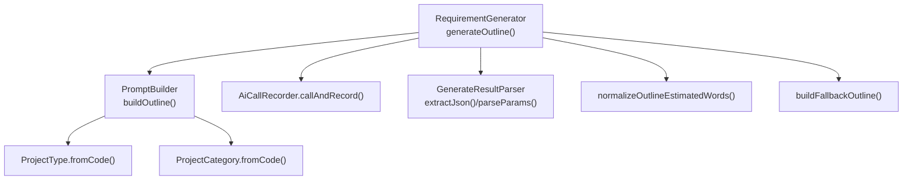
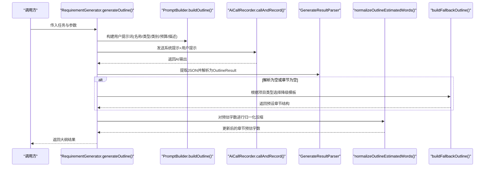
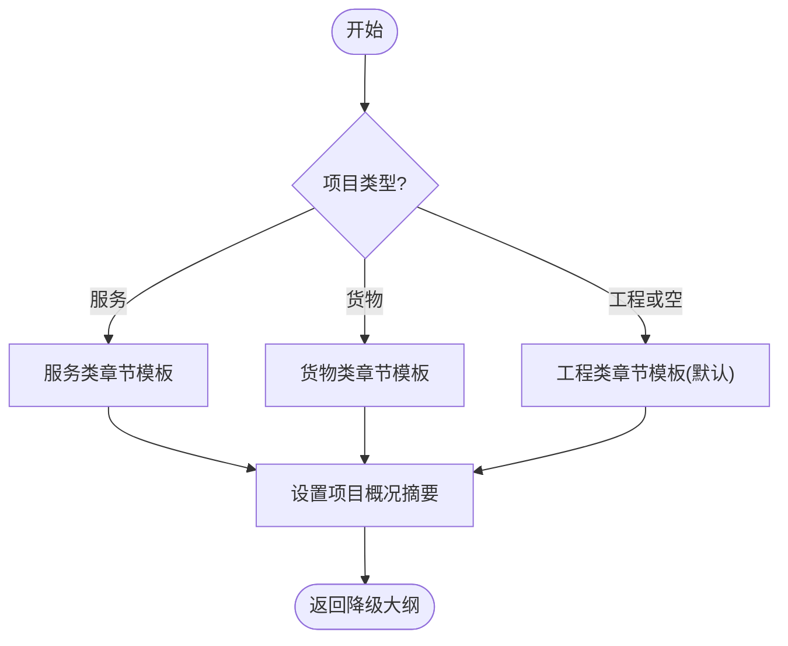
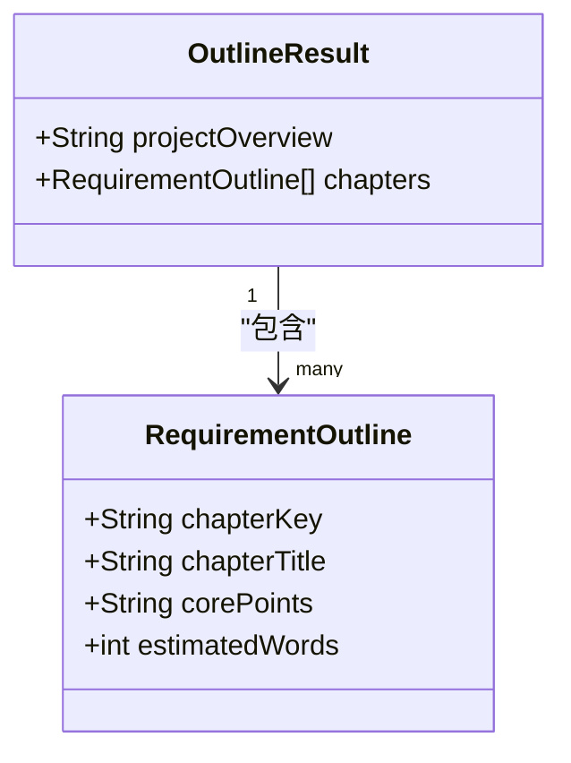
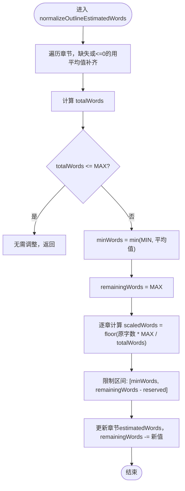
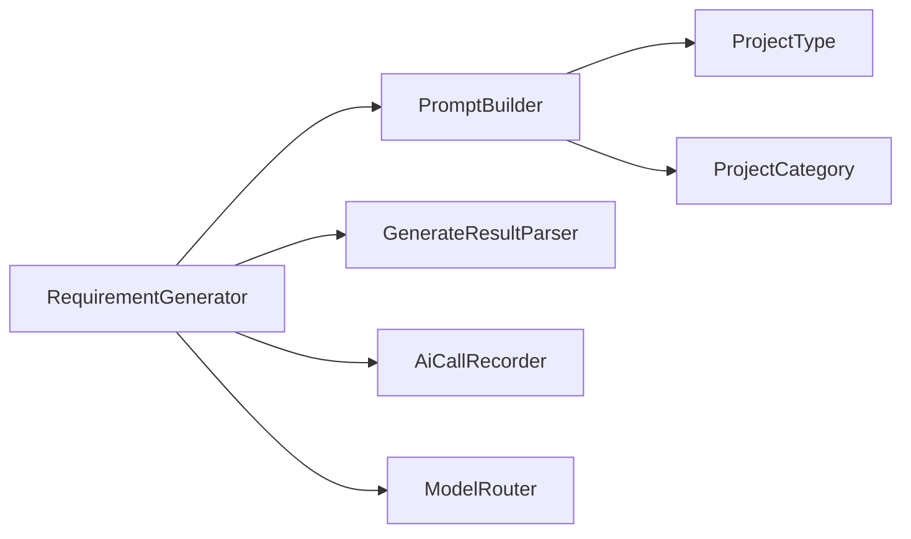

# 大纲生成阶段

<cite>
**本文引用的文件**   
- [RequirementGenerator.java](file://ele-ai-tender-system/ele-ai-tender-ai/src/main/java/com/jy/eleaitender/ai/processor/generator/RequirementGenerator.java)
- [PromptBuilder.java](file://ele-ai-tender-system/ele-ai-tender-ai/src/main/java/com/jy/eleaitender/ai/processor/prompt/PromptBuilder.java)
- [ProjectType.java](file://ele-ai-tender-system/ele-ai-tender-common/src/main/java/com/jy/eleaitender/common/enums/ProjectType.java)
- [ProjectCategory.java](file://ele-ai-tender-system/ele-ai-tender-common/src/main/java/com/jy/eleaitender/common/enums/ProjectCategory.java)
- [OutlineResult.java](file://ele-ai-tender-system/ele-ai-tender-common/src/main/java/com/jy/eleaitender/common/dto/ai/OutlineResult.java)
- [RequirementOutline.java](file://ele-ai-tender-system/ele-ai-tender-common/src/main/java/com/jy/eleaitender/common/dto/ai/RequirementOutline.java)
</cite>

## 目录
1. [简介](#简介)
2. [项目结构](#项目结构)
3. [核心组件](#核心组件)
4. [架构总览](#架构总览)
5. [详细组件分析](#详细组件分析)
6. [依赖关系分析](#依赖关系分析)
7. [性能与约束](#性能与约束)
8. [故障排查指南](#故障排查指南)
9. [结论](#结论)

## 简介
本章节聚焦“Step1：大纲生成”阶段的实现，围绕以下目标展开：
- 基于项目类型（服务类、货物类、工程类）的智能章节结构设计
- PromptBuilder.buildOutline 的提示词构建逻辑与参数整合方式
- 降级模板机制：当AI生成失败时按项目类型选择预设章节结构
- 大纲字数估算算法：MAX_REQUIREMENT_TOTAL_WORDS 限制与 normalizeOutlineEstimatedWords 的智能压缩策略
- 通过流程图与时序图展示不同项目类型的差异与降级处理流程

## 项目结构
Step1 大纲生成由需求生成器编排，调用提示词构建器组装用户提示词，再经模型路由与记录器完成AI调用，最后解析并规范化大纲结果。

图示来源
- [RequirementGenerator.java:199-238](file://ele-ai-tender-system/ele-ai-tender-ai/src/main/java/com/jy/eleaitender/ai/processor/generator/RequirementGenerator.java#L199-L238)
- [PromptBuilder.java:51-60](file://ele-ai-tender-system/ele-ai-tender-ai/src/main/java/com/jy/eleaitender/ai/processor/prompt/PromptBuilder.java#L51-L60)
- [ProjectType.java:20-27](file://ele-ai-tender-system/ele-ai-tender-common/src/main/java/com/jy/eleaitender/common/enums/ProjectType.java#L20-L27)
- [ProjectCategory.java:20-27](file://ele-ai-tender-system/ele-ai-tender-common/src/main/java/com/jy/eleaitender/common/enums/ProjectCategory.java#L20-L27)

章节来源
- [RequirementGenerator.java:199-238](file://ele-ai-tender-system/ele-ai-tender-ai/src/main/java/com/jy/eleaitender/ai/processor/generator/RequirementGenerator.java#L199-L238)
- [PromptBuilder.java:51-60](file://ele-ai-tender-system/ele-ai-tender-ai/src/main/java/com/jy/eleaitender/ai/processor/prompt/PromptBuilder.java#L51-L60)

## 核心组件
- RequirementGenerator：负责三步式Agent编排，Step1 中构造提示词、发起AI调用、解析JSON大纲、执行降级与字数归一化。
- PromptBuilder：统一构建各场景User Prompt，其中 buildOutline 将项目名称、类型、类别、预算、描述等参数注入模板。
- ProjectType / ProjectCategory：提供从代码到标签的映射，用于在提示词中呈现人类可读的项目类型与类别。
- OutlineResult / RequirementOutline：定义Step1输出的结构化数据模型（项目概况与章节列表）。

章节来源
- [RequirementGenerator.java:199-238](file://ele-ai-tender-system/ele-ai-tender-ai/src/main/java/com/jy/eleaitender/ai/processor/generator/RequirementGenerator.java#L199-L238)
- [PromptBuilder.java:51-60](file://ele-ai-tender-system/ele-ai-tender-ai/src/main/java/com/jy/eleaitender/ai/processor/prompt/PromptBuilder.java#L51-L60)
- [ProjectType.java:1-29](file://ele-ai-tender-system/ele-ai-tender-common/src/main/java/com/jy/eleaitender/common/enums/ProjectType.java#L1-L29)
- [ProjectCategory.java:1-29](file://ele-ai-tender-system/ele-ai-tender-common/src/main/java/com/jy/eleaitender/common/enums/ProjectCategory.java#L1-L29)
- [OutlineResult.java:1-27](file://ele-ai-tender-system/ele-ai-tender-common/src/main/java/com/jy/eleaitender/common/dto/ai/OutlineResult.java#L1-L27)
- [RequirementOutline.java:1-40](file://ele-ai-tender-system/ele-ai-tender-common/src/main/java/com/jy/eleaitender/common/dto/ai/RequirementOutline.java#L1-L40)

## 架构总览
Step1 的大纲生成时序如下：

图示来源
- [RequirementGenerator.java:199-238](file://ele-ai-tender-system/ele-ai-tender-ai/src/main/java/com/jy/eleaitender/ai/processor/generator/RequirementGenerator.java#L199-L238)
- [PromptBuilder.java:51-60](file://ele-ai-tender-system/ele-ai-tender-ai/src/main/java/com/jy/eleaitender/ai/processor/prompt/PromptBuilder.java#L51-L60)

## 详细组件分析

### 提示词构建：PromptBuilder.buildOutline
- 输入参数：项目名称、项目类型代码、项目类别代码、预算、描述
- 处理逻辑：
  - 使用 ProjectType.fromCode 与 ProjectCategory.fromCode 将代码转换为人类可读标签
  - 将上述信息以固定模板格式组合为用户提示词
- 作用：向AI明确“要生成什么类型的需求文档大纲”，引导其输出符合业务结构的章节

章节来源
- [PromptBuilder.java:51-60](file://ele-ai-tender-system/ele-ai-tender-ai/src/main/java/com/jy/eleaitender/ai/processor/prompt/PromptBuilder.java#L51-L60)
- [ProjectType.java:20-27](file://ele-ai-tender-system/ele-ai-tender-common/src/main/java/com/jy/eleaitender/common/enums/ProjectType.java#L20-L27)
- [ProjectCategory.java:20-27](file://ele-ai-tender-system/ele-ai-tender-common/src/main/java/com/jy/eleaitender/common/enums/ProjectCategory.java#L20-L27)

### Step1 大纲生成主流程：RequirementGenerator.generateOutline
- 构建用户提示词：调用 PromptBuilder.buildOutline
- 附加系统提示词与参考文件上下文后，发起AI调用
- 解析AI输出为 JSON，并反序列化为 OutlineResult
- 若解析失败或章节为空，触发降级模板
- 对大纲进行字数归一化处理

章节来源
- [RequirementGenerator.java:199-238](file://ele-ai-tender-system/ele-ai-tender-ai/src/main/java/com/jy/eleaitender/ai/processor/generator/RequirementGenerator.java#L199-L238)

### 降级模板机制：buildFallbackOutline
当AI未能产出有效大纲时，系统依据项目类型回退到预设章节结构：
- 服务类：侧重服务范围、服务要求、商务条款、验收与其他要求
- 货物类：侧重采购清单、技术规格与参数、质量与交货验收、售后服务与其他要求
- 工程类（含projectType为空时的默认分支）：侧重工程范围、技术规格、施工要求、质量验收、商务要求、服务与其他要求

图示来源
- [RequirementGenerator.java:284-343](file://ele-ai-tender-system/ele-ai-tender-ai/src/main/java/com/jy/eleaitender/ai/processor/generator/RequirementGenerator.java#L284-L343)

章节来源
- [RequirementGenerator.java:284-343](file://ele-ai-tender-system/ele-ai-tender-ai/src/main/java/com/jy/eleaitender/ai/processor/generator/RequirementGenerator.java#L284-L343)

### 大纲数据结构：OutlineResult 与 RequirementOutline
- OutlineResult：包含项目概况摘要与章节列表
- RequirementOutline：每个章节包含唯一标识、标题、核心要点与预估字数

图示来源
- [OutlineResult.java:1-27](file://ele-ai-tender-system/ele-ai-tender-common/src/main/java/com/jy/eleaitender/common/dto/ai/OutlineResult.java#L1-L27)
- [RequirementOutline.java:1-40](file://ele-ai-tender-system/ele-ai-tender-common/src/main/java/com/jy/eleaitender/common/dto/ai/RequirementOutline.java#L1-L40)

章节来源
- [OutlineResult.java:1-27](file://ele-ai-tender-system/ele-ai-tender-common/src/main/java/com/jy/eleaitender/common/dto/ai/OutlineResult.java#L1-L27)
- [RequirementOutline.java:1-40](file://ele-ai-tender-system/ele-ai-tender-common/src/main/java/com/jy/eleaitender/common/dto/ai/RequirementOutline.java#L1-L40)

### 大纲字数估算与压缩：normalizeOutlineEstimatedWords
- 目标：确保所有章节预估字数之和不超过 MAX_REQUIREMENT_TOTAL_WORDS（5000字）
- 策略：
  - 若某章未设置或<=0，则按平均分配补齐（上限=总字数/章节数）
  - 计算总字数，若未超限则直接返回
  - 若超限，按比例缩放每章字数，同时保证每章不低于 MIN_CHAPTER_ESTIMATED_WORDS（300字），且最后一章吸收剩余配额
- 复杂度：O(n)，n为章节数量

图示来源
- [RequirementGenerator.java:240-279](file://ele-ai-tender-system/ele-ai-tender-ai/src/main/java/com/jy/eleaitender/ai/processor/generator/RequirementGenerator.java#L240-L279)

章节来源
- [RequirementGenerator.java:240-279](file://ele-ai-tender-system/ele-ai-tender-ai/src/main/java/com/jy/eleaitender/ai/processor/generator/RequirementGenerator.java#L240-L279)

### 不同项目类型的章节结构差异示例
- 服务类：强调服务范围、服务要求、商务条款、验收与其他要求
- 货物类：强调采购清单、技术规格与参数、质量标准与交货验收、售后服务与其他要求
- 工程类：强调工程范围、技术规格、施工要求、质量验收、商务要求、服务与其他要求

章节来源
- [RequirementGenerator.java:298-339](file://ele-ai-tender-system/ele-ai-tender-ai/src/main/java/com/jy/eleaitender/ai/processor/generator/RequirementGenerator.java#L298-L339)

## 依赖关系分析
- RequirementGenerator 依赖：
  - PromptBuilder：构建用户提示词
  - GenerateResultParser：提取JSON并解析为大纲对象
  - AiCallRecorder：封装AI调用与日志记录
  - ModelRouter：选择模型并获取ChatClient
- 枚举依赖：
  - ProjectType / ProjectCategory：用于将代码转为标签，提升提示词可读性

图示来源
- [RequirementGenerator.java:199-238](file://ele-ai-tender-system/ele-ai-tender-ai/src/main/java/com/jy/eleaitender/ai/processor/generator/RequirementGenerator.java#L199-L238)
- [PromptBuilder.java:51-60](file://ele-ai-tender-system/ele-ai-tender-ai/src/main/java/com/jy/eleaitender/ai/processor/prompt/PromptBuilder.java#L51-L60)
- [ProjectType.java:20-27](file://ele-ai-tender-system/ele-ai-tender-common/src/main/java/com/jy/eleaitender/common/enums/ProjectType.java#L20-L27)
- [ProjectCategory.java:20-27](file://ele-ai-tender-system/ele-ai-tender-common/src/main/java/com/jy/eleaitender/common/enums/ProjectCategory.java#L20-L27)

章节来源
- [RequirementGenerator.java:199-238](file://ele-ai-tender-system/ele-ai-tender-ai/src/main/java/com/jy/eleaitender/ai/processor/generator/RequirementGenerator.java#L199-L238)
- [PromptBuilder.java:51-60](file://ele-ai-tender-system/ele-ai-tender-ai/src/main/java/com/jy/eleaitender/ai/processor/prompt/PromptBuilder.java#L51-L60)

## 性能与约束
- 字数硬约束：MAX_REQUIREMENT_TOTAL_WORDS = 5000；单章保底 MIN_CHAPTER_ESTIMATED_WORDS = 300；默认单章估计 DEFAULT_CHAPTER_ESTIMATED_WORDS = 800
- 压缩策略：按比例缩放，保留最小字数下限，避免过度压缩导致内容空洞
- 并发控制：分章生成阶段采用信号量限流，避免触发API速率限制（该约束主要影响Step2，但Step1的输出直接影响Step2的并发与耗时）

章节来源
- [RequirementGenerator.java:82-86](file://ele-ai-tender-system/ele-ai-tender-ai/src/main/java/com/jy/eleaitender/ai/processor/generator/RequirementGenerator.java#L82-L86)
- [RequirementGenerator.java:240-279](file://ele-ai-tender-system/ele-ai-tender-ai/src/main/java/com/jy/eleaitender/ai/processor/generator/RequirementGenerator.java#L240-L279)

## 故障排查指南
- 现象：Step1 大纲解析失败或为空
  - 检查AI输出是否包含合法JSON
  - 确认 GenerateResultParser.extractJson 与 parseParams 是否正常
  - 若失败，系统将自动走降级模板，验证降级模板是否按项目类型正确选择
- 现象：最终大纲总字数超过限制
  - 检查 normalizeOutlineEstimatedWords 是否正确执行
  - 关注日志中的“已压缩到...以内”提示，确认每章预估字数是否符合预期

章节来源
- [RequirementGenerator.java:232-238](file://ele-ai-tender-system/ele-ai-tender-ai/src/main/java/com/jy/eleaitender/ai/processor/generator/RequirementGenerator.java#L232-L238)
- [RequirementGenerator.java:277-279](file://ele-ai-tender-system/ele-ai-tender-ai/src/main/java/com/jy/eleaitender/ai/processor/generator/RequirementGenerator.java#L277-L279)

## 结论
Step1 大纲生成阶段通过“提示词构建→AI生成→解析→降级→字数归一化”的闭环，确保在不同项目类型下都能产出结构合理、字数可控的大纲。PromptBuilder 将关键项目信息注入提示词，增强AI生成的针对性；降级模板保障稳定性；字数归一化策略满足整体长度约束，为后续分章生成奠定基础。