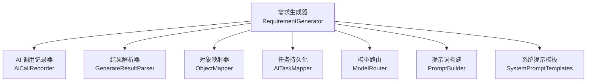
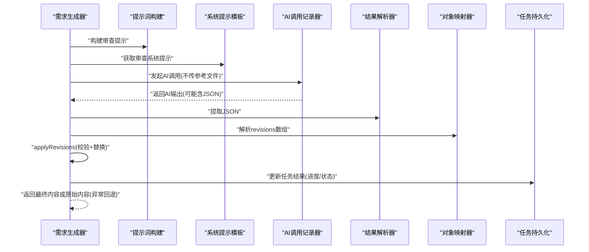
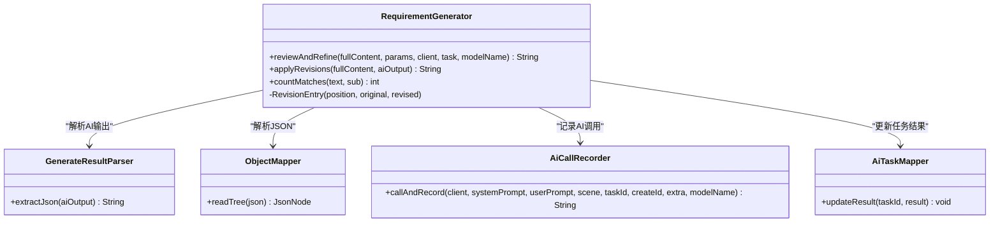
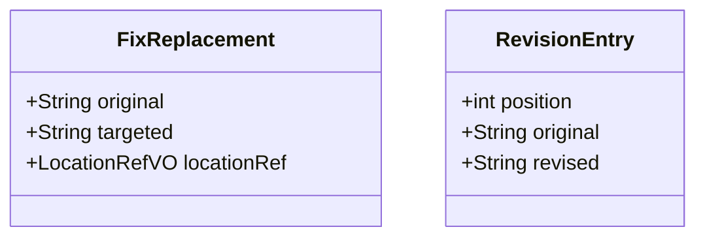

# 审查修订阶段

<cite>
**本文引用的文件**   
- [RequirementGenerator.java](file://ele-ai-tender-system/ele-ai-tender-ai/src/main/java/com/jy/eleaitender/ai/processor/generator/RequirementGenerator.java)
- [FixReplacement.java](file://ele-ai-tender-system/ele-ai-tender-common/src/main/java/com/jy/eleaitender/common/dto/FixReplacement.java)
</cite>

## 目录
1. [简介](#简介)
2. [项目结构](#项目结构)
3. [核心组件](#核心组件)
4. [架构总览](#架构总览)
5. [详细组件分析](#详细组件分析)
6. [依赖关系分析](#依赖关系分析)
7. [性能考量](#性能考量)
8. [故障排查指南](#故障排查指南)
9. [结论](#结论)
10. [附录](#附录)

## 简介
本章节聚焦于需求生成流程中的“审查与局部修订”阶段（Step 3），围绕以下目标展开：
- 深入解析 reviewAndRefine 方法的全文审查与修订应用流程
- 详解 applyRevisions 的精确替换算法与防误替换策略
- 说明修订项验证机制，包括最小长度检查、匹配次数校验与多处匹配防护
- 解释位置偏移计算、从后向前替换策略与异常回滚机制
- 阐述 countMatches 文本匹配算法与 RevisionEntry 记录类设计
- 提供修订 JSON 格式规范与错误处理最佳实践

## 项目结构
审查修订逻辑位于 AI 模块的需求生成器中，作为三步式编排的第三步执行。其职责是：
- 调用大模型进行全文审查并输出结构化修订建议
- 在代码层对修订建议进行严格校验与精确替换
- 保证替换过程安全、可追溯、可回滚



图表来源
- [RequirementGenerator.java:118-195](file://ele-ai-tender-system/ele-ai-tender-ai/src/main/java/com/jy/eleaitender/ai/processor/generator/RequirementGenerator.java#L118-L195)
- [RequirementGenerator.java:646-692](file://ele-ai-tender-system/ele-ai-tender-ai/src/main/java/com/jy/eleaitender/ai/processor/generator/RequirementGenerator.java#L646-L692)
- [RequirementGenerator.java:702-764](file://ele-ai-tender-system/ele-ai-tender-ai/src/main/java/com/jy/eleaitender/ai/processor/generator/RequirementGenerator.java#L702-L764)

章节来源
- [RequirementGenerator.java:118-195](file://ele-ai-tender-system/ele-ai-tender-ai/src/main/java/com/jy/eleaitender/ai/processor/generator/RequirementGenerator.java#L118-L195)

## 核心组件
- 审查入口方法 reviewAndRefine：负责构造审查提示、调用 AI、解析修订 JSON 并应用替换
- 精确替换方法 applyRevisions：实现修订项验证、匹配计数、排序与从后向前替换
- 文本匹配方法 countMatches：统计子串出现次数，用于多处匹配防护
- 内部记录类 RevisionEntry：封装单次替换的位置、原文与替换文，便于排序与执行

章节来源
- [RequirementGenerator.java:646-692](file://ele-ai-tender-system/ele-ai-tender-ai/src/main/java/com/jy/eleaitender/ai/processor/generator/RequirementGenerator.java#L646-L692)
- [RequirementGenerator.java:702-764](file://ele-ai-tender-system/ele-ai-tender-ai/src/main/java/com/jy/eleaitender/ai/processor/generator/RequirementGenerator.java#L702-L764)
- [RequirementGenerator.java:769-777](file://ele-ai-tender-system/ele-ai-tender-ai/src/main/java/com/jy/eleaitender/ai/processor/generator/RequirementGenerator.java#L769-L777)
- [RequirementGenerator.java:784-785](file://ele-ai-tender-system/ele-ai-tender-ai/src/main/java/com/jy/eleaitender/ai/processor/generator/RequirementGenerator.java#L784-L785)

## 架构总览
下图展示 Step 3 的整体时序：从审查提示构建到最终内容返回，包含日志记录与异常回退路径。



图表来源
- [RequirementGenerator.java:646-692](file://ele-ai-tender-system/ele-ai-tender-ai/src/main/java/com/jy/eleaitender/ai/processor/generator/RequirementGenerator.java#L646-L692)
- [RequirementGenerator.java:702-764](file://ele-ai-tender-system/ele-ai-tender-ai/src/main/java/com/jy/eleaitender/ai/processor/generator/RequirementGenerator.java#L702-L764)

## 详细组件分析

### reviewAndRefine 方法：审查流程
- 输入：全文内容、生成参数、ChatClient、任务上下文、模型名称
- 步骤：
  - 使用 PromptBuilder 构建用户提示，结合 SystemPromptTemplates 的系统提示
  - 通过 AiCallRecorder 发起 AI 调用，记录请求与响应
  - 调用 applyRevisions 将 AI 输出的修订列表应用到全文
  - 若发生异常，回退为原始内容，确保流程健壮性
- 关键特性：
  - 审查阶段不传入参考文件列表，降低 token 消耗
  - 记录“应用审查修订”阶段的耗时与输入输出长度

章节来源
- [RequirementGenerator.java:646-692](file://ele-ai-tender-system/ele-ai-tender-ai/src/main/java/com/jy/eleaitender/ai/processor/generator/RequirementGenerator.java#L646-L692)

### applyRevisions 方法：精确替换算法
- 输入：全文内容、AI 输出字符串
- 步骤：
  - 从 AI 输出中提取 JSON，解析出 revisions 数组
  - 遍历每个修订项，执行三项验证：
    - 非空校验：original 与 revised 均不能为空
    - 最小长度校验：original.length() < MIN_REVISION_ORIGINAL_LENGTH 则跳过
    - 匹配次数校验：countMatches(fullContent, original) 必须等于 1
  - 收集有效修订项为 RevisionEntry 列表，记录 position、original、revised
  - 按 position 降序排序，从后向前替换，避免偏移漂移
  - 使用 StringBuilder.replace 完成精确替换
  - 异常时返回原始内容，实现回滚
- 防护措施：
  - 最小长度阈值防止短片段误替换
  - 唯一匹配要求避免批量误替换
  - 从后向前替换避免索引偏移问题

章节来源
- [RequirementGenerator.java:702-764](file://ele-ai-tender-system/ele-ai-tender-ai/src/main/java/com/jy/eleaitender/ai/processor/generator/RequirementGenerator.java#L702-L764)

### countMatches 方法：文本匹配算法
- 功能：统计 sub 在 text 中出现的次数
- 算法：
  - 使用 indexOf 循环查找，每次找到后将索引前进 sub.length()
  - 时间复杂度 O(n*m)，空间复杂度 O(1)
- 用途：用于多处匹配防护，确保修订项仅能唯一匹配

章节来源
- [RequirementGenerator.java:769-777](file://ele-ai-tender-system/ele-ai-tender-ai/src/main/java/com/jy/eleaitender/ai/processor/generator/RequirementGenerator.java#L769-L777)

### RevisionEntry 记录类：设计模式
- 类型：Java record（不可变数据载体）
- 字段：
  - position：原文在全文中的起始位置
  - original：待替换的原文片段
  - revised：替换后的新文本
- 作用：
  - 封装单次替换所需的最小信息
  - 支持按 position 排序，实现从后向前替换
  - 提高代码可读性与维护性

章节来源
- [RequirementGenerator.java:784-785](file://ele-ai-tender-system/ele-ai-tender-ai/src/main/java/com/jy/eleaitender/ai/processor/generator/RequirementGenerator.java#L784-L785)

### 防误替换防护措施详解
- 最小长度检查（MIN_REVISION_ORIGINAL_LENGTH）：
  - 常量定义为 20，过短的原文容易引发误替换
  - 触发条件：original.length() < 20 → 跳过该修订项
- 匹配次数验证：
  - 使用 countMatches 统计匹配次数
  - matchCount == 0 → 未匹配，跳过
  - matchCount > 1 → 多处匹配，跳过
- 位置偏移计算与从后向前替换：
  - 先计算每个修订项的 position = fullContent.indexOf(original)
  - 按 position 降序排序，确保后续替换不影响前面已定位的索引
  - 使用 StringBuilder.replace 进行原地替换
- 异常回滚机制：
  - 整个 applyRevisions 包裹在 try-catch 中
  - 任何异常（如 JSON 解析失败、替换异常）均返回原始内容
  - reviewAndRefine 外层也捕获异常，确保流程不中断

章节来源
- [RequirementGenerator.java:702-764](file://ele-ai-tender-system/ele-ai-tender-ai/src/main/java/com/jy/eleaitender/ai/processor/generator/RequirementGenerator.java#L702-L764)
- [RequirementGenerator.java:646-692](file://ele-ai-tender-system/ele-ai-tender-ai/src/main/java/com/jy/eleaitender/ai/processor/generator/RequirementGenerator.java#L646-L692)

### 修订 JSON 格式规范
- 根节点：包含 revisions 数组
- revisions 数组元素：
  - original：待替换的原文片段（必填，且长度 ≥ 20）
  - revised：替换后的新文本（必填）
- 示例结构（示意）：
  ```json
  {
    "revisions": [
      {
        "original": "需要被替换的完整句子",
        "revised": "替换后的新句子"
      }
    ]
  }
  ```
- 注意事项：
  - original 必须在全文中唯一匹配
  - 避免使用过于简短的片段
  - 确保 JSON 语法正确，否则会被视为解析失败并回退

章节来源
- [RequirementGenerator.java:702-764](file://ele-ai-tender-system/ele-ai-tender-ai/src/main/java/com/jy/eleaitender/ai/processor/generator/RequirementGenerator.java#L702-L764)

### 错误处理最佳实践
- AI 调用异常：
  - 记录错误信息，返回原始内容
  - 保持任务状态一致，避免部分成功导致的数据不一致
- JSON 解析异常：
  - 捕获并记录异常，返回原始内容
  - 避免污染最终文档
- 替换异常：
  - 单个替换失败不影响其他修订项
  - 整体异常时回滚到原始内容
- 日志记录：
  - 记录每个阶段的开始与结束时间
  - 记录输入输出长度、跳过原因等关键信息

章节来源
- [RequirementGenerator.java:646-692](file://ele-ai-tender-system/ele-ai-tender-ai/src/main/java/com/jy/eleaitender/ai/processor/generator/RequirementGenerator.java#L646-L692)
- [RequirementGenerator.java:702-764](file://ele-ai-tender-system/ele-ai-tender-ai/src/main/java/com/jy/eleaitender/ai/processor/generator/RequirementGenerator.java#L702-L764)

## 依赖关系分析
审查修订阶段依赖的核心组件及其关系如下：



图表来源
- [RequirementGenerator.java:646-692](file://ele-ai-tender-system/ele-ai-tender-ai/src/main/java/com/jy/eleaitender/ai/processor/generator/RequirementGenerator.java#L646-L692)
- [RequirementGenerator.java:702-764](file://ele-ai-tender-system/ele-ai-tender-ai/src/main/java/com/jy/eleaitender/ai/processor/generator/RequirementGenerator.java#L702-L764)

章节来源
- [RequirementGenerator.java:646-692](file://ele-ai-tender-system/ele-ai-tender-ai/src/main/java/com/jy/eleaitender/ai/processor/generator/RequirementGenerator.java#L646-L692)
- [RequirementGenerator.java:702-764](file://ele-ai-tender-system/ele-ai-tender-ai/src/main/java/com/jy/eleaitender/ai/processor/generator/RequirementGenerator.java#L702-L764)

## 性能考量
- 文本匹配算法：
  - countMatches 使用线性扫描，时间复杂度 O(n*m)，适用于中等长度文本
  - 对于超长文档，可考虑优化为 KMP 算法或预处理索引
- 替换操作：
  - 从后向前替换避免多次重建字符串，提升性能
  - 使用 StringBuilder 减少内存分配
- AI 调用：
  - 审查阶段不传入参考文件，降低 token 消耗与延迟
- 并发控制：
  - 虽然审查阶段串行执行，但可通过异步化进一步提升吞吐

[本节为通用性能讨论，不涉及具体文件分析]

## 故障排查指南
- 常见问题：
  - 修订项未生效：检查 original 是否唯一匹配，长度是否满足最小要求
  - 多处匹配警告：调整 original 使其更具特异性
  - JSON 解析失败：确认 AI 输出格式符合规范
- 日志关键字：
  - “修订项原文过短”、“修订项原文未匹配”、“修订项原文匹配多处”
  - “修订JSON解析失败”、“审查修订失败”
- 调试建议：
  - 查看 AI 输出原始内容，确认 JSON 结构
  - 打印每个修订项的 position 与匹配次数
  - 逐步缩小 original 范围，确保唯一性

章节来源
- [RequirementGenerator.java:702-764](file://ele-ai-tender-system/ele-ai-tender-ai/src/main/java/com/jy/eleaitender/ai/processor/generator/RequirementGenerator.java#L702-L764)

## 结论
审查修订阶段通过严格的验证机制与安全替换策略，确保了 AI 生成的修订建议能够准确、可靠地应用到文档中。最小长度检查、唯一匹配要求与从后向前替换策略共同构成了防误替换的三重防护。异常回滚机制保证了系统的健壮性。建议在实际使用中遵循修订 JSON 格式规范，并提供足够具体的原文片段以提高匹配成功率。

[本节为总结性内容，不涉及具体文件分析]

## 附录

### 相关数据结构对比
- FixReplacement：文档修复替换项，包含 original、targeted、locationRef 字段，用于兼容旧数据
- RevisionEntry：审查修订条目，包含 position、original、revised 字段，用于精确替换



图表来源
- [FixReplacement.java:1-20](file://ele-ai-tender-system/ele-ai-tender-common/src/main/java/com/jy/eleaitender/common/dto/FixReplacement.java#L1-L20)
- [RequirementGenerator.java:784-785](file://ele-ai-tender-system/ele-ai-tender-ai/src/main/java/com/jy/eleaitender/ai/processor/generator/RequirementGenerator.java#L784-L785)

章节来源
- [FixReplacement.java:1-20](file://ele-ai-tender-system/ele-ai-tender-common/src/main/java/com/jy/eleaitender/common/dto/FixReplacement.java#L1-L20)
- [RequirementGenerator.java:784-785](file://ele-ai-tender-system/ele-ai-tender-ai/src/main/java/com/jy/eleaitender/ai/processor/generator/RequirementGenerator.java#L784-L785)