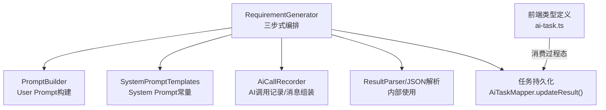
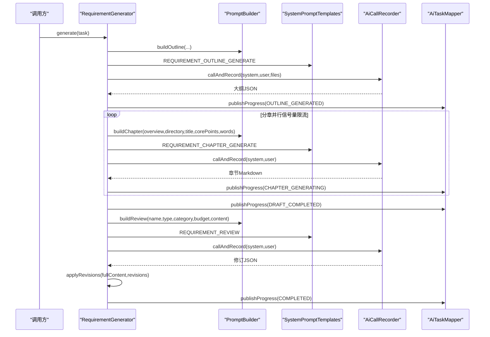
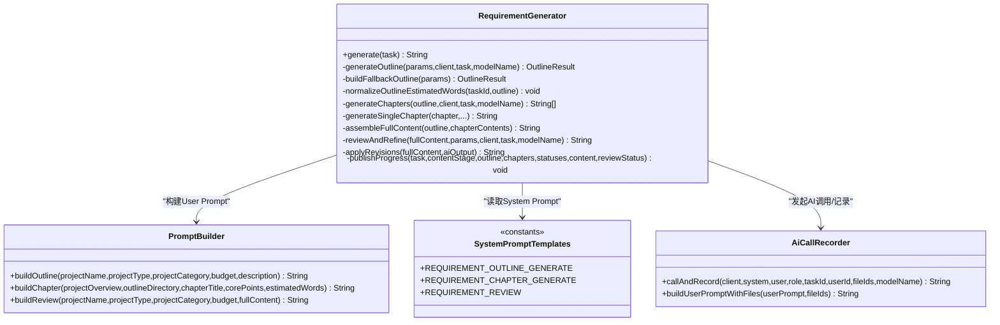
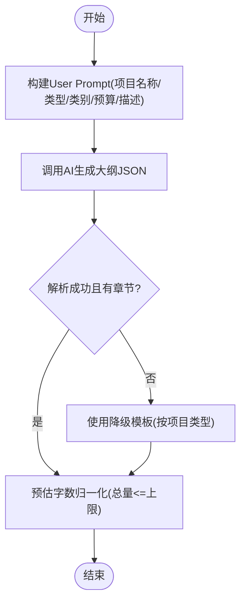
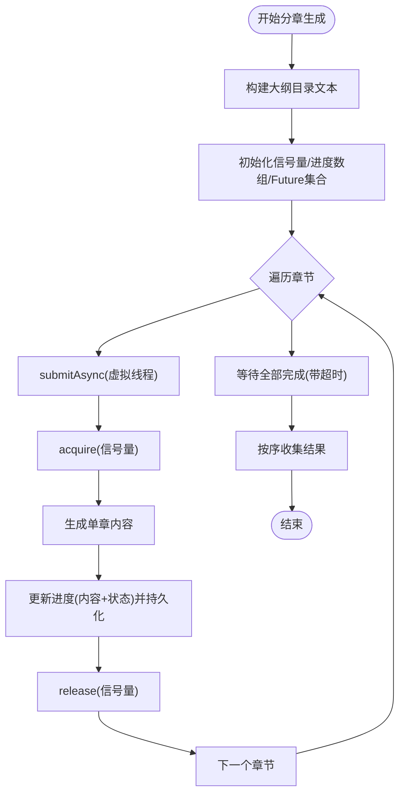
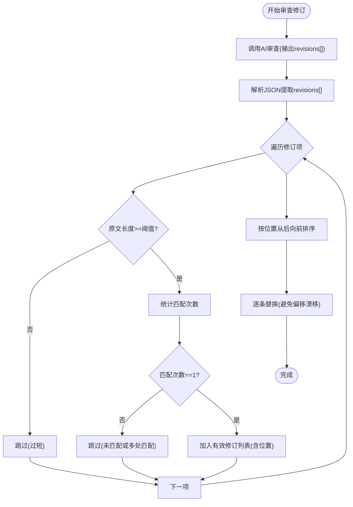
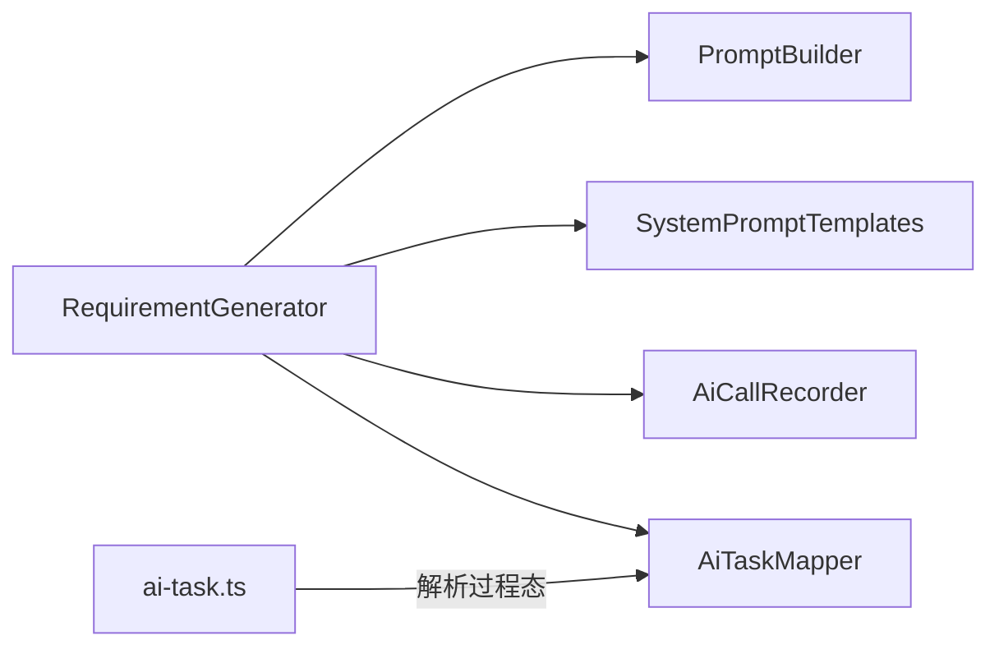

# 需求文档生成器

<cite>
**本文引用的文件**   
- [RequirementGenerator.java](file://ele-ai-tender-system/ele-ai-tender-ai/src/main/java/com/jy/eleaitender/ai/processor/generator/RequirementGenerator.java)
- [PromptBuilder.java](file://ele-ai-tender-system/ele-ai-tender-ai/src/main/java/com/jy/eleaitender/ai/processor/prompt/PromptBuilder.java)
- [SystemPromptTemplates.java](file://ele-ai-tender-system/ele-ai-tender-ai/src/main/java/com/jy/eleaitender/ai/processor/prompt/SystemPromptTemplates.java)
- [AiCallRecorder.java](file://ele-ai-tender-system/ele-ai-tender-ai/src/main/java/com/jy/eleaitender/ai/processor/recorder/AiCallRecorder.java)
- [RequirementGeneratorTest.java](file://ele-ai-tender-system/ele-ai-tender-ai/src/test/java/com/jy/eleaitender/ai/processor/generator/RequirementGeneratorTest.java)
- [ai-task.ts](file://ele-ai-tender-frontend/src/types/ai-task.ts)
</cite>

## 目录
1. [简介](#简介)
2. [项目结构](#项目结构)
3. [核心组件](#核心组件)
4. [架构总览](#架构总览)
5. [详细组件分析](#详细组件分析)
6. [依赖关系分析](#依赖关系分析)
7. [性能考量](#性能考量)
8. [故障排查指南](#故障排查指南)
9. [结论](#结论)
10. [附录](#附录)

## 简介
本文件面向“需求文档生成器”的三步式Agent编排实现，围绕 RequirementGenerator 的核心流程展开：大纲生成、分章并行生成与审查修订。重点说明：
- Step1 大纲生成算法：基于项目类型（服务类、货物类、工程类）的智能章节结构设计及降级模板机制；
- Step2 分章并行生成：虚拟线程并发控制、信号量限流与进度实时推送；
- Step3 全文审查与局部修订：修订项验证、精确替换算法与防误替换防护措施；
- 提示词工程最佳实践与性能优化策略。

## 项目结构
该功能位于 AI 模块的处理器层，核心由以下文件协作完成：
- 编排与执行：RequirementGenerator
- 提示词构建：PromptBuilder
- 系统提示词模板：SystemPromptTemplates
- AI调用记录与消息组装：AiCallRecorder
- 前端进度展示类型定义：ai-task.ts
- 行为验证测试：RequirementGeneratorTest

图表来源
- [RequirementGenerator.java:124-195](file://ele-ai-tender-system/ele-ai-tender-ai/src/main/java/com/jy/eleaitender/ai/processor/generator/RequirementGenerator.java#L124-L195)
- [PromptBuilder.java:51-88](file://ele-ai-tender-system/ele-ai-tender-ai/src/main/java/com/jy/eleaitender/ai/processor/prompt/PromptBuilder.java#L51-L88)
- [SystemPromptTemplates.java:71-188](file://ele-ai-tender-system/ele-ai-tender-ai/src/main/java/com/jy/eleaitender/ai/processor/prompt/SystemPromptTemplates.java#L71-L188)
- [AiCallRecorder.java:42-97](file://ele-ai-tender-system/ele-ai-tender-ai/src/main/java/com/jy/eleaitender/ai/processor/recorder/AiCallRecorder.java#L42-L97)
- [ai-task.ts:74-93](file://ele-ai-tender-frontend/src/types/ai-task.ts#L74-L93)

章节来源
- [RequirementGenerator.java:124-195](file://ele-ai-tender-system/ele-ai-tender-ai/src/main/java/com/jy/eleaitender/ai/processor/generator/RequirementGenerator.java#L124-L195)
- [PromptBuilder.java:51-88](file://ele-ai-tender-system/ele-ai-tender-ai/src/main/java/com/jy/eleaitender/ai/processor/prompt/PromptBuilder.java#L51-L88)
- [SystemPromptTemplates.java:71-188](file://ele-ai-tender-system/ele-ai-tender-ai/src/main/java/com/jy/eleaitender/ai/processor/prompt/SystemPromptTemplates.java#L71-L188)
- [AiCallRecorder.java:42-97](file://ele-ai-tender-system/ele-ai-tender-ai/src/main/java/com/jy/eleaitender/ai/processor/recorder/AiCallRecorder.java#L42-L97)
- [ai-task.ts:74-93](file://ele-ai-tender-frontend/src/types/ai-task.ts#L74-L93)

## 核心组件
- RequirementGenerator：实现三步式编排，负责整体流程控制、并发与限流、进度发布与结果持久化。
- PromptBuilder：按场景拼装 User Prompt，避免 Spring AI PromptTemplate 对花括号等字符的二次解析问题。
- SystemPromptTemplates：集中管理各阶段 System Prompt，明确输出格式与约束。
- AiCallRecorder：封装 ChatClient 调用、消息组装、文件内容注入与调用日志记录。
- ai-task.ts：前端用于解析和渲染后端返回的过程态 JSON。

章节来源
- [RequirementGenerator.java:42-116](file://ele-ai-tender-system/ele-ai-tender-ai/src/main/java/com/jy/eleaitender/ai/processor/generator/RequirementGenerator.java#L42-L116)
- [PromptBuilder.java:1-173](file://ele-ai-tender-system/ele-ai-tender-ai/src/main/java/com/jy/eleaitender/ai/processor/prompt/PromptBuilder.java#L1-L173)
- [SystemPromptTemplates.java:1-497](file://ele-ai-tender-system/ele-ai-tender-ai/src/main/java/com/jy/eleaitender/ai/processor/prompt/SystemPromptTemplates.java#L1-L497)
- [AiCallRecorder.java:1-121](file://ele-ai-tender-system/ele-ai-tender-ai/src/main/java/com/jy/eleaitender/ai/processor/recorder/AiCallRecorder.java#L1-L121)
- [ai-task.ts:47-93](file://ele-ai-tender-frontend/src/types/ai-task.ts#L47-L93)

## 架构总览
下图展示了从用户触发到最终输出的端到端流程，包括三个阶段的关键交互与数据流转。

图表来源
- [RequirementGenerator.java:124-195](file://ele-ai-tender-system/ele-ai-tender-ai/src/main/java/com/jy/eleaitender/ai/processor/generator/RequirementGenerator.java#L124-L195)
- [RequirementGenerator.java:199-238](file://ele-ai-tender-system/ele-ai-tender-ai/src/main/java/com/jy/eleaitender/ai/processor/generator/RequirementGenerator.java#L199-L238)
- [RequirementGenerator.java:347-428](file://ele-ai-tender-system/ele-ai-tender-ai/src/main/java/com/jy/eleaitender/ai/processor/generator/RequirementGenerator.java#L347-L428)
- [RequirementGenerator.java:646-692](file://ele-ai-tender-system/ele-ai-tender-ai/src/main/java/com/jy/eleaitender/ai/processor/generator/RequirementGenerator.java#L646-L692)
- [PromptBuilder.java:51-88](file://ele-ai-tender-system/ele-ai-tender-ai/src/main/java/com/jy/eleaitender/ai/processor/prompt/PromptBuilder.java#L51-L88)
- [SystemPromptTemplates.java:71-188](file://ele-ai-tender-system/ele-ai-tender-ai/src/main/java/com/jy/eleaitender/ai/processor/prompt/SystemPromptTemplates.java#L71-L188)
- [AiCallRecorder.java:42-97](file://ele-ai-tender-system/ele-ai-tender-ai/src/main/java/com/jy/eleaitender/ai/processor/recorder/AiCallRecorder.java#L42-L97)

## 详细组件分析

### 组件A：RequirementGenerator（三步式编排）
- 入口方法 generate 串联四个子阶段：大纲生成、分章生成、全文拼接、审查修订，并在每个阶段更新任务结果以支持前端实时进度。
- Step1 大纲生成：
  - 通过 PromptBuilder.buildOutline 构造用户提示词，结合 SystemPromptTemplates.REQUIREMENT_OUTLINE_GENERATE 作为系统提示词；
  - 在调用前通过 AiCallRecorder.buildUserPromptWithFiles 将参考文件内容注入；
  - 解析AI返回的JSON为 OutlineResult，若失败或为空则启用降级模板 buildFallbackOutline；
  - 对 estimatedWords 进行归一化压缩，确保总字数不超过上限。
- Step2 分章并行生成：
  - 使用虚拟线程执行器 Executors.newVirtualThreadPerTaskExecutor 提升吞吐；
  - 通过 Semaphore 限制最大并发数，避免触发API速率限制；
  - 每章完成后立即更新进度，包含已完成的章节内容与状态，并拼接可用内容供前端预览；
  - 设置超时保护，取消未完成章节。
- Step3 审查与局部修订：
  - 调用 Review 提示词，要求AI输出修订列表JSON；
  - 应用修订时进行严格校验：原文长度阈值、唯一匹配检查、从后向前替换以避免偏移漂移；
  - 异常情况下回退到原始内容，保证稳定性。

图表来源
- [RequirementGenerator.java:124-195](file://ele-ai-tender-system/ele-ai-tender-ai/src/main/java/com/jy/eleaitender/ai/processor/generator/RequirementGenerator.java#L124-L195)
- [RequirementGenerator.java:199-238](file://ele-ai-tender-system/ele-ai-tender-ai/src/main/java/com/jy/eleaitender/ai/processor/generator/RequirementGenerator.java#L199-L238)
- [RequirementGenerator.java:284-343](file://ele-ai-tender-system/ele-ai-tender-ai/src/main/java/com/jy/eleaitender/ai/processor/generator/RequirementGenerator.java#L284-L343)
- [RequirementGenerator.java:347-428](file://ele-ai-tender-system/ele-ai-tender-ai/src/main/java/com/jy/eleaitender/ai/processor/generator/RequirementGenerator.java#L347-L428)
- [RequirementGenerator.java:646-692](file://ele-ai-tender-system/ele-ai-tender-ai/src/main/java/com/jy/eleaitender/ai/processor/generator/RequirementGenerator.java#L646-L692)
- [PromptBuilder.java:51-88](file://ele-ai-tender-system/ele-ai-tender-ai/src/main/java/com/jy/eleaitender/ai/processor/prompt/PromptBuilder.java#L51-L88)
- [SystemPromptTemplates.java:71-188](file://ele-ai-tender-system/ele-ai-tender-ai/src/main/java/com/jy/eleaitender/ai/processor/prompt/SystemPromptTemplates.java#L71-L188)
- [AiCallRecorder.java:42-97](file://ele-ai-tender-system/ele-ai-tender-ai/src/main/java/com/jy/eleaitender/ai/processor/recorder/AiCallRecorder.java#L42-L97)

章节来源
- [RequirementGenerator.java:124-195](file://ele-ai-tender-system/ele-ai-tender-ai/src/main/java/com/jy/eleaitender/ai/processor/generator/RequirementGenerator.java#L124-L195)
- [RequirementGenerator.java:199-238](file://ele-ai-tender-system/ele-ai-tender-ai/src/main/java/com/jy/eleaitender/ai/processor/generator/RequirementGenerator.java#L199-L238)
- [RequirementGenerator.java:284-343](file://ele-ai-tender-system/ele-ai-tender-ai/src/main/java/com/jy/eleaitender/ai/processor/generator/RequirementGenerator.java#L284-L343)
- [RequirementGenerator.java:347-428](file://ele-ai-tender-system/ele-ai-tender-ai/src/main/java/com/jy/eleaitender/ai/processor/generator/RequirementGenerator.java#L347-L428)
- [RequirementGenerator.java:646-692](file://ele-ai-tender-system/ele-ai-tender-ai/src/main/java/com/jy/eleaitender/ai/processor/generator/RequirementGenerator.java#L646-L692)

#### Step1 大纲生成算法详解
- 智能章节结构设计：
  - 根据项目类型选择不同模板分支：服务类、货物类、工程类；
  - 每个模板预设若干标准章节，覆盖项目概况、技术/服务要求、商务要求、验收与其他要求等；
  - 当AI返回的大纲解析失败或为空时，自动降级到预设模板，保障可用性。
- 预估字数归一化：
  - 计算默认单章字数并按比例缩放，确保所有章节 estimatedWords 总和不超过全局上限；
  - 对最后一章做兜底填充，保证总量不超且每章不低于最小值。

图表来源
- [RequirementGenerator.java:199-238](file://ele-ai-tender-system/ele-ai-tender-ai/src/main/java/com/jy/eleaitender/ai/processor/generator/RequirementGenerator.java#L199-L238)
- [RequirementGenerator.java:240-279](file://ele-ai-tender-system/ele-ai-tender-ai/src/main/java/com/jy/eleaitender/ai/processor/generator/RequirementGenerator.java#L240-L279)
- [RequirementGenerator.java:284-343](file://ele-ai-tender-system/ele-ai-tender-ai/src/main/java/com/jy/eleaitender/ai/processor/generator/RequirementGenerator.java#L284-L343)

章节来源
- [RequirementGenerator.java:199-238](file://ele-ai-tender-system/ele-ai-tender-ai/src/main/java/com/jy/eleaitender/ai/processor/generator/RequirementGenerator.java#L199-L238)
- [RequirementGenerator.java:240-279](file://ele-ai-tender-system/ele-ai-tender-ai/src/main/java/com/jy/eleaitender/ai/processor/generator/RequirementGenerator.java#L240-L279)
- [RequirementGenerator.java:284-343](file://ele-ai-tender-system/ele-ai-tender-ai/src/main/java/com/jy/eleaitender/ai/processor/generator/RequirementGenerator.java#L284-L343)

#### Step2 分章并行生成实现
- 并发模型：
  - 使用虚拟线程执行器，降低上下文切换开销，提高I/O密集型任务吞吐；
  - 通过信号量限制同时进行的章节生成请求数量，避免触发外部API速率限制；
  - 每个章节异步提交，完成后立即更新进度，包含当前已完成章节内容与状态。
- 进度推送：
  - 维护 progressContents 与 progressStatuses 两个列表，按索引对应章节；
  - 每次变更后调用 publishProgress 持久化过程态，前端可据此增量渲染。

图表来源
- [RequirementGenerator.java:347-428](file://ele-ai-tender-system/ele-ai-tender-ai/src/main/java/com/jy/eleaitender/ai/processor/generator/RequirementGenerator.java#L347-L428)
- [RequirementGenerator.java:433-490](file://ele-ai-tender-system/ele-ai-tender-ai/src/main/java/com/jy/eleaitender/ai/processor/generator/RequirementGenerator.java#L433-L490)

章节来源
- [RequirementGenerator.java:347-428](file://ele-ai-tender-system/ele-ai-tender-ai/src/main/java/com/jy/eleaitender/ai/processor/generator/RequirementGenerator.java#L347-L428)
- [RequirementGenerator.java:433-490](file://ele-ai-tender-system/ele-ai-tender-ai/src/main/java/com/jy/eleaitender/ai/processor/generator/RequirementGenerator.java#L433-L490)

#### Step3 全文审查与局部修订逻辑
- 审查阶段：
  - 使用 Review 提示词，要求AI输出修订列表JSON，包含 original/revised/reason；
  - 调用不传入参考文件，减少token消耗。
- 修订应用：
  - 过滤空条目；
  - 原文长度小于阈值的修订项跳过，防止短片段误替换；
  - 统计原文在全文中的出现次数，仅当唯一匹配时应用；
  - 按位置从后向前替换，避免偏移量漂移；
  - 异常或解析失败时回退到原始内容。

图表来源
- [RequirementGenerator.java:646-692](file://ele-ai-tender-system/ele-ai-tender-ai/src/main/java/com/jy/eleaitender/ai/processor/generator/RequirementGenerator.java#L646-L692)
- [RequirementGenerator.java:702-764](file://ele-ai-tender-system/ele-ai-tender-ai/src/main/java/com/jy/eleaitender/ai/processor/generator/RequirementGenerator.java#L702-L764)

章节来源
- [RequirementGenerator.java:646-692](file://ele-ai-tender-system/ele-ai-tender-ai/src/main/java/com/jy/eleaitender/ai/processor/generator/RequirementGenerator.java#L646-L692)
- [RequirementGenerator.java:702-764](file://ele-ai-tender-system/ele-ai-tender-ai/src/main/java/com/jy/eleaitender/ai/processor/generator/RequirementGenerator.java#L702-L764)

### 概念性概览
- 提示词工程最佳实践：
  - 使用 SystemPromptTemplates 固定角色与规则，明确输出格式（如JSON），避免自由文本导致解析失败；
  - 使用 PromptBuilder 统一拼装 User Prompt，避免 Spring AI PromptTemplate 对花括号等字符的二次解析；
  - 在大纲阶段强调章节无重叠、顺序规范与字数上限；在章节阶段强调编号、量化参数与合规表述；在审查阶段强调逐字复制原文与仅修复实质性错误。
- 性能优化策略：
  - 虚拟线程提升并发效率；
  - 信号量限流避免外部API速率限制；
  - 分阶段持久化过程态，便于前端增量渲染与断点续看；
  - 审查阶段不传参考文件，减少token消耗。

[本节为概念性总结，不直接分析具体文件]

## 依赖关系分析
- RequirementGenerator 依赖：
  - PromptBuilder：构建各阶段 User Prompt；
  - SystemPromptTemplates：提供各阶段 System Prompt；
  - AiCallRecorder：封装 ChatClient 调用、消息组装与日志记录；
  - AiTaskMapper：持久化过程态与最终结果；
  - ObjectMapper：序列化/反序列化过程态与修订JSON。
- 前端依赖：
  - ai-task.ts 定义了过程态结构，用于解析后端返回的 JSON，并渲染章节状态与内容。

图表来源
- [RequirementGenerator.java:124-195](file://ele-ai-tender-system/ele-ai-tender-ai/src/main/java/com/jy/eleaitender/ai/processor/generator/RequirementGenerator.java#L124-L195)
- [PromptBuilder.java:51-88](file://ele-ai-tender-system/ele-ai-tender-ai/src/main/java/com/jy/eleaitender/ai/processor/prompt/PromptBuilder.java#L51-L88)
- [SystemPromptTemplates.java:71-188](file://ele-ai-tender-system/ele-ai-tender-ai/src/main/java/com/jy/eleaitender/ai/processor/prompt/SystemPromptTemplates.java#L71-L188)
- [AiCallRecorder.java:42-97](file://ele-ai-tender-system/ele-ai-tender-ai/src/main/java/com/jy/eleaitender/ai/processor/recorder/AiCallRecorder.java#L42-L97)
- [ai-task.ts:74-93](file://ele-ai-tender-frontend/src/types/ai-task.ts#L74-L93)

章节来源
- [RequirementGenerator.java:124-195](file://ele-ai-tender-system/ele-ai-tender-ai/src/main/java/com/jy/eleaitender/ai/processor/generator/RequirementGenerator.java#L124-L195)
- [ai-task.ts:74-93](file://ele-ai-tender-frontend/src/types/ai-task.ts#L74-L93)

## 性能考量
- 并发与限流：
  - 虚拟线程适合高并发I/O场景，显著降低线程创建与调度成本；
  - 信号量限制并发度，避免瞬时峰值触发外部API限流。
- 资源与Token优化：
  - 大纲阶段注入参考文件，章节与审查阶段不传文件，减少不必要的token消耗；
  - 预估字数归一化控制总输出规模，避免过长响应影响延迟。
- 容错与超时：
  - 分章生成设置超时保护，及时取消未完成任务；
  - 审查修订异常回退到原始内容，保证最终结果可用性。

[本节提供通用指导，不直接分析具体文件]

## 故障排查指南
- 大纲生成失败：
  - 检查 AI 返回是否为合法JSON且包含 chapters；
  - 若失败，确认降级模板是否被正确触发；
  - 查看日志中关于“大纲解析失败或为空”的记录。
- 章节生成异常：
  - 关注“分章生成等待超时/异常”日志；
  - 检查信号量获取与释放是否正确，是否存在中断导致返回占位内容；
  - 核对章节标题与核心要点是否合理，避免AI无法理解。
- 审查修订无效：
  - 确认修订JSON结构是否符合预期（revisions数组，original/revised非空）；
  - 检查原文长度阈值与唯一匹配条件，过多跳过会导致修订未生效；
  - 若解析失败，系统将回退到原始内容。
- 前端进度不更新：
  - 确认 publishProgress 调用是否成功，数据库是否写入；
  - 前端解析函数 parseRequirementGenerationProgress 是否能正确识别 contentStage/chapters/content。

章节来源
- [RequirementGenerator.java:232-238](file://ele-ai-tender-system/ele-ai-tender-ai/src/main/java/com/jy/eleaitender/ai/processor/generator/RequirementGenerator.java#L232-L238)
- [RequirementGenerator.java:404-428](file://ele-ai-tender-system/ele-ai-tender-ai/src/main/java/com/jy/eleaitender/ai/processor/generator/RequirementGenerator.java#L404-L428)
- [RequirementGenerator.java:702-764](file://ele-ai-tender-system/ele-ai-tender-ai/src/main/java/com/jy/eleaitender/ai/processor/generator/RequirementGenerator.java#L702-L764)
- [ai-task.ts:87-93](file://ele-ai-tender-frontend/src/types/ai-task.ts#L87-L93)

## 结论
RequirementGenerator 的三步式Agent编排通过“先规划、再并行、后审查”的策略，在保证质量的同时显著提升生成效率与用户体验。其关键优势在于：
- 智能大纲与降级模板保障鲁棒性；
- 虚拟线程与信号量实现高效可控的并发；
- 严格的修订验证与精确替换确保修改安全；
- 完善的提示词工程与过程态推送提升可观测性与可维护性。

[本节为总结性内容，不直接分析具体文件]

## 附录
- 测试用例覆盖：
  - 验证全流程阶段推进（OUTLINE_GENERATED → CHAPTER_GENERATING → DRAFT_COMPLETED → REVIEWING → COMPLETED）；
  - 验证过程态字段（contentStage、chapters、completedChapterCount、totalChapterCount、reviewStatus）；
  - 验证User Prompt中包含必要上下文信息（项目名称、预算等）。

章节来源
- [RequirementGeneratorTest.java:102-160](file://ele-ai-tender-system/ele-ai-tender-ai/src/test/java/com/jy/eleaitender/ai/processor/generator/RequirementGeneratorTest.java#L102-L160)