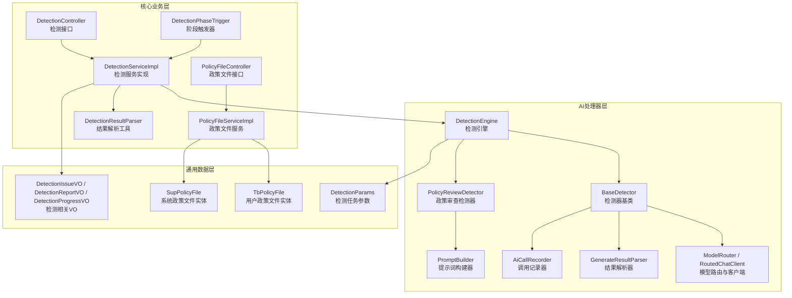
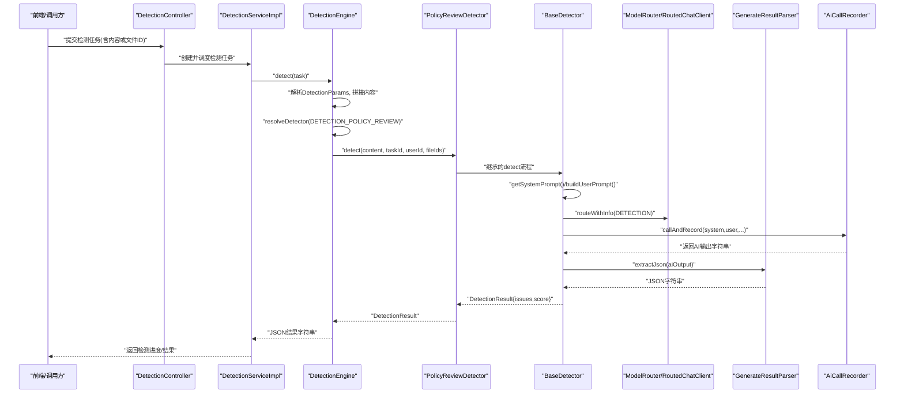
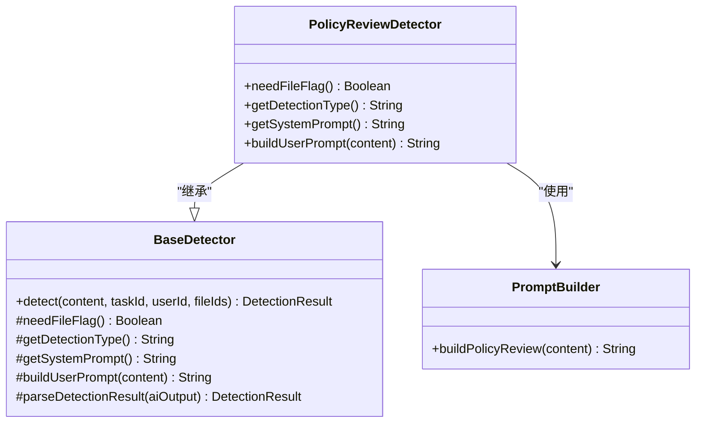
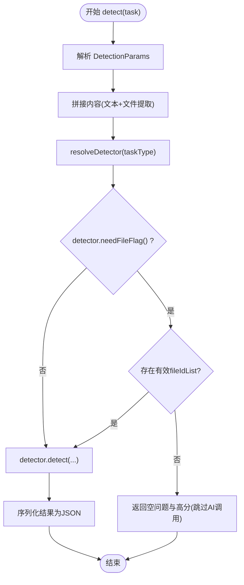
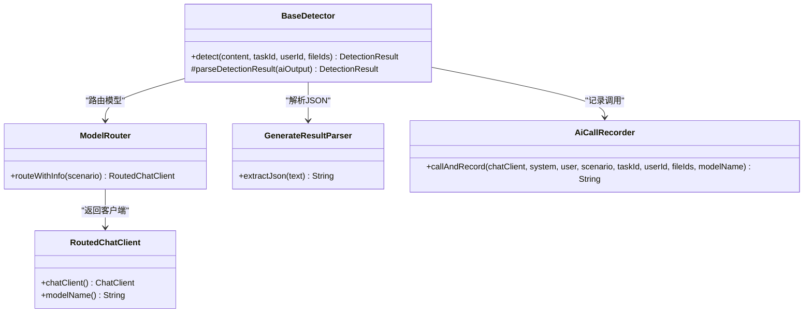
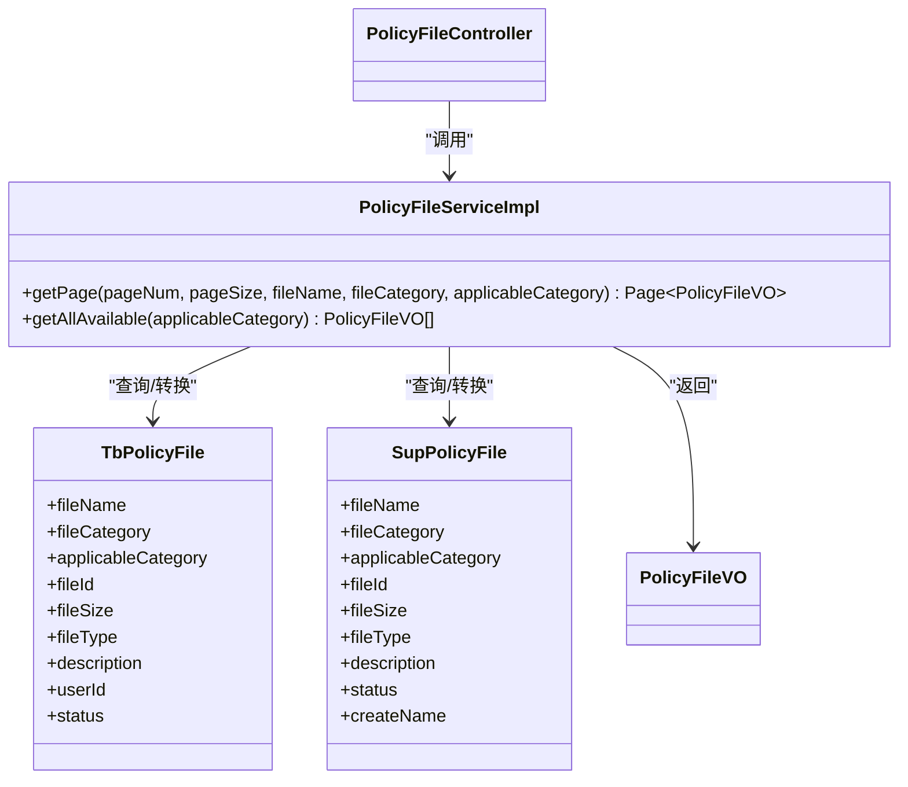
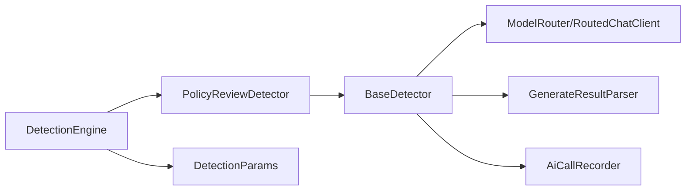

# 政策合规检测

<cite>
**本文引用的文件**   
- [PolicyReviewDetector.java](file://ele-ai-tender-system/ele-ai-tender-ai/src/main/java/com/jy/eleaitender/ai/processor/checker/PolicyReviewDetector.java)
- [DetectionEngine.java](file://ele-ai-tender-system/ele-ai-tender-ai/src/main/java/com/jy/eleaitender/ai/processor/checker/DetectionEngine.java)
- [BaseDetector.java](file://ele-ai-tender-system/ele-ai-tender-ai/src/main/java/com/jy/eleaitender/ai/processor/checker/BaseDetector.java)
- [PromptBuilder.java](file://ele-ai-tender-system/ele-ai-tender-ai/src/main/java/com/jy/eleaitender/ai/processor/prompt/PromptBuilder.java)
- [TbPolicyFile.java](file://ele-ai-tender-system/ele-ai-tender-common/src/main/java/com/jy/eleaitender/common/entity/core/TbPolicyFile.java)
- [SupPolicyFile.java](file://ele-ai-tender-system/ele-ai-tender-common/src/main/java/com/jy/eleaitender/common/entity/support/SupPolicyFile.java)
- [PolicyFileServiceImpl.java](file://ele-ai-tender-system/ele-ai-tender-core/src/main/java/com/jy/eleaitender/core/service/impl/PolicyFileServiceImpl.java)
- [IPolicyFileService.java](file://ele-ai-tender-system/ele-ai-tender-core/src/main/java/com/jy/eleaitender/core/service/IPolicyFileService.java)
- [PolicyFileController.java](file://ele-ai-tender-system/ele-ai-tender-core/src/main/java/com/jy/eleaitender/core/controller/PolicyFileController.java)
- [DetectionParams.java](file://ele-ai-tender-system/ele-ai-tender-common/src/main/java/com/jy/eleaitender/common/dto/ai/DetectionParams.java)
- [DetectionIssueVO.java](file://ele-ai-tender-system/ele-ai-tender-ai/src/main/java/com/jy/eleaitender/ai/dto/response/DetectionIssueVO.java)
- [DetectionReportVO.java](file://ele-ai-tender-system/ele-ai-tender-core/src/main/java/com/jy/eleaitender/core/dto/response/DetectionReportVO.java)
- [DetectionProgressVO.java](file://ele-ai-tender-system/ele-ai-tender-core/src/main/java/com/jy/eleaitender/core/dto/response/DetectionProgressVO.java)
- [DetectionController.java](file://ele-ai-tender-system/ele-ai-tender-core/src/main/java/com/jy/eleaitender/core/controller/DetectionController.java)
- [DetectionServiceImpl.java](file://ele-ai-tender-system/ele-ai-tender-core/src/main/java/com/jy/eleaitender/core/service/impl/DetectionServiceImpl.java)
- [IDetectionService.java](file://ele-ai-tender-system/ele-ai-tender-core/src/main/java/com/jy/eleaitender/core/service/IDetectionService.java)
- [DetectionPhaseTrigger.java](file://ele-ai-tender-system/ele-ai-tender-core/src/main/java/com/jy/eleaitender/core/statemachine/trigger/DetectionPhaseTrigger.java)
- [DetectionResultParser.java](file://ele-ai-tender-system/ele-ai-tender-core/src/main/java/com/jy/eleaitender/core/util/DetectionResultParser.java)
- [AiTaskProcessor.java](file://ele-ai-tender-system/ele-ai-tender-ai/src/main/java/com/jy/eleaitender/ai/processor/AiTaskProcessor.java)
- [ModelRouter.java](file://ele-ai-tender-system/ele-ai-tender-ai/src/main/java/com/jy/eleaitender/ai/processor/model/ModelRouter.java)
- [RoutedChatClient.java](file://ele-ai-tender-system/ele-ai-tender-ai/src/main/java/com/jy/eleaitender/ai/processor/model/RoutedChatClient.java)
- [GenerateResultParser.java](file://ele-ai-tender-system/ele-ai-tender-ai/src/main/java/com/jy/eleaitender/ai/processor/model/GenerateResultParser.java)
- [AiCallRecorder.java](file://ele-ai-tender-system/ele-ai-tender-ai/src/main/java/com/jy/eleaitender/ai/processor/recorder/AiCallRecorder.java)
- [SystemPromptTemplates.java](file://ele-ai-tender-system/ele-ai-tender-ai/src/main/java/com/jy/eleaitender/ai/processor/prompt/SystemPromptTemplates.java)
- [UserPromptTemplates.java](file://ele-ai-tender-system/ele-ai-tender-ai/src/main/java/com/jy/eleaitender/ai/processor/prompt/UserPromptTemplates.java)
</cite>

## 目录
1. [简介](#简介)
2. [项目结构](#项目结构)
3. [核心组件](#核心组件)
4. [架构总览](#架构总览)
5. [详细组件分析](#详细组件分析)
6. [依赖关系分析](#依赖关系分析)
7. [性能与可扩展性](#性能与可扩展性)
8. [故障排查指南](#故障排查指南)
9. [结论](#结论)
10. [附录](#附录)

## 简介
本文件面向“政策合规检测”能力，围绕 PolicyReviewDetector 的政策文件审查机制进行系统化说明。内容覆盖：
- 政策文件解析、条款匹配与合规性判断流程
- 政策知识图谱构建思路、语义相似度计算与冲突检测逻辑（概念设计）
- 政策版本管理、条款引用追踪与合规报告生成
- 多政策文件对比分析、优先级处理与冲突解决策略
- 规则配置、检测标准定制与评估优化建议

## 项目结构
本项目采用前后端分离与微服务化模块划分。与政策合规检测相关的关键代码位于 AI 处理器层、核心业务编排层以及通用实体与DTO层。

图表来源
- [DetectionEngine.java:1-126](file://ele-ai-tender-system/ele-ai-tender-ai/src/main/java/com/jy/eleaitender/ai/processor/checker/DetectionEngine.java#L1-L126)
- [BaseDetector.java:1-130](file://ele-ai-tender-system/ele-ai-tender-ai/src/main/java/com/jy/eleaitender/ai/processor/checker/BaseDetector.java#L1-L130)
- [PolicyReviewDetector.java:1-38](file://ele-ai-tender-system/ele-ai-tender-ai/src/main/java/com/jy/eleaitender/ai/processor/checker/PolicyReviewDetector.java#L1-L38)
- [PromptBuilder.java:1-173](file://ele-ai-tender-system/ele-ai-tender-ai/src/main/java/com/jy/eleaitender/ai/processor/prompt/PromptBuilder.java#L1-L173)
- [ModelRouter.java](file://ele-ai-tender-system/ele-ai-tender-ai/src/main/java/com/jy/eleaitender/ai/processor/model/ModelRouter.java)
- [RoutedChatClient.java](file://ele-ai-tender-system/ele-ai-tender-ai/src/main/java/com/jy/eleaitender/ai/processor/model/RoutedChatClient.java)
- [GenerateResultParser.java](file://ele-ai-tender-system/ele-ai-tender-ai/src/main/java/com/jy/eleaitender/ai/processor/model/GenerateResultParser.java)
- [AiCallRecorder.java](file://ele-ai-tender-system/ele-ai-tender-ai/src/main/java/com/jy/eleaitender/ai/processor/recorder/AiCallRecorder.java)
- [DetectionController.java](file://ele-ai-tender-system/ele-ai-tender-core/src/main/java/com/jy/eleaitender/core/controller/DetectionController.java)
- [DetectionServiceImpl.java](file://ele-ai-tender-system/ele-ai-tender-core/src/main/java/com/jy/eleaitender/core/service/impl/DetectionServiceImpl.java)
- [DetectionPhaseTrigger.java](file://ele-ai-tender-system/ele-ai-tender-core/src/main/java/com/jy/eleaitender/core/statemachine/trigger/DetectionPhaseTrigger.java)
- [DetectionResultParser.java](file://ele-ai-tender-system/ele-ai-tender-core/src/main/java/com/jy/eleaitender/core/util/DetectionResultParser.java)
- [PolicyFileServiceImpl.java:1-171](file://ele-ai-tender-system/ele-ai-tender-core/src/main/java/com/jy/eleaitender/core/service/impl/PolicyFileServiceImpl.java#L1-L171)
- [PolicyFileController.java](file://ele-ai-tender-system/ele-ai-tender-core/src/main/java/com/jy/eleaitender/core/controller/PolicyFileController.java)
- [TbPolicyFile.java:1-46](file://ele-ai-tender-system/ele-ai-tender-common/src/main/java/com/jy/eleaitender/common/entity/core/TbPolicyFile.java#L1-L46)
- [SupPolicyFile.java](file://ele-ai-tender-system/ele-ai-tender-common/src/main/java/com/jy/eleaitender/common/entity/support/SupPolicyFile.java)
- [DetectionParams.java:1-17](file://ele-ai-tender-system/ele-ai-tender-common/src/main/java/com/jy/eleaitender/common/dto/ai/DetectionParams.java#L1-L17)
- [DetectionIssueVO.java](file://ele-ai-tender-system/ele-ai-tender-ai/src/main/java/com/jy/eleaitender/ai/dto/response/DetectionIssueVO.java)
- [DetectionReportVO.java](file://ele-ai-tender-system/ele-ai-tender-core/src/main/java/com/jy/eleaitender/core/dto/response/DetectionReportVO.java)
- [DetectionProgressVO.java](file://ele-ai-tender-system/ele-ai-tender-core/src/main/java/com/jy/eleaitender/core/dto/response/DetectionProgressVO.java)

章节来源
- [DetectionEngine.java:1-126](file://ele-ai-tender-system/ele-ai-tender-ai/src/main/java/com/jy/eleaitender/ai/processor/checker/DetectionEngine.java#L1-L126)
- [PolicyReviewDetector.java:1-38](file://ele-ai-tender-system/ele-ai-tender-ai/src/main/java/com/jy/eleaitender/ai/processor/checker/PolicyReviewDetector.java#L1-L38)
- [BaseDetector.java:1-130](file://ele-ai-tender-system/ele-ai-tender-ai/src/main/java/com/jy/eleaitender/ai/processor/checker/BaseDetector.java#L1-L130)
- [PromptBuilder.java:1-173](file://ele-ai-tender-system/ele-ai-tender-ai/src/main/java/com/jy/eleaitender/ai/processor/prompt/PromptBuilder.java#L1-L173)
- [PolicyFileServiceImpl.java:1-171](file://ele-ai-tender-system/ele-ai-tender-core/src/main/java/com/jy/eleaitender/core/service/impl/PolicyFileServiceImpl.java#L1-L171)
- [TbPolicyFile.java:1-46](file://ele-ai-tender-system/ele-ai-tender-common/src/main/java/com/jy/eleaitender/common/entity/core/TbPolicyFile.java#L1-L46)
- [SupPolicyFile.java](file://ele-ai-tender-system/ele-ai-tender-common/src/main/java/com/jy/eleaitender/common/entity/support/SupPolicyFile.java)
- [DetectionParams.java:1-17](file://ele-ai-tender-system/ele-ai-tender-common/src/main/java/com/jy/eleaitender/common/dto/ai/DetectionParams.java#L1-L17)

## 核心组件
- 检测引擎 DetectionEngine：根据任务类型分发到具体检测器；聚合文本内容与文件内容；对未选择政策文件的场景做短路返回；统一序列化检测结果。
- 检测器基类 BaseDetector：封装模型路由、提示词组装、AI调用记录、JSON结果解析与错误兜底；定义检测器抽象方法。
- 政策审查检测器 PolicyReviewDetector：声明需要文件标志、检测类型、系统提示模板与用户提示构建方法。
- 提示词构建 PromptBuilder：提供 buildPolicyReview 等方法，将待检测内容注入到用户提示模板中。
- 政策文件服务 PolicyFileServiceImpl：合并系统级与用户级政策文件，支持按适用类别过滤与分页查询。
- 检测服务与控制器：DetectionController、DetectionServiceImpl、DetectionPhaseTrigger 负责检测任务的创建、执行与状态推进。
- 数据实体与DTO：TbPolicyFile、SupPolicyFile、DetectionParams、DetectionIssueVO、DetectionReportVO、DetectionProgressVO 等。

章节来源
- [DetectionEngine.java:1-126](file://ele-ai-tender-system/ele-ai-tender-ai/src/main/java/com/jy/eleaitender/ai/processor/checker/DetectionEngine.java#L1-L126)
- [BaseDetector.java:1-130](file://ele-ai-tender-system/ele-ai-tender-ai/src/main/java/com/jy/eleaitender/ai/processor/checker/BaseDetector.java#L1-L130)
- [PolicyReviewDetector.java:1-38](file://ele-ai-tender-system/ele-ai-tender-ai/src/main/java/com/jy/eleaitender/ai/processor/checker/PolicyReviewDetector.java#L1-L38)
- [PromptBuilder.java:1-173](file://ele-ai-tender-system/ele-ai-tender-ai/src/main/java/com/jy/eleaitender/ai/processor/prompt/PromptBuilder.java#L1-L173)
- [PolicyFileServiceImpl.java:1-171](file://ele-ai-tender-system/ele-ai-tender-core/src/main/java/com/jy/eleaitender/core/service/impl/PolicyFileServiceImpl.java#L1-L171)
- [DetectionController.java](file://ele-ai-tender-system/ele-ai-tender-core/src/main/java/com/jy/eleaitender/core/controller/DetectionController.java)
- [DetectionServiceImpl.java](file://ele-ai-tender-system/ele-ai-tender-core/src/main/java/com/jy/eleaitender/core/service/impl/DetectionServiceImpl.java)
- [DetectionPhaseTrigger.java](file://ele-ai-tender-system/ele-ai-tender-core/src/main/java/com/jy/eleaitender/core/statemachine/trigger/DetectionPhaseTrigger.java)
- [TbPolicyFile.java:1-46](file://ele-ai-tender-system/ele-ai-tender-common/src/main/java/com/jy/eleaitender/common/entity/core/TbPolicyFile.java#L1-L46)
- [SupPolicyFile.java](file://ele-ai-tender-system/ele-ai-tender-common/src/main/java/com/jy/eleaitender/common/entity/support/SupPolicyFile.java)
- [DetectionParams.java:1-17](file://ele-ai-tender-system/ele-ai-tender-common/src/main/java/com/jy/eleaitender/common/dto/ai/DetectionParams.java#L1-L17)
- [DetectionIssueVO.java](file://ele-ai-tender-system/ele-ai-tender-ai/src/main/java/com/jy/eleaitender/ai/dto/response/DetectionIssueVO.java)
- [DetectionReportVO.java](file://ele-ai-tender-system/ele-ai-tender-core/src/main/java/com/jy/eleaitender/core/dto/response/DetectionReportVO.java)
- [DetectionProgressVO.java](file://ele-ai-tender-system/ele-ai-tender-core/src/main/java/com/jy/eleaitender/core/dto/response/DetectionProgressVO.java)

## 架构总览
下图展示从前端发起检测请求到AI侧完成政策审查的端到端流程，包括任务分发、提示词构建、模型调用与结果解析。

图表来源
- [DetectionController.java](file://ele-ai-tender-system/ele-ai-tender-core/src/main/java/com/jy/eleaitender/core/controller/DetectionController.java)
- [DetectionServiceImpl.java](file://ele-ai-tender-system/ele-ai-tender-core/src/main/java/com/jy/eleaitender/core/service/impl/DetectionServiceImpl.java)
- [DetectionEngine.java:1-126](file://ele-ai-tender-system/ele-ai-tender-ai/src/main/java/com/jy/eleaitender/ai/processor/checker/DetectionEngine.java#L1-L126)
- [PolicyReviewDetector.java:1-38](file://ele-ai-tender-system/ele-ai-tender-ai/src/main/java/com/jy/eleaitender/ai/processor/checker/PolicyReviewDetector.java#L1-L38)
- [BaseDetector.java:1-130](file://ele-ai-tender-system/ele-ai-tender-ai/src/main/java/com/jy/eleaitender/ai/processor/checker/BaseDetector.java#L1-L130)
- [ModelRouter.java](file://ele-ai-tender-system/ele-ai-tender-ai/src/main/java/com/jy/eleaitender/ai/processor/model/ModelRouter.java)
- [RoutedChatClient.java](file://ele-ai-tender-system/ele-ai-tender-ai/src/main/java/com/jy/eleaitender/ai/processor/model/RoutedChatClient.java)
- [GenerateResultParser.java](file://ele-ai-tender-system/ele-ai-tender-ai/src/main/java/com/jy/eleaitender/ai/processor/model/GenerateResultParser.java)
- [AiCallRecorder.java](file://ele-ai-tender-system/ele-ai-tender-ai/src/main/java/com/jy/eleaitender/ai/processor/recorder/AiCallRecorder.java)

## 详细组件分析

### 政策审查检测器 PolicyReviewDetector
- 职责：声明政策审查的检测类型、是否需要文件标志、系统提示模板与用户提示构建方法。
- 关键点：
  - needFileFlag() 返回 true，表示该检测器在引擎中会读取任务中的文件ID列表。
  - getDetectionType() 返回 POLICY_REVIEW 对应编码。
  - getSystemPrompt() 使用 SystemPromptTemplates.DETECTION_POLICY_REVIEW。
  - buildUserPrompt(content) 通过 PromptBuilder.buildPolicyReview 注入待检测内容。

图表来源
- [PolicyReviewDetector.java:1-38](file://ele-ai-tender-system/ele-ai-tender-ai/src/main/java/com/jy/eleaitender/ai/processor/checker/PolicyReviewDetector.java#L1-L38)
- [BaseDetector.java:1-130](file://ele-ai-tender-system/ele-ai-tender-ai/src/main/java/com/jy/eleaitender/ai/processor/checker/BaseDetector.java#L1-L130)
- [PromptBuilder.java:1-173](file://ele-ai-tender-system/ele-ai-tender-ai/src/main/java/com/jy/eleaitender/ai/processor/prompt/PromptBuilder.java#L1-L173)

章节来源
- [PolicyReviewDetector.java:1-38](file://ele-ai-tender-system/ele-ai-tender-ai/src/main/java/com/jy/eleaitender/ai/processor/checker/PolicyReviewDetector.java#L1-L38)
- [PromptBuilder.java:1-173](file://ele-ai-tender-system/ele-ai-tender-ai/src/main/java/com/jy/eleaitender/ai/processor/prompt/PromptBuilder.java#L1-L173)

### 检测引擎 DetectionEngine
- 职责：根据任务类型选择检测器；聚合文本与文件内容；对未选择政策文件的场景短路返回；统一序列化为 JSON。
- 关键流程：
  - 解析 DetectionParams，优先取 content，其次提取 contentFileId 对应的内容。
  - resolveDetector 将 DETECTION_POLICY_REVIEW 映射到 policyReviewDetector。
  - 当需要文件且未传入有效 fileIdList 时，直接返回高分（100）的空结果。
  - 调用 detector.detect(...) 并将结果序列化为 {"issues":[],"score":...}。

图表来源
- [DetectionEngine.java:1-126](file://ele-ai-tender-system/ele-ai-tender-ai/src/main/java/com/jy/eleaitender/ai/processor/checker/DetectionEngine.java#L1-L126)
- [DetectionParams.java:1-17](file://ele-ai-tender-system/ele-ai-tender-common/src/main/java/com/jy/eleaitender/common/dto/ai/DetectionParams.java#L1-L17)

章节来源
- [DetectionEngine.java:1-126](file://ele-ai-tender-system/ele-ai-tender-ai/src/main/java/com/jy/eleaitender/ai/processor/checker/DetectionEngine.java#L1-L126)
- [DetectionParams.java:1-17](file://ele-ai-tender-system/ele-ai-tender-common/src/main/java/com/jy/eleaitender/common/dto/ai/DetectionParams.java#L1-L17)

### 检测器基类 BaseDetector
- 职责：统一模型路由、提示词组装、AI调用记录、结果解析与异常兜底。
- 关键点：
  - detect(...) 内部调用 modelRouter.routeWithInfo(AiUsageScenario.DETECTION)，并通过 AiCallRecorder.callAndRecord 记录调用上下文。
  - parseDetectionResult 使用 GenerateResultParser.extractJson 抽取JSON，再反序列化为 DetectionIssueVO 列表与评分。
  - 异常情况下返回空问题列表与低分，并附带错误信息。

图表来源
- [BaseDetector.java:1-130](file://ele-ai-tender-system/ele-ai-tender-ai/src/main/java/com/jy/eleaitender/ai/processor/checker/BaseDetector.java#L1-L130)
- [ModelRouter.java](file://ele-ai-tender-system/ele-ai-tender-ai/src/main/java/com/jy/eleaitender/ai/processor/model/ModelRouter.java)
- [RoutedChatClient.java](file://ele-ai-tender-system/ele-ai-tender-ai/src/main/java/com/jy/eleaitender/ai/processor/model/RoutedChatClient.java)
- [GenerateResultParser.java](file://ele-ai-tender-system/ele-ai-tender-ai/src/main/java/com/jy/eleaitender/ai/processor/model/GenerateResultParser.java)
- [AiCallRecorder.java](file://ele-ai-tender-system/ele-ai-tender-ai/src/main/java/com/jy/eleaitender/ai/processor/recorder/AiCallRecorder.java)

章节来源
- [BaseDetector.java:1-130](file://ele-ai-tender-system/ele-ai-tender-ai/src/main/java/com/jy/eleaitender/ai/processor/checker/BaseDetector.java#L1-L130)

### 政策文件管理与筛选
- 实体：
  - TbPolicyFile：用户级政策文件，包含分类、适用项目类别、关联文件ID、大小、格式、描述、状态等。
  - SupPolicyFile：系统级政策文件，结构与用户级类似。
- 服务：
  - PolicyFileServiceImpl.getAllAvailable(applicableCategory) 合并系统级与用户级启用文件，并按适用类别过滤。
  - getPage 支持按文件名、分类、适用类别分页查询。
- 控制层：
  - PolicyFileController 暴露政策文件查询与管理接口。

图表来源
- [TbPolicyFile.java:1-46](file://ele-ai-tender-system/ele-ai-tender-common/src/main/java/com/jy/eleaitender/common/entity/core/TbPolicyFile.java#L1-L46)
- [SupPolicyFile.java](file://ele-ai-tender-system/ele-ai-tender-common/src/main/java/com/jy/eleaitender/common/entity/support/SupPolicyFile.java)
- [PolicyFileServiceImpl.java:1-171](file://ele-ai-tender-system/ele-ai-tender-core/src/main/java/com/jy/eleaitender/core/service/impl/PolicyFileServiceImpl.java#L1-L171)
- [PolicyFileController.java](file://ele-ai-tender-system/ele-ai-tender-core/src/main/java/com/jy/eleaitender/core/controller/PolicyFileController.java)
- [PolicyFileVO.java:1-51](file://ele-ai-tender-system/ele-ai-tender-core/src/main/java/com/jy/eleaitender/core/dto/response/PolicyFileVO.java#L1-L51)

章节来源
- [TbPolicyFile.java:1-46](file://ele-ai-tender-system/ele-ai-tender-common/src/main/java/com/jy/eleaitender/common/entity/core/TbPolicyFile.java#L1-L46)
- [SupPolicyFile.java](file://ele-ai-tender-system/ele-ai-tender-common/src/main/java/com/jy/eleaitender/common/entity/support/SupPolicyFile.java)
- [PolicyFileServiceImpl.java:1-171](file://ele-ai-tender-system/ele-ai-tender-core/src/main/java/com/jy/eleaitender/core/service/impl/PolicyFileServiceImpl.java#L1-L171)
- [PolicyFileController.java](file://ele-ai-tender-system/ele-ai-tender-core/src/main/java/com/jy/eleaitender/core/controller/PolicyFileController.java)
- [PolicyFileVO.java:1-51](file://ele-ai-tender-system/ele-ai-tender-core/src/main/java/com/jy/eleaitender/core/dto/response/PolicyFileVO.java#L1-L51)

### 检测任务与结果对象
- 检测任务参数：DetectionParams 支持 content 与 contentFileId 二选一。
- 检测结果项：DetectionIssueVO 用于承载每个问题条目，由 BaseDetector 自动设置 detectionType。
- 报告与进度：DetectionReportVO、DetectionProgressVO 用于对外呈现汇总信息与进度。

章节来源
- [DetectionParams.java:1-17](file://ele-ai-tender-system/ele-ai-tender-common/src/main/java/com/jy/eleaitender/common/dto/ai/DetectionParams.java#L1-L17)
- [DetectionIssueVO.java](file://ele-ai-tender-system/ele-ai-tender-ai/src/main/java/com/jy/eleaitender/ai/dto/response/DetectionIssueVO.java)
- [DetectionReportVO.java](file://ele-ai-tender-system/ele-ai-tender-core/src/main/java/com/jy/eleaitender/core/dto/response/DetectionReportVO.java)
- [DetectionProgressVO.java](file://ele-ai-tender-system/ele-ai-tender-core/src/main/java/com/jy/eleaitender/core/dto/response/DetectionProgressVO.java)

## 依赖关系分析
- 组件耦合：
  - DetectionEngine 依赖多个检测器与结果解析器，承担编排职责。
  - BaseDetector 依赖模型路由、结果解析与调用记录，屏蔽外部差异。
  - PolicyReviewDetector 仅关注策略配置（提示词模板），保持高内聚。
- 外部依赖：
  - 模型路由与客户端：ModelRouter、RoutedChatClient。
  - 结果解析：GenerateResultParser。
  - 调用记录：AiCallRecorder。
- 潜在循环依赖：当前未见循环导入；检测器与引擎为单向依赖。

图表来源
- [DetectionEngine.java:1-126](file://ele-ai-tender-system/ele-ai-tender-ai/src/main/java/com/jy/eleaitender/ai/processor/checker/DetectionEngine.java#L1-L126)
- [PolicyReviewDetector.java:1-38](file://ele-ai-tender-system/ele-ai-tender-ai/src/main/java/com/jy/eleaitender/ai/processor/checker/PolicyReviewDetector.java#L1-L38)
- [BaseDetector.java:1-130](file://ele-ai-tender-system/ele-ai-tender-ai/src/main/java/com/jy/eleaitender/ai/processor/checker/BaseDetector.java#L1-L130)
- [DetectionParams.java:1-17](file://ele-ai-tender-system/ele-ai-tender-common/src/main/java/com/jy/eleaitender/common/dto/ai/DetectionParams.java#L1-L17)

章节来源
- [DetectionEngine.java:1-126](file://ele-ai-tender-system/ele-ai-tender-ai/src/main/java/com/jy/eleaitender/ai/processor/checker/DetectionEngine.java#L1-L126)
- [BaseDetector.java:1-130](file://ele-ai-tender-system/ele-ai-tender-ai/src/main/java/com/jy/eleaitender/ai/processor/checker/BaseDetector.java#L1-L130)
- [PolicyReviewDetector.java:1-38](file://ele-ai-tender-system/ele-ai-tender-ai/src/main/java/com/jy/eleaitender/ai/processor/checker/PolicyReviewDetector.java#L1-L38)
- [DetectionParams.java:1-17](file://ele-ai-tender-system/ele-ai-tender-common/src/main/java/com/jy/eleaitender/common/dto/ai/DetectionParams.java#L1-L17)

## 性能与可扩展性
- 提示词长度控制：避免一次性注入过大政策全文，建议按需切片或摘要后再送入模型。
- 并发与线程池：结合动态线程池与用户并发管理器，限制同批检测任务数，防止模型限流。
- 缓存与复用：对常用政策片段建立向量索引或缓存，减少重复解析与网络开销。
- 结果解析容错：对非标准JSON输出增加修复重试与降级策略。
- 扩展新检测器：新增检测器仅需实现 BaseDetector 抽象方法，并在引擎中注册映射。

[本节为通用指导，不直接分析具体文件]

## 故障排查指南
- 未选择政策文件导致跳过：
  - 现象：返回空问题与高分，无AI调用日志。
  - 定位：检查 DetectionEngine 中对 fileIdList 的判断分支。
- AI输出无法解析：
  - 现象：issues为空，score=0，error包含解析失败信息。
  - 定位：查看 BaseDetector.parseDetectionResult 的异常分支与 GenerateResultParser 行为。
- 模型路由失败：
  - 现象：调用记录缺失或报错。
  - 定位：检查 ModelRouter.routeWithInfo 与 RoutedChatClient.chatClient 初始化。
- 政策文件不可用：
  - 现象：获取不到可用政策文件。
  - 定位：确认 PolicyFileServiceImpl 的过滤条件与状态字段。

章节来源
- [DetectionEngine.java:1-126](file://ele-ai-tender-system/ele-ai-tender-ai/src/main/java/com/jy/eleaitender/ai/processor/checker/DetectionEngine.java#L1-L126)
- [BaseDetector.java:1-130](file://ele-ai-tender-system/ele-ai-tender-ai/src/main/java/com/jy/eleaitender/ai/processor/checker/BaseDetector.java#L1-L130)
- [PolicyFileServiceImpl.java:1-171](file://ele-ai-tender-system/ele-ai-tender-core/src/main/java/com/jy/eleaitender/core/service/impl/PolicyFileServiceImpl.java#L1-L171)

## 结论
PolicyReviewDetector 基于统一的检测器框架，通过提示词工程与模型路由实现政策合规检测。当前实现以“内容+政策文件ID列表”作为输入，由引擎在缺少政策文件时短路返回。后续可在提示词层引入更丰富的政策上下文（如知识图谱、相似度与冲突检测），并结合版本管理与引用追踪提升可解释性与可维护性。

[本节为总结性内容，不直接分析具体文件]

## 附录

### 政策知识图谱构建（概念设计）
- 目标：将政策条款结构化为主题-约束-例外三元组，形成可检索的知识图谱。
- 步骤：
  - 条款抽取：从政策文档中识别主体、义务、禁止、许可等要素。
  - 关系建模：建立“条款-子条款-附件-引用”的关系边。
  - 向量化：对条款文本进行嵌入，便于语义检索与相似度计算。
- 存储：图数据库或关系型表+向量索引混合存储。

[本节为概念设计，不直接分析具体文件]

### 语义相似度计算（概念设计）
- 方案：使用句子级嵌入模型计算招标条款与政策条款的余弦相似度。
- 阈值策略：设定不同严重等级的相似度阈值，辅助判定是否命中。
- 回退策略：当向量检索不可用时，回退至关键词匹配或LLM二次校验。

[本节为概念设计，不直接分析具体文件]

### 冲突检测逻辑（概念设计）
- 冲突类型：互斥约束（A且B）、优先级冲突（旧规与新规）、范围冲突（适用范围重叠）。
- 算法：
  - 基于规则的冲突矩阵与优先级表。
  - 基于语义相似度的近似冲突发现。
  - 人工复核入口与变更记录。

[本节为概念设计，不直接分析具体文件]

### 政策版本管理与条款引用追踪（概念设计）
- 版本策略：主版本号+次版本号+修订号，保留历史快照。
- 引用追踪：在条款元数据中标注被哪些招标文件引用，支持影响面分析。
- 变更审计：记录增删改操作与原因，支持回溯。

[本节为概念设计，不直接分析具体文件]

### 多政策文件对比分析与优先级处理（概念设计）
- 对比维度：主题覆盖度、约束强度、适用范围。
- 优先级：国家法规 > 行业规范 > 企业内部制度；新版本 > 旧版本。
- 冲突解决：以更高优先级为准，必要时给出替代方案与建议。

[本节为概念设计，不直接分析具体文件]

### 合规报告生成（概念设计）
- 报告结构：概览、问题清单、风险等级、依据条款、整改建议、证据链接。
- 自动化：基于 DetectionIssueVO 列表与政策元数据自动生成。
- 导出：支持PDF/Word导出与在线预览。

[本节为概念设计，不直接分析具体文件]

### 规则配置与检测标准定制（概念设计）
- 规则库：以JSON/YAML形式定义规则、阈值、权重与适用类别。
- 动态加载：启动时加载规则，运行时热更新。
- 评测集：内置基准用例，持续回归验证。

[本节为概念设计，不直接分析具体文件]

### 合规性评估优化指南（概念设计）
- 指标体系：覆盖率、误报率、漏报率、平均响应时间。
- 优化方向：提示词迭代、检索增强、阈值调优、模型切换。
- 监控告警：调用耗时、错误率、资源占用监控。

[本节为概念设计，不直接分析具体文件]