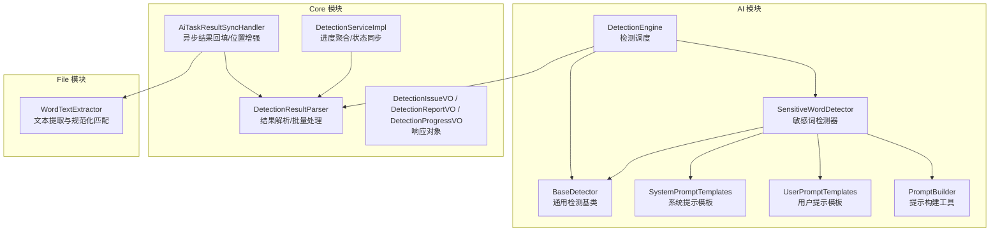
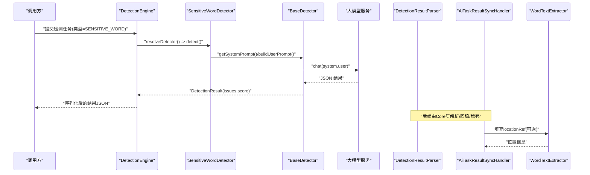
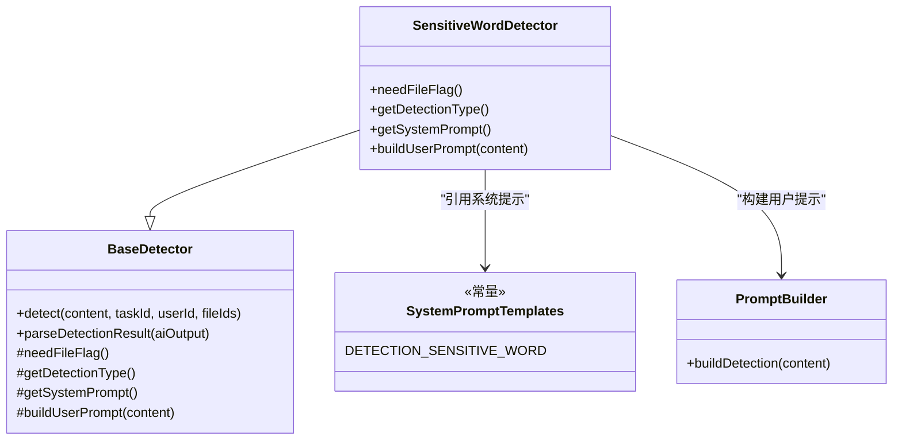
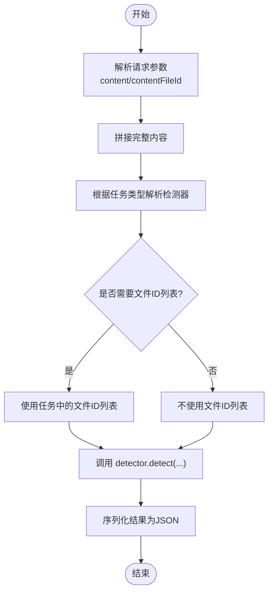
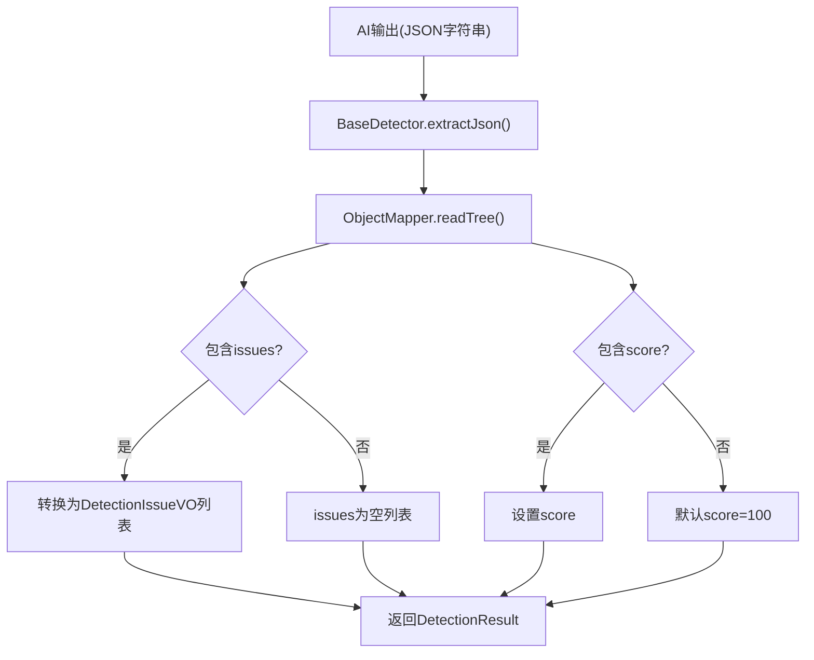
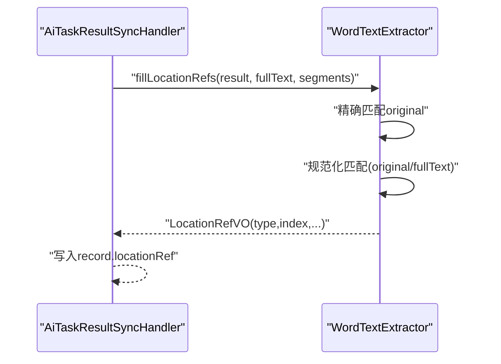
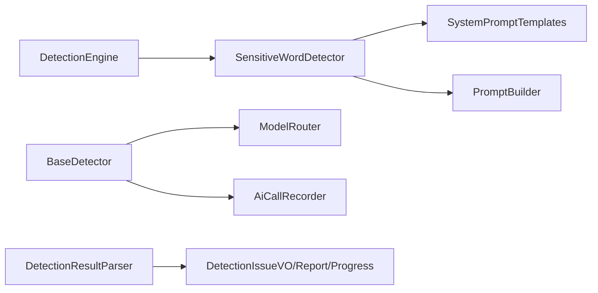

# 敏感词检测

<cite>
**本文引用的文件**   
- [SensitiveWordDetector.java](file://ele-ai-tender-system/ele-ai-tender-ai/src/main/java/com/jy/eleaitender/ai/processor/checker/SensitiveWordDetector.java)
- [BaseDetector.java](file://ele-ai-tender-system/ele-ai-tender-ai/src/main/java/com/jy/eleaitender/ai/processor/checker/BaseDetector.java)
- [DetectionEngine.java](file://ele-ai-tender-system/ele-ai-tender-ai/src/main/java/com/jy/eleaitender/ai/processor/checker/DetectionEngine.java)
- [SystemPromptTemplates.java](file://ele-ai-tender-system/ele-ai-tender-ai/src/main/java/com/jy/eleaitender/ai/processor/prompt/SystemPromptTemplates.java)
- [UserPromptTemplates.java](file://ele-ai-tender-system/ele-ai-tender-ai/src/main/java/com/jy/eleaitender/ai/processor/prompt/UserPromptTemplates.java)
- [PromptBuilder.java](file://ele-ai-tender-system/ele-ai-tender-ai/src/main/java/com/jy/eleaitender/ai/processor/prompt/PromptBuilder.java)
- [DetectionType.java](file://ele-ai-tender-system/ele-ai-tender-common/src/main/java/com/jy/eleaitender/common/enums/DetectionType.java)
- [DetectionIssueVO.java](file://ele-ai-tender-system/ele-ai-tender-core/src/main/java/com/jy/eleaitender/core/dto/response/DetectionIssueVO.java)
- [DetectionReportVO.java](file://ele-ai-tender-system/ele-ai-tender-core/src/main/java/com/jy/eleaitender/core/dto/response/DetectionReportVO.java)
- [DetectionProgressVO.java](file://ele-ai-tender-system/ele-ai-tender-core/src/main/java/com/jy/eleaitender/core/dto/response/DetectionProgressVO.java)
- [DetectionResultParser.java](file://ele-ai-tender-system/ele-ai-tender-core/src/main/java/com/jy/eleaitender/core/util/DetectionResultParser.java)
- [DetectionServiceImpl.java](file://ele-ai-tender-system/ele-ai-tender-core/src/main/java/com/jy/eleaitender/core/service/impl/DetectionServiceImpl.java)
- [AiTaskResultSyncHandler.java](file://ele-ai-tender-system/ele-ai-tender-core/src/main/java/com/jy/eleaitender/core/scheduler/AiTaskResultSyncHandler.java)
- [WordTextExtractor.java](file://ele-ai-tender-system/ele-ai-tender-file/src/main/java/com/jy/eleaitender/file/engine/WordTextExtractor.java)
</cite>

## 目录
1. [简介](#简介)
2. [项目结构](#项目结构)
3. [核心组件](#核心组件)
4. [架构总览](#架构总览)
5. [详细组件分析](#详细组件分析)
6. [依赖关系分析](#依赖关系分析)
7. [性能与内存优化](#性能与内存优化)
8. [故障排查指南](#故障排查指南)
9. [结论](#结论)
10. [附录](#附录)

## 简介
本文件面向“敏感词检测”能力，围绕 SensitiveWordDetector 的实现进行系统化说明。该检测器基于大模型提示工程完成对歧视性、限制性、排他性、倾向性等不当表述的识别，并通过统一的检测引擎调度、结果解析与持久化流程输出结构化报告。文档覆盖：
- 算法实现：以 Prompt 驱动的检测策略（非本地词库匹配）
- 分类体系与风险等级：issues 数组中的 severity 字段
- 检测结果格式化：统一 JSON 结构与 VO 映射
- 动态更新机制：通过 Prompt 模板与配置项调整检测规则
- 批量检测与进度聚合：任务级编排与结果汇总
- 位置定位增强：结合 Word 文本提取与规范化匹配注入 locationRef
- 自定义与调优：如何扩展规则、提升精度与稳定性

## 项目结构
敏感词检测相关代码分布在 AI 模块（检测执行）、Core 模块（结果解析与进度聚合）、File 模块（文本提取与位置定位）。

图示来源
- [DetectionEngine.java:45-125](file://ele-ai-tender-system/ele-ai-tender-ai/src/main/java/com/jy/eleaitender/ai/processor/checker/DetectionEngine.java#L45-L125)
- [BaseDetector.java:1-130](file://ele-ai-tender-system/ele-ai-tender-ai/src/main/java/com/jy/eleaitender/ai/processor/checker/BaseDetector.java#L1-L130)
- [SensitiveWordDetector.java:1-36](file://ele-ai-tender-system/ele-ai-tender-ai/src/main/java/com/jy/eleaitender/ai/processor/checker/SensitiveWordDetector.java#L1-L36)
- [SystemPromptTemplates.java:342-374](file://ele-ai-tender-system/ele-ai-tender-ai/src/main/java/com/jy/eleaitender/ai/processor/prompt/SystemPromptTemplates.java#L342-L374)
- [UserPromptTemplates.java:194-224](file://ele-ai-tender-system/ele-ai-tender-ai/src/main/java/com/jy/eleaitender/ai/processor/prompt/UserPromptTemplates.java#L194-L224)
- [PromptBuilder.java:139-172](file://ele-ai-tender-system/ele-ai-tender-ai/src/main/java/com/jy/eleaitender/ai/processor/prompt/PromptBuilder.java#L139-L172)
- [DetectionResultParser.java:1-64](file://ele-ai-tender-system/ele-ai-tender-core/src/main/java/com/jy/eleaitender/core/util/DetectionResultParser.java#L1-L64)
- [DetectionServiceImpl.java:157-191](file://ele-ai-tender-system/ele-ai-tender-core/src/main/java/com/jy/eleaitender/core/service/impl/DetectionServiceImpl.java#L157-L191)
- [AiTaskResultSyncHandler.java:610-639](file://ele-ai-tender-system/ele-ai-tender-core/src/main/java/com/jy/eleaitender/core/scheduler/AiTaskResultSyncHandler.java#L610-L639)
- [WordTextExtractor.java:110-150](file://ele-ai-tender-system/ele-ai-tender-file/src/main/java/com/jy/eleaitender/file/engine/WordTextExtractor.java#L110-L150)

章节来源
- [DetectionEngine.java:45-125](file://ele-ai-tender-system/ele-ai-tender-ai/src/main/java/com/jy/eleaitender/ai/processor/checker/DetectionEngine.java#L45-L125)
- [BaseDetector.java:1-130](file://ele-ai-tender-system/ele-ai-tender-ai/src/main/java/com/jy/eleaitender/ai/processor/checker/BaseDetector.java#L1-L130)
- [SensitiveWordDetector.java:1-36](file://ele-ai-tender-system/ele-ai-tender-ai/src/main/java/com/jy/eleaitender/ai/processor/checker/SensitiveWordDetector.java#L1-L36)
- [SystemPromptTemplates.java:342-374](file://ele-ai-tender-system/ele-ai-tender-ai/src/main/java/com/jy/eleaitender/ai/processor/prompt/SystemPromptTemplates.java#L342-L374)
- [UserPromptTemplates.java:194-224](file://ele-ai-tender-system/ele-ai-tender-ai/src/main/java/com/jy/eleaitender/ai/processor/prompt/UserPromptTemplates.java#L194-L224)
- [PromptBuilder.java:139-172](file://ele-ai-tender-system/ele-ai-tender-ai/src/main/java/com/jy/eleaitender/ai/processor/prompt/PromptBuilder.java#L139-L172)
- [DetectionResultParser.java:1-64](file://ele-ai-tender-system/ele-ai-tender-core/src/main/java/com/jy/eleaitender/core/util/DetectionResultParser.java#L1-L64)
- [DetectionServiceImpl.java:157-191](file://ele-ai-tender-system/ele-ai-tender-core/src/main/java/com/jy/eleaitender/core/service/impl/DetectionServiceImpl.java#L157-L191)
- [AiTaskResultSyncHandler.java:610-639](file://ele-ai-tender-system/ele-ai-tender-core/src/main/java/com/jy/eleaitender/core/scheduler/AiTaskResultSyncHandler.java#L610-L639)
- [WordTextExtractor.java:110-150](file://ele-ai-tender-system/ele-ai-tender-file/src/main/java/com/jy/eleaitender/file/engine/WordTextExtractor.java#L110-L150)

## 核心组件
- SensitiveWordDetector：定义敏感词检测的任务类型、系统提示与用户提示构造逻辑，不依赖本地词库，完全由大模型语义理解完成识别。
- BaseDetector：封装模型路由、调用记录、JSON 结果解析与错误兜底；为所有检测器提供统一执行骨架。
- DetectionEngine：根据任务类型分发到具体检测器，组装输入内容（文本或文件），序列化最终结果。
- SystemPromptTemplates / UserPromptTemplates / PromptBuilder：集中管理检测相关的提示模板与构建方法，便于规则与口径的统一维护。
- DetectionResultParser / DetectionServiceImpl / AiTaskResultSyncHandler：负责结果解析、进度聚合、状态同步与位置信息增强。
- WordTextExtractor：提供精确与规范化匹配，用于将问题定位到段落/表格等元素，生成 locationRef。

章节来源
- [SensitiveWordDetector.java:1-36](file://ele-ai-tender-system/ele-ai-tender-ai/src/main/java/com/jy/eleaitender/ai/processor/checker/SensitiveWordDetector.java#L1-L36)
- [BaseDetector.java:1-130](file://ele-ai-tender-system/ele-ai-tender-ai/src/main/java/com/jy/eleaitender/ai/processor/checker/BaseDetector.java#L1-L130)
- [DetectionEngine.java:45-125](file://ele-ai-tender-system/ele-ai-tender-ai/src/main/java/com/jy/eleaitender/ai/processor/checker/DetectionEngine.java#L45-L125)
- [SystemPromptTemplates.java:342-374](file://ele-ai-tender-system/ele-ai-tender-ai/src/main/java/com/jy/eleaitender/ai/processor/prompt/SystemPromptTemplates.java#L342-L374)
- [UserPromptTemplates.java:194-224](file://ele-ai-tender-system/ele-ai-tender-ai/src/main/java/com/jy/eleaitender/ai/processor/prompt/UserPromptTemplates.java#L194-L224)
- [PromptBuilder.java:139-172](file://ele-ai-tender-system/ele-ai-tender-ai/src/main/java/com/jy/eleaitender/ai/processor/prompt/PromptBuilder.java#L139-L172)
- [DetectionResultParser.java:1-64](file://ele-ai-tender-system/ele-ai-tender-core/src/main/java/com/jy/eleaitender/core/util/DetectionResultParser.java#L1-L64)
- [DetectionServiceImpl.java:157-191](file://ele-ai-tender-system/ele-ai-tender-core/src/main/java/com/jy/eleaitender/core/service/impl/DetectionServiceImpl.java#L157-L191)
- [AiTaskResultSyncHandler.java:610-639](file://ele-ai-tender-system/ele-ai-tender-core/src/main/java/com/jy/eleaitender/core/scheduler/AiTaskResultSyncHandler.java#L610-L639)
- [WordTextExtractor.java:110-150](file://ele-ai-tender-system/ele-ai-tender-file/src/main/java/com/jy/eleaitender/file/engine/WordTextExtractor.java#L110-L150)

## 架构总览
敏感词检测的整体流程如下：
- 任务进入 DetectionEngine，按类型选择 SensitiveWordDetector
- Detector 组合 SystemPrompt 与 UserPrompt，经模型路由与调用记录后返回 JSON
- BaseDetector 解析 JSON 为 DetectionIssueVO 列表与 score
- Core 层解析并持久化，必要时注入 locationRef，最后聚合进度与报告

图示来源
- [DetectionEngine.java:45-125](file://ele-ai-tender-system/ele-ai-tender-ai/src/main/java/com/jy/eleaitender/ai/processor/checker/DetectionEngine.java#L45-L125)
- [SensitiveWordDetector.java:1-36](file://ele-ai-tender-system/ele-ai-tender-ai/src/main/java/com/jy/eleaitender/ai/processor/checker/SensitiveWordDetector.java#L1-L36)
- [BaseDetector.java:47-66](file://ele-ai-tender-system/ele-ai-tender-ai/src/main/java/com/jy/eleaitender/ai/processor/checker/BaseDetector.java#L47-L66)
- [AiTaskResultSyncHandler.java:610-639](file://ele-ai-tender-system/ele-ai-tender-core/src/main/java/com/jy/eleaitender/core/scheduler/AiTaskResultSyncHandler.java#L610-L639)
- [WordTextExtractor.java:110-150](file://ele-ai-tender-system/ele-ai-tender-file/src/main/java/com/jy/eleaitender/file/engine/WordTextExtractor.java#L110-L150)

## 详细组件分析

### 敏感词检测器（SensitiveWordDetector）
- 职责：声明检测类型为 SENSITIVE_WORD，使用系统提示模板定义检测范围与评分规则，使用 PromptBuilder 构建用户提示。
- 关键点：
  - needFileFlag=false：不需要额外文件ID列表参与提示
  - getSystemPrompt：指向 DETECTION_SENSITIVE_WORD 模板，明确四类不当表述与 JSON 输出格式
  - buildUserPrompt：复用通用检测用户提示模板，传入待检测内容

图示来源
- [SensitiveWordDetector.java:1-36](file://ele-ai-tender-system/ele-ai-tender-ai/src/main/java/com/jy/eleaitender/ai/processor/checker/SensitiveWordDetector.java#L1-L36)
- [BaseDetector.java:1-130](file://ele-ai-tender-system/ele-ai-tender-ai/src/main/java/com/jy/eleaitender/ai/processor/checker/BaseDetector.java#L1-L130)
- [SystemPromptTemplates.java:342-374](file://ele-ai-tender-system/ele-ai-tender-ai/src/main/java/com/jy/eleaitender/ai/processor/prompt/SystemPromptTemplates.java#L342-L374)
- [PromptBuilder.java:139-172](file://ele-ai-tender-system/ele-ai-tender-ai/src/main/java/com/jy/eleaitender/ai/processor/prompt/PromptBuilder.java#L139-L172)

章节来源
- [SensitiveWordDetector.java:1-36](file://ele-ai-tender-system/ele-ai-tender-ai/src/main/java/com/jy/eleaitender/ai/processor/checker/SensitiveWordDetector.java#L1-L36)
- [SystemPromptTemplates.java:342-374](file://ele-ai-tender-system/ele-ai-tender-ai/src/main/java/com/jy/eleaitender/ai/processor/prompt/SystemPromptTemplates.java#L342-L374)
- [PromptBuilder.java:139-172](file://ele-ai-tender-system/ele-ai-tender-ai/src/main/java/com/jy/eleaitender/ai/processor/prompt/PromptBuilder.java#L139-L172)

### 检测引擎与调度（DetectionEngine）
- 职责：根据任务类型选择检测器，拼接输入内容（文本或文件），调用检测器并序列化结果。
- 关键点：
  - 支持从请求参数中读取 content 与 contentFileId，合并为完整上下文
  - 针对政策审查做特殊跳过逻辑（不适用于敏感词检测）
  - 统一将 DetectionResult 序列化为 {"issues":[],"score":N} 的 JSON

图示来源
- [DetectionEngine.java:45-125](file://ele-ai-tender-system/ele-ai-tender-ai/src/main/java/com/jy/eleaitender/ai/processor/checker/DetectionEngine.java#L45-L125)

章节来源
- [DetectionEngine.java:45-125](file://ele-ai-tender-system/ele-ai-tender-ai/src/main/java/com/jy/eleaitender/ai/processor/checker/DetectionEngine.java#L45-L125)

### 结果解析与进度聚合（BaseDetector / DetectionResultParser / DetectionServiceImpl）
- BaseDetector.parseDetectionResult：从大模型输出中提取 JSON，映射为 issues 列表与 score，异常时返回空结果与错误信息。
- DetectionResultParser：提供 parseIssues、acceptAllIssues 等工具方法，用于批量接受建议、统计问题数与得分。
- DetectionServiceImpl：聚合各检测项进度，计算总体状态与总分。

图示来源
- [BaseDetector.java:88-118](file://ele-ai-tender-system/ele-ai-tender-ai/src/main/java/com/jy/eleaitender/ai/processor/checker/BaseDetector.java#L88-L118)
- [DetectionResultParser.java:1-64](file://ele-ai-tender-system/ele-ai-tender-core/src/main/java/com/jy/eleaitender/core/util/DetectionResultParser.java#L1-L64)
- [DetectionServiceImpl.java:157-191](file://ele-ai-tender-system/ele-ai-tender-core/src/main/java/com/jy/eleaitender/core/service/impl/DetectionServiceImpl.java#L157-L191)

章节来源
- [BaseDetector.java:88-118](file://ele-ai-tender-system/ele-ai-tender-ai/src/main/java/com/jy/eleaitender/ai/processor/checker/BaseDetector.java#L88-L118)
- [DetectionResultParser.java:1-64](file://ele-ai-tender-system/ele-ai-tender-core/src/main/java/com/jy/eleaitender/core/util/DetectionResultParser.java#L1-L64)
- [DetectionServiceImpl.java:157-191](file://ele-ai-tender-system/ele-ai-tender-core/src/main/java/com/jy/eleaitender/core/service/impl/DetectionServiceImpl.java#L157-L191)

### 位置定位增强（AiTaskResultSyncHandler + WordTextExtractor）
- 在任务结果同步阶段，若存在 segments 与 fullText，则尝试将问题定位到段落/表格等元素，生成 locationRef。
- WordTextExtractor 提供两级匹配：精确匹配与规范化匹配，再二分查找对应 segment，返回位置引用。

图示来源
- [AiTaskResultSyncHandler.java:610-639](file://ele-ai-tender-system/ele-ai-tender-core/src/main/java/com/jy/eleaitender/core/scheduler/AiTaskResultSyncHandler.java#L610-L639)
- [WordTextExtractor.java:110-150](file://ele-ai-tender-system/ele-ai-tender-file/src/main/java/com/jy/eleaitender/file/engine/WordTextExtractor.java#L110-L150)

章节来源
- [AiTaskResultSyncHandler.java:610-639](file://ele-ai-tender-system/ele-ai-tender-core/src/main/java/com/jy/eleaitender/core/scheduler/AiTaskResultSyncHandler.java#L610-L639)
- [WordTextExtractor.java:110-150](file://ele-ai-tender-system/ele-ai-tender-file/src/main/java/com/jy/eleaitender/file/engine/WordTextExtractor.java#L110-L150)

### 敏感词分类体系与风险等级
- 分类体系：依据系统提示模板，聚焦四类不当表述——歧视性、限制性、排他性、倾向性。
- 风险等级：issues 中的 severity 字段，取值 HIGH/MEDIUM/LOW，配合评分规则扣减分数。
- 评分规则：在系统提示中定义不同严重等级的扣分权重，最终 score 反映整体合规度。

章节来源
- [SystemPromptTemplates.java:342-374](file://ele-ai-tender-system/ele-ai-tender-ai/src/main/java/com/jy/eleaitender/ai/processor/prompt/SystemPromptTemplates.java#L342-L374)
- [DetectionIssueVO.java:1-55](file://ele-ai-tender-system/ele-ai-tender-core/src/main/java/com/jy/eleaitender/core/dto/response/DetectionIssueVO.java#L1-L55)

### 检测结果格式化与报告
- 内部结构：DetectionResult 包含 issues 列表与 score，DetectionEngine 将其序列化为 JSON。
- 对外 VO：DetectionIssueVO 描述单条问题；DetectionReportVO 汇总项目维度报告；DetectionProgressVO 展示逐项进度。
- 解析工具：DetectionResultParser 提供 parseIssues、parseScore、acceptAllIssues 等方法，支撑前端交互与批量操作。

章节来源
- [DetectionEngine.java:114-125](file://ele-ai-tender-system/ele-ai-tender-ai/src/main/java/com/jy/eleaitender/ai/processor/checker/DetectionEngine.java#L114-L125)
- [DetectionIssueVO.java:1-55](file://ele-ai-tender-system/ele-ai-tender-core/src/main/java/com/jy/eleaitender/core/dto/response/DetectionIssueVO.java#L1-L55)
- [DetectionReportVO.java:1-36](file://ele-ai-tender-system/ele-ai-tender-core/src/main/java/com/jy/eleaitender/core/dto/response/DetectionReportVO.java#L1-L36)
- [DetectionProgressVO.java:1-44](file://ele-ai-tender-system/ele-ai-tender-core/src/main/java/com/jy/eleaitender/core/dto/response/DetectionProgressVO.java#L1-L44)
- [DetectionResultParser.java:1-64](file://ele-ai-tender-system/ele-ai-tender-core/src/main/java/com/jy/eleaitender/core/util/DetectionResultParser.java#L1-L64)

## 依赖关系分析
- 检测器与模板：SensitiveWordDetector 依赖 SystemPromptTemplates 与 PromptBuilder，确保规则与口径可配置。
- 引擎与检测器：DetectionEngine 通过任务类型分发到具体检测器，形成松耦合扩展点。
- 结果链路：BaseDetector 解析 JSON 为 VO，Core 层进一步聚合与持久化。
- 外部依赖：模型路由与调用记录由 BaseDetector 注入，保证可观测性与可追溯性。

图示来源
- [SensitiveWordDetector.java:1-36](file://ele-ai-tender-system/ele-ai-tender-ai/src/main/java/com/jy/eleaitender/ai/processor/checker/SensitiveWordDetector.java#L1-L36)
- [DetectionEngine.java:45-125](file://ele-ai-tender-system/ele-ai-tender-ai/src/main/java/com/jy/eleaitender/ai/processor/checker/DetectionEngine.java#L45-L125)
- [BaseDetector.java:1-130](file://ele-ai-tender-system/ele-ai-tender-ai/src/main/java/com/jy/eleaitender/ai/processor/checker/BaseDetector.java#L1-L130)
- [DetectionResultParser.java:1-64](file://ele-ai-tender-system/ele-ai-tender-core/src/main/java/com/jy/eleaitender/core/util/DetectionResultParser.java#L1-L64)

章节来源
- [SensitiveWordDetector.java:1-36](file://ele-ai-tender-system/ele-ai-tender-ai/src/main/java/com/jy/eleaitender/ai/processor/checker/SensitiveWordDetector.java#L1-L36)
- [DetectionEngine.java:45-125](file://ele-ai-tender-system/ele-ai-tender-ai/src/main/java/com/jy/eleaitender/ai/processor/checker/DetectionEngine.java#L45-L125)
- [BaseDetector.java:1-130](file://ele-ai-tender-system/ele-ai-tender-ai/src/main/java/com/jy/eleaitender/ai/processor/checker/BaseDetector.java#L1-L130)
- [DetectionResultParser.java:1-64](file://ele-ai-tender-system/ele-ai-tender-core/src/main/java/com/jy/eleaitender/core/util/DetectionResultParser.java#L1-L64)

## 性能与内存优化
- 提示长度控制：避免一次性传入超大文本，必要时分段检测或仅传递关键段落，降低模型调用成本与延迟。
- 结果缓存：对相同内容的检测结果可进行短期缓存（如 Redis），减少重复计算。
- 批量处理：利用 DetectionResultParser.acceptAllIssues 等工具进行批量状态更新，减少数据库往返。
- 位置定位优化：仅在需要高亮定位的场景启用 fillLocationRefs，避免不必要的文本提取与匹配开销。
- 资源回收：及时释放临时字符串与中间对象，避免长任务中内存峰值过高。

[本节为通用指导，不涉及具体文件分析]

## 故障排查指南
- 检测失败兜底：当模型调用或 JSON 解析异常时，BaseDetector 会返回空 issues 与错误信息，便于上层快速定位。
- 结果解析失败：检查 AI 输出是否符合预期 JSON 结构；必要时使用修复提示或二次校验。
- 位置定位缺失：确认是否提供了 fullText 与 segments；若未提供，locationRef 将为空。
- 进度状态不一致：关注定时任务与状态同步逻辑，确保 PENDING/COMPLETED/FAILED 状态正确流转。

章节来源
- [BaseDetector.java:58-66](file://ele-ai-tender-system/ele-ai-tender-ai/src/main/java/com/jy/eleaitender/ai/processor/checker/BaseDetector.java#L58-L66)
- [AiTaskResultSyncHandler.java:610-639](file://ele-ai-tender-system/ele-ai-tender-core/src/main/java/com/jy/eleaitender/core/scheduler/AiTaskResultSyncHandler.java#L610-L639)
- [DetectionServiceImpl.java:565-577](file://ele-ai-tender-system/ele-ai-tender-core/src/main/java/com/jy/eleaitender/core/service/impl/DetectionServiceImpl.java#L565-L577)

## 结论
敏感词检测采用“提示工程+大模型”的方式，具备较强的语义理解与泛化能力，无需维护本地词库即可覆盖多类不当表述。通过统一的检测引擎、结果解析与位置增强机制，实现了端到端的可观测、可追踪与可扩展。未来可在提示模板精细化、结果质量评估与批量性能方面持续优化。

[本节为总结性内容，不涉及具体文件分析]

## 附录

### 敏感词配置管理与自定义
- 规则入口：SystemPromptTemplates.DETECTION_SENSITIVE_WORD 定义了检测范围、输出格式与评分规则，修改此处即可调整检测口径。
- 用户提示：PromptBuilder.buildDetection 与 UserPromptTemplates.DETECTION_USER 决定传入模型的上下文组织方式。
- 检测类型枚举：DetectionType.SENSITIVE_WORD 作为类型标识贯穿全链路，新增检测类型需在此处注册并在引擎中分发。

章节来源
- [SystemPromptTemplates.java:342-374](file://ele-ai-tender-system/ele-ai-tender-ai/src/main/java/com/jy/eleaitender/ai/processor/prompt/SystemPromptTemplates.java#L342-L374)
- [PromptBuilder.java:139-172](file://ele-ai-tender-system/ele-ai-tender-ai/src/main/java/com/jy/eleaitender/ai/processor/prompt/PromptBuilder.java#L139-L172)
- [UserPromptTemplates.java:194-224](file://ele-ai-tender-system/ele-ai-tender-ai/src/main/java/com/jy/eleaitender/ai/processor/prompt/UserPromptTemplates.java#L194-L224)
- [DetectionType.java:1-30](file://ele-ai-tender-system/ele-ai-tender-common/src/main/java/com/jy/eleaitender/common/enums/DetectionType.java#L1-L30)
- [DetectionEngine.java:100-108](file://ele-ai-tender-system/ele-ai-tender-ai/src/main/java/com/jy/eleaitender/ai/processor/checker/DetectionEngine.java#L100-L108)

### 动态词库更新机制
- 当前实现未使用本地词库，而是通过系统提示模板定义检测规则。如需“动态更新”，可通过热更新 SystemPromptTemplates 或外部配置中心注入新规则，重启或热加载生效。
- 若未来引入本地词库，建议在 BaseDetector 中增加预处理步骤，将关键词与上下文一并传入模型，以提升召回率与准确率。

章节来源
- [SystemPromptTemplates.java:342-374](file://ele-ai-tender-system/ele-ai-tender-ai/src/main/java/com/jy/eleaitender/ai/processor/prompt/SystemPromptTemplates.java#L342-L374)
- [BaseDetector.java:47-66](file://ele-ai-tender-system/ele-ai-tender-ai/src/main/java/com/jy/eleaitender/ai/processor/checker/BaseDetector.java#L47-L66)

### 正则表达式匹配与模糊匹配
- 当前敏感词检测不依赖正则或本地模糊匹配，主要依靠大模型语义理解。
- 若需增强，可在预处理阶段加入规范化与模糊匹配（参考 WordTextExtractor 的规范化匹配思路），将候选片段送入模型进行二次判定。

章节来源
- [WordTextExtractor.java:110-150](file://ele-ai-tender-system/ele-ai-tender-file/src/main/java/com/jy/eleaitender/file/engine/WordTextExtractor.java#L110-L150)

### 批量检测优化与内存控制
- 批量接受建议：使用 DetectionResultParser.acceptAllIssues 批量更新 handleStatus，减少多次写库。
- 进度聚合：DetectionServiceImpl 聚合各检测项进度，避免前端频繁轮询。
- 内存控制：限制单次检测内容大小，避免超长文本导致 OOM；必要时分块检测与合并结果。

章节来源
- [DetectionResultParser.java:153-186](file://ele-ai-tender-system/ele-ai-tender-core/src/main/java/com/jy/eleaitender/core/util/DetectionResultParser.java#L153-L186)
- [DetectionServiceImpl.java:157-191](file://ele-ai-tender-system/ele-ai-tender-core/src/main/java/com/jy/eleaitender/core/service/impl/DetectionServiceImpl.java#L157-L191)

### 检测精度调优指南
- 细化系统提示：在 DETECTION_SENSITIVE_WORD 中补充更多示例与边界条件，提高模型判别准确性。
- 强化 original/targeted 约束：要求逐字复制原文与最小化替换，减少误报与过度修改。
- 引入后置校验：对高风险问题（HIGH）进行二次校验或人工复核，降低漏检与误判。
- 数据反馈闭环：收集用户接受/拒绝建议的比例，持续迭代提示模板与评分规则。

章节来源
- [SystemPromptTemplates.java:342-374](file://ele-ai-tender-system/ele-ai-tender-ai/src/main/java/com/jy/eleaitender/ai/processor/prompt/SystemPromptTemplates.java#L342-L374)
- [DetectionIssueVO.java:1-55](file://ele-ai-tender-system/ele-ai-tender-core/src/main/java/com/jy/eleaitender/core/dto/response/DetectionIssueVO.java#L1-L55)