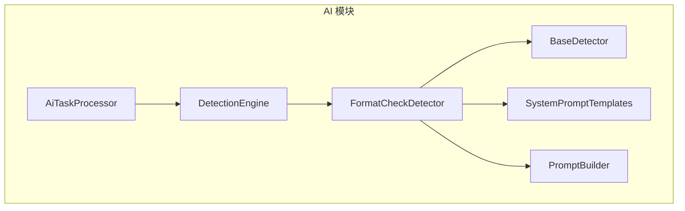
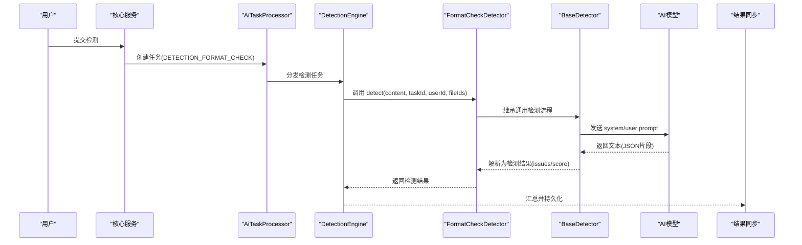
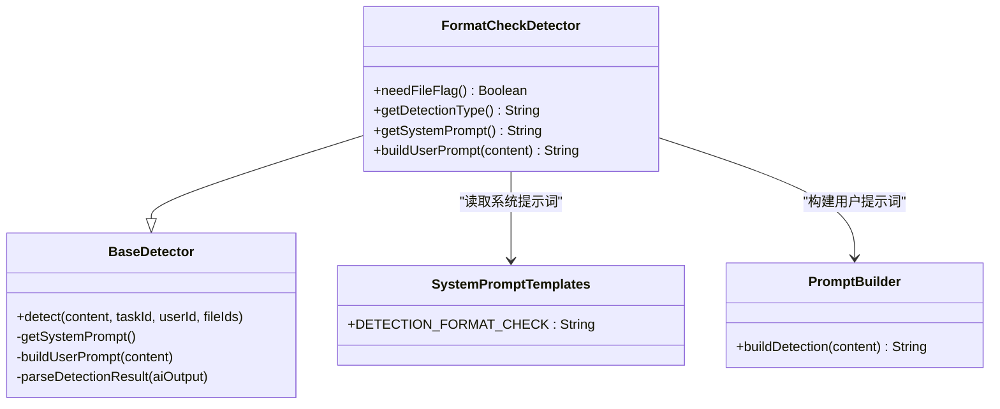
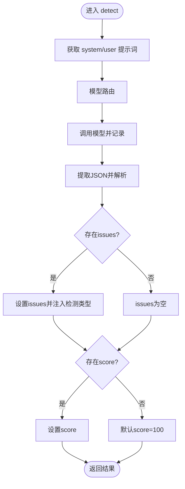
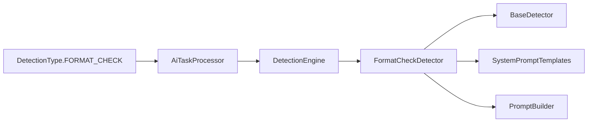

# 格式检查检测

<cite>
**本文引用的文件**   
- [FormatCheckDetector.java](file://ele-ai-tender-system/ele-ai-tender-ai/src/main/java/com/jy/eleaitender/ai/processor/checker/FormatCheckDetector.java)
- [BaseDetector.java](file://ele-ai-tender-system/ele-ai-tender-ai/src/main/java/com/jy/eleaitender/ai/processor/checker/BaseDetector.java)
- [SystemPromptTemplates.java](file://ele-ai-tender-system/ele-ai-tender-ai/src/main/java/com/jy/eleaitender/ai/processor/prompt/SystemPromptTemplates.java)
- [PromptBuilder.java](file://ele-ai-tender-system/ele-ai-tender-ai/src/main/java/com/jy/eleaitender/ai/processor/prompt/PromptBuilder.java)
- [DetectionEngine.java](file://ele-ai-tender-system/ele-ai-tender-ai/src/main/java/com/jy/eleaitender/ai/processor/checker/DetectionEngine.java)
- [AiTaskProcessor.java](file://ele-ai-tender-system/ele-ai-tender-ai/src/main/java/com/jy/eleaitender/ai/processor/AiTaskProcessor.java)
- [DetectionType.java](file://ele-ai-tender-system/ele-ai-tender-common/src/main/java/com/jy/eleaitender/common/enums/DetectionType.java)
- [DETECTION_FLOW_SPEC.md](file://docs/rules/DETECTION_FLOW_SPEC.md)
</cite>

## 目录
1. [简介](#简介)
2. [项目结构](#项目结构)
3. [核心组件](#核心组件)
4. [架构总览](#架构总览)
5. [详细组件分析](#详细组件分析)
6. [依赖关系分析](#依赖关系分析)
7. [性能与扩展性](#性能与扩展性)
8. [故障排查指南](#故障排查指南)
9. [结论](#结论)
10. [附录](#附录)

## 简介
本文件面向“格式检查检测器”（FormatCheckDetector）的文档格式验证机制，系统性阐述其结构完整性检查、样式规范验证与排版质量检测能力；说明模板匹配、章节结构分析与内容密度评估的实现思路；解释格式错误定位、修复建议生成与质量评分计算流程；并给出多格式支持（Word、PDF、Markdown）、样式规则配置、批量检查优化、标准定制与扩展、以及性能调优的实践指南。

## 项目结构
格式检查检测位于 AI 模块的检测器子系统中，采用“检测器基类 + 具体检测器 + Prompt 模板 + 引擎编排”的分层设计：
- 检测器基类提供模型路由、调用记录、结果解析等通用能力
- 具体检测器负责定义检测类型、系统提示词与用户提示词构建策略
- 引擎负责按任务类型调度对应检测器
- 处理器将检测任务纳入统一的任务执行链路

图表来源
- [DetectionEngine.java](file://ele-ai-tender-system/ele-ai-tender-ai/src/main/java/com/jy/eleaitender/ai/processor/checker/DetectionEngine.java)
- [FormatCheckDetector.java](file://ele-ai-tender-system/ele-ai-tender-ai/src/main/java/com/jy/eleaitender/ai/processor/checker/FormatCheckDetector.java)
- [BaseDetector.java](file://ele-ai-tender-system/ele-ai-tender-ai/src/main/java/com/jy/eleaitender/ai/processor/checker/BaseDetector.java)
- [SystemPromptTemplates.java](file://ele-ai-tender-system/ele-ai-tender-ai/src/main/java/com/jy/eleaitender/ai/processor/prompt/SystemPromptTemplates.java)
- [PromptBuilder.java](file://ele-ai-tender-system/ele-ai-tender-ai/src/main/java/com/jy/eleaitender/ai/processor/prompt/PromptBuilder.java)
- [AiTaskProcessor.java](file://ele-ai-tender-system/ele-ai-tender-ai/src/main/java/com/jy/eleaitender/ai/processor/AiTaskProcessor.java)

章节来源
- [AiTaskProcessor.java:181-188](file://ele-ai-tender-system/ele-ai-tender-ai/src/main/java/com/jy/eleaitender/ai/processor/AiTaskProcessor.java#L181-L188)
- [DetectionEngine.java](file://ele-ai-tender-system/ele-ai-tender-ai/src/main/java/com/jy/eleaitender/ai/processor/checker/DetectionEngine.java)
- [FormatCheckDetector.java:15-37](file://ele-ai-tender-system/ele-ai-tender-ai/src/main/java/com/jy/eleaitender/ai/processor/checker/FormatCheckDetector.java#L15-L37)
- [BaseDetector.java:23-129](file://ele-ai-tender-system/ele-ai-tender-ai/src/main/java/com/jy/eleaitender/ai/processor/checker/BaseDetector.java#L23-L129)
- [SystemPromptTemplates.java:443-470](file://ele-ai-tender-system/ele-ai-tender-ai/src/main/java/com/jy/eleaitender/ai/processor/prompt/SystemPromptTemplates.java#L443-L470)
- [PromptBuilder.java:140-143](file://ele-ai-tender-system/ele-ai-tender-ai/src/main/java/com/jy/eleaitender/ai/processor/prompt/PromptBuilder.java#L140-L143)

## 核心组件
- FormatCheckDetector：实现“格式规范检测”的具体检测器，声明检测类型、系统提示词与用户提示词构建逻辑。
- BaseDetector：封装模型路由、调用记录、JSON 结果提取与解析、默认错误处理与评分回退。
- SystemPromptTemplates：集中管理各类检测的系统提示词，包含格式检查的检查范围、输出 JSON 结构与评分规则。
- PromptBuilder：统一构建检测场景的用户提示词，避免模板变量冲突。
- DetectionEngine：根据任务类型选择并调用具体检测器。
- AiTaskProcessor：将 DETECTION_FORMAT_CHECK 任务分发到检测引擎。

章节来源
- [FormatCheckDetector.java:15-37](file://ele-ai-tender-system/ele-ai-tender-ai/src/main/java/com/jy/eleaitender/ai/processor/checker/FormatCheckDetector.java#L15-L37)
- [BaseDetector.java:23-129](file://ele-ai-tender-system/ele-ai-tender-ai/src/main/java/com/jy/eleaitender/ai/processor/checker/BaseDetector.java#L23-L129)
- [SystemPromptTemplates.java:443-470](file://ele-ai-tender-system/ele-ai-tender-ai/src/main/java/com/jy/eleaitender/ai/processor/prompt/SystemPromptTemplates.java#L443-L470)
- [PromptBuilder.java:140-143](file://ele-ai-tender-system/ele-ai-tender-ai/src/main/java/com/jy/eleaitender/ai/processor/prompt/PromptBuilder.java#L140-L143)
- [DetectionEngine.java](file://ele-ai-tender-system/ele-ai-tender-ai/src/main/java/com/jy/eleaitender/ai/processor/checker/DetectionEngine.java)
- [AiTaskProcessor.java:181-188](file://ele-ai-tender-system/ele-ai-tender-ai/src/main/java/com/jy/eleaitender/ai/processor/AiTaskProcessor.java#L181-L188)

## 架构总览
格式检查检测在整体检测链路中与其他检测并行执行，最终由同步处理器汇总结果并驱动后续修复与发布流程。

图表来源
- [AiTaskProcessor.java:181-188](file://ele-ai-tender-system/ele-ai-tender-ai/src/main/java/com/jy/eleaitender/ai/processor/AiTaskProcessor.java#L181-L188)
- [DetectionEngine.java](file://ele-ai-tender-system/ele-ai-tender-ai/src/main/java/com/jy/eleaitender/ai/processor/checker/DetectionEngine.java)
- [FormatCheckDetector.java:15-37](file://ele-ai-tender-system/ele-ai-tender-ai/src/main/java/com/jy/eleaitender/ai/processor/checker/FormatCheckDetector.java#L15-L37)
- [BaseDetector.java:47-118](file://ele-ai-tender-system/ele-ai-tender-ai/src/main/java/com/jy/eleaitender/ai/processor/checker/BaseDetector.java#L47-L118)

## 详细组件分析

### 组件一：FormatCheckDetector（格式规范检测器）
职责
- 声明检测类型为 FORMAT_CHECK
- 使用系统提示词模板定义检查范围与输出格式
- 通过 PromptBuilder 构建用户提示词，传入待检测内容

关键行为
- needFileFlag 返回 false，表示该检测不依赖文件标记
- getSystemPrompt 指向格式检查的系统提示词常量
- buildUserPrompt 复用检测通用构建方法

图表来源
- [FormatCheckDetector.java:15-37](file://ele-ai-tender-system/ele-ai-tender-ai/src/main/java/com/jy/eleaitender/ai/processor/checker/FormatCheckDetector.java#L15-L37)
- [BaseDetector.java:23-129](file://ele-ai-tender-system/ele-ai-tender-ai/src/main/java/com/jy/eleaitender/ai/processor/checker/BaseDetector.java#L23-L129)
- [SystemPromptTemplates.java:443-470](file://ele-ai-tender-system/ele-ai-tender-ai/src/main/java/com/jy/eleaitender/ai/processor/prompt/SystemPromptTemplates.java#L443-L470)
- [PromptBuilder.java:140-143](file://ele-ai-tender-system/ele-ai-tender-ai/src/main/java/com/jy/eleaitender/ai/processor/prompt/PromptBuilder.java#L140-L143)

章节来源
- [FormatCheckDetector.java:15-37](file://ele-ai-tender-system/ele-ai-tender-ai/src/main/java/com/jy/eleaitender/ai/processor/checker/FormatCheckDetector.java#L15-L37)
- [SystemPromptTemplates.java:443-470](file://ele-ai-tender-system/ele-ai-tender-ai/src/main/java/com/jy/eleaitender/ai/processor/prompt/SystemPromptTemplates.java#L443-L470)
- [PromptBuilder.java:140-143](file://ele-ai-tender-system/ele-ai-tender-ai/src/main/java/com/jy/eleaitender/ai/processor/prompt/PromptBuilder.java#L140-L143)

### 组件二：BaseDetector（检测器基类）
职责
- 统一执行检测流程：组装 system/user 提示词、路由模型、记录调用、解析结果
- 解析 AI 返回的 JSON 片段，映射为 issues 列表与 score 评分
- 异常兜底：失败时返回空问题集与零分，并记录错误信息

关键算法
- 结果解析：从 AI 输出中提取 JSON，反序列化为 DetectionIssueVO 列表，并为每个 issue 注入检测类型
- 评分回退：若未返回 score，则默认 100；解析失败则置 0 并记录错误

图表来源
- [BaseDetector.java:47-118](file://ele-ai-tender-system/ele-ai-tender-ai/src/main/java/com/jy/eleaitender/ai/processor/checker/BaseDetector.java#L47-L118)

章节来源
- [BaseDetector.java:47-118](file://ele-ai-tender-system/ele-ai-tender-ai/src/main/java/com/jy/eleaitender/ai/processor/checker/BaseDetector.java#L47-L118)

### 组件三：系统提示词与用户提示词（SystemPromptTemplates / PromptBuilder）
职责
- 系统提示词定义格式检查的检查范围、输出 JSON 结构、严格约束（original 必须逐字复制、targeted 仅修改问题部分）与评分规则（满分100，每处问题扣5分）
- 用户提示词统一通过 PromptBuilder.buildDetection 构建，避免模板变量冲突

要点
- 检查范围包括标题层级、编号格式、必要章节完整性、表格格式、附件引用完整性
- 输出 JSON 包含 issues 数组与 score 数值
- 评分规则明确扣分方式

章节来源
- [SystemPromptTemplates.java:443-470](file://ele-ai-tender-system/ele-ai-tender-ai/src/main/java/com/jy/eleaitender/ai/processor/prompt/SystemPromptTemplates.java#L443-L470)
- [PromptBuilder.java:140-143](file://ele-ai-tender-system/ele-ai-tender-ai/src/main/java/com/jy/eleaitender/ai/processor/prompt/PromptBuilder.java#L140-L143)

### 组件四：检测引擎与任务处理器（DetectionEngine / AiTaskProcessor）
职责
- AiTaskProcessor 将 DETECTION_FORMAT_CHECK 任务分发至检测引擎
- DetectionEngine 根据任务类型选择 FormatCheckDetector 并执行

章节来源
- [AiTaskProcessor.java:181-188](file://ele-ai-tender-system/ele-ai-tender-ai/src/main/java/com/jy/eleaitender/ai/processor/AiTaskProcessor.java#L181-L188)
- [DetectionEngine.java](file://ele-ai-tender-system/ele-ai-tender-ai/src/main/java/com/jy/eleaitender/ai/processor/checker/DetectionEngine.java)

### 组件五：检测全链路（DETECTION_FLOW_SPEC）
职责
- 描述从提交检测到修复完成的完整链路，涵盖四种检测类型的并行执行、结果同步、位置填充、版本快照与状态流转

章节来源
- [DETECTION_FLOW_SPEC.md:1-38](file://docs/rules/DETECTION_FLOW_SPEC.md#L1-L38)

## 依赖关系分析
- 枚举类型 DetectionType.FORMAT_CHECK 作为检测类型标识贯穿任务、处理器与前端类型定义
- 检测器之间解耦，均继承自 BaseDetector，通过 DetectionEngine 进行统一调度
- 提示词模板与构建器独立于检测器，便于扩展与维护

图表来源
- [DetectionType.java:11-16](file://ele-ai-tender-system/ele-ai-tender-common/src/main/java/com/jy/eleaitender/common/enums/DetectionType.java#L11-L16)
- [AiTaskProcessor.java:181-188](file://ele-ai-tender-system/ele-ai-tender-ai/src/main/java/com/jy/eleaitender/ai/processor/AiTaskProcessor.java#L181-L188)
- [DetectionEngine.java](file://ele-ai-tender-system/ele-ai-tender-ai/src/main/java/com/jy/eleaitender/ai/processor/checker/DetectionEngine.java)
- [FormatCheckDetector.java:15-37](file://ele-ai-tender-system/ele-ai-tender-ai/src/main/java/com/jy/eleaitender/ai/processor/checker/FormatCheckDetector.java#L15-L37)
- [BaseDetector.java:23-129](file://ele-ai-tender-system/ele-ai-tender-ai/src/main/java/com/jy/eleaitender/ai/processor/checker/BaseDetector.java#L23-L129)
- [SystemPromptTemplates.java:443-470](file://ele-ai-tender-system/ele-ai-tender-ai/src/main/java/com/jy/eleaitender/ai/processor/prompt/SystemPromptTemplates.java#L443-L470)
- [PromptBuilder.java:140-143](file://ele-ai-tender-system/ele-ai-tender-ai/src/main/java/com/jy/eleaitender/ai/processor/prompt/PromptBuilder.java#L140-L143)

章节来源
- [DetectionType.java:11-16](file://ele-ai-tender-system/ele-ai-tender-common/src/main/java/com/jy/eleaitender/common/enums/DetectionType.java#L11-L16)
- [AiTaskProcessor.java:181-188](file://ele-ai-tender-system/ele-ai-tender-ai/src/main/java/com/jy/eleaitender/ai/processor/AiTaskProcessor.java#L181-L188)

## 性能与扩展性
- 并行执行：四种检测类型（含格式检查）并行执行，缩短端到端耗时
- 结果解析容错：解析失败时降级为 0 分并记录错误，避免阻塞主流程
- 可扩展点：新增检测器仅需继承 BaseDetector 并实现抽象方法，无需改动引擎与处理器
- 提示词可配置：系统提示词集中在模板常量，便于调整检查范围与评分规则

[本节为通用指导，不直接分析具体文件]

## 故障排查指南
- 检测失败日志：当模型调用或解析异常时，会记录错误信息并返回空问题集与 0 分
- 解析失败告警：若 AI 输出无法正确解析为 JSON，将记录警告并回退默认值
- 任务链路追踪：参考检测全链路规范，确认任务是否被正确分发、结果是否同步、位置是否填充

章节来源
- [BaseDetector.java:58-66](file://ele-ai-tender-system/ele-ai-tender-ai/src/main/java/com/jy/eleaitender/ai/processor/checker/BaseDetector.java#L58-L66)
- [BaseDetector.java:111-118](file://ele-ai-tender-system/ele-ai-tender-ai/src/main/java/com/jy/eleaitender/ai/processor/checker/BaseDetector.java#L111-L118)
- [DETECTION_FLOW_SPEC.md:1-38](file://docs/rules/DETECTION_FLOW_SPEC.md#L1-L38)

## 结论
FormatCheckDetector 基于统一的检测器基类与提示词模板体系，实现了结构完整性、样式规范与排版质量的系统化检查。其输出包含精确的问题定位、可直接替换的修复内容与质量评分，配合全链路任务编排与结果同步，形成闭环的格式治理流程。通过模板化提示词与可扩展的检测器设计，系统具备良好的规则定制与扩展能力。

[本节为总结性内容，不直接分析具体文件]

## 附录

### 数据模型与字段说明（来自系统提示词）
- issues：问题列表，每项包含 position、original、targeted、suggestion、ruleViolated
- score：质量评分，满分100，每处问题扣5分
- original 必须逐字复制原文，不得增删改字符（含空格、换行、标点）
- targeted 仅修改问题部分，其余与 original 保持一致

章节来源
- [SystemPromptTemplates.java:443-470](file://ele-ai-tender-system/ele-ai-tender-ai/src/main/java/com/jy/eleaitender/ai/processor/prompt/SystemPromptTemplates.java#L443-L470)

### 多格式支持与转换要点
- Word：通过文件服务接口提取文本与段落元素，结合 locationRef 精准定位与替换
- Markdown：软/硬换行渲染为换行符，确保编号条款逐行显示
- PDF：当前代码路径未直接体现 PDF 解析逻辑，建议在文件服务层补充 PDF 文本抽取与段落切分能力，再接入现有检测流程

章节来源
- [DETECTION_FLOW_SPEC.md:122-157](file://docs/rules/DETECTION_FLOW_SPEC.md#L122-L157)

### 批量检查优化建议
- 并行执行：保持四种检测类型并行，减少总体等待时间
- 结果缓存：对相同内容的重复检测可引入缓存，降低模型调用成本
- 增量检测：对大文档按章节或段落拆分，仅对变更区域执行检测
- 提示词裁剪：控制输入长度，优先传递关键上下文，提升响应速度与稳定性

[本节为通用指导，不直接分析具体文件]