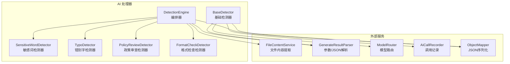
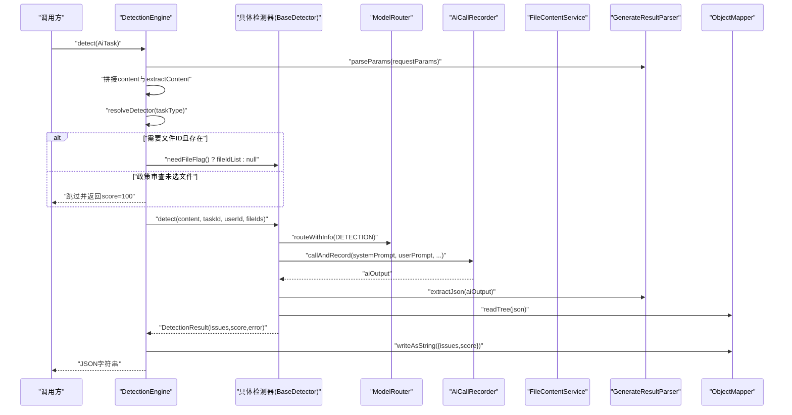
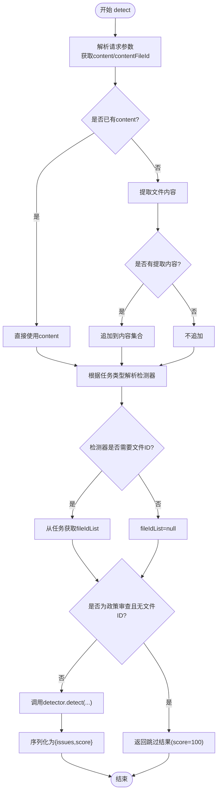
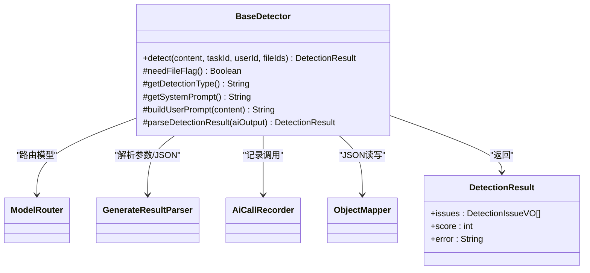
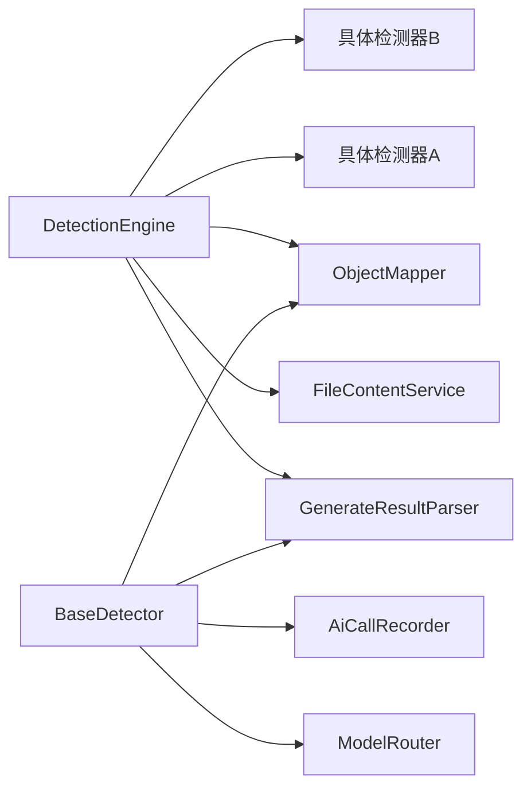

# 检测引擎核心

<cite>
**本文引用的文件**   
- [DetectionEngine.java](file://ele-ai-tender-system/ele-ai-tender-ai/src/main/java/com/jy/eleaitender/ai/processor/checker/DetectionEngine.java)
- [BaseDetector.java](file://ele-ai-tender-system/ele-ai-tender-ai/src/main/java/com/jy/eleaitender/ai/processor/checker/BaseDetector.java)
</cite>

## 目录
1. [简介](#简介)
2. [项目结构](#项目结构)
3. [核心组件](#核心组件)
4. [架构总览](#架构总览)
5. [详细组件分析](#详细组件分析)
6. [依赖分析](#依赖分析)
7. [性能考虑](#性能考虑)
8. [故障排查指南](#故障排查指南)
9. [结论](#结论)
10. [附录](#附录)

## 简介
本文件面向“检测引擎核心”，聚焦 DetectionEngine 的检测流程编排与 BaseDetector 的基础检测逻辑。文档覆盖任务类型分发策略、检测器解析算法、内容聚合处理流程、DetectionResult 结果结构定义、质量评分计算方法、错误处理机制，以及执行上下文管理、文件内容提取集成和 JSON 序列化优化等关键主题。同时提供配置选项与扩展点说明，帮助读者快速理解并扩展检测能力。

## 项目结构
检测引擎位于 AI 模块的处理器子包中，采用“编排器 + 基础抽象 + 具体检测器”的分层设计：
- 编排层：DetectionEngine 负责根据任务类型选择具体检测器、组装输入内容、调用检测器并输出统一 JSON 结果。
- 基础层：BaseDetector 封装模型路由、提示词构建、AI 调用记录、结果解析与默认错误兜底。
- 具体检测器：如敏感词、错别字、政策审查、格式检查等（由 DetectionEngine 通过 switch 分发）。

图表来源
- [DetectionEngine.java:1-126](file://ele-ai-tender-system/ele-ai-tender-ai/src/main/java/com/jy/eleaitender/ai/processor/checker/DetectionEngine.java#L1-L126)
- [BaseDetector.java:1-130](file://ele-ai-tender-system/ele-ai-tender-ai/src/main/java/com/jy/eleaitender/ai/processor/checker/BaseDetector.java#L1-L130)

章节来源
- [DetectionEngine.java:1-126](file://ele-ai-tender-system/ele-ai-tender-ai/src/main/java/com/jy/eleaitender/ai/processor/checker/DetectionEngine.java#L1-L126)
- [BaseDetector.java:1-130](file://ele-ai-tender-system/ele-ai-tender-ai/src/main/java/com/jy/eleaitender/ai/processor/checker/BaseDetector.java#L1-L130)

## 核心组件
- DetectionEngine（编排器）
  - 职责：按任务类型分发到具体检测器；聚合文本内容与文件内容；构造统一 JSON 响应；处理无政策文件的跳过逻辑。
  - 关键点：使用 switch 进行任务类型到检测器的映射；支持可选的文件 ID 列表传递；对序列化异常做兜底返回。
- BaseDetector（基础检测器）
  - 职责：封装系统提示词与用户提示词构建、模型路由、AI 调用记录、结果解析与默认错误处理。
  - 关键点：统一的 parseDetectionResult 将 AI 输出解析为 DetectionResult；issues 自动注入检测类型；score 缺失时回退默认值；异常时返回空问题集与错误信息。

章节来源
- [DetectionEngine.java:1-126](file://ele-ai-tender-system/ele-ai-tender-ai/src/main/java/com/jy/eleaitender/ai/processor/checker/DetectionEngine.java#L1-L126)
- [BaseDetector.java:1-130](file://ele-ai-tender-system/ele-ai-tender-ai/src/main/java/com/jy/eleaitender/ai/processor/checker/BaseDetector.java#L1-L130)

## 架构总览
下图展示一次检测请求从编排到结果输出的完整时序，包括内容聚合、模型路由、调用记录与结果解析。

图表来源
- [DetectionEngine.java:53-95](file://ele-ai-tender-system/ele-ai-tender-ai/src/main/java/com/jy/eleaitender/ai/processor/checker/DetectionEngine.java#L53-L95)
- [BaseDetector.java:47-66](file://ele-ai-tender-system/ele-ai-tender-ai/src/main/java/com/jy/eleaitender/ai/processor/checker/BaseDetector.java#L47-L66)
- [BaseDetector.java:88-118](file://ele-ai-tender-system/ele-ai-tender-ai/src/main/java/com/jy/eleaitender/ai/processor/checker/BaseDetector.java#L88-L118)

## 详细组件分析

### DetectionEngine 编排器
- 任务类型分发策略
  - 基于 AiTaskType 枚举值，使用 switch 精确匹配到对应检测器实例。
  - 若遇到非检测类型任务，抛出非法参数异常以快速失败。
- 内容聚合处理流程
  - 优先解析请求参数中的 content；若为空则尝试从 contentFileId 提取文件内容。
  - 使用分隔符将多段内容拼接，形成最终待检测文本。
- 文件内容提取集成
  - 当检测器声明 needFileFlag 为真时，从任务对象获取 fileIdList 并透传给检测器。
  - 针对政策审查场景，若无有效文件 ID，直接返回成功且满分的结果，避免不必要的 AI 调用。
- JSON 序列化优化
  - 统一将 DetectionResult 转换为包含 issues 与 score 的扁平 JSON。
  - 捕获序列化异常，返回包含 error 字段的安全降级响应，确保上层稳定消费。

图表来源
- [DetectionEngine.java:53-95](file://ele-ai-tender-system/ele-ai-tender-ai/src/main/java/com/jy/eleaitender/ai/processor/checker/DetectionEngine.java#L53-L95)
- [DetectionEngine.java:100-108](file://ele-ai-tender-system/ele-ai-tender-ai/src/main/java/com/jy/eleaitender/ai/processor/checker/DetectionEngine.java#L100-L108)
- [DetectionEngine.java:114-124](file://ele-ai-tender-system/ele-ai-tender-ai/src/main/java/com/jy/eleaitender/ai/processor/checker/DetectionEngine.java#L114-L124)

章节来源
- [DetectionEngine.java:53-95](file://ele-ai-tender-system/ele-ai-tender-ai/src/main/java/com/jy/eleaitender/ai/processor/checker/DetectionEngine.java#L53-L95)
- [DetectionEngine.java:100-108](file://ele-ai-tender-system/ele-ai-tender-ai/src/main/java/com/jy/eleaitender/ai/processor/checker/DetectionEngine.java#L100-L108)
- [DetectionEngine.java:114-124](file://ele-ai-tender-system/ele-ai-tender-ai/src/main/java/com/jy/eleaitender/ai/processor/checker/DetectionEngine.java#L114-L124)

### BaseDetector 基础检测逻辑
- 执行上下文管理
  - 接收 taskId、userId、fileIds，用于后续调用记录与审计。
  - 通过 ModelRouter 获取 RoutedChatClient，绑定当前使用的模型名称。
- 提示词构建与模型调用
  - 子类实现 getSystemPrompt 与 buildUserPrompt，分别提供系统指令与用户指令。
  - 通过 AiCallRecorder 包装 chatClient.chat，完成调用与持久化记录。
- 结果解析算法
  - 使用 GenerateResultParser 从 AI 原始输出中提取 JSON 片段。
  - 使用 ObjectMapper 将 JSON 转为 DetectionResult：
    - issues：若存在则转换为目标 VO 列表，并为每个 issue 注入 detectionType。
    - score：若存在则读取整型，否则默认 100。
- 错误处理机制
  - 外层 try/catch 捕获异常，返回空 issues、score=0 并携带 error 消息。
  - 内层解析异常记录警告日志，同样返回安全降级结果。

图表来源
- [BaseDetector.java:24-66](file://ele-ai-tender-system/ele-ai-tender-ai/src/main/java/com/jy/eleaitender/ai/processor/checker/BaseDetector.java#L24-L66)
- [BaseDetector.java:88-118](file://ele-ai-tender-system/ele-ai-tender-ai/src/main/java/com/jy/eleaitender/ai/processor/checker/BaseDetector.java#L88-L118)
- [BaseDetector.java:123-128](file://ele-ai-tender-system/ele-ai-tender-ai/src/main/java/com/jy/eleaitender/ai/processor/checker/BaseDetector.java#L123-L128)

章节来源
- [BaseDetector.java:47-66](file://ele-ai-tender-system/ele-ai-tender-ai/src/main/java/com/jy/eleaitender/ai/processor/checker/BaseDetector.java#L47-L66)
- [BaseDetector.java:88-118](file://ele-ai-tender-system/ele-ai-tender-ai/src/main/java/com/jy/eleaitender/ai/processor/checker/BaseDetector.java#L88-L118)
- [BaseDetector.java:123-128](file://ele-ai-tender-system/ele-ai-tender-ai/src/main/java/com/jy/eleaitender/ai/processor/checker/BaseDetector.java#L123-L128)

### 检测结果结构与质量评分
- DetectionResult 结构
  - issues：问题清单，每个问题包含检测类型等元数据。
  - score：质量评分，范围通常为 0-100，缺失时默认 100。
  - error：错误信息，仅在异常或解析失败时填充。
- 质量评分计算
  - 由 AI 输出决定；若未提供 score，则回退为 100。
  - 在编排层，若检测到“政策审查未选择文件”，直接返回 100 分作为跳过语义。
- 错误处理
  - 外层异常：返回空问题集、score=0 并附带错误消息。
  - 解析异常：记录警告日志，返回空问题集、score=0 并附带解析失败原因。
  - 序列化异常：返回包含 error 字段的降级 JSON，保证接口契约稳定。

章节来源
- [BaseDetector.java:88-118](file://ele-ai-tender-system/ele-ai-tender-ai/src/main/java/com/jy/eleaitender/ai/processor/checker/BaseDetector.java#L88-L118)
- [DetectionEngine.java:81-86](file://ele-ai-tender-system/ele-ai-tender-ai/src/main/java/com/jy/eleaitender/ai/processor/checker/DetectionEngine.java#L81-L86)
- [DetectionEngine.java:114-124](file://ele-ai-tender-system/ele-ai-tender-ai/src/main/java/com/jy/eleaitender/ai/processor/checker/DetectionEngine.java#L114-L124)

### 执行上下文管理与文件内容提取
- 执行上下文
  - taskId、userId、fileIds 贯穿检测链路，用于调用记录与审计追踪。
- 文件内容提取
  - 当请求参数未提供 content 但提供了 contentFileId 时，通过 FileContentService 提取文本并拼接到内容集合。
  - 对于需要文件列表的检测器，从任务对象获取 fileIdList 并透传。

章节来源
- [DetectionEngine.java:57-70](file://ele-ai-tender-system/ele-ai-tender-ai/src/main/java/com/jy/eleaitender/ai/processor/checker/DetectionEngine.java#L57-L70)
- [DetectionEngine.java:76-79](file://ele-ai-tender-system/ele-ai-tender-ai/src/main/java/com/jy/eleaitender/ai/processor/checker/DetectionEngine.java#L76-L79)

### JSON 序列化优化
- 统一输出结构：仅包含 issues 与 score，减少冗余字段。
- 异常安全：捕获序列化异常，返回包含 error 的降级 JSON，避免上层崩溃。
- 解析容错：先提取 JSON 片段再解析，提升对非结构化 AI 输出的鲁棒性。

章节来源
- [DetectionEngine.java:114-124](file://ele-ai-tender-system/ele-ai-tender-ai/src/main/java/com/jy/eleaitender/ai/processor/checker/DetectionEngine.java#L114-L124)
- [BaseDetector.java:88-118](file://ele-ai-tender-system/ele-ai-tender-ai/src/main/java/com/jy/eleaitender/ai/processor/checker/BaseDetector.java#L88-L118)

## 依赖分析
- 内部依赖
  - DetectionEngine 依赖：FileContentService、GenerateResultParser、ObjectMapper、具体检测器。
  - BaseDetector 依赖：ModelRouter、GenerateResultParser、AiCallRecorder、ObjectMapper。
- 耦合与内聚
  - 编排层与具体检测器解耦，通过接口抽象与 switch 分发降低耦合度。
  - 基础检测器集中处理通用逻辑，提高内聚性与可复用性。
- 外部依赖
  - 模型路由与调用记录通过独立组件提供，便于替换与监控。
  - JSON 处理统一使用 Jackson，保障一致性与性能。

图表来源
- [DetectionEngine.java:26-45](file://ele-ai-tender-system/ele-ai-tender-ai/src/main/java/com/jy/eleaitender/ai/processor/checker/DetectionEngine.java#L26-L45)
- [BaseDetector.java:26-36](file://ele-ai-tender-system/ele-ai-tender-ai/src/main/java/com/jy/eleaitender/ai/processor/checker/BaseDetector.java#L26-L36)

章节来源
- [DetectionEngine.java:26-45](file://ele-ai-tender-system/ele-ai-tender-ai/src/main/java/com/jy/eleaitender/ai/processor/checker/DetectionEngine.java#L26-L45)
- [BaseDetector.java:26-36](file://ele-ai-tender-system/ele-ai-tender-ai/src/main/java/com/jy/eleaitender/ai/processor/checker/BaseDetector.java#L26-L36)

## 性能考虑
- 内容拼接避免重复 I/O：优先使用请求参数中的 content，仅在必要时调用文件提取服务。
- 短路策略：政策审查未选择文件时直接返回高分结果，减少不必要的大模型调用。
- 序列化降级：捕获异常后返回最小可用 JSON，避免阻塞主流程。
- 建议
  - 对大文本内容进行分段或采样，以降低模型调用成本。
  - 缓存热点文件内容，减少重复提取开销。
  - 对高频检测器启用结果缓存或去重策略。

## 故障排查指南
- 常见问题定位
  - 任务类型未识别：检查 AiTaskType 枚举与 DetectionEngine 的 switch 分支是否覆盖所有类型。
  - 文件内容未提取：确认 contentFileId 是否存在且可访问，FileContentService 是否正常。
  - 政策审查未触发：检查 fileIdList 是否为空或为空字符串，必要时调整业务规则。
  - 结果解析失败：查看 AI 输出是否包含合法 JSON 片段，关注 GenerateResultParser 的提取逻辑。
  - 序列化异常：检查 DetectionResult 字段是否符合 ObjectMapper 的期望，必要时增加兼容字段。
- 日志与追踪
  - 关注 DetectionEngine 与 BaseDetector 的日志输出，结合 taskId 与 userId 进行链路追踪。
  - 利用 AiCallRecorder 记录的模型名称与调用详情，辅助定位模型侧问题。

章节来源
- [DetectionEngine.java:100-108](file://ele-ai-tender-system/ele-ai-tender-ai/src/main/java/com/jy/eleaitender/ai/processor/checker/DetectionEngine.java#L100-L108)
- [DetectionEngine.java:81-86](file://ele-ai-tender-system/ele-ai-tender-ai/src/main/java/com/jy/eleaitender/ai/processor/checker/DetectionEngine.java#L81-L86)
- [BaseDetector.java:58-66](file://ele-ai-tender-system/ele-ai-tender-ai/src/main/java/com/jy/eleaitender/ai/processor/checker/BaseDetector.java#L58-L66)
- [BaseDetector.java:111-118](file://ele-ai-tender-system/ele-ai-tender-ai/src/main/java/com/jy/eleaitender/ai/processor/checker/BaseDetector.java#L111-L118)

## 结论
DetectionEngine 与 BaseDetector 共同构成了检测引擎的核心骨架：前者负责任务分发与结果收敛，后者封装模型调用与结果解析的通用能力。通过清晰的职责划分与健壮的错误处理，系统具备良好的可扩展性与稳定性。建议在新增检测器时遵循 BaseDetector 的抽象约定，并在 DetectionEngine 中补充分发逻辑，即可快速接入新的检测能力。

## 附录
- 配置选项与扩展点
  - 新增检测器
    - 继承 BaseDetector，实现 needFileFlag、getDetectionType、getSystemPrompt、buildUserPrompt。
    - 在 DetectionEngine 中添加对应 AiTaskType 的分支映射。
  - 自定义结果解析
    - 重写 BaseDetector.parseDetectionResult，适配不同的 AI 输出格式。
  - 自定义评分策略
    - 在 BaseDetector 或具体检测器中实现 score 计算逻辑，或在编排层进行二次修正。
  - 文件内容提取
    - 扩展 FileContentService 以支持更多文件格式或存储后端。
  - 模型路由与记录
    - 通过 ModelRouter 与 AiCallRecorder 的配置，切换模型与记录策略。