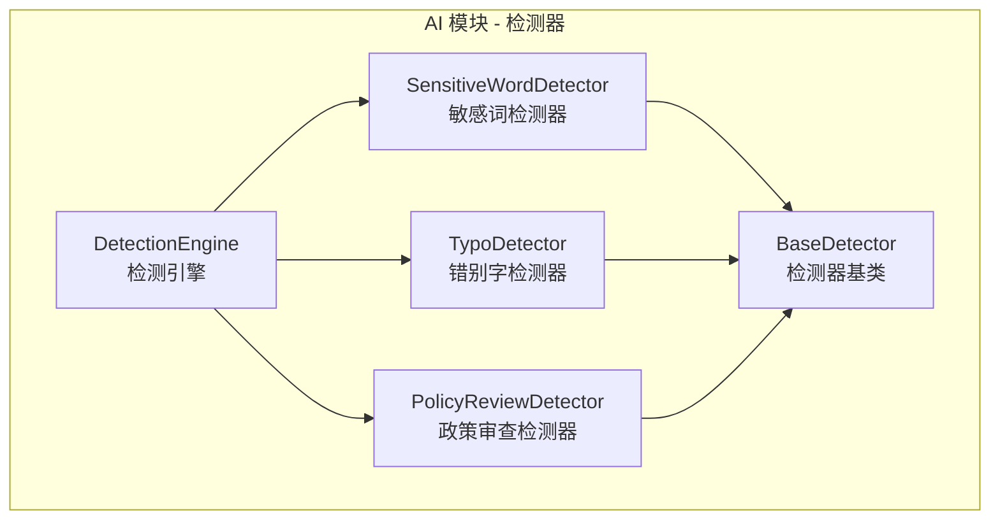
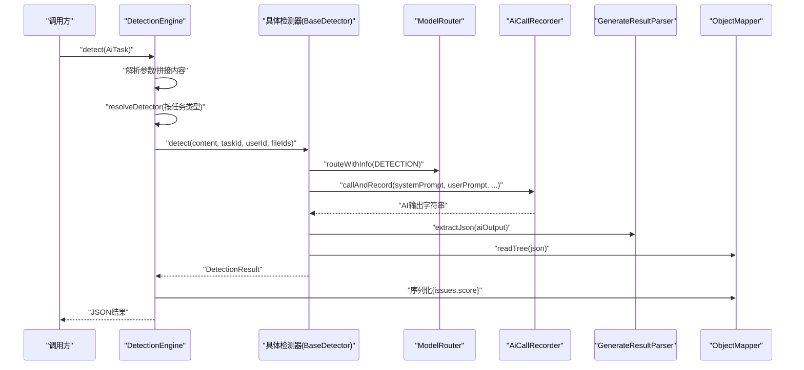
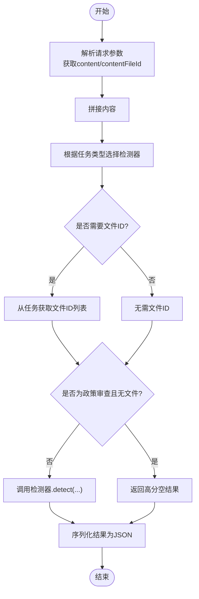
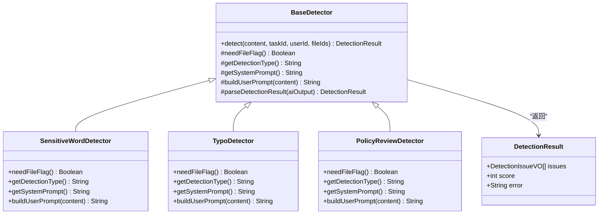
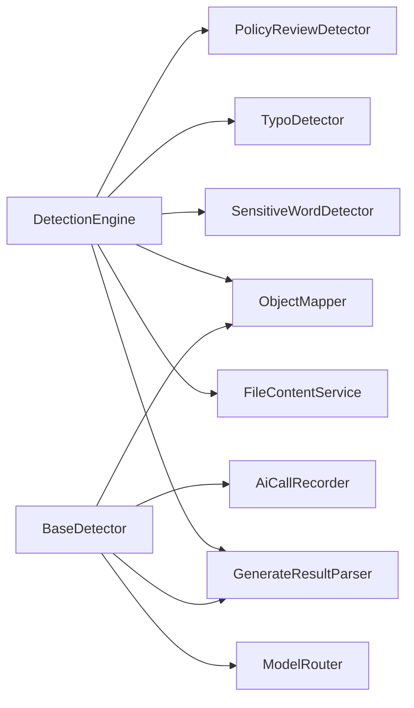

# 质量检测引擎

<cite>
**本文引用的文件**   
- [DetectionEngine.java](file://ele-ai-tender-system/ele-ai-tender-ai/src/main/java/com/jy/eleaitender/ai/processor/checker/DetectionEngine.java)
- [BaseDetector.java](file://ele-ai-tender-system/ele-ai-tender-ai/src/main/java/com/jy/eleaitender/ai/processor/checker/BaseDetector.java)
- [SensitiveWordDetector.java](file://ele-ai-tender-system/ele-ai-tender-ai/src/main/java/com/jy/eleaitender/ai/processor/checker/SensitiveWordDetector.java)
- [TypoDetector.java](file://ele-ai-tender-system/ele-ai-tender-ai/src/main/java/com/jy/eleaitender/ai/processor/checker/TypoDetector.java)
- [PolicyReviewDetector.java](file://ele-ai-tender-system/ele-ai-tender-ai/src/main/java/com/jy/eleaitender/ai/processor/checker/PolicyReviewDetector.java)
</cite>

## 目录
1. [简介](#简介)
2. [项目结构](#项目结构)
3. [核心组件](#核心组件)
4. [架构总览](#架构总览)
5. [详细组件分析](#详细组件分析)
6. [依赖关系分析](#依赖关系分析)
7. [性能与可扩展性](#性能与可扩展性)
8. [故障排查指南](#故障排查指南)
9. [结论](#结论)
10. [附录](#附录)

## 简介
本文件面向“质量检测引擎”的插件化智能检测系统，围绕以下目标展开：
- 检测规则引擎与多类型检测器的设计
- 结果聚合机制与结构化输出
- DetectionEngine 的检测流程编排
- BaseDetector 的基础检测逻辑
- SensitiveWordDetector、TypoDetector、PolicyReviewDetector 的具体实现要点
- 自定义检测器开发指南与动态配置方案
- 检测结果的结构化输出规范与质量评分算法说明

## 项目结构
检测相关代码集中在 AI 模块的处理器检查器包中，采用“引擎 + 基类 + 具体检测器”的分层组织方式：
- 引擎层：负责任务分发、参数组装、结果序列化
- 基类层：封装模型路由、提示词构建、AI 调用记录、结果解析等通用能力
- 检测器层：按业务类型（敏感词、错别字、政策审查、格式检查）提供差异化 Prompt 与行为

图表来源
- [DetectionEngine.java:1-126](file://ele-ai-tender-system/ele-ai-tender-ai/src/main/java/com/jy/eleaitender/ai/processor/checker/DetectionEngine.java#L1-L126)
- [BaseDetector.java:1-130](file://ele-ai-tender-system/ele-ai-tender-ai/src/main/java/com/jy/eleaitender/ai/processor/checker/BaseDetector.java#L1-L130)
- [SensitiveWordDetector.java:1-37](file://ele-ai-tender-system/ele-ai-tender-ai/src/main/java/com/jy/eleaitender/ai/processor/checker/SensitiveWordDetector.java#L1-L37)
- [TypoDetector.java:1-38](file://ele-ai-tender-system/ele-ai-tender-ai/src/main/java/com/jy/eleaitender/ai/processor/checker/TypoDetector.java#L1-L38)
- [PolicyReviewDetector.java:1-38](file://ele-ai-tender-system/ele-ai-tender-ai/src/main/java/com/jy/eleaitender/ai/processor/checker/PolicyReviewDetector.java#L1-L38)

章节来源
- [DetectionEngine.java:1-126](file://ele-ai-tender-system/ele-ai-tender-ai/src/main/java/com/jy/eleaitender/ai/processor/checker/DetectionEngine.java#L1-L126)
- [BaseDetector.java:1-130](file://ele-ai-tender-system/ele-ai-tender-ai/src/main/java/com/jy/eleaitender/ai/processor/checker/BaseDetector.java#L1-L130)
- [SensitiveWordDetector.java:1-37](file://ele-ai-tender-system/ele-ai-tender-ai/src/main/java/com/jy/eleaitender/ai/processor/checker/SensitiveWordDetector.java#L1-L37)
- [TypoDetector.java:1-38](file://ele-ai-tender-system/ele-ai-tender-ai/src/main/java/com/jy/eleaitender/ai/processor/checker/TypoDetector.java#L1-L38)
- [PolicyReviewDetector.java:1-38](file://ele-ai-tender-system/ele-ai-tender-ai/src/main/java/com/jy/eleaitender/ai/processor/checker/PolicyReviewDetector.java#L1-L38)

## 核心组件
- 检测引擎（DetectionEngine）
  - 职责：根据任务类型选择对应检测器；合并文本内容与可选文件内容；处理策略审查无文件时的短路返回；统一序列化为 JSON。
  - 关键流程：解析请求参数 -> 拼接内容 -> 选择检测器 -> 执行 detect -> 序列化输出。
- 检测器基类（BaseDetector）
  - 职责：封装模型路由、提示词构造、AI 调用记录、结果解析与错误兜底；定义抽象方法供子类实现。
  - 关键能力：needFileFlag、getDetectionType、getSystemPrompt、buildUserPrompt、parseDetectionResult。
- 具体检测器
  - 敏感词检测器（SensitiveWordDetector）：识别歧视性、限制性、排他性、倾向性表述。
  - 错别字检测器（TypoDetector）：识别错别字、语法错误、标点符号错误。
  - 政策审查检测器（PolicyReviewDetector）：对照政策文件进行合规性检查。

章节来源
- [DetectionEngine.java:47-95](file://ele-ai-tender-system/ele-ai-tender-ai/src/main/java/com/jy/eleaitender/ai/processor/checker/DetectionEngine.java#L47-L95)
- [BaseDetector.java:47-118](file://ele-ai-tender-system/ele-ai-tender-ai/src/main/java/com/jy/eleaitender/ai/processor/checker/BaseDetector.java#L47-L118)
- [SensitiveWordDetector.java:14-36](file://ele-ai-tender-system/ele-ai-tender-ai/src/main/java/com/jy/eleaitender/ai/processor/checker/SensitiveWordDetector.java#L14-L36)
- [TypoDetector.java:15-37](file://ele-ai-tender-system/ele-ai-tender-ai/src/main/java/com/jy/eleaitender/ai/processor/checker/TypoDetector.java#L15-L37)
- [PolicyReviewDetector.java:15-37](file://ele-ai-tender-system/ele-ai-tender-ai/src/main/java/com/jy/eleaitender/ai/processor/checker/PolicyReviewDetector.java#L15-L37)

## 架构总览
下图展示从任务到结果的端到端调用链，包括引擎编排、检测器选择、AI 调用与结果解析。

图表来源
- [DetectionEngine.java:53-95](file://ele-ai-tender-system/ele-ai-tender-ai/src/main/java/com/jy/eleaitender/ai/processor/checker/DetectionEngine.java#L53-L95)
- [BaseDetector.java:47-118](file://ele-ai-tender-system/ele-ai-tender-ai/src/main/java/com/jy/eleaitender/ai/processor/checker/BaseDetector.java#L47-L118)

## 详细组件分析

### 检测引擎（DetectionEngine）
- 功能要点
  - 任务分发：依据 AiTaskType 将任务路由至对应检测器。
  - 内容拼装：优先使用请求中的 content，若存在 contentFileId 则追加文件提取内容。
  - 策略审查短路：当类型为政策审查且未选择政策文件时，直接返回高分结果并跳过 AI 调用。
  - 结果序列化：统一输出包含 issues 列表与 score 的 JSON。
- 异常与边界
  - 未知任务类型抛出非法参数异常。
  - 序列化失败时降级为带 error 字段的安全响应。

图表来源
- [DetectionEngine.java:53-95](file://ele-ai-tender-system/ele-ai-tender-ai/src/main/java/com/jy/eleaitender/ai/processor/checker/DetectionEngine.java#L53-L95)
- [DetectionEngine.java:100-112](file://ele-ai-tender-system/ele-ai-tender-ai/src/main/java/com/jy/eleaitender/ai/processor/checker/DetectionEngine.java#L100-L112)
- [DetectionEngine.java:114-124](file://ele-ai-tender-system/ele-ai-tender-ai/src/main/java/com/jy/eleaitender/ai/processor/checker/DetectionEngine.java#L114-L124)

章节来源
- [DetectionEngine.java:47-95](file://ele-ai-tender-system/ele-ai-tender-ai/src/main/java/com/jy/eleaitender/ai/processor/checker/DetectionEngine.java#L47-L95)
- [DetectionEngine.java:100-112](file://ele-ai-tender-system/ele-ai-tender-ai/src/main/java/com/jy/eleaitender/ai/processor/checker/DetectionEngine.java#L100-L112)
- [DetectionEngine.java:114-124](file://ele-ai-tender-system/ele-ai-tender-ai/src/main/java/com/jy/eleaitender/ai/processor/checker/DetectionEngine.java#L114-L124)

### 检测器基类（BaseDetector）
- 通用流程
  - 构造 SystemPrompt 与 UserPrompt
  - 通过 ModelRouter 选择模型客户端
  - 使用 AiCallRecorder 记录调用上下文（场景、任务ID、用户ID、文件ID、模型名）
  - 解析 AI 输出为结构化结果（issues 列表与 score）
- 扩展点
  - needFileFlag：是否依赖外部文件
  - getDetectionType：检测类型标识
  - getSystemPrompt / buildUserPrompt：提示词模板
  - parseDetectionResult：统一解析与容错
- 数据结构
  - DetectionResult：包含 issues、score、error

图表来源
- [BaseDetector.java:24-129](file://ele-ai-tender-system/ele-ai-tender-ai/src/main/java/com/jy/eleaitender/ai/processor/checker/BaseDetector.java#L24-L129)
- [SensitiveWordDetector.java:14-36](file://ele-ai-tender-system/ele-ai-tender-ai/src/main/java/com/jy/eleaitender/ai/processor/checker/SensitiveWordDetector.java#L14-L36)
- [TypoDetector.java:15-37](file://ele-ai-tender-system/ele-ai-tender-ai/src/main/java/com/jy/eleaitender/ai/processor/checker/TypoDetector.java#L15-L37)
- [PolicyReviewDetector.java:15-37](file://ele-ai-tender-system/ele-ai-tender-ai/src/main/java/com/jy/eleaitender/ai/processor/checker/PolicyReviewDetector.java#L15-L37)

章节来源
- [BaseDetector.java:47-118](file://ele-ai-tender-system/ele-ai-tender-ai/src/main/java/com/jy/eleaitender/ai/processor/checker/BaseDetector.java#L47-L118)
- [BaseDetector.java:123-128](file://ele-ai-tender-system/ele-ai-tender-ai/src/main/java/com/jy/eleaitender/ai/processor/checker/BaseDetector.java#L123-L128)

### 敏感词检测器（SensitiveWordDetector）
- 行为特征
  - 不需要外部文件参与（needFileFlag=false）
  - 检测类型标识为“敏感词”
  - 使用系统提示词模板与通用检测提示构建器
- 适用场景
  - 识别歧视性、限制性、排他性、倾向性表述

章节来源
- [SensitiveWordDetector.java:14-36](file://ele-ai-tender-system/ele-ai-tender-ai/src/main/java/com/jy/eleaitender/ai/processor/checker/SensitiveWordDetector.java#L14-L36)

### 错别字检测器（TypoDetector）
- 行为特征
  - 不需要外部文件参与（needFileFlag=false）
  - 检测类型标识为“错别字”
  - 使用系统提示词模板与通用检测提示构建器
- 适用场景
  - 识别错别字、语法错误、标点符号错误

章节来源
- [TypoDetector.java:15-37](file://ele-ai-tender-system/ele-ai-tender-ai/src/main/java/com/jy/eleaitender/ai/processor/checker/TypoDetector.java#L15-L37)

### 政策审查检测器（PolicyReviewDetector）
- 行为特征
  - 需要外部文件参与（needFileFlag=true），用于加载政策文件作为参考
  - 检测类型标识为“政策审查”
  - 使用政策审查专用提示构建器
- 适用场景
  - 对照政策文件检查招标文件的合规性

章节来源
- [PolicyReviewDetector.java:15-37](file://ele-ai-tender-system/ele-ai-tender-ai/src/main/java/com/jy/eleaitender/ai/processor/checker/PolicyReviewDetector.java#L15-L37)

## 依赖关系分析
- 组件耦合
  - DetectionEngine 依赖多个具体检测器与通用服务（文件内容服务、结果解析器、对象映射器）。
  - BaseDetector 依赖模型路由、结果解析、AI 调用记录与对象映射器。
- 外部集成点
  - FileContentService：按需提取文件内容以增强检测上下文。
  - ModelRouter：按场景选择模型客户端。
  - AiCallRecorder：记录每次 AI 调用的上下文与结果。
  - GenerateResultParser：从非结构化 AI 输出中提取 JSON。
  - ObjectMapper：JSON 读写与类型转换。

图表来源
- [DetectionEngine.java:26-45](file://ele-ai-tender-system/ele-ai-tender-ai/src/main/java/com/jy/eleaitender/ai/processor/checker/DetectionEngine.java#L26-L45)
- [BaseDetector.java:26-36](file://ele-ai-tender-system/ele-ai-tender-ai/src/main/java/com/jy/eleaitender/ai/processor/checker/BaseDetector.java#L26-L36)

章节来源
- [DetectionEngine.java:26-45](file://ele-ai-tender-system/ele-ai-tender-ai/src/main/java/com/jy/eleaitender/ai/processor/checker/DetectionEngine.java#L26-L45)
- [BaseDetector.java:26-36](file://ele-ai-tender-system/ele-ai-tender-ai/src/main/java/com/jy/eleaitender/ai/processor/checker/BaseDetector.java#L26-L36)

## 性能与可扩展性
- 并行与串行
  - 当前引擎对单个任务顺序执行单一检测器；如需并发执行多种检测器，可在引擎层引入线程池与 Future 聚合。
- 内容大小控制
  - 建议对拼接后的 content 做长度限制或分块策略，避免超出模型上下文窗口。
- 缓存与复用
  - 对频繁使用的提示词模板与模型路由结果可考虑缓存。
- 可扩展性
  - 新增检测器仅需继承 BaseDetector 并实现抽象方法，同时注册为 Spring 组件并在引擎中增加路由分支。

[本节为通用指导，不直接分析具体文件]

## 故障排查指南
- 常见异常
  - 未知任务类型：引擎在 resolveDetector 阶段抛出非法参数异常，需核对任务类型枚举值。
  - 结果解析失败：BaseDetector 捕获异常后返回空 issues 与低分，并附带错误信息；建议检查 AI 输出是否符合预期 JSON 结构。
  - 序列化失败：引擎在 toJson 阶段捕获异常并返回安全降级响应，建议检查 ObjectMapper 配置与数据完整性。
- 定位建议
  - 查看日志中的检测类型、任务 ID、问题数量与分数，快速定位失败环节。
  - 对于政策审查，确认是否已选择政策文件；若无文件将短路返回高分结果。

章节来源
- [DetectionEngine.java:100-107](file://ele-ai-tender-system/ele-ai-tender-ai/src/main/java/com/jy/eleaitender/ai/processor/checker/DetectionEngine.java#L100-L107)
- [DetectionEngine.java:114-124](file://ele-ai-tender-system/ele-ai-tender-ai/src/main/java/com/jy/eleaitender/ai/processor/checker/DetectionEngine.java#L114-L124)
- [BaseDetector.java:58-66](file://ele-ai-tender-system/ele-ai-tender-ai/src/main/java/com/jy/eleaitender/ai/processor/checker/BaseDetector.java#L58-L66)
- [BaseDetector.java:111-118](file://ele-ai-tender-system/ele-ai-tender-ai/src/main/java/com/jy/eleaitender/ai/processor/checker/BaseDetector.java#L111-L118)

## 结论
该质量检测引擎采用清晰的“引擎 + 基类 + 具体检测器”分层架构，具备良好扩展性与可维护性。通过统一的提示词构建与结果解析机制，各检测器可专注于领域规则与 Prompt 优化。建议在后续迭代中补充并发执行、内容分块与更精细的质量评分策略。

[本节为总结性内容，不直接分析具体文件]

## 附录

### 检测结果结构与输出规范
- 输出形式：JSON 字符串，包含两个顶层字段
  - issues：问题列表（由具体检测器生成）
  - score：质量评分（整数）
- 默认值与容错
  - 若解析失败或缺失字段，引擎与基类会设置默认值（如空列表与 0 或 100 分），并可能附加 error 字段以便诊断。

章节来源
- [DetectionEngine.java:114-124](file://ele-ai-tender-system/ele-ai-tender-ai/src/main/java/com/jy/eleaitender/ai/processor/checker/DetectionEngine.java#L114-L124)
- [BaseDetector.java:88-118](file://ele-ai-tender-system/ele-ai-tender-ai/src/main/java/com/jy/eleaitender/ai/processor/checker/BaseDetector.java#L88-L118)

### 质量评分算法说明
- 当前实现
  - 评分来源于 AI 输出的 score 字段；若缺失则回退为默认值（基类默认 100，解析失败时为 0）。
- 建议改进
  - 基于问题数量、严重等级与覆盖范围计算加权得分，确保评分更具区分度与稳定性。

章节来源
- [BaseDetector.java:105-110](file://ele-ai-tender-system/ele-ai-tender-ai/src/main/java/com/jy/eleaitender/ai/processor/checker/BaseDetector.java#L105-L110)

### 自定义检测器开发指南
- 步骤
  1. 新建类继承 BaseDetector 并使用 Spring 组件注解。
  2. 实现 needFileFlag：是否需要外部文件参与。
  3. 实现 getDetectionType：返回唯一检测类型标识。
  4. 实现 getSystemPrompt：返回系统提示词模板。
  5. 实现 buildUserPrompt：根据输入内容构建用户提示词。
  6. 在 DetectionEngine 的 resolveDetector 中增加路由分支，注入新检测器实例。
- 注意事项
  - 保持输出 JSON 结构一致（至少包含 issues 与 score）。
  - 合理设置 needFileFlag，避免不必要的文件读取开销。
  - 在提示词中明确期望的输出格式，降低解析失败概率。

章节来源
- [BaseDetector.java:68-83](file://ele-ai-tender-system/ele-ai-tender-ai/src/main/java/com/jy/eleaitender/ai/processor/checker/BaseDetector.java#L68-L83)
- [DetectionEngine.java:100-107](file://ele-ai-tender-system/ele-ai-tender-ai/src/main/java/com/jy/eleaitender/ai/processor/checker/DetectionEngine.java#L100-L107)

### 检测规则的动态配置方案
- 基于提示词模板的动态化
  - 将不同检测类型的系统提示词与用户提示词模板集中管理，支持运行时替换变量（如阈值、白名单、关键词集合）。
- 基于配置的开关与权重
  - 在引擎层读取配置决定是否启用某类检测器，或对不同检测器赋予不同权重影响最终评分。
- 基于外部知识库的策略文件
  - 政策审查类检测器可通过文件 ID 列表加载最新政策文档，实现策略更新无需重启服务。

[本节为概念性说明，不直接分析具体文件]