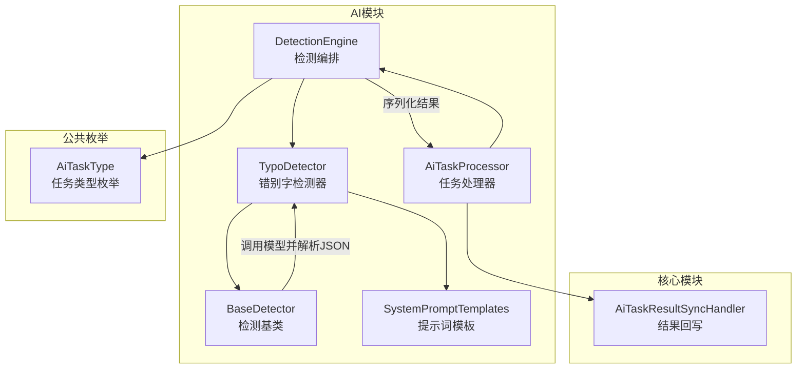
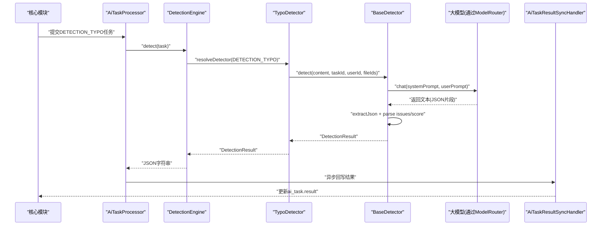
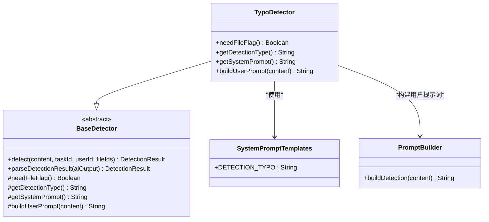
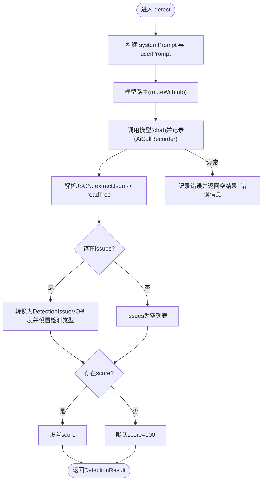
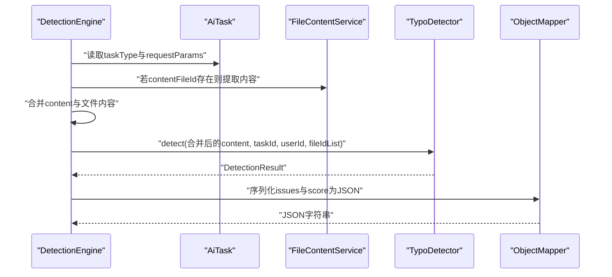
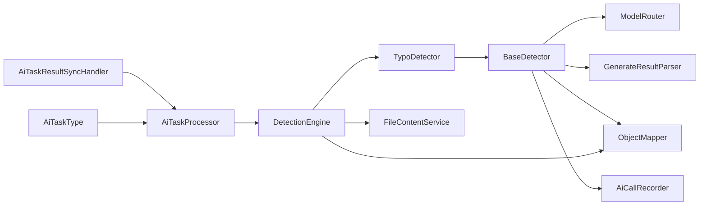

# 错别字检测

<cite>
**本文引用的文件**   
- [TypoDetector.java](file://ele-ai-tender-system/ele-ai-tender-ai/src/main/java/com/jy/eleaitender/ai/processor/checker/TypoDetector.java)
- [BaseDetector.java](file://ele-ai-tender-system/ele-ai-tender-ai/src/main/java/com/jy/eleaitender/ai/processor/checker/BaseDetector.java)
- [DetectionEngine.java](file://ele-ai-tender-system/ele-ai-tender-ai/src/main/java/com/jy/eleaitender/ai/processor/checker/DetectionEngine.java)
- [SystemPromptTemplates.java](file://ele-ai-tender-system/ele-ai-tender-ai/src/main/java/com/jy/eleaitender/ai/processor/prompt/SystemPromptTemplates.java)
- [AiTaskProcessor.java](file://ele-ai-tender-system/ele-ai-tender-ai/src/main/java/com/jy/eleaitender/ai/processor/AiTaskProcessor.java)
- [AiTaskResultSyncHandler.java](file://ele-ai-tender-system/ele-ai-tender-core/src/main/java/com/jy/eleaitender/core/scheduler/AiTaskResultSyncHandler.java)
- [AiTaskType.java](file://ele-ai-tender-system/ele-ai-tender-common/src/main/java/com/jy/eleaitender/common/enums/AiTaskType.java)
</cite>

## 目录
1. [简介](#简介)
2. [项目结构](#项目结构)
3. [核心组件](#核心组件)
4. [架构总览](#架构总览)
5. [详细组件分析](#详细组件分析)
6. [依赖关系分析](#依赖关系分析)
7. [性能与优化](#性能与优化)
8. [故障排查指南](#故障排查指南)
9. [结论](#结论)
10. [附录](#附录)

## 简介
本文件围绕“错别字检测”能力，系统性梳理 TypoDetector 的实现机制、调用链路、结果解析与评分规则，并给出可操作的配置与扩展建议。需要特别说明的是：当前仓库中的 TypoDetector 采用“提示词驱动 + 大模型推理”的方式完成错别字识别，未实现本地化的中文分词、拼音相似度计算或形近字匹配等算法；相关能力通过 System Prompt 的约束与输出格式规范来达成。

## 项目结构
与错别字检测直接相关的代码位于 AI 模块的检测器子包中，并通过任务处理器与调度器协同工作：
- 检测编排：DetectionEngine 根据任务类型分发到具体检测器（如 TypoDetector）
- 检测基类：BaseDetector 封装模型路由、调用记录、JSON 结果解析与错误兜底
- 提示词模板：SystemPromptTemplates 定义 DETECTION_TYPO 的指令与输出格式
- 任务处理：AiTaskProcessor 负责轮询并执行检测任务
- 结果回写：AiTaskResultSyncHandler 将检测结果同步至核心业务表
- 任务类型枚举：AiTaskType 定义 DETECTION_TYPO 等任务类型

图表来源
- [DetectionEngine.java:53-95](file://ele-ai-tender-system/ele-ai-tender-ai/src/main/java/com/jy/eleaitender/ai/processor/checker/DetectionEngine.java#L53-L95)
- [TypoDetector.java:15-36](file://ele-ai-tender-system/ele-ai-tender-ai/src/main/java/com/jy/eleaitender/ai/processor/checker/TypoDetector.java#L15-L36)
- [BaseDetector.java:47-118](file://ele-ai-tender-system/ele-ai-tender-ai/src/main/java/com/jy/eleaitender/ai/processor/checker/BaseDetector.java#L47-L118)
- [SystemPromptTemplates.java:379-405](file://ele-ai-tender-system/ele-ai-tender-ai/src/main/java/com/jy/eleaitender/ai/processor/prompt/SystemPromptTemplates.java#L379-L405)
- [AiTaskProcessor.java:184-184](file://ele-ai-tender-system/ele-ai-tender-ai/src/main/java/com/jy/eleaitender/ai/processor/AiTaskProcessor.java#L184-L184)
- [AiTaskResultSyncHandler.java:97-97](file://ele-ai-tender-system/ele-ai-tender-core/src/main/java/com/jy/eleaitender/core/scheduler/AiTaskResultSyncHandler.java#L97-L97)
- [AiTaskType.java:21-44](file://ele-ai-tender-system/ele-ai-tender-common/src/main/java/com/jy/eleaitender/common/enums/AiTaskType.java#L21-L44)

章节来源
- [DetectionEngine.java:53-95](file://ele-ai-tender-system/ele-ai-tender-ai/src/main/java/com/jy/eleaitender/ai/processor/checker/DetectionEngine.java#L53-L95)
- [TypoDetector.java:15-36](file://ele-ai-tender-system/ele-ai-tender-ai/src/main/java/com/jy/eleaitender/ai/processor/checker/TypoDetector.java#L15-L36)
- [BaseDetector.java:47-118](file://ele-ai-tender-system/ele-ai-tender-ai/src/main/java/com/jy/eleaitender/ai/processor/checker/BaseDetector.java#L47-L118)
- [SystemPromptTemplates.java:379-405](file://ele-ai-tender-system/ele-ai-tender-ai/src/main/java/com/jy/eleaitender/ai/processor/prompt/SystemPromptTemplates.java#L379-L405)
- [AiTaskProcessor.java:184-184](file://ele-ai-tender-system/ele-ai-tender-ai/src/main/java/com/jy/eleaitender/ai/processor/AiTaskProcessor.java#L184-L184)
- [AiTaskResultSyncHandler.java:97-97](file://ele-ai-tender-system/ele-ai-tender-core/src/main/java/com/jy/eleaitender/core/scheduler/AiTaskResultSyncHandler.java#L97-L97)
- [AiTaskType.java:21-44](file://ele-ai-tender-system/ele-ai-tender-common/src/main/java/com/jy/eleaitender/common/enums/AiTaskType.java#L21-L44)

## 核心组件
- TypoDetector：错别字检测器，继承 BaseDetector，提供检测类型、系统提示词和用户提示词构建逻辑。
- BaseDetector：检测基类，统一封装模型路由、调用记录、JSON 提取与解析、错误兜底与评分默认值。
- DetectionEngine：检测引擎（编排器），按任务类型选择具体检测器，组装输入内容并序列化结果。
- SystemPromptTemplates：集中管理各类检测任务的 System Prompt，其中 DETECTION_TYPO 定义了错别字检测范围与输出 JSON 结构。
- AiTaskProcessor：定时任务处理器，轮询并执行检测任务（包含 DETECTION_TYPO）。
- AiTaskResultSyncHandler：结果回写处理器，将检测结果同步至核心模块。
- AiTaskType：任务类型枚举，定义 DETECTION_TYPO 及其映射关系。

章节来源
- [TypoDetector.java:15-36](file://ele-ai-tender-system/ele-ai-tender-ai/src/main/java/com/jy/eleaitender/ai/processor/checker/TypoDetector.java#L15-L36)
- [BaseDetector.java:47-118](file://ele-ai-tender-system/ele-ai-tender-ai/src/main/java/com/jy/eleaitender/ai/processor/checker/BaseDetector.java#L47-L118)
- [DetectionEngine.java:53-95](file://ele-ai-tender-system/ele-ai-tender-ai/src/main/java/com/jy/eleaitender/ai/processor/checker/DetectionEngine.java#L53-L95)
- [SystemPromptTemplates.java:379-405](file://ele-ai-tender-system/ele-ai-tender-ai/src/main/java/com/jy/eleaitender/ai/processor/prompt/SystemPromptTemplates.java#L379-L405)
- [AiTaskProcessor.java:184-184](file://ele-ai-tender-system/ele-ai-tender-ai/src/main/java/com/jy/eleaitender/ai/processor/AiTaskProcessor.java#L184-L184)
- [AiTaskResultSyncHandler.java:97-97](file://ele-ai-tender-system/ele-ai-tender-core/src/main/java/com/jy/eleaitender/core/scheduler/AiTaskResultSyncHandler.java#L97-L97)
- [AiTaskType.java:21-44](file://ele-ai-tender-system/ele-ai-tender-common/src/main/java/com/jy/eleaitender/common/enums/AiTaskType.java#L21-L44)

## 架构总览
下图展示了从任务创建到错别字检测结果回写的完整流程。

图表来源
- [AiTaskProcessor.java:184-184](file://ele-ai-tender-system/ele-ai-tender-ai/src/main/java/com/jy/eleaitender/ai/processor/AiTaskProcessor.java#L184-L184)
- [DetectionEngine.java:53-95](file://ele-ai-tender-system/ele-ai-tender-ai/src/main/java/com/jy/eleaitender/ai/processor/checker/DetectionEngine.java#L53-L95)
- [TypoDetector.java:15-36](file://ele-ai-tender-system/ele-ai-tender-ai/src/main/java/com/jy/eleaitender/ai/processor/checker/TypoDetector.java#L15-L36)
- [BaseDetector.java:47-118](file://ele-ai-tender-system/ele-ai-tender-ai/src/main/java/com/jy/eleaitender/ai/processor/checker/BaseDetector.java#L47-L118)
- [AiTaskResultSyncHandler.java:97-97](file://ele-ai-tender-system/ele-ai-tender-core/src/main/java/com/jy/eleaitender/core/scheduler/AiTaskResultSyncHandler.java#L97-L97)

## 详细组件分析

### TypoDetector 组件分析
- 职责：声明检测类型为错别字检测，提供 System Prompt 与用户提示词构建方法。
- 关键行为：
  - needFileFlag() 返回 false，表示不需要额外文件ID列表参与检测。
  - getDetectionType() 返回 DetectionType.TYPO 对应的编码。
  - getSystemPrompt() 使用 SystemPromptTemplates.DETECTION_TYPO。
  - buildUserPrompt(content) 基于 PromptBuilder.buildDetection 构造用户提示词。

图表来源
- [TypoDetector.java:15-36](file://ele-ai-tender-system/ele-ai-tender-ai/src/main/java/com/jy/eleaitender/ai/processor/checker/TypoDetector.java#L15-L36)
- [BaseDetector.java:47-118](file://ele-ai-tender-system/ele-ai-tender-ai/src/main/java/com/jy/eleaitender/ai/processor/checker/BaseDetector.java#L47-L118)
- [SystemPromptTemplates.java:379-405](file://ele-ai-tender-system/ele-ai-tender-ai/src/main/java/com/jy/eleaitender/ai/processor/prompt/SystemPromptTemplates.java#L379-L405)

章节来源
- [TypoDetector.java:15-36](file://ele-ai-tender-system/ele-ai-tender-ai/src/main/java/com/jy/eleaitender/ai/processor/checker/TypoDetector.java#L15-L36)
- [SystemPromptTemplates.java:379-405](file://ele-ai-tender-system/ele-ai-tender-ai/src/main/java/com/jy/eleaitender/ai/processor/prompt/SystemPromptTemplates.java#L379-L405)

### BaseDetector 组件分析
- 职责：统一封装检测流程，包括模型路由、调用记录、JSON 提取与解析、错误处理与默认评分。
- 关键流程：
  - detect()：获取 systemPrompt 与 userPrompt，路由到模型，记录调用，解析结果。
  - parseDetectionResult()：从 LLM 返回中提取 JSON，解析 issues 列表与 score，设置检测类型，异常时返回空结果与错误信息。
  - DetectionResult：内部类，包含 issues、score、error。

图表来源
- [BaseDetector.java:47-118](file://ele-ai-tender-system/ele-ai-tender-ai/src/main/java/com/jy/eleaitender/ai/processor/checker/BaseDetector.java#L47-L118)

章节来源
- [BaseDetector.java:47-118](file://ele-ai-tender-system/ele-ai-tender-ai/src/main/java/com/jy/eleaitender/ai/processor/checker/BaseDetector.java#L47-L118)

### DetectionEngine 组件分析
- 职责：根据任务类型选择具体检测器，组装输入内容（文本与可选文件内容），执行检测并序列化结果。
- 关键点：
  - resolveDetector()：switch 分支将 DETECTION_TYPO 映射到 typoDetector。
  - detect()：合并 content 与 contentFileId 对应文件内容，调用 detector.detect(...)，最后序列化为 JSON。
  - 特殊分支：政策审查在未选择政策文件时跳过模型调用并返回默认结果。

图表来源
- [DetectionEngine.java:53-95](file://ele-ai-tender-system/ele-ai-tender-ai/src/main/java/com/jy/eleaitender/ai/processor/checker/DetectionEngine.java#L53-L95)
- [DetectionEngine.java:100-108](file://ele-ai-tender-system/ele-ai-tender-ai/src/main/java/com/jy/eleaitender/ai/processor/checker/DetectionEngine.java#L100-L108)
- [DetectionEngine.java:114-124](file://ele-ai-tender-system/ele-ai-tender-ai/src/main/java/com/jy/eleaitender/ai/processor/checker/DetectionEngine.java#L114-L124)

章节来源
- [DetectionEngine.java:53-95](file://ele-ai-tender-system/ele-ai-tender-ai/src/main/java/com/jy/eleaitender/ai/processor/checker/DetectionEngine.java#L53-L95)
- [DetectionEngine.java:100-108](file://ele-ai-tender-system/ele-ai-tender-ai/src/main/java/com/jy/eleaitender/ai/processor/checker/DetectionEngine.java#L100-L108)
- [DetectionEngine.java:114-124](file://ele-ai-tender-system/ele-ai-tender-ai/src/main/java/com/jy/eleaitender/ai/processor/checker/DetectionEngine.java#L114-L124)

### SystemPromptTemplates 与 DETECTION_TYPO
- DETECTION_TYPO 定义了错别字检测的范围（同音字、形近字、语法错误、标点符号错误、专业术语拼写错误）以及输出 JSON 结构（issues 数组与 score）。
- 重要约束：original 字段必须逐字复制原文，targeted 仅修改问题部分；评分规则明确扣分方式。

章节来源
- [SystemPromptTemplates.java:379-405](file://ele-ai-tender-system/ele-ai-tender-ai/src/main/java/com/jy/eleaitender/ai/processor/prompt/SystemPromptTemplates.java#L379-L405)

### 任务处理与结果回写
- AiTaskProcessor：在任务分发中包含 DETECTION_TYPO 分支，触发检测流程。
- AiTaskResultSyncHandler：在结果回写阶段包含 DETECTION_TYPO 分支，确保检测结果持久化。

章节来源
- [AiTaskProcessor.java:184-184](file://ele-ai-tender-system/ele-ai-tender-ai/src/main/java/com/jy/eleaitender/ai/processor/AiTaskProcessor.java#L184-L184)
- [AiTaskResultSyncHandler.java:97-97](file://ele-ai-tender-system/ele-ai-tender-core/src/main/java/com/jy/eleaitender/core/scheduler/AiTaskResultSyncHandler.java#L97-L97)

## 依赖关系分析
- TypoDetector 依赖 BaseDetector 提供的通用检测流程与结果解析。
- BaseDetector 依赖 ModelRouter（模型路由）、GenerateResultParser（JSON 提取）、ObjectMapper（JSON 解析）、AiCallRecorder（调用记录）。
- DetectionEngine 依赖 TypoDetector 及其他检测器，并依赖 FileContentService 与 ObjectMapper。
- AiTaskProcessor 与 AiTaskResultSyncHandler 通过任务类型枚举 AiTaskType 进行分支处理。

图表来源
- [TypoDetector.java:15-36](file://ele-ai-tender-system/ele-ai-tender-ai/src/main/java/com/jy/eleaitender/ai/processor/checker/TypoDetector.java#L15-L36)
- [BaseDetector.java:47-118](file://ele-ai-tender-system/ele-ai-tender-ai/src/main/java/com/jy/eleaitender/ai/processor/checker/BaseDetector.java#L47-L118)
- [DetectionEngine.java:53-95](file://ele-ai-tender-system/ele-ai-tender-ai/src/main/java/com/jy/eleaitender/ai/processor/checker/DetectionEngine.java#L53-L95)
- [AiTaskProcessor.java:184-184](file://ele-ai-tender-system/ele-ai-tender-ai/src/main/java/com/jy/eleaitender/ai/processor/AiTaskProcessor.java#L184-L184)
- [AiTaskResultSyncHandler.java:97-97](file://ele-ai-tender-system/ele-ai-tender-core/src/main/java/com/jy/eleaitender/core/scheduler/AiTaskResultSyncHandler.java#L97-L97)
- [AiTaskType.java:21-44](file://ele-ai-tender-system/ele-ai-tender-common/src/main/java/com/jy/eleaitender/common/enums/AiTaskType.java#L21-L44)

章节来源
- [TypoDetector.java:15-36](file://ele-ai-tender-system/ele-ai-tender-ai/src/main/java/com/jy/eleaitender/ai/processor/checker/TypoDetector.java#L15-L36)
- [BaseDetector.java:47-118](file://ele-ai-tender-system/ele-ai-tender-ai/src/main/java/com/jy/eleaitender/ai/processor/checker/BaseDetector.java#L47-L118)
- [DetectionEngine.java:53-95](file://ele-ai-tender-system/ele-ai-tender-ai/src/main/java/com/jy/eleaitender/ai/processor/checker/DetectionEngine.java#L53-L95)
- [AiTaskProcessor.java:184-184](file://ele-ai-tender-system/ele-ai-tender-ai/src/main/java/com/jy/eleaitender/ai/processor/AiTaskProcessor.java#L184-L184)
- [AiTaskResultSyncHandler.java:97-97](file://ele-ai-tender-system/ele-ai-tender-core/src/main/java/com/jy/eleaitender/core/scheduler/AiTaskResultSyncHandler.java#L97-L97)
- [AiTaskType.java:21-44](file://ele-ai-tender-system/ele-ai-tender-common/src/main/java/com/jy/eleaitender/common/enums/AiTaskType.java#L21-L44)

## 性能与优化
- 当前实现未内置本地化分词、拼音相似度或形近字匹配算法，错别字识别由大模型在提示词约束下完成，因此性能主要受模型调用耗时与并发度影响。
- 建议优化方向（结合现有架构）：
  - 并发与线程池：参考动态线程池改造思路，提升 AiTaskProcessor 的并发处理能力，避免顺序执行导致的阻塞。
  - 缓存策略：对相同内容的检测结果进行缓存（例如以内容哈希为键），减少重复模型调用。
  - 增量更新：当文档发生局部变更时，仅对受影响段落重新检测，降低整体开销。
  - 超时与重试：在 BaseDetector 层增加超时控制与有限次重试，提高鲁棒性。
  - 结果校验：在 parseDetectionResult 中对 JSON 结构进行更严格的校验，提前拦截异常响应。

[本节为通用指导，不直接分析具体文件]

## 故障排查指南
- 常见问题定位：
  - 检测结果解析失败：检查 BaseDetector.parseDetectionResult 的异常日志，确认 LLM 返回是否包含合法 JSON 片段。
  - 评分异常：核对 SystemPromptTemplates.DETECTION_TYPO 的评分规则与 issues 数量是否一致。
  - 任务未执行：确认 AiTaskProcessor 的 DETECTION_TYPO 分支是否被正确触发。
  - 结果未回写：检查 AiTaskResultSyncHandler 的 DETECTION_TYPO 分支是否被执行。
- 建议排查步骤：
  - 查看 DetectionEngine 的日志，确认输入内容拼接是否正确（含 content 与 contentFileId）。
  - 检查 AiCallRecorder 的调用记录，确认 model 名称与请求参数。
  - 验证 AiTaskType 枚举中 DETECTION_TYPO 的定义与映射关系。

章节来源
- [BaseDetector.java:88-118](file://ele-ai-tender-system/ele-ai-tender-ai/src/main/java/com/jy/eleaitender/ai/processor/checker/BaseDetector.java#L88-L118)
- [SystemPromptTemplates.java:379-405](file://ele-ai-tender-system/ele-ai-tender-ai/src/main/java/com/jy/eleaitender/ai/processor/prompt/SystemPromptTemplates.java#L379-L405)
- [AiTaskProcessor.java:184-184](file://ele-ai-tender-system/ele-ai-tender-ai/src/main/java/com/jy/eleaitender/ai/processor/AiTaskProcessor.java#L184-L184)
- [AiTaskResultSyncHandler.java:97-97](file://ele-ai-tender-system/ele-ai-tender-core/src/main/java/com/jy/eleaitender/core/scheduler/AiTaskResultSyncHandler.java#L97-L97)
- [AiTaskType.java:21-44](file://ele-ai-tender-system/ele-ai-tender-common/src/main/java/com/jy/eleaitender/common/enums/AiTaskType.java#L21-L44)

## 结论
当前 TypoDetector 采用“提示词驱动 + 大模型推理”的错别字检测方案，具备较强的语义理解与上下文纠错能力，但缺少本地化分词、拼音相似度与形近字匹配等算法实现。通过完善提示词模板、增强结果解析健壮性、引入缓存与并发优化，可在保证准确率的同时显著提升性能与稳定性。后续可根据领域需求扩展词典与规则，并结合增量更新策略进一步优化成本与时效。

[本节为总结性内容，不直接分析具体文件]

## 附录

### 错别字规则配置与阈值调整
- 规则配置：通过 SystemPromptTemplates.DETECTION_TYPO 调整检测范围与评分规则。
- 阈值调整：可在 BaseDetector.parseDetectionResult 中根据业务需要对 score 与 issues 数量进行过滤或加权。

章节来源
- [SystemPromptTemplates.java:379-405](file://ele-ai-tender-system/ele-ai-tender-ai/src/main/java/com/jy/eleaitender/ai/processor/prompt/SystemPromptTemplates.java#L379-L405)
- [BaseDetector.java:88-118](file://ele-ai-tender-system/ele-ai-tender-ai/src/main/java/com/jy/eleaitender/ai/processor/checker/BaseDetector.java#L88-L118)

### 领域词典扩展指南
- 当前未实现本地词典与形近字库，建议在提示词中补充领域术语与常见错误示例，以提升召回率与准确性。
- 如需强规则覆盖，可在 DetectionEngine 层增加规则引擎前置过滤，再交由大模型进行语义修正。

[本节为概念性指导，不直接分析具体文件]