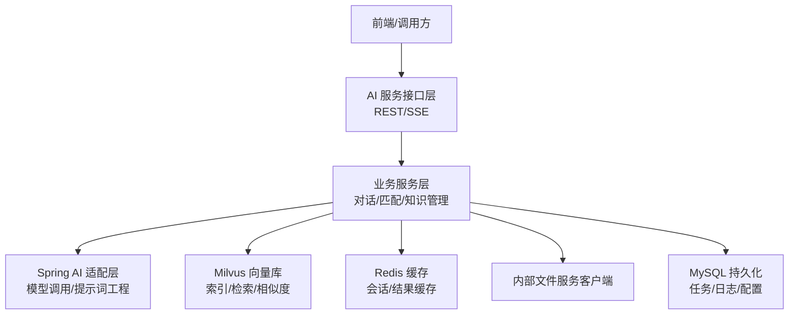
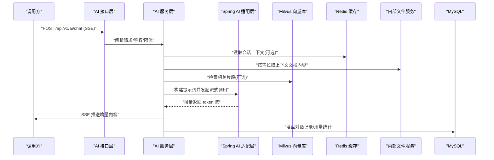
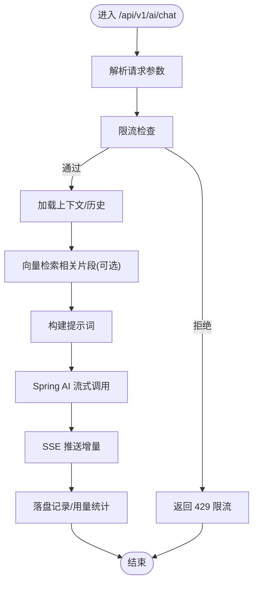
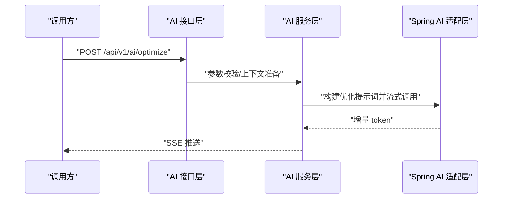
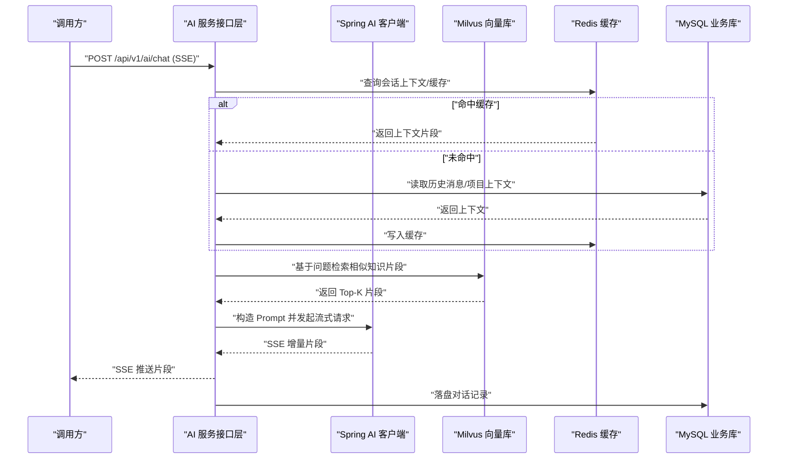
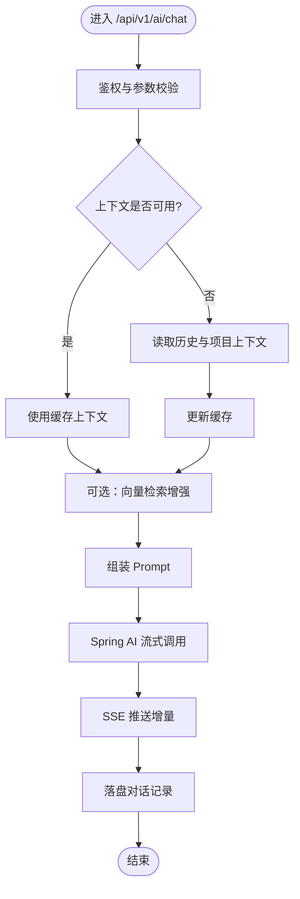
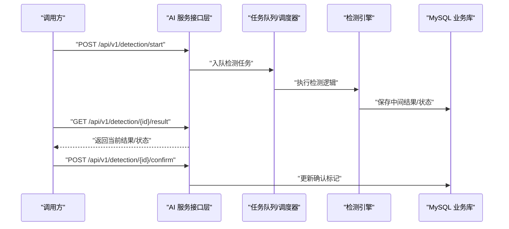
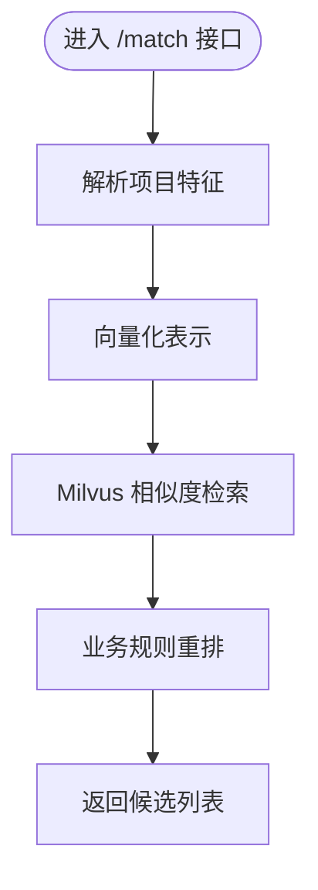
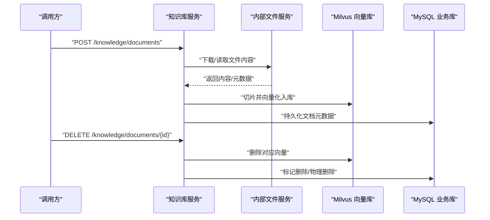
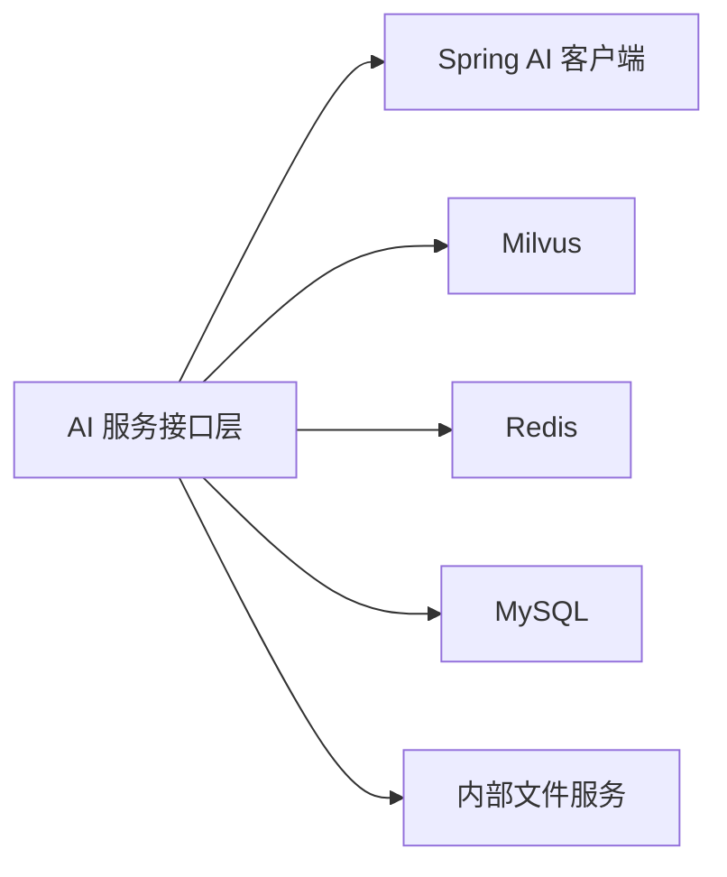

# AI服务API

<cite>
**本文引用的文件**   
- [application.yml](file://ele-ai-tender-system/ele-ai-tender-ai/src/main/resources/application.yml)
- [OpenAI API 文档（ele-ai-tender-ai.yml）](file://docs/guides/ele-ai-tender-ai.yml)
</cite>

## 目录
1. [简介](#简介)
2. [项目结构](#项目结构)
3. [核心组件](#核心组件)
4. [架构总览](#架构总览)
5. [详细组件分析](#详细组件分析)
6. [依赖关系分析](#依赖关系分析)
7. [性能与可靠性](#性能与可靠性)
8. [故障排查指南](#故障排查指南)
9. [结论](#结论)
10. [附录：接口清单与调用示例](#附录接口清单与调用示例)

## 简介
本文件为 AI 服务模块的对外 API 规范说明，覆盖以下能力：
- AI 对话、文本优化与建议生成
- 知识库文档上传与管理
- 历史需求自动/手动匹配（相似度分析与候选推荐）
- Spring AI 集成方式、提示词工程接口、向量数据库操作
- 异步任务处理、流式响应（SSE）、模型路由选择
- 限流策略、缓存机制与错误重试机制

## 项目结构
AI 服务以 Spring Boot 应用形式提供 HTTP 接口，并通过 Spring AI 对接大模型；使用 Milvus 作为向量数据库进行语义检索与相似度计算；通过 Redis 支撑会话上下文与缓存；通过内部文件服务客户端获取文档内容。



图表来源
- [application.yml:1-72](file://ele-ai-tender-system/ele-ai-tender-ai/src/main/resources/application.yml#L1-L72)

章节来源
- [application.yml:1-72](file://ele-ai-tender-system/ele-ai-tender-ai/src/main/resources/application.yml#L1-L72)

## 核心组件
- 对话与生成
  - 支持 SSE 流式对话与同步建议两种模式
  - 支持多轮历史上下文注入
- 文本优化
  - 基于提示词工程的文本润色与改写
- 知识库管理
  - 文档上传、分类、删除等基础能力
- 文档匹配
  - 自动匹配与手动候选列表返回
  - 基于向量相似度评分与排序
- 模型路由与连接性测试
  - 可配置模型参数与连通性校验

章节来源
- [OpenAI API 文档（ele-ai-tender-ai.yml）:1-255](file://docs/guides/ele-ai-tender-ai.yml#L1-L255)

## 架构总览
下图展示一次“AI 对话（SSE 流式响应）”的典型调用链路，包括请求解析、上下文组装、模型路由、流式输出与日志记录。



图表来源
- [OpenAI API 文档（ele-ai-tender-ai.yml）:4-44](file://docs/guides/ele-ai-tender-ai.yml#L4-L44)
- [application.yml:28-35](file://ele-ai-tender-system/ele-ai-tender-ai/src/main/resources/application.yml#L28-L35)

## 详细组件分析

### 1) AI 对话接口（SSE 流式）
- 路径与方法
  - POST /api/v1/ai/chat
- 功能说明
  - 支持多轮对话，返回增量 token 流（SSE）
  - 支持携带项目标识与上下文信息
- 请求体字段
  - message: string，用户当前消息
  - projectId: string，项目标识
  - context: string，附加上下文
  - history: array<object>，历史消息，包含 role 与 content
- 响应
  - SSE 事件流，逐块返回增量内容
- 典型流程
  - 校验与限流 -> 加载上下文 -> 检索相关知识 -> 构建提示词 -> 流式生成 -> 落盘记录



图表来源
- [OpenAI API 文档（ele-ai-tender-ai.yml）:4-44](file://docs/guides/ele-ai-tender-ai.yml#L4-L44)

章节来源
- [OpenAI API 文档（ele-ai-tender-ai.yml）:4-44](file://docs/guides/ele-ai-tender-ai.yml#L4-L44)

### 2) 文本优化接口（SSE 流式）
- 路径与方法
  - POST /api/v1/ai/optimize
- 功能说明
  - 对给定内容进行风格/质量优化，返回增量结果
- 请求体字段
  - content: string，待优化文本
  - requirement: string，优化要求或约束
  - projectId: string，项目标识
- 响应
  - SSE 事件流，逐步返回优化后的文本片段



图表来源
- [OpenAI API 文档（ele-ai-tender-ai.yml）:44-69](file://docs/guides/ele-ai-tender-ai.yml#L44-L69)

章节来源
- [OpenAI API 文档（ele-ai-tender-ai.yml）:44-69](file://docs/guides/ele-ai-tender-ai.yml#L44-L69)

### 3) 获取 AI 建议（同步）
- 路径与方法
  - POST /api/v1/ai/suggest
- 功能说明
  - 根据消息与上下文返回一次性建议结果
- 请求体字段
  - message: string
  - projectId: string
  - context: string
  - history: array<object>（role, content）
- 响应
  - JSON 对象，包含建议内容

章节来源
- [OpenAI API 文档（ele-ai-tender-ai.yml）:70-109](file://docs/guides/ele-ai-tender-ai.yml#L70-L109)

### 4) 检测任务接口（异步）
- 启动检测
  - POST /api/v1/detection/start
  - 请求体字段：projectId, detectionType, contentSnapshot
- 获取检测结果
  - GET /api/v1/detection/{id}/result
- 确认检测结果
  - POST /api/v1/detection/{id}/confirm

```mermaid
sequenceDiagram
participant C as "调用方"
participant API as "AI 接口层"
participant S as "AI 服务层"
participant Q as "任务队列/调度"
participant D as "MySQL"
C->>API : "POST /api/v1/detection/start"
API->>S : "创建任务/入队"
S->>Q : "提交异步任务"
S->>D : "写入任务初始状态"
S-->>C : "返回 taskId"
C->>API : "GET /api/v1/detection/{</think>
<docs>
# AI服务API
<cite>
**本文引用的文件**
- [application.yml](file : //ele-ai-tender-system/ele-ai-tender-ai/src/main/resources/application.yml)
- [OpenAI 配置示例](file : //docs/guides/ele-ai-tender-ai.yml)
</cite>
## 目录
1. [简介](#简介)
2. [项目结构](#项目结构)
3. [核心组件](#核心组件)
4. [架构总览](#架构总览)
5. [详细组件分析](#详细组件分析)
6. [依赖分析](#依赖分析)
7. [性能考虑](#性能考虑)
8. [故障排查指南](#故障排查指南)
9. [结论](#结论)
10. [附录](#附录)
## 简介
本文件为 AI 服务模块的 API 接口文档，覆盖以下能力：
- AI 对话与文本优化支持 SSE 流式响应
- 知识库文档上传与管理
- 历史需求自动/手动匹配相似度分析与候选推荐
- Spring AI 集成调用方式、提示词工程接口、向量数据库操作接口
- 异步任务处理、流式响应、模型路由选择等技术要点
- AI 内容生成、质量检测、相似度分析的调用示例与参数说明
- 限流策略、缓存机制与错误重试机制的配置建议
## 项目结构
AI 服务以 Spring Boot 应用形式提供 REST 接口，并通过 Spring AI 对接大模型，使用 Milvus 作为向量数据库进行语义检索与相似度计算。关键配置包括：
- 服务端口、字符编码、日志级别
- 数据源与 MyBatis-Plus 映射
- Redis 连接信息
- Spring AI OpenAI 兼容客户端配置API Key、Base URL、默认模型
- Milvus 向量库连接信息
- JWT 与安全相关配置
- 内部文件服务客户端基础地址与密钥
```mermaid
graph TB
    Client["前端/调用方"] --> API["AI 服务接口层<br/>REST/SSE"]
    API --> SpringAI["Spring AI 客户端<br/>OpenAI 兼容"]
    API --> VectorDB["Milvus 向量数据库"]
    API --> Cache["Redis 缓存"]
    API --> DB["MySQL 业务库"]
    API --> FileSvc["内部文件服务"]
```

图表来源
- [application.yml:1-72](file://ele-ai-tender-system/ele-ai-tender-ai/src/main/resources/application.yml#L1-L72)

章节来源
- [application.yml:1-72](file://ele-ai-tender-system/ele-ai-tender-ai/src/main/resources/application.yml#L1-L72)

## 核心组件
- AI 对话与优化接口
  - 对话：POST /api/v1/ai/chat（SSE 流式）
  - 优化：POST /api/v1/ai/optimize（SSE 流式）
  - 建议：POST /api/v1/ai/suggest（同步）
- 检测与质量相关接口
  - 启动检测：POST /api/v1/detection/start
  - 获取检测结果：GET /api/v1/detection/{id}/result
  - 确认检测结果：POST /api/v1/detection/{id}/confirm
- 文档匹配接口
  - 自动匹配：POST /api/v1/ai/match/auto
  - 手动候选：POST /api/v1/ai/match/manual
- 知识库管理接口
  - 上传知识文档：POST /api/v1/knowledge/documents
  - 删除知识文档：DELETE /api/v1/knowledge/documents/{id}

章节来源
- [OpenAI 配置示例:1-255](file://docs/guides/ele-ai-tender-ai.yml#L1-L255)

## 架构总览
下图展示了从请求到响应的整体流程，包含 Spring AI 调用、向量检索、缓存与持久化等关键环节。



图表来源
- [OpenAI 配置示例:1-255](file://docs/guides/ele-ai-tender-ai.yml#L1-L255)
- [application.yml:1-72](file://ele-ai-tender-system/ele-ai-tender-ai/src/main/resources/application.yml#L1-L72)

## 详细组件分析

### AI 对话接口（SSE 流式）
- 接口路径：POST /api/v1/ai/chat
- 功能说明：接收用户消息、项目标识、上下文与历史消息，返回流式增量文本。
- 请求体字段
  - message：当前用户输入
  - projectId：项目标识
  - context：附加上下文
  - history：历史消息数组，元素含 role 与 content
- 响应模式：SSE 流式，逐段推送生成结果
- 典型流程
  - 校验参数与鉴权
  - 加载或构建上下文（优先缓存，否则读库）
  - 可选：向量检索增强（Milvus）
  - 通过 Spring AI 发起流式调用
  - 将增量片段转发给客户端
  - 异步落盘对话记录



章节来源
- [OpenAI 配置示例:1-255](file://docs/guides/ele-ai-tender-ai.yml#L1-L255)

### 文本优化接口（SSE 流式）
- 接口路径：POST /api/v1/ai/optimize
- 功能说明：对给定内容进行风格/合规性/表达优化，返回流式结果。
- 请求体字段
  - content：待优化文本
  - requirement：优化要求
  - projectId：项目标识
- 响应模式：SSE 流式
- 典型流程
  - 校验参数
  - 根据 requirement 动态拼装优化提示词
  - 通过 Spring AI 流式调用
  - 增量输出至客户端
  - 记录调用日志

章节来源
- [OpenAI 配置示例:1-255](file://docs/guides/ele-ai-tender-ai.yml#L1-L255)

### 获取建议接口（同步）
- 接口路径：POST /api/v1/ai/suggest
- 功能说明：返回一次性完整建议，适用于短文本场景。
- 请求体字段
  - message：用户输入
  - projectId：项目标识
  - context：附加上下文
  - history：历史消息数组
- 响应模式：同步 JSON

章节来源
- [OpenAI 配置示例:1-255](file://docs/guides/ele-ai-tender-ai.yml#L1-L255)

### 检测与质量相关接口
- 启动检测：POST /api/v1/detection/start
  - 作用：提交检测任务，支持指定检测类型与内容快照
  - 关键字段：projectId、detectionType、contentSnapshot
- 获取检测结果：GET /api/v1/detection/{id}/result
  - 作用：轮询或回调获取检测结果
- 确认检测结果：POST /api/v1/detection/{id}/confirm
  - 作用：人工确认或修正检测结果



章节来源
- [OpenAI 配置示例:1-255](file://docs/guides/ele-ai-tender-ai.yml#L1-L255)

### 文档匹配接口（相似度分析）
- 自动匹配：POST /api/v1/ai/match/auto
  - 作用：基于项目特征自动匹配历史需求
  - 关键字段：projectType、projectCategory、budget、description、projectName
- 手动候选：POST /api/v1/ai/match/manual
  - 作用：返回候选列表供人工选择
  - 关键字段：同上
- 技术要点
  - 使用向量检索进行相似度计算（Milvus）
  - 可结合业务规则进行二次筛选与排序
  - 返回候选集合及相似度分数



章节来源
- [OpenAI 配置示例:1-255](file://docs/guides/ele-ai-tender-ai.yml#L1-L255)

### 知识库管理接口
- 上传知识文档：POST /api/v1/knowledge/documents
  - 作用：将外部文件纳入知识库，建立索引
  - 关键字段：docName、docCategory、fileId、fileType
- 删除知识文档：DELETE /api/v1/knowledge/documents/{id}
  - 作用：从知识库中移除文档并清理索引



章节来源
- [OpenAI 配置示例:1-255](file://docs/guides/ele-ai-tender-ai.yml#L1-L255)

### Spring AI 集成与提示词工程
- 集成方式
  - 通过 OpenAI 兼容客户端接入（如 DeepSeek），在配置中设置 API Key、Base URL 与默认模型
  - 支持流式与非流式两种调用模式
- 提示词工程接口
  - 对话：按角色与历史消息组织上下文，注入领域知识与检索片段
  - 优化：根据 requirement 动态生成优化指令
  - 建议：精简上下文，聚焦单点问题
- 模型路由选择
  - 可按场景/负载/成本选择不同模型
  - 建议在网关或服务层实现路由策略（例如按项目类型、优先级、可用性）

章节来源
- [application.yml:28-35](file://ele-ai-tender-system/ele-ai-tender-ai/src/main/resources/application.yml#L28-L35)
- [OpenAI 配置示例:1-255](file://docs/guides/ele-ai-tender-ai.yml#L1-L255)

### 向量数据库操作接口（Milvus）
- 用途
  - 文档切片与向量化入库
  - 相似度检索（Top-K）
  - 向量删除与更新
- 配置项
  - host、port、database 等连接参数
- 使用建议
  - 合理设置 chunk 大小与重叠比例
  - 为常用维度添加索引以提升检索性能
  - 控制批量写入规模，避免阻塞

章节来源
- [application.yml:50-54](file://ele-ai-tender-system/ele-ai-tender-ai/src/main/resources/application.yml#L50-L54)

## 依赖分析
- 外部依赖
  - Spring AI（OpenAI 兼容客户端）
  - Milvus（向量数据库）
  - MySQL（业务数据）
  - Redis（缓存与会话）
  - 内部文件服务（文件内容获取）
- 耦合关系
  - 接口层依赖 Spring AI 与向量检索
  - 向量检索依赖 Milvus
  - 缓存与持久化分别依赖 Redis 与 MySQL
  - 文件内容依赖内部文件服务



图表来源
- [application.yml:1-72](file://ele-ai-tender-system/ele-ai-tender-ai/src/main/resources/application.yml#L1-L72)

章节来源
- [application.yml:1-72](file://ele-ai-tender-system/ele-ai-tender-ai/src/main/resources/application.yml#L1-L72)

## 性能考虑
- 流式响应
  - 采用 SSE 降低首字节延迟，提升交互体验
  - 服务端需控制生成速率与缓冲大小
- 缓存机制
  - 会话上下文与高频检索结果可缓存于 Redis
  - 合理设置 TTL 与失效策略
- 向量检索
  - 调整 Top-K 与阈值平衡召回率与耗时
  - 对热点知识预热索引
- 异步任务
  - 检测类长耗时任务入队，避免阻塞请求线程
  - 提供轮询或回调机制
- 限流与熔断
  - 针对外部模型调用实施令牌桶/滑动窗口限流
  - 失败快速降级与熔断保护
- 重试机制
  - 对幂等请求启用指数退避重试
  - 区分网络异常与业务异常，避免重复副作用

[本节为通用指导，不直接分析具体文件]

## 故障排查指南
- 常见问题定位
  - 模型不可用：检查 API Key、Base URL、网络连通性与配额
  - 向量检索超时：检查 Milvus 实例健康、索引状态与查询参数
  - 缓存异常：检查 Redis 连接、权限与内存水位
  - 文件服务不可达：检查内部文件服务地址与鉴权
- 日志与追踪
  - 开启 traceId 透传，便于跨服务链路追踪
  - 关注 Spring AI 与向量库的调试日志
- 恢复策略
  - 临时切换备用模型或关闭向量增强
  - 降级为同步非流式响应
  - 暂停非关键写入，保障核心链路

章节来源
- [application.yml:66-72](file://ele-ai-tender-system/ele-ai-tender-ai/src/main/resources/application.yml#L66-L72)

## 结论
本 API 文档围绕 AI 对话、文本优化、检测与质量、文档匹配与知识库管理等核心能力，给出了接口规范、调用流程与技术要点。通过 Spring AI 与 Milvus 的协同，系统实现了高效的语义检索与流式生成；配合缓存、限流、重试与异步任务，保障了高可用与可扩展性。

[本节为总结性内容，不直接分析具体文件]

## 附录

### 接口清单与参数速查
- POST /api/v1/ai/chat
  - 字段：message, projectId, context, history[]
  - 响应：SSE 流式
- POST /api/v1/ai/optimize
  - 字段：content, requirement, projectId
  - 响应：SSE 流式
- POST /api/v1/ai/suggest
  - 字段：message, projectId, context, history[]
  - 响应：同步 JSON
- POST /api/v1/detection/start
  - 字段：projectId, detectionType, contentSnapshot
- GET /api/v1/detection/{id}/result
- POST /api/v1/detection/{id}/confirm
- POST /api/v1/ai/match/auto
  - 字段：projectType, projectCategory, budget, description, projectName
- POST /api/v1/ai/match/manual
  - 字段：同上
- POST /api/v1/knowledge/documents
  - 字段：docName, docCategory, fileId, fileType
- DELETE /api/v1/knowledge/documents/{id}

章节来源
- [OpenAI 配置示例:1-255](file://docs/guides/ele-ai-tender-ai.yml#L1-L255)

### 配置项参考
- Spring AI（OpenAI 兼容）
  - api-key、base-url、chat.options.model
- Milvus
  - host、port、database
- Redis
  - host、port、password、database、timeout
- 数据源与 MyBatis-Plus
  - url、username、password、mapper-locations、type-aliases-package、全局表前缀与逻辑删除字段
- 内部文件服务
  - base-url、jwt-secret
- 日志
  - pattern、level

章节来源
- [application.yml:1-72](file://ele-ai-tender-system/ele-ai-tender-ai/src/main/resources/application.yml#L1-L72)