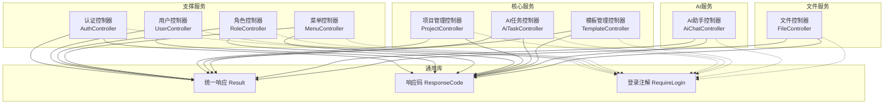
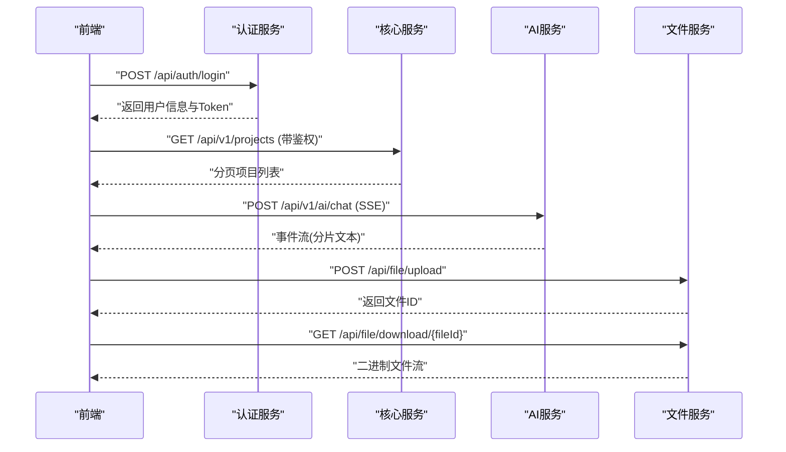
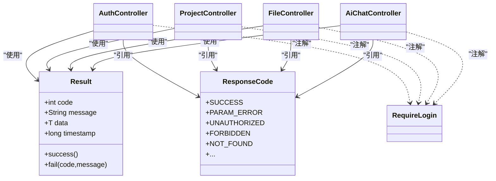

# API接口文档

<cite>
**本文引用的文件**   
- [AuthController.java](file://ele-ai-tender-system/ele-ai-tender-support/src/main/java/com/jy/eleaitender/support/controller/AuthController.java)
- [UserController.java](file://ele-ai-tender-system/ele-ai-tender-support/src/main/java/com/jy/eleaitender/support/controller/UserController.java)
- [RoleController.java](file://ele-ai-tender-system/ele-ai-tender-support/src/main/java/com/jy/eleaitender/support/controller/RoleController.java)
- [MenuController.java](file://ele-ai-tender-system/ele-ai-tender-support/src/main/java/com/jy/eleaitender/support/controller/MenuController.java)
- [ProjectController.java](file://ele-ai-tender-system/ele-ai-tender-core/src/main/java/com/jy/eleaitender/core/controller/ProjectController.java)
- [AiTaskController.java](file://ele-ai-tender-system/ele-ai-tender-core/src/main/java/com/jy/eleaitender/core/controller/AiTaskController.java)
- [TemplateController.java](file://ele-ai-tender-system/ele-ai-tender-core/src/main/java/com/jy/eleaitender/core/controller/TemplateController.java)
- [FileController.java](file://ele-ai-tender-system/ele-ai-tender-file/src/main/java/com/jy/eleaitender/file/controller/FileController.java)
- [AiChatController.java](file://ele-ai-tender-system/ele-ai-tender-ai/src/main/java/com/jy/eleaitender/ai/controller/AiChatController.java)
- [ResponseCode.java](file://ele-ai-tender-system/ele-ai-tender-common/src/main/java/com/jy/eleaitender/common/enums/ResponseCode.java)
- [Result.java](file://ele-ai-tender-system/ele-ai-tender-common/src/main/java/com/jy/eleaitender/common/response/Result.java)
- [RequireLogin.java](file://ele-ai-tender-system/ele-ai-tender-common/src/main/java/com/jy/eleaitender/common/security/annotation/RequireLogin.java)
</cite>

## 目录
1. [简介](#简介)
2. [项目结构](#项目结构)
3. [核心组件](#核心组件)
4. [架构总览](#架构总览)
5. [详细接口说明](#详细接口说明)
6. [依赖关系分析](#依赖关系分析)
7. [性能与限流缓存](#性能与限流缓存)
8. [安全与签名校验](#安全与签名校验)
9. [WebSocket与SSE实时通信](#websocket与sse实时通信)
10. [文件上传下载规范](#文件上传下载规范)
11. [错误码与异常处理](#错误码与异常处理)
12. [客户端集成指南](#客户端集成指南)
13. [调试工具与排障](#调试工具与排障)
14. [结论](#结论)

## 简介
本文件为“招标文件AI编制系统”的API接口文档，覆盖认证授权、RESTful接口、统一响应格式、版本管理、SSE流式交互、文件服务以及错误码定义等。读者可据此完成前后端对接、第三方系统集成与运维排障。

## 项目结构
后端采用多模块微服务化组织：
- 支撑服务（support）：认证、用户、角色、菜单等基础能力
- 核心服务（core）：项目、模板、AI任务编排
- AI服务（ai）：对话、文本优化、建议等AI能力
- 文件服务（file）：文件上传、下载、Word文档结构与生成
- 通用库（common）：统一响应、枚举、注解、安全上下文等

图表来源
- [AuthController.java:1-129](file://ele-ai-tender-system/ele-ai-tender-support/src/main/java/com/jy/eleaitender/support/controller/AuthController.java#L1-L129)
- [UserController.java:1-103](file://ele-ai-tender-system/ele-ai-tender-support/src/main/java/com/jy/eleaitender/support/controller/UserController.java#L1-L103)
- [RoleController.java:1-98](file://ele-ai-tender-system/ele-ai-tender-support/src/main/java/com/jy/eleaitender/support/controller/RoleController.java#L1-L98)
- [MenuController.java:1-80](file://ele-ai-tender-system/ele-ai-tender-support/src/main/java/com/jy/eleaitender/support/controller/MenuController.java#L1-L80)
- [ProjectController.java:1-159](file://ele-ai-tender-system/ele-ai-tender-core/src/main/java/com/jy/eleaitender/core/controller/ProjectController.java#L1-L159)
- [AiTaskController.java:1-52](file://ele-ai-tender-system/ele-ai-tender-core/src/main/java/com/jy/eleaitender/core/controller/AiTaskController.java#L1-L52)
- [TemplateController.java:1-52](file://ele-ai-tender-system/ele-ai-tender-core/src/main/java/com/jy/eleaitender/core/controller/TemplateController.java#L1-L52)
- [FileController.java:1-177](file://ele-ai-tender-system/ele-ai-tender-file/src/main/java/com/jy/eleaitender/file/controller/FileController.java#L1-L177)
- [AiChatController.java:1-57](file://ele-ai-tender-system/ele-ai-tender-ai/src/main/java/com/jy/eleaitender/ai/controller/AiChatController.java#L1-L57)
- [Result.java:1-105](file://ele-ai-tender-system/ele-ai-tender-common/src/main/java/com/jy/eleaitender/common/response/Result.java#L1-L105)
- [ResponseCode.java:1-168](file://ele-ai-tender-system/ele-ai-tender-common/src/main/java/com/jy/eleaitender/common/enums/ResponseCode.java#L1-L168)
- [RequireLogin.java:1-14](file://ele-ai-tender-system/ele-ai-tender-common/src/main/java/com/jy/eleaitender/common/security/annotation/RequireLogin.java#L1-L14)

章节来源
- [AuthController.java:1-129](file://ele-ai-tender-system/ele-ai-tender-support/src/main/java/com/jy/eleaitender/support/controller/AuthController.java#L1-L129)
- [ProjectController.java:1-159](file://ele-ai-tender-system/ele-ai-tender-core/src/main/java/com/jy/eleaitender/core/controller/ProjectController.java#L1-L159)
- [FileController.java:1-177](file://ele-ai-tender-system/ele-ai-tender-file/src/main/java/com/jy/eleaitender/file/controller/FileController.java#L1-L177)
- [AiChatController.java:1-57](file://ele-ai-tender-system/ele-ai-tender-ai/src/main/java/com/jy/eleaitender/ai/controller/AiChatController.java#L1-L57)
- [Result.java:1-105](file://ele-ai-tender-system/ele-ai-tender-common/src/main/java/com/jy/eleaitender/common/response/Result.java#L1-L105)
- [ResponseCode.java:1-168](file://ele-ai-tender-system/ele-ai-tender-common/src/main/java/com/jy/eleaitender/common/enums/ResponseCode.java#L1-L168)
- [RequireLogin.java:1-14](file://ele-ai-tender-system/ele-ai-tender-common/src/main/java/com/jy/eleaitender/common/security/annotation/RequireLogin.java#L1-L14)

## 核心组件
- 统一响应体 Result：包含 code、message、data、timestamp，提供 success/fail 静态方法
- 响应码枚举 ResponseCode：全局状态码与业务错误码
- 登录注解 RequireLogin：用于标注需鉴权的接口
- 各业务控制器：按领域划分，暴露 RESTful 接口

章节来源
- [Result.java:1-105](file://ele-ai-tender-system/ele-ai-tender-common/src/main/java/com/jy/eleaitender/common/response/Result.java#L1-L105)
- [ResponseCode.java:1-168](file://ele-ai-tender-system/ele-ai-tender-common/src/main/java/com/jy/eleaitender/common/enums/ResponseCode.java#L1-L168)
- [RequireLogin.java:1-14](file://ele-ai-tender-system/ele-ai-tender-common/src/main/java/com/jy/eleaitender/common/security/annotation/RequireLogin.java#L1-L14)

## 架构总览
- 前端通过HTTP访问各服务；受保护接口需携带有效会话令牌
- 认证服务负责登录、登出、获取公钥、短信验证码等
- 核心服务承载项目、模板、AI任务生命周期
- AI服务提供SSE流式对话与优化
- 文件服务提供上传、下载、Word文档结构与生成

图表来源
- [AuthController.java:54-59](file://ele-ai-tender-system/ele-ai-tender-support/src/main/java/com/jy/eleaitender/support/controller/AuthController.java#L54-L59)
- [ProjectController.java:35-49](file://ele-ai-tender-system/ele-ai-tender-core/src/main/java/com/jy/eleaitender/core/controller/ProjectController.java#L35-L49)
- [AiChatController.java:30-38](file://ele-ai-tender-system/ele-ai-tender-ai/src/main/java/com/jy/eleaitender/ai/controller/AiChatController.java#L30-L38)
- [FileController.java:50-58](file://ele-ai-tender-system/ele-ai-tender-file/src/main/java/com/jy/eleaitender/file/controller/FileController.java#L50-L58)
- [FileController.java:60-86](file://ele-ai-tender-system/ele-ai-tender-file/src/main/java/com/jy/eleaitender/file/controller/FileController.java#L60-L86)

## 详细接口说明

### 认证与权限
- 获取RSA公钥
  - 方法: GET
  - 路径: /api/auth/public-key
  - 鉴权: 否
  - 请求参数: 无
  - 响应: Result<RsaKeyUtil.PublicKeyInfo>
- 用户登录
  - 方法: POST
  - 路径: /api/auth/login
  - 鉴权: 否
  - 请求体: UserLoginRequest
  - 响应: Result<UserLoginResponse>
- 发送手机验证码
  - 方法: POST
  - 路径: /api/auth/send-sms-code
  - 鉴权: 否
  - 请求体: SendSmsCodeRequest
  - 响应: Result<String>
- 手机验证码登录
  - 方法: POST
  - 路径: /api/auth/phone-login
  - 鉴权: 否
  - 请求体: PhoneLoginRequest
  - 响应: Result<UserLoginResponse>
- 短信验证码重置密码
  - 方法: POST
  - 路径: /api/auth/reset-password
  - 鉴权: 否
  - 请求体: ResetPasswordRequest
  - 响应: Result<Void>
- 用户登出
  - 方法: POST
  - 路径: /api/auth/logout
  - 鉴权: 是
  - 响应: Result<Void>
- 获取当前用户信息
  - 方法: GET
  - 路径: /api/auth/userinfo 或 /api/auth/info
  - 鉴权: 是
  - 响应: Result<UserLoginResponse.UserInfo>
- 获取当前用户菜单
  - 方法: GET
  - 路径: /api/auth/menus
  - 鉴权: 是
  - 响应: Result<List<SysMenu>>
- 修改当前用户密码
  - 方法: POST
  - 路径: /api/auth/change-password
  - 鉴权: 是
  - 请求体: Map<"keyId", String>, Map<"oldPassword", String>, Map<"newPassword", String>
  - 响应: Result<Void>

章节来源
- [AuthController.java:48-127](file://ele-ai-tender-system/ele-ai-tender-support/src/main/java/com/jy/eleaitender/support/controller/AuthController.java#L48-L127)

### 用户管理
- 分页查询用户
  - 方法: GET
  - 路径: /api/users
  - 鉴权: 是
  - 查询参数: pageNum, pageSize, username, realName, status
  - 响应: Result<Page<SysUser>>
- 获取用户详情
  - 方法: GET
  - 路径: /api/users/{id}
  - 鉴权: 是
  - 响应: Result<SysUser>
- 创建用户
  - 方法: POST
  - 路径: /api/users
  - 鉴权: 是
  - 请求体: SysUser
  - 响应: Result<SysUser>
- 更新用户
  - 方法: PUT
  - 路径: /api/users/{id}
  - 鉴权: 是
  - 请求体: SysUser
  - 响应: Result<Void>
- 删除用户
  - 方法: DELETE
  - 路径: /api/users/{id}
  - 鉴权: 是
  - 响应: Result<Void>
- 重置密码
  - 方法: POST
  - 路径: /api/users/{id}/reset-password
  - 鉴权: 是
  - 查询参数: newPassword
  - 请求体: Map<"newPassword", String>
  - 响应: Result<Void>
- 启用/禁用用户
  - 方法: PUT
  - 路径: /api/users/{id}/status
  - 鉴权: 是
  - 查询参数: status
  - 请求体: Map<"status", Integer>
  - 响应: Result<Void>

章节来源
- [UserController.java:27-101](file://ele-ai-tender-system/ele-ai-tender-support/src/main/java/com/jy/eleaitender/support/controller/UserController.java#L27-L101)

### 角色管理
- 分页查询角色
  - 方法: GET
  - 路径: /api/roles
  - 鉴权: 是
  - 查询参数: pageNum, pageSize, roleName, roleCode, status
  - 响应: Result<Page<SysRole>>
- 获取所有角色
  - 方法: GET
  - 路径: /api/roles/all
  - 鉴权: 是
  - 响应: Result<List<SysRole>>
- 获取角色详情
  - 方法: GET
  - 路径: /api/roles/{id}
  - 鉴权: 是
  - 响应: Result<SysRole>
- 创建角色
  - 方法: POST
  - 路径: /api/roles
  - 鉴权: 是
  - 请求体: SysRole
  - 响应: Result<SysRole>
- 更新角色
  - 方法: PUT
  - 路径: /api/roles/{id}
  - 鉴权: 是
  - 请求体: SysRole
  - 响应: Result<Void>
- 删除角色
  - 方法: DELETE
  - 路径: /api/roles/{id}
  - 鉴权: 是
  - 响应: Result<Void>
- 获取角色的菜单权限
  - 方法: GET
  - 路径: /api/roles/{id}/menus
  - 鉴权: 是
  - 响应: Result<List<Long>>
- 分配角色菜单权限
  - 方法: PUT
  - 路径: /api/roles/{id}/menus
  - 鉴权: 是
  - 请求体: Map<"menuIds", List<Long>>
  - 响应: Result<Void>

章节来源
- [RoleController.java:28-96](file://ele-ai-tender-system/ele-ai-tender-support/src/main/java/com/jy/eleaitender/support/controller/RoleController.java#L28-L96)

### 菜单管理
- 获取菜单树
  - 方法: GET
  - 路径: /api/menus/tree
  - 鉴权: 是
  - 响应: Result<List<SysMenu>>
- 获取菜单列表
  - 方法: GET
  - 路径: /api/menus
  - 鉴权: 是
  - 响应: Result<List<SysMenu>>
- 获取菜单详情
  - 方法: GET
  - 路径: /api/menus/{id}
  - 鉴权: 是
  - 响应: Result<SysMenu>
- 创建菜单
  - 方法: POST
  - 路径: /api/menus
  - 鉴权: 是
  - 请求体: SysMenu
  - 响应: Result<SysMenu>
- 更新菜单
  - 方法: PUT
  - 路径: /api/menus/{id}
  - 鉴权: 是
  - 请求体: SysMenu
  - 响应: Result<Void>
- 删除菜单
  - 方法: DELETE
  - 路径: /api/menus/{id}
  - 鉴权: 是
  - 响应: Result<Void>

章节来源
- [MenuController.java:29-78](file://ele-ai-tender-system/ele-ai-tender-support/src/main/java/com/jy/eleaitender/support/controller/MenuController.java#L29-L78)

### 项目管理
- 分页查询项目列表
  - 方法: GET
  - 路径: /api/v1/projects
  - 鉴权: 是
  - 查询参数: pageNum, pageSize, projectName, projectCode, status, projectCategory, projectType, createTimeStart, createTimeEnd
  - 响应: Result<Page<TbProject>>
- 校验项目名称是否唯一
  - 方法: GET
  - 路径: /api/v1/projects/check-name
  - 鉴权: 是
  - 查询参数: projectName, excludeId
  - 响应: Result<Boolean>
- 获取项目详情
  - 方法: GET
  - 路径: /api/v1/projects/{id}
  - 鉴权: 是
  - 响应: Result<TbProject>
- 创建项目
  - 方法: POST
  - 路径: /api/v1/projects
  - 鉴权: 是
  - 请求体: TbProject
  - 响应: Result<TbProject>
- 更新项目
  - 方法: PUT
  - 路径: /api/v1/projects/{id}
  - 鉴权: 是
  - 请求体: TbProject
  - 响应: Result<Void>
- 批量删除项目
  - 方法: DELETE
  - 路径: /api/v1/projects
  - 鉴权: 是
  - 请求体: BatchDeleteRequest
  - 响应: Result<Void>
- 获取项目版本历史
  - 方法: GET
  - 路径: /api/v1/projects/{id}/versions
  - 鉴权: 是
  - 响应: Result<List<TbProjectVersion>>
- 导出项目招标文件
  - 方法: POST
  - 路径: /api/v1/projects/{id}/export
  - 鉴权: 是
  - 响应: Result<Void>
- 获取项目当前阶段信息
  - 方法: GET
  - 路径: /api/v1/projects/{id}/phase
  - 鉴权: 是
  - 响应: Result<ProjectPhaseVO>
- 推进项目阶段
  - 方法: PUT
  - 路径: /api/v1/projects/{id}/phase
  - 鉴权: 是
  - 请求体: AdvancePhaseRequest
  - 响应: Result<Void>
- 变更项目状态
  - 方法: PUT
  - 路径: /api/v1/projects/{id}/status
  - 鉴权: 是
  - 查询参数: targetStatus
  - 响应: Result<Void>
- 提交AI生成需求
  - 方法: POST
  - 路径: /api/v1/projects/{id}/requirement-generate
  - 鉴权: 是
  - 响应: Result<AiTask>
- 取消项目
  - 方法: POST
  - 路径: /api/v1/projects/{id}/cancel
  - 鉴权: 是
  - 响应: Result<Void>
- 发布项目
  - 方法: POST
  - 路径: /api/v1/projects/{id}/publish
  - 鉴权: 是
  - 响应: Result<Void>
- 归档项目
  - 方法: POST
  - 路径: /api/v1/projects/{id}/archive
  - 鉴权: 是
  - 响应: Result<Void>

章节来源
- [ProjectController.java:35-157](file://ele-ai-tender-system/ele-ai-tender-core/src/main/java/com/jy/eleaitender/core/controller/ProjectController.java#L35-L157)

### 模板管理
- 分页查询模板列表
  - 方法: GET
  - 路径: /api/v1/templates
  - 鉴权: 是
  - 查询参数: pageNum, pageSize, templateName, projectCategory, projectType
  - 响应: Result<Page<SupTemplate>>
- 获取模板详情
  - 方法: GET
  - 路径: /api/v1/templates/{id}
  - 鉴权: 是
  - 响应: Result<SupTemplate>
- 获取默认模板
  - 方法: GET
  - 路径: /api/v1/templates/default
  - 鉴权: 是
  - 查询参数: projectCategory, projectType
  - 响应: Result<SupTemplate>

章节来源
- [TemplateController.java:24-50](file://ele-ai-tender-system/ele-ai-tender-core/src/main/java/com/jy/eleaitender/core/controller/TemplateController.java#L24-L50)

### AI任务管理
- 查询任务状态
  - 方法: GET
  - 路径: /api/v1/ai-tasks/{id}
  - 鉴权: 是
  - 响应: Result<AiTaskVO>
- 跳过任务(降级手动)
  - 方法: POST
  - 路径: /api/v1/ai-tasks/{id}/skip
  - 鉴权: 是
  - 响应: Result<Void>
- 查询业务实体的最新AI任务（含终态）
  - 方法: GET
  - 路径: /api/v1/ai-tasks/latest
  - 鉴权: 是
  - 查询参数: taskType, bizId, bizType
  - 响应: Result<AiTaskVO>

章节来源
- [AiTaskController.java:27-50](file://ele-ai-tender-system/ele-ai-tender-core/src/main/java/com/jy/eleaitender/core/controller/AiTaskController.java#L27-L50)

### AI助手（SSE流式）
- AI对话（SSE流式响应）
  - 方法: POST
  - 路径: /api/v1/ai/chat
  - 鉴权: 是
  - 请求体: ChatRequest
  - 响应: SSE事件流
- 文本优化（SSE流式响应）
  - 方法: POST
  - 路径: /api/v1/ai/optimize
  - 鉴权: 是
  - 请求体: OptimizeRequest
  - 响应: SSE事件流
- 获取AI建议（同步响应）
  - 方法: POST
  - 路径: /api/v1/ai/suggest
  - 鉴权: 是
  - 请求体: ChatRequest
  - 响应: Result<String>

章节来源
- [AiChatController.java:30-55](file://ele-ai-tender-system/ele-ai-tender-ai/src/main/java/com/jy/eleaitender/ai/controller/AiChatController.java#L30-L55)

### 文件服务
- 上传文件
  - 方法: POST
  - 路径: /api/file/upload
  - 鉴权: 是
  - 表单字段: file(MultipartFile), bizType(String)
  - 响应: Result<FileUploadResponse>
- 下载文件
  - 方法: GET
  - 路径: /api/file/download/{fileId}
  - 鉴权: 是
  - 响应: 二进制文件流
- 获取文件信息
  - 方法: GET
  - 路径: /api/file/info/{fileId}
  - 鉴权: 是
  - 响应: Result<FileInfo>
- 删除文件
  - 方法: DELETE
  - 路径: /api/file/delete/{fileId}
  - 鉴权: 是
  - 响应: Result<Boolean>
- 获取Word文档结构
  - 方法: GET
  - 路径: /api/file/structure/{fileId}
  - 鉴权: 是
  - 响应: Result<WordStructureVO>
- 基于模板生成文档
  - 方法: POST
  - 路径: /api/file/generate-doc
  - 鉴权: 是
  - 请求体: Map<"templateFileId", Number>, Map<"fileName", String>, Map<"fillDataList", List<Map>>
  - 响应: Result<Long>
- 修复Word文档（替换文本）
  - 方法: POST
  - 路径: /api/file/fix-doc
  - 鉴权: 是
  - 请求体: Map<"fileId", Number>, Map<"replacements", List<Map>>
  - 响应: Result<WordFixResultVO>
- 提取Word文档文本+位置索引
  - 方法: POST
  - 路径: /api/file/extract-text
  - 鉴权: 是
  - 请求体: Map<"fileId", Number>
  - 响应: Result<Map<String, Object>>

章节来源
- [FileController.java:50-175](file://ele-ai-tender-system/ele-ai-tender-file/src/main/java/com/jy/eleaitender/file/controller/FileController.java#L50-L175)

## 依赖关系分析
- 控制器均依赖统一响应 Result 与响应码 ResponseCode
- 需要鉴权的接口使用 @RequireLogin 注解进行声明式控制
- 文件服务在删除前进行数据归属校验

图表来源
- [Result.java:1-105](file://ele-ai-tender-system/ele-ai-tender-common/src/main/java/com/jy/eleaitender/common/response/Result.java#L1-L105)
- [ResponseCode.java:1-168](file://ele-ai-tender-system/ele-ai-tender-common/src/main/java/com/jy/eleaitender/common/enums/ResponseCode.java#L1-L168)
- [RequireLogin.java:1-14](file://ele-ai-tender-system/ele-ai-tender-common/src/main/java/com/jy/eleaitender/common/security/annotation/RequireLogin.java#L1-L14)
- [AuthController.java:1-129](file://ele-ai-tender-system/ele-ai-tender-support/src/main/java/com/jy/eleaitender/support/controller/AuthController.java#L1-L129)
- [ProjectController.java:1-159](file://ele-ai-tender-system/ele-ai-tender-core/src/main/java/com/jy/eleaitender/core/controller/ProjectController.java#L1-L159)
- [FileController.java:1-177](file://ele-ai-tender-system/ele-ai-tender-file/src/main/java/com/jy/eleaitender/file/controller/FileController.java#L1-L177)
- [AiChatController.java:1-57](file://ele-ai-tender-system/ele-ai-tender-ai/src/main/java/com/jy/eleaitender/ai/controller/AiChatController.java#L1-L57)

## 性能与限流缓存
- 限流策略
  - 建议在网关层对认证接口、短信发送接口实施频率限制
  - 对大文件上传/下载、AI长耗时接口设置超时与重试上限
- 缓存策略
  - 菜单树、默认模板等读多写少数据可引入缓存
  - 用户信息、角色权限可在会话有效期内缓存
- 异步与流式
  - AI对话/优化使用SSE流式输出，降低首字节延迟
  - 大文档生成/修复建议后台任务+轮询任务状态

[本节为通用指导，不直接分析具体文件]

## 安全与签名校验
- 认证机制
  - 登录成功后返回用户信息与令牌，后续受保护接口需携带令牌
  - 支持用户名密码登录与短信验证码登录
  - 支持RSA公钥分发，前端可使用公钥加密敏感字段（如密码）
- 鉴权注解
  - 使用 @RequireLogin 标注需登录的接口
- 数据完整性
  - 文件下载时返回标准附件头，文件名UTF-8编码
  - 文件删除前进行数据归属校验

章节来源
- [AuthController.java:48-127](file://ele-ai-tender-system/ele-ai-tender-support/src/main/java/com/jy/eleaitender/support/controller/AuthController.java#L48-L127)
- [RequireLogin.java:1-14](file://ele-ai-tender-system/ele-ai-tender-common/src/main/java/com/jy/eleaitender/common/security/annotation/RequireLogin.java#L1-L14)
- [FileController.java:60-112](file://ele-ai-tender-system/ele-ai-tender-file/src/main/java/com/jy/eleaitender/file/controller/FileController.java#L60-L112)

## WebSocket与SSE实时通信
- 当前实现采用SSE（Server-Sent Events）而非WebSocket
- 支持的SSE接口
  - POST /api/v1/ai/chat：AI对话流式响应
  - POST /api/v1/ai/optimize：文本优化流式响应
- 连接建立
  - 客户端以POST方式发起请求，服务端返回TEXT_EVENT_STREAM类型响应
  - 客户端应监听事件流并增量渲染
- 断线重连
  - 客户端应在超时或断开后自动重连，避免长时间阻塞
- 超时配置
  - 服务端已设置SSE超时时间，客户端需合理设置读取超时

章节来源
- [AiChatController.java:30-48](file://ele-ai-tender-system/ele-ai-tender-ai/src/main/java/com/jy/eleaitender/ai/controller/AiChatController.java#L30-L48)

## 文件上传下载规范
- 上传
  - 接口: POST /api/file/upload
  - 内容类型: multipart/form-data
  - 字段: file(MultipartFile), bizType(String)
  - 响应: Result<FileUploadResponse>
- 下载
  - 接口: GET /api/file/download/{fileId}
  - 响应: 二进制流，Content-Disposition包含文件名
- 进度跟踪
  - 当前未提供分片上传与进度回调接口
  - 如需分片传输与进度上报，可在网关或文件服务扩展
- 错误处理
  - 文件不存在返回对应错误码
  - 参数缺失返回参数错误码

章节来源
- [FileController.java:50-86](file://ele-ai-tender-system/ele-ai-tender-file/src/main/java/com/jy/eleaitender/file/controller/FileController.java#L50-L86)
- [FileController.java:88-112](file://ele-ai-tender-system/ele-ai-tender-file/src/main/java/com/jy/eleaitender/file/controller/FileController.java#L88-L112)

## 错误码与异常处理
- 统一响应体
  - code: 整数状态码
  - message: 人类可读消息
  - data: 业务数据
  - timestamp: 服务器时间戳
- 常用状态码
  - 200 操作成功
  - 400 参数错误
  - 401 未授权
  - 403 无权限访问
  - 404 资源不存在
  - 500 操作失败
- 业务错误码
  - 用户相关: 1001-1006
  - 短信验证码: 1011-1013
  - 角色权限: 2001-2005
  - 接入系统: 3001-3006
  - 版本管理: 4001-4004
  - 文件相关: 5001-5005
  - 加解密相关: 7001-7013
  - AI编制系统: 8001-9044
- 异常处理
  - 控制器中抛出业务异常时，由全局异常处理器转换为统一响应

章节来源
- [Result.java:1-105](file://ele-ai-tender-system/ele-ai-tender-common/src/main/java/com/jy/eleaitender/common/response/Result.java#L1-L105)
- [ResponseCode.java:1-168](file://ele-ai-tender-system/ele-ai-tender-common/src/main/java/com/jy/eleaitender/common/enums/ResponseCode.java#L1-L168)

## 客户端集成指南
- 认证流程
  - 调用 /api/auth/login 获取令牌
  - 后续请求在Header中携带令牌（具体Header名称由网关/拦截器约定）
- 公共封装
  - 统一包装 Result 响应，根据 code 判断成功与否
  - 对 401/403 做跳转登录或刷新令牌
- 流式响应
  - 使用SSE客户端库订阅 /api/v1/ai/chat 与 /api/v1/ai/optimize
  - 处理事件流增量输出，注意超时与重连
- 文件操作
  - 上传使用multipart/form-data
  - 下载接收二进制流并写入本地文件
- 版本管理
  - 接口路径以 /api/v1 为版本前缀，便于未来演进

[本节为通用指导，不直接分析具体文件]

## 调试工具与排障
- 接口文档
  - 可通过Swagger查看接口定义与示例
- 日志与审计
  - 关键管理接口带有操作日志注解，便于审计追踪
- 常见问题
  - 401/403：检查令牌是否过期或缺失
  - 400：检查必填参数与数据类型
  - 500：查看服务端日志定位异常堆栈

章节来源
- [MenuController.java:53-78](file://ele-ai-tender-system/ele-ai-tender-support/src/main/java/com/jy/eleaitender/support/controller/MenuController.java#L53-L78)
- [RoleController.java:54-96](file://ele-ai-tender-system/ele-ai-tender-support/src/main/java/com/jy/eleaitender/support/controller/RoleController.java#L54-L96)

## 结论
本文档梳理了认证授权、REST接口、SSE流式通信、文件服务与错误码体系，提供了统一的响应格式与鉴权注解使用方式。建议在生产环境结合网关层实现限流、缓存与安全加固，并对大文件与AI长耗时场景采用异步与流式方案提升用户体验。