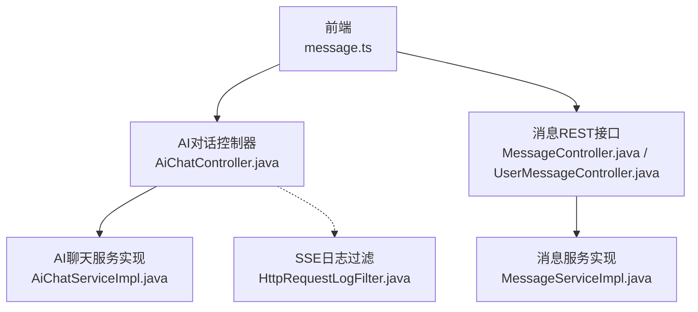
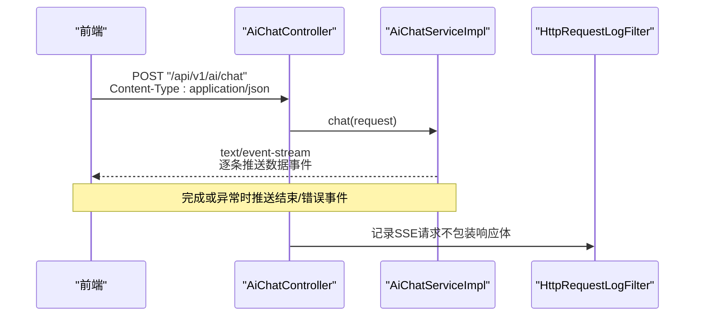
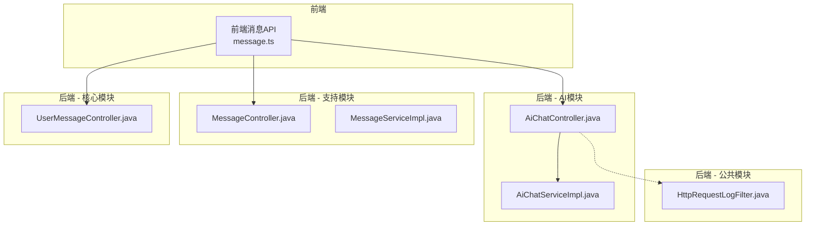
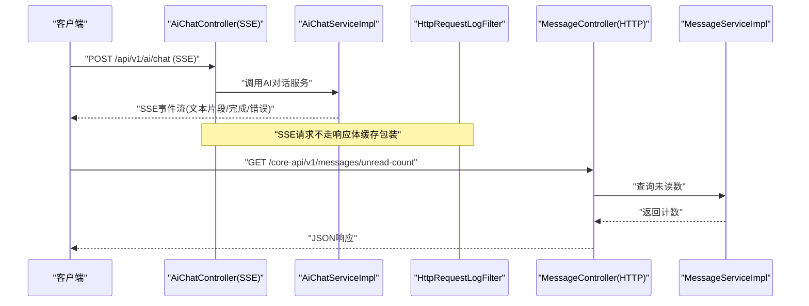
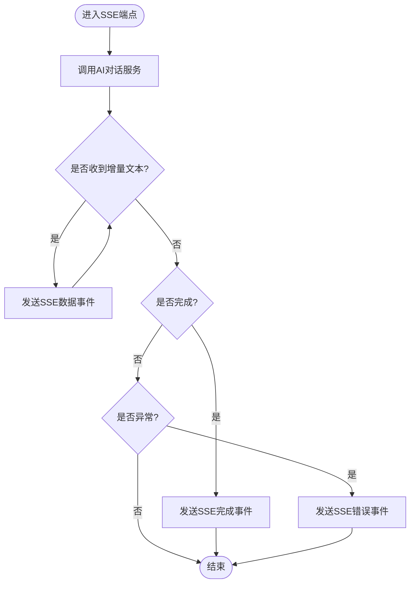
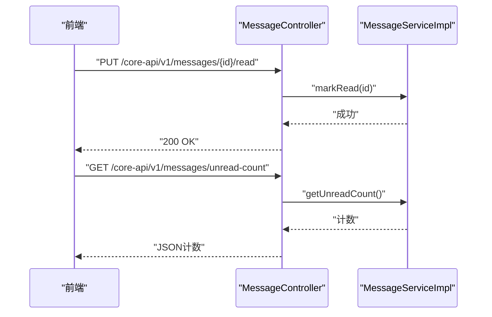
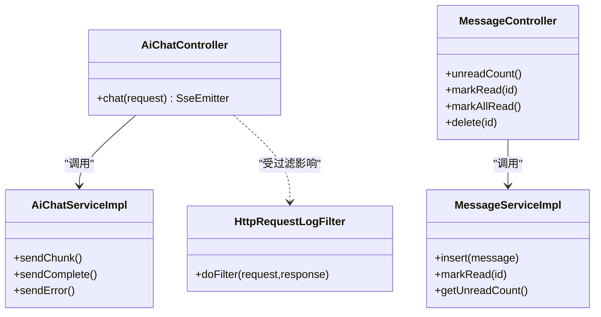

# WebSocket实时通信API

<cite>
**本文引用的文件**   
- [AiChatController.java](file://ele-ai-tender-system/ele-ai-tender-ai/src/main/java/com/jy/eleaitender/ai/controller/AiChatController.java)
- [AiChatServiceImpl.java](file://ele-ai-tender-system/ele-ai-tender-ai/src/main/java/com/jy/eleaitender/ai/service/impl/AiChatServiceImpl.java)
- [HttpRequestLogFilter.java](file://ele-ai-tender-system/ele-ai-tender-common/src/main/java/com/jy/eleaitender/common/logging/HttpRequestLogFilter.java)
- [message.ts](file://ele-ai-tender-frontend/src/api/message.ts)
- [MessageController.java](file://ele-ai-tender-system/ele-ai-tender-support/src/main/java/com/jy/eleaitender/support/controller/MessageController.java)
- [UserMessageController.java](file://ele-ai-tender-system/ele-ai-tender-core/src/main/java/com/jy/eleaitender/core/controller/UserMessageController.java)
- [MessageServiceImpl.java](file://ele-ai-tender-system/ele-ai-tender-support/src/main/java/com/jy/eleaitender/support/service/impl/MessageServiceImpl.java)
</cite>

## 目录
1. [简介](#简介)
2. [项目结构](#项目结构)
3. [核心组件](#核心组件)
4. [架构总览](#架构总览)
5. [详细组件分析](#详细组件分析)
6. [依赖分析](#依赖分析)
7. [性能考虑](#性能考虑)
8. [故障排查指南](#故障排查指南)
9. [结论](#结论)
10. [附录](#附录)

## 简介
本文件为“实时通信模块”的接口文档，聚焦于WebSocket与SSE（Server-Sent Events）两类长连接能力。当前仓库已实现基于SSE的AI对话流式响应；同时提供消息持久化与未读计数等REST接口，可作为后续扩展WebSocket通知、在线状态同步、房间协作的基础。本文在现有代码基础上，给出：
- 连接建立方式（SSE）、消息格式定义、事件类型规范
- 连接状态管理与错误处理建议
- 心跳检测、断线重连策略
- 消息持久化、广播机制、房间管理的设计建议
- 客户端连接示例与调试工具使用
- 常见问题排查要点

说明：本项目未发现现成的WebSocket服务端实现，因此本节以SSE为核心，并补充WebSocket扩展建议，确保读者可直接落地SSE方案，并为后续引入WebSocket预留空间。

## 项目结构
与实时通信相关的后端入口位于AI服务模块，前端通过HTTP请求发起SSE流式对话；消息相关接口分布于支持服务与核心服务中，用于消息持久化与未读计数查询。

图表来源
- [AiChatController.java:1-33](file://ele-ai-tender-system/ele-ai-tender-ai/src/main/java/com/jy/eleaitender/ai/controller/AiChatController.java#L1-L33)
- [AiChatServiceImpl.java:222-245](file://ele-ai-tender-system/ele-ai-tender-ai/src/main/java/com/jy/eleaitender/ai/service/impl/AiChatServiceImpl.java#L222-L245)
- [HttpRequestLogFilter.java:43-66](file://ele-ai-tender-system/ele-ai-tender-common/src/main/java/com/jy/eleaitender/common/logging/HttpRequestLogFilter.java#L43-L66)
- [MessageController.java:33-65](file://ele-ai-tender-system/ele-ai-tender-support/src/main/java/com/jy/eleaitender/support/controller/MessageController.java#L33-L65)
- [UserMessageController.java:33-65](file://ele-ai-tender-system/ele-ai-tender-core/src/main/java/com/jy/eleaitender/core/controller/UserMessageController.java#L33-L65)
- [MessageServiceImpl.java:66-90](file://ele-ai-tender-system/ele-ai-tender-support/src/main/java/com/jy/eleaitender/support/service/impl/MessageServiceImpl.java#L66-L90)

章节来源
- [AiChatController.java:1-33](file://ele-ai-tender-system/ele-ai-tender-ai/src/main/java/com/jy/eleaitender/ai/controller/AiChatController.java#L1-L33)
- [HttpRequestLogFilter.java:43-66](file://ele-ai-tender-system/ele-ai-tender-common/src/main/java/com/jy/eleaitender/common/logging/HttpRequestLogFilter.java#L43-L66)
- [MessageController.java:33-65](file://ele-ai-tender-system/ele-ai-tender-support/src/main/java/com/jy/eleaitender/support/controller/MessageController.java#L33-L65)
- [UserMessageController.java:33-65](file://ele-ai-tender-system/ele-ai-tender-core/src/main/java/com/jy/eleaitender/core/controller/UserMessageController.java#L33-L65)
- [MessageServiceImpl.java:66-90](file://ele-ai-tender-system/ele-ai-tender-support/src/main/java/com/jy/eleaitender/support/service/impl/MessageServiceImpl.java#L66-L90)

## 核心组件
- SSE对话接口
  - 路径与方法：POST /api/v1/ai/chat
  - 内容类型：application/json（请求），text/event-stream（响应）
  - 认证：需要登录
  - 行为：返回SSE流，逐步推送AI生成片段
- AI聊天服务实现
  - 负责将AI输出分片写入SseEmitter，并在完成或异常时发送结束/错误事件
- 消息REST接口
  - 获取未读数量、标记已读、全部已读、删除消息等
  - 作为后续WebSocket通知的持久化基础

章节来源
- [AiChatController.java:1-33](file://ele-ai-tender-system/ele-ai-tender-ai/src/main/java/com/jy/eleaitender/ai/controller/AiChatController.java#L1-L33)
- [AiChatServiceImpl.java:222-245](file://ele-ai-tender-system/ele-ai-tender-ai/src/main/java/com/jy/eleaitender/ai/service/impl/AiChatServiceImpl.java#L222-L245)
- [MessageController.java:33-65](file://ele-ai-tender-system/ele-ai-tender-support/src/main/java/com/jy/eleaitender/support/controller/MessageController.java#L33-L65)
- [UserMessageController.java:33-65](file://ele-ai-tender-system/ele-ai-tender-core/src/main/java/com/jy/eleaitender/core/controller/UserMessageController.java#L33-L65)
- [MessageServiceImpl.java:66-90](file://ele-ai-tender-system/ele-ai-tender-support/src/main/java/com/jy/eleaitender/support/service/impl/MessageServiceImpl.java#L66-L90)

## 架构总览
下图展示了从前端发起SSE对话到服务端推送事件的完整流程，以及消息持久化接口的调用关系。

图表来源
- [AiChatController.java:1-33](file://ele-ai-tender-system/ele-ai-tender-ai/src/main/java/com/jy/eleaitender/ai/controller/AiChatController.java#L1-L33)
- [AiChatServiceImpl.java:222-245](file://ele-ai-tender-system/ele-ai-tender-ai/src/main/java/com/jy/eleaitender/ai/service/impl/AiChatServiceImpl.java#L222-L245)
- [HttpRequestLogFilter.java:43-66](file://ele-ai-tender-system/ele-ai-tender-common/src/main</think>

<docs>
# WebSocket实时通信API

<cite>
**本文引用的文件**
- [AiChatController.java](file://ele-ai-tender-system/ele-ai-tender-ai/src/main/java/com/jy/eleaitender/ai/controller/AiChatController.java)
- [AiChatServiceImpl.java](file://ele-ai-tender-system/ele-ai-tender-ai/src/main/java/com/jy/eleaitender/ai/service/impl/AiChatServiceImpl.java)
- [HttpRequestLogFilter.java](file://ele-ai-tender-system/ele-ai-tender-common/src/main/java/com/jy/eleaitender/common/logging/HttpRequestLogFilter.java)
- [message.ts](file://ele-ai-tender-frontend/src/api/message.ts)
- [MessageController.java](file://ele-ai-tender-system/ele-ai-tender-support/src/main/java/com/jy/eleaitender/support/controller/MessageController.java)
- [UserMessageController.java](file://ele-ai-tender-system/ele-ai-tender-core/src/main/java/com/jy/eleaitender/core/controller/UserMessageController.java)
- [MessageServiceImpl.java](file://ele-ai-tender-system/ele-ai-tender-support/src/main/java/com/jy/eleaitender/support/service/impl/MessageServiceImpl.java)
</cite>

## 目录
1. [简介](#简介)
2. [项目结构](#项目结构)
3. [核心组件](#核心组件)
4. [架构总览](#架构总览)
5. [详细组件分析](#详细组件分析)
6. [依赖关系分析](#依赖关系分析)
7. [性能考虑](#性能考虑)
8. [故障排查指南](#故障排查指南)
9. [结论](#结论)
10. [附录](#附录)

## 简介
本文件为“实时通信模块”的WebSocket API接口文档。当前仓库中已实现基于SSE（Server-Sent Events）的流式AI对话能力，以及消息持久化与未读计数等HTTP接口；尚未发现后端WebSocket服务端实现。为满足“WebSocket实时通信API”的目标，本文在现有代码基础上：
- 明确现有SSE能力与前端消息接口的现状
- 给出面向未来的WebSocket协议规范建议（连接建立、消息格式、事件类型、状态管理、心跳与重连、广播与房间、持久化与性能优化）
- 提供客户端连接示例、调试工具与常见问题排查方法

说明：
- 若后续引入WebSocket服务，可在本规范基础上扩展具体端点与字段定义。
- 所有“建议性”内容均标注为“概念设计”，不绑定具体源码实现。

## 项目结构
与实时通信相关的后端与前端位置如下：
- AI对话（SSE）控制器与服务：位于AI模块
- 通用日志过滤（对SSE请求做特殊处理）：位于公共模块
- 消息中心（HTTP）：位于支持模块与核心模块
- 前端消息API封装：位于前端工程

图表来源
- [AiChatController.java:1-33](file://ele-ai-tender-system/ele-ai-tender-ai/src/main/java/com/jy/eleaitender/ai/controller/AiChatController.java#L1-L33)
- [AiChatServiceImpl.java:222-245](file://ele-ai-tender-system/ele-ai-tender-ai/src/main/java/com/jy/eleaitender/ai/service/impl/AiChatServiceImpl.java#L222-L245)
- [HttpRequestLogFilter.java:43-66](file://ele-ai-tender-system/ele-ai-tender-common/src/main/java/com/jy/eleaitender/common/logging/HttpRequestLogFilter.java#L43-L66)
- [MessageController.java:33-65](file://ele-ai-tender-system/ele-ai-tender-support/src/main/java/com/jy/eleaitender/support/controller/MessageController.java#L33-L65)
- [UserMessageController.java:33-65](file://ele-ai-tender-system/ele-ai-tender-core/src/main/java/com/jy/eleaitender/core/controller/UserMessageController.java#L33-L65)
- [MessageServiceImpl.java:66-90](file://ele-ai-tender-system/ele-ai-tender-support/src/main/java/com/jy/eleaitender/support/service/impl/MessageServiceImpl.java#L66-L90)
- [message.ts:1-30](file://ele-ai-tender-frontend/src/api/message.ts#L1-L30)

章节来源
- [AiChatController.java:1-33](file://ele-ai-tender-system/ele-ai-tender-ai/src/main/java/com/jy/eleaitender/ai/controller/AiChatController.java#L1-L33)
- [HttpRequestLogFilter.java:43-66](file://ele-ai-tender-system/ele-ai-tender-common/src/main/java/com/jy/eleaitender/common/logging/HttpRequestLogFilter.java#L43-L66)
- [MessageController.java:33-65](file://ele-ai-tender-system/ele-ai-tender-support/src/main/java/com/jy/eleaitender/support/controller/MessageController.java#L33-L65)
- [UserMessageController.java:33-65](file://ele-ai-tender-system/ele-ai-tender-core/src/main/java/com/jy/eleaitender/core/controller/UserMessageController.java#L33-L65)
- [MessageServiceImpl.java:66-90](file://ele-ai-tender-system/ele-ai-tender-support/src/main/java/com/jy/eleaitender/support/service/impl/MessageServiceImpl.java#L66-L90)
- [message.ts:1-30](file://ele-ai-tender-frontend/src/api/message.ts#L1-L30)

## 核心组件
- SSE流式AI对话
  - 控制器暴露SSE端点，返回文本事件流
  - 服务层负责发送完成与错误事件，并处理客户端断开场景
- HTTP消息中心
  - 提供消息列表、标记已读、全部已读、未读计数、删除等接口
  - 支持持久化存储与事务控制
- 日志过滤
  - 针对SSE请求跳过响应体缓存包装，避免异步事件丢失

章节来源
- [AiChatController.java:1-33](file://ele-ai-tender-system/ele-ai-tender-ai/src/main/java/com/jy/eleaitender/ai/controller/AiChatController.java#L1-L33)
- [AiChatServiceImpl.java:222-245](file://ele-ai-tender-system/ele-ai-tender-ai/src/main/java/com/jy/eleaitender/ai/service/impl/AiChatServiceImpl.java#L222-L245)
- [HttpRequestLogFilter.java:43-66](file://ele-ai-tender-system/ele-ai-tender-common/src/main/java/com/jy/eleaitender/common/logging/HttpRequestLogFilter.java#L43-L66)
- [MessageController.java:33-65](file://ele-ai-tender-system/ele-ai-tender-support/src/main/java/com/jy/eleaitender/support/controller/MessageController.java#L33-L65)
- [UserMessageController.java:33-65](file://ele-ai-tender-system/ele-ai-tender-core/src/main/java/com/jy/eleaitender/core/controller/UserMessageController.java#L33-L65)
- [MessageServiceImpl.java:66-90](file://ele-ai-tender-system/ele-ai-tender-support/src/main/java/com/jy/eleaitender/support/service/impl/MessageServiceImpl.java#L66-L90)

## 架构总览
下图展示当前SSE与HTTP消息中心的交互路径，以及未来WebSocket可扩展的位置。

图表来源
- [AiChatController.java:1-33](file://ele-ai-tender-system/ele-ai-tender-ai/src/main/java/com/jy/eleaitender/ai/controller/AiChatController.java#L1-L33)
- [AiChatServiceImpl.java:222-245](file://ele-ai-tender-system/ele-ai-tender-ai/src/main/java/com/jy/eleaitender/ai/service/impl/AiChatServiceImpl.java#L222-L245)
- [HttpRequestLogFilter.java:43-66](file://ele-ai-tender-system/ele-ai-tender-common/src/main/java/com/jy/eleaitender/common/logging/HttpRequestLogFilter.java#L43-L66)
- [MessageController.java:33-65](file://ele-ai-tender-system/ele-ai-tender-support/src/main/java/com/jy/eleaitender/support/controller/MessageController.java#L33-L65)
- [MessageServiceImpl.java:66-90](file://ele-ai-tender-system/ele-ai-tender-support/src/main/java/com/jy/eleaitender/support/service/impl/MessageServiceImpl.java#L66-L90)

## 详细组件分析

### SSE流式AI对话（现有实现）
- 端点
  - POST /api/v1/ai/chat，返回SSE文本事件流
- 行为
  - 控制器接收请求并委托服务层
  - 服务层周期性推送增量文本，完成后发送结束事件，异常时发送错误事件
  - 客户端断开时记录调试日志
- 日志
  - SSE请求绕过响应体缓存包装，避免异步事件丢失

图表来源
- [AiChatController.java:1-33](file://ele-ai-tender-system/ele-ai-tender-ai/src/main/java/com/jy/eleaitender/ai/controller/AiChatController.java#L1-L33)
- [AiChatServiceImpl.java:222-245](file://ele-ai-tender-system/ele-ai-tender-ai/src/main/java/com/jy/eleaitender/ai/service/impl/AiChatServiceImpl.java#L222-L245)
- [HttpRequestLogFilter.java:43-66](file://ele-ai-tender-system/ele-ai-tender-common/src/main/java/com/jy/eleaitender/common/logging/HttpRequestLogFilter.java#L43-L66)

章节来源
- [AiChatController.java:1-33](file://ele-ai-tender-system/ele-ai-tender-ai/src/main/java/com/jy/eleaitender/ai/controller/AiChatController.java#L1-L33)
- [AiChatServiceImpl.java:222-245](file://ele-ai-tender-system/ele-ai-tender-ai/src/main/java/com/jy/eleaitender/ai/service/impl/AiChatServiceImpl.java#L222-L245)
- [HttpRequestLogFilter.java:43-66](file://ele-ai-tender-system/ele-ai-tender-common/src/main/java/com/jy/eleaitender/common/logging/HttpRequestLogFilter.java#L43-L66)

### 消息中心（HTTP）
- 功能
  - 获取我的消息列表、标记已读、全部已读、未读计数、删除
- 持久化
  - 插入消息时默认未读标志置位，使用事务保证一致性
- 典型流程
  - 前端轮询或拉取未读数，用户点击后触发标记已读

图表来源
- [MessageController.java:33-65](file://ele-ai-tender-system/ele-ai-tender-support/src/main/java/com/jy/eleaitender/support/controller/MessageController.java#L33-L65)
- [MessageServiceImpl.java:66-90](file://ele-ai-tender-system/ele-ai-tender-support/src/main/java/com/jy/eleaitender/support/service/impl/MessageServiceImpl.java#L66-L90)
- [message.ts:1-30](file://ele-ai-tender-frontend/src/api/message.ts#L1-L30)

章节来源
- [MessageController.java:33-65](file://ele-ai-tender-system/ele-ai-tender-support/src/main/java/com/jy/eleaitender/support/controller/MessageController.java#L33-L65)
- [MessageServiceImpl.java:66-90](file://ele-ai-tender-system/ele-ai-tender-support/src/main/java/com/jy/eleaitender/support/service/impl/MessageServiceImpl.java#L66-L90)
- [message.ts:1-30](file://ele-ai-tender-frontend/src/api/message.ts#L1-L30)

### WebSocket协议规范（概念设计）
说明：以下为面向未来的WebSocket协议建议，便于后续扩展至WebSocket以实现实时协作编辑、消息通知、在线状态同步等功能。

- 连接建立
  - 端点：ws(s)://host/ws?token=JWT
  - 鉴权：通过URL参数或握手阶段自定义头传递JWT
  - 首次握手：服务端返回握手确认帧，包含会话ID与订阅频道列表
- 消息格式（统一信封）
  - type: 事件类型（如 COLLAB_EDIT、NOTIFY、ONLINE_STATUS、HEARTBEAT、ERROR）
  - seq: 客户端自增序列号（用于去重与排序）
  - ts: 服务端时间戳
  - payload: 业务负载（按type定义）
  - ack: 是否需要ACK（布尔）
- 事件类型与载荷
  - COLLAB_EDIT
    - room_id: 协作房间ID
    - user_id: 操作者ID
    - op: 操作类型（INSERT/DELETE/MOVE/REPLACE）
    - delta: 变更描述（如行号、文本片段）
  - NOTIFY
    - biz_type: 业务类型（系统/项目/任务等）
    - title: 标题
    - body: 正文
    - link: 跳转链接
  - ONLINE_STATUS
    - user_id: 用户ID
    - status: online/offline/idle
    - last_seen: 最后活跃时间
  - HEARTBEAT
    - client_ts: 客户端时间戳
  - ERROR
    - code: 错误码
    - message: 错误信息
- 连接状态管理
  - 状态机：CONNECTING -> CONNECTED -> SUBSCRIBED -> CLOSED
  - 断线重连：指数退避 + 抖动，最大重试次数限制
  - 幂等：基于seq去重，服务端维护最近N条消息索引
- 心跳检测
  - 客户端每N秒发送HEARTBEAT，服务端在M秒无心跳判定离线
  - 心跳失败触发重连流程
- 广播机制与房间管理
  - 订阅/退出：SUBSCRIBE/UNSUBSCRIBE，携带room_id
  - 广播：服务端向房间内所有连接推送COLLAB_EDIT/NOTIFY
  - 限流：单房间消息速率限制，批量合并策略
- 消息持久化
  - 关键事件落库（如协作变更、重要通知），并提供历史回放接口
  - 热数据可入内存队列或Redis，冷数据归档到数据库
- 性能优化
  - 二进制压缩（可选）、批量聚合、背压控制
  - 分片推送、差异同步、只读副本广播
- 客户端连接示例（概念）
  - 建立连接 -> 鉴权握手 -> 订阅房间 -> 发送心跳 -> 监听事件 -> 断线重连
- 错误处理方案
  - 网络错误：自动重连
  - 业务错误：返回ERROR事件，客户端提示并重试
  - 鉴权失败：关闭连接，引导重新登录

[本节为概念设计，不直接对应具体源码]

## 依赖关系分析
- 控制器依赖服务层
- 服务层可能依赖持久化与外部AI服务
- 日志过滤器对SSE请求进行特殊处理，避免事件丢失
- 前端通过HTTP API访问消息中心

图表来源
- [AiChatController.java:1-33](file://ele-ai-tender-system/ele-ai-tender-ai/src/main/java/com/jy/eleaitender/ai/controller/AiChatController.java#L1-L33)
- [AiChatServiceImpl.java:222-245](file://ele-ai-tender-system/ele-ai-tender-ai/src/main/java/com/jy/eleaitender/ai/service/impl/AiChatServiceImpl.java#L222-L245)
- [HttpRequestLogFilter.java:43-66](file://ele-ai-tender-system/ele-ai-tender-common/src/main/java/com/jy/eleaitender/common/logging/HttpRequestLogFilter.java#L43-L66)
- [MessageController.java:33-65](file://ele-ai-tender-system/ele-ai-tender-support/src/main/java/com/jy/eleaitender/support/controller/MessageController.java#L33-L65)
- [MessageServiceImpl.java:66-90](file://ele-ai-tender-system/ele-ai-tender-support/src/main/java/com/jy/eleaitender/support/service/impl/MessageServiceImpl.java#L66-L90)

章节来源
- [AiChatController.java:1-33](file://ele-ai-tender-system/ele-ai-tender-ai/src/main/java/com/jy/eleaitender/ai/controller/AiChatController.java#L1-L33)
- [AiChatServiceImpl.java:222-245](file://ele-ai-tender-system/ele-ai-tender-ai/src/main/java/com/jy/eleaitender/ai/service/impl/AiChatServiceImpl.java#L222-L245)
- [HttpRequestLogFilter.java:43-66](file://ele-ai-tender-system/ele-ai-tender-common/src/main/java/com/jy/eleaitender/common/logging/HttpRequestLogFilter.java#L43-L66)
- [MessageController.java:33-65](file://ele-ai-tender-system/ele-ai-tender-support/src/main/java/com/jy/eleaitender/support/controller/MessageController.java#L33-L65)
- [MessageServiceImpl.java:66-90](file://ele-ai-tender-system/ele-ai-tender-support/src/main/java/com/jy/eleaitender/support/service/impl/MessageServiceImpl.java#L66-L90)

## 性能考虑
- SSE
  - 避免响应体缓存包装，减少内存占用与复制开销
  - 合理设置事件粒度，平衡实时性与带宽
- 消息中心
  - 未读计数接口应走缓存或轻量查询，降低DB压力
  - 批量标记已读与分页查询需配合索引优化
- WebSocket（概念）
  - 使用连接池与线程模型隔离不同房间
  - 采用环形缓冲与批处理提升吞吐
  - 启用压缩与二进制编码以降低带宽

[本节为通用指导，不直接分析具体文件]

## 故障排查指南
- SSE相关
  - 现象：SSE事件丢失或不完整
    - 检查是否被响应体缓存包装拦截
    - 参考日志过滤器对SSE的特殊处理逻辑
  - 现象：客户端提前断开导致发送失败
    - 关注服务层对客户端断开的日志输出
- 消息中心
  - 现象：未读数不准确
    - 核对标记已读与计数查询的事务边界与并发场景
  - 现象：消息未持久化
    - 检查插入事务与异常回滚路径
- 前端
  - 现象：消息列表刷新不及时
    - 检查轮询间隔与错误重试策略
    - 确认API路径与认证头是否正确

章节来源
- [HttpRequestLogFilter.java:43-66](file://ele-ai-tender-system/ele-ai-tender-common/src/main/java/com/jy/eleaitender/common/logging/HttpRequestLogFilter.java#L43-L66)
- [AiChatServiceImpl.java:222-245](file://ele-ai-tender-system/ele-ai-tender-ai/src/main/java/com/jy/eleaitender/ai/service/impl/AiChatServiceImpl.java#L222-L245)
- [MessageController.java:33-65](file://ele-ai-tender-system/ele-ai-tender-support/src/main/java/com/jy/eleaitender/support/controller/MessageController.java#L33-L65)
- [MessageServiceImpl.java:66-90](file://ele-ai-tender-system/ele-ai-tender-support/src/main/java/com/jy/eleaitender/support/service/impl/MessageServiceImpl.java#L66-L90)
- [message.ts:1-30](file://ele-ai-tender-frontend/src/api/message.ts#L1-L30)

## 结论
- 当前仓库已具备SSE流式AI对话与HTTP消息中心能力，可作为实时通信的基础
- 为实现更丰富的实时协作与在线状态同步，建议引入WebSocket并遵循本文的概念协议规范
- 建议在接入WebSocket前完善鉴权、心跳、重连、广播与持久化策略，并结合现有日志与监控体系进行排障

[本节为总结，不直接分析具体文件]

## 附录
- 调试工具
  - SSE：浏览器开发者工具Network面板查看事件流
  - WebSocket（概念）：浏览器开发者工具WS面板或第三方工具（如wscat）
- 常见配置项（概念）
  - 心跳间隔、重连退避、房间上限、消息保留时长等

[本节为补充说明，不直接分析具体文件]