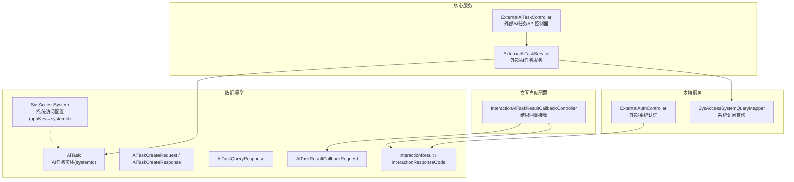
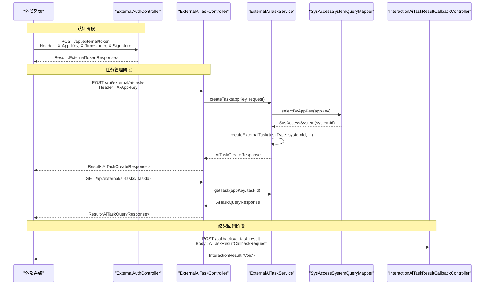
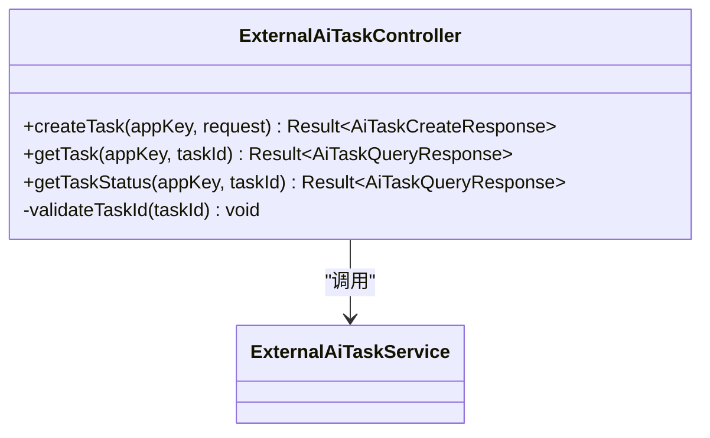
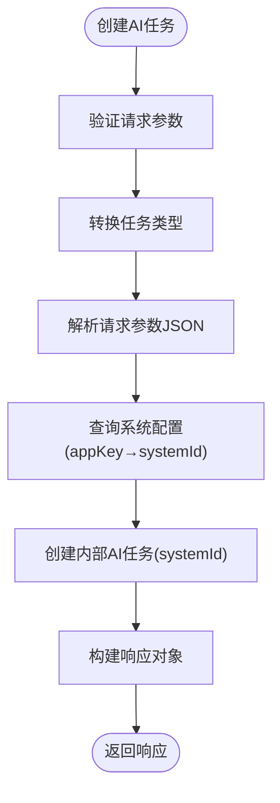
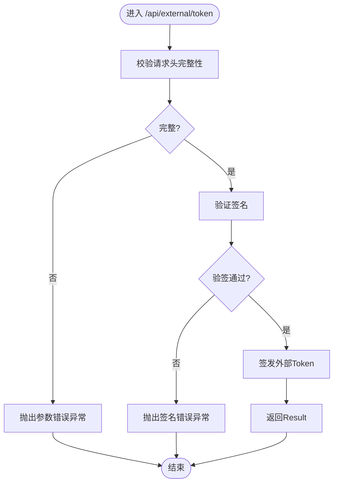
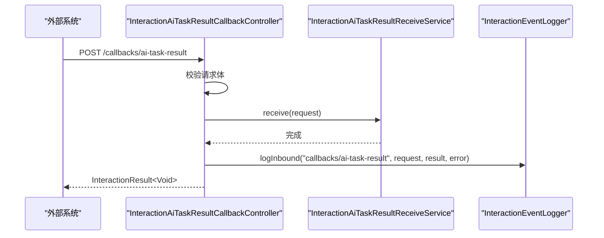
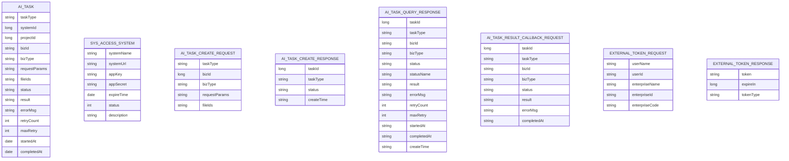
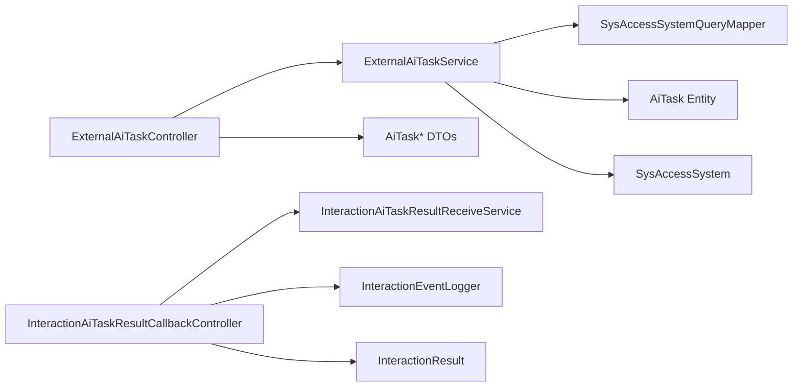

# 外部AI任务API

<cite>
**本文引用的文件**   
- [ExternalAiTaskController.java](file://ele-ai-tender-system/ele-ai-tender-core/src/main/java/com/jy/eleaitender/core/controller/external/ExternalAiTaskController.java)
- [ExternalAiTaskService.java](file://ele-ai-tender-system/ele-ai-tender-core/src/main/java/com/jy/eleaitender/core/service/external/ExternalAiTaskService.java)
- [ExternalAuthController.java](file://ele-ai-tender-system/ele-ai-tender-support/src/main/java/com/jy/eleaitender/support/controller/ExternalAuthController.java)
- [InteractionAiTaskResultCallbackController.java](file://ele-ai-tender-system/ele-ai-tender-interaction/ele-ai-tender-interaction-autoconfigure/src/main/java/com/jy/eleaitender/interaction/autoconfigure/controller/InteractionAiTaskResultCallbackController.java)
- [AiTaskCreateRequest.java](file://ele-ai-tender-system/ele-ai-tender-common-interaction/src/main/java/com/jy/eleaitender/common/interaction/dto/AiTaskCreateRequest.java)
- [AiTaskCreateResponse.java](file://ele-ai-tender-system/ele-ai-tender-common-interaction/src/main/java/com/jy/eleaitender/common/interaction/dto/AiTaskCreateResponse.java)
- [AiTaskQueryResponse.java](file://ele-ai-tender-system/ele-ai-tender-common-interaction/src/main/java/com/jy/eleaitender/common/interaction/dto/AiTaskQueryResponse.java)
- [AiTaskResultCallbackRequest.java](file://ele-ai-tender-system/ele-ai-tender-common-interaction/src/main/java/com/jy/eleaitender/common/interaction/dto/AiTaskResultCallbackRequest.java)
- [ExternalTokenRequest.java](file://ele-ai-tender-system/ele-ai-tender-common-interaction/src/main/java/com/jy/eleaitender/common/interaction/dto/ExternalTokenRequest.java)
- [ExternalTokenResponse.java](file://ele-ai-tender-system/ele-ai-tender-common-interaction/src/main/java/com/jy/eleaitender/common/interaction/dto/ExternalTokenResponse.java)
- [InteractionResult.java](file://ele-ai-tender-system/ele-ai-tender-common-interaction/src/main/java/com/jy/eleaitender/common/interaction/dto/InteractionResult.java)
- [InteractionResponseCode.java](file://ele-ai-tender-system/ele-ai-tender-common-interaction/src/main/java/com/jy/eleaitender/common/interaction/enums/InteractionResponseCode.java)
- [AiTask.java](file://ele-ai-tender-system/ele-ai-tender-common/src/main/java/com/jy/eleaitender/common/entity/ai/AiTask.java)
- [SysAccessSystem.java](file://ele-ai-tender-system/ele-ai-tender-common/src/main/java/com/jy/eleaitender/common/entity/support/SysAccessSystem.java)
- [SysAccessSystemQueryMapper.java](file://ele-ai-tender-system/ele-ai-tender-core/src/main/java/com/jy/eleaitender/core/mapper/SysAccessSystemQueryMapper.java)
</cite>

## 更新摘要
**变更内容**   
- 移除了AiTaskExternalCallback相关的所有组件，简化了回调架构
- 采用简化的systemId标识方式替代原有的复杂回调机制
- 优化了外部系统接入流程，通过appKey直接关联到systemId
- 重构了任务创建和查询逻辑，提升了系统的可维护性和性能

## 目录
1. [简介](#简介)
2. [项目结构](#项目结构)
3. [核心组件](#核心组件)
4. [架构总览](#架构总览)
5. [详细组件分析](#详细组件分析)
6. [依赖关系分析](#依赖关系分析)
7. [性能考虑](#性能考虑)
8. [故障排查指南](#故障排查指南)
9. [结论](#结论)
10. [附录](#附录)

## 简介
本文件面向"外部系统"与"电子标平台"之间的集成，聚焦于"外部AI任务API"的接口契约、认证鉴权、任务生命周期与回调机制。通过统一的签名认证、异步任务创建与查询、以及终态结果回调，外部系统可安全地触发需求生成、评审项生成、文档集成、敏感词检测等AI能力，并可靠地获取执行状态与结果。

**更新** 架构重大变更：移除了复杂的AiTaskExternalCallback组件，采用简化的systemId标识方式，通过appKey直接映射到系统ID，大幅简化了外部系统集成复杂度。

## 项目结构
围绕外部AI任务API，相关代码分布在以下模块：
- 核心服务对外暴露的任务控制层（创建、查询）
- 支持服务提供的外部认证与验签入口
- 交互自动配置提供的结果回调接收端点
- 公共交互DTO与枚举定义（请求/响应、统一响应、任务类型与状态）
- 系统访问配置管理（appKey与systemId映射）

**图示来源**
- [ExternalAiTaskController.java:21-57](file://ele-ai-tender-system/ele-ai-tender-core/src/main/java/com/jy/eleaitender/core/controller/external/ExternalAiTaskController.java#L21-L57)
- [ExternalAiTaskService.java:31-131](file://ele-ai-tender-system/ele-ai-tender-core/src/main/java/com/jy/eleaitender/core/service/external/ExternalAiTaskService.java#L31-L131)
- [ExternalAuthController.java:27-107](file://ele-ai-tender-system/ele-ai-tender-support/src/main/java/com/jy/eleaitender/support/controller/ExternalAuthController.java#L27-L107)
- [InteractionAiTaskResultCallbackController.java:17-52](file://ele-ai-tender-system/ele-ai-tender-interaction/ele-ai-tender-interaction-autoconfigure/src/main/java/com/jy/eleaitender/interaction/autoconfigure/controller/InteractionAiTaskResultCallbackController.java#L17-L52)
- [AiTask.java:24-28](file://ele-ai-tender-system/ele-ai-tender-common/src/main/java/com/jy/eleaitender/common/entity/ai/AiTask.java#L24-L28)
- [SysAccessSystem.java:30-31](file://ele-ai-tender-system/ele-ai-tender-common/src/main/java/com/jy/eleaitender/common/entity/support/SysAccessSystem.java#L30-L31)

## 核心组件
- **外部AI任务控制器**：提供创建任务、查询任务详情与状态的REST接口，要求携带应用Key进行访问控制。
- **外部AI任务服务**：实现任务创建的业务逻辑，包括参数校验、类型转换、基于appKey的系统ID解析等。
- **外部系统认证控制器**：提供基于签名认证的Token获取与验签辅助接口，用于外部系统身份与权限校验。
- **结果回调控制器**：接收AI任务终态结果的回调，包含入参校验与事件日志记录。
- **系统访问查询器**：根据appKey查询系统配置，返回systemId用于任务标识。

**更新** 移除了AiTaskExternalCallback相关组件，采用简化的systemId标识方式，通过appKey直接映射到系统ID，大幅简化了架构复杂度。

## 架构总览
外部系统与平台的交互分为三类：
- **认证与鉴权**：通过签名换取Token，或进行验签辅助检查。
- **任务编排**：创建AI任务、查询任务详情与状态，使用systemId标识任务来源。
- **结果回传**：AI处理完成后，以终态回调通知调用方。

**图示来源**
- [ExternalAuthController.java:42-74](file://ele-ai-tender-system/ele-ai-tender-support/src/main/java/com/jy/eleaitender/support/controller/ExternalAuthController.java#L42-L74)
- [ExternalAiTaskController.java:29-51](file://ele-ai-tender-system/ele-ai-tender-core/src/main/java/com/jy/eleaitender/core/controller/external/ExternalAiTaskController.java#L29-L51)
- [ExternalAiTaskService.java:45-89](file://ele-ai-tender-system/ele-ai-tender-core/src/main/java/com/jy/eleaitender/core/service/external/ExternalAiTaskService.java#L45-L89)
- [SysAccessSystemQueryMapper.java:18-19](file://ele-ai-tender-system/ele-ai-tender-core/src/main/java/com/jy/eleaitender/core/mapper/SysAccessSystemQueryMapper.java#L18-L19)
- [InteractionAiTaskResultCallbackController.java:32-51](file://ele-ai-tender-system/ele-ai-tender-interaction/ele-ai-tender-interaction-autoconfigure/src/main/java/com/jy/eleaitender/interaction/autoconfigure/controller/InteractionAiTaskResultCallbackController.java#L32-L51)

## 详细组件分析

### 外部AI任务控制器（ExternalAiTaskController）
职责：
- 提供创建AI任务的POST接口，需携带X-App-Key头。
- 提供按任务ID查询详情的GET接口。
- 提供按任务ID查询状态的GET接口。
- 对任务ID进行基础合法性校验。

关键要点：
- 所有接口均返回统一包装Result对象。
- 任务ID校验失败将抛出业务异常。
- 使用Swagger注解提供API文档。

**图示来源**
- [ExternalAiTaskController.java:21-57](file://ele-ai-tender-system/ele-ai-tender-core/src/main/java/com/jy/eleaitender/core/controller/external/ExternalAiTaskController.java#L21-L57)

**章节来源**
- [ExternalAiTaskController.java:1-59](file://ele-ai-tender-system/ele-ai-tender-core/src/main/java/com/jy/eleaitender/core/controller/external/ExternalAiTaskController.java#L1-L59)

### 外部AI任务服务（ExternalAiTaskService）
职责：
- 实现外部AI任务的完整业务逻辑。
- 处理任务类型转换和参数反序列化。
- 基于appKey查询系统配置并获取systemId。
- 管理任务创建和查询逻辑。

关键要点：
- 支持多种任务类型的动态解析和处理。
- 通过appKey直接映射到systemId，简化了系统标识。
- 移除了复杂的回调记录机制，采用简化的任务状态管理。
- 提供时间格式化工具方法。

**图示来源**
- [ExternalAiTaskService.java:45-89](file://ele-ai-tender-system/ele-ai-tender-core/src/main/java/com/jy/eleaitender/core/service/external/ExternalAiTaskService.java#L45-L89)

**章节来源**
- [ExternalAiTaskService.java:1-131](file://ele-ai-tender-system/ele-ai-tender-core/src/main/java/com/jy/eleaitender/core/service/external/ExternalAiTaskService.java#L1-L131)

### 外部系统认证控制器（ExternalAuthController）
职责：
- 提供外部系统用户换取Token的接口，需携带X-App-Key、X-Timestamp、X-Signature三个请求头。
- 提供验签辅助接口，便于联调时验证签名配置。
- 在已登录上下文下，返回当前外部用户信息。

关键要点：
- 先校验请求头完整性，再进行签名验证。
- 验签失败抛出认证异常。
- Token响应包含token、过期时间与tokenType。

**图示来源**
- [ExternalAuthController.java:42-74](file://ele-ai-tender-system/ele-ai-tender-support/src/main/java/com/jy/eleaitender/support/controller/ExternalAuthController.java#L42-L74)

**章节来源**
- [ExternalAuthController.java:1-108](file://ele-ai-tender-system/ele-ai-tender-support/src/main/java/com/jy/eleaitender/support/controller/ExternalAuthController.java#L1-L108)

### 结果回调控制器（InteractionAiTaskResultCallbackController）
职责：
- 接收AI任务终态结果回调。
- 对回调请求进行入参校验。
- 记录入站事件日志（成功/失败）。

关键要点：
- 使用统一响应InteractionResult。
- 回调路径由常量定义，避免硬编码。
- 支持异常处理和事件日志记录。

**图示来源**
- [InteractionAiTaskResultCallbackController.java:32-51](file://ele-ai-tender-system/ele-ai-tender-interaction/ele-ai-tender-interaction-autoconfigure/src/main/java/com/jy/eleaitender/interaction/autoconfigure/controller/InteractionAiTaskResultCallbackController.java#L32-L51)

**章节来源**
- [InteractionAiTaskResultCallbackController.java:1-53](file://ele-ai-tender-system/ele-ai-tender-interaction/ele-ai-tender-interaction-autoconfigure/src/main/java/com/jy/eleaitender/interaction/autoconfigure/controller/InteractionAiTaskResultCallbackController.java#L1-L53)

### 数据模型与枚举
- **AI任务实体(AiTask)**：包含任务类型、systemId（替代原callback相关字段）、项目ID、业务标识、业务类型、请求参数、文件ID列表、任务状态、执行结果、错误信息、重试次数、开始与完成时间等。
- **系统访问配置(SysAccessSystem)**：包含系统名称、系统URL、应用Key、应用密钥、有效期截止时间、状态、系统描述等。
- **任务创建请求/响应**：包含任务类型、业务标识、业务类型、请求参数JSON、关联文件ID列表；响应包含任务ID、任务类型、状态与创建时间。
- **任务查询响应**：包含任务ID、类型、业务标识、业务类型、状态及名称、执行结果JSON、错误信息、重试次数与上限、开始与完成时间、创建时间。
- **结果回调请求**：包含任务ID、类型、业务ID、业务类型、终态状态、执行结果JSON、错误信息与完成时间。
- **外部Token请求/响应**：请求包含用户名、用户ID、企业名称、企业ID与企业编码；响应包含token、过期时间与tokenType。
- **统一响应InteractionResult**：封装code、message、data与timestamp，并提供便捷工厂方法。
- **响应码InteractionResponseCode**：定义成功、失败、参数错误、签名错误等标准码。

**图示来源**
- [AiTask.java:24-73](file://ele-ai-tender-system/ele-ai-tender-common/src/main/java/com/jy/eleaitender/common/entity/ai/AiTask.java#L24-L73)
- [SysAccessSystem.java:24-45](file://ele-ai-tender-system/ele-ai-tender-common/src/main/java/com/jy/eleaitender/common/entity/support/SysAccessSystem.java#L24-L45)
- [AiTaskCreateRequest.java:1-40](file://ele-ai-tender-system/ele-ai-tender-common-interaction/src/main/java/com/jy/eleaitender/common/interaction/dto/AiTaskCreateRequest.java#L1-L40)
- [AiTaskCreateResponse.java:1-35](file://ele-ai-tender-system/ele-ai-tender-common-interaction/src/main/java/com/jy/eleaitender/common/interaction/dto/AiTaskCreateResponse.java#L1-L35)
- [AiTaskQueryResponse.java:1-80](file://ele-ai-tender-system/ele-ai-tender-common-interaction/src/main/java/com/jy/eleaitender/common/interaction/dto/AiTaskQueryResponse.java#L1-L80)
- [AiTaskResultCallbackRequest.java:1-54](file://ele-ai-tender-system/ele-ai-tender-common-interaction/src/main/java/com/jy/eleaitender/common/interaction/dto/AiTaskResultCallbackRequest.java#L1-L54)
- [ExternalTokenRequest.java:1-21](file://ele-ai-tender-system/ele-ai-tender-common-interaction/src/main/java/com/jy/eleaitender/common/interaction/dto/ExternalTokenRequest.java#L1-L21)
- [ExternalTokenResponse.java:1-27](file://ele-ai-tender-system/ele-ai-tender-common-interaction/src/main/java/com/jy/eleaitender/common/interaction/dto/ExternalTokenResponse.java#L1-L27)

**章节来源**
- [AiTask.java:1-83](file://ele-ai-tender-system/ele-ai-tender-common/src/main/java/com/jy/eleaitender/common/entity/ai/AiTask.java#L1-L83)
- [SysAccessSystem.java:1-47](file://ele-ai-tender-system/ele-ai-tender-common/src/main/java/com/jy/eleaitender/common/entity/support/SysAccessSystem.java#L1-L47)
- [AiTaskCreateRequest.java:1-40](file://ele-ai-tender-system/ele-ai-tender-common-interaction/src/main/java/com/jy/eleaitender/common/interaction/dto/AiTaskCreateRequest.java#L1-L40)
- [AiTaskCreateResponse.java:1-35](file://ele-ai-tender-system/ele-ai-tender-common-interaction/src/main/java/com/jy/eleaitender/common/interaction/dto/AiTaskCreateResponse.java#L1-L35)
- [AiTaskQueryResponse.java:1-80](file://ele-ai-tender-system/ele-ai-tender-common-interaction/src/main/java/com/jy/eleaitender/common/interaction/dto/AiTaskQueryResponse.java#L1-L80)
- [AiTaskResultCallbackRequest.java:1-54](file://ele-ai-tender-system/ele-ai-tender-common-interaction/src/main/java/com/jy/eleaitender/common/interaction/dto/AiTaskResultCallbackRequest.java#L1-L54)
- [ExternalTokenRequest.java:1-21](file://ele-ai-tender-system/ele-ai-tender-common-interaction/src/main/java/com/jy/eleaitender/common/interaction/dto/ExternalTokenRequest.java#L1-L21)
- [ExternalTokenResponse.java:1-27](file://ele-ai-tender-system/ele-ai-tender-common-interaction/src/main/java/com/jy/eleaitender/common/interaction/dto/ExternalTokenResponse.java#L1-L27)
- [InteractionResult.java:1-66](file://ele-ai-tender-system/ele-ai-tender-common-interaction/src/main/java/com/jy/eleaitender/common/interaction/dto/InteractionResult.java#L1-L66)
- [InteractionResponseCode.java:1-37](file://ele-ai-tender-system/ele-ai-tender-common-interaction/src/main/java/com/jy/eleaitender/common/interaction/enums/InteractionResponseCode.java#L1-L37)

## 依赖关系分析
- **控制器到服务**：ExternalAiTaskController依赖ExternalAiTaskService，负责具体业务编排。
- **服务到数据访问**：ExternalAiTaskService依赖SysAccessSystemQueryMapper进行系统配置查询。
- **控制器到DTO/枚举**：各控制器直接消费公共交互包中的DTO与枚举，确保跨模块契约一致。
- **回调链路**：回调控制器依赖SPI接收服务与事件日志器，实现解耦与可观测性。
- **系统标识**：通过appKey直接映射到systemId，简化了系统标识机制。

**图示来源**
- [ExternalAiTaskController.java:21-57](file://ele-ai-tender-system/ele-ai-tender-core/src/main/java/com/jy/eleaitender/core/controller/external/ExternalAiTaskController.java#L21-L57)
- [ExternalAiTaskService.java:33-40](file://ele-ai-tender-system/ele-ai-tender-core/src/main/java/com/jy/eleaitender/core/service/external/ExternalAiTaskService.java#L33-L40)
- [SysAccessSystemQueryMapper.java:13-19](file://ele-ai-tender-system/ele-ai-tender-core/src/main/java/com/jy/eleaitender/core/mapper/SysAccessSystemQueryMapper.java#L13-L19)
- [InteractionAiTaskResultCallbackController.java:18-51](file://ele-ai-tender-system/ele-ai-tender-interaction/ele-ai-tender-interaction-autoconfigure/src/main/java/com/jy/eleaitender/interaction/autoconfigure/controller/InteractionAiTaskResultCallbackController.java#L18-L51)

**章节来源**
- [ExternalAiTaskController.java:1-59](file://ele-ai-tender-system/ele-ai-tender-core/src/main/java/com/jy/eleaitender/core/controller/external/ExternalAiTaskController.java#L1-L59)
- [ExternalAiTaskService.java:1-131](file://ele-ai-tender-system/ele-ai-tender-core/src/main/java/com/jy/eleaitender/core/service/external/ExternalAiTaskService.java#L1-L131)
- [SysAccessSystemQueryMapper.java:1-20](file://ele-ai-tender-system/ele-ai-tender-core/src/main/java/com/jy/eleaitender/core/mapper/SysAccessSystemQueryMapper.java#L1-L20)
- [InteractionAiTaskResultCallbackController.java:1-53](file://ele-ai-tender-system/ele-ai-tender-interaction/ele-ai-tender-interaction-autoconfigure/src/main/java/com/jy/eleaitender/interaction/autoconfigure/controller/InteractionAiTaskResultCallbackController.java#L1-L53)

## 性能考虑
- **异步任务**：AI任务通常耗时较长，建议采用异步创建+轮询/回调模式，避免长连接阻塞。
- **幂等与重试**：外部系统在重试时应保证幂等（如基于taskId与taskType组合），服务端应记录最大重试次数与已重试次数。
- **限流与熔断**：对高频任务创建与查询接口实施限流策略，防止资源耗尽。
- **日志与追踪**：在回调链路中记录入站事件，便于问题定位与性能分析。
- **系统标识优化**：通过appKey直接映射到systemId，减少了数据库查询复杂度，提升了查询性能。

**更新** 采用简化的systemId标识方式，通过appKey直接映射，显著提升了系统性能和可维护性。

## 故障排查指南
- **签名错误**：当外部系统获取Token或调用受保护接口时，若出现签名错误，请检查X-App-Key、X-Timestamp、X-Signature是否正确且时间戳有效。
- **参数错误**：任务ID必须大于0；请求头缺失或不完整会触发参数错误。
- **回调失败**：确认回调路径与请求体字段是否符合约定；关注事件日志输出，定位入站请求与异常堆栈。
- **状态判断**：根据任务状态枚举判断是否为终态，非终态时可继续轮询或等待回调。
- **系统配置错误**：如果appKey对应的系统不存在或未配置system_url，会抛出AiSyncedException异常。

**更新** 新增了系统配置错误的排查指南，帮助解决appKey映射相关的配置问题。

**章节来源**
- [ExternalAuthController.java:52-74](file://ele-ai-tender-system/ele-ai-tender-support/src/main/java/com/jy/eleaitender/support/controller/ExternalAuthController.java#L52-L74)
- [ExternalAiTaskController.java:53-57](file://ele-ai-tender-system/ele-ai-tender-core/src/main/java/com/jy/eleaitender/core/controller/external/ExternalAiTaskController.java#L53-L57)
- [ExternalAiTaskService.java:72-76](file://ele-ai-tender-system/ele-ai-tender-core/src/main/java/com/jy/eleaitender/core/service/external/ExternalAiTaskService.java#L72-L76)
- [InteractionAiTaskResultCallbackController.java:36-51](file://ele-ai-tender-system/ele-ai-tender-interaction/ele-ai-tender-interaction-autoconfigure/src/main/java/com/jy/eleaitender/interaction/autoconfigure/controller/InteractionAiTaskResultCallbackController.java#L36-L51)

## 结论
外部AI任务API通过清晰的认证鉴权、统一的DTO与枚举契约、以及可靠的回调机制，为外部系统提供了稳定、可扩展的AI能力接入方式。架构重大变更后，移除了复杂的AiTaskExternalCallback组件，采用简化的systemId标识方式，通过appKey直接映射到系统ID，大幅简化了外部系统集成复杂度，提升了系统的可维护性和性能。建议在集成过程中严格遵循签名规范、幂等设计与重试策略，并结合日志与监控提升可观测性与稳定性。

**更新** 架构简化后，系统更加稳定和高效，为外部系统集成提供了更加简洁可靠的API接口。

## 附录

### API清单与说明
- **外部系统认证**
  - POST /api/external/token：外部系统用户换取Token，需携带X-App-Key、X-Timestamp、X-Signature。
  - GET /api/external/verify：验签辅助接口，便于联调。
  - GET /api/external/userinfo：获取当前外部用户信息（需登录上下文）。
- **外部AI任务**
  - POST /api/external/ai-tasks：创建AI任务，需携带X-App-Key。
  - GET /api/external/ai-tasks/{taskId}：查询任务详情。
  - GET /api/external/ai-tasks/{taskId}/status：查询任务状态。
- **结果回调**
  - POST /callbacks/ai-task-result：接收AI任务终态结果回调。

**更新** 架构简化后，API接口保持不变，但内部处理逻辑更加简洁高效。

**章节来源**
- [ExternalAuthController.java:42-106](file://ele-ai-tender-system/ele-ai-tender-support/src/main/java/com/jy/eleaitender/support/controller/ExternalAuthController.java#L42-L106)
- [ExternalAiTaskController.java:29-51](file://ele-ai-tender-system/ele-ai-tender-core/src/main/java/com/jy/eleaitender/core/controller/external/ExternalAiTaskController.java#L29-L51)
- [InteractionAiTaskResultCallbackController.java:32-51](file://ele-ai-tender-system/ele-ai-tender-interaction/ele-ai-tender-interaction-autoconfigure/src/main/java/com/jy/eleaitender/interaction/autoconfigure/controller/InteractionAiTaskResultCallbackController.java#L32-L51)