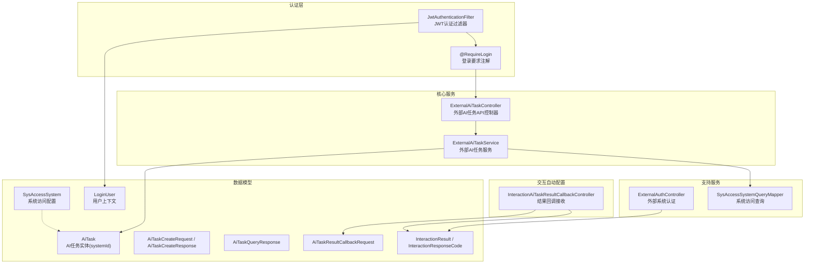
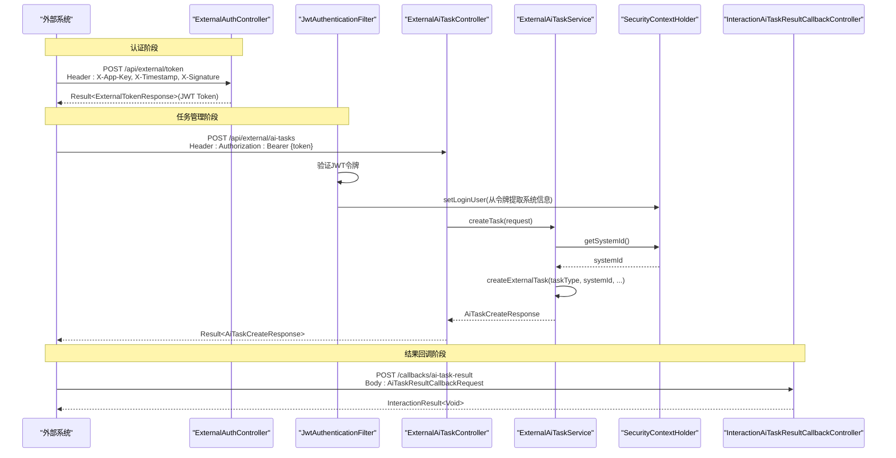
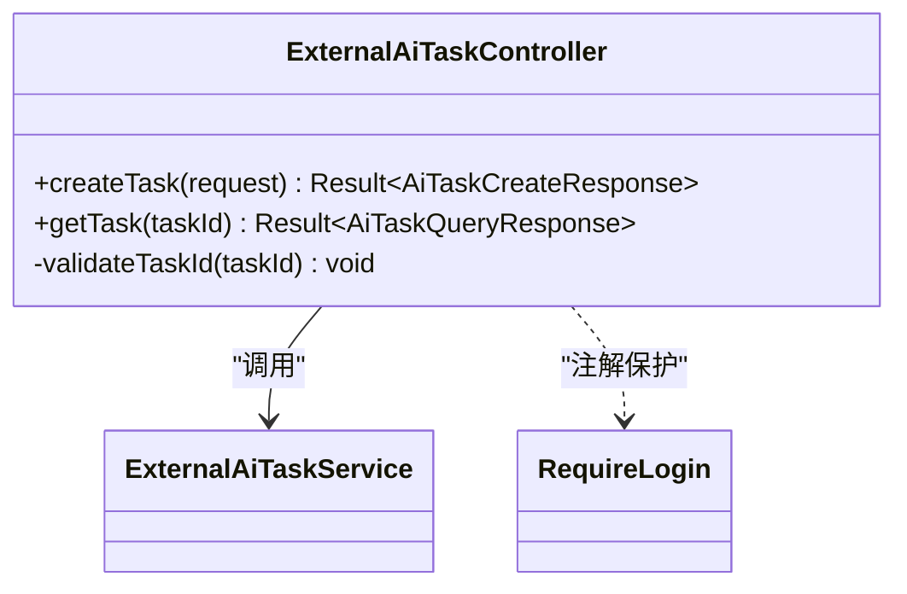
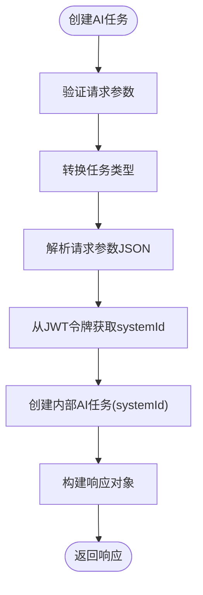
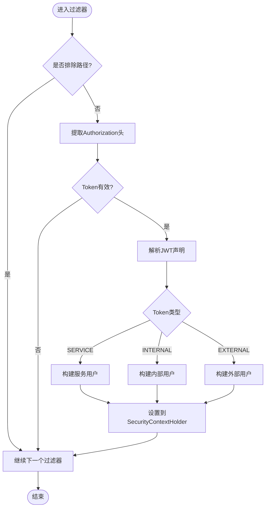
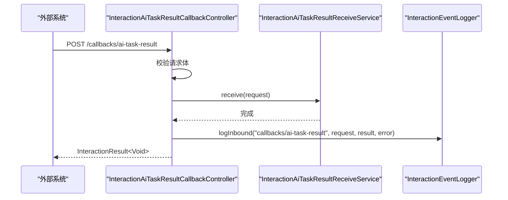
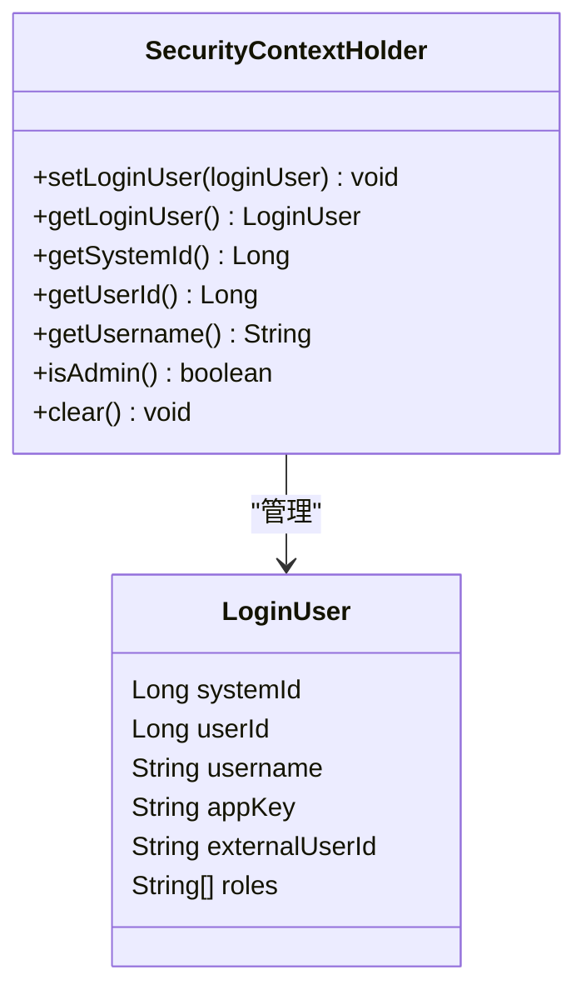
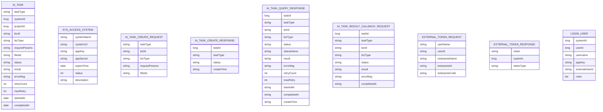
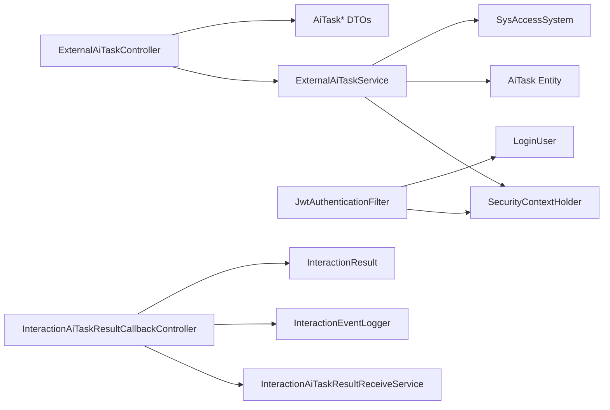

# 外部AI任务API

<cite>
**本文引用的文件**   
- [ExternalAiTaskController.java](file://ele-ai-tender-system/ele-ai-tender-core/src/main/java/com/jy/eleaitender/core/controller/external/ExternalAiTaskController.java)
- [ExternalAiTaskService.java](file://ele-ai-tender-system/ele-ai-tender-core/src/main/java/com/jy/eleaitender/core/service/external/ExternalAiTaskService.java)
- [ExternalAuthController.java](file://ele-ai-tender-system/ele-ai-tender-support/src/main/java/com/jy/eleaitender/support/controller/ExternalAuthController.java)
- [InteractionAiTaskResultCallbackController.java](file://ele-ai-tender-system/ele-ai-tender-interaction/ele-ai-tender-interaction-autoconfigure/src/main/java/com/jy/eleaitender/interaction/autoconfigure/controller/InteractionAiTaskResultCallbackController.java)
- [JwtAuthenticationFilter.java](file://ele-ai-tender-system/ele-ai-tender-common/src/main/java/com/jy/eleaitender/common/security/JwtAuthenticationFilter.java)
- [SecurityContextHolder.java](file://ele-ai-tender-system/ele-ai-tender-common/src/main/java/com/jy/eleaitender/common/security/SecurityContextHolder.java)
- [LoginUser.java](file://ele-ai-tender-system/ele-ai-tender-common/src/main/java/com/jy/eleaitender/common/security/LoginUser.java)
- [RequireLogin.java](file://ele-ai-tender-system/ele-ai-tender-common/src/main/java/com/jy/eleaitender/common/security/annotation/RequireLogin.java)
- [AiTaskCreateRequest.java](file://ele-ai-tender-system/ele-ai-tender-interaction/ele-ai-tender-common-interaction/src/main/java/com/jy/eleaitender/common/interaction/dto/AiTaskCreateRequest.java)
- [AiTaskCreateResponse.java](file://ele-ai-tender-system/ele-ai-tender-interaction/ele-ai-tender-common-interaction/src/main/java/com/jy/eleaitender/common/interaction/dto/AiTaskCreateResponse.java)
- [AiTaskQueryResponse.java](file://ele-ai-tender-system/ele-ai-tender-interaction/ele-ai-tender-common-interaction/src/main/java/com/jy/eleaitender/common/interaction/dto/AiTaskQueryResponse.java)
- [AiTaskResultCallbackRequest.java](file://ele-ai-tender-system/ele-ai-tender-interaction/ele-ai-tender-common-interaction/src/main/java/com/jy/eleaitender/common/interaction/dto/AiTaskResultCallbackRequest.java)
- [ExternalTokenRequest.java](file://ele-ai-tender-system/ele-ai-tender-interaction/ele-ai-tender-common-interaction/src/main/java/com/jy/eleaitender/common/interaction/dto/ExternalTokenRequest.java)
- [ExternalTokenResponse.java](file://ele-ai-tender-system/ele-ai-tender-interaction/ele-ai-tender-common-interaction/src/main/java/com/jy/eleaitender/common/interaction/dto/ExternalTokenResponse.java)
- [InteractionResult.java](file://ele-ai-tender-system/ele-ai-tender-interaction/ele-ai-tender-common-interaction/src/main/java/com/jy/eleaitender/common/interaction/dto/InteractionResult.java)
- [InteractionResponseCode.java](file://ele-ai-tender-system/ele-ai-tender-interaction/ele-ai-tender-common-interaction/src/main/java/com/jy/eleaitender/common/interaction/enums/InteractionResponseCode.java)
- [InteractionApiPaths.java](file://ele-ai-tender-system/ele-ai-tender-interaction/ele-ai-tender-common-interaction/src/main/java/com/jy/eleaitender/common/interaction/constant/InteractionApiPaths.java)
- [AiTask.java](file://ele-ai-tender-system/ele-ai-tender-common/src/main/java/com/jy/eleaitender/common/entity/ai/AiTask.java)
- [SysAccessSystem.java](file://ele-ai-tender-system/ele-ai-tender-common/src/main/java/com/jy/eleaitender/common/entity/support/SysAccessSystem.java)
- [SysAccessSystemQueryMapper.java](file://ele-ai-tender-system/ele-ai-tender-core/src/main/java/com/jy/eleaitender/core/mapper/SysAccessSystemQueryMapper.java)
- [AiTaskClient.java](file://ele-ai-tender-system/ele-ai-tender-interaction/ele-ai-tender-interaction-core/src/main/java/com/jy/eleaitender/interaction/core/client/AiTaskClient.java)
- [EleAiTenderInteractionProperties.java](file://ele-ai-tender-system/ele-ai-tender-interaction/ele-ai-tender-interaction-core/src/main/java/com/jy/eleaitender/interaction/core/properties/EleAiTenderInteractionProperties.java)
</cite>

## 更新摘要
**变更内容**   
- 增强了外部AI任务端点的安全认证，为所有任务管理接口添加@RequireLogin注解
- 统一了任务状态查询接口，移除了独立的getTaskStatus方法，合并到统一的getTask接口中
- 改进了审计追踪能力，确保任务查询响应中包含完整的系统标识信息
- 优化了JWT令牌认证机制，提升了外部系统集成安全性和可维护性

## 目录
1. [简介](#简介)
2. [项目结构](#项目结构)
3. [核心组件](#核心组件)
4. [架构总览](#架构总览)
5. [详细组件分析](#详细组件分析)
6. [依赖关系分析](#依赖关系分析)
7. [性能考虑](#性能考虑)
8. [故障排查指南](#故障排查指南)
9. [结论](#结论)
10. [附录](#附录)

## 简介
本文件面向"外部系统"与"电子标平台"之间的集成，聚焦于"外部AI任务API"的接口契约、认证鉴权、任务生命周期与回调机制。通过统一的JWT令牌认证、异步任务创建与查询、以及终态结果回调，外部系统可安全地触发需求生成、评审项生成、文档集成、敏感词检测等AI能力，并可靠地获取执行状态与结果。

**重大更新** 认证机制进一步增强：为所有外部AI任务管理接口添加了@RequireLogin注解保护，实现了更严格的访问控制。同时统一了任务查询接口，移除了独立的getTaskStatus方法，所有任务详情查询都通过统一的getTask接口完成，返回包含完整信息的任务对象，包括systemId字段用于更好的审计追踪。

## 项目结构
围绕外部AI任务API，相关代码分布在以下模块：
- 核心服务对外暴露的任务控制层（创建、查询）
- 支持服务提供的外部认证与验签入口
- 交互自动配置提供的结果回调接收端点
- JWT认证过滤器和安全上下文管理
- 公共交互DTO与枚举定义（请求/响应、统一响应、任务类型与状态）
- 系统访问配置管理（systemId映射）

**图示来源**
- [ExternalAiTaskController.java:21-49](file://ele-ai-tender-system/ele-ai-tender-core/src/main/java/com/jy/eleaitender/core/controller/external/ExternalAiTaskController.java#L21-L49)
- [ExternalAiTaskService.java:30-124](file://ele-ai-tender-system/ele-ai-tender-core/src/main/java/com/jy/eleaitender/core/service/external/ExternalAiTaskService.java#L30-L124)
- [ExternalAuthController.java:27-106](file://ele-ai-tender-system/ele-ai-tender-support/src/main/java/com/jy/eleaitender/support/controller/ExternalAuthController.java#L27-L106)
- [InteractionAiTaskResultCallbackController.java:17-52](file://ele-ai-tender-system/ele-ai-tender-interaction/ele-ai-tender-interaction-autoconfigure/src/main/java/com/jy/eleaitender/interaction/autoconfigure/controller/InteractionAiTaskResultCallbackController.java#L17-L52)
- [JwtAuthenticationFilter.java:22-58](file://ele-ai-tender-system/ele-ai-tender-common/src/main/java/com/jy/eleaitender/common/security/JwtAuthenticationFilter.java#L22-L58)
- [SecurityContextHolder.java:18-21](file://ele-ai-tender-system/ele-ai-tender-common/src/main/java/com/jy/eleaitender/common/security/SecurityContextHolder.java#L18-L21)
- [LoginUser.java:13-27](file://ele-ai-tender-system/ele-ai-tender-common/src/main/java/com/jy/eleaitender/common/security/LoginUser.java#L13-L27)

## 核心组件
- **外部AI任务控制器**：提供创建任务、查询任务详情的REST接口，通过@RequireLogin注解保护，无需手动处理X-App-Key头。
- **外部AI任务服务**：实现任务创建的业务逻辑，从JWT令牌的安全上下文中获取systemId，简化了参数传递。
- **外部系统认证控制器**：提供基于签名认证的Token获取与验签辅助接口，用于外部系统初始身份验证。
- **JWT认证过滤器**：拦截所有/api/*请求，验证JWT令牌有效性并从令牌中提取用户上下文信息。
- **安全上下文管理器**：提供线程安全的用户上下文存储和访问，包含systemId、userId等关键信息。
- **结果回调控制器**：接收AI任务终态结果的回调，包含入参校验与事件日志记录。

**重大更新** 所有外部AI任务管理接口都已添加@RequireLogin注解保护，实现了统一的认证鉴权机制。任务查询接口已统一为单一的getTask方法，不再提供独立的getTaskStatus接口。

## 架构总览
外部系统与平台的交互分为三类：
- **认证与鉴权**：通过签名换取JWT Token，后续所有API调用使用Bearer Token进行认证。
- **任务编排**：创建AI任务、查询任务详情，系统自动从JWT令牌中解析systemId。
- **结果回传**：AI处理完成后，以终态回调通知调用方。

**图示来源**
- [ExternalAuthController.java:42-74](file://ele-ai-tender-system/ele-ai-tender-support/src/main/java/com/jy/eleaitender/support/controller/ExternalAuthController.java#L42-L74)
- [JwtAuthenticationFilter.java:36-58](file://ele-ai-tender-system/ele-ai-tender-common/src/main/java/com/jy/eleaitender/common/security/JwtAuthenticationFilter.java#L36-L58)
- [ExternalAiTaskController.java:29-42](file://ele-ai-tender-system/ele-ai-tender-core/src/main/java/com/jy/eleaitender/core/controller/external/ExternalAiTaskController.java#L29-L42)
- [ExternalAiTaskService.java:46-90](file://ele-ai-tender-system/ele-ai-tender-core/src/main/java/com/jy/eleaitender/core/service/external/ExternalAiTaskService.java#L46-L90)
- [SecurityContextHolder.java:18-21](file://ele-ai-tender-system/ele-ai-tender-common/src/main/java/com/jy/eleaitender/common/security/SecurityContextHolder.java#L18-L21)
- [InteractionAiTaskResultCallbackController.java:32-51](file://ele-ai-tender-system/ele-ai-tender-interaction/ele-ai-tender-interaction-autoconfigure/src/main/java/com/jy/eleaitender/interaction/autoconfigure/controller/InteractionAiTaskResultCallbackController.java#L32-L51)

## 详细组件分析

### 外部AI任务控制器（ExternalAiTaskController）
职责：
- 提供创建AI任务的POST接口，通过@RequireLogin注解保护。
- 提供按任务ID查询详情的GET接口，通过@RequireLogin注解保护。
- 对任务ID进行基础合法性校验。
- 无需手动处理X-App-Key请求头，认证由过滤器自动处理。

关键要点：
- 所有接口均返回统一包装Result对象。
- 任务ID校验失败将抛出业务异常。
- 使用Swagger注解提供API文档。
- 认证信息从JWT令牌中自动提取，无需手动传递。
- **重大更新**：所有接口都已添加@RequireLogin注解，提供了更强的安全保护。

**图示来源**
- [ExternalAiTaskController.java:21-49](file://ele-ai-tender-system/ele-ai-tender-core/src/main/java/com/jy/eleaitender/core/controller/external/ExternalAiTaskController.java#L21-L49)
- [RequireLogin.java:9-13](file://ele-ai-tender-system/ele-ai-tender-common/src/main/java/com/jy/eleaitender/common/security/annotation/RequireLogin.java#L9-L13)

**章节来源**
- [ExternalAiTaskController.java:1-50](file://ele-ai-tender-system/ele-ai-tender-core/src/main/java/com/jy/eleaitender/core/controller/external/ExternalAiTaskController.java#L1-L50)

### 外部AI任务服务（ExternalAiTaskService）
职责：
- 实现外部AI任务的完整业务逻辑。
- 处理任务类型转换和参数反序列化。
- 从JWT令牌的安全上下文中获取systemId。
- 管理任务创建和查询逻辑。

关键要点：
- 支持多种任务类型的动态解析和处理。
- 通过SecurityContextHolder.getSystemId()直接从JWT令牌获取系统标识。
- 移除了appKey参数，简化了方法签名。
- 提供了时间格式化工具方法。
- **重大更新**：任务查询接口已统一为单一的getTask方法，不再提供独立的getTaskStatus方法。

**图示来源**
- [ExternalAiTaskService.java:46-90](file://ele-ai-tender-system/ele-ai-tender-core/src/main/java/com/jy/eleaitender/core/service/external/ExternalAiTaskService.java#L46-L90)

**章节来源**
- [ExternalAiTaskService.java:1-125](file://ele-ai-tender-system/ele-ai-tender-core/src/main/java/com/jy/eleaitender/core/service/external/ExternalAiTaskService.java#L1-L125)

### JWT认证过滤器（JwtAuthenticationFilter）
职责：
- 拦截所有/api/*路径的请求。
- 从Authorization头中提取Bearer Token。
- 验证JWT令牌的有效性和类型。
- 从令牌中解析用户上下文信息并设置到SecurityContextHolder。

关键要点：
- 支持三种Token类型：SERVICE（服务间）、INTERNAL（内部用户）、EXTERNAL（外部系统）。
- 外部系统Token包含systemId、appKey、enterpriseId等丰富信息。
- 自动处理Redis中的Token状态验证。
- 请求结束后自动清理上下文。

**图示来源**
- [JwtAuthenticationFilter.java:36-58](file://ele-ai-tender-system/ele-ai-tender-common/src/main/java/com/jy/eleaitender/common/security/JwtAuthenticationFilter.java#L36-L58)

**章节来源**
- [JwtAuthenticationFilter.java:1-176](file://ele-ai-tender-system/ele-ai-tender-common/src/main/java/com/jy/eleaitender/common/security/JwtAuthenticationFilter.java#L1-L176)

### 外部系统认证控制器（ExternalAuthController）
职责：
- 提供外部系统用户换取JWT Token的接口，需携带X-App-Key、X-Timestamp、X-Signature三个请求头。
- 提供验签辅助接口，便于联调时验证签名配置。
- 在已登录上下文下，返回当前外部用户信息。

关键要点：
- 先校验请求头完整性，再进行签名验证。
- 验签失败抛出认证异常。
- Token响应包含token、过期时间与tokenType。
- 生成的JWT令牌包含完整的系统标识和用户信息。

**图示来源**
- [ExternalAuthController.java:42-74](file://ele-ai-tender-system/ele-ai-tender-support/src/main/java/com/jy/eleaitender/support/controller/ExternalAuthController.java#L42-L74)

**章节来源**
- [ExternalAuthController.java:1-106](file://ele-ai-tender-system/ele-ai-tender-support/src/main/java/com/jy/eleaitender/support/controller/ExternalAuthController.java#L1-L106)

### 结果回调控制器（InteractionAiTaskResultCallbackController）
职责：
- 接收AI任务终态结果回调。
- 对回调请求进行入参校验。
- 记录入站事件日志（成功/失败）。

关键要点：
- 使用统一响应InteractionResult。
- 回调路径由常量定义，避免硬编码。
- 支持异常处理和事件日志记录。

**图示来源**
- [InteractionAiTaskResultCallbackController.java:32-51](file://ele-ai-tender-system/ele-ai-tender-interaction/ele-ai-tender-interaction-autoconfigure/src/main/java/com/jy/eleaitender/interaction/autoconfigure/controller/InteractionAiTaskResultCallbackController.java#L32-L51)

**章节来源**
- [InteractionAiTaskResultCallbackController.java:1-53](file://ele-ai-tender-system/ele-ai-tender-interaction/ele-ai-tender-interaction-autoconfigure/src/main/java/com/jy/eleaitender/interaction/autoconfigure/controller/InteractionAiTaskResultCallbackController.java#L1-L53)

### 安全上下文管理
职责：
- 提供线程安全的用户上下文存储和访问。
- 封装各种用户信息的便捷获取方法。
- 支持管理员权限判断。

关键要点：
- 使用ThreadLocal确保线程隔离。
- 提供getSystemId()、getUserId()等便捷方法。
- 支持isAdmin()权限判断。
- 请求结束后自动清理上下文。

**图示来源**
- [SecurityContextHolder.java:3-46](file://ele-ai-tender-system/ele-ai-tender-common/src/main/java/com/jy/eleaitender/common/security/SecurityContextHolder.java#L3-L46)
- [LoginUser.java:8-40](file://ele-ai-tender-system/ele-ai-tender-common/src/main/java/com/jy/eleaitender/common/security/LoginUser.java#L8-L40)

**章节来源**
- [SecurityContextHolder.java:1-46](file://ele-ai-tender-system/ele-ai-tender-common/src/main/java/com/jy/eleaitender/common/security/SecurityContextHolder.java#L1-L46)
- [LoginUser.java:1-41](file://ele-ai-tender-system/ele-ai-tender-common/src/main/java/com/jy/eleaitender/common/security/LoginUser.java#L1-L41)

### 数据模型与枚举
- **AI任务实体(AiTask)**：包含任务类型、systemId、项目ID、业务标识、业务类型、请求参数、文件ID列表、任务状态、执行结果、错误信息、重试次数、开始与完成时间等。
- **系统访问配置(SysAccessSystem)**：包含系统名称、系统URL、应用Key、应用密钥、有效期截止时间、状态、系统描述等。
- **任务创建请求/响应**：包含任务类型、业务标识、业务类型、请求参数JSON、关联文件ID列表；响应包含任务ID、任务类型、状态与创建时间。
- **任务查询响应**：包含任务ID、类型、业务标识、业务类型、状态及名称、执行结果JSON、错误信息、重试次数与上限、开始与完成时间、创建时间。
- **结果回调请求**：包含任务ID、类型、业务ID、业务类型、终态状态、执行结果JSON、错误信息与完成时间。
- **外部Token请求/响应**：请求包含用户名、用户ID、企业名称、企业ID与企业编码；响应包含token、过期时间与tokenType。
- **统一响应InteractionResult**：封装code、message、data与timestamp，并提供便捷工厂方法。
- **响应码InteractionResponseCode**：定义成功、失败、参数错误、签名错误等标准码。

**图示来源**
- [AiTask.java:24-73](file://ele-ai-tender-system/ele-ai-tender-common/src/main/java/com/jy/eleaitender/common/entity/ai/AiTask.java#L24-L73)
- [SysAccessSystem.java:24-45](file://ele-ai-tender-system/ele-ai-tender-common/src/main/java/com/jy/eleaitender/common/entity/support/SysAccessSystem.java#L24-L45)
- [AiTaskCreateRequest.java:10-39](file://ele-ai-tender-system/ele-ai-tender-interaction/ele-ai-tender-common-interaction/src/main/java/com/jy/eleaitender/common/interaction/dto/AiTaskCreateRequest.java#L10-L39)
- [AiTaskCreateResponse.java:10-34](file://ele-ai-tender-system/ele-ai-tender-interaction/ele-ai-tender-common-interaction/src/main/java/com/jy/eleaitender/common/interaction/dto/AiTaskCreateResponse.java#L10-L34)
- [AiTaskQueryResponse.java:1-80](file://ele-ai-tender-system/ele-ai-tender-interaction/ele-ai-tender-common-interaction/src/main/java/com/jy/eleaitender/common/interaction/dto/AiTaskQueryResponse.java#L1-L80)
- [AiTaskResultCallbackRequest.java:1-54](file://ele-ai-tender-system/ele-ai-tender-interaction/ele-ai-tender-common-interaction/src/main/java/com/jy/eleaitender/common/interaction/dto/AiTaskResultCallbackRequest.java#L1-L54)
- [ExternalTokenRequest.java:1-21](file://ele-ai-tender-system/ele-ai-tender-interaction/ele-ai-tender-common-interaction/src/main/java/com/jy/eleaitender/common/interaction/dto/ExternalTokenRequest.java#L1-L21)
- [ExternalTokenResponse.java:1-27](file://ele-ai-tender-system/ele-ai-tender-interaction/ele-ai-tender-common-interaction/src/main/java/com/jy/eleaitender/common/interaction/dto/ExternalTokenResponse.java#L1-L27)
- [LoginUser.java:8-40](file://ele-ai-tender-system/ele-ai-tender-common/src/main/java/com/jy/eleaitender/common/security/LoginUser.java#L8-L40)

**章节来源**
- [AiTask.java:1-83](file://ele-ai-tender-system/ele-ai-tender-common/src/main/java/com/jy/eleaitender/common/entity/ai/AiTask.java#L1-L83)
- [SysAccessSystem.java:1-47](file://ele-ai-tender-system/ele-ai-tender-common/src/main/java/com/jy/eleaitender/common/entity/support/SysAccessSystem.java#L1-L47)
- [AiTaskCreateRequest.java:1-40](file://ele-ai-tender-system/ele-ai-tender-interaction/ele-ai-tender-common-interaction/src/main/java/com/jy/eleaitender/common/interaction/dto/AiTaskCreateRequest.java#L1-L40)
- [AiTaskCreateResponse.java:1-35](file://ele-ai-tender-system/ele-ai-tender-interaction/ele-ai-tender-common-interaction/src/main/java/com/jy/eleaitender/common/interaction/dto/AiTaskCreateResponse.java#L1-L35)
- [AiTaskQueryResponse.java:1-80](file://ele-ai-tender-system/ele-ai-tender-interaction/ele-ai-tender-common-interaction/src/main/java/com/jy/eleaitender/common/interaction/dto/AiTaskQueryResponse.java#L1-L80)
- [AiTaskResultCallbackRequest.java:1-54](file://ele-ai-tender-system/ele-ai-tender-interaction/ele-ai-tender-common-interaction/src/main/java/com/jy/eleaitender/common/interaction/dto/AiTaskResultCallbackRequest.java#L1-L54)
- [ExternalTokenRequest.java:1-21](file://ele-ai-tender-system/ele-ai-tender-interaction/ele-ai-tender-common-interaction/src/main/java/com/jy/eleaitender/common/interaction/dto/ExternalTokenRequest.java#L1-L21)
- [ExternalTokenResponse.java:1-27](file://ele-ai-tender-system/ele-ai-tender-interaction/ele-ai-tender-common-interaction/src/main/java/com/jy/eleaitender/common/interaction/dto/ExternalTokenResponse.java#L1-L27)
- [InteractionResult.java:1-66](file://ele-ai-tender-system/ele-ai-tender-interaction/ele-ai-tender-common-interaction/src/main/java/com/jy/eleaitender/common/interaction/dto/InteractionResult.java#L1-L66)
- [InteractionResponseCode.java:1-37](file://ele-ai-tender-system/ele-ai-tender-interaction/ele-ai-tender-common-interaction/src/main/java/com/jy/eleaitender/common/interaction/enums/InteractionResponseCode.java#L1-L37)

## 依赖关系分析
- **控制器到服务**：ExternalAiTaskController依赖ExternalAiTaskService，负责具体业务编排。
- **服务到安全上下文**：ExternalAiTaskService依赖SecurityContextHolder获取系统标识信息。
- **过滤器到安全上下文**：JwtAuthenticationFilter负责设置SecurityContextHolder的用户上下文。
- **控制器到DTO/枚举**：各控制器直接消费公共交互包中的DTO与枚举，确保跨模块契约一致。
- **回调链路**：回调控制器依赖SPI接收服务与事件日志器，实现解耦与可观测性。
- **系统标识**：通过JWT令牌中的systemId字段，实现了无状态的系统标识机制。

**图示来源**
- [ExternalAiTaskController.java:21-49](file://ele-ai-tender-system/ele-ai-tender-core/src/main/java/com/jy/eleaitender/core/controller/external/ExternalAiTaskController.java#L21-L49)
- [ExternalAiTaskService.java:33-41](file://ele-ai-tender-system/ele-ai-tender-core/src/main/java/com/jy/eleaitender/core/service/external/ExternalAiTaskService.java#L33-L41)
- [JwtAuthenticationFilter.java:22-58](file://ele-ai-tender-system/ele-ai-tender-common/src/main/java/com/jy/eleaitender/common/security/JwtAuthenticationFilter.java#L22-L58)
- [SecurityContextHolder.java:18-21](file://ele-ai-tender-system/ele-ai-tender-common/src/main/java/com/jy/eleaitender/common/security/SecurityContextHolder.java#L18-L21)
- [InteractionAiTaskResultCallbackController.java:18-51](file://ele-ai-tender-system/ele-ai-tender-interaction/ele-ai-tender-interaction-autoconfigure/src/main/java/com/jy/eleaitender/interaction/autoconfigure/controller/InteractionAiTaskResultCallbackController.java#L18-L51)

**章节来源**
- [ExternalAiTaskController.java:1-50](file://ele-ai-tender-system/ele-ai-tender-core/src/main/java/com/jy/eleaitender/core/controller/external/ExternalAiTaskController.java#L1-L50)
- [ExternalAiTaskService.java:1-125](file://ele-ai-tender-system/ele-ai-tender-core/src/main/java/com/jy/eleaitender/core/service/external/ExternalAiTaskService.java#L1-L125)
- [JwtAuthenticationFilter.java:1-176](file://ele-ai-tender-system/ele-ai-tender-common/src/main/java/com/jy/eleaitender/common/security/JwtAuthenticationFilter.java#L1-L176)
- [SecurityContextHolder.java:1-46](file://ele-ai-tender-system/ele-ai-tender-common/src/main/java/com/jy/eleaitender/common/security/SecurityContextHolder.java#L1-L46)
- [InteractionAiTaskResultCallbackController.java:1-53](file://ele-ai-tender-system/ele-ai-tender-interaction/ele-ai-tender-interaction-autoconfigure/src/main/java/com/jy/eleaitender/interaction/autoconfigure/controller/InteractionAiTaskResultCallbackController.java#L1-L53)

## 性能考虑
- **异步任务**：AI任务通常耗时较长，建议采用异步创建+轮询/回调模式，避免长连接阻塞。
- **幂等与重试**：外部系统在重试时应保证幂等（如基于taskId与taskType组合），服务端应记录最大重试次数与已重试次数。
- **限流与熔断**：对高频任务创建与查询接口实施限流策略，防止资源耗尽。
- **日志与追踪**：在回调链路中记录入站事件，便于问题定位与性能分析。
- **JWT缓存**：JWT令牌验证避免了频繁的数据库查询，提升了认证性能。
- **上下文管理**：使用ThreadLocal存储用户上下文，减少了参数传递开销。

**重大更新** 采用JWT令牌认证机制，消除了每次请求都需要验证X-App-Key的开销，显著提升了系统性能和安全性。统一的查询接口减少了API端点数量，简化了客户端调用逻辑。

## 故障排查指南
- **认证失败**：当外部系统调用受保护接口时，若出现认证失败，请检查Authorization头是否正确携带Bearer Token。
- **Token过期**：确认JWT Token是否在有效期内，必要时重新获取新的Token。
- **签名错误**：当外部系统获取Token或调用验签接口时，若出现签名错误，请检查X-App-Key、X-Timestamp、X-Signature是否正确且时间戳有效。
- **参数错误**：任务ID必须大于0；请求头缺失或不完整会触发参数错误。
- **回调失败**：确认回调路径与请求体字段是否符合约定；关注事件日志输出，定位入站请求与异常堆栈。
- **状态判断**：根据任务状态枚举判断是否为终态，非终态时可继续轮询或等待回调。
- **系统配置错误**：如果JWT令牌中的systemId对应的系统不存在或未配置system_url，会抛出AiSyncedException异常。
- **接口访问被拒绝**：确认调用接口是否添加了@RequireLogin注解保护，以及是否正确携带了有效的JWT令牌。

**重大更新** 新增了@RequireLogin注解相关的故障排查指南，帮助解决认证授权相关问题。统一查询接口的变更意味着客户端需要调整原有的独立状态查询调用。

**章节来源**
- [ExternalAuthController.java:52-74](file://ele-ai-tender-system/ele-ai-tender-support/src/main/java/com/jy/eleaitender/support/controller/ExternalAuthController.java#L52-L74)
- [ExternalAiTaskController.java:44-48](file://ele-ai-tender-system/ele-ai-tender-core/src/main/java/com/jy/eleaitender/core/controller/external/ExternalAiTaskController.java#L44-L48)
- [ExternalAiTaskService.java:74-77](file://ele-ai-tender-system/ele-ai-tender-core/src/main/java/com/jy/eleaitender/core/service/external/ExternalAiTaskService.java#L74-L77)
- [JwtAuthenticationFilter.java:72-101](file://ele-ai-tender-system/ele-ai-tender-common/src/main/java/com/jy/eleaitender/common/security/JwtAuthenticationFilter.java#L72-L101)
- [InteractionAiTaskResultCallbackController.java:36-51](file://ele-ai-tender-system/ele-ai-tender-interaction/ele-ai-tender-interaction-autoconfigure/src/main/java/com/jy/eleaitender/interaction/autoconfigure/controller/InteractionAiTaskResultCallbackController.java#L36-L51)

## 结论
外部AI任务API通过清晰的JWT令牌认证、统一的DTO与枚举契约、以及可靠的回调机制，为外部系统提供了稳定、可扩展的AI能力接入方式。重大架构升级后，移除了复杂的X-App-Key手动处理逻辑，采用基于JWT的统一认证机制，通过Bearer Token自动提取系统标识信息，大幅简化了外部系统集成复杂度，提升了系统的可维护性、安全性和性能。

**重大更新** 最新的增强进一步提升了系统安全性，为所有外部AI任务管理接口添加了@RequireLogin注解保护，实现了更严格的访问控制。同时统一了任务查询接口，移除了独立的getTaskStatus方法，所有任务详情查询都通过统一的getTask接口完成，返回包含完整信息的任务对象，包括systemId字段用于更好的审计追踪。建议在集成过程中严格遵循JWT令牌管理、幂等设计与重试策略，并结合日志与监控提升可观测性与稳定性。

## 附录

### API清单与说明
- **外部系统认证**
  - POST /api/external/token：外部系统用户换取JWT Token，需携带X-App-Key、X-Timestamp、X-Signature。
  - GET /api/external/verify：验签辅助接口，便于联调。
  - GET /api/external/userinfo：获取当前外部用户信息（需JWT认证）。
- **外部AI任务**
  - POST /api/external/ai-tasks：创建AI任务，需携带Authorization: Bearer {token}，受@RequireLogin保护。
  - GET /api/external/ai-tasks/{taskId}：查询任务详情，需携带Authorization: Bearer {token}，受@RequireLogin保护。
  - **重大更新**：独立的GET /api/external/ai-tasks/{taskId}/status接口已移除，统一使用GET /api/external/ai-tasks/{taskId}接口查询任务详情。
- **结果回调**
  - POST /callbacks/ai-task-result：接收AI任务终态结果回调。

**重大更新** API接口进行了重要调整：所有外部AI任务管理接口都已添加@RequireLogin注解保护，增强了安全性。同时移除了独立的getTaskStatus接口，统一了任务查询功能到单一的getTask接口中。

**章节来源**
- [ExternalAuthController.java:42-106](file://ele-ai-tender-system/ele-ai-tender-support/src/main/java/com/jy/eleaitender/support/controller/ExternalAuthController.java#L42-L106)
- [ExternalAiTaskController.java:29-42](file://ele-ai-tender-system/ele-ai-tender-core/src/main/java/com/jy/eleaitender/core/controller/external/ExternalAiTaskController.java#L29-L42)
- [InteractionAiTaskResultCallbackController.java:32-51](file://ele-ai-tender-system/ele-ai-tender-interaction/ele-ai-tender-interaction-autoconfigure/src/main/java/com/jy/eleaitender/interaction/autoconfigure/controller/InteractionAiTaskResultCallbackController.java#L32-L51)
- [InteractionApiPaths.java:6-13](file://ele-ai-tender-system/ele-ai-tender-interaction/ele-ai-tender-common-interaction/src/main/java/com/jy/eleaitender/common/interaction/constant/InteractionApiPaths.java#L6-L13)
- [EleAiTenderInteractionProperties.java:29-32](file://ele-ai-tender-system/ele-ai-tender-interaction/ele-ai-tender-interaction-core/src/main/java/com/jy/eleaitender/interaction/core/properties/EleAiTenderInteractionProperties.java#L29-L32)