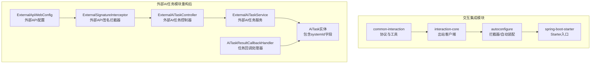
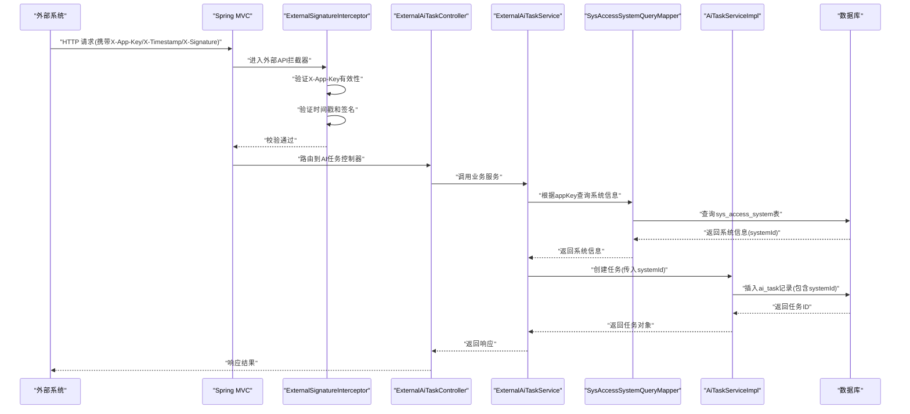
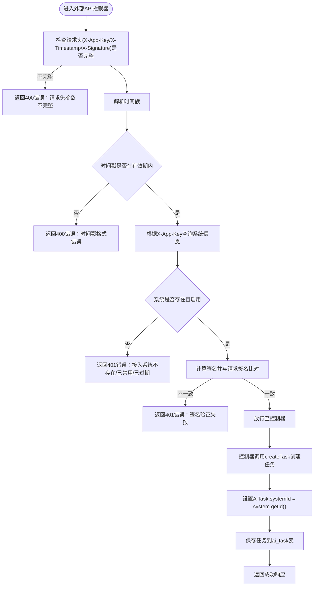
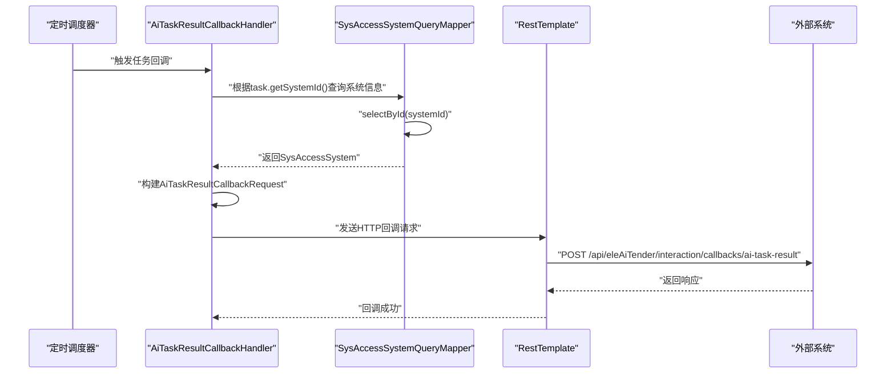
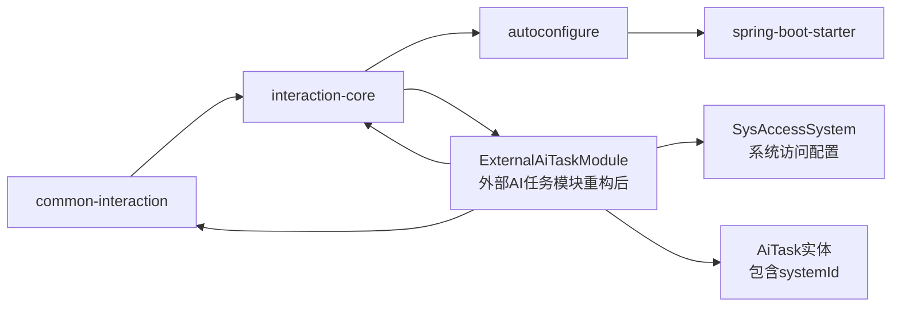

# 外部系统集成API

<cite>
**本文引用的文件**
- [INTERACTION_INTEGRATION_SPEC.md](file://docs/rules/INTERACTION_INTEGRATION_SPEC.md)
- [InteractionApiPaths.java](file://ele-ai-tender-system/ele-ai-tender-common-interaction/src/main/java/com/jy/eleaitender/common/interaction/constant/InteractionApiPaths.java)
- [InteractionSignatureInterceptor.java](file://ele-ai-tender-system/ele-ai-tender-interaction/ele-ai-tender-interaction-autoconfigure/src/main/java/com/jy/eleaitender/interaction/autoconfigure/web/InteractionSignatureInterceptor.java)
- [InteractionSignatureUtil.java](file://ele-ai-tender-system/ele-ai-tender-common-interaction/src/main/java/com/jy/eleaitender/common/interaction/util/InteractionSignatureUtil.java)
- [ExternalAiTaskController.java](file://ele-ai-tender-system/ele-ai-tender-core/src/main/java/com/jy/eleaitender/core/controller/external/ExternalAiTaskController.java)
- [ExternalAiTaskService.java](file://ele-ai-tender-system/ele-ai-tender-core/src/main/java/com/jy/eleaitender/core/service/external/ExternalAiTaskService.java)
- [ExternalSignatureInterceptor.java](file://ele-ai-tender-system/ele-ai-tender-core/src/main/java/com/jy/eleaitender/core/config/ExternalSignatureInterceptor.java)
- [ExternalApiWebConfig.java](file://ele-ai-tender-system/ele-ai-tender-core/src/main/java/com/jy/eleaitender/core/config/ExternalApiWebConfig.java)
- [InteractionHeaderConstants.java](file://ele-ai-tender-system/ele-ai-tender-common-interaction/src/main/java/com/jy/eleaitender/common/interaction/constant/InteractionHeaderConstants.java)
- [AiTaskServiceImpl.java](file://ele-ai-tender-system/ele-ai-tender-core/src/main/java/com/jy/eleaitender/core/service/impl/AiTaskServiceImpl.java)
- [AiTaskResultCallbackHandler.java](file://ele-ai-tender-system/ele-ai-tender-core/src/main/java/com/jy/eleaitender/core/scheduler/AiTaskResultCallbackHandler.java)
- [SysAccessSystemQueryMapper.java](file://ele-ai-tender-system/ele-ai-tender-core/src/main/java/com/jy/eleaitender/core/mapper/SysAccessSystemQueryMapper.java)
- [AiTask.java](file://ele-ai-tender-system/ele-ai-tender-common/src/main/java/com/jy/eleaitender/common/entity/ai/AiTask.java)
- [AiTaskCreateRequest.java](file://ele-ai-tender-system/ele-ai-tender-common-interaction/src/main/java/com/jy/eleaitender/common/interaction/dto/AiTaskCreateRequest.java)
- [AiTaskCreateResponse.java](file://ele-ai-tender-system/ele-ai-tender-common-interaction/src/main/java/com/jy/eleaitender/common/interaction/dto/AiTaskCreateResponse.java)
- [AiTaskQueryResponse.java](file://ele-ai-tender-system/ele-ai-tender-common-interaction/src/main/java/com/jy/eleaitender/common/interaction/dto/AiTaskQueryResponse.java)
- [AiTaskResultCallbackRequest.java](file://ele-ai-tender-system/ele-ai-tender-interaction/ele-ai-tender-common-interaction/src/main/java/com/jy/eleaitender/common/interaction/dto/AiTaskResultCallbackRequest.java)
- [ResponseCode.java](file://ele-ai-tender-system/ele-ai-tender-common/src/main/java/com/jy/eleaitender/common/enums/ResponseCode.java)
- [pom.xml（interaction-core）](file://ele-ai-tender-system/ele-ai-tender-interaction/ele-ai-tender-interaction-core/pom.xml)
- [pom.xml（common-interaction）](file://ele-ai-tender-system/ele-ai-tender-common-interaction/pom.xml)
- [pom.xml（interaction聚合）](file://ele-ai-tender-system/ele-ai-tender-interaction/pom.xml)
- [CLAUDE.md](file://CLAUDE.md)
- [PROJECT_SPEC_FINAL.md](file://docs/rules/PROJECT_SPEC_FINAL.md)
</cite>

## 更新摘要
**变更内容**
- **架构重构**：采用systemId-based方式替代原有的AiTaskExternalCallback系统，简化了外部任务创建流程
- **数据模型优化**：AiTask实体新增systemId字段，直接关联外部系统ID，移除独立的回调记录表
- **回调机制简化**：通过AiTaskResultCallbackHandler统一处理任务结果回调，基于systemId查找外部系统配置
- **认证流程优化**：保持X-App-Key认证机制，但数据隔离逻辑从独立表查询改为基于systemId的直接关联

## 目录
1. [简介](#简介)
2. [项目结构](#项目结构)
3. [核心组件](#核心组件)
4. [架构总览](#架构总览)
5. [详细组件分析](#详细组件分析)
6. [依赖分析](#依赖分析)
7. [性能考虑](#性能考虑)
8. [故障排查指南](#故障排查指南)
9. [结论](#结论)
10. [附录](#附录)

## 简介
本文件为"外部系统集成模块"的对外API接口文档，聚焦与第三方系统对接能力，包括：
- CA证书管理
- 标书解密
- 投标文件推送
- **外部AI任务管理接口**（已重构）
- SPI插件架构与扩展点使用
- 接口签名验证、数据加密传输、回调通知机制的安全保障
- 标准数据交换格式、错误码规范与重试机制
- 系统集成配置、监控日志与故障排查方法

该集成体系由协议库与Starter组成，提供统一前缀的固定路径、出站客户端能力以及可插拔的业务SPI实现。**现已采用systemId-based架构重构外部AI任务接口，通过AiTask实体的systemId字段直接关联外部系统，简化了数据模型和回调流程。**

## 项目结构
交互集成相关代码分布在以下模块：
- ele-ai-tender-common-interaction：对外协议DTO、常量、工具类（JDK 8兼容）
- ele-ai-tender-interaction-core：出站HTTP客户端与自动装配支持
- ele-ai-tender-interaction-autoconfigure：Web拦截器、自动配置等
- ele-ai-tender-interaction-spring-boot-starter：Starter入口，便于业务系统引入
- **ele-ai-tender-core：外部AI任务控制器和服务实现（已重构）**



**图表来源**
- [pom.xml（interaction聚合）:43-47](file://ele-ai-tender-system/ele-ai-tender-interaction/pom.xml#L43-L47)
- [pom.xml（interaction-core）:19-37](file://ele-ai-tender-system/ele-ai-tender-interaction/ele-ai-tender-interaction-core/pom.xml#L19-L37)
- [pom.xml（common-interaction）:19-21](file://ele-ai-tender-system/ele-ai-tender-common-interaction/pom.xml#L19-L21)
- [ExternalApiWebConfig.java:28-31](file://ele-ai-tender-system/ele-ai-tender-core/src/main/java/com/jy/eleaitender/core/config/ExternalApiWebConfig.java#L28-L31)
- [AiTask.java:27-28](file://ele-ai-tender-system/ele-ai-tender-common/src/main/java/com/jy/eleaitender/common/entity/ai/AiTask.java#L27-L28)

章节来源
- [INTERACTION_INTEGRATION_SPEC.md:1-13](file://docs/rules/INTERACTION_INTEGRATION_SPEC.md#L1-L13)
- [PROJECT_SPEC_FINAL.md:29-44](file://docs/rules/PROJECT_SPEC_FINAL.md#L29-L44)

## 核心组件
- 固定路径与接口清单：统一前缀 /api/eleAiTender/interaction，包含身份、项目信息、CA密钥查询及多类回调接口
- **外部AI任务接口**：独立的前缀 /api/external/ai-tasks，提供AI任务的创建和查询功能（已重构）
- 出站客户端能力：获取external token、用户信息、文件操作、投标文件预存、提交/查询解密、编制入口URL构造
- **双重安全机制**：
  - 传统HMAC-SHA256签名校验（/api/eleAiTender/interaction）
  - **X-App-Key认证机制（/api/external/ai-tasks）**
- **systemId-based数据隔离**：通过AiTask实体的systemId字段直接关联外部系统，无需独立的回调记录表
- SPI扩展点：业务系统需实现若干服务接口以完成具体业务逻辑
- 配置项：统一前缀 ele-ai-tender.interaction，涵盖基础URL、认证、文件、加解密与投标相关路径

章节来源
- [INTERACTION_INTEGRATION_SPEC.md:19-76](file://docs/rules/INTERACTION_INTEGRATION_SPEC.md#L19-L76)
- [InteractionApiPaths.java:1-13](file://ele-ai-tender-system/ele-ai-tender-common-interaction/src/main/java/com/jy/eleaitender/common/interaction/constant/InteractionApiPaths.java#L1-L13)
- [ExternalAiTaskController.java:22](file://ele-ai-tender-system/ele-ai-tender-core/src/main/java/com/jy/eleaitender/core/controller/external/ExternalAiTaskController.java#L22)

## 架构总览
交互集成采用"协议单源 + Starter自动装配 + 业务SPI实现"的分层设计。调用方通过Starter启用后，自动注册拦截器进行签名校验，随后路由到控制器并委托给业务SPI处理；出站侧通过core提供的客户端访问第三方系统。**重构后的外部AI任务接口采用systemId-based架构，通过AiTask实体的systemId字段直接关联外部系统，简化了数据模型和回调流程。**



**图表来源**
- [ExternalSignatureInterceptor.java:29-72](file://ele-ai-tender-system/ele-ai-tender-core/src/main/java/com/jy/eleaitender/core/config/ExternalSignatureInterceptor.java#L29-L72)
- [ExternalAiTaskController.java:37-43](file://ele-ai-tender-system/ele-ai-tender-core/src/main/java/com/jy/eleaitender/core/controller/external/ExternalAiTaskController.java#L37-L43)
- [ExternalAiTaskService.java:72-80](file://ele-ai-tender-system/ele-ai-tender-core/src/main/java/com/jy/eleaitender/core/service/external/ExternalAiTaskService.java#L72-L80)
- [AiTaskServiceImpl.java:40-44](file://ele-ai-tender-system/ele-ai-tender-core/src/main/java/com/jy/eleaitender/core/service/impl/AiTaskServiceImpl.java#L40-L44)
- [SysAccessSystemQueryMapper.java:18-19](file://ele-ai-tender-system/ele-ai-tender-core/src/main/java/com/jy/eleaitender/core/mapper/SysAccessSystemQueryMapper.java#L18-L19)

## 详细组件分析

### 固定接口与路径
- **传统交互接口前缀**：/api/eleAiTender/interaction
- **外部AI任务接口前缀**：/api/external/ai-tasks（已重构）
- 当前固定接口：
  - GET /identity/current
  - POST /projects/basic-info
  - POST /bid-record-schemes/query
  - POST /ca-keys/query
  - POST /callbacks/tender-pdf
  - POST /callbacks/tender-package
  - POST /callbacks/bid-document-result
  - POST /callbacks/bid-decrypt-result
  - **POST /api/external/ai-tasks（已重构）**
  - **GET /api/external/ai-tasks/{taskId}（已重构）**
  - **GET /api/external/ai-tasks/{taskId}/status（已重构）**

说明：
- 以上路径在规范中明确定义，作为对外接入的统一边界
- 协议DTO与常量位于common-interaction模块，保持单源维护
- **外部AI任务接口采用独立的路径前缀，便于权限管理和安全控制**

章节来源
- [INTERACTION_INTEGRATION_SPEC.md:19-33](file://docs/rules/INTERACTION_INTEGRATION_SPEC.md#L19-L33)
- [InteractionApiPaths.java:1-13](file://ele-ai-tender-system/ele-ai-tender-common-interaction/src/main/java/com/jy/eleaitender/common/interaction/constant/InteractionApiPaths.java#L1-L13)
- [ExternalAiTaskController.java:22](file://ele-ai-tender-system/ele-ai-tender-core/src/main/java/com/jy/eleaitender/core/controller/external/ExternalAiTaskController.java#L22)

### 安全与签名校验

#### 传统交互接口安全机制
- 签名算法：HmacSHA256，内容拼接 appKey + timestamp，输出大写
- 时间戳有效期：默认5分钟，防止重放攻击
- 请求头要求：必须包含 appKey、timestamp、signature
- 校验失败：抛出交互异常并返回参数错误或签名错误码

#### 外部AI任务接口安全机制（已重构）
- **认证方式**：X-App-Key + X-Timestamp + X-Signature
- **拦截器**：ExternalSignatureInterceptor专门处理/api/external/ai-tasks/**路径
- **系统验证**：检查appKey对应的系统是否存在、是否启用、是否过期
- **签名验证**：使用相同的HmacSHA256算法进行签名校验
- **systemId-based数据隔离**：通过AiTask实体的systemId字段确保外部系统只能访问自己创建的任务



**图表来源**
- [ExternalSignatureInterceptor.java:29-72](file://ele-ai-tender-system/ele-ai-tender-core/src/main/java/com/jy/eleaitender/core/config/ExternalSignatureInterceptor.java#L29-L72)
- [ExternalAiTaskService.java:72-80](file://ele-ai-tender-system/ele-ai-tender-core/src/main/java/com/jy/eleaitender/core/service/external/ExternalAiTaskService.java#L72-L80)
- [AiTaskServiceImpl.java:54-76](file://ele-ai-tender-system/ele-ai-tender-core/src/main/java/com/jy/eleaitender/core/service/impl/AiTaskServiceImpl.java#L54-L76)

章节来源
- [InteractionSignatureInterceptor.java:29-55](file://ele-ai-tender-system/ele-ai-tender-interaction/ele-ai-tender-interaction-autoconfigure/src/main/java/com/jy/eleaitender/interaction/autoconfigure/web/InteractionSignatureInterceptor.java#L29-L55)
- [InteractionSignatureUtil.java:18-36](file://ele-ai-tender-system/ele-ai-tender-common-interaction/src/main/java/com/jy/eleaitender/common/interaction/util/InteractionSignatureUtil.java#L18-L36)
- [ExternalSignatureInterceptor.java:29-72](file://ele-ai-tender-system/ele-ai-tender-core/src/main/java/com/jy/eleaitender/core/config/ExternalSignatureInterceptor.java#L29-L72)
- [ExternalAiTaskService.java:72-80](file://ele-ai-tender-system/ele-ai-tender-core/src/main/java/com/jy/eleaitender/core/service/external/ExternalAiTaskService.java#L72-L80)

### 外部AI任务接口详解（已重构）

#### 接口概览
外部AI任务接口经过架构重构，采用systemId-based方式简化了外部任务创建流程：

- **创建AI任务**：POST /api/external/ai-tasks
- **查询任务详情**：GET /api/external/ai-tasks/{taskId}
- **查询任务状态**：GET /api/external/ai-tasks/{taskId}/status

#### 请求认证
所有接口必须在请求头中包含：
- `X-App-Key`：应用标识符
- `X-Timestamp`：请求时间戳（毫秒）
- `X-Signature`：HmacSHA256签名值

#### systemId-based数据隔离机制（重构后）
**新的数据隔离方案**通过AiTask实体的systemId字段实现：

```java
// ExternalAiTaskService中的任务创建逻辑
public AiTaskCreateResponse createTask(String appKey, AiTaskCreateRequest request) {
    // 查询外部系统信息
    SysAccessSystem system = accessSystemQueryMapper.selectByAppKey(appKey);
    
    // 创建任务时直接传入systemId
    AiTask task = aiTaskService.createExternalTask(taskType, system.getId(), null, 
        request.getBizId(), request.getBizType(), params, request.getFileIds());
    
    return response;
}
```

**工作原理**：
1. 每次创建任务时，通过appKey查询sys_access_system表获取systemId
2. 将systemId直接保存到AiTask实体的systemId字段
3. 查询任务时，通过systemId确保外部系统只能访问自己的任务
4. 移除了独立的ai_task_external_callback表，简化了数据模型

#### 数据模型变化
- **AiTask实体**：新增systemId字段，直接关联外部系统
- **AiTaskCreateRequest**：保持不变，包含任务类型、业务ID、业务类型、请求参数等
- **AiTaskQueryResponse**：保持不变，包含任务状态、执行结果、错误信息等
- **移除AiTaskExternalCallback**：不再需要独立的回调记录表

章节来源
- [ExternalAiTaskController.java:29-51](file://ele-ai-tender-system/ele-ai-tender-core/src/main/java/com/jy/eleaitender/core/controller/external/ExternalAiTaskController.java#L29-L51)
- [ExternalAiTaskService.java:45-89](file://ele-ai-tender-system/ele-ai-tender-core/src/main/java/com/jy/eleaitender/core/service/external/ExternalAiTaskService.java#L45-L89)
- [AiTaskServiceImpl.java:40-44](file://ele-ai-tender-system/ele-ai-tender-core/src/main/java/com/jy/eleaitender/core/service/impl/AiTaskServiceImpl.java#L40-L44)
- [AiTask.java:27-28](file://ele-ai-tender-system/ele-ai-tender-common/src/main/java/com/jy/eleaitender/common/entity/ai/AiTask.java#L27-L28)
- [AiTaskCreateRequest.java:11-39](file://ele-ai-tender-system/ele-ai-tender-common-interaction/src/main/java/com/jy/eleaitender/common/interaction/dto/AiTaskCreateRequest.java#L11-L39)
- [AiTaskQueryResponse.java:11-79](file://ele-ai-tender-system/ele-ai-tender-common-interaction/src/main/java/com/jy/eleaitender/common/interaction/dto/AiTaskQueryResponse.java#L11-L79)

### AI任务回调机制（重构后）

#### 统一的回调处理器
**重构后的回调机制**通过AiTaskResultCallbackHandler统一处理：



**图表来源**
- [AiTaskResultCallbackHandler.java:44-84](file://ele-ai-tender-system/ele-ai-tender-core/src/main/java/com/jy/eleaitender/core/scheduler/AiTaskResultCallbackHandler.java#L44-L84)
- [AiTaskResultCallbackHandler.java:46-47](file://ele-ai-tender-system/ele-ai-tender-core/src/main/java/com/jy/eleaitender/core/scheduler/AiTaskResultCallbackHandler.java#L46-L47)

#### 回调请求数据结构
- **AiTaskResultCallbackRequest**：包含任务ID、任务类型、业务ID、业务类型、任务状态、执行结果、错误信息、完成时间等字段
- **回调路径**：/api/eleAiTender/interaction/callbacks/ai-task-result
- **认证方式**：使用外部系统的appKey和appSecret生成签名

章节来源
- [AiTaskResultCallbackHandler.java:30-98](file://ele-ai-tender-system/ele-ai-tender-core/src/main/java/com/jy/eleaitender/core/scheduler/AiTaskResultCallbackHandler.java#L30-L98)
- [AiTaskResultCallbackRequest.java:10-55](file://ele-ai-tender-system/ele-ai-tender-interaction/ele-ai-tender-common-interaction/src/main/java/com/jy/eleaitender/common/interaction/dto/AiTaskResultCallbackRequest.java#L10-L55)

### SPI插件架构与扩展点
- 定位：业务系统必须实现的SPI用于承载具体业务逻辑
- 必须实现的SPI列表：
  - InteractionIdentityService
  - InteractionProjectInfoService
  - InteractionBidRecordSchemeService
  - InteractionCaKeysInfoService
  - InteractionTenderPdfReceiveService
  - InteractionTenderPackageReceiveService
  - InteractionBidDocumentResultReceiveService
  - InteractionBidDecryptResultReceiveService

使用方式：
- 在业务系统中实现上述接口并通过Spring容器注册
- 控制器或编排层根据请求类型选择对应SPI进行处理
- 协议DTO仅在controller/facade边界做显式转换，service层不直接透传协议DTO

章节来源
- [INTERACTION_INTEGRATION_SPEC.md:34-43](file://docs/rules/INTERACTION_INTEGRATION_SPEC.md#L34-L43)
- [INTERACTION_INTEGRATION_SPEC.md:78-83](file://docs/rules/INTERACTION_INTEGRATION_SPEC.md#L78-L83)

### 出站客户端能力
- 能力清单：
  - 获取 external token
  - 获取当前外部用户信息
  - 查询文件信息
  - 下载文件
  - 上传文件
  - 推送投标文件预存
  - 提交解密请求
  - 查询解密状态
  - 构造招标文件编制入口 URL

说明：
- 出站能力由 interaction-core 提供，基于 Spring Web 与 JSON 序列化
- 业务系统可通过注入相应客户端发起对第三方系统的调用

章节来源
- [INTERACTION_INTEGRATION_SPEC.md:45-55](file://docs/rules/INTERACTION_INTEGRATION_SPEC.md#L45-L55)
- [pom.xml（interaction-core）:19-37](file://ele-ai-tender-system/ele-ai-tender-interaction/ele-ai-tender-interaction-core/pom.xml#L19-L37)

### 配置项与环境
- 统一配置前缀：ele-ai-tender.interaction
- 关键配置项：
  - api-base-url、page-base-url
  - app-key、app-secret
  - token-path、user-info-path
  - file-base-url、file-info-path、file-download-path、file-upload-path
  - crypto-base-url
  - bid-document-push-path、bid-decrypt-submit-path、bid-decrypt-status-path

建议：
- 将敏感配置（如app-secret）放入环境变量或独立配置文件
- 不同环境（dev/test/prod）分别维护配置，避免硬编码

章节来源
- [INTERACTION_INTEGRATION_SPEC.md:57-76](file://docs/rules/INTERACTION_INTEGRATION_SPEC.md#L57-L76)
- [CLAUDE.md:144-149](file://CLAUDE.md#L144-L149)

### 数据交换格式与错误码
- 数据交换格式：
  - 协议DTO单源维护于 common-interaction
  - controller/facade边界做显式mapper转换
  - service层不透传协议DTO
- 错误码与异常：
  - 交互接口使用统一的交互结果包装
  - 签名/参数错误通过交互异常返回，包含明确的错误码
  - **重构后错误码保持不变，继续使用ResponseCode枚举**

章节来源
- [INTERACTION_INTEGRATION_SPEC.md:78-83](file://docs/rules/INTERACTION_INTEGRATION_SPEC.md#L78-L83)
- [CLAUDE.md:119-131](file://CLAUDE.md#L119-131)
- [ResponseCode.java:15](file://ele-ai-tender-system/ele-ai-tender-common/src/main/java/com/jy/eleaitender/common/enums/ResponseCode.java#L15)

### 重试机制与幂等性
- 重试策略：
  - 针对网络抖动或第三方瞬时不可用，建议在出站客户端或服务编排层增加指数退避重试
  - 对幂等接口（如查询、状态同步）可安全重试；非幂等接口需谨慎
- 幂等性建议：
  - 回调接口应支持幂等处理（例如基于唯一流水号去重）
  - 结合Redis或数据库唯一约束保证重复消息不造成副作用
- **重构后的数据隔离**：
  - 每个外部系统的任务数据通过systemId完全隔离
  - 通过AiTask实体的systemId字段维护任务与外部系统的关联关系
  - 移除了独立的回调记录表，简化了数据模型

[本节为通用指导，不直接分析具体文件]

## 依赖分析
交互集成模块之间的依赖关系如下：
- interaction-core 依赖 common-interaction
- autoconfigure 依赖 core 与 common-interaction
- starter 聚合各子模块，便于业务系统一键引入
- **重构后的外部AI任务模块依赖core模块，通过systemId实现数据隔离**



**图表来源**
- [pom.xml（interaction-core）:19-37](file://ele-ai-tender-system/ele-ai-tender-interaction/ele-ai-tender-interaction-core/pom.xml#L19-L37)
- [pom.xml（interaction聚合）:43-47](file://ele-ai-tender-system/ele-ai-tender-interaction/pom.xml#L43-L47)
- [ExternalAiTaskController.java:9](file://ele-ai-tender-system/ele-ai-tender-core/src/main/java/com/jy/eleaitender/core/controller/external/ExternalAiTaskController.java#L9)
- [AiTask.java:27-28](file://ele-ai-tender-system/ele-ai-tender-common/src/main/java/com/jy/eleaitender/common/entity/ai/AiTask.java#L27-L28)

章节来源
- [pom.xml（interaction-core）:19-37](file://ele-ai-tender-system/ele-ai-tender-interaction/ele-ai-tender-interaction-core/pom.xml#L19-L37)
- [pom.xml（interaction聚合）:43-47](file://ele-ai-tender-system/ele-ai-tender-interaction/pom.xml#L43-L47)

## 性能考虑
- 签名计算开销较小，但应避免在热点路径上频繁创建对象
- 时间戳校验应在拦截器早期执行，尽早拒绝无效请求
- 出站客户端连接池与超时参数应根据第三方系统SLA合理配置
- 回调接口建议异步落库与后续处理解耦，提升吞吐
- **重构后的性能优化**：
  - **简化数据模型**：移除ai_task_external_callback表，减少数据库查询次数
  - **直接关联查询**：通过AiTask.systemId直接关联外部系统，无需额外的所有权验证查询
  - **索引优化建议**：为ai_task表的system_id字段建立索引，提升按系统查询的性能
  - **回调处理优化**：AiTaskResultCallbackHandler通过systemId直接查询系统配置，减少中间表关联

[本节为通用指导，不直接分析具体文件]

## 故障排查指南
常见问题与定位要点：
- 签名错误：
  - 检查appKey、appSecret是否与Starter配置一致
  - 确认客户端与服务端时间差在5分钟内
  - 核对签名算法与大小写规则
- 参数不完整：
  - 确保请求头包含appKey、timestamp、signature
- **重构后外部AI任务接口特定问题**：
  - **X-App-Key认证失败**：检查外部系统配置是否正确，确认系统状态为启用且未过期
  - **任务创建失败**：检查sys_access_system表中system_url配置是否正确
  - **任务查询无权限**：确认请求的appKey与任务创建时的systemId匹配
  - **回调推送失败**：检查外部系统的callback路径配置和签名验证
- 回调未触发：
  - 检查回调路径配置是否正确
  - 查看业务SPI实现是否注册成功
  - 关注链路追踪ID（X-Trace-Id）与MDC traceId
- 出站失败：
  - 核对base-url与path配置
  - 检查网络连通性与第三方系统状态
  - 查看客户端日志与重试次数

章节来源
- [InteractionSignatureInterceptor.java:29-55](file://ele-ai-tender-system/ele-ai-tender-interaction/ele-ai-tender-interaction-autoconfigure/src/main/java/com/jy/eleaitender/interaction/autoconfigure/web/InteractionSignatureInterceptor.java#L29-L55)
- [ExternalSignatureInterceptor.java:29-72](file://ele-ai-tender-system/ele-ai-tender-core/src/main/java/com/jy/eleaitender/core/config/ExternalSignatureInterceptor.java#L29-L72)
- [ExternalAiTaskService.java:72-80](file://ele-ai-tender-system/ele-ai-tender-core/src/main/java/com/jy/eleaitender/core/service/external/ExternalAiTaskService.java#L72-L80)
- [AiTaskResultCallbackHandler.java:44-84](file://ele-ai-tender-system/ele-ai-tender-core/src/main/java/com/jy/eleaitender/core/scheduler/AiTaskResultCallbackHandler.java#L44-L84)
- [CLAUDE.md:144-151](file://CLAUDE.md#L144-L151)

## 结论
外部系统集成模块通过统一的协议与Starter，提供了标准化的对外接口、安全的签名校验、可扩展的SPI架构以及完善的出站客户端能力。**经过systemId-based架构重构的外部AI任务接口进一步简化了数据模型和回调流程，通过AiTask实体的systemId字段直接关联外部系统，提升了系统性能和可维护性。**遵循本规范可实现与第三方系统在CA证书管理、标书解密、投标文件推送、AI任务管理等场景的稳定对接，并具备良好的可观测性与可维护性。

## 附录

### 接口清单速查
- **传统交互接口前缀**：/api/eleAiTender/interaction
- **外部AI任务接口前缀**：/api/external/ai-tasks（已重构）
- 固定接口：
  - GET /identity/current
  - POST /projects/basic-info
  - POST /bid-record-schemes/query
  - POST /ca-keys/query
  - POST /callbacks/tender-pdf
  - POST /callbacks/tender-package
  - POST /callbacks/bid-document-result
  - POST /callbacks/bid-decrypt-result
  - **POST /api/external/ai-tasks（已重构）**
  - **GET /api/external/ai-tasks/{taskId}（已重构）**
  - **GET /api/external/ai-tasks/{taskId}/status（已重构）**

章节来源
- [INTERACTION_INTEGRATION_SPEC.md:19-33](file://docs/rules/INTERACTION_INTEGRATION_SPEC.md#L19-L33)
- [ExternalAiTaskController.java:22](file://ele-ai-tender-system/ele-ai-tender-core/src/main/java/com/jy/eleaitender/core/controller/external/ExternalAiTaskController.java#L22)

### 配置项速查
- 统一配置前缀：ele-ai-tender.interaction
- 关键项：
  - api-base-url、page-base-url
  - app-key、app-secret
  - token-path、user-info-path
  - file-base-url、file-info-path、file-download-path、file-upload-path
  - crypto-base-url
  - bid-document-push-path、bid-decrypt-submit-path、bid-decrypt-status-path

章节来源
- [INTERACTION_INTEGRATION_SPEC.md:57-76](file://docs/rules/INTERACTION_INTEGRATION_SPEC.md#L57-L76)

### 外部AI任务接口认证要求（重构后）
- **请求头要求**：
  - X-App-Key：应用标识符（必填）
  - X-Timestamp：请求时间戳，毫秒级（必填）
  - X-Signature：HmacSHA256签名值（必填）
- **认证流程**：
  1. 验证请求头完整性
  2. 检查时间戳有效性
  3. 验证appKey对应的系统状态
  4. 验证签名正确性
  5. **systemId-based数据隔离**：通过AiTask.systemId确保任务归属
- **错误码**：
  - 400：请求头参数不完整或时间戳格式错误
  - 401：接入系统不存在/已禁用/已过期或签名验证失败
  - 403：无权查询此任务（重构后通过systemId验证）

章节来源
- [ExternalSignatureInterceptor.java:29-72](file://ele-ai-tender-system/ele-ai-tender-core/src/main/java/com/jy/eleaitender/core/config/ExternalSignatureInterceptor.java#L29-L72)
- [ExternalAiTaskService.java:72-80](file://ele-ai-tender-system/ele-ai-tender-core/src/main/java/com/jy/eleaitender/core/service/external/ExternalAiTaskService.java#L72-L80)
- [AiTask.java:27-28](file://ele-ai-tender-system/ele-ai-tender-common/src/main/java/com/jy/eleaitender/common/entity/ai/AiTask.java#L27-L28)
- [ResponseCode.java:15](file://ele-ai-tender-system/ele-ai-tender-common/src/main/java/com/jy/eleaitender/common/enums/ResponseCode.java#L15)

### 重构前后对比
- **数据模型变化**：
  - 重构前：AiTask + AiTaskExternalCallback两张表
  - 重构后：仅AiTask表，通过systemId字段关联外部系统
- **回调机制变化**：
  - 重构前：独立的回调记录表和复杂的回调流程
  - 重构后：统一的AiTaskResultCallbackHandler，基于systemId直接回调
- **性能优化**：
  - 减少了数据库表关联查询
  - 简化了数据隔离逻辑
  - 提升了系统整体性能

章节来源
- [AiTaskServiceImpl.java:40-44](file://ele-ai-tender-system/ele-ai-tender-core/src/main/java/com/jy/eleaitender/core/service/impl/AiTaskServiceImpl.java#L40-L44)
- [AiTaskResultCallbackHandler.java:44-84](file://ele-ai-tender-system/ele-ai-tender-core/src/main/java/com/jy/eleaitender/core/scheduler/AiTaskResultCallbackHandler.java#L44-L84)
- [AiTask.java:27-28](file://ele-ai-tender-system/ele-ai-tender-common/src/main/java/com/jy/eleaitender/common/entity/ai/AiTask.java#L27-L28)