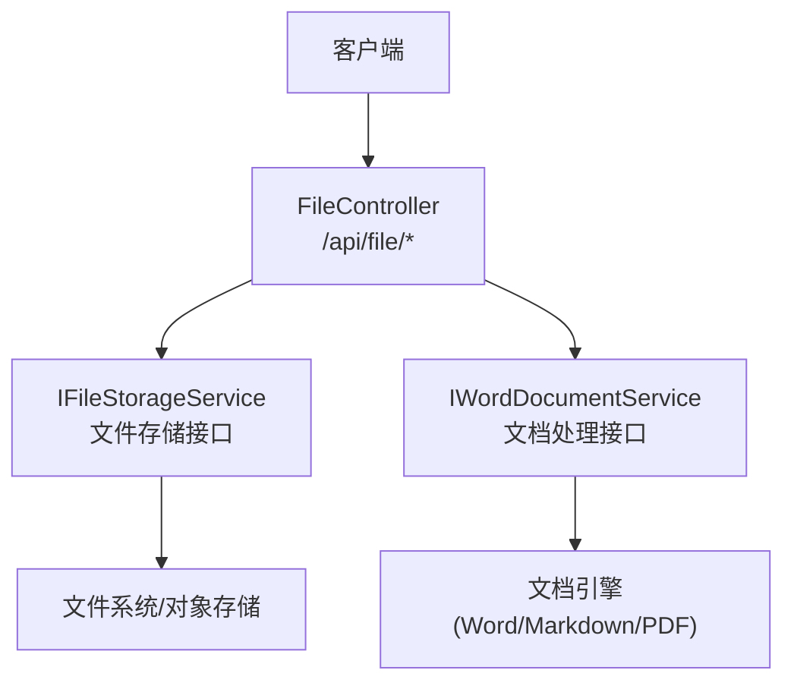
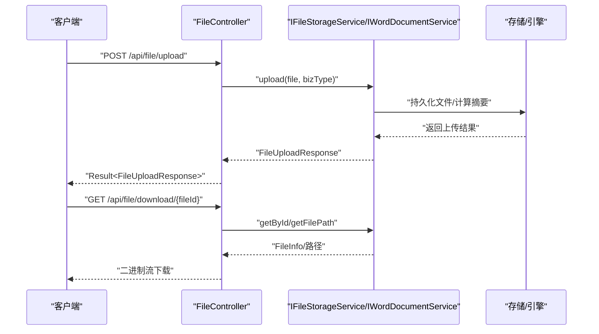
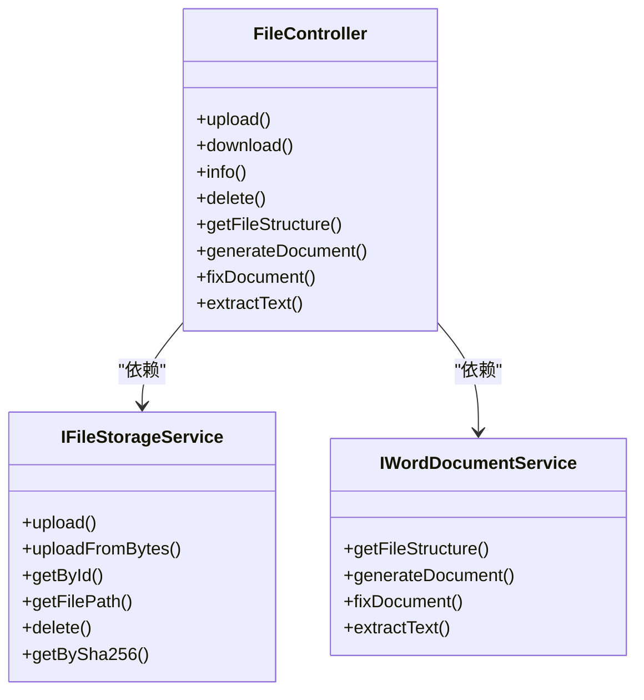

# 文件服务API

<cite>
**本文引用的文件**   
- [FILE_SERVICE_SPEC.md](file://docs/rules/FILE_SERVICE_SPEC.md)
- [FileController.java](file://ele-ai-tender-system/ele-ai-tender-file/src/main/java/com/jy/eleaitender/file/controller/FileController.java)
- [IFileStorageService.java](file://ele-ai-tender-system/ele-ai-tender-file/src/main/java/com/jy/eleaitender/file/service/IFileStorageService.java)
- [IWordDocumentService.java](file://ele-ai-tender-system/ele-ai-tender-file/src/main/java/com/jy/eleaitender/file/service/IWordDocumentService.java)
- [ele-ai-tender-file.yml](file://docs/guides/ele-ai-tender-file.yml)
</cite>

## 目录
1. [简介](#简介)
2. [项目结构](#项目结构)
3. [核心组件](#核心组件)
4. [架构总览](#架构总览)
5. [详细接口说明](#详细接口说明)
6. [依赖关系分析](#依赖关系分析)
7. [性能与优化建议](#性能与优化建议)
8. [故障排查指南](#故障排查指南)
9. [结论](#结论)
10. [附录](#附录)

## 简介
本文件为“文件服务模块”的API接口文档，覆盖上传、下载、信息获取、删除、文本提取、模板生成、文档修复等能力。同时给出分片上传、断点续传、进度跟踪的实现思路与参数配置建议；说明多格式文档（Word、PDF、Markdown）转换接口的使用方式与批量处理策略；并提供大文件传输优化、存储策略配置与安全访问控制的使用指南；最后补充文件格式验证、病毒扫描与存储配额管理的调用方法建议。

## 项目结构
文件服务位于 ele-ai-tender-file 模块，对外暴露 /api/file 前缀的REST接口，由控制器统一接收请求并委派至存储服务与文档引擎服务。

图示来源
- [FileController.java:40-176](file://ele-ai-tender-system/ele-ai-tender-file/src/main/java/com/jy/eleaitender/file/controller/FileController.java#L40-L176)
- [IFileStorageService.java:1-65](file://ele-ai-tender-system/ele-ai-tender-file/src/main/java/com/jy/eleaitender/file/service/IFileStorageService.java#L1-L65)
- [IWordDocumentService.java:1-50](file://ele-ai-tender-system/ele-ai-tender-file/src/main/java/com/jy/eleaitender/file/service/IWordDocumentService.java#L1-L50)

章节来源
- [FILE_SERVICE_SPEC.md:1-153](file://docs/rules/FILE_SERVICE_SPEC.md#L1-L153)
- [FileController.java:40-176](file://ele-ai-tender-system/ele-ai-tender-file/src/main/java/com/jy/eleaitender/file/controller/FileController.java#L40-L176)

## 核心组件
- FileController：提供统一的HTTP入口，负责参数校验、权限注解、响应封装。
- IFileStorageService：定义上传、查询、路径解析、删除、按SHA-256查询等能力。
- IWordDocumentService：定义Word文档结构解析、模板生成、文本替换修复、文本+位置索引提取等能力。

章节来源
- [FileController.java:40-176](file://ele-ai-tender-system/ele-ai-tender-file/src/main/java/com/jy/eleaitender/file/controller/FileController.java#L40-L176)
- [IFileStorageService.java:1-65](file://ele-ai-tender-system/ele-ai-tender-file/src/main/java/com/jy/eleaitender/file/service/IFileStorageService.java#L1-L65)
- [IWordDocumentService.java:1-50](file://ele-ai-tender-system/ele-ai-tender-file/src/main/java/com/jy/eleaitender/file/service/IWordDocumentService.java#L1-L50)

## 架构总览
下图展示典型请求在控制器与服务层之间的交互流程。

图示来源
- [FileController.java:50-86](file://ele-ai-tender-system/ele-ai-tender-file/src/main/java/com/jy/eleaitender/file/controller/FileController.java#L50-L86)
- [IFileStorageService.java:21-47](file://ele-ai-tender-system/ele-ai-tender-file/src/main/java/com/jy/eleaitender/file/service/IFileStorageService.java#L21-L47)

## 详细接口说明

### 通用约定
- 基础路径：/api/file
- 鉴权：所有接口均要求登录（@RequireLogin），内部服务间调用使用特定JWT类型。
- 统一响应：Result<T> 包装，包含 code/message/data。
- 错误码：参考 ResponseCode 枚举（如 PARAM_ERROR、FILE_NOT_FOUND）。

章节来源
- [FileController.java:40-176](file://ele-ai-tender-system/ele-ai-tender-file/src/main/java/com/jy/eleaitender/file/controller/FileController.java#L40-L176)
- [FILE_SERVICE_SPEC.md:129-137](file://docs/rules/FILE_SERVICE_SPEC.md#L129-L137)

---

### 上传文件
- 方法：POST
- 路径：/api/file/upload
- 内容类型：multipart/form-data
- 表单字段
  - file：二进制文件
  - bizType：业务类型（必填）
- 成功响应：Result<FileUploadResponse>
- 失败响应：Result.fail(ResponseCode.PARAM_ERROR) 或业务异常
- 约束
  - 默认最大文件大小：500MB
  - 白名单后缀：.doc/.docx/.pdf/.txt/.md/.jar/.war/.zip/.tar.gz
  - 支持按 SHA-256 秒传（通过 getBySha256 查询复用）

章节来源
- [FileController.java:50-58](file://ele-ai-tender-system/ele-ai-tender-file/src/main/java/com/jy/eleaitender/file/controller/FileController.java#L50-L58)
- [IFileStorageService.java:21-31](file://ele-ai-tender-system/ele-ai-tender-file/src/main/java/com/jy/eleaitender/file/service/IFileStorageService.java#L21-L31)
- [FILE_SERVICE_SPEC.md:110-121](file://docs/rules/FILE_SERVICE_SPEC.md#L110-L121)
- [FILE_SERVICE_SPEC.md:63-63](file://docs/rules/FILE_SERVICE_SPEC.md#L63-L63)

---

### 下载文件
- 方法：GET
- 路径：/api/file/download/{fileId}
- 路径参数
  - fileId：文件ID（Long）
- 成功响应：application/octet-stream 二进制流，Content-Disposition 带文件名
- 失败响应：抛出文件不存在异常（对应 FILE_NOT_FOUND）

章节来源
- [FileController.java:60-86](file://ele-ai-tender-system/ele-ai-tender-file/src/main/java/com/jy/eleaitender/file/controller/FileController.java#L60-L86)

---

### 获取文件信息
- 方法：GET
- 路径：/api/file/info/{fileId}
- 路径参数
  - fileId：文件ID（Long）
- 成功响应：Result<FileInfo>
- 失败响应：Result.fail(ResponseCode.FILE_NOT_FOUND)

章节来源
- [FileController.java:88-98](file://ele-ai-tender-system/ele-ai-tender-file/src/main/java/com/jy/eleaitender/file/controller/FileController.java#L88-L98)

---

### 删除文件
- 方法：DELETE
- 路径：/api/file/delete/{fileId}
- 路径参数
  - fileId：文件ID（Long）
- 行为
  - 若存在记录，校验文件归属（创建者ID）
- 成功响应：Result<Boolean>
- 失败响应：未命中记录时不抛异常，直接执行删除逻辑（具体实现以服务为准）

章节来源
- [FileController.java:100-112](file://ele-ai-tender-system/ele-ai-tender-file/src/main/java/com/jy/eleaitender/file/controller/FileController.java#L100-L112)

---

### 获取Word文档结构
- 方法：GET
- 路径：/api/file/structure/{fileId}
- 路径参数
  - fileId：文件ID（Long）
- 成功响应：Result<WordStructureVO>
- 用途：用于模板占位符与结构解析（例如表格、循环、条件等）

章节来源
- [FileController.java:114-119](file://ele-ai-tender-system/ele-ai-tender-file/src/main/java/com/jy/eleaitender/file/controller/FileController.java#L114-L119)
- [IWordDocumentService.java:21-21](file://ele-ai-tender-system/ele-ai-tender-file/src/main/java/com/jy/eleaitender/file/service/IWordDocumentService.java#L21-L21)

---

### 基于模板生成文档
- 方法：POST
- 路径：/api/file/generate-doc
- 请求体（JSON）
  - templateFileId：模板文件ID（Long，必填）
  - fileName：生成文件名（可选）
  - fillDataList：填充数据列表（List<Map<String,Object>>，必填）
- 成功响应：Result<Long>（生成的文件ID）
- 失败响应：Result.fail(ResponseCode.PARAM_ERROR)

章节来源
- [FileController.java:121-135](file://ele-ai-tender-system/ele-ai-tender-file/src/main/java/com/jy/eleaitender/file/controller/FileController.java#L121-L135)
- [IWordDocumentService.java:31-31](file://ele-ai-tender-system/ele-ai-tender-file/src/main/java/com/jy/eleaitender/file/service/IWordDocumentService.java#L31-L31)

---

### 修复Word文档（替换文本）
- 方法：POST
- 路径：/api/file/fix-doc
- 请求体（JSON）
  - fileId：原始文件ID（Long，必填）
  - replacements：替换列表（List<Map<String,Object>>，必填）
    - original：原文本（String）
    - targeted：目标文本（String）
    - locationRef：可选，精准定位对象（Map）
      - type：元素类型（String）
      - elementIndex：元素序号（Integer）
      - tableIndex：表格序号（Integer，可选）
      - rowIndex：行号（Integer，可选）
      - cellIndex：单元格序号（Integer，可选）
- 成功响应：Result<WordFixResultVO>
- 失败响应：Result.fail(ResponseCode.PARAM_ERROR)

章节来源
- [FileController.java:137-164](file://ele-ai-tender-system/ele-ai-tender-file/src/main/java/com/jy/eleaitender/file/controller/FileController.java#L137-L164)
- [IWordDocumentService.java:40-40](file://ele-ai-tender-system/ele-ai-tender-file/src/main/java/com/jy/eleaitender/file/service/IWordDocumentService.java#L40-L40)

---

### 提取Word文档文本+位置索引
- 方法：POST
- 路径：/api/file/extract-text
- 请求体（JSON）
  - fileId：文件ID（Long，必填）
- 成功响应：Result<Map<String,Object>>（包含 fullText 与 segments）
- 失败响应：Result.fail(ResponseCode.PARAM_ERROR)

章节来源
- [FileController.java:166-175](file://ele-ai-tender-system/ele-ai-tender-file/src/main/java/com/jy/eleaitender/file/controller/FileController.java#L166-L175)
- [IWordDocumentService.java:48-48](file://ele-ai-tender-system/ele-ai-tender-file/src/main/java/com/jy/eleaitender/file/service/IWordDocumentService.java#L48-L48)

---

### OpenAPI 参考
- 路径清单与示例可在以下文件中查看：
  - /api/file/esign/upload
  - /api/file/upload
  - /api/file/download/{fileId}
  - /api/file/info/{fileId}
  - /api/file/delete/{fileId}

章节来源
- [ele-ai-tender-file.yml:1-62](file://docs/guides/ele-ai-tender-file.yml#L1-L62)

## 依赖关系分析
- 控制器依赖两个服务接口：文件存储服务与文档服务。
- 文件存储服务提供上传、查询、路径解析、删除、按SHA-256查询等能力。
- 文档服务提供Word结构解析、模板生成、文本替换修复、文本+位置索引提取。

图示来源
- [FileController.java:40-176](file://ele-ai-tender-system/ele-ai-tender-file/src/main/java/com/jy/eleaitender/file/controller/FileController.java#L40-L176)
- [IFileStorageService.java:1-65](file://ele-ai-tender-system/ele-ai-tender-file/src/main/java/com/jy/eleaitender/file/service/IFileStorageService.java#L1-L65)
- [IWordDocumentService.java:1-50](file://ele-ai-tender-system/ele-ai-tender-file/src/main/java/com/jy/eleaitender/file/service/IWordDocumentService.java#L1-L50)

章节来源
- [FILE_SERVICE_SPEC.md:129-137](file://docs/rules/FILE_SERVICE_SPEC.md#L129-L137)

## 性能与优化建议

- 分片上传与断点续传（实现建议）
  - 初始化分片：POST /api/file/initiate-upload?bizType=...&fileName=...&totalChunks=...
  - 上传分片：POST /api/file/upload-chunk?fileId=...&chunkIndex=...&chunkMd5=...
  - 合并分片：POST /api/file/complete-upload?fileId=...
  - 状态查询：GET /api/file/upload-status?fileId=...
  - 进度上报：服务端维护 Redis 键值，客户端轮询 GET /api/file/upload-progress?fileId=...
  - 注意：当前仓库未提供上述端点，可按此规范在服务端扩展。

- 大文件传输优化
  - 启用分块读取与流式写入，避免一次性加载到内存。
  - 合理设置服务器上传大小限制（默认500MB），必要时按业务调整。
  - 使用断点续传减少网络抖动影响。

- 存储策略配置
  - 本地磁盘：配置 base-path 并确保写权限。
  - 对象存储：可对接云厂商SDK，按 bizType 划分桶/前缀。
  - 命名规则：建议使用 fileId 作为对外标识，内部路径采用哈希分片目录。

- 安全访问控制
  - 外部调用需携带登录态（@RequireLogin）。
  - 内部服务间调用使用 TOKEN_TYPE_SERVICE 类型的JWT，密钥复用 APP_JWT_SECRET。
  - 删除操作需校验文件归属（创建者ID）。

- 并发与限流
  - 对上传/下载接口增加速率限制与并发上限。
  - 使用线程池隔离CPU密集型任务（如文档生成、文本提取）。

[本节为通用指导，无需代码引用]

## 故障排查指南

- 上传失败
  - 检查文件扩展名是否在白名单内。
  - 检查文件大小是否超过限制。
  - 检查 file.storage.base-path 目录是否存在且具备写权限。

- 下载404
  - 确认 file_info.file_path 对应的物理文件是否存在。
  - 检查 file.storage.base-path 配置是否正确。

- fileSha256 校验失败
  - 确认调用方与服务端计算方式一致（UTF-8字节序列，十六进制字符串）。

- locationRef 定位失败
  - 检查 elementIndex 是否越界（段落/表格共享索引空间）。
  - 确认 WordTextExtractor 已执行。
  - 关注 DetectionResultParser.fillLocationRefs() 日志是否报匹配失败。

- 检测修复替换了错误位置
  - 检查 FixReplacement.locationRef 是否为空（为空走全文档替换会替换所有匹配项）。
  - 检查 elementIndex 对应的 IBodyElement 类型是否与 type 字段一致。

章节来源
- [FILE_SERVICE_SPEC.md:139-146](file://docs/rules/FILE_SERVICE_SPEC.md#L139-L146)

## 结论
文件服务提供了完整的文件生命周期管理与文档处理能力，涵盖上传、下载、信息查询、删除、Word结构解析、模板生成、文本替换修复与文本+位置索引提取。结合分片上传、断点续传、进度跟踪与大文件优化策略，可满足高吞吐与高可用的生产场景。建议在现有接口基础上按需扩展分片与进度相关端点，并完善病毒扫描与配额管理策略。

[本节为总结性内容，无需代码引用]

## 附录

### 接口一览
- POST /api/file/upload — 上传文件
- GET /api/file/download/{fileId} — 下载文件
- GET /api/file/info/{fileId} — 获取文件信息
- DELETE /api/file/delete/{fileId} — 删除文件
- GET /api/file/structure/{fileId} — 获取Word文档结构
- POST /api/file/generate-doc — 基于模板生成文档
- POST /api/file/fix-doc — 修复Word文档（替换文本）
- POST /api/file/extract-text — 提取Word文档文本+位置索引

章节来源
- [FILE_SERVICE_SPEC.md:7-17](file://docs/rules/FILE_SERVICE_SPEC.md#L7-L17)
- [ele-ai-tender-file.yml:1-62](file://docs/guides/ele-ai-tender-file.yml#L1-L62)

### 多格式文档支持与转换
- 当前内置文档生成引擎主要面向 Word 模板渲染与 Markdown→Word 转换。
- PDF 支持可通过后续扩展实现（例如引入 PDF 生成库或第三方转换服务）。
- 批量处理建议：
  - 将批量任务拆分为多个子任务，逐个调用 generate-doc/fix-doc/extract-text。
  - 使用异步队列与回调机制，避免长连接超时。

章节来源
- [FILE_SERVICE_SPEC.md:18-31](file://docs/rules/FILE_SERVICE_SPEC.md#L18-L31)

### 文件格式验证、病毒扫描与配额管理（实现建议）
- 格式验证
  - 基于扩展名白名单与MIME类型双重校验。
  - 对压缩包进行解压后递归校验。
- 病毒扫描
  - 上传完成后触发异步扫描任务，扫描结果回写文件元数据。
  - 扫描失败或发现威胁时，禁止下载与预览。
- 配额管理
  - 按用户/租户维度统计已用容量，达到阈值时拒绝新上传。
  - 提供配额查询接口与告警通知。

[本节为通用指导，无需代码引用]