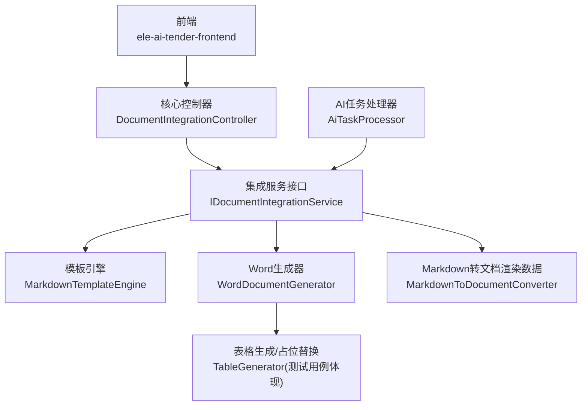
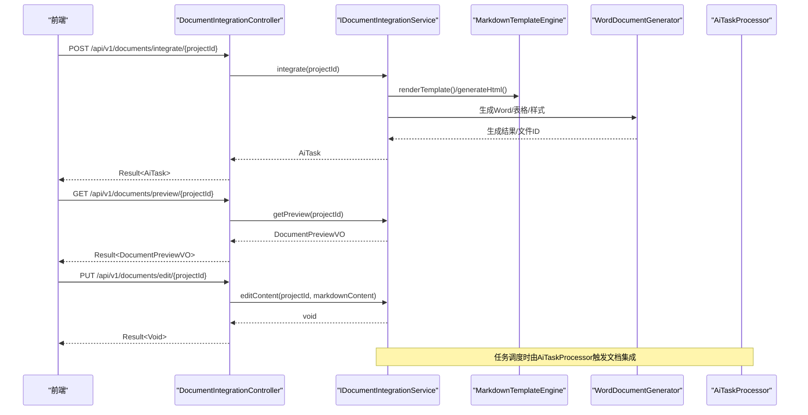
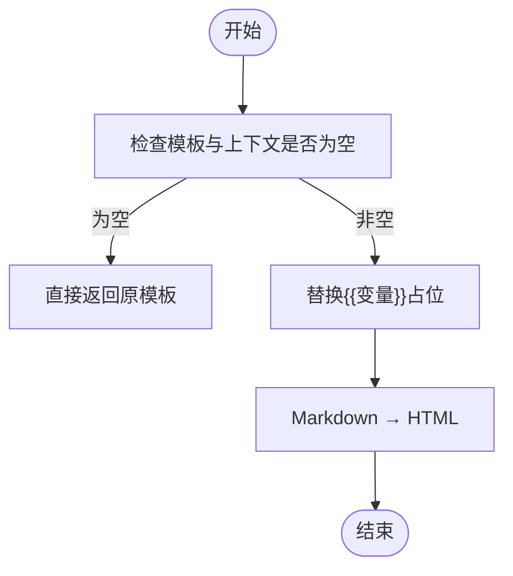
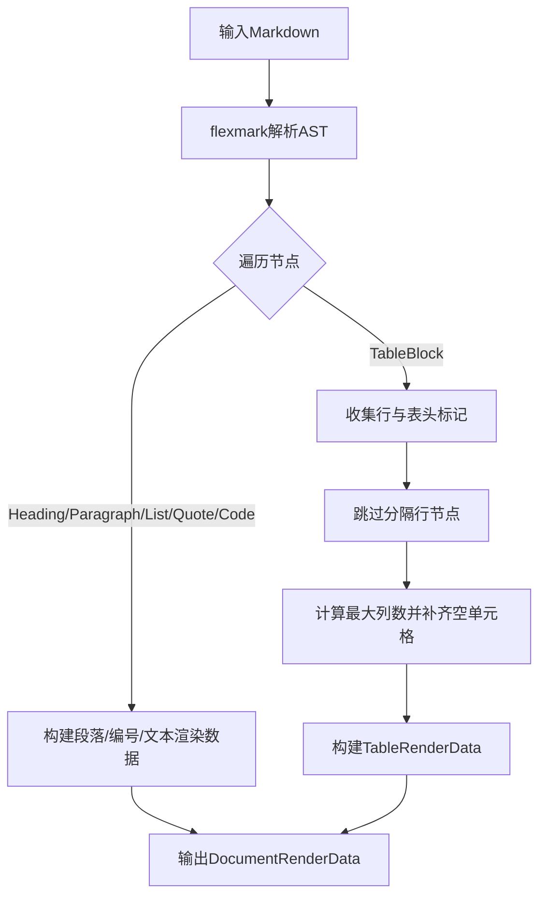
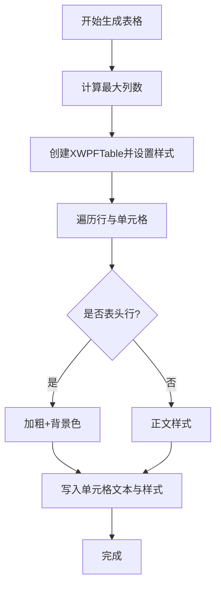
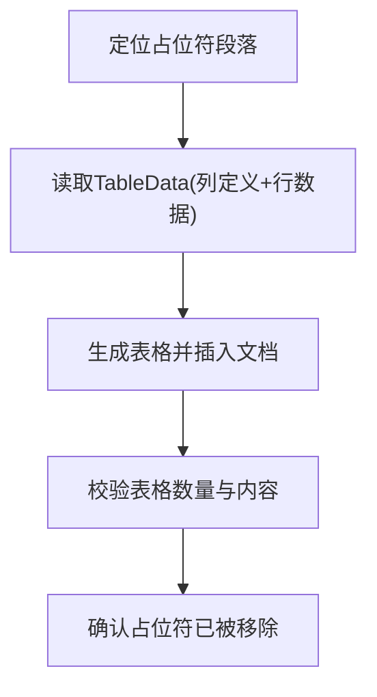
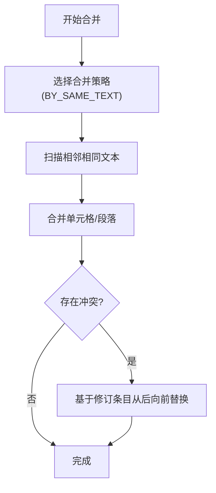
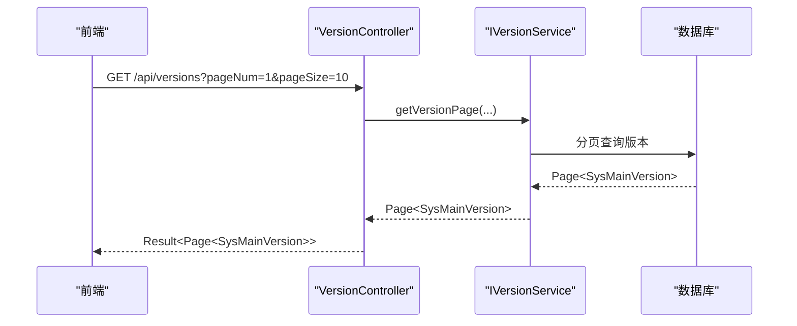
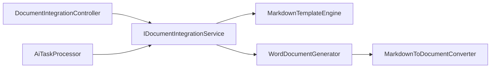

# 文档集成API

<cite>
**本文引用的文件**
- [DocumentIntegrationController.java](file://ele-ai-tender-system/ele-ai-tender-core/src/main/java/com/jy/eleaitender/core/controller/DocumentIntegrationController.java)
- [IDocumentIntegrationService.java](file://ele-ai-tender-system/ele-ai-tender-core/src/main/java/com/jy/eleaitender/core/service/IDocumentIntegrationService.java)
- [DocumentPreviewVO.java](file://ele-ai-tender-system/ele-ai-tender-core/src/main/java/com/jy/eleaitender/core/dto/response/DocumentPreviewVO.java)
- [document.ts（前端类型）](file://ele-ai-tender-frontend/src/types/document.ts)
- [document.ts（前端API）](file://ele-ai-tender-frontend/src/api/document.ts)
- [MarkdownTemplateEngine.java](file://ele-ai-tender-system/ele-ai-tender-core/src/main/java/com/jy/eleaitender/core/engine/MarkdownTemplateEngine.java)
- [MarkdownToDocumentConverter.java](file://ele-ai-tender-system/ele-ai-tender-file/src/main/java/com/jy/eleaitender/file/engine/MarkdownToDocumentConverter.java)
- [WordDocumentGenerator.java](file://ele-ai-tender-system/ele-ai-tender-core/src/main/java/com/jy/eleaitender/core/engine/WordDocumentGenerator.java)
- [TableGeneratorTest.java](file://ele-ai-tender-system/ele-ai-tender-file/src/test/java/com/jy/eleaitender/file/engine/TableGeneratorTest.java)
- [MergeStrategy.java](file://ele-ai-tender-system/ele-ai-tender-common/src/main/java/com/jy/eleaitender/common/dto/MergeStrategy.java)
- [AiTaskProcessor.java](file://ele-ai-tender-system/ele-ai-tender-ai/src/main/java/com/jy/eleaitender/ai/processor/AiTaskProcessor.java)
- [VersionController.java](file://ele-ai-tender-system/ele-ai-tender-support/src/main/java/com/jy/eleaitender/support/controller/VersionController.java)
- [IVersionService.java](file://ele-ai-tender-system/ele-ai-tender-support/src/main/java/com/jy/eleaitender/support/service/IVersionService.java)
</cite>

## 目录
1. [简介](#简介)
2. [项目结构](#项目结构)
3. [核心组件](#核心组件)
4. [架构总览](#架构总览)
5. [详细组件分析](#详细组件分析)
6. [依赖关系分析](#依赖关系分析)
7. [性能与扩展性](#性能与扩展性)
8. [故障排查指南](#故障排查指南)
9. [结论](#结论)
10. [附录：接口规范](#附录接口规范)

## 简介
本文件为“文档集成模块”的API接口文档，覆盖以下能力：
- 文档预览、版本对比、内容合并、模板应用等文档处理功能
- 多格式文档（Word、Markdown、PDF）转换与预览接口
- 文档版本差异分析、智能合并策略、冲突解决机制的实现细节
- 文档结构解析、表格生成、样式保持等高级文档处理能力
- 错误处理、性能优化与大文件处理的实践建议

说明：
- 当前仓库已实现“文档集成”相关的前后端接口与核心引擎；部分能力（如PDF导出、版本差异对比）以现有接口为基础进行扩展设计。
- 所有接口定义均以实际源码为准，未实现的扩展点将以“扩展设计”形式给出，便于后续落地。

## 项目结构
围绕文档集成的关键代码分布在如下模块：
- 核心服务层：提供文档集成、预览、编辑等接口与服务
- 模板与渲染：Markdown模板引擎、Markdown到文档渲染数据转换器、Word文档生成器
- 文件与表格：表格占位符替换、表格生成与样式控制
- 任务编排：AI任务处理器中触发文档集成流程
- 前端对接：TypeScript类型与API封装



图示来源
- [DocumentIntegrationController.java:1-50](file://ele-ai-tender-system/ele-ai-tender-core/src/main/java/com/jy/eleaitender/core/controller/DocumentIntegrationController.java#L1-L50)
- [IDocumentIntegrationService.java:1-25](file://ele-ai-tender-system/ele-ai-tender-core/src/main/java/com/jy/eleaitender/core/service/IDocumentIntegrationService.java#L1-L25)
- [MarkdownTemplateEngine.java:44-81](file://ele-ai-tender-system/ele-ai-tender-core/src/main/java/com/jy/eleaitender/core/engine/MarkdownTemplateEngine.java#L44-L81)
- [MarkdownToDocumentConverter.java:1-76](file://ele-ai-tender-system/ele-ai-tender-file/src/main/java/com/jy/eleaitender/file/engine/MarkdownToDocumentConverter.java#L1-L76)
- [WordDocumentGenerator.java:181-219](file://ele-ai-tender-system/ele-ai-tender-core/src/main/java/com/jy/eleaitender/core/engine/WordDocumentGenerator.java#L181-L219)
- [TableGeneratorTest.java:1-47](file://ele-ai-tender-system/ele-ai-tender-file/src/test/java/com/jy/eleaitender/file/engine/TableGeneratorTest.java#L1-L47)
- [AiTaskProcessor.java:181-195](file://ele-ai-tender-system/ele-ai-tender-ai/src/main/java/com/jy/eleaitender/ai/processor/AiTaskProcessor.java#L181-L195)

章节来源
- [DocumentIntegrationController.java:1-50](file://ele-ai-tender-system/ele-ai-tender-core/src/main/java/com/jy/eleaitender/core/controller/DocumentIntegrationController.java#L1-L50)
- [IDocumentIntegrationService.java:1-25](file://ele-ai-tender-system/ele-ai-tender-core/src/main/java/com/jy/eleaitender/core/service/IDocumentIntegrationService.java#L1-L25)
- [MarkdownTemplateEngine.java:44-81](file://ele-ai-tender-system/ele-ai-tender-core/src/main/java/com/jy/eleaitender/core/engine/MarkdownTemplateEngine.java#L44-L81)
- [MarkdownToDocumentConverter.java:1-76](file://ele-ai-tender-system/ele-ai-tender-file/src/main/java/com/jy/eleaitender/file/engine/MarkdownToDocumentConverter.java#L1-L76)
- [WordDocumentGenerator.java:181-219](file://ele-ai-tender-system/ele-ai-tender-core/src/main/java/com/jy/eleaitender/core/engine/WordDocumentGenerator.java#L181-L219)
- [TableGeneratorTest.java:1-47](file://ele-ai-tender-system/ele-ai-tender-file/src/test/java/com/jy/eleaitender/file/engine/TableGeneratorTest.java#L1-L47)
- [AiTaskProcessor.java:181-195](file://ele-ai-tender-system/ele-ai-tender-ai/src/main/java/com/jy/eleaitender/ai/processor/AiTaskProcessor.java#L181-L195)

## 核心组件
- 文档集成控制器：暴露文档集成、预览、编辑三个HTTP端点
- 文档集成服务接口：定义集成、预览、编辑方法契约
- 文档预览响应对象：包含HTML预览、原始Markdown、是否已集成、生成的Word文件ID等字段
- 模板引擎：支持{{变量}}占位替换与Markdown→HTML生成
- Markdown转文档渲染数据：将Markdown AST转换为poi-tl渲染数据结构，支持标题、段落、列表、引用、代码块、表格等
- Word文档生成器：从HTML或渲染数据生成Word，含表格样式与表头背景色设置
- 表格生成与占位替换：通过占位符在Word中插入表格，支持列对齐与样式保持
- AI任务处理器：在任务调度中触发文档集成流程

章节来源
- [DocumentIntegrationController.java:1-50](file://ele-ai-tender-system/ele-ai-tender-core/src/main/java/com/jy/eleaitender/core/controller/DocumentIntegrationController.java#L1-L50)
- [IDocumentIntegrationService.java:1-25](file://ele-ai-tender-system/ele-ai-tender-core/src/main/java/com/jy/eleaitender/core/service/IDocumentIntegrationService.java#L1-L25)
- [DocumentPreviewVO.java:1-30](file://ele-ai-tender-system/ele-ai-tender-core/src/main/java/com/jy/eleaitender/core/dto/response/DocumentPreviewVO.java#L1-L30)
- [MarkdownTemplateEngine.java:44-81](file://ele-ai-tender-system/ele-ai-tender-core/src/main/java/com/jy/eleaitender/core/engine/MarkdownTemplateEngine.java#L44-L81)
- [MarkdownToDocumentConverter.java:1-76](file://ele-ai-tender-system/ele-ai-tender-file/src/main/java/com/jy/eleaitender/file/engine/MarkdownToDocumentConverter.java#L1-L76)
- [WordDocumentGenerator.java:181-219](file://ele-ai-tender-system/ele-ai-tender-core/src/main/java/com/jy/eleaitender/core/engine/WordDocumentGenerator.java#L181-L219)
- [TableGeneratorTest.java:1-47](file://ele-ai-tender-system/ele-ai-tender-file/src/test/java/com/jy/eleaitender/file/engine/TableGeneratorTest.java#L1-L47)
- [AiTaskProcessor.java:181-195](file://ele-ai-tender-system/ele-ai-tender-ai/src/main/java/com/jy/eleaitender/ai/processor/AiTaskProcessor.java#L181-L195)

## 架构总览
文档集成端到端调用链：
- 前端调用集成/预览/编辑接口
- 控制器转发至服务层
- 服务层使用模板引擎渲染Markdown，必要时转换为HTML或渲染数据
- 生成Word文档并返回预览信息（含文件ID）
- AI任务处理器在异步任务中触发文档集成



图示来源
- [DocumentIntegrationController.java:26-48](file://ele-ai-tender-system/ele-ai-tender-core/src/main/java/com/jy/eleaitender/core/controller/DocumentIntegrationController.java#L26-L48)
- [IDocumentIntegrationService.java:11-24](file://ele-ai-tender-system/ele-ai-tender-core/src/main/java/com/jy/eleaitender/core/service/IDocumentIntegrationService.java#L11-L24)
- [MarkdownTemplateEngine.java:44-81](file://ele-ai-tender-system/ele-ai-tender-core/src/main/java/com/jy/eleaitender/core/engine/MarkdownTemplateEngine.java#L44-L81)
- [WordDocumentGenerator.java:181-219](file://ele-ai-tender-system/ele-ai-tender-core/src/main/java/com/jy/eleaitender/core/engine/WordDocumentGenerator.java#L181-L219)
- [AiTaskProcessor.java:181-195](file://ele-ai-tender-system/ele-ai-tender-ai/src/main/java/com/jy/eleaitender/ai/processor/AiTaskProcessor.java#L181-L195)

## 详细组件分析

### 文档集成控制器与接口
- 路由前缀：/api/v1/documents
- 认证要求：RequireLogin
- 主要端点：
  - POST /integrate/{projectId}：执行文档集成，返回AI任务
  - GET /preview/{projectId}：获取集成预览（HTML/Markdown/是否已集成/文件ID）
  - PUT /edit/{projectId}：编辑集成后的文档内容（传入markdownContent）

```mermaid
classDiagram
class DocumentIntegrationController {
+POST "/integrate/{projectId}" : Result~AiTask~
+GET "/preview/{projectId}" : Result~DocumentPreviewVO~
+PUT "/edit/{projectId}" : Result~Void~
}
class IDocumentIntegrationService {
+integrate(projectId) AiTask
+getPreview(projectId) DocumentPreviewVO
+editContent(projectId, markdownContent) void
}
class DocumentPreviewVO {
+Long projectId
+String projectName
+String htmlContent
+String markdownContent
+Boolean integrated
+Long generatedFileId
}
DocumentIntegrationController --> IDocumentIntegrationService : "调用"
IDocumentIntegrationService --> DocumentPreviewVO : "返回"
```

图示来源
- [DocumentIntegrationController.java:18-49](file://ele-ai-tender-system/ele-ai-tender-core/src/main/java/com/jy/eleaitender/core/controller/DocumentIntegrationController.java#L18-L49)
- [IDocumentIntegrationService.java:9-25](file://ele-ai-tender-system/ele-ai-tender-core/src/main/java/com/jy/eleaitender/core/service/IDocumentIntegrationService.java#L9-L25)
- [DocumentPreviewVO.java:11-30](file://ele-ai-tender-system/ele-ai-tender-core/src/main/java/com/jy/eleaitender/core/dto/response/DocumentPreviewVO.java#L11-L30)

章节来源
- [DocumentIntegrationController.java:18-49](file://ele-ai-tender-system/ele-ai-tender-core/src/main/java/com/jy/eleaitender/core/controller/DocumentIntegrationController.java#L18-L49)
- [IDocumentIntegrationService.java:9-25](file://ele-ai-tender-system/ele-ai-tender-core/src/main/java/com/jy/eleaitender/core/service/IDocumentIntegrationService.java#L9-L25)
- [DocumentPreviewVO.java:11-30](file://ele-ai-tender-system/ele-ai-tender-core/src/main/java/com/jy/eleaitender/core/dto/response/DocumentPreviewVO.java#L11-L30)

### 模板应用与Markdown渲染
- 模板引擎支持{{key}}占位替换，随后将Markdown转为HTML
- 该能力用于快速预览与中间态生成



图示来源
- [MarkdownTemplateEngine.java:44-81](file://ele-ai-tender-system/ele-ai-tender-core/src/main/java/com/jy/eleaitender/core/engine/MarkdownTemplateEngine.java#L44-L81)

章节来源
- [MarkdownTemplateEngine.java:44-81](file://ele-ai-tender-system/ele-ai-tender-core/src/main/java/com/jy/eleaitender/core/engine/MarkdownTemplateEngine.java#L44-L81)

### Markdown转文档渲染数据（表格与样式）
- 使用flexmark解析Markdown AST，启用Tables扩展
- 将标题、段落、列表、引用、代码块、表格映射为poi-tl渲染数据
- 表格处理要点：
  - 跳过分隔行节点，避免被当作数据行
  - 表头加粗，单元格保留行内格式
  - 按最大列数补齐空单元格，防止渲染异常



图示来源
- [MarkdownToDocumentConverter.java:1-76](file://ele-ai-tender-system/ele-ai-tender-file/src/main/java/com/jy/eleaitender/file/engine/MarkdownToDocumentConverter.java#L1-L76)
- [MarkdownToDocumentConverter.java:392-411](file://ele-ai-tender-system/ele-ai-tender-file/src/main/java/com/jy/eleaitender/file/engine/MarkdownToDocumentConverter.java#L392-L411)

章节来源
- [MarkdownToDocumentConverter.java:1-76](file://ele-ai-tender-system/ele-ai-tender-file/src/main/java/com/jy/eleaitender/file/engine/MarkdownToDocumentConverter.java#L1-L76)
- [MarkdownToDocumentConverter.java:392-411](file://ele-ai-tender-system/ele-ai-tender-file/src/main/java/com/jy/eleaitender/file/engine/MarkdownToDocumentConverter.java#L392-L411)

### Word文档生成与表格样式
- 基于HTML或渲染数据创建表格
- 设置表格宽度、样式ID、表头加粗与背景色
- 单元格字体、字号、段间距统一配置



图示来源
- [WordDocumentGenerator.java:181-219](file://ele-ai-tender-system/ele-ai-tender-core/src/main/java/com/jy/eleaitender/core/engine/WordDocumentGenerator.java#L181-L219)

章节来源
- [WordDocumentGenerator.java:181-219](file://ele-ai-tender-system/ele-ai-tender-core/src/main/java/com/jy/eleaitender/core/engine/WordDocumentGenerator.java#L181-L219)

### 表格占位符替换与验证
- 通过占位符在Word中插入表格数据
- 测试覆盖了带前导空格的占位符替换场景，确保占位符被正确替换且无残留



图示来源
- [TableGeneratorTest.java:21-46](file://ele-ai-tender-system/ele-ai-tender-file/src/test/java/com/jy/eleaitender/file/engine/TableGeneratorTest.java#L21-L46)

章节来源
- [TableGeneratorTest.java:1-47](file://ele-ai-tender-system/ele-ai-tender-file/src/test/java/com/jy/eleaitender/file/engine/TableGeneratorTest.java#L1-L47)

### 智能合并策略与冲突解决
- 合并策略枚举：当前提供“相邻相同文本合并”策略
- 冲突解决机制：可结合修订条目（位置、原文、修订文）从后向前替换，避免索引偏移导致的错误



图示来源
- [MergeStrategy.java:6-10](file://ele-ai-tender-system/ele-ai-tender-common/src/main/java/com/jy/eleaitender/common/dto/MergeStrategy.java#L6-L10)
- [RequirementGenerator.java:752-764](file://ele-ai-tender-system/ele-ai-tender-ai/src/main/java/com/jy/eleaitender/ai/processor/generator/RequirementGenerator.java#L752-L764)

章节来源
- [MergeStrategy.java:6-10](file://ele-ai-tender-system/ele-ai-tender-common/src/main/java/com/jy/eleaitender/common/dto/MergeStrategy.java#L6-L10)
- [RequirementGenerator.java:752-764](file://ele-ai-tender-system/ele-ai-tender-ai/src/main/java/com/jy/eleaitender/ai/processor/generator/RequirementGenerator.java#L752-L764)

### 版本管理与对比（扩展设计）
- 系统已提供版本管理接口（主版本与插件），可用于承载文档版本元数据与发布状态
- 文档版本差异分析可在现有版本体系上扩展：
  - 新增“文档版本”实体与差异记录表
  - 提供差异查询接口，返回结构化变更（增删改位置、内容片段）
  - 前端展示差异高亮与一键合并



图示来源
- [VersionController.java:29-39](file://ele-ai-tender-system/ele-ai-tender-support/src/main/java/com/jy/eleaitender/support/controller/VersionController.java#L29-L39)
- [IVersionService.java:15-16](file://ele-ai-tender-system/ele-ai-tender-support/src/main/java/com/jy/eleaitender/support/service/IVersionService.java#L15-L16)

章节来源
- [VersionController.java:29-39](file://ele-ai-tender-system/ele-ai-tender-support/src/main/java/com/jy/eleaitender/support/controller/VersionController.java#L29-L39)
- [IVersionService.java:15-16](file://ele-ai-tender-system/ele-ai-tender-support/src/main/java/com/jy/eleaitender/support/service/IVersionService.java#L15-L16)

### 前端对接与类型定义
- 前端API封装了集成、预览、编辑三个接口，路径与后端一致
- 类型定义包含预览响应结构，便于TS类型安全

章节来源
- [document.ts（前端API）:5-20](file://ele-ai-tender-frontend/src/api/document.ts#L5-L20)
- [document.ts（前端类型）:1-9](file://ele-ai-tender-frontend/src/types/document.ts#L1-L9)

## 依赖关系分析
- 控制器依赖服务接口，服务接口依赖模板引擎与文档生成器
- Markdown转换与Word生成共同支撑预览与下载能力
- AI任务处理器在任务流中触发文档集成



图示来源
- [DocumentIntegrationController.java:18-49](file://ele-ai-tender-system/ele-ai-tender-core/src/main/java/com/jy/eleaitender/core/controller/DocumentIntegrationController.java#L18-L49)
- [IDocumentIntegrationService.java:9-25](file://ele-ai-tender-system/ele-ai-tender-core/src/main/java/com/jy/eleaitender/core/service/IDocumentIntegrationService.java#L9-L25)
- [MarkdownTemplateEngine.java:44-81](file://ele-ai-tender-system/ele-ai-tender-core/src/main/java/com/jy/eleaitender/core/engine/MarkdownTemplateEngine.java#L44-L81)
- [MarkdownToDocumentConverter.java:1-76](file://ele-ai-tender-system/ele-ai-tender-file/src/main/java/com/jy/eleaitender/file/engine/MarkdownToDocumentConverter.java#L1-L76)
- [WordDocumentGenerator.java:181-219](file://ele-ai-tender-system/ele-ai-tender-core/src/main/java/com/jy/eleaitender/core/engine/WordDocumentGenerator.java#L181-L219)
- [AiTaskProcessor.java:181-195](file://ele-ai-tender-system/ele-ai-tender-ai/src/main/java/com/jy/eleaitender/ai/processor/AiTaskProcessor.java#L181-L195)

## 性能与扩展性
- 大文档处理
  - 分块渲染：对超长Markdown采用分段解析与增量渲染，降低单次内存峰值
  - 流式输出：预览阶段优先返回轻量HTML，Word生成走后台任务
- 并发与队列
  - 借助AI任务处理器进行异步编排，避免阻塞请求线程
- 缓存策略
  - 对模板渲染结果与常用表格数据进行短期缓存，减少重复计算
- 资源限制
  - 对超大表格进行分页或虚拟渲染，避免一次性构建过多DOM/POI对象
- 可扩展点
  - 新增更多合并策略（如按锚点/语义块合并）
  - 引入差异算法（如基于AST的差异对比）提升对比精度

[本节为通用指导，不直接分析具体文件]

## 故障排查指南
- 常见问题
  - 预览内容为空：检查模板是否为空、上下文参数是否齐全
  - 表格错位或渲染失败：确认每行列数一致，避免缺失单元格导致异常
  - 占位符未替换：检查占位符前后空格与命名一致性
- 日志与断点
  - 在模板渲染与表格生成处增加日志，定位异常节点
  - 针对修订替换逻辑，打印有效修订条目数量与跳过原因
- 回归测试
  - 利用现有测试用例验证表格占位符替换与Markdown转换行为

章节来源
- [MarkdownTemplateEngine.java:44-81](file://ele-ai-tender-system/ele-ai-tender-core/src/main/java/com/jy/eleaitender/core/engine/MarkdownTemplateEngine.java#L44-L81)
- [MarkdownToDocumentConverter.java:392-411](file://ele-ai-tender-system/ele-ai-tender-file/src/main/java/com/jy/eleaitender/file/engine/MarkdownToDocumentConverter.java#L392-L411)
- [TableGeneratorTest.java:21-46](file://ele-ai-tender-system/ele-ai-tender-file/src/test/java/com/jy/eleaitender/file/engine/TableGeneratorTest.java#L21-L46)
- [RequirementGenerator.java:752-764](file://ele-ai-tender-system/ele-ai-tender-ai/src/main/java/com/jy/eleaitender/ai/processor/generator/RequirementGenerator.java#L752-L764)

## 结论
文档集成模块提供了从模板应用到多格式渲染的核心能力，并通过控制器与服务接口对外暴露标准API。当前已具备：
- 文档集成、预览、编辑接口
- Markdown模板渲染与HTML预览
- Markdown到Word的表格与样式生成
- 基于修订条目的内容替换与合并策略基础

后续可在版本差异对比、PDF导出、更丰富的合并策略等方面继续扩展，以满足复杂业务场景。

[本节为总结性内容，不直接分析具体文件]

## 附录：接口规范

### 文档集成接口
- 执行文档集成
  - 方法：POST
  - 路径：/api/v1/documents/integrate/{projectId}
  - 认证：需要登录
  - 请求体：无
  - 响应：Result<AiTask>
- 获取集成预览
  - 方法：GET
  - 路径：/api/v1/documents/preview/{projectId}
  - 认证：需要登录
  - 请求体：无
  - 响应：Result<DocumentPreviewVO>
- 编辑集成后的文档内容
  - 方法：PUT
  - 路径：/api/v1/documents/edit/{projectId}
  - 认证：需要登录
  - 请求体：{ "markdownContent": "字符串" }
  - 响应：Result<Void>

章节来源
- [DocumentIntegrationController.java:26-48](file://ele-ai-tender-system/ele-ai-tender-core/src/main/java/com/jy/eleaitender/core/controller/DocumentIntegrationController.java#L26-L48)
- [IDocumentIntegrationService.java:11-24](file://ele-ai-tender-system/ele-ai-tender-core/src/main/java/com/jy/eleaitender/core/service/IDocumentIntegrationService.java#L11-L24)
- [DocumentPreviewVO.java:11-30](file://ele-ai-tender-system/ele-ai-tender-core/src/main/java/com/jy/eleaitender/core/dto/response/DocumentPreviewVO.java#L11-L30)

### 预览数据结构
- DocumentPreviewVO字段
  - projectId：项目ID
  - projectName：项目名称
  - htmlContent：HTML预览内容
  - markdownContent：Markdown原始内容
  - integrated：是否已集成
  - generatedFileId：生成的Word文件ID（关联file_info）

章节来源
- [DocumentPreviewVO.java:11-30](file://ele-ai-tender-system/ele-ai-tender-core/src/main/java/com/jy/eleaitender/core/dto/response/DocumentPreviewVO.java#L11-L30)

### 前端API封装
- documentApi.integrate(projectId)
- documentApi.getPreview(projectId)
- documentApi.editContent(projectId, markdownContent)

章节来源
- [document.ts（前端API）:5-20](file://ele-ai-tender-frontend/src/api/document.ts#L5-L20)
- [document.ts（前端类型）:1-9](file://ele-ai-tender-frontend/src/types/document.ts#L1-L9)