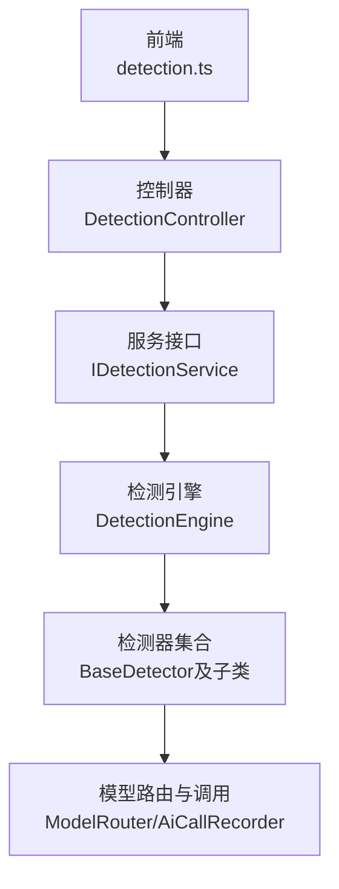
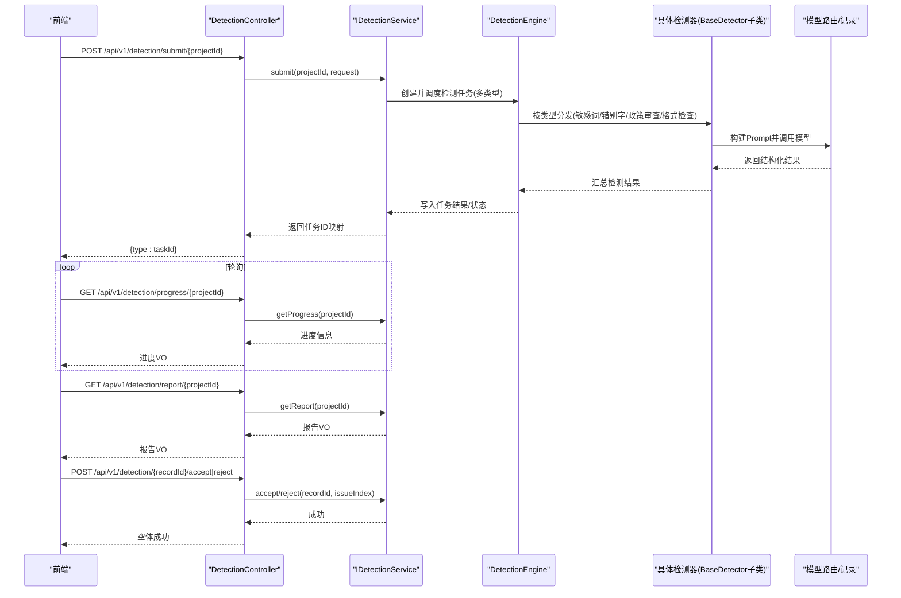
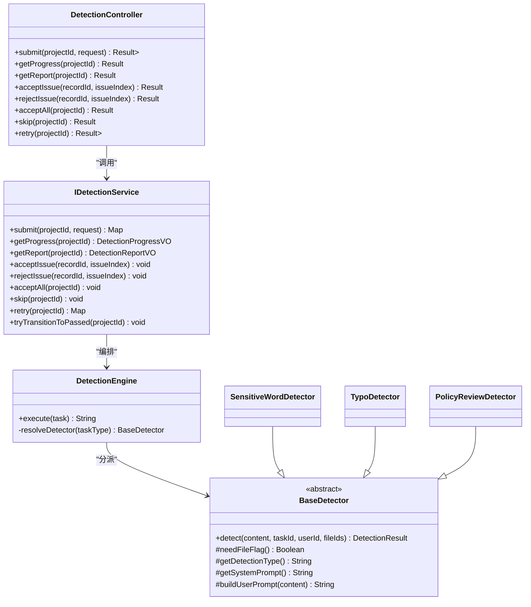

# 智能检测API

<cite>
**本文引用的文件**
- [DetectionController.java](file://ele-ai-tender-system/ele-ai-tender-core/src/main/java/com/jy/eleaitender/core/controller/DetectionController.java)
- [IDetectionService.java](file://ele-ai-tender-system/ele-ai-tender-core/src/main/java/com/jy/eleaitender/core/service/IDetectionService.java)
- [detection.ts](file://ele-ai-tender-frontend/src/api/detection.ts)
- [DetectionEngine.java](file://ele-ai-tender-system/ele-ai-tender-ai/src/main/java/com/jy/eleaitender/ai/processor/checker/DetectionEngine.java)
- [BaseDetector.java](file://ele-ai-tender-system/ele-ai-tender-ai/src/main/java/com/jy/eleaitender/ai/processor/checker/BaseDetector.java)
- [SensitiveWordDetector.java](file://ele-ai-tender-system/ele-ai-tender-ai/src/main/java/com/jy/eleaitender/ai/processor/checker/SensitiveWordDetector.java)
- [TypoDetector.java](file://ele-ai-tender-system/ele-ai-tender-ai/src/main/java/com/jy/eleaitender/ai/processor/checker/TypoDetector.java)
- [PolicyReviewDetector.java](file://ele-ai-tender-system/ele-ai-tender-ai/src/main/java/com/jy/eleaitender/ai/processor/checker/PolicyReviewDetector.java)
- [DetectionIssueVO.java](file://ele-ai-tender-system/ele-ai-tender-ai/src/main/java/com/jy/eleaitender/ai/dto/response/DetectionIssueVO.java)
- [DetectionParams.java](file://ele-ai-tender-system/ele-ai-tender-common/src/main/java/com/jy/eleaitender/common/dto/ai/DetectionParams.java)
</cite>

## 目录
1. [简介](#简介)
2. [项目结构](#项目结构)
3. [核心组件](#核心组件)
4. [架构总览](#架构总览)
5. [详细接口说明](#详细接口说明)
6. [依赖分析](#依赖分析)
7. [性能与并发](#性能与并发)
8. [故障排查指南](#故障排查指南)
9. [结论](#结论)
10. [附录](#附录)

## 简介
本文件为“智能检测模块”的API接口文档，覆盖文档合规性检测、相似度分析、风险评估等AI检测能力的对外接口规范。重点说明：
- 检测任务提交、进度查询、结果获取的异步处理流程
- 多种检测类型的配置参数（格式检查、敏感词检测、政策审查、错别字检测等）
- 检测报告的结构定义、问题分类、严重程度标识等响应数据格式
- 检测规则的自定义配置方式与批量检测任务的实现建议

## 项目结构
智能检测能力由前后端协同完成：
- 前端通过 detection.ts 调用后端 /core-api/v1/detection/* 系列接口
- 后端 DetectionController 暴露REST API，委托 IDetectionService 编排检测流程
- AI侧 DetectionEngine 根据任务类型分发到具体检测器（敏感词、错别字、政策审查、格式检查），并统一封装检测结果

图示来源
- [DetectionController.java:1-89](file://ele-ai-tender-system/ele-ai-tender-core/src/main/java/com/jy/eleaitender/core/controller/DetectionController.java#L1-L89)
- [IDetectionService.java:1-58](file://ele-ai-tender-system/ele-ai-tender-core/src/main/java/com/jy/eleaitender/core/service/IDetectionService.java#L1-L58)
- [DetectionEngine.java:76-107](file://ele-ai-tender-system/ele-ai-tender-ai/src/main/java/com/jy/eleaitender/ai/processor/checker/DetectionEngine.java#L76-L107)
- [BaseDetector.java:41-78](file://ele-ai-tender-system/ele-ai-tender-ai/src/main/java/com/jy/eleaitender/ai/processor/checker/BaseDetector.java#L41-L78)
- [detection.ts:1-44](file://ele-ai-tender-frontend/src/api/detection.ts#L1-L44)

章节来源
- [DetectionController.java:1-89](file://ele-ai-tender-system/ele-ai-tender-core/src/main/java/com/jy/eleaitender/core/controller/DetectionController.java#L1-L89)
- [IDetectionService.java:1-58](file://ele-ai-tender-system/ele-ai-tender-core/src/main/java/com/jy/eleaitender/core/service/IDetectionService.java#L1-L58)
- [DetectionEngine.java:76-107](file://ele-ai-tender-system/ele-ai-tender-ai/src/main/java/com/jy/eleaitender/ai/processor/checker/DetectionEngine.java#L76-L107)
- [BaseDetector.java:41-78](file://ele-ai-tender-system/ele-ai-tender-ai/src/main/java/com/jy/eleaitender/ai/processor/checker/BaseDetector.java#L41-L78)
- [detection.ts:1-44](file://ele-ai-tender-frontend/src/api/detection.ts#L1-L44)

## 核心组件
- 控制器层：提供统一的REST入口，负责鉴权、参数校验与结果包装
- 服务层：编排检测生命周期（创建任务、调度执行、状态推进、报告聚合）
- AI引擎：按任务类型选择检测器，组装提示词，调用大模型，解析结构化结果
- 检测器族：基于抽象基类扩展不同检测规则（敏感词、错别字、政策审查、格式检查）
- 前端API：封装HTTP请求，提供提交、进度、报告、接受/拒绝建议、重试等能力

章节来源
- [DetectionController.java:1-89](file://ele-ai-tender-system/ele-ai-tender-core/src/main/java/com/jy/eleaitender/core/controller/DetectionController.java#L1-L89)
- [IDetectionService.java:1-58](file://ele-ai-tender-system/ele-ai-tender-core/src/main/java/com/jy/eleaitender/core/service/IDetectionService.java#L1-L58)
- [DetectionEngine.java:76-107](file://ele-ai-tender-system/ele-ai-tender-ai/src/main/java/com/jy/eleaitender/ai/processor/checker/DetectionEngine.java#L76-L107)
- [BaseDetector.java:41-78](file://ele-ai-tender-system/ele-ai-tender-ai/src/main/java/com/jy/eleaitender/ai/processor/checker/BaseDetector.java#L41-L78)
- [detection.ts:1-44](file://ele-ai-tender-frontend/src/api/detection.ts#L1-L44)

## 架构总览
下图展示一次完整检测的生命周期：从提交到进度轮询，再到报告拉取与建议处理。

图示来源
- [DetectionController.java:27-89](file://ele-ai-tender-system/ele-ai-tender-core/src/main/java/com/jy/eleaitender/core/controller/DetectionController.java#L27-L89)
- [IDetectionService.java:14-58](file://ele-ai-tender-system/ele-ai-tender-core/src/main/java/com/jy/eleaitender/core/service/IDetectionService.java#L14-L58)
- [DetectionEngine.java:76-107](file://ele-ai-tender-system/ele-ai-tender-ai/src/main/java/com/jy/eleaitender/ai/processor/checker/DetectionEngine.java#L76-L107)
- [BaseDetector.java:47-66](file://ele-ai-tender-system/ele-ai-tender-ai/src/main/java/com/jy/eleaitender/ai/processor/checker/BaseDetector.java#L47-L66)

## 详细接口说明

### 通用约定
- 基础路径：/api/v1/detection
- 鉴权：所有接口需登录（RequireLogin）
- 统一响应：Result<T> 包裹业务数据
- 认证头：遵循系统统一鉴权机制（如JWT）

章节来源
- [DetectionController.java:1-26](file://ele-ai-tender-system/ele-ai-tender-core/src/main/java/com/jy/eleaitender/core/controller/DetectionController.java#L1-L26)

### 提交最终文档检测
- 方法：POST
- 路径：/api/v1/detection/submit/{projectId}
- 路径参数：
  - projectId: 项目ID（Long）
- 请求体（可选）：DetectionSubmitRequest
  - 字段参考：DetectionParams
    - contentFileId: 内容文件ID（与content二选一）
    - content: 待检测文本（与contentFileId二选一）
- 成功响应：Result<Map<String, Long>>
  - key: 检测类型标识（如敏感词、错别字、政策审查、格式检查）
  - value: 对应AI任务ID
- 失败响应：Result.error（含错误码与消息）

章节来源
- [DetectionController.java:27-33](file://ele-ai-tender-system/ele-ai-tender-core/src/main/java/com/jy/eleaitender/core/controller/DetectionController.java#L27-L33)
- [IDetectionService.java:14-17](file://ele-ai-tender-system/ele-ai-tender-core/src/main/java/com/jy/eleaitender/core/service/IDetectionService.java#L14-L17)
- [DetectionParams.java:1-16](file://ele-ai-tender-system/ele-ai-tender-common/src/main/java/com/jy/eleaitender/common/dto/ai/DetectionParams.java#L1-L16)

### 获取检测进度
- 方法：GET
- 路径：/api/v1/detection/progress/{projectId}
- 路径参数：projectId
- 成功响应：Result<DetectionProgressVO>
  - 包含各检测类型任务的状态、进度百分比、错误信息等
- 失败响应：Result.error

章节来源
- [DetectionController.java:35-40](file://ele-ai-tender-system/ele-ai-tender-core/src/main/java/com/jy/eleaitender/core/controller/DetectionController.java#L35-L40)
- [IDetectionService.java:19-22](file://ele-ai-tender-system/ele-ai-tender-core/src/main/java/com/jy/eleaitender/core/service/IDetectionService.java#L19-L22)

### 获取检测报告
- 方法：GET
- 路径：/api/v1/detection/report/{projectId}
- 路径参数：projectId
- 成功响应：Result<DetectionReportVO>
  - 包含问题列表、评分、建议统计、引用依据等
- 失败响应：Result.error

章节来源
- [DetectionController.java:42-47](file://ele-ai-tender-system/ele-ai-tender-core/src/main/java/com/jy/eleaitender/core/controller/DetectionController.java#L42-L47)
- [IDetectionService.java:24-27](file://ele-ai-tender-system/ele-ai-tender-core/src/main/java/com/jy/eleaitender/core/service/IDetectionService.java#L24-L27)

### 接受/拒绝检测建议
- 方法：POST
- 路径：/api/v1/detection/{recordId}/accept | /api/v1/detection/{recordId}/reject
- 路径参数：recordId（检测记录ID）
- 查询参数：issueIndex（问题项索引）
- 成功响应：Result<Void>
- 失败响应：Result.error

章节来源
- [DetectionController.java:49-65](file://ele-ai-tender-system/ele-ai-tender-core/src/main/java/com/jy/eleaitender/core/controller/DetectionController.java#L49-L65)
- [IDetectionService.java:29-37](file://ele-ai-tender-system/ele-ai-tender-core/src/main/java/com/jy/eleaitender/core/service/IDetectionService.java#L29-L37)

### 一键接受所有建议
- 方法：POST
- 路径：/api/v1/detection/accept-all/{projectId}
- 路径参数：projectId
- 成功响应：Result<Void>
- 失败响应：Result.error

章节来源
- [DetectionController.java:67-73](file://ele-ai-tender-system/ele-ai-tender-core/src/main/java/com/jy/eleaitender/core/controller/DetectionController.java#L67-L73)
- [IDetectionService.java:39-42](file://ele-ai-tender-system/ele-ai-tender-core/src/main/java/com/jy/eleaitender/core/service/IDetectionService.java#L39-L42)

### 跳过检测
- 方法：POST
- 路径：/api/v1/detection/skip/{projectId}
- 路径参数：projectId
- 成功响应：Result<Void>
- 失败响应：Result.error

章节来源
- [DetectionController.java:75-81](file://ele-ai-tender-system/ele-ai-tender-core/src/main/java/com/jy/eleaitender/core/controller/DetectionController.java#L75-L81)
- [IDetectionService.java:44-47](file://ele-ai-tender-system/ele-ai-tender-core/src/main/java/com/jy/eleaitender/core/service/IDetectionService.java#L44-L47)

### 重新检测
- 方法：POST
- 路径：/api/v1/detection/retry/{projectId}
- 路径参数：projectId
- 成功响应：Result<Map<String, Long>>（同提交，返回新任务ID映射）
- 失败响应：Result.error

章节来源
- [DetectionController.java:83-88](file://ele-ai-tender-system/ele-ai-tender-core/src/main/java/com/jy/eleaitender/core/controller/DetectionController.java#L83-L88)
- [IDetectionService.java:49-52](file://ele-ai-tender-system/ele-ai-tender-core/src/main/java/com/jy/eleaitender/core/service/IDetectionService.java#L49-L52)

### 前端API封装
- 提交：POST /core-api/v1/detection/submit/{projectId}
- 进度：GET /core-api/v1/detection/progress/{projectId}
- 报告：GET /core-api/v1/detection/report/{projectId}
- 接受/拒绝：POST /core-api/v1/detection/{recordId}/accept|reject?issueIndex=...
- 一键接受：POST /core-api/v1/detection/accept-all/{projectId}
- 跳过：POST /core-api/v1/detection/skip/{projectId}
- 重试：POST /core-api/v1/detection/retry/{projectId}

章节来源
- [detection.ts:1-44](file://ele-ai-tender-frontend/src/api/detection.ts#L1-L44)

## 依赖分析
- 控制器依赖服务接口，服务接口负责编排；AI引擎按类型分派至具体检测器；检测器统一继承基类，复用模型路由与结果解析逻辑。

图示来源
- [DetectionController.java:1-89](file://ele-ai-tender-system/ele-ai-tender-core/src/main/java/com/jy/eleaitender/core/controller/DetectionController.java#L1-L89)
- [IDetectionService.java:1-58](file://ele-ai-tender-system/ele-ai-tender-core/src/main/java/com/jy/eleaitender/core/service/IDetectionService.java#L1-L58)
- [DetectionEngine.java:76-107](file://ele-ai-tender-system/ele-ai-tender-ai/src/main/java/com/jy/eleaitender/ai/processor/checker/DetectionEngine.java#L76-L107)
- [BaseDetector.java:24-78](file://ele-ai-tender-system/ele-ai-tender-ai/src/main/java/com/jy/eleaitender/ai/processor/checker/BaseDetector.java#L24-L78)
- [SensitiveWordDetector.java:1-36](file://ele-ai-tender-system/ele-ai-tender-ai/src/main/java/com/jy/eleaitender/ai/processor/checker/SensitiveWordDetector.java#L1-L36)
- [TypoDetector.java:1-37](file://ele-ai-tender-system/ele-ai-tender-ai/src/main/java/com/jy/eleaitender/ai/processor/checker/TypoDetector.java#L1-L37)
- [PolicyReviewDetector.java:1-37](file://ele-ai-tender-system/ele-ai-tender-ai/src/main/java/com/jy/eleaitender/ai/processor/checker/PolicyReviewDetector.java#L1-L37)

## 性能与并发
- 异步任务：提交后返回任务ID映射，前端轮询进度，避免长连接阻塞
- 并行检测：引擎按类型分派多个检测器，可结合线程池提升吞吐
- 模型调用：通过模型路由与调用记录器统一接入，便于限流与监控
- 建议：
  - 合理设置轮询间隔与最大重试次数
  - 对政策审查等需要文件的场景进行前置校验，减少无效调用
  - 对高频接口增加缓存或幂等键，降低重复提交压力

[本节为通用指导，不直接分析具体文件]

## 故障排查指南
- 常见错误
  - 未选择政策文件：政策审查将跳过AI调用并返回高分通过态
  - 模型不可用或超时：检测器捕获异常并返回空问题集与错误消息
  - 鉴权失败：未登录或Token过期导致401/403
- 定位步骤
  - 查看提交返回的任务ID映射，确认各类型任务是否创建成功
  - 轮询进度接口，关注失败类型与错误消息
  - 若涉及文件，确认contentFileId有效且可访问
- 恢复策略
  - 使用重试接口重新发起检测
  - 调整检测参数（如切换content/contentFileId）
  - 检查模型连通性与配额

章节来源
- [DetectionEngine.java:76-95](file://ele-ai-tender-system/ele-ai-tender-ai/src/main/java/com/jy/eleaitender/ai/processor/checker/DetectionEngine.java#L76-L95)
- [BaseDetector.java:58-66](file://ele-ai-tender-system/ele-ai-tender-ai/src/main/java/com/jy/eleaitender/ai/processor/checker/BaseDetector.java#L58-L66)

## 结论
智能检测API以“提交-轮询-报告-建议处理”的异步模式为核心，提供多类型检测的统一入口与标准化响应。通过可扩展的检测器体系与统一的模型路由，既保证了功能完整性，也具备良好的演进空间。建议在生产环境完善监控告警、限流熔断与审计日志，以提升稳定性与可观测性。

[本节为总结性内容，不直接分析具体文件]

## 附录

### 检测类型与行为
- 敏感词检测：无需文件标记，检测歧视性、限制性、排他性、倾向性表述
- 错别字检测：无需文件标记，检测错别字、语法错误、标点符号错误
- 政策审查：需要文件标记，对照政策文件检查招标文件合规性
- 格式检查：依据格式规则进行检查（具体规则由提示词与模板驱动）

章节来源
- [SensitiveWordDetector.java:17-36](file://ele-ai-tender-system/ele-ai-tender-ai/src/main/java/com/jy/eleaitender/ai/processor/checker/SensitiveWordDetector.java#L17-L36)
- [TypoDetector.java:17-37](file://ele-ai-tender-system/ele-ai-tender-ai/src/main/java/com/jy/eleaitender/ai/processor/checker/TypoDetector.java#L17-L37)
- [PolicyReviewDetector.java:17-37](file://ele-ai-tender-system/ele-ai-tender-ai/src/main/java/com/jy/eleaitender/ai/processor/checker/PolicyReviewDetector.java#L17-L37)

### 检测报告数据结构（问题项）
- 位置描述：position
- 原文内容：original
- 修改内容（可直接替换原文）：targeted
- 修改建议：suggestion
- 问题原因说明：reason
- 严重程度：severity（HIGH/MEDIUM/LOW）
- 检测类型：detectionType
- 相关政策引用（政策审查专用）：policyReference
- 违反的格式规则（格式检测专用）：ruleViolated

章节来源
- [DetectionIssueVO.java:1-39](file://ele-ai-tender-system/ele-ai-tender-ai/src/main/java/com/jy/eleaitender/ai/dto/response/DetectionIssueVO.java#L1-L39)

### 检测任务参数
- contentFileId：内容文件ID（与content二选一）
- content：待检测文本（与contentFileId二选一）

章节来源
- [DetectionParams.java:1-16](file://ele-ai-tender-system/ele-ai-tender-common/src/main/java/com/jy/eleaitender/common/dto/ai/DetectionParams.java#L1-L16)

### 自定义检测规则与批量检测
- 自定义规则
  - 新增检测器：继承BaseDetector，实现needFileFlag、getDetectionType、getSystemPrompt、buildUserPrompt
  - 注册到引擎：在DetectionEngine中为新类型添加分支映射
  - 更新提示词：通过SystemPromptTemplates/UserPromptTemplates/PromptBuilder管理
- 批量检测
  - 方案一：循环调用提交接口，传入不同projectId或contentFileId
  - 方案二：在服务层扩展批量提交接口，内部并行创建任务并聚合结果
  - 注意：控制并发度、幂等键与重试策略，避免资源争用

章节来源
- [DetectionEngine.java:100-107](file://ele-ai-tender-system/ele-ai-tender-ai/src/main/java/com/jy/eleaitender/ai/processor/checker/DetectionEngine.java#L100-L107)
- [BaseDetector.java:24-78](file://ele-ai-tender-system/ele-ai-tender-ai/src/main/java/com/jy/eleaitender/ai/processor/checker/BaseDetector.java#L24-L78)