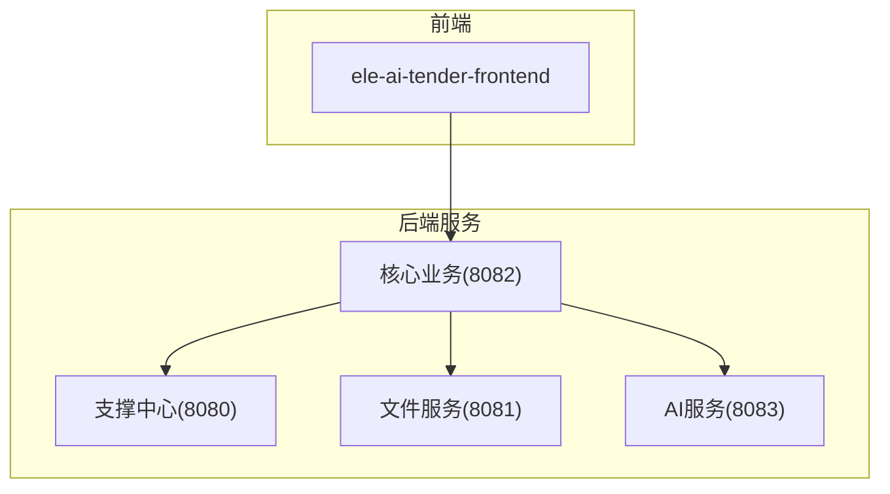
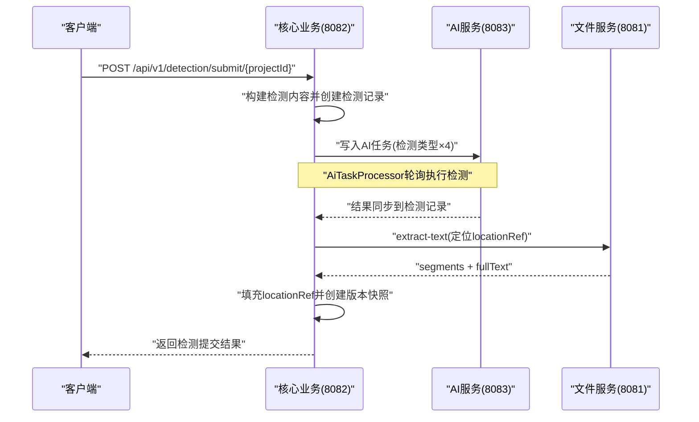
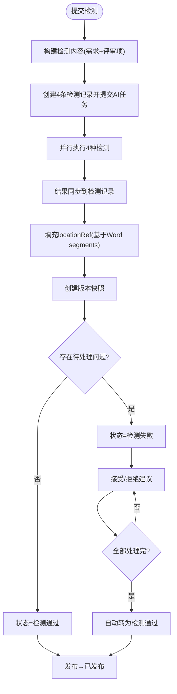
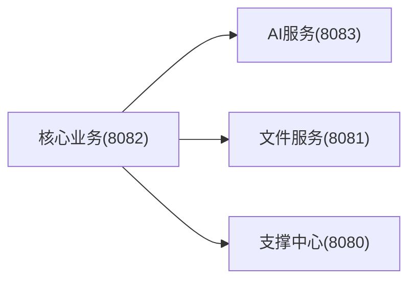

# 核心业务API

<cite>
**本文引用的文件**
- [CORE_MODULE_SPEC.md](file://docs/rules/CORE_MODULE_SPEC.md)
- [PROJECT_SPEC_FINAL.md](file://docs/rules/PROJECT_SPEC_FINAL.md)
- [DETECTION_FLOW_SPEC.md](file://docs/rules/DETECTION_FLOW_SPEC.md)
- [FILE_SERVICE_SPEC.md](file://docs/rules/FILE_SERVICE_SPEC.md)
- [AI_MODULE_SPEC.md](file://docs/rules/AI_MODULE_SPEC.md)
</cite>

## 目录
1. [简介](#简介)
2. [项目结构](#项目结构)
3. [核心组件](#核心组件)
4. [架构总览](#架构总览)
5. [详细接口规范](#详细接口规范)
6. [依赖关系分析](#依赖关系分析)
7. [性能与并发](#性能与并发)
8. [错误码与状态码](#错误码与状态码)
9. [版本兼容策略](#版本兼容策略)
10. [排障指南](#排障指南)
11. [结论](#结论)

## 简介
本文件为“核心业务模块”的RESTful API文档，覆盖项目管理、需求管理、智能检测、文档集成等关键能力。文档基于仓库内权威规范整理，面向前后端开发者与集成方，提供统一的接口约定、数据模型、状态流转与最佳实践说明。

## 项目结构
核心业务由多模块协作完成：
- 支撑中心（认证、模板、知识库、模型配置、消息、日志等）
- 文件服务（上传下载、文档生成引擎、文本提取、修复）
- 核心业务（项目、需求、评审项、检测、文档集成、AI任务编排）
- AI服务（对话、优化、建议、检测执行、模型路由）

图表来源
- [PROJECT_SPEC_FINAL.md:15-27](file://docs/rules/PROJECT_SPEC_FINAL.md#L15-L27)

章节来源
- [PROJECT_SPEC_FINAL.md:15-27](file://docs/rules/PROJECT_SPEC_FINAL.md#L15-L27)

## 核心组件
- 项目管理：生命周期、阶段推进、状态变更、版本快照、导出
- 需求管理：创建/更新/匹配历史模板/AI生成/自动保存/检测/导出
- 评审项：树形结构、批量操作、AI生成
- 智能检测：提交检测、进度查询、报告获取、接受/拒绝建议、一键接受、跳过/重试
- 文档集成：异步集成、预览、编辑
- AI任务：任务状态、跳过、按实体最新任务查询
- 反馈与消息：内容反馈、消息中心
- 政策文件：用户级政策文件管理

章节来源
- [CORE_MODULE_SPEC.md:9-138](file://docs/rules/CORE_MODULE_SPEC.md#L9-L138)

## 架构总览
核心业务通过“何时生成”进行编排：组装参数、写入AI任务、管理记录与版本快照；AI服务负责“如何生成”，包括检测器、生成器与模型路由。文件服务提供文档渲染、文本提取与修复能力。

图表来源
- [DETECTION_FLOW_SPEC.md:40-78](file://docs/rules/DETECTION_FLOW_SPEC.md#L40-L78)
- [FILE_SERVICE_SPEC.md:86-92](file://docs/rules/FILE_SERVICE_SPEC.md#L86-L92)

## 详细接口规范
以下接口均位于统一前缀 `/api/v1`，除另有说明外，请求体为JSON，响应遵循通用成功/失败包装。鉴权方式与安全约束见全局规范。

### 项目管理
- GET /api/v1/projects — 分页查询项目列表
- GET /api/v1/projects/{id} — 获取项目详情
- POST /api/v1/projects — 创建项目
- PUT /api/v1/projects/{id} — 更新项目
- DELETE /api/v1/projects — 批量删除项目
- GET /api/v1/projects/{id}/phase — 获取当前阶段信息
- PUT /api/v1/projects/{id}/phase — 推进阶段（RequestBody: targetPhase + context）
- PUT /api/v1/projects/{id}/status — 变更项目状态
- POST /api/v1/projects/{id}/requirement-generate — 提交AI生成需求
- POST /api/v1/projects/{id}/cancel — 取消项目
- POST /api/v1/projects/{id}/publish — 发布项目
- POST /api/v1/projects/{id}/archive — 归档项目
- GET /api/v1/projects/{id}/versions — 获取版本历史
- POST /api/v1/projects/{id}/export — 导出招标文件

校验与约束要点
- 项目编号必填且唯一（含已删除记录），并发插入冲突需友好提示
- 评审方式必填，预算≥阈值或工程/货物类推荐人工评审
- 阶段仅顺序推进，不可跳跃或倒退；进入编制阶段→IN_PROGRESS，进入检测阶段→DETECTING

章节来源
- [CORE_MODULE_SPEC.md:11-28](file://docs/rules/CORE_MODULE_SPEC.md#L11-L28)
- [CORE_MODULE_SPEC.md:157-176](file://docs/rules/CORE_MODULE_SPEC.md#L157-L176)
- [CORE_MODULE_SPEC.md:264-273](file://docs/rules/CORE_MODULE_SPEC.md#L264-L273)

### 业务需求
- GET /api/v1/requirements — 分页查询需求列表
- GET /api/v1/requirements/{id} — 获取需求详情
- POST /api/v1/requirements — 创建需求
- PUT /api/v1/requirements/{id} — 更新需求
- DELETE /api/v1/requirements/{id} — 删除需求
- GET /api/v1/requirements/match-files — 获取匹配文件列表
- POST /api/v1/requirements/{id}/match — 匹配历史模板
- POST /api/v1/requirements/{id}/generate — 提交AI生成需求任务
- POST /api/v1/requirements/{id}/auto-save — 自动保存草稿
- GET /api/v1/requirements/{id}/auto-save — 获取自动保存内容
- DELETE /api/v1/requirements/{id}/auto-save — 清除自动保存内容
- POST /api/v1/requirements/{id}/detect — 提交需求检测（敏感词+错别字）
- POST /api/v1/requirements/{id}/detect/{recordId}/accept — 接受检测建议
- POST /api/v1/requirements/{id}/detect/{recordId}/reject — 拒绝检测建议
- GET /api/v1/requirements/{id}/detect/records — 获取检测记录列表
- POST /api/v1/requirements/{id}/detect/finish — 完成需求检测
- GET /api/v1/requirements/{id}/export — 导出需求文档

校验与约束要点
- 需求与项目单向关联+内容快照；进入需求阶段后从项目需求内容读取
- 自动保存用于草稿恢复，检测记录支持接受/拒绝建议并追踪处理状态

章节来源
- [CORE_MODULE_SPEC.md:30-50](file://docs/rules/CORE_MODULE_SPEC.md#L30-L50)
- [CORE_MODULE_SPEC.md:177-185](file://docs/rules/CORE_MODULE_SPEC.md#L177-L185)

### 评审项
- POST /api/v1/review-items — 创建评审项
- GET /api/v1/review-items/{projectId} — 获取项目评审项树
- PUT /api/v1/review-items/{id} — 更新评审项
- DELETE /api/v1/review-items/{id} — 删除评审项
- POST /api/v1/review-items/{projectId}/generate — 提交AI生成评审项
- POST /api/v1/review-items/batch — 批量创建评审项
- PUT /api/v1/review-items/batch — 批量更新评审项

校验与约束要点
- 三级结构：level=1/2/3，parent_id逐级指向父节点
- 删除父级需检查是否存在子级
- 受模板review_config控制启用类型与是否生成标准

章节来源
- [CORE_MODULE_SPEC.md:52-62](file://docs/rules/CORE_MODULE_SPEC.md#L52-L62)
- [CORE_MODULE_SPEC.md:215-244](file://docs/rules/CORE_MODULE_SPEC.md#L215-L244)

### 智能检测
- POST /api/v1/detection/submit/{projectId} — 提交最终文档检测
- GET /api/v1/detection/progress/{projectId} — 获取检测进度
- GET /api/v1/detection/report/{projectId} — 获取检测报告
- POST /api/v1/detection/{recordId}/accept — 接受检测建议
- POST /api/v1/detection/{recordId}/reject — 拒绝检测建议
- POST /api/v1/detection/accept-all/{projectId} — 一键接受全部建议
- POST /api/v1/detection/skip/{projectId} — 跳过检测
- POST /api/v1/detection/retry/{projectId} — 重新检测

流程要点
- 检测范围：系统生成的招标需求内容+评审项标准，不包含模板内容
- 检测完成后自动填充locationRef，基于Word文件segments精准定位
- 接受即修复：调用文件服务直接修改Word段落，未找到原文则标记处理状态
- 重试必须走状态机：DETECTION_FAILED → IN_PROGRESS → PENDING_DETECTION → DETECTING

图表来源
- [DETECTION_FLOW_SPEC.md:9-29](file://docs/rules/DETECTION_FLOW_SPEC.md#L9-L29)
- [DETECTION_FLOW_SPEC.md:40-78](file://docs/rules/DETECTION_FLOW_SPEC.md#L40-L78)
- [DETECTION_FLOW_SPEC.md:98-108](file://docs/rules/DETECTION_FLOW_SPEC.md#L98-L108)
- [DETECTION_FLOW_SPEC.md:131-157](file://docs/rules/DETECTION_FLOW_SPEC.md#L131-L157)
- [DETECTION_FLOW_SPEC.md:159-188](file://docs/rules/DETECTION_FLOW_SPEC.md#L159-L188)

章节来源
- [CORE_MODULE_SPEC.md:64-77](file://docs/rules/CORE_MODULE_SPEC.md#L64-L77)
- [DETECTION_FLOW_SPEC.md:40-78](file://docs/rules/DETECTION_FLOW_SPEC.md#L40-L78)
- [DETECTION_FLOW_SPEC.md:159-188](file://docs/rules/DETECTION_FLOW_SPEC.md#L159-L188)

### 文档集成
- POST /api/v1/documents/integrate/{projectId} — 执行文档集成（异步，返回AiTask）
- GET /api/v1/documents/preview/{projectId} — 获取集成预览
- PUT /api/v1/documents/edit/{projectId} — 编辑集成后的文档内容

要点
- 集成过程由AI语义匹配占位符与数据key，调用文件服务poi-tl生成Word
- 生成完成后固化版本快照

章节来源
- [CORE_MODULE_SPEC.md:79-86](file://docs/rules/CORE_MODULE_SPEC.md#L79-L86)
- [AI_MODULE_SPEC.md:55-62](file://docs/rules/AI_MODULE_SPEC.md#L55-L62)

### 项目模板快照
- POST /api/v1/project-templates/bind — 项目绑定模板
- GET /api/v1/project-templates/project/{projectId} — 获取项目模板

章节来源
- [CORE_MODULE_SPEC.md:87-93](file://docs/rules/CORE_MODULE_SPEC.md#L87-L93)

### 模板查询
- GET /api/v1/templates — 分页查询模板列表
- GET /api/v1/templates/{id} — 获取模板详情
- GET /api/v1/templates/default — 获取默认模板

章节来源
- [CORE_MODULE_SPEC.md:94-100](file://docs/rules/CORE_MODULE_SPEC.md#L94-L100)

### AI任务管理
- GET /api/v1/ai-tasks/{id} — 查询任务状态
- POST /api/v1/ai-tasks/{id}/skip — 跳过任务(降级手动)
- GET /api/v1/ai-tasks/latest — 查询业务实体的最新AI任务

进度与终态规则
- 使用 status + result_synced 双维度判断真实进度
- 前端进度映射：PENDING→10%，PROCESSING→60%，COMPLETED(result_synced=0)→90%，COMPLETED(result_synced=1)→100%，COMPLETED(result_synced=2)→0%（等同失败），FAILED/AI_UNAVAILABLE/SKIPPED→0%

章节来源
- [CORE_MODULE_SPEC.md:102-108](file://docs/rules/CORE_MODULE_SPEC.md#L102-L108)
- [CORE_MODULE_SPEC.md:187-213](file://docs/rules/CORE_MODULE_SPEC.md#L187-L213)

### AI内容反馈
- POST /api/v1/feedback — 提交或更新反馈
- GET /api/v1/feedback — 查询当前用户对某个目标的反馈状态

章节来源
- [CORE_MODULE_SPEC.md:110-116](file://docs/rules/CORE_MODULE_SPEC.md#L110-L116)

### 消息中心
- GET /api/v1/messages — 分页查询消息
- PUT /api/v1/messages/{id}/read — 标记已读
- PUT /api/v1/messages/read-all — 全部标记已读
- GET /api/v1/messages/unread-count — 未读消息数
- DELETE /api/v1/messages/{id} — 删除消息

章节来源
- [CORE_MODULE_SPEC.md:117-126](file://docs/rules/CORE_MODULE_SPEC.md#L117-L126)

### 用户政策文件
- GET /api/v1/policy-files — 分页查询当前用户的政策文件
- POST /api/v1/policy-files — 上传政策文件
- GET /api/v1/policy-files/{id} — 查看详情
- DELETE /api/v1/policy-files/{id} — 删除政策文件
- PUT /api/v1/policy-files/{id}/status — 启用/禁用
- GET /api/v1/policy-files/all — 获取全部可用政策文件（系统级+用户级合并）
- GET /api/v1/policy-files/knowledge-policy — 获取知识库中所有政策类文档

多选筛选要点
- applicable_category 为逗号分隔多选，查询使用精确匹配工具避免部分匹配

章节来源
- [CORE_MODULE_SPEC.md:127-138](file://docs/rules/CORE_MODULE_SPEC.md#L127-L138)
- [CORE_MODULE_SPEC.md:275-283](file://docs/rules/CORE_MODULE_SPEC.md#L275-L283)

## 依赖关系分析
- 核心业务依赖AI服务（异步任务）、文件服务（文档生成/修复/提取）、支撑中心（模板/模型配置/消息/日志）
- 文件服务提供内部接口供核心与AI模块调用
- 支撑中心提供认证、权限、模板、模型配置、消息、日志等基础能力

图表来源
- [PROJECT_SPEC_FINAL.md:15-27](file://docs/rules/PROJECT_SPEC_FINAL.md#L15-L27)

章节来源
- [PROJECT_SPEC_FINAL.md:15-27](file://docs/rules/PROJECT_SPEC_FINAL.md#L15-L27)

## 性能与并发
- AI任务调度采用动态线程池与用户级并发控制，Semaphore双层限流
- 需求生成三步式编排，分章并行生成，限制最大字数与超时时间
- 检测并行执行四种检测器，结果独立汇总
- Token用量统计与限流缓存至Redis

章节来源
- [AI_MODULE_SPEC.md:143-161](file://docs/rules/AI_MODULE_SPEC.md#L143-L161)
- [AI_MODULE_SPEC.md:64-80](file://docs/rules/AI_MODULE_SPEC.md#L64-L80)
- [CORE_MODULE_SPEC.md:258-263](file://docs/rules/CORE_MODULE_SPEC.md#L258-L263)

## 错误码与状态码
- HTTP状态码：遵循REST惯例（2xx成功、4xx客户端错误、5xx服务端错误）
- 业务错误码：参考通用ResponseCode枚举定义
- 项目状态：DRAFT/IN_PROGRESS/PENDING_DETECTION/DETECTING/DETECTION_PASSED/DETECTION_FAILED/DETECTION_SKIPPED/PUBLISHED/ARCHIVED/CANCELLED
- 阶段状态：BASIC_INFO→REQUIREMENT→REVIEW_ITEM→DOCUMENT→DETECTION（顺序推进）
- AI任务状态：PENDING/PROCESSING/COMPLETED/FAILED/AI_UNAVAILABLE/SKIPPED，结合result_synced判定真实进度

章节来源
- [CORE_MODULE_SPEC.md:157-176](file://docs/rules/CORE_MODULE_SPEC.md#L157-L176)
- [CORE_MODULE_SPEC.md:187-213](file://docs/rules/CORE_MODULE_SPEC.md#L187-L213)

## 版本兼容策略
- 接口版本化：统一前缀 `/api/v1`，新增字段保持向后兼容，废弃字段保留一段时间并给出迁移指引
- 模板配置兼容：review_config为null时回退到“全部启用”默认行为
- 检测范围兼容：content_file_id已废弃，统一以content_snapshot作为检测输入
- 文件服务兼容：fix-doc locationRef为空时降级全文档匹配

章节来源
- [CORE_MODULE_SPEC.md:242-244](file://docs/rules/CORE_MODULE_SPEC.md#L242-L244)
- [DETECTION_FLOW_SPEC.md:60-78](file://docs/rules/DETECTION_FLOW_SPEC.md#L60-L78)
- [FILE_SERVICE_SPEC.md:73-85](file://docs/rules/FILE_SERVICE_SPEC.md#L73-L85)

## 排障指南
- 项目状态异常：核查tb_project.status与状态流转合法性
- 阶段推进失败：查看PhaseFlowController日志，确认阶段触发器与上下文
- 需求内容为空：检查tb_project.requirement_id与AI任务状态
- AI生成失败：核查sup_model_config、Token用量与路由规则
- 评审项结构错误：检查parent_id与level层级关系
- 检测相关问题：依据检测全链路规范排查任务执行、结果同步、locationRef填充与修复替换
- 文件服务问题：检查白名单、大小限制、路径权限与SHA-256一致性

章节来源
- [CORE_MODULE_SPEC.md:342-349](file://docs/rules/CORE_MODULE_SPEC.md#L342-L349)
- [DETECTION_FLOW_SPEC.md:198-210](file://docs/rules/DETECTION_FLOW_SPEC.md#L198-L210)
- [FILE_SERVICE_SPEC.md:139-147](file://docs/rules/FILE_SERVICE_SPEC.md#L139-L147)

## 结论
本文档系统化梳理了核心业务的RESTful API规范，明确了接口契约、状态流转、数据模型与跨模块协作边界。建议在实现与对接过程中严格遵循校验规则、安全与并发策略，并关注版本兼容与排障指引，以确保系统稳定与可维护性。