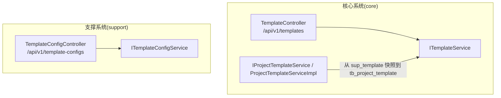
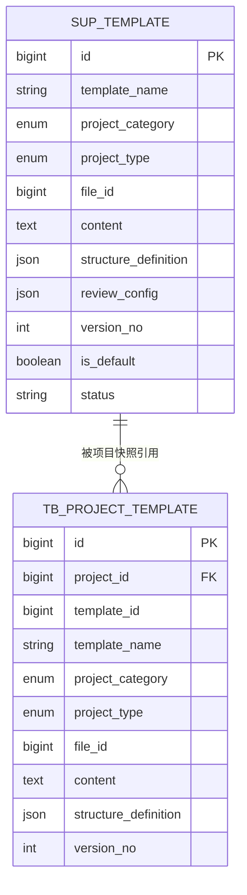
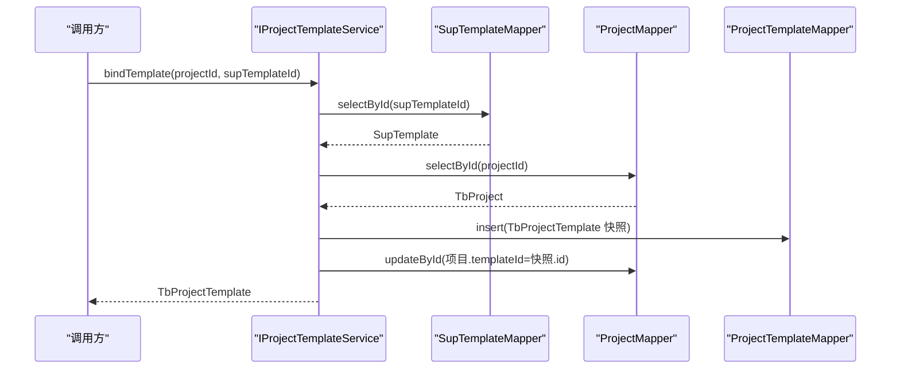
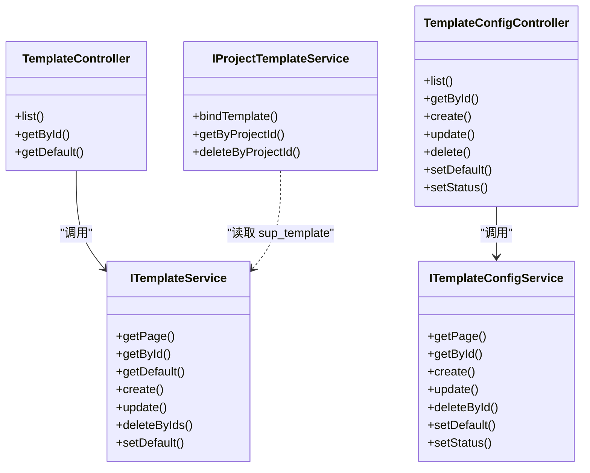

# 模板管理API

<cite>
**本文引用的文件**
- [TemplateController.java](file://ele-ai-tender-system/ele-ai-tender-core/src/main/java/com/jy/eleaitender/core/controller/TemplateController.java)
- [ITemplateService.java](file://ele-ai-tender-system/ele-ai-tender-core/src/main/java/com/jy/eleaitender/core/service/ITemplateService.java)
- [TemplateConfigController.java](file://ele-ai-tender-system/ele-ai-tender-support/src/main/java/com/jy/eleaitender/support/controller/TemplateConfigController.java)
- [ITemplateConfigService.java](file://ele-ai-tender-system/ele-ai-tender-support/src/main/java/com/jy/eleaitender/support/service/ITemplateConfigService.java)
- [IProjectTemplateService.java](file://ele-ai-tender-system/ele-ai-tender-core/src/main/java/com/jy/eleaitender/core/service/IProjectTemplateService.java)
- [ProjectTemplateServiceImpl.java](file://ele-ai-tender-system/ele-ai-tender-core/src/main/java/com/jy/eleaitender/core/service/impl/ProjectTemplateServiceImpl.java)
- [SUPPORT_SYSTEM_SPEC.md](file://docs/rules/SUPPORT_SYSTEM_SPEC.md)
- [CORE_MODULE_SPEC.md](file://docs/rules/CORE_MODULE_SPEC.md)
</cite>

## 目录
1. [简介](#简介)
2. [项目结构](#项目结构)
3. [核心组件](#核心组件)
4. [架构总览](#架构总览)
5. [详细接口说明](#详细接口说明)
6. [依赖关系分析](#依赖关系分析)
7. [性能与可用性建议](#性能与可用性建议)
8. [故障排查指南](#故障排查指南)
9. [结论](#结论)
10. [附录](#附录)

## 简介
本文件为“模板管理模块”的API接口文档，覆盖招标文件模板的创建、编辑、删除、查询等基础操作，以及默认模板选择、状态控制、版本快照与项目绑定复用等能力。同时给出模板预览、测试、复制等高级能力的接入点与使用方式说明，并解释模板变量替换、条件渲染、动态内容生成在系统中的落地位置与调用路径。

## 项目结构
模板相关后端服务分布在两个子系统中：
- 核心业务系统（core）：提供面向业务侧的模板读取与默认模板选择能力
- 支撑系统（support）：提供模板配置管理（增删改查、设为默认、状态切换）

图表来源
- [TemplateController.java:16-51](file://ele-ai-tender-system/ele-ai-tender-core/src/main/java/com/jy/eleaitender/core/controller/TemplateController.java#L16-L51)
- [ITemplateService.java:11-47](file://ele-ai-tender-system/ele-ai-tender-core/src/main/java/com/jy/eleaitender/core/service/ITemplateService.java#L11-L47)
- [TemplateConfigController.java:13-80](file://ele-ai-tender-system/ele-ai-tender-support/src/main/java/com/jy/eleaitender/support/controller/TemplateConfigController.java#L13-L80)
- [ITemplateConfigService.java:6-15](file://ele-ai-tender-system/ele-ai-tender-support/src/main/java/com/jy/eleaitender/support/service/ITemplateConfigService.java#L6-L15)
- [IProjectTemplateService.java:8-34](file://ele-ai-tender-system/ele-ai-tender-core/src/main/java/com/jy/eleaitender/core/service/IProjectTemplateService.java#L8-L34)
- [ProjectTemplateServiceImpl.java:28-78](file://ele-ai-tender-system/ele-ai-tender-core/src/main/java/com/jy/eleaitender/core/service/impl/ProjectTemplateServiceImpl.java#L28-L78)

章节来源
- [TemplateController.java:16-51](file://ele-ai-tender-system/ele-ai-tender-core/src/main/java/com/jy/eleaitender/core/controller/TemplateController.java#L16-L51)
- [TemplateConfigController.java:13-80](file://ele-ai-tender-system/ele-ai-tender-support/src/main/java/com/jy/eleaitender/support/controller/TemplateConfigController.java#L13-L80)

## 核心组件
- 模板控制器（core）：对外暴露模板列表、详情、默认模板查询
- 模板配置控制器（support）：对外暴露模板配置的完整CRUD、设为默认、状态设置
- 模板服务接口（core）：定义分页查询、详情、默认模板、创建、更新、批量删除、设为默认
- 模板配置服务接口（support）：定义分页查询、详情、创建、更新、删除、设为默认、状态设置
- 项目模板服务（core）：实现“从 sup_template 快照到 tb_project_template”的项目绑定与快照机制

章节来源
- [ITemplateService.java:11-47](file://ele-ai-tender-system/ele-ai-tender-core/src/main/java/com/jy/eleaitender/core/service/ITemplateService.java#L11-L47)
- [ITemplateConfigService.java:6-15](file://ele-ai-tender-system/ele-ai-tender-support/src/main/java/com/jy/eleaitender/support/service/ITemplateConfigService.java#L6-L15)
- [IProjectTemplateService.java:8-34](file://ele-ai-tender-system/ele-ai-tender-core/src/main/java/com/jy/eleaitender/core/service/IProjectTemplateService.java#L8-L34)
- [ProjectTemplateServiceImpl.java:28-78](file://ele-ai-tender-system/ele-ai-tender-core/src/main/java/com/jy/eleaitender/core/service/impl/ProjectTemplateServiceImpl.java#L28-L78)

## 架构总览
模板数据模型与持久化约定如下：
- sup_template：招标文件模板主表，包含名称、类别、类型、文件ID、内容、结构定义(JSON)、评审项配置(JSON)、版本号、是否默认、状态等字段
- tb_project_template：项目模板快照表，用于将选定模板的内容与结构以快照形式绑定到具体项目，避免后续模板变更影响已绑定项目

图表来源
- [SUPPORT_SYSTEM_SPEC.md:212](file://docs/rules/SUPPORT_SYSTEM_SPEC.md#L212)
- [CORE_MODULE_SPEC.md:144-147](file://docs/rules/CORE_MODULE_SPEC.md#L144-L147)

## 详细接口说明

### 一、模板配置管理（支撑系统）
基础路径：/api/v1/template-configs

- 分页查询模板
  - 方法：GET
  - 路径：/api/v1/template-configs
  - 参数：pageNum, pageSize, templateName, projectCategory, projectType, status
  - 返回：分页结果（SupTemplate）
  - 说明：支持按名称、类别、类型、状态筛选

- 获取模板详情
  - 方法：GET
  - 路径：/api/v1/template-configs/{id}
  - 返回：SupTemplate

- 创建模板
  - 方法：POST
  - 路径：/api/v1/template-configs
  - 请求体：SupTemplate
  - 返回：创建的 SupTemplate

- 更新模板
  - 方法：PUT
  - 路径：/api/v1/template-configs/{id}
  - 请求体：SupTemplate（包含id）
  - 返回：成功响应

- 删除模板
  - 方法：DELETE
  - 路径：/api/v1/template-configs/{id}
  - 返回：成功响应

- 设为默认模板
  - 方法：POST
  - 路径：/api/v1/template-configs/{id}/set-default
  - 返回：成功响应

- 设置模板状态
  - 方法：PUT
  - 路径：/api/v1/template-configs/{id}/status
  - 参数：status（如 ENABLED/DISABLED）
  - 返回：成功响应

章节来源
- [TemplateConfigController.java:21-79](file://ele-ai-tender-system/ele-ai-tender-support/src/main/java/com/jy/eleaitender/support/controller/TemplateConfigController.java#L21-L79)
- [ITemplateConfigService.java:6-15](file://ele-ai-tender-system/ele-ai-tender-support/src/main/java/com/jy/eleaitender/support/service/ITemplateConfigService.java#L6-L15)
- [SUPPORT_SYSTEM_SPEC.md:60-70](file://docs/rules/SUPPORT_SYSTEM_SPEC.md#L60-L70)

### 二、模板读取（核心系统）
基础路径：/api/v1/templates

- 分页查询模板列表
  - 方法：GET
  - 路径：/api/v1/templates
  - 参数：pageNum, pageSize, templateName, projectCategory, projectType
  - 返回：分页结果（SupTemplate）

- 获取模板详情
  - 方法：GET
  - 路径：/api/v1/templates/{id}
  - 返回：SupTemplate

- 获取默认模板
  - 方法：GET
  - 路径：/api/v1/templates/default
  - 参数：projectCategory, projectType（可选）
  - 返回：SupTemplate

章节来源
- [TemplateController.java:24-50](file://ele-ai-tender-system/ele-ai-tender-core/src/main/java/com/jy/eleaitender/core/controller/TemplateController.java#L24-L50)
- [ITemplateService.java:13-26](file://ele-ai-tender-system/ele-ai-tender-core/src/main/java/com/jy/eleaitender/core/service/ITemplateService.java#L13-L26)

### 三、模板与项目的关联与复用（快照机制）
- 绑定模板到项目（创建快照）
  - 服务：IProjectTemplateService.bindTemplate(projectId, supTemplateId)
  - 行为：校验源模板与项目存在；删除旧绑定；从 sup_template 拷贝必要字段到 tb_project_template；更新项目指向新快照
  - 返回：TbProjectTemplate（快照）

- 获取项目的模板快照
  - 服务：IProjectTemplateService.getByProjectId(projectId)
  - 返回：TbProjectTemplate 或 null

- 删除项目的模板引用
  - 服务：IProjectTemplateService.deleteByProjectId(projectId)
  - 说明：物理删除，释放唯一约束

图表来源
- [IProjectTemplateService.java:16-17](file://ele-ai-tender-system/ele-ai-tender-core/src/main/java/com/jy/eleaitender/core/service/IProjectTemplateService.java#L16-L17)
- [ProjectTemplateServiceImpl.java:34-71](file://ele-ai-tender-system/ele-ai-tender-core/src/main/java/com/jy/eleaitender/core/service/impl/ProjectTemplateServiceImpl.java#L34-L71)

章节来源
- [IProjectTemplateService.java:8-34](file://ele-ai-tender-system/ele-ai-tender-core/src/main/java/com/jy/eleaitender/core/service/IProjectTemplateService.java#L8-L34)
- [ProjectTemplateServiceImpl.java:28-78](file://ele-ai-tender-system/ele-ai-tender-core/src/main/java/com/jy/eleaitender/core/service/impl/ProjectTemplateServiceImpl.java#L28-L78)
- [CORE_MODULE_SPEC.md:144-147](file://docs/rules/CORE_MODULE_SPEC.md#L144-L147)

### 四、模板预览、测试、复制等高级功能
- 模板预览
  - 通过模板详情接口获取 SupTemplate，其中包含 content、structure_definition、review_config 等字段，前端可据此进行结构化预览与渲染
  - 参考：模板详情接口（/api/v1/template-configs/{id} 或 /api/v1/templates/{id}）

- 模板测试
  - 基于 SupTemplate 的结构定义与评审配置，结合项目上下文数据进行渲染验证
  - 建议在业务层扩展“渲染测试”接口，传入 projectId 或数据上下文，返回渲染结果摘要或差异报告

- 模板复制
  - 可通过“创建模板”接口传入现有模板的关键字段（名称、类别、类型、文件ID、内容、结构定义、评审配置、版本号等）完成复制
  - 注意：若需保留原模板的版本号策略，应在服务层递增版本号或采用分支命名规则

章节来源
- [TemplateConfigController.java:41-55](file://ele-ai-tender-system/ele-ai-tender-support/src/main/java/com/jy/eleaitender/support/controller/TemplateConfigController.java#L41-L55)
- [SUPPORT_SYSTEM_SPEC.md:212](file://docs/rules/SUPPORT_SYSTEM_SPEC.md#L212)

### 五、模板引擎特性：变量替换、条件渲染、动态内容生成
- 变量替换
  - 模板内容字段 content 中可嵌入占位符，由渲染引擎在项目上下文中进行替换
  - 结构定义 structure_definition 描述模板骨架与区域，便于定位替换范围

- 条件渲染
  - 利用 structure_definition 中的节点条件表达式，根据项目属性（如类别、类型、预算区间等）决定段落/表格的显示与否

- 动态内容生成
  - 借助 review_config 与外部数据源，动态生成评审项、评分表、附件清单等内容
  - 可在渲染阶段注入业务计算逻辑，输出最终文档片段

说明：上述能力通过 SupTemplate 的 content/structure_definition/review_config 字段协同实现，具体渲染器位于文档生成链路中，由上层服务调用。

章节来源
- [SUPPORT_SYSTEM_SPEC.md:212](file://docs/rules/SUPPORT_SYSTEM_SPEC.md#L212)
- [CORE_MODULE_SPEC.md:147](file://docs/rules/CORE_MODULE_SPEC.md#L147)

## 依赖关系分析
- 控制器与服务解耦：各 Controller 仅负责路由与参数映射，业务逻辑下沉至 Service 层
- 跨子系统协作：core 提供读取与默认模板选择，support 提供配置管理；项目绑定通过 IProjectTemplateService 协调 sup_template 与 tb_project_template
- 数据一致性：项目绑定前会删除旧绑定，确保唯一性；快照写入后更新项目指向

图表来源
- [TemplateController.java:16-51](file://ele-ai-tender-system/ele-ai-tender-core/src/main/java/com/jy/eleaitender/core/controller/TemplateController.java#L16-L51)
- [ITemplateService.java:11-47](file://ele-ai-tender-system/ele-ai-tender-core/src/main/java/com/jy/eleaitender/core/service/ITemplateService.java#L11-L47)
- [TemplateConfigController.java:13-80](file://ele-ai-tender-system/ele-ai-tender-support/src/main/java/com/jy/eleaitender/support/controller/TemplateConfigController.java#L13-L80)
- [ITemplateConfigService.java:6-15](file://ele-ai-tender-system/ele-ai-tender-support/src/main/java/com/jy/eleaitender/support/service/ITemplateConfigService.java#L6-L15)
- [IProjectTemplateService.java:8-34](file://ele-ai-tender-system/ele-ai-tender-core/src/main/java/com/jy/eleaitender/core/service/IProjectTemplateService.java#L8-L34)

## 性能与可用性建议
- 分页查询：统一使用 pageNum/pageSize 参数，避免全量拉取
- 缓存策略：对默认模板查询可按 projectCategory/projectType 维度做短期缓存，降低热点访问压力
- 快照写入：项目绑定时先删后写，保证唯一约束；大批量操作建议分批提交
- 大对象处理：content/structure_definition/review_config 可能较大，建议按需加载与压缩传输

## 故障排查指南
- 模板未找到
  - 现象：绑定模板时报错模板不存在
  - 排查：确认 sup_template 中存在对应 id，且未被删除或禁用

- 项目未找到
  - 现象：绑定模板时报错项目不存在
  - 排查：确认 tb_project 中存在对应项目记录

- 唯一约束冲突
  - 现象：重复绑定导致失败
  - 排查：确认是否已存在该项目的模板快照，必要时先删除旧绑定

章节来源
- [ProjectTemplateServiceImpl.java:34-71](file://ele-ai-tender-system/ele-ai-tender-core/src/main/java/com/jy/eleaitender/core/service/impl/ProjectTemplateServiceImpl.java#L34-L71)

## 结论
模板管理模块通过“配置管理（support）+ 读取与默认选择（core）+ 项目快照绑定（core）”的分层设计，实现了模板的集中维护、灵活复用与版本隔离。配合 SupTemplate 的结构化定义与评审配置，可满足复杂招标文件的变量替换、条件渲染与动态内容生成需求。

## 附录
- 数据字典参考
  - sup_template 字段说明与枚举值参见规范文档
  - tb_project_template 快照字段与约束参见核心模块规范

章节来源
- [SUPPORT_SYSTEM_SPEC.md:212](file://docs/rules/SUPPORT_SYSTEM_SPEC.md#L212)
- [CORE_MODULE_SPEC.md:144-147](file://docs/rules/CORE_MODULE_SPEC.md#L144-L147)