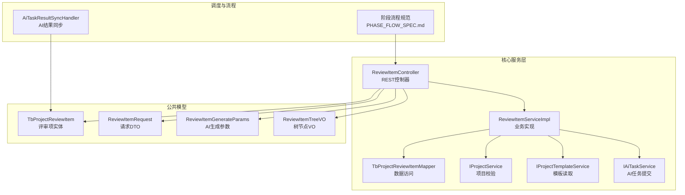
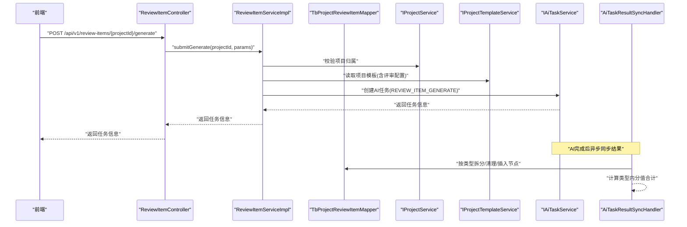
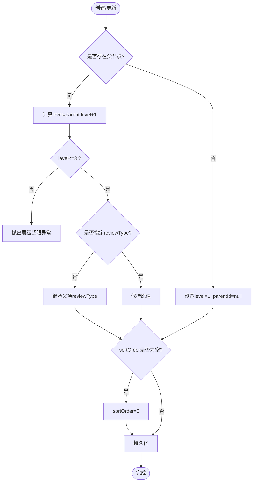
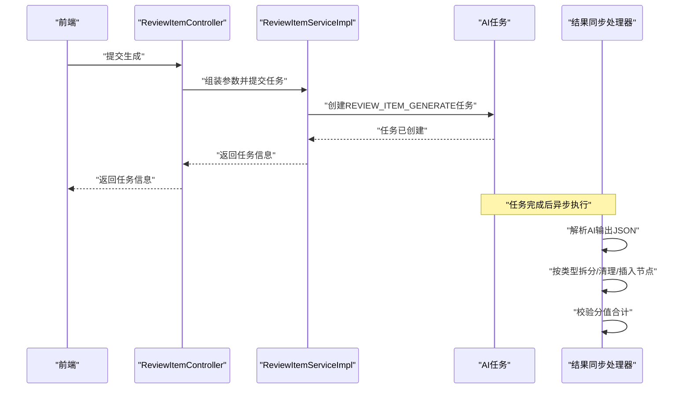
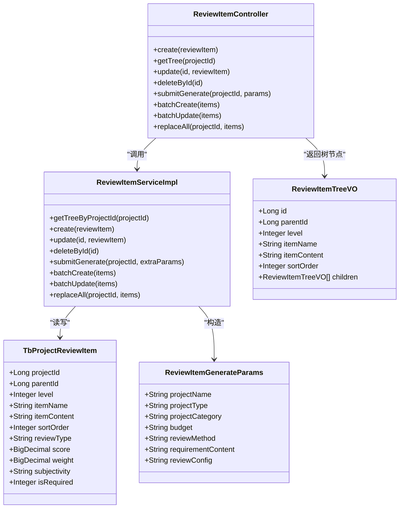

# 评审项管理API

<cite>
**本文引用的文件**
- [ReviewItemController.java](file://ele-ai-tender-system/ele-ai-tender-core/src/main/java/com/jy/eleaitender/core/controller/ReviewItemController.java)
- [ReviewItemServiceImpl.java](file://ele-ai-tender-system/ele-ai-tender-core/src/main/java/com/jy/eleaitender/core/service/impl/ReviewItemServiceImpl.java)
- [TbProjectReviewItem.java](file://ele-ai-tender-system/ele-ai-tender-common/src/main/java/com/jy/eleaitender/common/entity/core/TbProjectReviewItem.java)
- [ReviewItemTreeVO.java](file://ele-ai-tender-system/ele-ai-tender-core/src/main/java/com/jy/eleaitender/core/dto/response/ReviewItemTreeVO.java)
- [ReviewItemRequest.java](file://ele-ai-tender-system/ele-ai-tender-core/src/main/java/com/jy/eleaitender/core/dto/request/ReviewItemRequest.java)
- [ReviewItemGenerateParams.java](file://ele-ai-tender-system/ele-ai-tender-common/src/main/java/com/jy/eleaitender/common/dto/ai/ReviewItemGenerateParams.java)
- [AiTaskResultSyncHandler.java](file://ele-ai-tender-system/ele-ai-tender-core/src/main/java/com/jy/eleaitender/core/scheduler/AiTaskResultSyncHandler.java)
- [PHASE_FLOW_SPEC.md](file://docs/rules/PHASE_FLOW_SPEC.md)
</cite>

## 目录
1. [简介](#简介)
2. [项目结构](#项目结构)
3. [核心组件](#核心组件)
4. [架构总览](#架构总览)
5. [详细接口说明](#详细接口说明)
6. [依赖关系分析](#依赖关系分析)
7. [性能与一致性](#性能与一致性)
8. [故障排查指南](#故障排查指南)
9. [结论](#结论)
10. [附录](#附录)

## 简介
本文件为“评审项管理”模块的API文档，覆盖评审项树形结构管理、评审标准配置、评分规则设置、批量操作、排序调整、条件判断、AI生成评审项、评审结果计算与汇总、以及评审流程状态管理与审批机制等。文档面向前后端开发者与实施人员，力求以清晰的接口定义、数据模型与流程图帮助快速集成与排障。

## 项目结构
评审项管理相关后端代码位于 core 模块，实体与通用DTO位于 common 模块；前端调用封装在 ele-ai-tender-frontend 中（本文件聚焦后端API）。

图表来源
- [ReviewItemController.java:1-90](file://ele-ai-tender-system/ele-ai-tender-core/src/main/java/com/jy/eleaitender/core/controller/ReviewItemController.java#L1-L90)
- [ReviewItemServiceImpl.java:1-276](file://ele-ai-tender-system/ele-ai-tender-core/src/main/java/com/jy/eleaitender/core/service/impl/ReviewItemServiceImpl.java#L1-L276)
- [TbProjectReviewItem.java:1-67](file://ele-ai-tender-system/ele-ai-tender-common/src/main/java/com/jy/eleaitender/common/entity/core/TbProjectReviewItem.java#L1-L67)
- [ReviewItemTreeVO.java:1-25](file://ele-ai-tender-system/ele-ai-tender-core/src/main/java/com/jy/eleaitender/core/dto/response/ReviewItemTreeVO.java#L1-L25)
- [ReviewItemRequest.java:1-31](file://ele-ai-tender-system/ele-ai-tender-core/src/main/java/com/jy/eleaitender/core/dto/request/ReviewItemRequest.java#L1-L31)
- [ReviewItemGenerateParams.java:1-26](file://ele-ai-tender-system/ele-ai-tender-common/src/main/java/com/jy/eleaitender/common/dto/ai/ReviewItemGenerateParams.java#L1-L26)
- [AiTaskResultSyncHandler.java:217-239](file://ele-ai-tender-system/ele-ai-tender-core/src/main/java/com/jy/eleaitender/core/scheduler/AiTaskResultSyncHandler.java#L217-L239)
- [PHASE_FLOW_SPEC.md:1-206](file://docs/rules/PHASE_FLOW_SPEC.md#L1-L206)

章节来源
- [ReviewItemController.java:1-90](file://ele-ai-tender-system/ele-ai-tender-core/src/main/java/com/jy/eleaitender/core/controller/ReviewItemController.java#L1-L90)
- [ReviewItemServiceImpl.java:1-276](file://ele-ai-tender-system/ele-ai-tender-core/src/main/java/com/jy/eleaitender/core/service/impl/ReviewItemServiceImpl.java#L1-L276)
- [TbProjectReviewItem.java:1-67](file://ele-ai-tender-system/ele-ai-tender-common/src/main/java/com/jy/eleaitender/common/entity/core/TbProjectReviewItem.java#L1-L67)
- [ReviewItemTreeVO.java:1-25](file://ele-ai-tender-system/ele-ai-tender-core/src/main/java/com/jy/eleaitender/core/dto/response/ReviewItemTreeVO.java#L1-L25)
- [ReviewItemRequest.java:1-31](file://ele-ai-tender-system/ele-ai-tender-core/src/main/java/com/jy/eleaitender/core/dto/request/ReviewItemRequest.java#L1-L31)
- [ReviewItemGenerateParams.java:1-26](file://ele-ai-tender-system/ele-ai-tender-common/src/main/java/com/jy/eleaitender/common/dto/ai/ReviewItemGenerateParams.java#L1-L26)
- [AiTaskResultSyncHandler.java:217-239](file://ele-ai-tender-system/ele-ai-tender-core/src/main/java/com/jy/eleaitender/core/scheduler/AiTaskResultSyncHandler.java#L217-L239)
- [PHASE_FLOW_SPEC.md:1-206](file://docs/rules/PHASE_FLOW_SPEC.md#L1-L206)

## 核心组件
- 控制器：提供评审项的增删改查、批量操作、替换全部、AI生成提交等REST接口。
- 服务实现：负责层级校验、父子继承、排序默认值、级联删除、批量写入、全量替换、AI任务参数组装与提交。
- 数据模型：评审项实体包含项目ID、父ID、层级、名称、内容、排序号、评审类型、分值、权重、主客观属性、是否必审等字段。
- 树视图对象：用于前端展示树形结构的节点VO。
- AI生成参数：封装项目名称、类型、类别、预算、评审方法、需求内容、评审配置等。
- 结果同步处理器：处理AI生成的评审项结果，按类型拆分一级分类、清理二级以下节点并插入占位或人工维护项。

章节来源
- [ReviewItemController.java:1-90](file://ele-ai-tender-system/ele-ai-tender-core/src/main/java/com/jy/eleaitender/core/controller/ReviewItemController.java#L1-L90)
- [ReviewItemServiceImpl.java:1-276](file://ele-ai-tender-system/ele-ai-tender-core/src/main/java/com/jy/eleaitender/core/service/impl/ReviewItemServiceImpl.java#L1-L276)
- [TbProjectReviewItem.java:1-67](file://ele-ai-tender-system/ele-ai-tender-common/src/main/java/com/jy/eleaitender/common/entity/core/TbProjectReviewItem.java#L1-L67)
- [ReviewItemTreeVO.java:1-25](file://ele-ai-tender-system/ele-ai-tender-core/src/main/java/com/jy/eleaitender/core/dto/response/ReviewItemTreeVO.java#L1-L25)
- [ReviewItemGenerateParams.java:1-26](file://ele-ai-tender-system/ele-ai-tender-common/src/main/java/com/jy/eleaitender/common/dto/ai/ReviewItemGenerateParams.java#L1-L26)
- [AiTaskResultSyncHandler.java:217-239](file://ele-ai-tender-system/ele-ai-tender-core/src/main/java/com/jy/eleaitender/core/scheduler/AiTaskResultSyncHandler.java#L217-L239)

## 架构总览
评审项管理涉及“前端交互—控制器—服务—数据访问—AI任务—结果同步—阶段推进”的完整链路。

图表来源
- [ReviewItemController.java:57-63](file://ele-ai-tender-system/ele-ai-tender-core/src/main/java/com/jy/eleaitender/core/controller/ReviewItemController.java#L57-L63)
- [ReviewItemServiceImpl.java:139-170](file://ele-ai-tender-system/ele-ai-tender-core/src/main/java/com/jy/eleaitender/core/service/impl/ReviewItemServiceImpl.java#L139-L170)
- [AiTaskResultSyncHandler.java:217-239](file://ele-ai-tender-system/ele-ai-tender-core/src/main/java/com/jy/eleaitender/core/scheduler/AiTaskResultSyncHandler.java#L217-L239)

## 详细接口说明

### 基础路径
- 根路径：/api/v1/review-items

### 认证与鉴权
- 所有接口均需要登录态（RequireLogin）

### 接口列表

#### 1) 获取项目评审项树
- 方法：GET
- 路径：/api/v1/review-items/{projectId}
- 路径参数：
  - projectId：Long，必填
- 响应体：List<TbProjectReviewItem>（扁平列表，前端按reviewType分组显示）
- 业务逻辑：
  - 校验项目存在性
  - 返回该项目下所有评审项记录
- 错误码：
  - 项目不存在时抛出业务异常（由全局异常处理统一返回）

章节来源
- [ReviewItemController.java:34-39](file://ele-ai-tender-system/ele-ai-tender-core/src/main/java/com/jy/eleaitender/core/controller/ReviewItemController.java#L34-L39)
- [ReviewItemServiceImpl.java:49-55](file://ele-ai-tender-system/ele-ai-tender-core/src/main/java/com/jy/eleaitender/core/service/impl/ReviewItemServiceImpl.java#L49-L55)

#### 2) 创建评审项
- 方法：POST
- 路径：/api/v1/review-items
- 请求体：TbProjectReviewItem
- 业务逻辑：
  - 校验项目存在性
  - 根据parentId自动计算level，最大层级为3
  - 子项未指定reviewType时继承父项
  - sortOrder为空时默认0
- 返回：创建的评审项实体

章节来源
- [ReviewItemController.java:27-32](file://ele-ai-tender-system/ele-ai-tender-core/src/main/java/com/jy/eleaitender/core/controller/ReviewItemController.java#L27-L32)
- [ReviewItemServiceImpl.java:58-91](file://ele-ai-tender-system/ele-ai-tender-core/src/main/java/com/jy/eleaitender/core/service/impl/ReviewItemServiceImpl.java#L58-L91)

#### 3) 更新评审项
- 方法：PUT
- 路径：/api/v1/review-items/{id}
- 路径参数：id：Long
- 请求体：TbProjectReviewItem
- 业务逻辑：
  - 校验评审项存在性与项目归属
  - 更新字段

章节来源
- [ReviewItemController.java:41-47](file://ele-ai-tender-system/ele-ai-tender-core/src/main/java/com/jy/eleaitender/core/controller/ReviewItemController.java#L41-L47)
- [ReviewItemServiceImpl.java:94-104](file://ele-ai-tender-system/ele-ai-tender-core/src/main/java/com/jy/eleaitender/core/service/impl/ReviewItemServiceImpl.java#L94-L104)

#### 4) 删除评审项
- 方法：DELETE
- 路径：/api/v1/review-items/{id}
- 路径参数：id：Long
- 业务逻辑：
  - 校验评审项存在性与项目归属
  - 级联删除所有子项后删除当前项

章节来源
- [ReviewItemController.java:49-55](file://ele-ai-tender-system/ele-ai-tender-core/src/main/java/com/jy/eleaitender/core/controller/ReviewItemController.java#L49-L55)
- [ReviewItemServiceImpl.java:107-135](file://ele-ai-tender-system/ele-ai-tender-core/src/main/java/com/jy/eleaitender/core/service/impl/ReviewItemServiceImpl.java#L107-L135)

#### 5) 提交AI生成评审项
- 方法：POST
- 路径：/api/v1/review-items/{projectId}/generate
- 路径参数：projectId：Long
- 请求体：Map<String, Object>（扩展参数，内部会合并项目信息与模板配置）
- 返回：AiTask（任务信息）
- 业务逻辑：
  - 从项目与模板构建ReviewItemGenerateParams
  - 提交REVIEW_ITEM_GENERATE类型的AI任务
  - 后续由结果同步处理器落库

章节来源
- [ReviewItemController.java:57-63](file://ele-ai-tender-system/ele-ai-tender-core/src/main/java/com/jy/eleaitender/core/controller/ReviewItemController.java#L57-L63)
- [ReviewItemServiceImpl.java:139-170](file://ele-ai-tender-system/ele-ai-tender-core/src/main/java/com/jy/eleaitender/core/service/impl/ReviewItemServiceImpl.java#L139-L170)
- [ReviewItemGenerateParams.java:1-26](file://ele-ai-tender-system/ele-ai-tender-common/src/main/java/com/jy/eleaitender/common/dto/ai/ReviewItemGenerateParams.java#L1-L26)

#### 6) 批量创建评审项
- 方法：POST
- 路径：/api/v1/review-items/batch
- 请求体：List<TbProjectReviewItem>
- 业务逻辑：
  - 校验首个元素的项目归属
  - 未指定sortOrder时默认0
  - 逐条插入

章节来源
- [ReviewItemController.java:65-71](file://ele-ai-tender-system/ele-ai-tender-core/src/main/java/com/jy/eleaitender/core/controller/ReviewItemController.java#L65-L71)
- [ReviewItemServiceImpl.java:173-189](file://ele-ai-tender-system/ele-ai-tender-core/src/main/java/com/jy/eleaitender/core/service/impl/ReviewItemServiceImpl.java#L173-L189)

#### 7) 批量更新评审项
- 方法：PUT
- 路径：/api/v1/review-items/batch
- 请求体：List<TbProjectReviewItem>
- 业务逻辑：
  - 逐项校验ID存在性与项目归属
  - 逐条更新

章节来源
- [ReviewItemController.java:73-79](file://ele-ai-tender-system/ele-ai-tender-core/src/main/java/com/jy/eleaitender/core/controller/ReviewItemController.java#L73-L79)
- [ReviewItemServiceImpl.java:192-209](file://ele-ai-tender-system/ele-ai-tender-core/src/main/java/com/jy/eleaitender/core/service/impl/ReviewItemServiceImpl.java#L192-L209)

#### 8) 替换项目全部评审项
- 方法：PUT
- 路径：/api/v1/review-items/{projectId}/replace
- 路径参数：projectId：Long
- 请求体：List<TbProjectReviewItem>
- 业务逻辑：
  - 清空该项目下现有评审项
  - 按level升序保存，自动修正parentId映射、level、reviewType继承与sortOrder
  - 限制最大层级为3

章节来源
- [ReviewItemController.java:81-88](file://ele-ai-tender-system/ele-ai-tender-core/src/main/java/com/jy/eleaitender/core/controller/ReviewItemController.java#L81-L88)
- [ReviewItemServiceImpl.java:212-274](file://ele-ai-tender-system/ele-ai-tender-core/src/main/java/com/jy/eleaitender/core/service/impl/ReviewItemServiceImpl.java#L212-L274)

### 数据模型与约束

#### 评审项实体（TbProjectReviewItem）关键字段
- projectId：项目ID
- parentId：父级ID（根节点为空）
- level：层级（1~3）
- itemName：评审项名称
- itemContent：评审项内容
- sortOrder：排序号
- reviewType：评审类型（如符合性审查、技术评审、资信评审、商务评审）
- score：分值（仅叶子节点建议设置）
- weight：权重（百分比，权重模式使用）
- subjectivity：主客观（OBJECTIVE/SUBJECTIVE）
- isRequired：是否必审项（0/1）

章节来源
- [TbProjectReviewItem.java:1-67](file://ele-ai-tender-system/ele-ai-tender-common/src/main/java/com/jy/eleaitender/common/entity/core/TbProjectReviewItem.java#L1-L67)

#### 树节点视图（ReviewItemTreeVO）
- id、parentId、level、itemName、itemContent、sortOrder、children

章节来源
- [ReviewItemTreeVO.java:1-25](file://ele-ai-tender-system/ele-ai-tender-core/src/main/java/com/jy/eleaitender/core/dto/response/ReviewItemTreeVO.java#L1-L25)

#### 评审项请求DTO（ReviewItemRequest）
- projectId、parentId、level、itemName、itemContent、sortOrder（带校验注解）

章节来源
- [ReviewItemRequest.java:1-31](file://ele-ai-tender-system/ele-ai-tender-core/src/main/java/com/jy/eleaitender/core/dto/request/ReviewItemRequest.java#L1-L31)

### 评审项树形结构与层级规则
- 层级上限：3级
- 父子关系：通过parentId关联，根节点parentId为空
- 类型继承：子项未指定reviewType时继承父项
- 排序：sortOrder控制同级顺序，未指定时默认0
- 删除策略：删除节点时级联删除其所有子节点

图表来源
- [ReviewItemServiceImpl.java:58-91](file://ele-ai-tender-system/ele-ai-tender-core/src/main/java/com/jy/eleaitender/core/service/impl/ReviewItemServiceImpl.java#L58-L91)
- [ReviewItemServiceImpl.java:212-274](file://ele-ai-tender-system/ele-ai-tender-core/src/main/java/com/jy/eleaitender/core/service/impl/ReviewItemServiceImpl.java#L212-L274)

### 评审标准与评分规则
- 评审类型：支持符合性审查、技术评审、资信评审、商务评审等分类
- 分值规则：
  - 符合性审查不计入总分，score应为0或省略
  - 非符合性类型的叶子节点score合计需满足目标分（通常为100）
  - 权重模式下，各类型权重合计为100%，类型内分值合计也为100%
- 主客观属性：区分客观与主观评审项
- 必审项：isRequired标记是否必须参与评审

章节来源
- [ReviewItemServiceImpl.java:139-170](file://ele-ai-tender-system/ele-ai-tender-core/src/main/java/com/jy/eleaitender/core/service/impl/ReviewItemServiceImpl.java#L139-L170)
- [AiTaskResultSyncHandler.java:217-239](file://ele-ai-tender-system/ele-ai-tender-core/src/main/java/com/jy/eleaitender/core/scheduler/AiTaskResultSyncHandler.java#L217-L239)

### AI生成评审项流程
- 触发入口：/api/v1/review-items/{projectId}/generate
- 参数来源：项目基本信息、需求内容、模板中的评审配置
- 任务类型：REVIEW_ITEM_GENERATE
- 结果处理：
  - 按评审类型拆出一级分类节点
  - 清理二级及以下节点，按需插入占位或人工维护项
  - 计算类型内分值合计，确保合规

图表来源
- [ReviewItemController.java:57-63](file://ele-ai-tender-system/ele-ai-tender-core/src/main/java/com/jy/eleaitender/core/controller/ReviewItemController.java#L57-L63)
- [ReviewItemServiceImpl.java:139-170](file://ele-ai-tender-system/ele-ai-tender-core/src/main/java/com/jy/eleaitender/core/service/impl/ReviewItemServiceImpl.java#L139-L170)
- [AiTaskResultSyncHandler.java:217-239](file://ele-ai-tender-system/ele-ai-tender-core/src/main/java/com/jy/eleaitender/core/scheduler/AiTaskResultSyncHandler.java#L217-L239)

### 评审结果计算与汇总
- 分值汇总：
  - 对每个评审类型，统计二级及以下叶子节点的score之和
  - 若启用综合评分法，非符合性类型叶子score合计应为目标分（通常100）
- 权重模式：
  - 各类型权重合计为100%
  - 类型内分值合计为100%
- 报告生成：
  - 基于评审项树与分值汇总，结合模板与项目信息生成评审报告（具体实现由其他模块负责）

章节来源
- [AiTaskResultSyncHandler.java:217-239](file://ele-ai-tender-system/ele-ai-tender-core/src/main/java/com/jy/eleaitender/core/scheduler/AiTaskResultSyncHandler.java#L217-L239)

### 评审流程状态管理与审批机制
- 阶段推进：
  - 进入“评审项设置”阶段时，可触发AI评审项生成
  - 完成校验要求：项目下存在评审项记录
- 状态联动：
  - 阶段推进与项目状态机联动，保证状态转换合法
- 审批机制：
  - 当前评审项管理不涉及独立审批流，评审项确认后可推进至下一阶段

章节来源
- [PHASE_FLOW_SPEC.md:1-206](file://docs/rules/PHASE_FLOW_SPEC.md#L1-L206)

## 依赖关系分析

图表来源
- [ReviewItemController.java:1-90](file://ele-ai-tender-system/ele-ai-tender-core/src/main/java/com/jy/eleaitender/core/controller/ReviewItemController.java#L1-L90)
- [ReviewItemServiceImpl.java:1-276](file://ele-ai-tender-system/ele-ai-tender-core/src/main/java/com/jy/eleaitender/core/service/impl/ReviewItemServiceImpl.java#L1-L276)
- [TbProjectReviewItem.java:1-67](file://ele-ai-tender-system/ele-ai-tender-common/src/main/java/com/jy/eleaitender/common/entity/core/TbProjectReviewItem.java#L1-L67)
- [ReviewItemTreeVO.java:1-25](file://ele-ai-tender-system/ele-ai-tender-core/src/main/java/com/jy/eleaitender/core/dto/response/ReviewItemTreeVO.java#L1-L25)
- [ReviewItemGenerateParams.java:1-26](file://ele-ai-tender-system/ele-ai-tender-common/src/main/java/com/jy/eleaitender/common/dto/ai/ReviewItemGenerateParams.java#L1-L26)

## 性能与一致性
- 事务边界：
  - 批量操作与替换全部采用事务保护，失败回滚
  - 提交AI生成任务使用新事务隔离，避免长事务影响
- 排序与层级：
  - 批量插入前按level排序，减少层级错乱风险
  - 自动计算level与继承reviewType，降低前端复杂度
- 级联删除：
  - 递归删除子节点，注意大数据量时的性能开销，必要时分批处理

[本节为通用指导，不直接分析具体文件]

## 故障排查指南
- 常见错误：
  - 评审项不存在：更新/删除时报错，检查ID与项目归属
  - 层级超限：创建/替换时level>3报错，调整层级结构
  - 项目不存在：所有接口均校验项目存在性
- 定位方向：
  - 查看控制器与服务日志
  - 检查AI任务状态与结果同步日志
  - 核对评审类型与分值合计是否符合规则

章节来源
- [ReviewItemServiceImpl.java:58-91](file://ele-ai-tender-system/ele-ai-tender-core/src/main/java/com/jy/eleaitender/core/service/impl/ReviewItemServiceImpl.java#L58-L91)
- [ReviewItemServiceImpl.java:107-135](file://ele-ai-tender-system/ele-ai-tender-core/src/main/java/com/jy/eleaitender/core/service/impl/ReviewItemServiceImpl.java#L107-L135)
- [ReviewItemServiceImpl.java:212-274](file://ele-ai-tender-system/ele-ai-tender-core/src/main/java/com/jy/eleaitender/core/service/impl/ReviewItemServiceImpl.java#L212-L274)

## 结论
评审项管理模块提供了完整的树形结构CRUD、批量操作与全量替换能力，并通过AI生成与结果同步实现评审标准的自动化构建。层级、类型继承、分值与权重规则在服务层得到严格校验，保障数据一致性与业务正确性。配合阶段流程规范，评审项确认后即可推进到下一编制阶段。

## 附录

### 接口清单速览
- GET /api/v1/review-items/{projectId}：获取项目评审项树
- POST /api/v1/review-items：创建评审项
- PUT /api/v1/review-items/{id}：更新评审项
- DELETE /api/v1/review-items/{id}：删除评审项
- POST /api/v1/review-items/{projectId}/generate：提交AI生成评审项
- POST /api/v1/review-items/batch：批量创建评审项
- PUT /api/v1/review-items/batch：批量更新评审项
- PUT /api/v1/review-items/{projectId}/replace：替换项目全部评审项

章节来源
- [ReviewItemController.java:1-90](file://ele-ai-tender-system/ele-ai-tender-core/src/main/java/com/jy/eleaitender/core/controller/ReviewItemController.java#L1-L90)