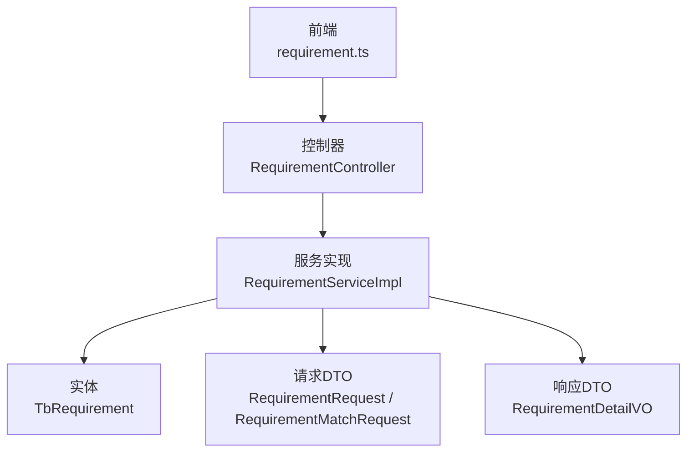
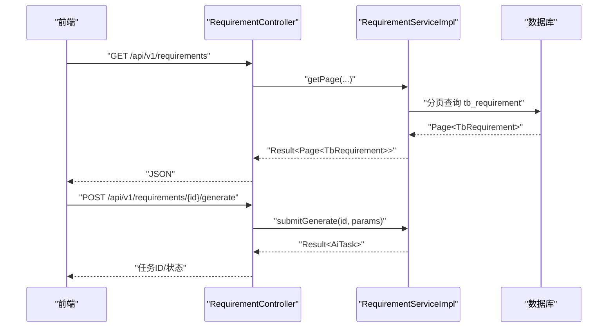
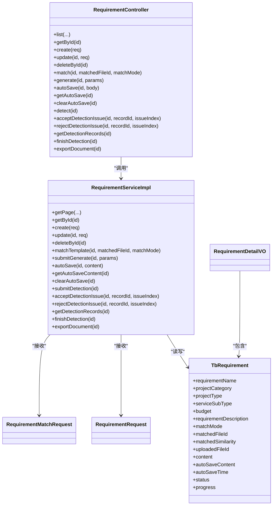

# 需求管理API

<cite>
**本文引用的文件**   
- [RequirementController.java](file://ele-ai-tender-system/ele-ai-tender-core/src/main/java/com/jy/eleaitender/core/controller/RequirementController.java)
- [RequirementServiceImpl.java](file://ele-ai-tender-system/ele-ai-tender-core/src/main/java/com/jy/eleaitender/core/service/impl/RequirementServiceImpl.java)
- [TbRequirement.java](file://ele-ai-tender-system/ele-ai-tender-common/src/main/java/com/jy/eleaitender/common/entity/core/TbRequirement.java)
- [RequirementRequest.java](file://ele-ai-tender-system/ele-ai-tender-core/src/main/java/com/jy/eleaitender/core/dto/request/RequirementRequest.java)
- [RequirementMatchRequest.java](file://ele-ai-tender-system/ele-ai-tender-core/src/main/java/com/jy/eleaitender/core/dto/request/RequirementMatchRequest.java)
- [RequirementDetailVO.java](file://ele-ai-tender-system/ele-ai-tender-core/src/main/java/com/jy/eleaitender/core/dto/response/RequirementDetailVO.java)
- [requirement.ts](file://ele-ai-tender-frontend/src/api/requirement.ts)
- [requirement.ts（类型）](file://ele-ai-tender-frontend/src/types/requirement.ts)
- [CORE_MODULE_SPEC.md](file://docs/rules/CORE_MODULE_SPEC.md)
</cite>

## 目录
1. [简介](#简介)
2. [项目结构](#项目结构)
3. [核心组件](#核心组件)
4. [架构总览](#架构总览)
5. [详细接口说明](#详细接口说明)
6. [依赖关系分析](#依赖关系分析)
7. [性能与可用性建议](#性能与可用性建议)
8. [故障排查指南](#故障排查指南)
9. [结论](#结论)
10. [附录](#附录)

## 简介
本文件为“需求管理模块”的RESTful API规范文档，覆盖需求的创建、编辑、删除、查询等基础操作，以及与项目关联、匹配模式、资质要求、评分标准、内容管理、版本对比、批量导入导出、状态流转与审批流程等相关的高级能力。所有接口路径以 /api/v1/requirements 为根路径，统一返回 Result<T> 包装结构。

## 项目结构
后端采用Spring MVC控制器+服务层+实体/DTO的分层设计；前端通过统一的API封装调用后端接口。关键文件如下：
- 控制器：定义REST端点与参数校验
- 服务实现：业务逻辑、权限校验、事务控制
- 实体/DTO：数据模型与请求/响应结构
- 前端API：对后端的HTTP调用封装与类型定义

图表来源
- [RequirementController.java:30-196](file://ele-ai-tender-system/ele-ai-tender-core/src/main/java/com/jy/eleaitender/core/controller/RequirementController.java#L30-L196)
- [RequirementServiceImpl.java:67-136](file://ele-ai-tender-system/ele-ai-tender-core/src/main/java/com/jy/eleaitender/core/service/impl/RequirementServiceImpl.java#L67-L136)
- [TbRequirement.java:1-67](file://ele-ai-tender-system/ele-ai-tender-common/src/main/java/com/jy/eleaitender/common/entity/core/TbRequirement.java#L1-L67)
- [RequirementRequest.java:1-41](file://ele-ai-tender-system/ele-ai-tender-core/src/main/java/com/jy/eleaitender/core/dto/request/RequirementRequest.java#L1-L41)
- [RequirementMatchRequest.java:1-17](file://ele-ai-tender-system/ele-ai-tender-core/src/main/java/com/jy/eleaitender/core/dto/request/RequirementMatchRequest.java#L1-L17)
- [RequirementDetailVO.java:1-15](file://ele-ai-tender-system/ele-ai-tender-core/src/main/java/com/jy/eleaitender/core/dto/response/RequirementDetailVO.java#L1-L15)
- [requirement.ts:1-80](file://ele-ai-tender-frontend/src/api/requirement.ts#L1-L80)

章节来源
- [RequirementController.java:30-196](file://ele-ai-tender-system/ele-ai-tender-core/src/main/java/com/jy/eleaitender/core/controller/RequirementController.java#L30-L196)
- [requirement.ts:1-80](file://ele-ai-tender-frontend/src/api/requirement.ts#L1-L80)

## 核心组件
- 控制器层：提供分页列表、详情、CRUD、模板匹配、AI生成、自动保存、检测、导出等能力
- 服务层：负责数据访问、权限校验（归属检查）、唯一性校验、事务控制、导出与检测流程编排
- 实体与DTO：承载需求字段、匹配模式、进度、状态、自动保存内容等

章节来源
- [RequirementController.java:30-196](file://ele-ai-tender-system/ele-ai-tender-core/src/main/java/com/jy/eleaitender/core/controller/RequirementController.java#L30-L196)
- [RequirementServiceImpl.java:67-136](file://ele-ai-tender-system/ele-ai-tender-core/src/main/java/com/jy/eleaitender/core/service/impl/RequirementServiceImpl.java#L67-L136)
- [TbRequirement.java:1-67](file://ele-ai-tender-system/ele-ai-tender-common/src/main/java/com/jy/eleaitender/common/entity/core/TbRequirement.java#L1-L67)

## 架构总览
下图展示了从前端到后端的调用链路及主要职责划分。

图表来源
- [RequirementController.java:38-50](file://ele-ai-tender-system/ele-ai-tender-core/src/main/java/com/jy/eleaitender/core/controller/RequirementController.java#L38-L50)
- [RequirementController.java:110-115](file://ele-ai-tender-system/ele-ai-tender-core/src/main/java/com/jy/eleaitender/core/controller/RequirementController.java#L110-L115)
- [RequirementServiceImpl.java:67-89](file://ele-ai-tender-system/ele-ai-tender-core/src/main/java/com/jy/eleaitender/core/service/impl/RequirementServiceImpl.java#L67-L89)

## 详细接口说明

### 通用约定
- 基础路径：/api/v1/requirements
- 认证：需登录（RequireLogin）
- 返回体：统一 Result<T> 包装
- 分页：pageNum/pageSize 默认值分别为 1/10

章节来源
- [RequirementController.java:38-50](file://ele-ai-tender-system/ele-ai-tender-core/src/main/java/com/jy/eleaitender/core/controller/RequirementController.java#L38-L50)
- [CORE_MODULE_SPEC.md:30-50](file://docs/rules/CORE_MODULE_SPEC.md#L30-L50)

### 基础操作

#### 分页查询需求列表
- 方法：GET
- 路径：/api/v1/requirements
- 查询参数：
  - pageNum: 页码（默认1）
  - pageSize: 每页条数（默认10）
  - requirementName: 模糊搜索
  - status: 状态过滤
  - projectType: 项目类型过滤
  - createTimeStart/createTimeEnd: 时间范围
- 返回：Result<Page<TbRequirement>>

章节来源
- [RequirementController.java:38-50](file://ele-ai-tender-system/ele-ai-tender-core/src/main/java/com/jy/eleaitender/core/controller/RequirementController.java#L38-L50)
- [RequirementServiceImpl.java:67-89](file://ele-ai-tender-system/ele-ai-tender-core/src/main/java/com/jy/eleaitender/core/service/impl/RequirementServiceImpl.java#L67-L89)

#### 获取需求详情
- 方法：GET
- 路径：/api/v1/requirements/{id}
- 路径参数：id
- 返回：Result<TbRequirement>
- 说明：内部进行归属校验，仅允许查看本人创建的需求

章节来源
- [RequirementController.java:70-75](file://ele-ai-tender-system/ele-ai-tender-core/src/main/java/com/jy/eleaitender/core/controller/RequirementController.java#L70-L75)
- [RequirementServiceImpl.java:91-99](file://ele-ai-tender-system/ele-ai-tender-core/src/main/java/com/jy/eleaitender/core/service/impl/RequirementServiceImpl.java#L91-L99)

#### 创建需求
- 方法：POST
- 路径：/api/v1/requirements
- 请求体：TbRequirement（或兼容的 RequirementRequest 字段集合）
- 返回：Result<TbRequirement>
- 说明：
  - 名称唯一性校验
  - 未设置状态时默认为 IN_PROGRESS
  - 未设置进度时默认为 0

章节来源
- [RequirementController.java:77-82](file://ele-ai-tender-system/ele-ai-tender-core/src/main/java/com/jy/eleaitender/core/controller/RequirementController.java#L77-L82)
- [RequirementServiceImpl.java:101-113](file://ele-ai-tender-system/ele-ai-tender-core/src/main/java/com/jy/eleaitender/core/service/impl/RequirementServiceImpl.java#L101-L113)
- [RequirementRequest.java:1-41](file://ele-ai-tender-system/ele-ai-tender-core/src/main/java/com/jy/eleaitender/core/dto/request/RequirementRequest.java#L1-L41)

#### 更新需求
- 方法：PUT
- 路径：/api/v1/requirements/{id}
- 路径参数：id
- 请求体：TbRequirement（或兼容的 RequirementRequest 字段集合）
- 返回：Result<Void>
- 说明：
  - 名称唯一性校验（排除自身）
  - 正式保存后清除自动保存内容与时间

章节来源
- [RequirementController.java:84-90](file://ele-ai-tender-system/ele-ai-tender-core/src/main/java/com/jy/eleaitender/core/controller/RequirementController.java#L84-L90)
- [RequirementServiceImpl.java:115-125](file://ele-ai-tender-system/ele-ai-tender-core/src/main/java/com/jy/eleaitender/core/service/impl/RequirementServiceImpl.java#L115-L125)

#### 删除需求
- 方法：DELETE
- 路径：/api/v1/requirements/{id}
- 路径参数：id
- 返回：Result<Void>

章节来源
- [RequirementController.java:92-98](file://ele-ai-tender-system/ele-ai-tender-core/src/main/java/com/jy/eleaitender/core/controller/RequirementController.java#L92-L98)
- [RequirementServiceImpl.java:127-132](file://ele-ai-tender-system/ele-ai-tender-core/src/main/java/com/jy/eleaitender/core/service/impl/RequirementServiceImpl.java#L127-L132)

### 项目关联与匹配模式

#### 获取匹配文件列表
- 方法：GET
- 路径：/api/v1/requirements/match-files
- 查询参数：
  - requirementId: 可选，按需求筛选
  - keyword: 可选，关键词检索
- 返回：Result<List<MatchFileVO>>

章节来源
- [RequirementController.java:52-59](file://ele-ai-tender-system/ele-ai-tender-core/src/main/java/com/jy/eleaitender/core/controller/RequirementController.java#L52-L59)

#### 匹配历史模板
- 方法：POST
- 路径：/api/v1/requirements/{id}/match
- 路径参数：id
- 查询参数：
  - matchedFileId: 匹配的历史文件ID
  - matchMode: 匹配模式（如 MANUAL_SELECT/SYSTEM_SELECT/AUTO_MATCH），默认 MANUAL_SELECT
- 返回：Result<TbRequirement>
- 说明：根据匹配模式与选择文件回填需求信息

章节来源
- [RequirementController.java:100-108](file://ele-ai-tender-system/ele-ai-tender-core/src/main/java/com/jy/eleaitender/core/controller/RequirementController.java#L100-L108)
- [RequirementMatchRequest.java:1-17](file://ele-ai-tender-system/ele-ai-tender-core/src/main/java/com/jy/eleaitender/core/dto/request/RequirementMatchRequest.java#L1-L17)

### 内容管理与草稿

#### 自动保存草稿
- 方法：POST
- 路径：/api/v1/requirements/{id}/auto-save
- 路径参数：id
- 请求体：{ content: string }
- 返回：Result<Void>

章节来源
- [RequirementController.java:117-123](file://ele-ai-tender-system/ele-ai-tender-core/src/main/java/com/jy/eleaitender/core/controller/RequirementController.java#L117-L123)

#### 获取自动保存内容
- 方法：GET
- 路径：/api/v1/requirements/{id}/auto-save
- 路径参数：id
- 返回：Result<String | null>

章节来源
- [RequirementController.java:125-130](file://ele-ai-tender-system/ele-ai-tender-core/src/main/java/com/jy/eleaitender/core/controller/RequirementController.java#L125-L130)

#### 清除自动保存内容
- 方法：DELETE
- 路径：/api/v1/requirements/{id}/auto-save
- 路径参数：id
- 返回：Result<Void>

章节来源
- [RequirementController.java:132-138](file://ele-ai-tender-system/ele-ai-tender-core/src/main/java/com/jy/eleaitender/core/controller/RequirementController.java#L132-L138)

### AI生成与检测

#### 提交AI生成需求任务
- 方法：POST
- 路径：/api/v1/requirements/{id}/generate
- 路径参数：id
- 请求体：Map<String, Object>（扩展参数由上层定义）
- 返回：Result<AiTask>

章节来源
- [RequirementController.java:110-115](file://ele-ai-tender-system/ele-ai-tender-core/src/main/java/com/jy/eleaitender/core/controller/RequirementController.java#L110-L115)

#### 提交需求检测（敏感词+错别字）
- 方法：POST
- 路径：/api/v1/requirements/{id}/detect
- 路径参数：id
- 返回：Result<Map<String, Long>>（记录ID映射）

章节来源
- [RequirementController.java:140-145](file://ele-ai-tender-system/ele-ai-tender-core/src/main/java/com/jy/eleaitender/core/controller/RequirementController.java#L140-L145)

#### 接受需求检测建议（自动修正内容）
- 方法：POST
- 路径：/api/v1/requirements/{id}/detect/{recordId}/accept
- 路径参数：id, recordId
- 查询参数：issueIndex（问题索引）
- 返回：Result<Void>

章节来源
- [RequirementController.java:147-155](file://ele-ai-tender-system/ele-ai-tender-core/src/main/java/com/jy/eleaitender/core/controller/RequirementController.java#L147-L155)

#### 拒绝需求检测建议
- 方法：POST
- 路径：/api/v1/requirements/{id}/detect/{recordId}/reject
- 路径参数：id, recordId
- 查询参数：issueIndex（问题索引）
- 返回：Result<Void>

章节来源
- [RequirementController.java:157-165](file://ele-ai-tender-system/ele-ai-tender-core/src/main/java/com/jy/eleaitender/core/controller/RequirementController.java#L157-L165)

#### 获取需求检测记录列表
- 方法：GET
- 路径：/api/v1/requirements/{id}/detect/records
- 路径参数：id
- 返回：Result<List<TbDetectionRecord>>

章节来源
- [RequirementController.java:167-172](file://ele-ai-tender-system/ele-ai-tender-core/src/main/java/com/jy/eleaitender/core/controller/RequirementController.java#L167-L172)

#### 完成需求检测
- 方法：POST
- 路径：/api/v1/requirements/{id}/detect/finish
- 路径参数：id
- 返回：Result<Void>

章节来源
- [RequirementController.java:174-180](file://ele-ai-tender-system/ele-ai-tender-core/src/main/java/com/jy/eleaitender/core/controller/RequirementController.java#L174-L180)

### 导出与预览

#### 导出需求文档
- 方法：GET
- 路径：/api/v1/requirements/{id}/export
- 路径参数：id
- 返回：Word文档流（application/vnd.openxmlformats-officedocument.wordprocessingml.document）
- 文件名：需求名称.docx（UTF-8编码）

章节来源
- [RequirementController.java:182-194](file://ele-ai-tender-system/ele-ai-tender-core/src/main/java/com/jy/eleaitender/core/controller/RequirementController.java#L182-L194)

### 高级功能与复杂场景

#### 需求名称唯一性校验
- 方法：GET
- 路径：/api/v1/requirements/check-name
- 查询参数：
  - requirementName: 需求名称
  - excludeId: 可选，排除当前ID（用于编辑时去重）
- 返回：Result<Boolean>

章节来源
- [RequirementController.java:61-68](file://ele-ai-tender-system/ele-ai-tender-core/src/main/java/com/jy/eleaitender/core/controller/RequirementController.java#L61-L68)

#### 匹配模式与资质要求配置
- 匹配模式：
  - AUTO_MATCH：系统自动匹配
  - MANUAL_SELECT：手动选择
  - SYSTEM_SELECT：系统匹配用户选择
  - UPLOAD：本地上传
- 资质要求：
  - 前端类型中支持 qualifications 数组字段，可在编辑时传入
  - 服务端实体未直接暴露该字段，可通过扩展字段或关联表维护

章节来源
- [requirement.ts（类型）:12-20](file://ele-ai-tender-frontend/src/types/requirement.ts#L12-L20)
- [requirement.ts（类型）:68-78](file://ele-ai-tender-frontend/src/types/requirement.ts#L68-L78)
- [TbRequirement.java:40-47](file://ele-ai-tender-system/ele-ai-tender-common/src/main/java/com/jy/eleaitender/common/entity/core/TbRequirement.java#L40-L47)

#### 评分标准设置
- 说明：评分标准通常与模板/规则相关，可结合模板匹配结果与模板中的评分配置使用
- 参考：需求详情响应包含匹配的模板对象（RequirementDetailVO）

章节来源
- [RequirementDetailVO.java:1-15](file://ele-ai-tender-system/ele-ai-tender-core/src/main/java/com/jy/eleaitender/core/dto/response/RequirementDetailVO.java#L1-L15)

#### 版本对比
- 说明：版本对比通常基于历史模板/文档差异展示，可结合匹配文件与模板内容进行比对
- 参考：匹配文件列表与模板匹配接口可用于获取对比源

章节来源
- [RequirementController.java:52-59](file://ele-ai-tender-system/ele-ai-tender-core/src/main/java/com/jy/eleaitender/core/controller/RequirementController.java#L52-L59)
- [RequirementController.java:100-108](file://ele-ai-tender-system/ele-ai-tender-core/src/main/java/com/jy/eleaitender/core/controller/RequirementController.java#L100-L108)

#### 批量导入导出
- 导出：已提供单条需求导出接口
- 批量导入：当前仓库未发现批量导入需求的具体接口实现，可按现有导出格式扩展批量导入接口

章节来源
- [RequirementController.java:182-194](file://ele-ai-tender-system/ele-ai-tender-core/src/main/java/com/jy/eleaitender/core/controller/RequirementController.java#L182-L194)

### 状态流转与审批流程

#### 需求状态
- 字段：status
- 常见值：IN_PROGRESS、COMPLETED
- 行为：
  - 创建时若未设置状态，默认 IN_PROGRESS
  - 完成检测后可推进至 COMPLETED（具体推进逻辑在服务层或工作流中实现）

章节来源
- [TbRequirement.java:61-65](file://ele-ai-tender-system/ele-ai-tender-common/src/main/java/com/jy/eleaitender/common/entity/core/TbRequirement.java#L61-L65)
- [RequirementServiceImpl.java:101-113](file://ele-ai-tender-system/ele-ai-tender-core/src/main/java/com/jy/eleaitender/core/service/impl/RequirementServiceImpl.java#L101-L113)

#### 项目阶段触发器（与需求生成联动）
- 说明：进入“需求生成”阶段时，可自动创建需求并触发AI生成任务
- 参考：PhaseTrigger 的实现类 RequirementTrigger

章节来源
- [RequirementTrigger.java:1-39](file://ele-ai-tender-system/ele-ai-tender-core/src/main/java/com/jy/eleaitender/core/statemachine/trigger/RequirementTrigger.java#L1-L39)

## 依赖关系分析

图表来源
- [RequirementController.java:30-196](file://ele-ai-tender-system/ele-ai-tender-core/src/main/java/com/jy/eleaitender/core/controller/RequirementController.java#L30-L196)
- [RequirementServiceImpl.java:67-136](file://ele-ai-tender-system/ele-ai-tender-core/src/main/java/com/jy/eleaitender/core/service/impl/RequirementServiceImpl.java#L67-L136)
- [TbRequirement.java:1-67](file://ele-ai-tender-system/ele-ai-tender-common/src/main/java/com/jy/eleaitender/common/entity/core/TbRequirement.java#L1-L67)
- [RequirementRequest.java:1-41](file://ele-ai-tender-system/ele-ai-tender-core/src/main/java/com/jy/eleaitender/core/dto/request/RequirementRequest.java#L1-L41)
- [RequirementMatchRequest.java:1-17](file://ele-ai-tender-system/ele-ai-tender-core/src/main/java/com/jy/eleaitender/core/dto/request/RequirementMatchRequest.java#L1-L17)
- [RequirementDetailVO.java:1-15](file://ele-ai-tender-system/ele-ai-tender-core/src/main/java/com/jy/eleaitender/core/dto/response/RequirementDetailVO.java#L1-L15)

章节来源
- [RequirementController.java:30-196](file://ele-ai-tender-system/ele-ai-tender-core/src/main/java/com/jy/eleaitender/core/controller/RequirementController.java#L30-L196)
- [RequirementServiceImpl.java:67-136](file://ele-ai-tender-system/ele-ai-tender-core/src/main/java/com/jy/eleaitender/core/service/impl/RequirementServiceImpl.java#L67-L136)

## 性能与可用性建议
- 分页查询：合理设置 pageSize，避免一次性加载过多数据
- 导出：大文档导出建议使用异步任务+下载链接方式，避免长连接阻塞
- 自动保存：高频保存建议在前端做节流与合并策略，减少无效写入
- 检测：检测任务可异步化，返回任务ID供前端轮询或回调

[本节为通用建议，不直接分析具体文件]

## 故障排查指南
- 名称重复：创建/更新前调用 check-name 接口进行预校验
- 无权限访问：详情接口会进行归属校验，确认当前用户是否为创建人
- 自动保存未生效：确认 auto-save 请求体字段名为 content，且成功返回
- 导出失败：检查需求是否存在、内容是否完整、文件名编码是否正确

章节来源
- [RequirementController.java:61-68](file://ele-ai-tender-system/ele-ai-tender-core/src/main/java/com/jy/eleaitender/core/controller/RequirementController.java#L61-L68)
- [RequirementServiceImpl.java:91-99](file://ele-ai-tender-system/ele-ai-tender-core/src/main/java/com/jy/eleaitender/core/service/impl/RequirementServiceImpl.java#L91-L99)
- [RequirementController.java:117-138](file://ele-ai-tender-system/ele-ai-tender-core/src/main/java/com/jy/eleaitender/core/controller/RequirementController.java#L117-L138)
- [RequirementController.java:182-194](file://ele-ai-tender-system/ele-ai-tender-core/src/main/java/com/jy/eleaitender/core/controller/RequirementController.java#L182-L194)

## 结论
需求管理模块提供了完整的CRUD、匹配模式、内容草稿、AI生成、检测与导出等能力，并通过统一的状态与进度字段支撑业务流程。建议在后续迭代中补充批量导入导出、更细粒度的权限控制与更丰富的状态机流转。

[本节为总结，不直接分析具体文件]

## 附录

### 前端API封装对照
- 列表：getList(params) -> GET /core-api/v1/requirements
- 详情：getById(id) -> GET /core-api/v1/requirements/{id}
- 创建：create(data) -> POST /core-api/v1/requirements
- 更新：update(id, data) -> PUT /core-api/v1/requirements/{id}
- 删除：deleteById(id) -> DELETE /core-api/v1/requirements/{id}
- 匹配：match(id, data) -> POST /core-api/v1/requirements/{id}/match
- 匹配文件：getMatchFiles(params) -> GET /core-api/v1/requirements/match-files
- 预览匹配文件：previewMatchFile(fileId) -> GET /core-api/v1/requirements/match-files/{fileId}/preview
- 导出：exportDocument(id) -> GET /core-api/v1/requirements/{id}/export
- AI生成：generate(id, params) -> POST /core-api/v1/requirements/{id}/generate
- 自动保存：autoSave/getAutoSave/clearAutoSave
- 检测：detect/acceptDetection/rejectDetection/getDetectionRecords/finishDetection
- 名称校验：checkName(requirementName, excludeId)

章节来源
- [requirement.ts:1-80](file://ele-ai-tender-frontend/src/api/requirement.ts#L1-L80)
- [CORE_MODULE_SPEC.md:30-50](file://docs/rules/CORE_MODULE_SPEC.md#L30-L50)