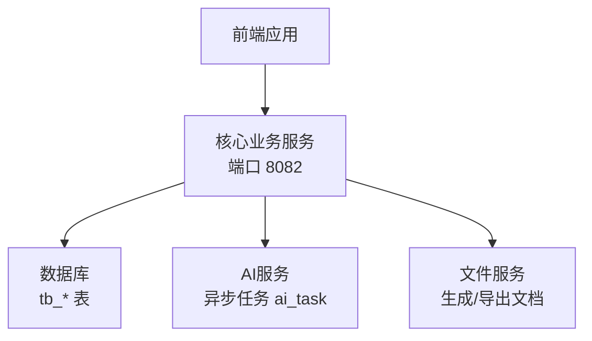
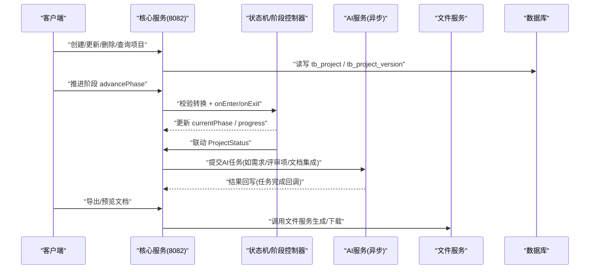
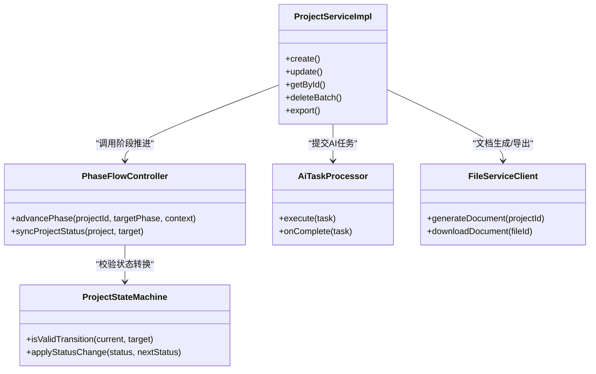

# 项目管理API

<cite>
**本文引用的文件**   
- [CORE_MODULE_SPEC.md](file://docs/rules/CORE_MODULE_SPEC.md)
- [PHASE_FLOW_SPEC.md](file://docs/rules/PHASE_FLOW_SPEC.md)
- [PROJECT_SPEC_FINAL.md](file://docs/rules/PROJECT_SPEC_FINAL.md)
</cite>

## 目录
1. [简介](#简介)
2. [项目结构](#项目结构)
3. [核心组件](#核心组件)
4. [架构总览](#架构总览)
5. [详细接口说明](#详细接口说明)
6. [依赖分析](#依赖分析)
7. [性能考虑](#性能考虑)
8. [故障排查指南](#故障排查指南)
9. [结论](#结论)
10. [附录](#附录)

## 简介
本文件为“项目管理模块”的API接口文档，聚焦于核心业务模块（ele-ai-tender-core）中项目的CRUD、状态管理、版本控制、流程阶段推进等能力。文档基于仓库内规范文件整理，面向前后端开发者与集成方，提供HTTP方法、URL路径、请求参数格式、响应数据结构、分页与筛选、权限与安全、数据校验规则以及调用示例说明。

## 项目结构
- 核心业务模块端口：8082
- 接口前缀：/api/v1
- 项目管理相关接口前缀：/api/v1/projects

图表来源
- [CORE_MODULE_SPEC.md:1-358](file://docs/rules/CORE_MODULE_SPEC.md#L1-L358)

章节来源
- [PROJECT_SPEC_FINAL.md:1-91](file://docs/rules/PROJECT_SPEC_FINAL.md#L1-L91)
- [CORE_MODULE_SPEC.md:1-358](file://docs/rules/CORE_MODULE_SPEC.md#L1-L358)

## 核心组件
- 项目管理控制器与服务：负责项目生命周期编排、阶段推进、状态联动、版本快照、导出等
- 阶段流程控制器：统一处理阶段转换、触发器执行、状态同步
- 状态机：定义合法的状态流转规则
- 版本控制：记录关键节点的内容快照
- 检测与文档集成：通过AI任务异步驱动

章节来源
- [CORE_MODULE_SPEC.md:1-358](file://docs/rules/CORE_MODULE_SPEC.md#L1-L358)
- [PHASE_FLOW_SPEC.md:1-206](file://docs/rules/PHASE_FLOW_SPEC.md#L1-L206)

## 架构总览
项目管理的整体交互由前端发起，核心服务进行业务编排，并通过AI任务与文件服务协作完成内容生成与文档导出。

图表来源
- [CORE_MODULE_SPEC.md:1-358](file://docs/rules/CORE_MODULE_SPEC.md#L1-L358)
- [PHASE_FLOW_SPEC.md:1-206](file://docs/rules/PHASE_FLOW_SPEC.md#L1-L206)

## 详细接口说明

### 通用约定
- 基础路径：/api/v1
- 认证方式：JWT（详见系统安全规范）
- 统一响应体：包含 code、message、data 字段；分页返回 data.records 与 data.total
- 错误码：遵循全局异常处理器与业务异常码规范

章节来源
- [PROJECT_SPEC_FINAL.md:1-91](file://docs/rules/PROJECT_SPEC_FINAL.md#L1-L91)
- [CORE_MODULE_SPEC.md:1-358](file://docs/rules/CORE_MODULE_SPEC.md#L1-L358)

### 项目列表与详情
- GET /api/v1/projects
  - 功能：分页查询项目列表
  - 查询参数：
    - page: 页码（默认1）
    - size: 每页条数（默认20）
    - keyword: 名称/编号模糊匹配
    - status: 状态过滤（DRAFT/IN_PROGRESS/PENDING_DETECTION/DETECTING/DETECTION_PASSED/DETECTION_FAILED/DETECTION_SKIPPED/PUBLISHED/ARCHIVED/CANCELLED）
    - current_phase: 阶段过滤（1~5）
    - project_category: 项目类别
    - project_type: 项目类型
    - service_sub_type: 服务子类
    - sort_by: 排序字段（如 create_time）
    - order: 排序方向（asc/desc）
  - 响应：分页对象 { records: [], total }
- GET /api/v1/projects/{id}
  - 功能：获取项目详情
  - 路径参数：id（数字）
  - 响应：项目实体（含 current_phase、progress、status、requirement_id、requirement_content、generated_file_id 等）

章节来源
- [CORE_MODULE_SPEC.md:1-358](file://docs/rules/CORE_MODULE_SPEC.md#L1-L358)

### 项目创建与更新
- POST /api/v1/projects
  - 功能：创建项目
  - 请求体关键字段：
    - projectCode: 项目编号（必填，唯一性校验，含已删除记录）
    - projectName: 项目名称（必填）
    - projectCategory: 项目类别（必填）
    - projectType: 项目类型（必填）
    - reviewType: 评审方式（必填，默认MANUAL）
    - budget: 预算（可选，前端建议必填）
    - requirementId: 引入已有需求ID（可选）
    - templateId: 模板ID（可选）
  - 校验规则：
    - 编号唯一性：后端使用全表计数（含逻辑删除），并发插入冲突时转为友好业务异常
    - 评审方式：≥500万或工程/货物类推荐人工评审
- PUT /api/v1/projects/{id}
  - 功能：更新项目
  - 路径参数：id（数字）
  - 请求体：可更新的字段集合（如名称、类别、类型、预算、模板等）
  - 注意：更新不改变当前阶段与状态，需通过专用接口推进阶段或变更状态

章节来源
- [CORE_MODULE_SPEC.md:1-358](file://docs/rules/CORE_MODULE_SPEC.md#L1-L358)

### 项目删除
- DELETE /api/v1/projects
  - 功能：批量删除项目
  - 请求体：ids（数组，至少一个）
  - 行为：逻辑删除，受唯一索引影响（删除后仍可复用编号）

章节来源
- [CORE_MODULE_SPEC.md:1-358](file://docs/rules/CORE_MODULE_SPEC.md#L1-L358)

### 项目阶段信息
- GET /api/v1/projects/{id}/phase
  - 功能：获取项目当前阶段信息与进度
  - 路径参数：id（数字）
  - 响应：包含 currentPhase、progress、canAdvance、nextPhase 等

章节来源
- [CORE_MODULE_SPEC.md:1-358](file://docs/rules/CORE_MODULE_SPEC.md#L1-L358)

### 项目阶段推进
- PUT /api/v1/projects/{id}/phase
  - 功能：推进项目阶段
  - 路径参数：id（数字）
  - 请求体：
    - targetPhase: 目标阶段编码（仅允许下一阶段）
    - context: 上下文（可选，当前 DETECTION 阶段使用 policyFileIds）
  - 流程要点：
    - 仅能顺序推进到下一阶段，不允许跳跃或倒退
    - 进入新阶段时执行对应触发器的 onEnter（可能触发AI任务）
    - 离开旧阶段时执行 onExit
    - 自动联动 ProjectStatus（如进入编制阶段→IN_PROGRESS，进入检测阶段→DETECTING）
  - 典型调用：
    - BASIC_INFO → REQUIREMENT：targetPhase=2
    - REQUIREMENT → REVIEW_ITEM：targetPhase=3
    - REVIEW_ITEM → DOCUMENT：targetPhase=4
    - DOCUMENT → DETECTION：targetPhase=5, context={policyFileIds:[...]}

章节来源
- [PHASE_FLOW_SPEC.md:1-206](file://docs/rules/PHASE_FLOW_SPEC.md#L1-L206)
- [CORE_MODULE_SPEC.md:1-358](file://docs/rules/CORE_MODULE_SPEC.md#L1-L358)

### 项目状态变更
- PUT /api/v1/projects/{id}/status
  - 功能：变更项目状态
  - 路径参数：id（数字）
  - 请求体：newStatus（枚举值）
  - 约束：必须在Service层校验合法流转，禁止跳过中间状态
  - 常用流转：
    - DRAFT → IN_PROGRESS
    - IN_PROGRESS → PENDING_DETECTION
    - PENDING_DETECTION → DETECTING（由 DetectionService.submit 处理）
    - DETECTING → DETECTION_PASSED / DETECTION_FAILED / DETECTION_SKIPPED
    - DETECTION_PASSED / DETECTION_SKIPPED → PUBLISHED
    - PUBLISHED → ARCHIVED / CANCELLED

章节来源
- [CORE_MODULE_SPEC.md:1-358](file://docs/rules/CORE_MODULE_SPEC.md#L1-L358)

### 项目操作（取消/发布/归档）
- POST /api/v1/projects/{id}/cancel
  - 功能：取消项目
  - 路径参数：id（数字）
  - 行为：将状态置为 CANCELLED（需满足前置状态约束）
- POST /api/v1/projects/{id}/publish
  - 功能：发布项目
  - 路径参数：id（数字）
  - 行为：在检测通过或跳过的前提下，将状态置为 PUBLISHED
- POST /api/v1/projects/{id}/archive
  - 功能：归档项目
  - 路径参数：id（数字）
  - 行为：将状态置为 ARCHIVED

章节来源
- [CORE_MODULE_SPEC.md:1-358](file://docs/rules/CORE_MODULE_SPEC.md#L1-L358)

### 需求生成（AI）
- POST /api/v1/projects/{id}/requirement-generate
  - 功能：提交AI生成需求任务
  - 路径参数：id（数字）
  - 行为：写入AI任务并异步执行，完成后由同步处理器回写至 project.requirementContent

章节来源
- [CORE_MODULE_SPEC.md:1-358](file://docs/rules/CORE_MODULE_SPEC.md#L1-L358)

### 版本历史
- GET /api/v1/projects/{id}/versions
  - 功能：获取项目版本历史
  - 路径参数：id（数字）
  - 响应：版本列表（version_no、content_snapshot、change_description、create_time 等）

章节来源
- [CORE_MODULE_SPEC.md:1-358](file://docs/rules/CORE_MODULE_SPEC.md#L1-L358)

### 导出招标文件
- POST /api/v1/projects/{id}/export
  - 功能：导出项目招标文件
  - 路径参数：id（数字）
  - 行为：调用文件服务生成Word文档并返回下载链接或流

章节来源
- [CORE_MODULE_SPEC.md:1-358](file://docs/rules/CORE_MODULE_SPEC.md#L1-L358)

### 高级查询与筛选
- 分页：page、size
- 条件筛选：keyword、status、current_phase、project_category、project_type、service_sub_type
- 排序：sort_by、order
- 名称唯一性校验：创建时 projectCode 唯一（含已删除记录），并发冲突会返回友好业务异常

章节来源
- [CORE_MODULE_SPEC.md:1-358](file://docs/rules/CORE_MODULE_SPEC.md#L1-L358)

### 权限控制与数据验证
- 权限控制：所有接口需携带有效JWT令牌；具体角色/菜单权限由支撑中心统一管理
- 数据验证：
  - 必填字段校验（如 projectCode、projectName、projectCategory、projectType、reviewType）
  - 数值范围与格式校验（如 budget）
  - 业务规则校验（如评审方式推荐、编号唯一性、状态流转合法性）
- 并发安全：插入时捕获唯一索引冲突并转换为业务异常

章节来源
- [PROJECT_SPEC_FINAL.md:1-91](file://docs/rules/PROJECT_SPEC_FINAL.md#L1-L91)
- [CORE_MODULE_SPEC.md:1-358](file://docs/rules/CORE_MODULE_SPEC.md#L1-L358)

### 调用示例（文本描述）
- 创建项目
  - 方法：POST
  - 路径：/api/v1/projects
  - 请求体：{ projectCode:"P20250001", projectName:"某招标项目", projectCategory:"GOVERNMENT_PROCUREMENT", projectType:"SERVICE", reviewType:"MANUAL", budget:10000000 }
  - 预期：返回新建项目详情
- 推进阶段（从需求到评审项）
  - 方法：PUT
  - 路径：/api/v1/projects/{id}/phase
  - 请求体：{ targetPhase:3 }
  - 预期：currentPhase 更新为3，若需要则触发评审项生成AI任务
- 推进阶段（从文档到检测）
  - 方法：PUT
  - 路径：/api/v1/projects/{id}/phase
  - 请求体：{ targetPhase:5, context:{ policyFileIds:[1,2] } }
  - 预期：进入检测阶段，自动提交智能检测，状态变更为 DETECTING
- 发布项目
  - 方法：POST
  - 路径：/api/v1/projects/{id}/publish
  - 预期：状态变更为 PUBLISHED（需满足前置条件）

章节来源
- [PHASE_FLOW_SPEC.md:1-206](file://docs/rules/PHASE_FLOW_SPEC.md#L1-L206)
- [CORE_MODULE_SPEC.md:1-358](file://docs/rules/CORE_MODULE_SPEC.md#L1-L358)

## 依赖分析
- 核心服务依赖：
  - 数据库：tb_project、tb_project_version、tb_requirement、tb_detection_record、tb_project_review_item 等
  - AI服务：通过 ai_task 表异步解耦，核心服务写入任务，AI服务执行并回写结果
  - 文件服务：用于文档集成与导出
- 阶段与状态联动：
  - PhaseFlowController 负责阶段转换与触发器执行
  - ProjectStateMachine 定义合法状态转换规则
  - syncProjectStatus 保证 Phase 与 Status 的一致性

图表来源
- [PHASE_FLOW_SPEC.md:1-206](file://docs/rules/PHASE_FLOW_SPEC.md#L1-L206)
- [CORE_MODULE_SPEC.md:1-358](file://docs/rules/CORE_MODULE_SPEC.md#L1-L358)

章节来源
- [PHASE_FLOW_SPEC.md:1-206](file://docs/rules/PHASE_FLOW_SPEC.md#L1-L206)
- [CORE_MODULE_SPEC.md:1-358](file://docs/rules/CORE_MODULE_SPEC.md#L1-L358)

## 性能考虑
- 分页与筛选：合理设置 page/size，避免一次性加载过多数据
- 异步任务：AI生成与文档集成采用异步模式，减少前端等待时间
- 缓存策略：模型配置与Token用量统计使用Redis缓存，降低重复查询开销
- 导出优化：大文档导出建议使用异步任务+通知机制

[本节为通用指导，无需代码引用]

## 故障排查指南
- 阶段推进失败
  - 检查是否顺序推进到下一阶段
  - 查看 canComplete 校验是否通过
- 需求阶段内容为空
  - 确认 requirementId 是否存在且 content 非空
  - 若无关联需求，检查 PROJECT_REQUIREMENT_GENERATE 任务状态
- 状态与阶段不一致
  - 查看 syncProjectStatus 日志，确认联动逻辑是否执行
- 检测重试后状态不对
  - 确保通过状态机进行 retry，而非直接设值
- 循环依赖报错
  - 检查触发器注入是否使用 @Lazy

章节来源
- [PHASE_FLOW_SPEC.md:1-206](file://docs/rules/PHASE_FLOW_SPEC.md#L1-L206)
- [CORE_MODULE_SPEC.md:1-358](file://docs/rules/CORE_MODULE_SPEC.md#L1-L358)

## 结论
本项目管理API围绕“项目生命周期”展开，涵盖创建、更新、删除、查询、阶段推进、状态变更、版本管理与导出等核心能力。通过阶段控制器与状态机的协同，保证了流程的严谨性与一致性；借助AI与文件服务的异步协作，提升了用户体验与系统可扩展性。建议在集成时严格遵循校验规则与状态流转约束，并结合分页与筛选提升查询效率。

[本节为总结，无需代码引用]

## 附录
- 术语
  - 项目状态：DRAFT、IN_PROGRESS、PENDING_DETECTION、DETECTING、DETECTION_PASSED、DETECTION_FAILED、DETECTION_SKIPPED、PUBLISHED、ARCHIVED、CANCELLED
  - 编制阶段：BASIC_INFO(1)、REQUIREMENT(2)、REVIEW_ITEM(3)、DOCUMENT(4)、DETECTION(5)
- 参考规范
  - 核心业务模块规范：/docs/rules/CORE_MODULE_SPEC.md
  - 阶段流程控制器规范：/docs/rules/PHASE_FLOW_SPEC.md
  - 项目级全局约束：/docs/rules/PROJECT_SPEC_FINAL.md

章节来源
- [CORE_MODULE_SPEC.md:1-358](file://docs/rules/CORE_MODULE_SPEC.md#L1-L358)
- [PHASE_FLOW_SPEC.md:1-206](file://docs/rules/PHASE_FLOW_SPEC.md#L1-L206)
- [PROJECT_SPEC_FINAL.md:1-91](file://docs/rules/PROJECT_SPEC_FINAL.md#L1-L91)