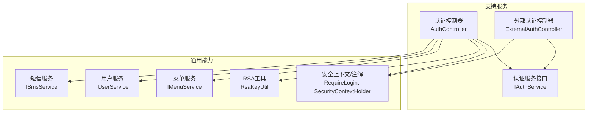
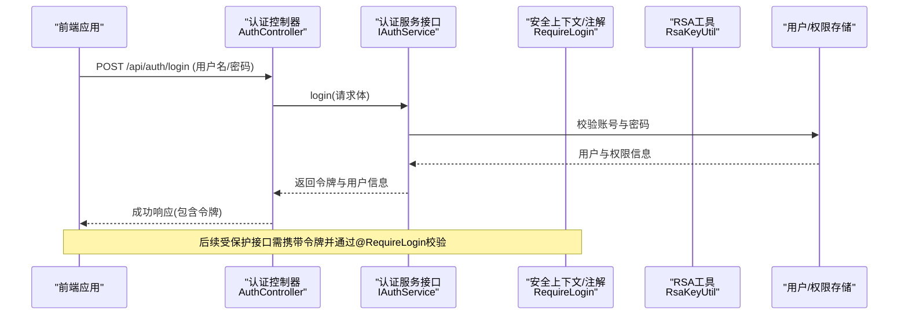
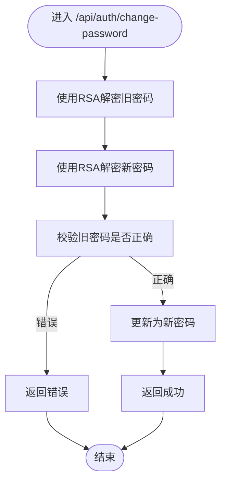
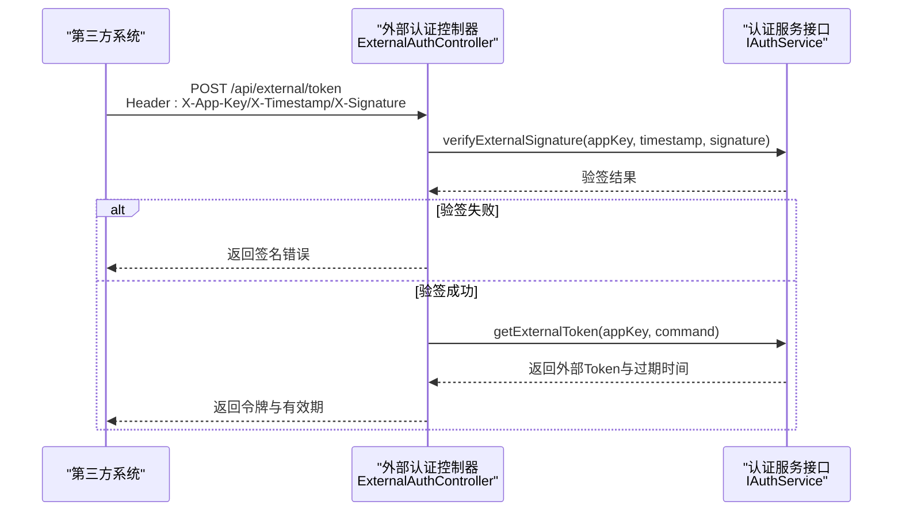
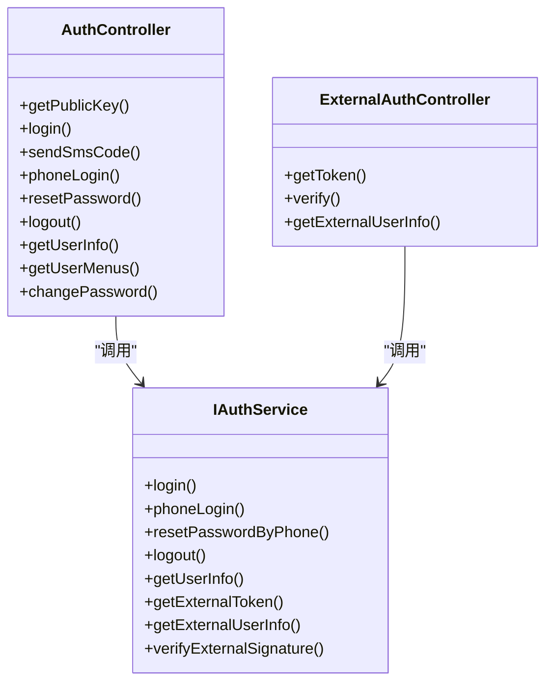
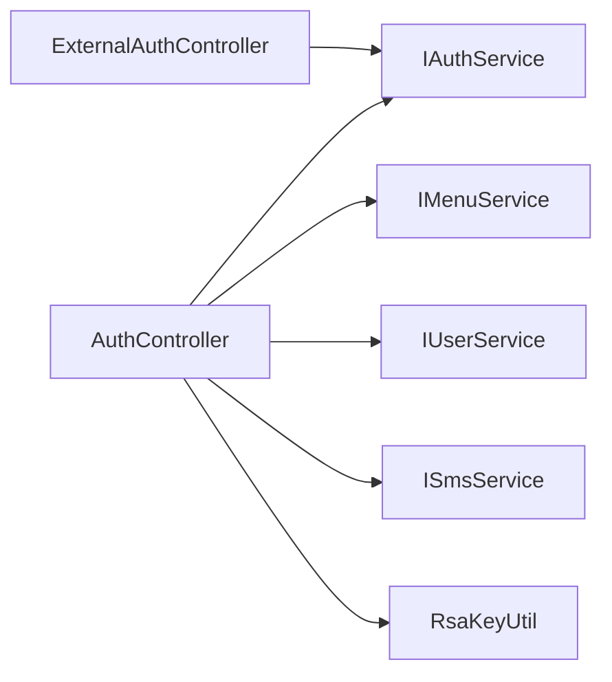

# 认证授权API

<cite>
**本文引用的文件**   
- [AuthController.java](file://ele-ai-tender-system/ele-ai-tender-support/src/main/java/com/jy/eleaitender/support/controller/AuthController.java)
- [ExternalAuthController.java](file://ele-ai-tender-system/ele-ai-tender-support/src/main/java/com/jy/eleaitender/support/controller/ExternalAuthController.java)
- [IAuthService.java](file://ele-ai-tender-system/ele-ai-tender-support/src/main/java/com/jy/eleaitender/support/service/IAuthService.java)
</cite>

## 目录
1. [简介](#简介)
2. [项目结构](#项目结构)
3. [核心组件](#核心组件)
4. [架构总览](#架构总览)
5. [详细组件分析](#详细组件分析)
6. [依赖关系分析](#依赖关系分析)
7. [性能与安全考虑](#性能与安全考虑)
8. [故障排查指南](#故障排查指南)
9. [结论](#结论)
10. [附录：接口清单与规范](#附录接口清单与规范)

## 简介
本文件为“认证授权模块”的完整API文档，覆盖内部用户登录、注册（通过短信验证码流程）、密码重置、权限验证等安全相关接口；说明JWT令牌管理机制、会话管理与身份验证流程；提供RBAC权限模型的接口设计（角色管理、菜单权限、数据权限控制）；并给出第三方系统集成的外部认证接口与签名验证机制。同时总结安全防护措施、防暴力破解、敏感信息加密等最佳实践。

## 项目结构
认证授权能力集中在支持服务模块中，对外暴露两类控制器：
- 内部认证控制器：面向前端用户与管理后台
- 外部认证控制器：面向第三方系统集成

图表来源
- [AuthController.java:1-129](file://ele-ai-tender-system/ele-ai-tender-support/src/main/java/com/jy/eleaitender/support/controller/AuthController.java#L1-L129)
- [ExternalAuthController.java:1-108](file://ele-ai-tender-system/ele-ai-tender-support/src/main/java/com/jy/eleaitender/support/controller/ExternalAuthController.java#L1-L108)
- [IAuthService.java:1-77](file://ele-ai-tender-system/ele-ai-tender-support/src/main/java/com/jy/eleaitender/support/service/IAuthService.java#L1-L77)

章节来源
- [AuthController.java:1-129](file://ele-ai-tender-system/ele-ai-tender-support/src/main/java/com/jy/eleaitender/support/controller/AuthController.java#L1-L129)
- [ExternalAuthController.java:1-108](file://ele-ai-tender-system/ele-ai-tender-support/src/main/java/com/jy/eleaitender/support/controller/ExternalAuthController.java#L1-L108)
- [IAuthService.java:1-77](file://ele-ai-tender-system/ele-ai-tender-support/src/main/java/com/jy/eleaitender/support/service/IAuthService.java#L1-L77)

## 核心组件
- 认证控制器 AuthController
  - 负责内部用户的登录、手机验证码登录、发送验证码、重置密码、登出、获取当前用户信息与菜单、修改密码等。
- 外部认证控制器 ExternalAuthController
  - 负责第三方系统基于 appKey/appSecret 的签名校验换取Token、验签辅助接口、以及已登录外部用户信息的查询。
- 认证服务接口 IAuthService
  - 定义认证领域能力：内部登录、手机验证码登录、短信重置密码、登出、用户信息、外部Token签发、外部用户信息、外部签名校验。

章节来源
- [AuthController.java:1-129](file://ele-ai-tender-system/ele-ai-tender-support/src/main/java/com/jy/eleaitender/support/controller/AuthController.java#L1-L129)
- [ExternalAuthController.java:1-108](file://ele-ai-tender-system/ele-ai-tender-support/src/main/java/com/jy/eleaitender/support/controller/ExternalAuthController.java#L1-L108)
- [IAuthService.java:1-77](file://ele-ai-tender-system/ele-ai-tender-support/src/main/java/com/jy/eleaitender/support/service/IAuthService.java#L1-L77)

## 架构总览
下图展示一次典型“用户名+密码登录”的调用链路与安全处理要点。

图表来源
- [AuthController.java:54-59](file://ele-ai-tender-system/ele-ai-tender-support/src/main/java/com/jy/eleaitender/support/controller/AuthController.java#L54-L59)
- [IAuthService.java:16-22](file://ele-ai-tender-system/ele-ai-tender-support/src/main/java/com/jy/eleaitender/support/service/IAuthService.java#L16-L22)

## 详细组件分析

### 内部认证接口（AuthController）
- 获取RSA公钥
  - 路径：GET /api/auth/public-key
  - 用途：供前端在提交密码前使用公钥进行加密传输，避免明文口令在网络中暴露。
- 用户登录
  - 路径：POST /api/auth/login
  - 功能：用户名+密码登录，成功后返回令牌与用户基本信息。
- 发送手机验证码
  - 路径：POST /api/auth/send-sms-code
  - 功能：按场景发送验证码，支持传入场景标识（默认登录场景）。
- 手机验证码登录
  - 路径：POST /api/auth/phone-login
  - 功能：手机号+验证码登录，返回令牌与用户信息。
- 短信验证码重置密码
  - 路径：POST /api/auth/reset-password
  - 功能：通过验证码完成密码重置。
- 用户登出
  - 路径：POST /api/auth/logout
  - 功能：销毁当前会话或使令牌失效。
- 获取当前用户信息
  - 路径：GET /api/auth/userinfo 与 GET /api/auth/info
  - 功能：返回当前登录用户的基本信息。
- 获取当前用户菜单
  - 路径：GET /api/auth/menus
  - 功能：根据当前用户角色返回可访问菜单树，用于前端动态路由渲染。
- 修改当前用户密码
  - 路径：POST /api/auth/change-password
  - 功能：旧密码与新密码均经RSA解密后提交，服务端校验并更新。

图表来源
- [AuthController.java:115-127](file://ele-ai-tender-system/ele-ai-tender-support/src/main/java/com/jy/eleaitender/support/controller/AuthController.java#L115-L127)

章节来源
- [AuthController.java:48-127](file://ele-ai-tender-system/ele-ai-tender-support/src/main/java/com/jy/eleaitender/support/controller/AuthController.java#L48-L127)

### 外部认证接口（ExternalAuthController）
- 外部系统换取Token
  - 路径：POST /api/external/token
  - 头部参数：X-App-Key、X-Timestamp、X-Signature
  - 功能：第三方系统以appKey/appSecret对请求头与请求体进行签名，服务端验签通过后签发外部Token。
- 验签辅助接口
  - 路径：GET /api/external/verify
  - 功能：便于联调时验证签名算法与配置是否正确。
- 获取当前外部用户信息
  - 路径：GET /api/external/userinfo
  - 功能：在外部Token有效的前提下，返回当前外部用户上下文。

图表来源
- [ExternalAuthController.java:39-74](file://ele-ai-tender-system/ele-ai-tender-support/src/main/java/com/jy/eleaitender/support/controller/ExternalAuthController.java#L39-L74)
- [IAuthService.java:52-58](file://ele-ai-tender-system/ele-ai-tender-support/src/main/java/com/jy/eleaitender/support/service/IAuthService.java#L52-L58)
- [IAuthService.java:67-75](file://ele-ai-tender-system/ele-ai-tender-support/src/main/java/com/jy/eleaitender/support/service/IAuthService.java#L67-L75)

章节来源
- [ExternalAuthController.java:39-106](file://ele-ai-tender-system/ele-ai-tender-support/src/main/java/com/jy/eleaitender/support/controller/ExternalAuthController.java#L39-L106)
- [IAuthService.java:52-75](file://ele-ai-tender-system/ele-ai-tender-support/src/main/java/com/jy/eleaitender/support/service/IAuthService.java#L52-L75)

### RBAC权限模型与接口设计
- 角色与菜单
  - 获取当前用户菜单：GET /api/auth/menus
  - 说明：根据当前用户角色计算其可见菜单树，用于前端动态生成导航与路由。
- 数据权限
  - 说明：数据权限通常由后端拦截器/注解结合用户角色与组织维度实现，在SQL层注入过滤条件。具体实现细节不在本文件范围。
- 角色管理
  - 说明：角色CRUD与用户-角色分配属于系统管理范畴，可在支持服务的管理端实现，此处不展开。

章节来源
- [AuthController.java:108-113](file://ele-ai-tender-system/ele-ai-tender-support/src/main/java/com/jy/eleaitender/support/controller/AuthController.java#L108-L113)

### JWT令牌与鉴权流程
- 令牌发放
  - 内部用户登录成功后，服务端返回令牌与用户信息。
- 令牌校验
  - 受保护接口通过注解进行统一鉴权，未携带或无效令牌将被拒绝。
- 令牌刷新与登出
  - 登出接口用于销毁会话或使令牌失效；刷新策略由服务端实现决定。

图表来源
- [AuthController.java:1-129](file://ele-ai-tender-system/ele-ai-tender-support/src/main/java/com/jy/eleaitender/support/controller/AuthController.java#L1-L129)
- [ExternalAuthController.java:1-108](file://ele-ai-tender-system/ele-ai-tender-support/src/main/java/com/jy/eleaitender/support/controller/ExternalAuthController.java#L1-L108)
- [IAuthService.java:1-77](file://ele-ai-tender-system/ele-ai-tender-support/src/main/java/com/jy/eleaitender/support/service/IAuthService.java#L1-L77)

## 依赖关系分析
- 控制器到服务
  - AuthController 依赖 IAuthService、IMenuService、IUserService、ISmsService 与 RSA 工具。
  - ExternalAuthController 依赖 IAuthService 与外部Token请求映射器。
- 安全注解与上下文
  - 受保护接口通过注解进行鉴权，并在需要时从安全上下文读取当前登录用户。
- 外部集成
  - 外部接口通过请求头传递签名要素，服务端在服务层完成签名校验与Token签发。

图表来源
- [AuthController.java:1-129](file://ele-ai-tender-system/ele-ai-tender-support/src/main/java/com/jy/eleaitender/support/controller/AuthController.java#L1-L129)
- [ExternalAuthController.java:1-108](file://ele-ai-tender-system/ele-ai-tender-support/src/main/java/com/jy/eleaitender/support/controller/ExternalAuthController.java#L1-L108)

章节来源
- [AuthController.java:1-129](file://ele-ai-tender-system/ele-ai-tender-support/src/main/java/com/jy/eleaitender/support/controller/AuthController.java#L1-L129)
- [ExternalAuthController.java:1-108](file://ele-ai-tender-system/ele-ai-tender-support/src/main/java/com/jy/eleaitender/support/controller/ExternalAuthController.java#L1-L108)

## 性能与安全考虑
- 性能
  - 登录与验签为CPU密集型操作，建议合理设置超时与重试策略，避免阻塞主线程。
  - 菜单加载可按用户缓存，减少重复计算。
- 安全
  - 口令传输：前端使用RSA公钥加密口令后再提交，避免明文传输。
  - 签名校验：外部接口强制校验X-App-Key、X-Timestamp、X-Signature，防止重放与篡改。
  - 防爆破：对短信发送与登录尝试实施频率限制与IP限流。
  - 最小权限：仅返回必要字段，敏感信息脱敏输出。
  - 审计：关键操作记录日志，便于追踪与排障。

[本节为通用指导，无需源码引用]

## 故障排查指南
- 外部签名错误
  - 现象：外部接口返回签名错误。
  - 排查：确认X-App-Key、X-Timestamp、X-Signature是否齐全且计算一致；可使用验签辅助接口定位问题。
- 登录失败
  - 现象：用户名/密码错误或账号异常。
  - 排查：检查账号状态、密码强度与历史策略；确认前端是否使用正确的RSA公钥加密。
- 菜单为空
  - 现象：登录后菜单列表为空。
  - 排查：确认用户是否被分配角色与菜单权限；检查菜单服务逻辑。

章节来源
- [ExternalAuthController.java:76-88](file://ele-ai-tender-system/ele-ai-tender-support/src/main/java/com/jy/eleaitender/support/controller/ExternalAuthController.java#L76-L88)
- [AuthController.java:54-59](file://ele-ai-tender-system/ele-ai-tender-support/src/main/java/com/jy/eleaitender/support/controller/AuthController.java#L54-L59)
- [AuthController.java:108-113](file://ele-ai-tender-system/ele-ai-tender-support/src/main/java/com/jy/eleaitender/support/controller/AuthController.java#L108-L113)

## 结论
本认证授权模块提供了完善的内部用户认证与第三方外部认证能力，涵盖口令加密传输、短信验证码流程、RBAC菜单权限、外部签名校验与Token签发。通过统一的鉴权注解与服务层封装，既保证了安全性，也提升了扩展性与可维护性。建议在部署侧配合限流、审计与密钥轮换策略，进一步提升整体安全水位。

[本节为总结性内容，无需源码引用]

## 附录：接口清单与规范

- 内部认证接口
  - 获取RSA公钥
    - 方法：GET
    - 路径：/api/auth/public-key
    - 说明：返回RSA公钥信息，供前端加密口令。
  - 用户登录
    - 方法：POST
    - 路径：/api/auth/login
    - 说明：用户名+密码登录，返回令牌与用户信息。
  - 发送手机验证码
    - 方法：POST
    - 路径：/api/auth/send-sms-code
    - 说明：按场景发送验证码，支持传入场景标识。
  - 手机验证码登录
    - 方法：POST
    - 路径：/api/auth/phone-login
    - 说明：手机号+验证码登录，返回令牌与用户信息。
  - 短信验证码重置密码
    - 方法：POST
    - 路径：/api/auth/reset-password
    - 说明：通过验证码完成密码重置。
  - 用户登出
    - 方法：POST
    - 路径：/api/auth/logout
    - 说明：销毁会话或使令牌失效。
  - 获取当前用户信息
    - 方法：GET
    - 路径：/api/auth/userinfo 与 /api/auth/info
    - 说明：返回当前登录用户基本信息。
  - 获取当前用户菜单
    - 方法：GET
    - 路径：/api/auth/menus
    - 说明：返回当前用户可访问菜单树。
  - 修改当前用户密码
    - 方法：POST
    - 路径：/api/auth/change-password
    - 说明：旧密码与新密码经RSA解密后提交，服务端校验并更新。

- 外部认证接口
  - 外部系统换取Token
    - 方法：POST
    - 路径：/api/external/token
    - 必需请求头：X-App-Key、X-Timestamp、X-Signature
    - 说明：验签通过后签发外部Token。
  - 验签辅助接口
    - 方法：GET
    - 路径：/api/external/verify
    - 必需请求头：X-App-Key、X-Timestamp、X-Signature
    - 说明：用于联调时验证签名配置。
  - 获取当前外部用户信息
    - 方法：GET
    - 路径：/api/external/userinfo
    - 说明：在外部Token有效前提下返回外部用户上下文。

章节来源
- [AuthController.java:48-127](file://ele-ai-tender-system/ele-ai-tender-support/src/main/java/com/jy/eleaitender/support/controller/AuthController.java#L48-L127)
- [ExternalAuthController.java:39-106](file://ele-ai-tender-system/ele-ai-tender-support/src/main/java/com/jy/eleaitender/support/controller/ExternalAuthController.java#L39-L106)