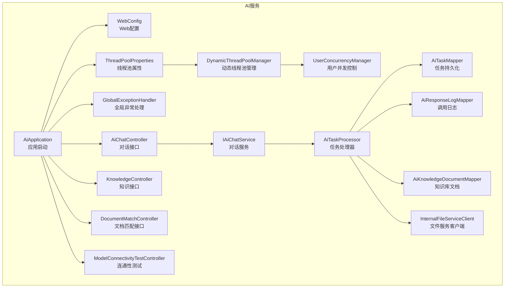
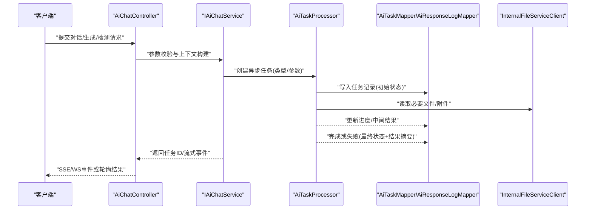
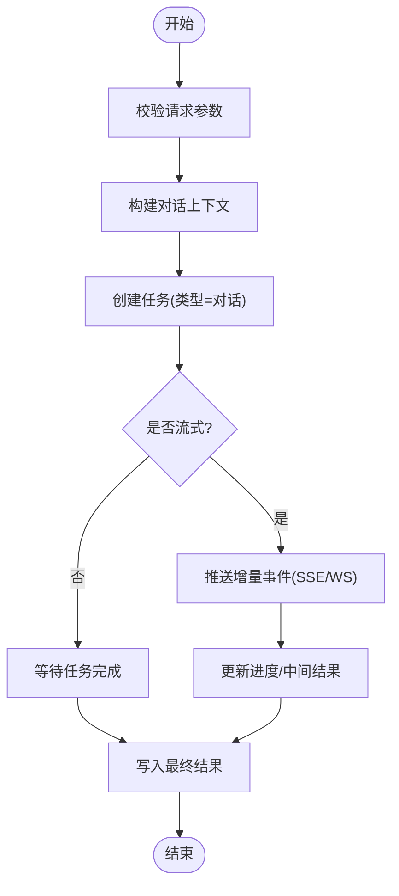
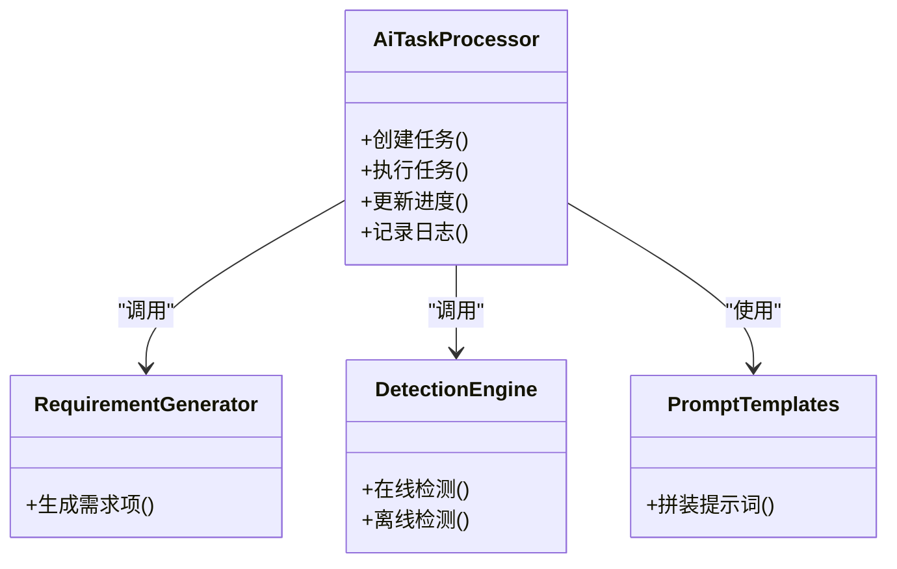
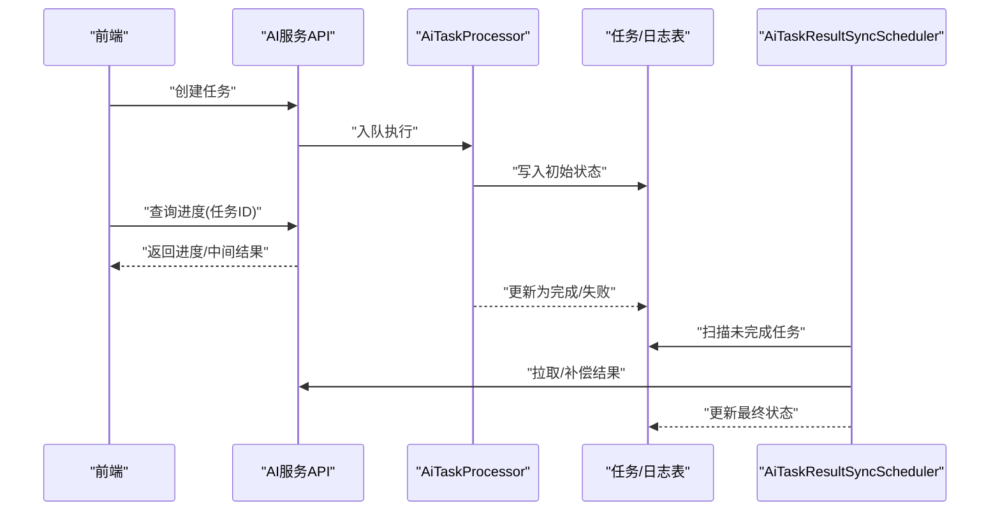
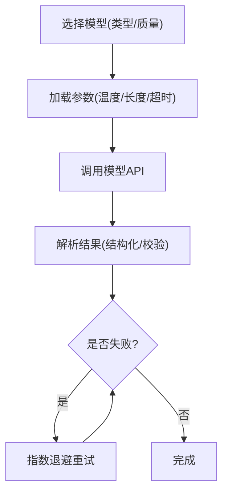
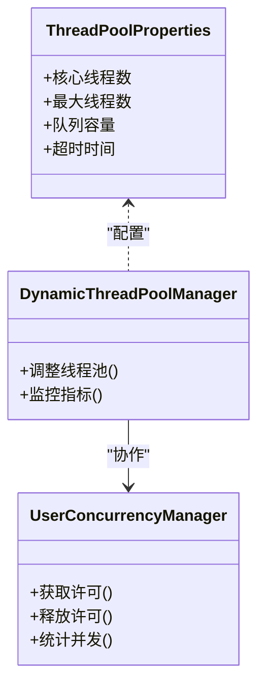
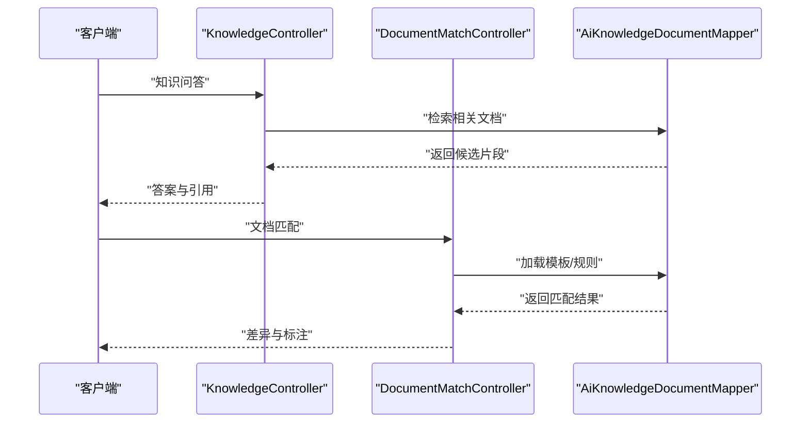
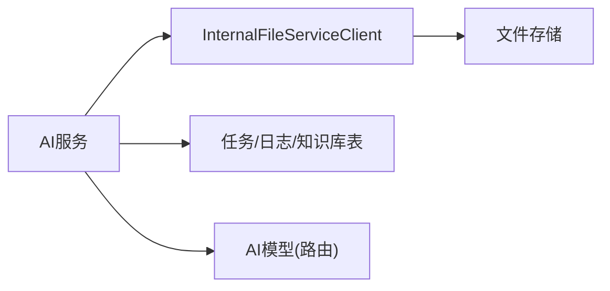

# AI服务API

<cite>
**本文引用的文件**   
- [AiApplication.java](file://ele-ai-tender-system/ele-ai-tender-ai/src/main/java/com/jy/eleaitender/ai/AiApplication.java)
- [application.yml](file://ele-ai-tender-system/ele-ai-tender-ai/src/main/resources/application.yml)
- [ThreadPoolProperties.java](file://ele-ai-tender-system/ele-ai-tender-ai/src/main/java/com/jy/eleaitender/ai/config/ThreadPoolProperties.java)
- [DynamicThreadPoolManager.java](file://ele-ai-tender-system/ele-ai-tender-ai/src/main/java/com/jy/eleaitender/ai/threadpool/DynamicThreadPoolManager.java)
- [UserConcurrencyManager.java](file://ele-ai-tender-system/ele-ai-tender-ai/src/main/java/com/jy/eleaitender/ai/threadpool/UserConcurrencyManager.java)
- [WebConfig.java](file://ele-ai-tender-system/ele-ai-tender-ai/src/main/java/com/jy/eleaitender/ai/config/WebConfig.java)
- [GlobalExceptionHandler.java](file://ele-ai-tender-system/ele-ai-tender-ai/src/main/java/com/jy/eleaitender/ai/handler/GlobalExceptionHandler.java)
- [AiChatController.java](file://ele-ai-tender-system/ele-ai-tender-ai/src/main/java/com/jy/eleaitender/ai/controller/AiChatController.java)
- [IAiChatService.java](file://ele-ai-tender-system/ele-ai-tender-ai/src/main/java/com/jy/eleaitender/ai/service/IAiChatService.java)
- [AiTaskProcessor.java](file://ele-ai-tender-system/ele-ai-tender-ai/src/main/java/com/jy/eleaitender/ai/processor/AiTaskProcessor.java)
- [AiTaskMapper.java](file://ele-ai-tender-system/ele-ai-tender-ai/src/main/java/com/jy/eleaitender/ai/mapper/AiTaskMapper.java)
- [AiResponseLogMapper.java](file://ele-ai-tender-system/ele-ai-tender-ai/src/main/java/com/jy/eleaitender/ai/mapper/AiResponseLogMapper.java)
- [ModelRouterTest.java](file://ele-ai-tender-system/ele-ai-tender-ai/src/test/java/com/jy/eleaitender/ai/processor/model/ModelRouterTest.java)
- [DetectionEngineTest.java](file://ele-ai-tender-system/ele-ai-tender-ai/src/test/java/com/jy/eleaitender/ai/processor/checker/DetectionEngineTest.java)
- [RequirementGeneratorTest.java](file://ele-ai-tender-system/ele-ai-tender-ai/src/test/java/com/jy/eleaitender/ai/processor/generator/RequirementGeneratorTest.java)
- [AiCallRecorderTest.java](file://ele-ai-tender-system/ele-ai-tender-ai/src/test/java/com/jy/eleaitender/ai/processor/recorder/AiCallRecorderTest.java)
- [AiErrorContentException.java](file://ele-ai-tender-system/ele-ai-tender-common/src/main/java/com/jy/eleaitender/common/exception/AiErrorContentException.java)
- [AiUnavailableException.java](file://ele-ai-tender-system/ele-ai-tender-common/src/main/java/com/jy/eleaitender/common/exception/AiUnavailableException.java)
- [AiTaskStatus.java](file://ele-ai-tender-system/ele-ai-tender-common/src/main/java/com/jy/eleaitender/common/enums/AiTaskStatus.java)
- [AiTaskType.java](file://ele-ai-tender-system/ele-ai-tender-common/src/main/java/com/jy/eleaitender/common/enums/AiTaskType.java)
- [ModelType.java](file://ele-ai-tender-system/ele-ai-tender-common/src/main/java/com/jy/eleaitender/common/enums/ModelType.java)
- [AiKnowledgeDocumentMapper.java](file://ele-ai-tender-system/ele-ai-tender-ai/src/main/java/com/jy/eleaitender/ai/mapper/AiKnowledgeDocumentMapper.java)
- [KnowledgeController.java](file://ele-ai-tender-system/ele-ai-tender-ai/src/main/java/com/jy/eleaitender/ai/controller/KnowledgeController.java)
- [DocumentMatchController.java](file://ele-ai-tender-system/ele-ai-tender-ai/src/main/java/com/jy/eleaitender/ai/controller/DocumentMatchController.java)
- [ModelConnectivityTestController.java](file://ele-ai-tender-system/ele-ai-tender-ai/src/main/java/com/jy/eleaitender/ai/controller/ModelConnectivityTestController.java)
- [InternalFileServiceClient.java](file://ele-ai-tender-system/ele-ai-tender-common/src/main/java/com/jy/eleaitender/common/client/InternalFileServiceClient.java)
- [InternalFileServiceClientAutoConfiguration.java](file://ele-ai-tender-system/ele-ai-tender-common/src/main/java/com/jy/eleaitender/common/client/InternalFileServiceClientAutoConfiguration.java)
- [InternalFileServiceProperties.java](file://ele-ai-tender-system/ele-ai-tender-common/src/main/java/com/jy/eleaitender/common/client/InternalFileServiceProperties.java)
- [AiTaskResultSyncScheduler.java](file://ele-ai-tender-system/ele-ai-tender-core/src/main/java/com/jy/eleaitender/core/scheduler/AiTaskResultSyncScheduler.java)
- [AiTaskResultSyncHandler.java](file://ele-ai-tender-system/ele-ai-tender-core/src/main/java/com/jy/eleaitender/core/scheduler/AiTaskResultSyncHandler.java)
</cite>

## 目录
1. [简介](#简介)
2. [项目结构](#项目结构)
3. [核心组件](#核心组件)
4. [架构总览](#架构总览)
5. [详细组件分析](#详细组件分析)
6. [依赖分析](#依赖分析)
7. [性能考虑](#性能考虑)
8. [故障排查指南](#故障排查指南)
9. [结论](#结论)
10. [附录](#附录)

## 简介
本文件面向AI服务API模块，系统性梳理智能对话、文档生成、质量检测等AI能力接口的封装实现；深入说明异步任务处理机制（创建、进度查询、结果获取、错误重试）；解释流式响应、WebSocket实时通信与SSE服务器推送的技术方案；并给出AI模型选择、参数配置、结果解析的处理策略。同时覆盖任务队列管理、并发控制、超时处理等高级特性，帮助读者快速理解与集成该模块。

## 项目结构
AI服务API位于系统子模块 ele-ai-tender-ai，围绕控制器、服务、处理器、线程池与异常处理等分层组织：
- 启动入口与全局配置
- 控制器层暴露REST接口（对话、知识检索、文档匹配、连通性测试）
- 服务层封装业务编排
- 处理器层负责具体AI任务执行（检测、生成、提示词组装、记录器）
- 线程池与并发控制（动态线程池、用户级并发限制）
- 数据访问层（任务、日志、知识库文档）
- 通用异常与枚举定义（任务状态、类型、模型类型）
- 外部依赖（内部文件服务客户端）

图表来源
- [AiApplication.java](file://ele-ai-tender-system/ele-ai-tender-ai/src/main/java/com/jy/eleaitender/ai/AiApplication.java)
- [WebConfig.java](file://ele-ai-tender-system/ele-ai-tender-ai/src/main/java/com/jy/eleaitender/ai/config/WebConfig.java)
- [ThreadPoolProperties.java](file://ele-ai-tender-system/ele-ai-tender-ai/src/main/java/com/jy/eleaitender/ai/config/ThreadPoolProperties.java)
- [DynamicThreadPoolManager.java](file://ele-ai-tender-system/ele-ai-tender-ai/src/main/java/com/jy/eleaitender/ai/threadpool/DynamicThreadPoolManager.java)
- [UserConcurrencyManager.java](file://ele-ai-tender-system/ele-ai-tender-ai/src/main/java/com/jy/eleaitender/ai/threadpool/UserConcurrencyManager.java)
- [GlobalExceptionHandler.java](file://ele-ai-tender-system/ele-ai-tender-ai/src/main/java/com/jy/eleaitender/ai/handler/GlobalExceptionHandler.java)
- [AiChatController.java](file://ele-ai-tender-system/ele-ai-tender-ai/src/main/java/com/jy/eleaitender/ai/controller/AiChatController.java)
- [KnowledgeController.java](file://ele-ai-tender-system/ele-ai-tender-ai/src/main/java/com/jy/eleaitender/ai/controller/KnowledgeController.java)
- [DocumentMatchController.java](file://ele-ai-tender-system/ele-ai-tender-ai/src/main/java/com/jy/eleaitender/ai/controller/DocumentMatchController.java)
- [ModelConnectivityTestController.java](file://ele-ai-tender-system/ele-ai-tender-ai/src/main/java/com/jy/eleaitender/ai/controller/ModelConnectivityTestController.java)
- [IAiChatService.java](file://ele-ai-tender-system/ele-ai-tender-ai/src/main/java/com/jy/eleaitender/ai/service/IAiChatService.java)
- [AiTaskProcessor.java](file://ele-ai-tender-system/ele-ai-tender-ai/src/main/java/com/jy/eleaitender/ai/processor/AiTaskProcessor.java)
- [AiTaskMapper.java](file://ele-ai-tender-system/ele-ai-tender-ai/src/main/java/com/jy/eleaitender/ai/mapper/AiTaskMapper.java)
- [AiResponseLogMapper.java](file://ele-ai-tender-system/ele-ai-tender-ai/src/main/java/com/jy/eleaitender/ai/mapper/AiResponseLogMapper.java)
- [AiKnowledgeDocumentMapper.java](file://ele-ai-tender-system/ele-ai-tender-ai/src/main/java/com/jy/eleaitender/ai/mapper/AiKnowledgeDocumentMapper.java)
- [InternalFileServiceClient.java](file://ele-ai-tender-system/ele-ai-tender-common/src/main/java/com/jy/eleaitender/common/client/InternalFileServiceClient.java)

章节来源
- [AiApplication.java](file://ele-ai-tender-system/ele-ai-tender-ai/src/main/java/com/jy/eleaitender/ai/AiApplication.java)
- [application.yml](file://ele-ai-tender-system/ele-ai-tender-ai/src/main/resources/application.yml)

## 核心组件
- 控制器层
  - 智能对话：提供会话消息发送、上下文管理与流式输出能力
  - 知识检索：基于知识库文档的问答与引用
  - 文档匹配：将输入文档与模板/规则进行匹配与标注
  - 连通性测试：对外部AI模型的连通性与可用性探测
- 服务层
  - 对话服务：编排请求校验、上下文构建、任务调度与结果聚合
- 处理器层
  - 任务处理器：统一的任务生命周期管理（创建、执行、回调、落库）
  - 检测引擎：质量检测流程编排
  - 生成器：需求项/评审项等内容的生成
  - 提示词模板：结构化Prompt拼装
  - 调用记录器：AI调用链路追踪与审计
- 线程池与并发控制
  - 动态线程池：运行时调整核心/最大线程数与队列容量
  - 用户并发限制：按用户维度限制并发任务数，避免单点过载
- 数据访问层
  - 任务表：任务ID、类型、状态、进度、结果摘要、创建/更新时间
  - 响应日志：请求/响应摘要、耗时、错误码
  - 知识库文档：用于检索与召回的知识片段
- 异常与枚举
  - 异常：AI内容异常、AI不可用异常等
  - 枚举：任务状态、任务类型、模型类型等

章节来源
- [AiChatController.java](file://ele-ai-tender-system/ele-ai-tender-ai/src/main/java/com/jy/eleaitender/ai/controller/AiChatController.java)
- [IAiChatService.java](file://ele-ai-tender-system/ele-ai-tender-ai/src/main/java/com/jy/eleaitender/ai/service/IAiChatService.java)
- [AiTaskProcessor.java](file://ele-ai-tender-system/ele-ai-tender-ai/src/main/java/com/jy/eleaitender/ai/processor/AiTaskProcessor.java)
- [AiTaskMapper.java](file://ele-ai-tender-system/ele-ai-tender-ai/src/main/java/com/jy/eleaitender/ai/mapper/AiTaskMapper.java)
- [AiResponseLogMapper.java](file://ele-ai-tender-system/ele-ai-tender-ai/src/main/java/com/jy/eleaitender/ai/mapper/AiResponseLogMapper.java)
- [AiKnowledgeDocumentMapper.java](file://ele-ai-tender-system/ele-ai-tender-ai/src/main/java/com/jy/eleaitender/ai/mapper/AiKnowledgeDocumentMapper.java)
- [AiTaskStatus.java](file://ele-ai-tender-system/ele-ai-tender-common/src/main/java/com/jy/eleaitender/common/enums/AiTaskStatus.java)
- [AiTaskType.java](file://ele-ai-tender-system/ele-ai-tender-common/src/main/java/com/jy/eleaitender/common/enums/AiTaskType.java)
- [ModelType.java](file://ele-ai-tender-system/ele-ai-tender-common/src/main/java/com/jy/eleaitender/common/enums/ModelType.java)
- [AiErrorContentException.java](file://ele-ai-tender-system/ele-ai-tender-common/src/main/java/com/jy/eleaitender/common/exception/AiErrorContentException.java)
- [AiUnavailableException.java](file://ele-ai-tender-system/ele-ai-tender-common/src/main/java/com/jy/eleaitender/common/exception/AiUnavailableException.java)

## 架构总览
AI服务API采用“控制器-服务-处理器”的分层架构，结合动态线程池与用户并发控制，支撑高并发AI任务。外部依赖包括数据库（MyBatis Plus）、内部文件服务、以及可插拔的AI模型路由。

图表来源
- [AiChatController.java](file://ele-ai-tender-system/ele-ai-tender-ai/src/main/java/com/jy/eleaitender/ai/controller/AiChatController.java)
- [IAiChatService.java](file://ele-ai-tender-system/ele-ai-tender-ai/src/main/java/com/jy/eleaitender/ai/service/IAiChatService.java)
- [AiTaskProcessor.java](file://ele-ai-tender-system/ele-ai-tender-ai/src/main/java/com/jy/eleaitender/ai/processor/AiTaskProcessor.java)
- [AiTaskMapper.java](file://ele-ai-tender-system/ele-ai-tender-ai/src/main/java/com/jy/eleaitender/ai/mapper/AiTaskMapper.java)
- [AiResponseLogMapper.java](file://ele-ai-tender-system/ele-ai-tender-ai/src/main/java/com/jy/eleaitender/ai/mapper/AiResponseLogMapper.java)
- [InternalFileServiceClient.java](file://ele-ai-tender-system/ele-ai-tender-common/src/main/java/com/jy/eleaitender/common/client/InternalFileServiceClient.java)

## 详细组件分析

### 智能对话接口（SSE/WS流式）
- 功能要点
  - 支持文本对话、多轮上下文、流式增量输出
  - 通过SSE或WebSocket向客户端推送分片结果
  - 结合任务ID进行进度与结果查询
- 关键路径
  - 控制器接收请求，服务层校验与构建上下文
  - 处理器创建任务并进入执行阶段
  - 执行过程中持续写进度与中间结果
  - 完成后更新最终状态与结果摘要
- 流式实现建议
  - SSE：适用于浏览器直连，服务端以事件流形式推送
  - WebSocket：适用于需要双向交互的场景
  - 两者均需具备断线重连与幂等恢复能力

图表来源
- [AiChatController.java](file://ele-ai-tender-system/ele-ai-tender-ai/src/main/java/com/jy/eleaitender/ai/controller/AiChatController.java)
- [IAiChatService.java](file://ele-ai-tender-system/ele-ai-tender-ai/src/main/java/com/jy/eleaitender/ai/service/IAiChatService.java)
- [AiTaskProcessor.java](file://ele-ai-tender-system/ele-ai-tender-ai/src/main/java/com/jy/eleaitender/ai/processor/AiTaskProcessor.java)
- [AiTaskMapper.java](file://ele-ai-tender-system/ele-ai-tender-ai/src/main/java/com/jy/eleaitender/ai/mapper/AiTaskMapper.java)

章节来源
- [AiChatController.java](file://ele-ai-tender-system/ele-ai-tender-ai/src/main/java/com/jy/eleaitender/ai/controller/AiChatController.java)
- [IAiChatService.java](file://ele-ai-tender-system/ele-ai-tender-ai/src/main/java/com/jy/eleaitender/ai/service/IAiChatService.java)
- [AiTaskProcessor.java](file://ele-ai-tender-system/ele-ai-tender-ai/src/main/java/com/jy/eleaitender/ai/processor/AiTaskProcessor.java)
- [AiTaskMapper.java](file://ele-ai-tender-system/ele-ai-tender-ai/src/main/java/com/jy/eleaitender/ai/mapper/AiTaskMapper.java)

### 文档生成与质量检测
- 文档生成
  - 根据模板与上下文生成需求项、评审项等结构化内容
  - 使用提示词模板拼装Prompt，交由模型生成
- 质量检测
  - 对生成的内容进行合规性、完整性、一致性检查
  - 支持在线检测与离线检测两种模式
- 关键路径
  - 控制器触发生成/检测任务
  - 处理器加载模板与上下文，组装Prompt
  - 调用模型生成或检测，记录调用日志
  - 更新任务状态与结果

图表来源
- [AiTaskProcessor.java](file://ele-ai-tender-system/ele-ai-tender-ai/src/main/java/com/jy/eleaitender/ai/processor/AiTaskProcessor.java)
- [RequirementGeneratorTest.java](file://ele-ai-tender-system/ele-ai-tender-ai/src/test/java/com/jy/eleaitender/ai/processor/generator/RequirementGeneratorTest.java)
- [DetectionEngineTest.java](file://ele-ai-tender-system/ele-ai-tender-ai/src/test/java/com/jy/eleaitender/ai/processor/checker/DetectionEngineTest.java)

章节来源
- [AiTaskProcessor.java](file://ele-ai-tender-system/ele-ai-tender-ai/src/main/java/com/jy/eleaitender/ai/processor/AiTaskProcessor.java)
- [RequirementGeneratorTest.java](file://ele-ai-tender-system/ele-ai-tender-ai/src/test/java/com/jy/eleaitender/ai/processor/generator/RequirementGeneratorTest.java)
- [DetectionEngineTest.java](file://ele-ai-tender-system/ele-ai-tender-ai/src/test/java/com/jy/eleaitender/ai/processor/checker/DetectionEngineTest.java)

### 异步任务处理机制（创建、进度、结果、重试）
- 任务创建
  - 由服务层根据场景类型创建任务记录，分配唯一任务ID
- 进度查询
  - 前端通过任务ID轮询或SSE/WS订阅进度事件
- 结果获取
  - 任务完成后，结果摘要与详情可通过任务ID获取
- 错误重试
  - 针对网络抖动或模型限流，支持指数退避重试
  - 超过最大重试次数后标记失败并记录原因
- 同步补偿
  - 定时任务扫描长时间未完成的任务，尝试拉取或回补结果

图表来源
- [AiTaskProcessor.java](file://ele-ai-tender-system/ele-ai-tender-ai/src/main/java/com/jy/eleaitender/ai/processor/AiTaskProcessor.java)
- [AiTaskMapper.java](file://ele-ai-tender-system/ele-ai-tender-ai/src/main/java/com/jy/eleaitender/ai/mapper/AiTaskMapper.java)
- [AiTaskResultSyncScheduler.java](file://ele-ai-tender-system/ele-ai-tender-core/src/main/java/com/jy/eleaitender/core/scheduler/AiTaskResultSyncScheduler.java)
- [AiTaskResultSyncHandler.java](file://ele-ai-tender-system/ele-ai-tender-core/src/main/java/com/jy/eleaitender/core/scheduler/AiTaskResultSyncHandler.java)

章节来源
- [AiTaskProcessor.java](file://ele-ai-tender-system/ele-ai-tender-ai/src/main/java/com/jy/eleaitender/ai/processor/AiTaskProcessor.java)
- [AiTaskMapper.java](file://ele-ai-tender-system/ele-ai-tender-ai/src/main/java/com/jy/eleaitender/ai/mapper/AiTaskMapper.java)
- [AiTaskResultSyncScheduler.java](file://ele-ai-tender-system/ele-ai-tender-core/src/main/java/com/jy/eleaitender/core/scheduler/AiTaskResultSyncScheduler.java)
- [AiTaskResultSyncHandler.java](file://ele-ai-tender-system/ele-ai-tender-core/src/main/java/com/jy/eleaitender/core/scheduler/AiTaskResultSyncHandler.java)

### 流式响应与实时通信（SSE/WS）
- SSE
  - 适合单向推送，浏览器原生支持
  - 需处理连接断开与自动重连
- WebSocket
  - 适合双向交互，如聊天室、协同编辑
  - 需维护会话状态与心跳保活
- 共同要求
  - 事件去重与顺序保证
  - 背压与限流，防止下游模型过载
  - 安全鉴权与跨域配置

章节来源
- [WebConfig.java](file://ele-ai-tender-system/ele-ai-tender-ai/src/main/java/com/jy/eleaitender/ai/config/WebConfig.java)
- [AiChatController.java](file://ele-ai-tender-system/ele-ai-tender-ai/src/main/java/com/jy/eleaitender/ai/controller/AiChatController.java)

### AI模型选择、参数配置与结果解析
- 模型选择
  - 基于任务类型与质量要求选择合适模型
  - 支持多模型路由与降级策略
- 参数配置
  - 温度、TopP、最大生成长度等超参
  - 超时、重试次数、退避策略
- 结果解析
  - 结构化字段抽取与校验
  - 异常内容过滤与兜底策略

图表来源
- [ModelRouterTest.java](file://ele-ai-tender-system/ele-ai-tender-ai/src/test/java/com/jy/eleaitender/ai/processor/model/ModelRouterTest.java)
- [application.yml](file://ele-ai-tender-system/ele-ai-tender-ai/src/main/resources/application.yml)

章节来源
- [ModelRouterTest.java](file://ele-ai-tender-system/ele-ai-tender-ai/src/test/java/com/jy/eleaitender/ai/processor/model/ModelRouterTest.java)
- [application.yml](file://ele-ai-tender-system/ele-ai-tender-ai/src/main/resources/application.yml)

### 任务队列管理与并发控制
- 动态线程池
  - 运行时调整核心/最大线程数与队列容量，适配不同负载
- 用户并发限制
  - 按用户维度限制并发任务数，避免单用户独占资源
- 队列与背压
  - 当队列满时拒绝新任务或排队等待
  - 结合SSE/WS进行进度反馈，提升用户体验

图表来源
- [ThreadPoolProperties.java](file://ele-ai-tender-system/ele-ai-tender-ai/src/main/java/com/jy/eleaitender/ai/config/ThreadPoolProperties.java)
- [DynamicThreadPoolManager.java](file://ele-ai-tender-system/ele-ai-tender-ai/src/main/java/com/jy/eleaitender/ai/threadpool/DynamicThreadPoolManager.java)
- [UserConcurrencyManager.java](file://ele-ai-tender-system/ele-ai-tender-ai/src/main/java/com/jy/eleaitender/ai/threadpool/UserConcurrencyManager.java)

章节来源
- [ThreadPoolProperties.java](file://ele-ai-tender-system/ele-ai-tender-ai/src/main/java/com/jy/eleaitender/ai/config/ThreadPoolProperties.java)
- [DynamicThreadPoolManager.java](file://ele-ai-tender-system/ele-ai-tender-ai/src/main/java/com/jy/eleaitender/ai/threadpool/DynamicThreadPoolManager.java)
- [UserConcurrencyManager.java](file://ele-ai-tender-system/ele-ai-tender-ai/src/main/java/com/jy/eleaitender/ai/threadpool/UserConcurrencyManager.java)

### 知识检索与文档匹配
- 知识检索
  - 基于知识库文档进行语义检索与引用
- 文档匹配
  - 将输入文档与模板/规则进行匹配，输出差异与标注
- 数据访问
  - 知识库文档映射器用于检索与召回

图表来源
- [KnowledgeController.java](file://ele-ai-tender-system/ele-ai-tender-ai/src/main/java/com/jy/eleaitender/ai/controller/KnowledgeController.java)
- [DocumentMatchController.java](file://ele-ai-tender-system/ele-ai-tender-ai/src/main/java/com/jy/eleaitender/ai/controller/DocumentMatchController.java)
- [AiKnowledgeDocumentMapper.java](file://ele-ai-tender-system/ele-ai-tender-ai/src/main/java/com/jy/eleaitender/ai/mapper/AiKnowledgeDocumentMapper.java)

章节来源
- [KnowledgeController.java](file://ele-ai-tender-system/ele-ai-tender-ai/src/main/java/com/jy/eleaitender/ai/controller/KnowledgeController.java)
- [DocumentMatchController.java](file://ele-ai-tender-system/ele-ai-tender-ai/src/main/java/com/jy/eleaitender/ai/controller/DocumentMatchController.java)
- [AiKnowledgeDocumentMapper.java](file://ele-ai-tender-system/ele-ai-tender-ai/src/main/java/com/jy/eleaitender/ai/mapper/AiKnowledgeDocumentMapper.java)

### 连通性测试与健康检查
- 目的
  - 验证外部AI模型连通性与可用性
- 方式
  - 轻量请求探测，返回健康状态与延迟指标
- 适用场景
  - 部署前自检、运行期告警

章节来源
- [ModelConnectivityTestController.java](file://ele-ai-tender-system/ele-ai-tender-ai/src/main/java/com/jy/eleaitender/ai/controller/ModelConnectivityTestController.java)

## 依赖分析
- 内部依赖
  - 文件服务客户端：用于读取/上传附件与中间产物
  - 自动装配：简化客户端初始化与配置绑定
- 外部依赖
  - 数据库：任务与日志持久化
  - AI模型：通过路由与配置选择具体实现
- 耦合与内聚
  - 控制器与服务解耦，服务与处理器职责清晰
  - 线程池与并发控制独立于业务逻辑，便于复用与扩展

图表来源
- [InternalFileServiceClient.java](file://ele-ai-tender-system/ele-ai-tender-common/src/main/java/com/jy/eleaitender/common/client/InternalFileServiceClient.java)
- [InternalFileServiceClientAutoConfiguration.java](file://ele-ai-tender-system/ele-ai-tender-common/src/main/java/com/jy/eleaitender/common/client/InternalFileServiceClientAutoConfiguration.java)
- [InternalFileServiceProperties.java](file://ele-ai-tender-system/ele-ai-tender-common/src/main/java/com/jy/eleaitender/common/client/InternalFileServiceProperties.java)

章节来源
- [InternalFileServiceClient.java](file://ele-ai-tender-system/ele-ai-tender-common/src/main/java/com/jy/eleaitender/common/client/InternalFileServiceClient.java)
- [InternalFileServiceClientAutoConfiguration.java](file://ele-ai-tender-system/ele-ai-tender-common/src/main/java/com/jy/eleaitender/common/client/InternalFileServiceClientAutoConfiguration.java)
- [InternalFileServiceProperties.java](file://ele-ai-tender-system/ele-ai-tender-common/src/main/java/com/jy/eleaitender/common/client/InternalFileServiceProperties.java)

## 性能考虑
- 线程池调优
  - 根据CPU与IO比例设置核心/最大线程数
  - 合理配置队列容量，避免OOM与过度排队
- 用户并发限制
  - 按用户维度限制并发，保障公平性与稳定性
- 超时与重试
  - 设置合理的请求超时与重试上限
  - 使用指数退避降低瞬时拥塞
- 流式优化
  - 控制事件大小与频率，减少带宽占用
  - 启用压缩与缓存热点数据
- 背压与限流
  - 在模型调用前进行令牌桶或漏桶限流
  - 结合动态线程池进行自适应调节

[本节为通用指导，不直接分析具体文件]

## 故障排查指南
- 常见问题
  - 模型不可用：检查连通性测试结果与模型路由配置
  - 任务卡住：查看任务状态与进度，确认是否存在阻塞或超时
  - 流式中断：检查SSE/WS连接与跨域配置，确认客户端重连逻辑
- 定位手段
  - 查看AI调用日志与任务记录
  - 使用连通性测试接口验证模型可达性
  - 观察线程池指标与用户并发统计
- 恢复策略
  - 重试失败任务，必要时人工介入
  - 调整线程池与并发限制参数
  - 切换备用模型或降级策略

章节来源
- [GlobalExceptionHandler.java](file://ele-ai-tender-system/ele-ai-tender-ai/src/main/java/com/jy/eleaitender/ai/handler/GlobalExceptionHandler.java)
- [AiUnavailableException.java](file://ele-ai-tender-system/ele-ai-tender-common/src/main/java/com/jy/eleaitender/common/exception/AiUnavailableException.java)
- [AiErrorContentException.java](file://ele-ai-tender-system/ele-ai-tender-common/src/main/java/com/jy/eleaitender/common/exception/AiErrorContentException.java)
- [AiTaskStatus.java](file://ele-ai-tender-system/ele-ai-tender-common/src/main/java/com/jy/eleaitender/common/enums/AiTaskStatus.java)
- [AiTaskResultSyncScheduler.java](file://ele-ai-tender-system/ele-ai-tender-core/src/main/java/com/jy/eleaitender/core/scheduler/AiTaskResultSyncScheduler.java)
- [AiTaskResultSyncHandler.java](file://ele-ai-tender-system/ele-ai-tender-core/src/main/java/com/jy/eleaitender/core/scheduler/AiTaskResultSyncHandler.java)

## 结论
AI服务API通过清晰的层次划分、完善的异步任务机制与灵活的并发控制，提供了稳定高效的智能对话、文档生成与质量检测能力。结合SSE/WS流式通信与模型路由策略，能够满足复杂业务场景下的实时性与可靠性要求。建议在上线前充分进行性能压测与故障演练，确保生产环境的稳定性。

[本节为总结性内容，不直接分析具体文件]

## 附录
- 术语
  - SSE：服务器推送事件
  - WS：WebSocket
  - 指数退避：重试间隔随失败次数递增的策略
- 参考测试
  - 模型路由测试、检测引擎测试、生成器测试、调用记录器测试

章节来源
- [ModelRouterTest.java](file://ele-ai-tender-system/ele-ai-tender-ai/src/test/java/com/jy/eleaitender/ai/processor/model/ModelRouterTest.java)
- [DetectionEngineTest.java](file://ele-ai-tender-system/ele-ai-tender-ai/src/test/java/com/jy/eleaitender/ai/processor/checker/DetectionEngineTest.java)
- [RequirementGeneratorTest.java](file://ele-ai-tender-system/ele-ai-tender-ai/src/test/java/com/jy/eleaitender/ai/processor/generator/RequirementGeneratorTest.java)
- [AiCallRecorderTest.java](file://ele-ai-tender-system/ele-ai-tender-ai/src/test/java/com/jy/eleaitender/ai/processor/recorder/AiCallRecorderTest.java)