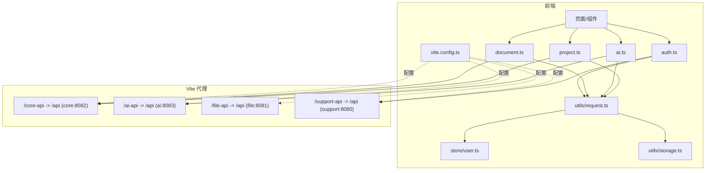
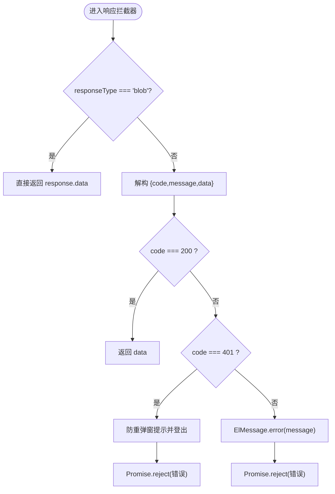
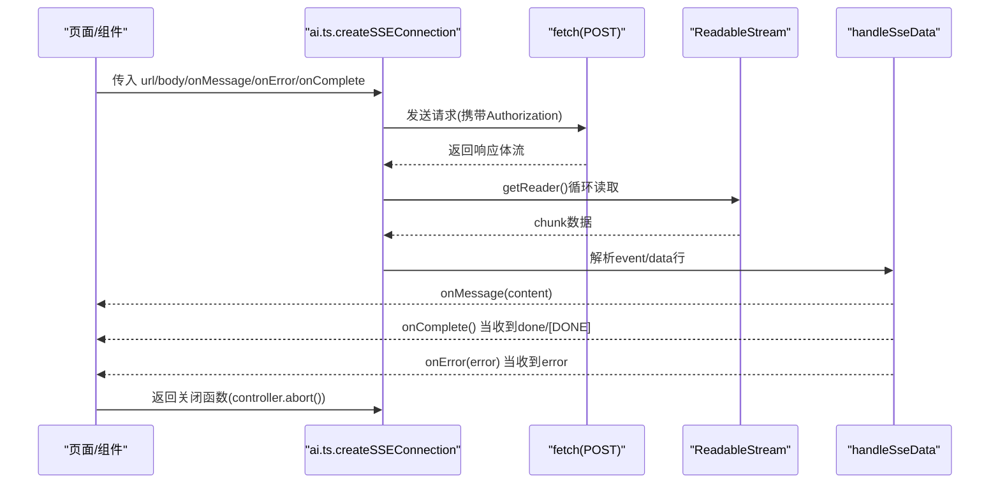
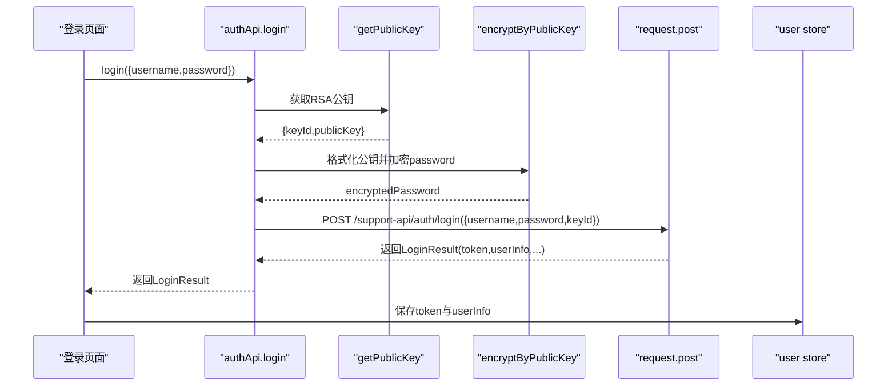
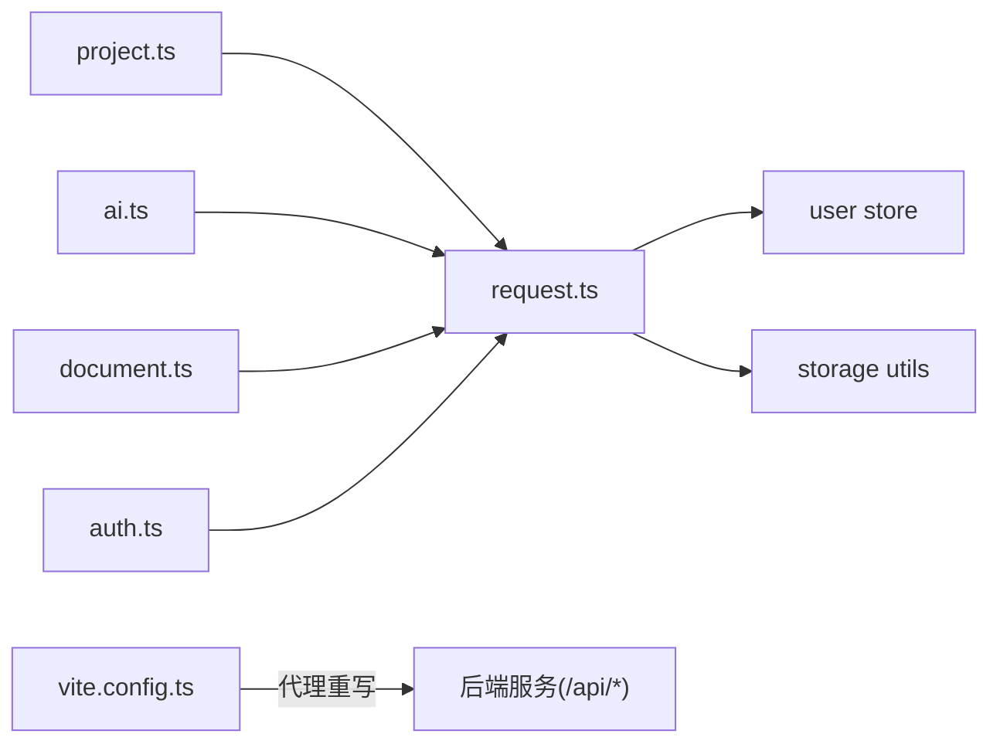

# API接口集成

<cite>
**本文引用的文件列表**
- [ele-ai-tender-frontend/src/utils/request.ts](file://ele-ai-tender-frontend/src/utils/request.ts)
- [ele-ai-tender-frontend/src/api/project.ts](file://ele-ai-tender-frontend/src/api/project.ts)
- [ele-ai-tender-frontend/src/api/ai.ts](file://ele-ai-tender-frontend/src/api/ai.ts)
- [ele-ai-tender-frontend/src/api/document.ts](file://ele-ai-tender-frontend/src/api/document.ts)
- [ele-ai-tender-frontend/src/api/auth.ts](file://ele-ai-tender-frontend/src/api/auth.ts)
- [ele-ai-tender-frontend/src/store/user.ts](file://ele-ai-tender-frontend/src/store/user.ts)
- [ele-ai-tender-frontend/src/utils/storage.ts](file://ele-ai-tender-frontend/src/utils/storage.ts)
- [ele-ai-tender-frontend/vite.config.ts](file://ele-ai-tender-frontend/vite.config.ts)
- [docs/rules/FRONTEND_CONVENTIONS.md](file://docs/rules/FRONTEND_CONVENTIONS.md)
</cite>

## 目录
1. [简介](#简介)
2. [项目结构](#项目结构)
3. [核心组件](#核心组件)
4. [架构总览](#架构总览)
5. [详细组件分析](#详细组件分析)
6. [依赖关系分析](#依赖关系分析)
7. [性能与并发控制](#性能与并发控制)
8. [Mock数据与测试方案](#mock数据与测试方案)
9. [API版本管理与兼容性](#api版本管理与兼容性)
10. [故障排查指南](#故障排查指南)
11. [结论](#结论)

## 简介
本文件面向前端工程中的“API接口集成层”，聚焦基于 Axios 的请求封装层设计与各业务模块的API封装，涵盖请求拦截器、响应拦截器、错误处理机制、Token管理、请求取消、SSE流式通信、代理与版本映射、以及可落地的测试与排障建议。文档同时给出可视化图示，帮助读者快速理解整体架构与关键流程。

## 项目结构
前端采用多服务聚合访问模式：通过 Vite 开发服务器将不同前缀路径代理到对应后端服务，并在请求层统一注入认证信息、统一错误处理与用户态退出逻辑。



图表来源
- [ele-ai-tender-frontend/src/utils/request.ts:1-80](file://ele-ai-tender-frontend/src/utils/request.ts#L1-L80)
- [ele-ai-tender-frontend/src/api/project.ts:1-59](file://ele-ai-tender-frontend/src/api/project.ts#L1-L59)
- [ele-ai-tender-frontend/src/api/ai.ts:1-181](file://ele-ai-tender-frontend/src/api/ai.ts#L1-L181)
- [ele-ai-tender-frontend/src/api/document.ts:1-21](file://ele-ai-tender-frontend/src/api/document.ts#L1-L21)
- [ele-ai-tender-frontend/src/api/auth.ts:1-105](file://ele-ai-tender-frontend/src/api/auth.ts#L1-L105)
- [ele-ai-tender-frontend/src/store/user.ts:1-75](file://ele-ai-tender-frontend/src/store/user.ts#L1-L75)
- [ele-ai-tender-frontend/src/utils/storage.ts:1-18](file://ele-ai-tender-frontend/src/utils/storage.ts#L1-L18)
- [ele-ai-tender-frontend/vite.config.ts:1-106](file://ele-ai-tender-frontend/vite.config.ts#L1-L106)

章节来源
- [docs/rules/FRONTEND_CONVENTIONS.md:1-43](file://docs/rules/FRONTEND_CONVENTIONS.md#L1-L43)
- [ele-ai-tender-frontend/vite.config.ts:60-106](file://ele-ai-tender-frontend/vite.config.ts#L60-L106)

## 核心组件
- 请求封装层（Axios）：集中处理请求头注入、统一响应解包、全局错误提示、401 登录态失效处理、Blob 下载直通等。
- 业务API封装：按领域划分 project.ts、ai.ts、document.ts、auth.ts，暴露清晰的方法签名并复用基础请求实例。
- Token与用户态：登录成功后持久化 token 和用户信息；请求拦截器自动附加 Authorization；401 时触发登出并跳转。
- SSE流式通信：ai.ts 提供 createSSEConnection，使用 fetch + ReadableStream 实现带 body 的 SSE，支持事件解析、错误与完成回调、AbortController 取消。
- 代理与版本映射：vite.config.ts 将 /core-api、/ai-api、/file-api、/support-api 前缀重写为后端统一的 /api 前缀，屏蔽后端路径差异。

章节来源
- [ele-ai-tender-frontend/src/utils/request.ts:1-80](file://ele-ai-tender-frontend/src/utils/request.ts#L1-L80)
- [ele-ai-tender-frontend/src/api/ai.ts:1-181](file://ele-ai-tender-frontend/src/api/ai.ts#L1-L181)
- [ele-ai-tender-frontend/src/store/user.ts:1-75](file://ele-ai-tender-frontend/src/store/user.ts#L1-L75)
- [ele-ai-tender-frontend/vite.config.ts:60-106](file://ele-ai-tender-frontend/vite.config.ts#L60-L106)

## 架构总览
下图展示了从页面调用到后端服务的完整链路，包括拦截器、状态管理、代理转发与SSE流式通道。

```mermaid
sequenceDiagram
participant View as "页面/组件"
participant Api as "业务API(如 ai.ts)"
participant Req as "request.ts(Axios)"
participant User as "user store"
participant Vite as "Vite代理"
participant Core as "core服务(/api/*)"
participant AI as "ai服务(/api/*)"
participant Support as "support服务(/api/*)"
View->>Api : 调用方法(如 aiApi.suggest)
Api->>Req : request.post/get(...)
Req->>Req : 请求拦截器(注入Authorization)
Req->>Vite : 发起HTTP请求(/core-api|/ai-api|/support-api)
Vite-->>Req : 重写路径为/api并转发至目标服务
Req->>Req : 响应拦截器(code=200返回data; 401弹窗+登出; 其他错误提示)
Req-->>Api : 返回业务数据(data)
Api-->>View : 返回结果
Note over Req,User : 401时触发userStore.logout()并跳转登录页
```

图表来源
- [ele-ai-tender-frontend/src/utils/request.ts:25-77](file://ele-ai-tender-frontend/src/utils/request.ts#L25-L77)
- [ele-ai-tender-frontend/src/api/ai.ts:12-48](file://ele-ai-tender-frontend/src/api/ai.ts#L12-L48)
- [ele-ai-tender-frontend/src/store/user.ts:41-48](file://ele-ai-tender-frontend/src/store/user.ts#L41-L48)
- [ele-ai-tender-frontend/vite.config.ts:77-86](file://ele-ai-tender-frontend/vite.config.ts#L77-L86)

## 详细组件分析

### 请求封装层（Axios）设计
- 请求拦截器
  - 自动读取本地 token 并注入 Authorization: Bearer <token>。
  - 未携带 token 时不添加该头，避免无感失败。
- 响应拦截器
  - Blob 响应直接透传，不做 JSON 解构，便于文件下载。
  - 业务码 200 返回 data；401 弹出确认框后执行登出（防重复弹窗锁），并拒绝 Promise。
  - 其他业务码或网络错误统一提示并拒绝 Promise。
  - HTTP 401 状态码在错误分支中同样触发登出。
- 超时与默认头
  - 默认超时 30s，Content-Type 为 application/json。
- 类型增强
  - 自定义 CustomAxiosInstance 以匹配拦截器返回 data 的行为，简化上层调用类型推断。



图表来源
- [ele-ai-tender-frontend/src/utils/request.ts:38-77](file://ele-ai-tender-frontend/src/utils/request.ts#L38-L77)

章节来源
- [ele-ai-tender-frontend/src/utils/request.ts:1-80](file://ele-ai-tender-frontend/src/utils/request.ts#L1-L80)

### 项目管理API（project.ts）
- 能力清单
  - 分页查询、详情获取、创建、更新、批量删除、版本列表、导出、推进阶段、提交需求生成、变更状态、取消/发布/归档、名称唯一性校验。
- 版本策略
  - 所有路径均包含 v1 版本号，便于后续演进与兼容。
- 典型用法
  - 列表与详情：GET /core-api/v1/projects 与 /core-api/v1/projects/{id}
  - 写操作：POST/PUT/DELETE 配合相应路径与参数。

章节来源
- [ele-ai-tender-frontend/src/api/project.ts:1-59](file://ele-ai-tender-frontend/src/api/project.ts#L1-L59)

### AI服务API（ai.ts）
- 同步接口
  - 文本优化、自动/手动匹配、检测启动与结果查询、结果确认等。
- 流式接口（SSE）
  - 提供 chatUrl/optimizeUrl 常量，供 createSSEConnection 使用。
  - createSSEConnection 使用 fetch + ReadableStream 实现 POST + body 的 SSE，支持：
    - 事件名 event: 与 data: 行解析
    - 兼容纯文本与 JSON 两种 data 格式
    - 完成信号 done/[DONE] 与 error 事件
    - AbortController 可控取消
- 错误与完成回调
  - onError/onComplete 回调由调用方决定UI表现（如进度、提示）。



图表来源
- [ele-ai-tender-frontend/src/api/ai.ts:60-180](file://ele-ai-tender-frontend/src/api/ai.ts#L60-L180)

章节来源
- [ele-ai-tender-frontend/src/api/ai.ts:1-181](file://ele-ai-tender-frontend/src/api/ai.ts#L1-L181)

### 文档处理API（document.ts）
- 能力清单
  - 异步文档集成（返回AI任务）、预览获取、编辑集成后的内容。
- 交互模式
  - 集成类操作走异步任务模型，前端可通过轮询或事件机制跟踪任务状态（具体轮询策略由业务层实现）。

章节来源
- [ele-ai-tender-frontend/src/api/document.ts:1-21](file://ele-ai-tender-frontend/src/api/document.ts#L1-L21)

### 认证授权API（auth.ts）
- 能力清单
  - 获取RSA公钥、密码登录（RSA加密传输）、短信验证码登录、重置密码、修改密码、获取用户信息与菜单、登出。
- 安全细节
  - 登录/重置/改密前动态拉取公钥，对敏感字段进行RSA加密后再提交。
- 与请求层的协作
  - 登录成功后，user store 写入 token 与 userInfo；后续请求拦截器自动注入 Authorization。



图表来源
- [ele-ai-tender-frontend/src/api/auth.ts:10-34](file://ele-ai-tender-frontend/src/api/auth.ts#L10-L34)
- [ele-ai-tender-frontend/src/store/user.ts:15-26](file://ele-ai-tender-frontend/src/store/user.ts#L15-L26)

章节来源
- [ele-ai-tender-frontend/src/api/auth.ts:1-105](file://ele-ai-tender-frontend/src/api/auth.ts#L1-L105)
- [ele-ai-tender-frontend/src/store/user.ts:1-75](file://ele-ai-tender-frontend/src/store/user.ts#L1-L75)

## 依赖关系分析
- 低耦合高内聚
  - 业务API仅依赖 request.ts，不关心鉴权、错误提示、401处理等横切关注点。
  - user store 负责用户态与路由跳转，request.ts 仅在必要时触发登出。
- 外部依赖
  - axios、element-plus（消息与对话框）、pinia（状态管理）、localStorage（持久化）。
- 代理与版本映射
  - vite.config.ts 将 /core-api、/ai-api、/file-api、/support-api 统一重写为 /api，屏蔽后端路径差异，便于统一网关与版本治理。



图表来源
- [ele-ai-tender-frontend/src/api/project.ts:1-59](file://ele-ai-tender-frontend/src/api/project.ts#L1-L59)
- [ele-ai-tender-frontend/src/api/ai.ts:1-181](file://ele-ai-tender-frontend/src/api/ai.ts#L1-L181)
- [ele-ai-tender-frontend/src/api/document.ts:1-21](file://ele-ai-tender-frontend/src/api/document.ts#L1-L21)
- [ele-ai-tender-frontend/src/api/auth.ts:1-105](file://ele-ai-tender-frontend/src/api/auth.ts#L1-L105)
- [ele-ai-tender-frontend/src/utils/request.ts:1-80](file://ele-ai-tender-frontend/src/utils/request.ts#L1-L80)
- [ele-ai-tender-frontend/src/store/user.ts:1-75](file://ele-ai-tender-frontend/src/store/user.ts#L1-L75)
- [ele-ai-tender-frontend/src/utils/storage.ts:1-18](file://ele-ai-tender-frontend/src/utils/storage.ts#L1-L18)
- [ele-ai-tender-frontend/vite.config.ts:77-86](file://ele-ai-tender-frontend/vite.config.ts#L77-L86)

章节来源
- [docs/rules/FRONTEND_CONVENTIONS.md:22-43](file://docs/rules/FRONTEND_CONVENTIONS.md#L22-L43)
- [ele-ai-tender-frontend/vite.config.ts:60-106](file://ele-ai-tender-frontend/vite.config.ts#L60-L106)

## 性能与并发控制
- 当前实现要点
  - 请求层未内置重试策略与缓存策略，保持简洁，避免隐藏副作用。
  - 未实现全局并发限制；SSE 连接通过 AbortController 支持单连接取消。
- 建议与扩展点
  - 重试策略：可在响应拦截器中对特定错误码（如 5xx、网络抖动）进行指数退避重试，注意幂等性与最大重试次数。
  - 并发控制：可按资源维度（如项目ID）建立队列或信号量，避免同一资源的频繁并发刷新。
  - 缓存策略：对读多写少的接口（如字典、模板）引入内存级缓存（如 Map）或浏览器缓存（ETag/If-None-Match），结合失效键管理。
  - 性能监控：在请求拦截器记录开始时间，在响应拦截器计算耗时并上报埋点（URL、方法、耗时、状态码、业务码）。

[本节为通用指导，不直接分析具体文件]

## Mock数据与测试方案
- 开发期Mock
  - 利用 Vite 代理日志输出辅助定位问题；也可在 vite.config.ts 中增加本地静态Mock响应或中间件（示例思路，非现有实现）。
- 单元测试
  - 对 request.ts 的拦截器行为进行断言（如 401 触发登出、Blob 透传、业务码处理）。
  - 对业务API方法的路径拼接与参数传递进行快照测试。
- 集成测试
  - 使用 Cypress/Playwright 模拟登录流程，验证 401 自动登出与跳转。
  - 针对 SSE 场景，构造服务端事件流，验证 onMessage/onError/onComplete 回调。

[本节为通用指导，不直接分析具体文件]

## API版本管理与兼容性
- 版本前缀
  - 所有业务API路径均包含 v1 版本号，例如 /core-api/v1/...、/ai-api/v1/...、/support-api/v1/...，便于后续升级与灰度。
- 向后兼容
  - 新增字段优先采用可选字段；废弃字段保留一段时间并打日志告警。
  - 前端在需要兼容旧版后端时，可在业务API层做字段映射与降级处理（参考支撑中心版本API中的 mapVersion/mapPlugin 做法）。
- 代理与路径重写
  - 通过 vite.config.ts 将 /core-api、/ai-api、/file-api、/support-api 统一重写为 /api，屏蔽后端差异，降低前端对后端路径演进的感知成本。

章节来源
- [ele-ai-tender-frontend/src/api/project.ts:1-59](file://ele-ai-tender-frontend/src/api/project.ts#L1-L59)
- [ele-ai-tender-frontend/src/api/ai.ts:12-48](file://ele-ai-tender-frontend/src/api/ai.ts#L12-L48)
- [ele-ai-tender-frontend/src/api/document.ts:1-21](file://ele-ai-tender-frontend/src/api/document.ts#L1-L21)
- [ele-ai-tender-frontend/src/api/auth.ts:10-34](file://ele-ai-tender-frontend/src/api/auth.ts#L10-L34)
- [ele-ai-tender-frontend/vite.config.ts:77-86](file://ele-ai-tender-frontend/vite.config.ts#L77-L86)

## 故障排查指南
- 常见问题
  - 401 未跳转：检查是否命中业务码 401 或 HTTP 401 分支；确认 userStore.logout 是否被调用且路由跳转生效。
  - 文件下载为空：确认 responseType 是否为 blob；响应拦截器会直接返回原始数据，无需二次解包。
  - SSE 无消息：检查 Accept 头是否为 text/event-stream；确认后端事件格式（event/data）与 [DONE]/error 信号。
  - 跨域或代理异常：核对 vite.config.ts 的代理规则与目标地址；查看 logs/vite-proxy.log 中的转发记录。
- 调试建议
  - 打开浏览器 Network 面板，观察请求头是否携带 Authorization。
  - 在请求/响应拦截器处打印关键上下文（URL、方法、耗时、业务码）。
  - 对于SSE，监听 onMessage/onError/onComplete 并记录事件名与数据片段。

章节来源
- [ele-ai-tender-frontend/src/utils/request.ts:38-77](file://ele-ai-tender-frontend/src/utils/request.ts#L38-L77)
- [ele-ai-tender-frontend/src/api/ai.ts:60-180](file://ele-ai-tender-frontend/src/api/ai.ts#L60-L180)
- [ele-ai-tender-frontend/vite.config.ts:23-58](file://ele-ai-tender-frontend/vite.config.ts#L23-L58)

## 结论
本项目的前端API集成层以 Axios 为中心，结合 Pinia 用户态与 Vite 代理，实现了清晰的鉴权注入、统一错误处理、SSE 流式通信与版本化路径管理。当前实现保持轻量，未内置重试与缓存，便于按需扩展。建议在后续迭代中补充重试、并发控制与性能埋点，以提升稳定性与可观测性。