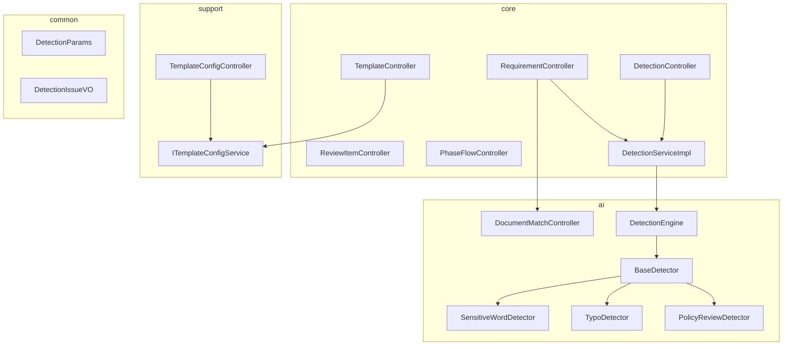
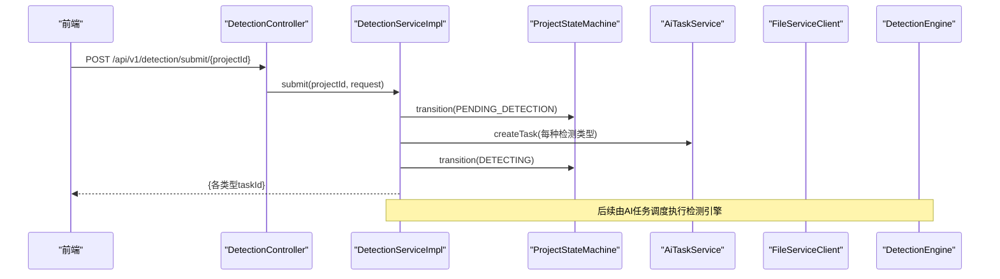
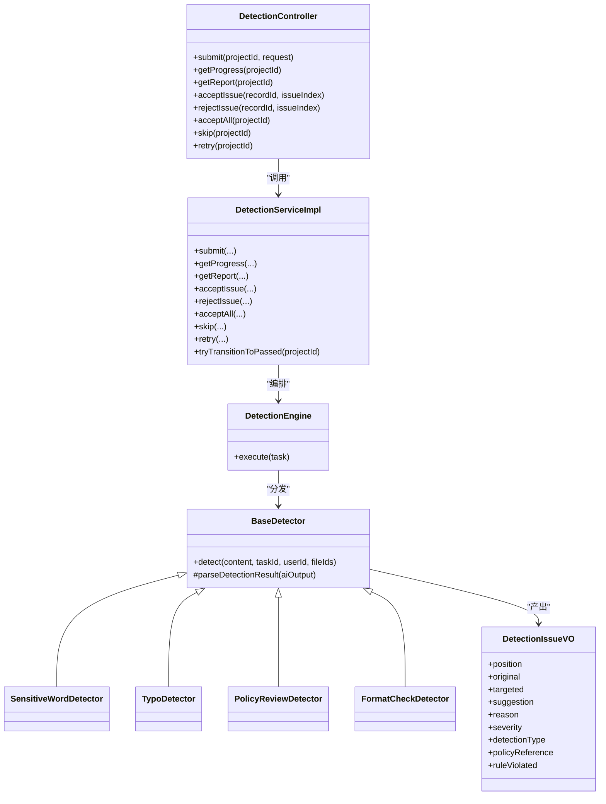
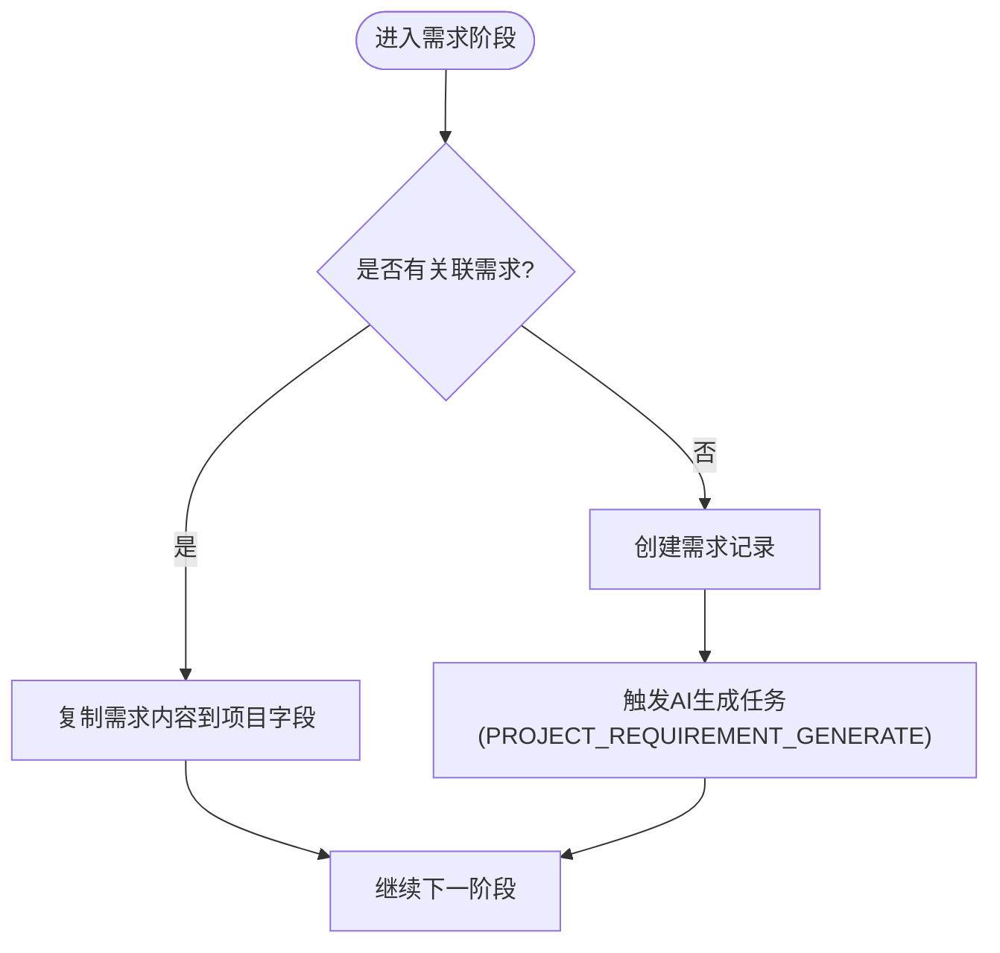
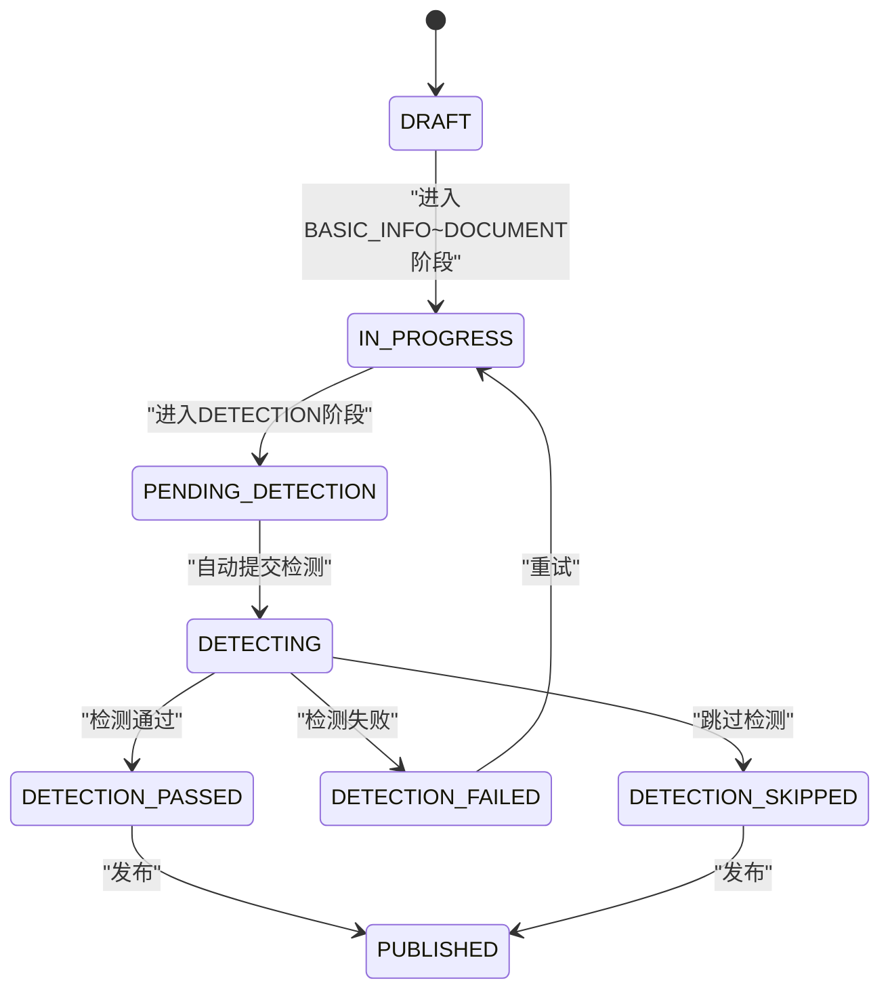
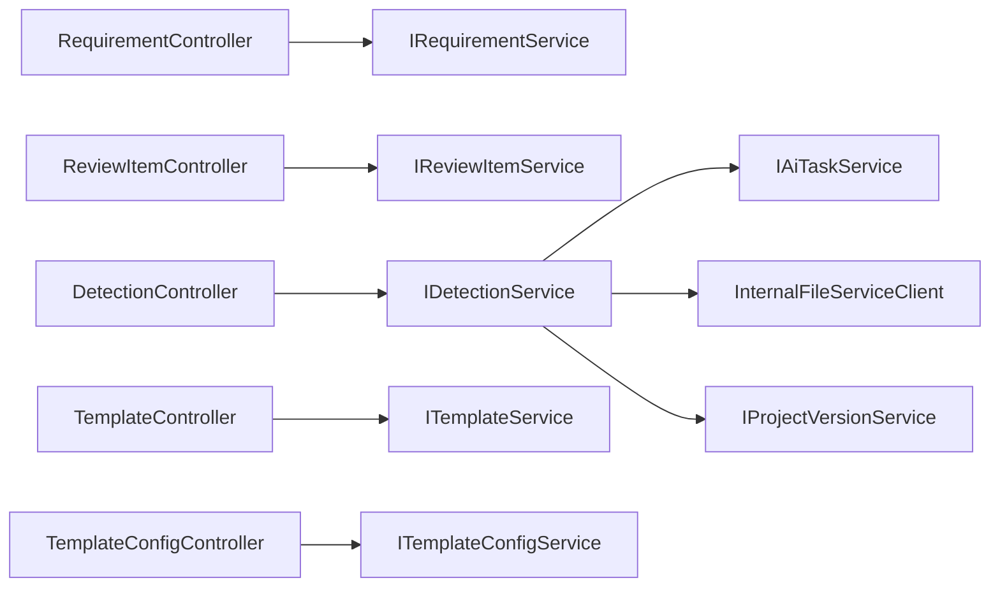

# 业务功能API

<cite>
**本文引用的文件**
- [RequirementController.java](file://ele-ai-tender-system/ele-ai-tender-core/src/main/java/com/jy/eleaitender/core/controller/RequirementController.java)
- [ReviewItemController.java](file://ele-ai-tender-system/ele-ai-tender-core/src/main/java/com/jy/eleaitender/core/controller/ReviewItemController.java)
- [DetectionController.java](file://ele-ai-tender-system/ele-ai-tender-core/src/main/java/com/jy/eleaitender/core/controller/DetectionController.java)
- [TemplateController.java](file://ele-ai-tender-system/ele-ai-tender-core/src/main/java/com/jy/eleaitender/core/controller/TemplateController.java)
- [TemplateConfigController.java](file://ele-ai-tender-system/ele-ai-tender-support/src/main/java/com/jy/eleaitender/support/controller/TemplateConfigController.java)
- [ITemplateConfigService.java](file://ele-ai-tender-system/ele-ai-tender-support/src/main/java/com/jy/eleaitender/support/service/ITemplateConfigService.java)
- [DocumentMatchController.java](file://ele-ai-tender-system/ele-ai-tender-ai/src/main/java/com/jy/eleaitender/ai/controller/DocumentMatchController.java)
- [DetectionServiceImpl.java](file://ele-ai-tender-system/ele-ai-tender-core/src/main/java/com/jy/eleaitender/core/service/impl/DetectionServiceImpl.java)
- [PhaseFlowController.java](file://ele-ai-tender-system/ele-ai-tender-core/src/main/java/com/jy/eleaitender/core/statemachine/PhaseFlowController.java)
- [DetectionEngine.java](file://ele-ai-tender-system/ele-ai-tender-ai/src/main/java/com/jy/eleaitender/ai/processor/checker/DetectionEngine.java)
- [BaseDetector.java](file://ele-ai-tender-system/ele-ai-tender-ai/src/main/java/com/jy/eleaitender/ai/processor/checker/BaseDetector.java)
- [SensitiveWordDetector.java](file://ele-ai-tender-system/ele-ai-tender-ai/src/main/java/com/jy/eleaitender/ai/processor/checker/SensitiveWordDetector.java)
- [TypoDetector.java](file://ele-ai-tender-system/ele-ai-tender-ai/src/main/java/com/jy/eleaitender/ai/processor/checker/TypoDetector.java)
- [PolicyReviewDetector.java](file://ele-ai-tender-system/ele-ai-tender-ai/src/main/java/com/jy/eleaitender/ai/processor/checker/PolicyReviewDetector.java)
- [DetectionIssueVO.java](file://ele-ai-tender-system/ele-ai-tender-ai/src/main/java/com/jy/eleaitender/ai/dto/response/DetectionIssueVO.java)
- [DetectionParams.java](file://ele-ai-tender-system/ele-ai-tender-common/src/main/java/com/jy/eleaitender/common/dto/ai/DetectionParams.java)
- [CORE_MODULE_SPEC.md](file://docs/rules/CORE_MODULE_SPEC.md)
- [PHASE_FLOW_SPEC.md](file://docs/rules/PHASE_FLOW_SPEC.md)
</cite>

## 目录
1. [简介](#简介)
2. [项目结构](#项目结构)
3. [核心组件](#核心组件)
4. [架构总览](#架构总览)
5. [详细组件分析](#详细组件分析)
6. [依赖关系分析](#依赖关系分析)
7. [性能与可扩展性](#性能与可扩展性)
8. [故障排查指南](#故障排查指南)
9. [结论](#结论)
10. [附录：接口清单](#附录接口清单)

## 简介
本文件聚焦“业务功能API模块”的封装实现，覆盖以下关键能力：
- 智能检测：文档合规性检测、相似度分析、风险评估的检测引擎接口与编排流程。
- 需求管理：需求文档的生成、编辑、版本控制工作流API。
- 审核流程：状态机管理、审批节点配置、意见收集等（评审项树与AI生成）。
- 模板管理：模板库管理、自定义模板开发、模板应用的业务逻辑。

## 项目结构
后端采用多模块分层组织：
- core 模块：核心业务控制器与服务（需求、评审项、检测、阶段流程、模板读取）。
- ai 模块：AI任务处理与检测引擎（检测器、结果解析、模型路由）。
- support 模块：支撑服务（模板配置、系统参数、权限等）。
- common 模块：通用DTO、枚举、异常、安全注解等。

图表来源
- [RequirementController.java:1-196](file://ele-ai-tender-system/ele-ai-tender-core/src/main/java/com/jy/eleaitender/core/controller/RequirementController.java#L1-L196)
- [ReviewItemController.java:1-90](file://ele-ai-tender-system/ele-ai-tender-core/src/main/java/com/jy/eleaitender/core/controller/ReviewItemController.java#L1-L90)
- [DetectionController.java:1-90](file://ele-ai-tender-system/ele-ai-tender-core/src/main/java/com/jy/eleaitender/core/controller/DetectionController.java#L1-L90)
- [TemplateController.java:1-52](file://ele-ai-tender-system/ele-ai-tender-core/src/main/java/com/jy/eleaitender/core/controller/TemplateController.java#L1-L52)
- [TemplateConfigController.java:1-81](file://ele-ai-tender-system/ele-ai-tender-support/src/main/java/com/jy/eleaitender/support/controller/TemplateConfigController.java#L1-L81)
- [ITemplateConfigService.java:1-16](file://ele-ai-tender-system/ele-ai-tender-support/src/main/java/com/jy/eleaitender/support/service/ITemplateConfigService.java#L1-L16)
- [DocumentMatchController.java:1-49](file://ele-ai-tender-system/ele-ai-tender-ai/src/main/java/com/jy/eleaitender/ai/controller/DocumentMatchController.java#L1-L49)
- [DetectionServiceImpl.java:1-578](file://ele-ai-tender-system/ele-ai-tender-core/src/main/java/com/jy/eleaitender/core/service/impl/DetectionServiceImpl.java#L1-L578)
- [DetectionEngine.java:1-50](file://ele-ai-tender-system/ele-ai-tender-ai/src/main/java/com/jy/eleaitender/ai/processor/checker/DetectionEngine.java#L1-L50)
- [BaseDetector.java:1-129](file://ele-ai-tender-system/ele-ai-tender-ai/src/main/java/com/jy/eleaitender/ai/processor/checker/BaseDetector.java#L1-L129)
- [SensitiveWordDetector.java:1-36](file://ele-ai-tender-system/ele-ai-tender-ai/src/main/java/com/jy/eleaitender/ai/processor/checker/SensitiveWordDetector.java#L1-L36)
- [TypoDetector.java:1-37](file://ele-ai-tender-system/ele-ai-tender-ai/src/main/java/com/jy/eleaitender/ai/processor/checker/TypoDetector.java#L1-L37)
- [PolicyReviewDetector.java:1-37](file://ele-ai-tender-system/ele-ai-tender-ai/src/main/java/com/jy/eleaitender/ai/processor/checker/PolicyReviewDetector.java#L1-L37)
- [DetectionParams.java:1-16](file://ele-ai-tender-system/ele-ai-tender-common/src/main/java/com/jy/eleaitender/common/dto/ai/DetectionParams.java#L1-L16)
- [DetectionIssueVO.java:1-39](file://ele-ai-tender-system/ele-ai-tender-ai/src/main/java/com/jy/eleaitender/ai/dto/response/DetectionIssueVO.java#L1-L39)

章节来源
- [CORE_MODULE_SPEC.md:30-85](file://docs/rules/CORE_MODULE_SPEC.md#L30-L85)
- [PHASE_FLOW_SPEC.md:1-56](file://docs/rules/PHASE_FLOW_SPEC.md#L1-L56)

## 核心组件
- 需求管理API：提供分页查询、详情、创建/更新/删除、匹配历史模板、AI生成、自动保存草稿、提交检测、接受/拒绝建议、完成检测、导出文档等能力。
- 评审项管理API：提供创建、树形查询、更新/删除、批量操作、替换全部、AI生成评审项等能力。
- 智能检测API：提供提交最终文档检测、进度查询、报告获取、单条/批量接受或拒绝建议、跳过检测、重试检测等能力。
- 模板管理API：
  - 业务侧只读：分页查询、详情、按类别/类型获取默认模板。
  - 配置侧管理：分页查询、详情、创建/更新/删除、设为默认、设置状态。
- 文档匹配API：提供自动匹配与手动选择候选列表（当前为占位实现）。

章节来源
- [RequirementController.java:1-196](file://ele-ai-tender-system/ele-ai-tender-core/src/main/java/com/jy/eleaitender/core/controller/RequirementController.java#L1-L196)
- [ReviewItemController.java:1-90](file://ele-ai-tender-system/ele-ai-tender-core/src/main/java/com/jy/eleaitender/core/controller/ReviewItemController.java#L1-L90)
- [DetectionController.java:1-90](file://ele-ai-tender-system/ele-ai-tender-core/src/main/java/com/jy/eleaitender/core/controller/DetectionController.java#L1-L90)
- [TemplateController.java:1-52](file://ele-ai-tender-system/ele-ai-tender-core/src/main/java/com/jy/eleaitender/core/controller/TemplateController.java#L1-L52)
- [TemplateConfigController.java:1-81](file://ele-ai-tender-system/ele-ai-tender-support/src/main/java/com/jy/eleaitender/support/controller/TemplateConfigController.java#L1-L81)
- [DocumentMatchController.java:1-49](file://ele-ai-tender-system/ele-ai-tender-ai/src/main/java/com/jy/eleaitender/ai/controller/DocumentMatchController.java#L1-L49)

## 架构总览
整体采用“控制器→服务→引擎/外部服务”的分层模式：
- 控制器负责入参校验、鉴权、返回统一Result包装。
- 服务层编排业务流程（如检测提交、进度聚合、报告汇总、状态机联动）。
- AI检测引擎通过检测器基类统一调用模型路由、记录调用、解析结果。
- 阶段流程控制器驱动项目阶段推进，并在进入特定阶段时触发AI任务或检测。

图表来源
- [DetectionController.java:27-33](file://ele-ai-tender-system/ele-ai-tender-core/src/main/java/com/jy/eleaitender/core/controller/DetectionController.java#L27-L33)
- [DetectionServiceImpl.java:86-143](file://ele-ai-tender-system/ele-ai-tender-core/src/main/java/com/jy/eleaitender/core/service/impl/DetectionServiceImpl.java#L86-L143)
- [DetectionEngine.java:1-50](file://ele-ai-tender-system/ele-ai-tender-ai/src/main/java/com/jy/eleaitender/ai/processor/checker/DetectionEngine.java#L1-L50)

## 详细组件分析

### 智能检测子系统
- 入口控制器：提供提交检测、进度、报告、接受/拒绝建议、一键接受、跳过、重试等接口。
- 服务实现：
  - 提交检测：根据项目内容+评审项构建检测文本，为敏感词、错别字、政策审查、格式规范四种类型分别创建检测记录与AI任务；无政策文件则跳过政策审查；状态经状态机流转至PENDING_DETECTION→DETECTING。
  - 进度聚合：汇总各类型任务的完成度、问题数、评分，计算总体状态。
  - 报告聚合：合并所有检测记录的问题，统计总数并给出通过/失败结论。
  - 接受/拒绝建议：对单个问题标记处理状态，必要时调用文件服务修复文档；当所有问题已处理时自动转为通过并创建版本快照。
  - 重试：将失败记录重置为待处理，重新创建AI任务，并通过状态机回到检测中。
- 检测引擎：
  - 检测器基类：统一模型路由、调用记录、JSON结果解析、错误兜底。
  - 具体检测器：敏感词、错别字、政策审查、格式检查各自定义检测类型与提示词模板。
  - 检测结果VO：包含位置、原文、目标文本、建议、原因、严重级别、检测类型、政策引用、规则违反等信息。

图表来源
- [DetectionController.java:1-90](file://ele-ai-tender-system/ele-ai-tender-core/src/main/java/com/jy/eleaitender/core/controller/DetectionController.java#L1-L90)
- [DetectionServiceImpl.java:1-578](file://ele-ai-tender-system/ele-ai-tender-core/src/main/java/com/jy/eleaitender/core/service/impl/DetectionServiceImpl.java#L1-L578)
- [DetectionEngine.java:1-50](file://ele-ai-tender-system/ele-ai-tender-ai/src/main/java/com/jy/eleaitender/ai/processor/checker/DetectionEngine.java#L1-L50)
- [BaseDetector.java:1-129](file://ele-ai-tender-system/ele-ai-tender-ai/src/main/java/com/jy/eleaitender/ai/processor/checker/BaseDetector.java#L1-L129)
- [SensitiveWordDetector.java:1-36](file://ele-ai-tender-system/ele-ai-tender-ai/src/main/java/com/jy/eleaitender/ai/processor/checker/SensitiveWordDetector.java#L1-L36)
- [TypoDetector.java:1-37](file://ele-ai-tender-system/ele-ai-tender-ai/src/main/java/com/jy/eleaitender/ai/processor/checker/TypoDetector.java#L1-L37)
- [PolicyReviewDetector.java:1-37](file://ele-ai-tender-system/ele-ai-tender-ai/src/main/java/com/jy/eleaitender/ai/processor/checker/PolicyReviewDetector.java#L1-L37)
- [DetectionIssueVO.java:1-39](file://ele-ai-tender-system/ele-ai-tender-ai/src/main/java/com/jy/eleaitender/ai/dto/response/DetectionIssueVO.java#L1-L39)

章节来源
- [DetectionController.java:1-90](file://ele-ai-tender-system/ele-ai-tender-core/src/main/java/com/jy/eleaitender/core/controller/DetectionController.java#L1-L90)
- [DetectionServiceImpl.java:86-143](file://ele-ai-tender-system/ele-ai-tender-core/src/main/java/com/jy/eleaitender/core/service/impl/DetectionServiceImpl.java#L86-L143)
- [DetectionServiceImpl.java:289-394](file://ele-ai-tender-system/ele-ai-tender-core/src/main/java/com/jy/eleaitender/core/service/impl/DetectionServiceImpl.java#L289-L394)
- [DetectionServiceImpl.java:414-468](file://ele-ai-tender-system/ele-ai-tender-core/src/main/java/com/jy/eleaitender/core/service/impl/DetectionServiceImpl.java#L414-L468)
- [DetectionServiceImpl.java:527-552](file://ele-ai-tender-system/ele-ai-tender-core/src/main/java/com/jy/eleaitender/core/service/impl/DetectionServiceImpl.java#L527-L552)
- [DetectionEngine.java:1-50](file://ele-ai-tender-system/ele-ai-tender-ai/src/main/java/com/jy/eleaitender/ai/processor/checker/DetectionEngine.java#L1-L50)
- [BaseDetector.java:47-118](file://ele-ai-tender-system/ele-ai-tender-ai/src/main/java/com/jy/eleaitender/ai/processor/checker/BaseDetector.java#L47-L118)
- [DetectionIssueVO.java:1-39](file://ele-ai-tender-system/ele-ai-tender-ai/src/main/java/com/jy/eleaitender/ai/dto/response/DetectionIssueVO.java#L1-L39)

### 需求管理工作流API
- 生命周期：
  - 创建/更新/删除：基础CRUD。
  - 匹配历史模板：支持自动/手动匹配，回填到需求内容。
  - AI生成：提交异步任务，由AI模块生成需求内容。
  - 自动保存：草稿持久化与恢复。
  - 检测：提交敏感词+错别字检测，逐条接受/拒绝建议，完成后导出Word。
- 与阶段流程联动：
  - 进入需求阶段时，若未关联需求则自动创建并触发AI生成任务；完成后复制内容到项目字段供后续阶段使用。

图表来源
- [PHASE_FLOW_SPEC.md:27-36](file://docs/rules/PHASE_FLOW_SPEC.md#L27-L36)
- [RequirementController.java:100-115](file://ele-ai-tender-system/ele-ai-tender-core/src/main/java/com/jy/eleaitender/core/controller/RequirementController.java#L100-L115)

章节来源
- [RequirementController.java:38-98](file://ele-ai-tender-system/ele-ai-tender-core/src/main/java/com/jy/eleaitender/core/controller/RequirementController.java#L38-L98)
- [RequirementController.java:100-138](file://ele-ai-tender-system/ele-ai-tender-core/src/main/java/com/jy/eleaitender/core/controller/RequirementController.java#L100-L138)
- [RequirementController.java:140-180](file://ele-ai-tender-system/ele-ai-tender-core/src/main/java/com/jy/eleaitender/core/controller/RequirementController.java#L140-L180)
- [RequirementController.java:182-195](file://ele-ai-tender-system/ele-ai-tender-core/src/main/java/com/jy/eleaitender/core/controller/RequirementController.java#L182-L195)
- [CORE_MODULE_SPEC.md:30-50](file://docs/rules/CORE_MODULE_SPEC.md#L30-L50)
- [PHASE_FLOW_SPEC.md:27-36](file://docs/rules/PHASE_FLOW_SPEC.md#L27-L36)

### 评审项管理与审核流程
- 评审项树：按项目维度查询层级结构，支持批量创建/更新、替换全部。
- AI生成：从项目需求内容出发，自动生成评审项。
- 审核流程状态机：
  - 阶段推进：仅允许顺序推进，进入某阶段前需满足canComplete条件。
  - Phase-Status联动：进入编制阶段→IN_PROGRESS；进入检测阶段→PENDING_DETECTION→DETECTING；通过后→PUBLISHED。
  - 检测阶段onEnter：自动提交智能检测，结合政策文件进行合规性审查。

图表来源
- [PHASE_FLOW_SPEC.md:37-56](file://docs/rules/PHASE_FLOW_SPEC.md#L37-L56)
- [PhaseFlowController.java:128-167](file://ele-ai-tender-system/ele-ai-tender-core/src/main/java/com/jy/eleaitender/core/statemachine/PhaseFlowController.java#L128-L167)

章节来源
- [ReviewItemController.java:27-89](file://ele-ai-tender-system/ele-ai-tender-core/src/main/java/com/jy/eleaitender/core/controller/ReviewItemController.java#L27-L89)
- [PHASE_FLOW_SPEC.md:27-56](file://docs/rules/PHASE_FLOW_SPEC.md#L27-L56)
- [PhaseFlowController.java:57-96](file://ele-ai-tender-system/ele-ai-tender-core/src/main/java/com/jy/eleaitender/core/statemachine/PhaseFlowController.java#L57-L96)

### 模板管理
- 业务侧只读接口：
  - 分页查询模板列表（可按名称、项目类别、类型过滤）。
  - 获取模板详情。
  - 获取默认模板（按项目类别/类型）。
- 配置侧管理接口：
  - 分页查询、详情、创建、更新、删除。
  - 设为默认模板。
  - 设置模板状态（启用/停用）。
- 模板应用：
  - 需求匹配历史模板后，可基于模板结构填充需求内容。
  - 文档集成阶段可选择默认模板作为生成依据。

章节来源
- [TemplateController.java:24-51](file://ele-ai-tender-system/ele-ai-tender-core/src/main/java/com/jy/eleaitender/core/controller/TemplateController.java#L24-L51)
- [TemplateConfigController.java:21-80](file://ele-ai-tender-system/ele-ai-tender-support/src/main/java/com/jy/eleaitender/support/controller/TemplateConfigController.java#L21-L80)
- [ITemplateConfigService.java:6-15](file://ele-ai-tender-system/ele-ai-tender-support/src/main/java/com/jy/eleaitender/support/service/ITemplateConfigService.java#L6-L15)
- [RequirementController.java:100-108](file://ele-ai-tender-system/ele-ai-tender-core/src/main/java/com/jy/eleaitender/core/controller/RequirementController.java#L100-L108)

### 文档匹配与相似度分析
- 文档匹配控制器提供两个接口：
  - 自动匹配：根据输入上下文返回候选历史需求。
  - 手动选择：返回候选列表供用户挑选。
- 当前为占位实现，预留服务对接点以便接入相似度算法或检索引擎。

章节来源
- [DocumentMatchController.java:30-46](file://ele-ai-tender-system/ele-ai-tender-ai/src/main/java/com/jy/eleaitender/ai/controller/DocumentMatchController.java#L30-L46)

## 依赖关系分析
- 控制器依赖服务：
  - RequirementController → IRequirementService
  - ReviewItemController → IReviewItemService
  - DetectionController → IDetectionService
  - TemplateController → ITemplateService
  - TemplateConfigController → ITemplateConfigService
- 服务依赖：
  - DetectionServiceImpl 依赖 AiTaskService、FileServiceClient、Mapper、MessageHelper、VersionService。
  - 检测引擎依赖 ModelRouter、GenerateResultParser、ObjectMapper、AiCallRecorder。
- 外部集成：
  - 文件服务：用于文档预览、修复、下载。
  - AI服务：通过模型路由与任务调度执行检测。

图表来源
- [RequirementController.java:35-36](file://ele-ai-tender-system/ele-ai-tender-core/src/main/java/com/jy/eleaitender/core/controller/RequirementController.java#L35-L36)
- [ReviewItemController.java:24-25](file://ele-ai-tender-system/ele-ai-tender-core/src/main/java/com/jy/eleaitender/core/controller/ReviewItemController.java#L24-L25)
- [DetectionController.java:24-25](file://ele-ai-tender-system/ele-ai-tender-core/src/main/java/com/jy/eleaitender/core/controller/DetectionController.java#L24-L25)
- [TemplateController.java:21-22](file://ele-ai-tender-system/ele-ai-tender-core/src/main/java/com/jy/eleaitender/core/controller/TemplateController.java#L21-L22)
- [TemplateConfigController.java:18-19](file://ele-ai-tender-system/ele-ai-tender-support/src/main/java/com/jy/eleaitender/support/controller/TemplateConfigController.java#L18-L19)
- [DetectionServiceImpl.java:49-74](file://ele-ai-tender-system/ele-ai-tender-core/src/main/java/com/jy/eleaitender/core/service/impl/DetectionServiceImpl.java#L49-L74)

章节来源
- [DetectionServiceImpl.java:49-74](file://ele-ai-tender-system/ele-ai-tender-core/src/main/java/com/jy/eleaitender/core/service/impl/DetectionServiceImpl.java#L49-L74)

## 性能与可扩展性
- 检测任务并行：
  - 四种检测类型独立创建AI任务，便于并行执行与独立重试。
- 结果解析容错：
  - 基类在解析失败时返回空问题集与错误信息，避免阻断主流程。
- 状态机一致性：
  - 通过状态机强制转换，避免非法状态跳跃，保证前后端一致。
- 扩展点：
  - 新增检测类型只需实现BaseDetector并注册到引擎；
  - 模板应用可通过默认模板策略与匹配算法扩展。

[本节为通用指导，不直接分析具体文件]

## 故障排查指南
- 阶段推进失败：
  - 检查是否跳过中间阶段或当前阶段未完成。
- 检测重试后状态不对：
  - 确认重试方法走状态机而非直接设值。
- 需求阶段内容为空：
  - 检查是否已关联需求且content非空；若无关联，查看AI生成任务状态。
- AI任务未自动触发：
  - 查看触发器onEnter日志与Service异常。
- 状态与阶段不一致：
  - 检查syncProjectStatus逻辑与日志。

章节来源
- [PHASE_FLOW_SPEC.md:193-206](file://docs/rules/PHASE_FLOW_SPEC.md#L193-L206)

## 结论
本模块围绕“需求—评审—文档—检测—发布”的主线，提供了完整的API封装与状态机保障。检测引擎以插件化方式扩展，模板管理兼顾业务只读与配置管理，评审项支持AI生成与树形管理。整体设计强调一致性、可观测性与可扩展性，便于后续引入更多检测维度与模板策略。

[本节为总结，不直接分析具体文件]

## 附录：接口清单
- 需求管理
  - GET /api/v1/requirements
  - GET /api/v1/requirements/{id}
  - POST /api/v1/requirements
  - PUT /api/v1/requirements/{id}
  - DELETE /api/v1/requirements/{id}
  - GET /api/v1/requirements/match-files
  - POST /api/v1/requirements/{id}/match
  - POST /api/v1/requirements/{id}/generate
  - POST /api/v1/requirements/{id}/auto-save
  - GET /api/v1/requirements/{id}/auto-save
  - DELETE /api/v1/requirements/{id}/auto-save
  - POST /api/v1/requirements/{id}/detect
  - POST /api/v1/requirements/{id}/detect/{recordId}/accept
  - POST /api/v1/requirements/{id}/detect/{recordId}/reject
  - GET /api/v1/requirements/{id}/detect/records
  - POST /api/v1/requirements/{id}/detect/finish
  - GET /api/v1/requirements/{id}/export
- 评审项管理
  - POST /api/v1/review-items
  - GET /api/v1/review-items/{projectId}
  - PUT /api/v1/review-items/{id}
  - DELETE /api/v1/review-items/{id}
  - POST /api/v1/review-items/{projectId}/generate
  - POST /api/v1/review-items/batch
  - PUT /api/v1/review-items/batch
  - PUT /api/v1/review-items/{projectId}/replace
- 智能检测
  - POST /api/v1/detection/submit/{projectId}
  - GET /api/v1/detection/progress/{projectId}
  - GET /api/v1/detection/report/{projectId}
  - POST /api/v1/detection/{recordId}/accept
  - POST /api/v1/detection/{recordId}/reject
  - POST /api/v1/detection/accept-all/{projectId}
  - POST /api/v1/detection/skip/{projectId}
  - POST /api/v1/detection/retry/{projectId}
- 模板管理（业务只读）
  - GET /api/v1/templates
  - GET /api/v1/templates/{id}
  - GET /api/v1/templates/default
- 模板管理（配置管理）
  - GET /api/v1/template-configs
  - GET /api/v1/template-configs/{id}
  - POST /api/v1/template-configs
  - PUT /api/v1/template-configs/{id}
  - DELETE /api/v1/template-configs/{id}
  - POST /api/v1/template-configs/{id}/set-default
  - PUT /api/v1/template-configs/{id}/status
- 文档匹配
  - POST /api/v1/ai/match/auto
  - POST /api/v1/ai/match/manual

章节来源
- [CORE_MODULE_SPEC.md:30-85](file://docs/rules/CORE_MODULE_SPEC.md#L30-L85)
- [RequirementController.java:38-195](file://ele-ai-tender-system/ele-ai-tender-core/src/main/java/com/jy/eleaitender/core/controller/RequirementController.java#L38-L195)
- [ReviewItemController.java:27-89](file://ele-ai-tender-system/ele-ai-tender-core/src/main/java/com/jy/eleaitender/core/controller/ReviewItemController.java#L27-L89)
- [DetectionController.java:27-89](file://ele-ai-tender-system/ele-ai-tender-core/src/main/java/com/jy/eleaitender/core/controller/DetectionController.java#L27-L89)
- [TemplateController.java:24-51](file://ele-ai-tender-system/ele-ai-tender-core/src/main/java/com/jy/eleaitender/core/controller/TemplateController.java#L24-L51)
- [TemplateConfigController.java:21-80](file://ele-ai-tender-system/ele-ai-tender-support/src/main/java/com/jy/eleaitender/support/controller/TemplateConfigController.java#L21-L80)
- [DocumentMatchController.java:30-46](file://ele-ai-tender-system/ele-ai-tender-ai/src/main/java/com/jy/eleaitender/ai/controller/DocumentMatchController.java#L30-L46)