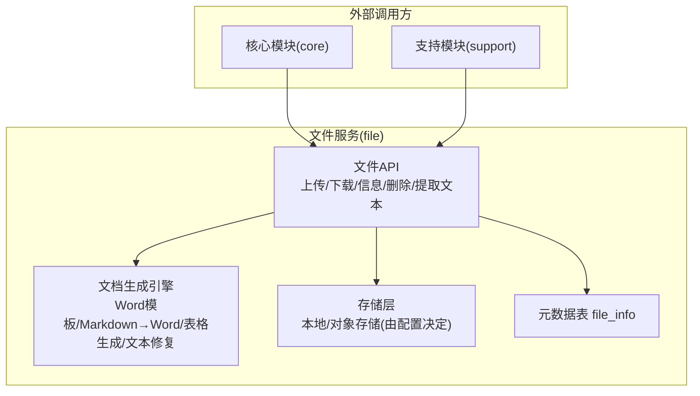
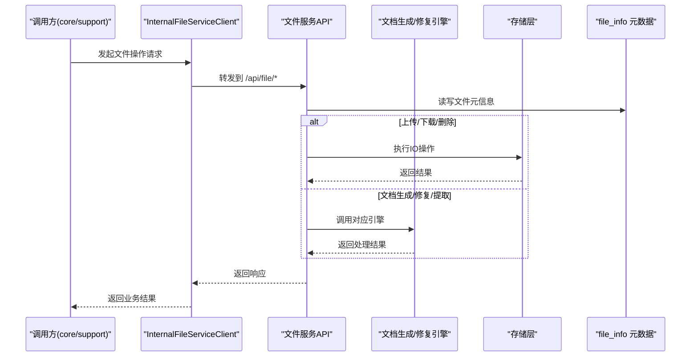
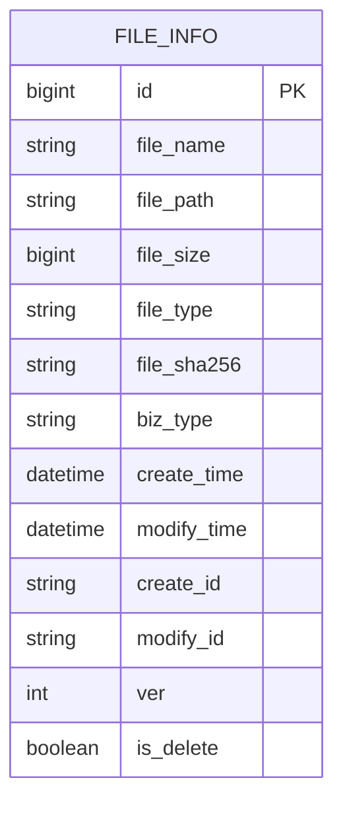
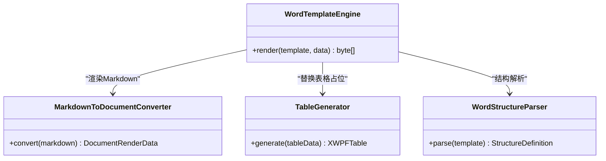
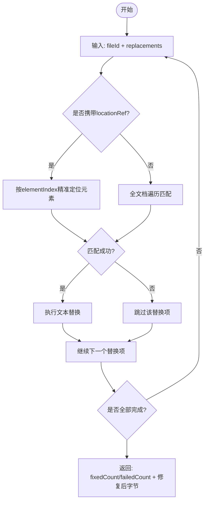
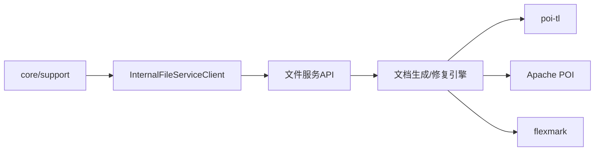

# 文档处理API

<cite>
**本文引用的文件**   
- [FILE_SERVICE_SPEC.md](file://docs/rules/FILE_SERVICE_SPEC.md)
</cite>

## 目录
1. [简介](#简介)
2. [项目结构](#项目结构)
3. [核心组件](#核心组件)
4. [架构总览](#架构总览)
5. [详细组件分析](#详细组件分析)
6. [依赖分析](#依赖分析)
7. [性能考虑](#性能考虑)
8. [故障排查指南](#故障排查指南)
9. [结论](#结论)
10. [附录](#附录)

## 简介
本模块为“文档处理API”提供统一能力，涵盖文件的上传、下载、信息查询与删除，以及文档生成与修复等处理能力。其目标是在企业级场景下，为上层业务（如核心流程、支持系统）提供稳定、可观测、可扩展的文件与文档处理能力，并支撑后续的大文件分片上传、断点续传、进度监控、多格式转换与预览、版本对比与协同编辑同步等企业级特性扩展。

## 项目结构
从规范视角看，文件服务模块（ele-ai-tender-file）对外暴露统一的文件操作接口，并通过内部客户端被 core/support 模块调用；同时内置文档生成引擎，用于将 Markdown 或 Word 模板渲染为最终文档。

图表来源
- [FILE_SERVICE_SPEC.md:1-153](file://docs/rules/FILE_SERVICE_SPEC.md#L1-L153)

章节来源
- [FILE_SERVICE_SPEC.md:1-153](file://docs/rules/FILE_SERVICE_SPEC.md#L1-L153)

## 核心组件
- 文件API
  - 上传：POST /api/file/upload
  - 下载：GET /api/file/download/{fileId}
  - 信息：GET /api/file/info/{fileId}
  - 删除：DELETE /api/file/delete/{fileId}
  - 文本提取：POST /api/file/extract-text
- 文档生成与修复
  - Word 模板填充与渲染（poi-tl）
  - Word 模板结构解析
  - Word 文档文本替换修复（基于 Apache POI）
  - Word 文本段落提取（含位置索引）
  - Markdown AST → DocumentRenderData 转换
  - 表格编程生成（POI）
- 内部服务调用
  - InternalFileServiceClient 封装对 File 服务的调用
  - 新增端点需在客户端中同步添加解析逻辑

章节来源
- [FILE_SERVICE_SPEC.md:1-153](file://docs/rules/FILE_SERVICE_SPEC.md#L1-L153)

## 架构总览
下图展示了文件服务在整体系统中的角色与交互关系，包括对外接口、内部客户端、文档引擎与存储层。

图表来源
- [FILE_SERVICE_SPEC.md:1-153](file://docs/rules/FILE_SERVICE_SPEC.md#L1-L153)

## 详细组件分析

### 文件API与元数据模型
- 接口清单
  - 上传：POST /api/file/upload
  - 下载：GET /api/file/download/{fileId}
  - 信息：GET /api/file/info/{fileId}
  - 删除：DELETE /api/file/delete/{fileId}
  - 文本提取：POST /api/file/extract-text
- 元数据表 file_info 关键字段
  - id、file_name、file_path、file_size、file_type、file_sha256、biz_type
  - 继承基础字段（创建/修改时间、操作人、版本号、软删除等）

图表来源
- [FILE_SERVICE_SPEC.md:94-108](file://docs/rules/FILE_SERVICE_SPEC.md#L94-L108)

章节来源
- [FILE_SERVICE_SPEC.md:8-17](file://docs/rules/FILE_SERVICE_SPEC.md#L8-L17)
- [FILE_SERVICE_SPEC.md:94-108](file://docs/rules/FILE_SERVICE_SPEC.md#L94-L108)

### 文档生成引擎（Word 模板与 Markdown）
- WordTemplateEngine：使用 poi-tl 原生引擎进行模板填充与渲染，禁止 useSpringEL()
- WordStructureParser：解析模板结构，提取占位符与结构定义
- MarkdownToDocumentConverter：flexmark 解析 Markdown AST 转换为渲染数据
- TableGenerator：通过 POI 编程生成表格（含边框），规避循环标签限制
- 两阶段渲染：先文本/图片/Markdown，再扫描占位段落用 TableGenerator 替换真实表格

图表来源
- [FILE_SERVICE_SPEC.md:18-66](file://docs/rules/FILE_SERVICE_SPEC.md#L18-L66)

章节来源
- [FILE_SERVICE_SPEC.md:18-66](file://docs/rules/FILE_SERVICE_SPEC.md#L18-L66)

### Word 文档修复与文本提取
- WordDocumentFixEngine：接收 .docx 字节与替换列表，基于 Apache POI 执行文本替换，返回修复后字节数组及成功/失败计数
- WordTextExtractor：从 XWPFDocument 提取段落级文本与位置索引，供检测定位回填
- 精准定位：支持 locationRef（elementIndex、tableIndex、rowIndex、cellIndex）优先匹配，否则降级全文档匹配
- 两级匹配：精确匹配优先，规范化匹配兜底

图表来源
- [FILE_SERVICE_SPEC.md:73-92](file://docs/rules/FILE_SERVICE_SPEC.md#L73-L92)

章节来源
- [FILE_SERVICE_SPEC.md:73-92](file://docs/rules/FILE_SERVICE_SPEC.md#L73-L92)

### 内部服务调用约束
- InternalFileServiceClient 负责 core/support 对 File 服务的调用
- 错误响应处理：必须检查 code 字段，非 200 时提取 message 抛出具体错误
- 服务间认证：使用 TOKEN_TYPE_SERVICE 类型的 JWT，密钥复用 APP_JWT_SECRET
- 新增端点：/api/file/structure/{fileId}、/api/file/generate-doc、/api/file/fix-doc、/api/file/extract-text 需在客户端中同步添加解析逻辑
- ObjectMapper 复用：必须为 static final 常量，禁止每次方法调用 new ObjectMapper()
- fix-doc 参数反序列化：replacements 必须使用 Map<String, Object>，避免嵌套 locationRef 丢失

章节来源
- [FILE_SERVICE_SPEC.md:129-138](file://docs/rules/FILE_SERVICE_SPEC.md#L129-L138)

## 依赖分析
- 模块耦合
  - core/support 通过 InternalFileServiceClient 依赖 file 服务
  - file 服务内部依赖文档生成引擎与存储层
- 外部依赖
  - poi-tl（≥1.12.2）
  - Apache POI（XWPFDocument）
  - flexmark（Markdown AST）
- 关键约束
  - 禁止使用 SpringEL，避免 Map 访问异常
  - 修订标记预处理：渲染前接受所有修订，避免编译期索引错乱
  - 表格默认无边框，需显式设置六边边框

图表来源
- [FILE_SERVICE_SPEC.md:18-66](file://docs/rules/FILE_SERVICE_SPEC.md#L18-L66)
- [FILE_SERVICE_SPEC.md:129-138](file://docs/rules/FILE_SERVICE_SPEC.md#L129-L138)

章节来源
- [FILE_SERVICE_SPEC.md:18-66](file://docs/rules/FILE_SERVICE_SPEC.md#L18-L66)
- [FILE_SERVICE_SPEC.md:129-138](file://docs/rules/FILE_SERVICE_SPEC.md#L129-L138)

## 性能考虑
- 大文件上传与分片
  - 当前规范未实现分片上传与断点续传，建议引入分片上传、MD5/SHA-256 校验、断点状态持久化与并发合并策略
- 进度监控
  - 建议在上传过程中通过 Redis 记录分片进度，前端轮询或 WebSocket 推送
- 文档生成优化
  - 预解析模板结构，缓存结构定义
  - 表格批量生成，减少 IO 次数
  - 合理使用流式读取/写入，降低内存占用
- 文本提取与修复
  - 对大型文档采用分段处理与并行策略，注意线程安全与资源释放

[本节为通用指导，不直接分析具体文件]

## 故障排查指南
- 上传失败
  - 检查文件扩展名是否在白名单内、文件大小是否超过 500MB、file.storage.base-path 目录是否有写权限
- 下载 404
  - 确认 file_info.file_path 对应文件在磁盘上实际存在，检查 file.storage.base-path 配置是否正确
- fileSha256 校验失败
  - 确认调用方计算方式与服务端一致（SHA-256 十六进制字符串，UTF-8 编码）
- locationRef 定位失败
  - 检查 elementIndex 是否越界（段落/表格共享索引空间）、WordTextExtractor 是否已执行、DetectionResultParser.fillLocationRefs() 日志是否报匹配失败
- 检测修复替换了错误位置
  - 检查 FixReplacement.locationRef 是否为空（为空走全文档替换会替换所有匹配项）、elementIndex 对应的 IBodyElement 类型是否与 type 字段一致

章节来源
- [FILE_SERVICE_SPEC.md:139-146](file://docs/rules/FILE_SERVICE_SPEC.md#L139-L146)

## 结论
文件服务模块以统一 API 与内置文档引擎为核心，为上层业务提供稳定的文件与文档处理能力。当前规范明确了接口、引擎约束与内部调用约定，为后续扩展大文件分片上传、断点续传、进度监控、版本对比与协同编辑等能力奠定了坚实基础。

[本节为总结性内容，不直接分析具体文件]

## 附录

### 接口清单与说明
- POST /api/file/upload
  - 必填：file、bizType
  - 默认最大文件大小：500MB
  - 白名单：.doc/.docx/.pdf/.txt/.md/.jar/.war/.zip/.tar.gz
- GET /api/file/download/{fileId}
- GET /api/file/info/{fileId}
- DELETE /api/file/delete/{fileId}
- POST /api/file/extract-text
  - 入参：{fileId}
  - 出参：{fullText, segments}

章节来源
- [FILE_SERVICE_SPEC.md:8-17](file://docs/rules/FILE_SERVICE_SPEC.md#L8-L17)
- [FILE_SERVICE_SPEC.md:110-121](file://docs/rules/FILE_SERVICE_SPEC.md#L110-L121)
- [FILE_SERVICE_SPEC.md:86-92](file://docs/rules/FILE_SERVICE_SPEC.md#L86-L92)

### 模板与渲染要点
- 必须使用原生引擎，禁止 useSpringEL()
- 占位符语法：{{变量名}}，支持中英文变量名
- 完整标签语法：文本、循环、图片、包含、条件
- AI 常见标签错误对照与修正
- 两阶段渲染与表格生成约束
- 模板修订标记预处理（接受所有修订）
- poi-tl 版本要求 ≥1.12.2

章节来源
- [FILE_SERVICE_SPEC.md:33-71](file://docs/rules/FILE_SERVICE_SPEC.md#L33-L71)

### 内部调用与排障原则
- InternalFileServiceClient 的错误响应处理、服务间认证、ObjectMapper 复用、fix-doc 参数反序列化注意事项
- 排障原则：上传失败、下载 404、fileSha256 校验失败、locationRef 定位失败、检测修复替换错误位置的排查步骤

章节来源
- [FILE_SERVICE_SPEC.md:129-146](file://docs/rules/FILE_SERVICE_SPEC.md#L129-L146)