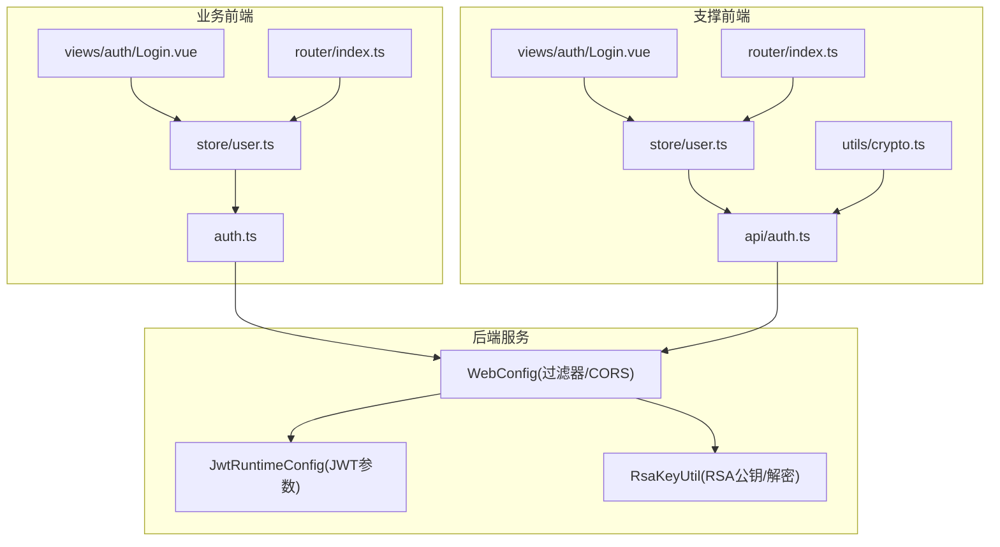
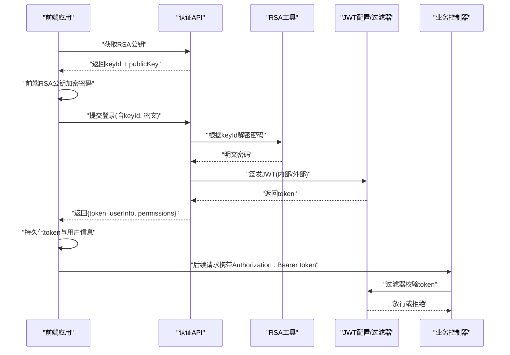
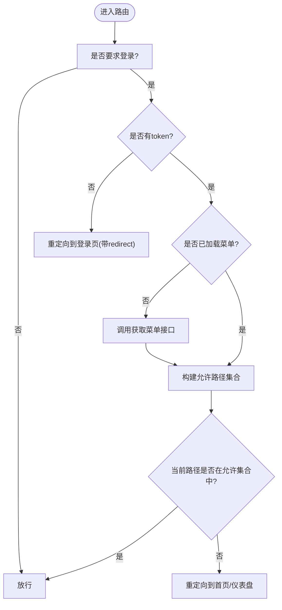
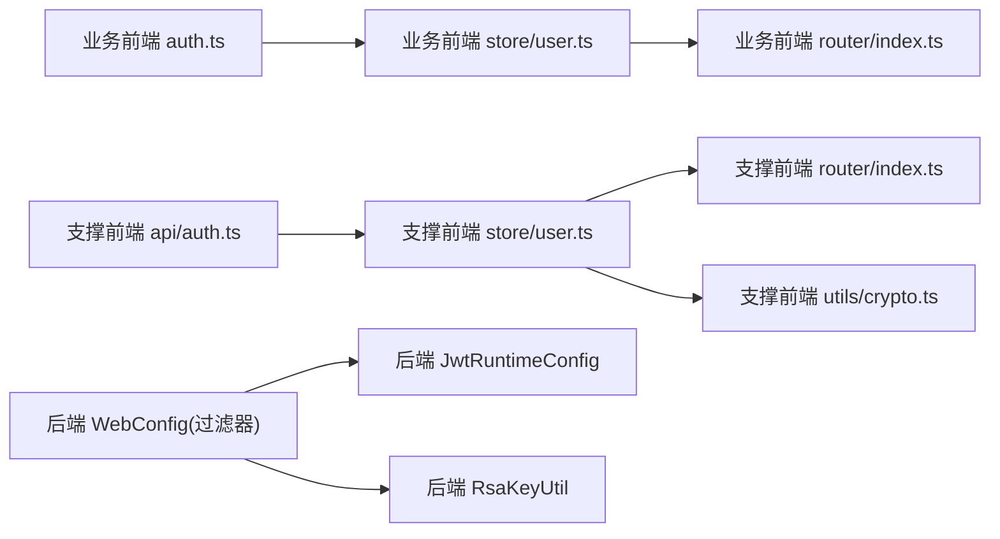

# 认证授权API

<cite>
**本文引用的文件**   
- [ele-ai-tender-frontend/src/api/auth.ts](file://ele-ai-tender-frontend/src/api/auth.ts)
- [ele-ai-tender-support-frontend/src/api/auth.ts](file://ele-ai-tender-support-frontend/src/api/auth.ts)
- [ele-ai-tender-frontend/src/views/auth/Login.vue](file://ele-ai-tender-frontend/src/views/auth/Login.vue)
- [ele-ai-tender-support-frontend/src/views/auth/Login.vue](file://ele-ai-tender-support-frontend/src/views/auth/Login.vue)
- [ele-ai-tender-frontend/src/store/user.ts](file://ele-ai-tender-frontend/src/store/user.ts)
- [ele-ai-tender-support-frontend/src/store/user.ts](file://ele-ai-tender-support-frontend/src/store/user.ts)
- [ele-ai-tender-frontend/src/router/index.ts](file://ele-ai-tender-frontend/src/router/index.ts)
- [ele-ai-tender-support-frontend/src/router/index.ts](file://ele-ai-tender-support-frontend/src/router/index.ts)
- [ele-ai-tender-frontend/src/utils/auth.ts](file://ele-ai-tender-frontend/src/utils/auth.ts)
- [ele-ai-tender-support-frontend/src/utils/crypto.ts](file://ele-ai-tender-support-frontend/src/utils/crypto.ts)
- [ele-ai-tender-system/ele-ai-tender-support/src/main/java/com/jy/eleaitender/support/config/WebConfig.java](file://ele-ai-tender-system/ele-ai-tender-support/src/main/java/com/jy/eleaitender/support/config/WebConfig.java)
- [ele-ai-tender-system/ele-ai-tender-ai/src/main/java/com/jy/eleaitender/ai/config/WebConfig.java](file://ele-ai-tender-system/ele-ai-tender-ai/src/main/java/com/jy/eleaitender/ai/config/WebConfig.java)
- [ele-ai-tender-system/ele-ai-tender-common/src/main/java/com/jy/eleaitender/common/util/RsaKeyUtil.java](file://ele-ai-tender-system/ele-ai-tender-common/src/main/java/com/jy/eleaitender/common/util/RsaKeyUtil.java)
- [ele-ai-tender-system/ele-ai-tender-support/src/main/java/com/jy/eleaitender/support/config/JwtRuntimeConfig.java](file://ele-ai-tender-system/ele-ai-tender-support/src/main/java/com/jy/eleaitender/support/config/JwtRuntimeConfig.java)
</cite>

## 目录
1. [简介](#简介)
2. [项目结构](#项目结构)
3. [核心组件](#核心组件)
4. [架构总览](#架构总览)
5. [详细组件分析](#详细组件分析)
6. [依赖关系分析](#依赖关系分析)
7. [性能与可扩展性](#性能与可扩展性)
8. [故障排查指南](#故障排查指南)
9. [结论](#结论)
10. [附录：接口清单与安全建议](#附录接口清单与安全建议)

## 简介
本文件聚焦于认证授权模块，覆盖前后端在用户登录、注册（以短信验证码为主）、密码重置、修改密码等核心流程的封装实现；详细说明JWT Token的获取、存储、刷新与清除策略；解释权限验证中间件、路由守卫与动态菜单加载逻辑；并给出用户状态管理、会话保持与多设备登录的处理方案，以及安全最佳实践（敏感信息保护、CSRF防护等）。

## 项目结构
认证授权相关代码分布在两个前端应用与后端公共能力中：
- 业务前端（ele-ai-tender-frontend）：提供手机号+验证码登录、RSA公钥获取、密码加密传输、用户信息与菜单拉取、登出等。
- 支撑前端（ele-ai-tender-support-frontend）：提供用户名+密码登录、RSA公钥获取、用户信息与菜单拉取、权限提取、登出等。
- 后端（support/ai 等模块）：统一通过过滤器进行JWT校验，支持内部/外部Token类型；提供RSA公钥分发与解密能力；配置JWT过期策略。

图表来源
- [ele-ai-tender-frontend/src/api/auth.ts:1-105](file://ele-ai-tender-frontend/src/api/auth.ts#L1-L105)
- [ele-ai-tender-frontend/src/store/user.ts:1-75](file://ele-ai-tender-frontend/src/store/user.ts#L1-L75)
- [ele-ai-tender-frontend/src/router/index.ts:1-132](file://ele-ai-tender-frontend/src/router/index.ts#L1-L132)
- [ele-ai-tender-frontend/src/views/auth/Login.vue:1-332](file://ele-ai-tender-frontend/src/views/auth/Login.vue#L1-L332)
- [ele-ai-tender-support-frontend/src/api/auth.ts:1-58](file://ele-ai-tender-support-frontend/src/api/auth.ts#L1-L58)
- [ele-ai-tender-support-frontend/src/store/user.ts:1-122](file://ele-ai-tender-support-frontend/src/store/user.ts#L1-L122)
- [ele-ai-tender-support-frontend/src/router/index.ts:1-219](file://ele-ai-tender-support-frontend/src/router/index.ts#L1-L219)
- [ele-ai-tender-support-frontend/src/views/auth/Login.vue:1-238](file://ele-ai-tender-support-frontend/src/views/auth/Login.vue#L1-L238)
- [ele-ai-tender-support-frontend/src/utils/crypto.ts:1-24](file://ele-ai-tender-support-frontend/src/utils/crypto.ts#L1-L24)
- [ele-ai-tender-system/ele-ai-tender-support/src/main/java/com/jy/eleaitender/support/config/WebConfig.java:30-61](file://ele-ai-tender-system/ele-ai-tender-support/src/main/java/com/jy/eleaitender/support/config/WebConfig.java#L30-L61)
- [ele-ai-tender-system/ele-ai-tender-ai/src/main/java/com/jy/eleaitender/ai/config/WebConfig.java:1-33](file://ele-ai-tender-system/ele-ai-tender-ai/src/main/java/com/jy/eleaitender/ai/config/WebConfig.java#L1-L33)
- [ele-ai-tender-system/ele-ai-tender-common/src/main/java/com/jy/eleaitender/common/util/RsaKeyUtil.java:45-95](file://ele-ai-tender-system/ele-ai-tender-common/src/main/java/com/jy/eleaitender/common/util/RsaKeyUtil.java#L45-L95)
- [ele-ai-tender-system/ele-ai-tender-support/src/main/java/com/jy/eleaitender/support/config/JwtRuntimeConfig.java:1-29](file://ele-ai-tender-system/ele-ai-tender-support/src/main/java/com/jy/eleaitender/support/config/JwtRuntimeConfig.java#L1-L29)

章节来源
- [ele-ai-tender-frontend/src/api/auth.ts:1-105](file://ele-ai-tender-frontend/src/api/auth.ts#L1-L105)
- [ele-ai-tender-support-frontend/src/api/auth.ts:1-58](file://ele-ai-tender-support-frontend/src/api/auth.ts#L1-L58)
- [ele-ai-tender-frontend/src/store/user.ts:1-75](file://ele-ai-tender-frontend/src/store/user.ts#L1-L75)
- [ele-ai-tender-support-frontend/src/store/user.ts:1-122](file://ele-ai-tender-support-frontend/src/store/user.ts#L1-L122)
- [ele-ai-tender-frontend/src/router/index.ts:1-132](file://ele-ai-tender-frontend/src/router/index.ts#L1-L132)
- [ele-ai-tender-support-frontend/src/router/index.ts:1-219](file://ele-ai-tender-support-frontend/src/router/index.ts#L1-L219)
- [ele-ai-tender-system/ele-ai-tender-support/src/main/java/com/jy/eleaitender/support/config/WebConfig.java:30-61](file://ele-ai-tender-system/ele-ai-tender-support/src/main/java/com/jy/eleaitender/support/config/WebConfig.java#L30-L61)
- [ele-ai-tender-system/ele-ai-tender-ai/src/main/java/com/jy/eleaitender/ai/config/WebConfig.java:1-33](file://ele-ai-tender-system/ele-ai-tender-ai/src/main/java/com/jy/eleaitender/ai/config/WebConfig.java#L1-L33)
- [ele-ai-tender-system/ele-ai-tender-common/src/main/java/com/jy/eleaitender/common/util/RsaKeyUtil.java:45-95](file://ele-ai-tender-system/ele-ai-tender-common/src/main/java/com/jy/eleaitender/common/util/RsaKeyUtil.java#L45-L95)
- [ele-ai-tender-system/ele-ai-tender-support/src/main/java/com/jy/eleaitender/support/config/JwtRuntimeConfig.java:1-29](file://ele-ai-tender-system/ele-ai-tender-support/src/main/java/com/jy/eleaitender/support/config/JwtRuntimeConfig.java#L1-L29)

## 核心组件
- 认证API封装
  - 业务前端：提供获取RSA公钥、账号密码登录（前端RSA加密）、发送短信验证码、手机验证码登录、短信重置密码、获取用户信息、获取用户菜单、修改密码、登出等。
  - 支撑前端：提供获取RSA公钥、账号密码登录（前端RSA加密）、获取用户信息、获取用户菜单、修改密码、登出等。
- 用户状态管理
  - 业务前端：使用Pinia store维护token、用户信息、权限，并在本地持久化。
  - 支撑前端：使用Pinia store维护token、用户信息、菜单、权限，并通过工具类进行持久化。
- 路由守卫与动态菜单
  - 业务前端：基于meta标记的简单鉴权守卫。
  - 支撑前端：结合用户菜单数据计算允许路径集合，进行细粒度访问控制。
- 后端安全
  - JWT运行时配置：集中注入密钥与过期时间。
  - Web过滤器：对/api/*路径进行JWT校验，支持内部/外部Token类型。
  - RSA工具：提供公钥分发与私钥解密，支持keyId轮换提示。

章节来源
- [ele-ai-tender-frontend/src/api/auth.ts:1-105](file://ele-ai-tender-frontend/src/api/auth.ts#L1-L105)
- [ele-ai-tender-support-frontend/src/api/auth.ts:1-58](file://ele-ai-tender-support-frontend/src/api/auth.ts#L1-L58)
- [ele-ai-tender-frontend/src/store/user.ts:1-75](file://ele-ai-tender-frontend/src/store/user.ts#L1-L75)
- [ele-ai-tender-support-frontend/src/store/user.ts:1-122](file://ele-ai-tender-support-frontend/src/store/user.ts#L1-L122)
- [ele-ai-tender-frontend/src/router/index.ts:117-129](file://ele-ai-tender-frontend/src/router/index.ts#L117-L129)
- [ele-ai-tender-support-frontend/src/router/index.ts:175-216](file://ele-ai-tender-support-frontend/src/router/index.ts#L175-L216)
- [ele-ai-tender-system/ele-ai-tender-support/src/main/java/com/jy/eleaitender/support/config/WebConfig.java:30-61](file://ele-ai-tender-system/ele-ai-tender-support/src/main/java/com/jy/eleaitender/support/config/WebConfig.java#L30-L61)
- [ele-ai-tender-system/ele-ai-tender-ai/src/main/java/com/jy/eleaitender/ai/config/WebConfig.java:1-33](file://ele-ai-tender-system/ele-ai-tender-ai/src/main/java/com/jy/eleaitender/ai/config/WebConfig.java#L1-L33)
- [ele-ai-tender-system/ele-ai-tender-common/src/main/java/com/jy/eleaitender/common/util/RsaKeyUtil.java:45-95](file://ele-ai-tender-system/ele-ai-tender-common/src/main/java/com/jy/eleaitender/common/util/RsaKeyUtil.java#L45-L95)
- [ele-ai-tender-system/ele-ai-tender-support/src/main/java/com/jy/eleaitender/support/config/JwtRuntimeConfig.java:1-29](file://ele-ai-tender-system/ele-ai-tender-support/src/main/java/com/jy/eleaitender/support/config/JwtRuntimeConfig.java#L1-L29)

## 架构总览
认证授权整体流程包含“前端登录表单 -> 调用认证API -> 服务端签发JWT -> 前端存储Token -> 后续请求携带Token -> 过滤器校验 -> 控制器处理”。

图表来源
- [ele-ai-tender-frontend/src/api/auth.ts:11-34](file://ele-ai-tender-frontend/src/api/auth.ts#L11-L34)
- [ele-ai-tender-support-frontend/src/api/auth.ts:10-19](file://ele-ai-tender-support-frontend/src/api/auth.ts#L10-L19)
- [ele-ai-tender-support-frontend/src/utils/crypto.ts:10-24](file://ele-ai-tender-support-frontend/src/utils/crypto.ts#L10-L24)
- [ele-ai-tender-system/ele-ai-tender-common/src/main/java/com/jy/eleaitender/common/util/RsaKeyUtil.java:45-95](file://ele-ai-tender-system/ele-ai-tender-common/src/main/java/com/jy/eleaitender/common/util/RsaKeyUtil.java#L45-L95)
- [ele-ai-tender-system/ele-ai-tender-support/src/main/java/com/jy/eleaitender/support/config/WebConfig.java:30-61](file://ele-ai-tender-system/ele-ai-tender-support/src/main/java/com/jy/eleaitender/support/config/WebConfig.java#L30-L61)
- [ele-ai-tender-system/ele-ai-tender-ai/src/main/java/com/jy/eleaitender/ai/config/WebConfig.java:16-32](file://ele-ai-tender-system/ele-ai-tender-ai/src/main/java/com/jy/eleaitender/ai/config/WebConfig.java#L16-L32)

## 详细组件分析

### 认证API封装（业务前端）
- 功能要点
  - 获取RSA公钥：用于前端对密码进行非对称加密。
  - 账号密码登录：先获取公钥，再加密密码后提交。
  - 短信验证码登录：直接提交手机号与验证码。
  - 短信重置密码：获取公钥后对新密码进行加密提交。
  - 获取用户信息与菜单：用于初始化用户态与动态菜单。
  - 修改密码：对旧密码与新密码分别加密后提交。
  - 登出：调用后端登出接口。
- 关键路径参考
  - [ele-ai-tender-frontend/src/api/auth.ts:11-34](file://ele-ai-tender-frontend/src/api/auth.ts#L11-L34)
  - [ele-ai-tender-frontend/src/api/auth.ts:49-66](file://ele-ai-tender-frontend/src/api/auth.ts#L49-L66)
  - [ele-ai-tender-frontend/src/api/auth.ts:78-98](file://ele-ai-tender-frontend/src/api/auth.ts#L78-L98)

章节来源
- [ele-ai-tender-frontend/src/api/auth.ts:11-34](file://ele-ai-tender-frontend/src/api/auth.ts#L11-L34)
- [ele-ai-tender-frontend/src/api/auth.ts:49-66](file://ele-ai-tender-frontend/src/api/auth.ts#L49-L66)
- [ele-ai-tender-frontend/src/api/auth.ts:78-98](file://ele-ai-tender-frontend/src/api/auth.ts#L78-L98)

### 认证API封装（支撑前端）
- 功能要点
  - 获取RSA公钥：用于前端对密码进行非对称加密。
  - 账号密码登录：前端RSA加密后提交。
  - 获取用户信息与菜单：用于初始化用户态与权限。
  - 修改密码：对旧密码与新密码分别加密后提交。
  - 登出：调用后端登出接口。
- 关键路径参考
  - [ele-ai-tender-support-frontend/src/api/auth.ts:10-19](file://ele-ai-tender-support-frontend/src/api/auth.ts#L10-L19)
  - [ele-ai-tender-support-frontend/src/api/auth.ts:31-51](file://ele-ai-tender-support-frontend/src/api/auth.ts#L31-L51)

章节来源
- [ele-ai-tender-support-frontend/src/api/auth.ts:10-19](file://ele-ai-tender-support-frontend/src/api/auth.ts#L10-L19)
- [ele-ai-tender-support-frontend/src/api/auth.ts:31-51](file://ele-ai-tender-support-frontend/src/api/auth.ts#L31-L51)

### 登录页面与交互流程
- 业务前端（手机号+验证码）
  - 发送验证码：支持倒计时与测试模式回显。
  - 验证码登录：调用store方法完成登录与跳转。
  - 参考路径
    - [ele-ai-tender-frontend/src/views/auth/Login.vue:129-178](file://ele-ai-tender-frontend/src/views/auth/Login.vue#L129-L178)
- 支撑前端（用户名+密码）
  - 表单校验：用户名长度、密码长度。
  - 登录成功后拉取菜单并跳转。
  - 参考路径
    - [ele-ai-tender-support-frontend/src/views/auth/Login.vue:93-110](file://ele-ai-tender-support-frontend/src/views/auth/Login.vue#L93-L110)

章节来源
- [ele-ai-tender-frontend/src/views/auth/Login.vue:129-178](file://ele-ai-tender-frontend/src/views/auth/Login.vue#L129-L178)
- [ele-ai-tender-support-frontend/src/views/auth/Login.vue:93-110](file://ele-ai-tender-support-frontend/src/views/auth/Login.vue#L93-L110)

### 用户状态管理与Token持久化
- 业务前端
  - 使用Pinia store维护token、用户信息、权限；登录后写入localStorage；提供登出清理。
  - 参考路径
    - [ele-ai-tender-frontend/src/store/user.ts:15-48](file://ele-ai-tender-frontend/src/store/user.ts#L15-L48)
    - [ele-ai-tender-frontend/src/utils/auth.ts:1-15](file://ele-ai-tender-frontend/src/utils/auth.ts#L1-L15)
- 支撑前端
  - 使用Pinia store维护token、用户信息、菜单、权限；通过storage工具类持久化；提供权限提取与检查。
  - 参考路径
    - [ele-ai-tender-support-frontend/src/store/user.ts:35-56](file://ele-ai-tender-support-frontend/src/store/user.ts#L35-L56)
    - [ele-ai-tender-support-frontend/src/store/user.ts:75-90](file://ele-ai-tender-support-frontend/src/store/user.ts#L75-L90)
    - [ele-ai-tender-support-frontend/src/store/user.ts:97-105](file://ele-ai-tender-support-frontend/src/store/user.ts#L97-L105)

章节来源
- [ele-ai-tender-frontend/src/store/user.ts:15-48](file://ele-ai-tender-frontend/src/store/user.ts#L15-L48)
- [ele-ai-tender-frontend/src/utils/auth.ts:1-15](file://ele-ai-tender-frontend/src/utils/auth.ts#L1-L15)
- [ele-ai-tender-support-frontend/src/store/user.ts:35-56](file://ele-ai-tender-support-frontend/src/store/user.ts#L35-L56)
- [ele-ai-tender-support-frontend/src/store/user.ts:75-90](file://ele-ai-tender-support-frontend/src/store/user.ts#L75-L90)
- [ele-ai-tender-support-frontend/src/store/user.ts:97-105](file://ele-ai-tender-support-frontend/src/store/user.ts#L97-L105)

### 路由守卫与动态菜单
- 业务前端
  - 基于meta.requiresAuth/guest进行基础鉴权；未登录访问受保护路由时重定向至登录页并携带redirect。
  - 参考路径
    - [ele-ai-tender-frontend/src/router/index.ts:117-129](file://ele-ai-tender-frontend/src/router/index.ts#L117-L129)
- 支撑前端
  - 登录态检查 + 首次拉取用户菜单 + 从菜单树收集允许路径 + 路径前缀匹配授权。
  - 参考路径
    - [ele-ai-tender-support-frontend/src/router/index.ts:175-216](file://ele-ai-tender-support-frontend/src/router/index.ts#L175-L216)
    - [ele-ai-tender-support-frontend/src/router/index.ts:143-173](file://ele-ai-tender-support-frontend/src/router/index.ts#L143-L173)

图表来源
- [ele-ai-tender-support-frontend/src/router/index.ts:175-216](file://ele-ai-tender-support-frontend/src/router/index.ts#L175-L216)
- [ele-ai-tender-support-frontend/src/router/index.ts:143-173](file://ele-ai-tender-support-frontend/src/router/index.ts#L143-L173)

章节来源
- [ele-ai-tender-frontend/src/router/index.ts:117-129](file://ele-ai-tender-frontend/src/router/index.ts#L117-L129)
- [ele-ai-tender-support-frontend/src/router/index.ts:175-216](file://ele-ai-tender-support-frontend/src/router/index.ts#L175-L216)
- [ele-ai-tender-support-frontend/src/router/index.ts:143-173](file://ele-ai-tender-support-frontend/src/router/index.ts#L143-L173)

### 后端JWT与过滤器
- JWT运行时配置
  - 统一注入secret与过期时间，确保各模块一致。
  - 参考路径
    - [ele-ai-tender-system/ele-ai-tender-support/src/main/java/com/jy/eleaitender/support/config/JwtRuntimeConfig.java:1-29](file://ele-ai-tender-system/ele-ai-tender-support/src/main/java/com/jy/eleaitender/support/config/JwtRuntimeConfig.java#L1-L29)
- Web过滤器
  - 对/api/*路径注册JWT过滤器，支持内部/外部Token类型。
  - 参考路径
    - [ele-ai-tender-system/ele-ai-tender-support/src/main/java/com/jy/eleaitender/support/config/WebConfig.java:30-61](file://ele-ai-tender-system/ele-ai-tender-support/src/main/java/com/jy/eleaitender/support/config/WebConfig.java#L30-L61)
    - [ele-ai-tender-system/ele-ai-tender-ai/src/main/java/com/jy/eleaitender/ai/config/WebConfig.java:16-32](file://ele-ai-tender-system/ele-ai-tender-ai/src/main/java/com/jy/eleaitender/ai/config/WebConfig.java#L16-L32)
- RSA工具
  - 提供公钥分发与按keyId解密的密码校验，支持密钥轮换提示。
  - 参考路径
    - [ele-ai-tender-system/ele-ai-tender-common/src/main/java/com/jy/eleaitender/common/util/RsaKeyUtil.java:45-95](file://ele-ai-tender-system/ele-ai-tender-common/src/main/java/com/jy/eleaitender/common/util/RsaKeyUtil.java#L45-L95)

章节来源
- [ele-ai-tender-system/ele-ai-tender-support/src/main/java/com/jy/eleaitender/support/config/JwtRuntimeConfig.java:1-29](file://ele-ai-tender-system/ele-ai-tender-support/src/main/java/com/jy/eleaitender/support/config/JwtRuntimeConfig.java#L1-L29)
- [ele-ai-tender-system/ele-ai-tender-support/src/main/java/com/jy/eleaitender/support/config/WebConfig.java:30-61](file://ele-ai-tender-system/ele-ai-tender-support/src/main/java/com/jy/eleaitender/support/config/WebConfig.java#L30-L61)
- [ele-ai-tender-system/ele-ai-tender-ai/src/main/java/com/jy/eleaitender/ai/config/WebConfig.java:16-32](file://ele-ai-tender-system/ele-ai-tender-ai/src/main/java/com/jy/eleaitender/ai/config/WebConfig.java#L16-L32)
- [ele-ai-tender-system/ele-ai-tender-common/src/main/java/com/jy/eleaitender/common/util/RsaKeyUtil.java:45-95](file://ele-ai-tender-system/ele-ai-tender-common/src/main/java/com/jy/eleaitender/common/util/RsaKeyUtil.java#L45-L95)

## 依赖关系分析
- 前端依赖
  - 业务前端：authApi -> request -> localStorage；store依赖authApi与router。
  - 支撑前端：authApi -> request -> storage工具；store依赖authApi、crypto工具与router。
- 后端依赖
  - WebConfig注册过滤器 -> JwtAuthenticationFilter -> JwtRuntimeConfig（密钥/过期）-> RsaKeyUtil（公钥/解密）。

图表来源
- [ele-ai-tender-frontend/src/api/auth.ts:1-105](file://ele-ai-tender-frontend/src/api/auth.ts#L1-L105)
- [ele-ai-tender-frontend/src/store/user.ts:1-75](file://ele-ai-tender-frontend/src/store/user.ts#L1-L75)
- [ele-ai-tender-frontend/src/router/index.ts:1-132](file://ele-ai-tender-frontend/src/router/index.ts#L1-L132)
- [ele-ai-tender-support-frontend/src/api/auth.ts:1-58](file://ele-ai-tender-support-frontend/src/api/auth.ts#L1-L58)
- [ele-ai-tender-support-frontend/src/store/user.ts:1-122](file://ele-ai-tender-support-frontend/src/store/user.ts#L1-L122)
- [ele-ai-tender-support-frontend/src/router/index.ts:1-219](file://ele-ai-tender-support-frontend/src/router/index.ts#L1-L219)
- [ele-ai-tender-support-frontend/src/utils/crypto.ts:1-24](file://ele-ai-tender-support-frontend/src/utils/crypto.ts#L1-L24)
- [ele-ai-tender-system/ele-ai-tender-support/src/main/java/com/jy/eleaitender/support/config/WebConfig.java:30-61](file://ele-ai-tender-system/ele-ai-tender-support/src/main/java/com/jy/eleaitender/support/config/WebConfig.java#L30-L61)
- [ele-ai-tender-system/ele-ai-tender-ai/src/main/java/com/jy/eleaitender/ai/config/WebConfig.java:16-32](file://ele-ai-tender-system/ele-ai-tender-ai/src/main/java/com/jy/eleaitender/ai/config/WebConfig.java#L16-L32)
- [ele-ai-tender-system/ele-ai-tender-common/src/main/java/com/jy/eleaitender/common/util/RsaKeyUtil.java:45-95](file://ele-ai-tender-system/ele-ai-tender-common/src/main/java/com/jy/eleaitender/common/util/RsaKeyUtil.java#L45-L95)

章节来源
- [ele-ai-tender-frontend/src/api/auth.ts:1-105](file://ele-ai-tender-frontend/src/api/auth.ts#L1-L105)
- [ele-ai-tender-support-frontend/src/api/auth.ts:1-58](file://ele-ai-tender-support-frontend/src/api/auth.ts#L1-L58)
- [ele-ai-tender-system/ele-ai-tender-support/src/main/java/com/jy/eleaitender/support/config/WebConfig.java:30-61](file://ele-ai-tender-system/ele-ai-tender-support/src/main/java/com/jy/eleaitender/support/config/WebConfig.java#L30-L61)
- [ele-ai-tender-system/ele-ai-tender-ai/src/main/java/com/jy/eleaitender/ai/config/WebConfig.java:16-32](file://ele-ai-tender-system/ele-ai-tender-ai/src/main/java/com/jy/eleaitender/ai/config/WebConfig.java#L16-L32)
- [ele-ai-tender-system/ele-ai-tender-common/src/main/java/com/jy/eleaitender/common/util/RsaKeyUtil.java:45-95](file://ele-ai-tender-system/ele-ai-tender-common/src/main/java/com/jy/eleaitender/common/util/RsaKeyUtil.java#L45-L95)

## 性能与可扩展性
- 前端
  - 菜单缓存：支撑前端在首次登录后拉取菜单并缓存，避免重复请求。
  - 静态路由与懒加载：减少首屏体积，按需加载页面。
- 后端
  - JWT无状态校验：降低会话存储压力，适合水平扩展。
  - 过滤器前置校验：统一拦截，减少无效业务处理。
- 建议
  - 增加Token刷新机制（如双Token或滑动过期），提升用户体验。
  - 引入限流与验证码防刷策略，保障短信接口安全。

[本节为通用指导，不直接分析具体文件]

## 故障排查指南
- 登录失败
  - 检查前端是否正确获取RSA公钥并完成加密。
  - 核对后端keyId是否匹配，若不一致会提示重新获取公钥。
  - 参考路径
    - [ele-ai-tender-support-frontend/src/api/auth.ts:10-19](file://ele-ai-tender-support-frontend/src/api/auth.ts#L10-L19)
    - [ele-ai-tender-system/ele-ai-tender-common/src/main/java/com/jy/eleaitender/common/util/RsaKeyUtil.java:59-82](file://ele-ai-tender-system/ele-ai-tender-common/src/main/java/com/jy/eleaitender/common/util/RsaKeyUtil.java#L59-L82)
- 路由无法访问
  - 确认是否已登录且菜单已加载。
  - 检查allowedPaths构建与路径匹配逻辑。
  - 参考路径
    - [ele-ai-tender-support-frontend/src/router/index.ts:175-216](file://ele-ai-tender-support-frontend/src/router/index.ts#L175-L216)
    - [ele-ai-tender-support-frontend/src/router/index.ts:143-173](file://ele-ai-tender-support-frontend/src/router/index.ts#L143-L173)
- Token失效
  - 检查JWT过期时间与过滤器配置。
  - 参考路径
    - [ele-ai-tender-system/ele-ai-tender-support/src/main/java/com/jy/eleaitender/support/config/JwtRuntimeConfig.java:1-29](file://ele-ai-tender-system/ele-ai-tender-support/src/main/java/com/jy/eleaitender/support/config/JwtRuntimeConfig.java#L1-L29)
    - [ele-ai-tender-system/ele-ai-tender-support/src/main/java/com/jy/eleaitender/support/config/WebConfig.java:30-61](file://ele-ai-tender-system/ele-ai-tender-support/src/main/java/com/jy/eleaitender/support/config/WebConfig.java#L30-L61)

章节来源
- [ele-ai-tender-support-frontend/src/api/auth.ts:10-19](file://ele-ai-tender-support-frontend/src/api/auth.ts#L10-L19)
- [ele-ai-tender-system/ele-ai-tender-common/src/main/java/com/jy/eleaitender/common/util/RsaKeyUtil.java:59-82](file://ele-ai-tender-system/ele-ai-tender-common/src/main/java/com/jy/eleaitender/common/util/RsaKeyUtil.java#L59-L82)
- [ele-ai-tender-support-frontend/src/router/index.ts:175-216](file://ele-ai-tender-support-frontend/src/router/index.ts#L175-L216)
- [ele-ai-tender-support-frontend/src/router/index.ts:143-173](file://ele-ai-tender-support-frontend/src/router/index.ts#L143-L173)
- [ele-ai-tender-system/ele-ai-tender-support/src/main/java/com/jy/eleaitender/support/config/JwtRuntimeConfig.java:1-29](file://ele-ai-tender-system/ele-ai-tender-support/src/main/java/com/jy/eleaitender/support/config/JwtRuntimeConfig.java#L1-L29)
- [ele-ai-tender-system/ele-ai-tender-support/src/main/java/com/jy/eleaitender/support/config/WebConfig.java:30-61](file://ele-ai-tender-system/ele-ai-tender-support/src/main/java/com/jy/eleaitender/support/config/WebConfig.java#L30-L61)

## 结论
该认证授权模块在前端采用RSA公钥加密敏感字段、Pinia集中管理用户态与权限、路由守卫配合动态菜单实现细粒度访问控制；在后端通过统一的JWT过滤器与RSA工具保证安全性与一致性。建议在现有基础上完善Token刷新、跨域精细化配置与更严格的CSRF防护策略，进一步提升系统的安全性与可用性。

[本节为总结，不直接分析具体文件]

## 附录：接口清单与安全建议
- 认证相关接口（前端调用）
  - 获取RSA公钥：GET /support-api/auth/public-key 或 GET /auth/public-key
  - 账号密码登录：POST /support-api/auth/login 或 POST /auth/login
  - 发送短信验证码：POST /support-api/auth/send-sms-code
  - 手机验证码登录：POST /support-api/auth/phone-login
  - 短信重置密码：POST /support-api/auth/reset-password
  - 获取用户信息：GET /support-api/auth/info 或 GET /auth/info
  - 获取用户菜单：GET /support-api/auth/menus 或 GET /auth/menus
  - 修改密码：POST /support-api/auth/change-password 或 POST /auth/change-password
  - 登出：POST /support-api/auth/logout 或 POST /auth/logout
- 安全建议
  - 敏感信息保护：所有密码均通过前端RSA公钥加密后再传输。
  - CSRF防护：生产环境建议启用严格同源策略与SameSite Cookie策略；如需Cookie方式传递Token，应开启CSRF令牌校验。
  - 跨域配置：谨慎设置CORS白名单，避免在生产环境使用通配符。
  - Token管理：建议引入刷新Token机制，缩短访问Token有效期，增强安全性。
  - 多设备登录：可在后端维护设备标识与在线会话，支持强制下线与并发限制。

[本节为通用建议，不直接分析具体文件]