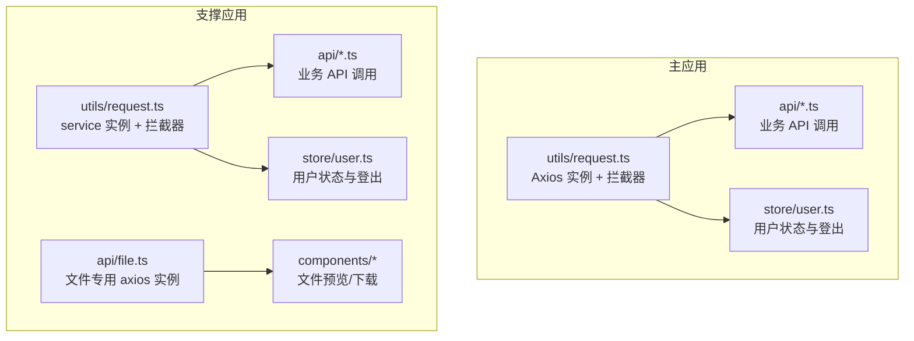
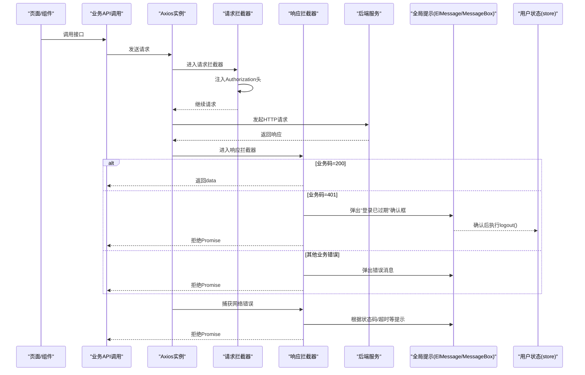
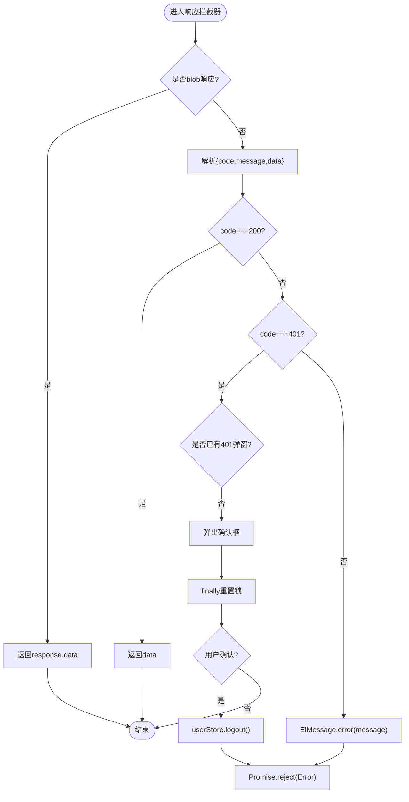
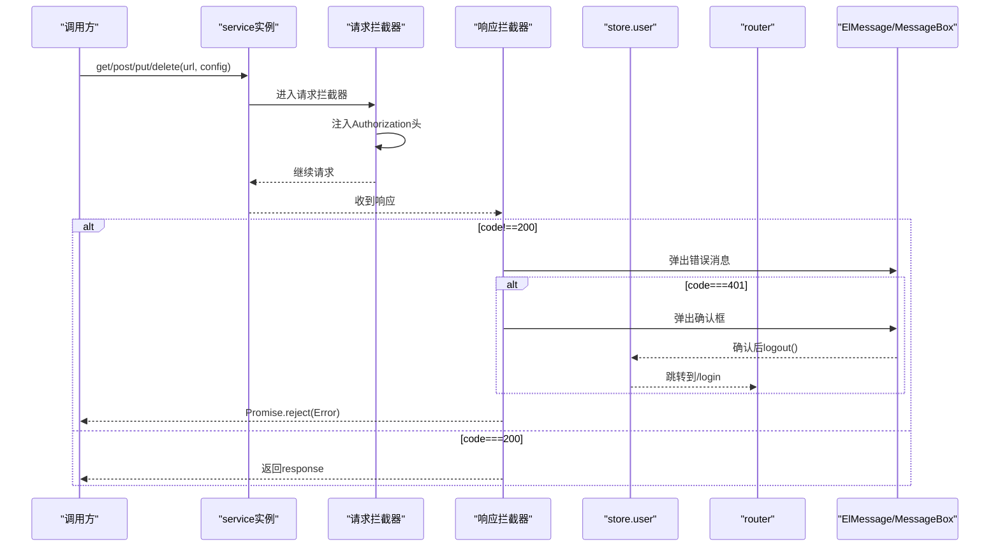
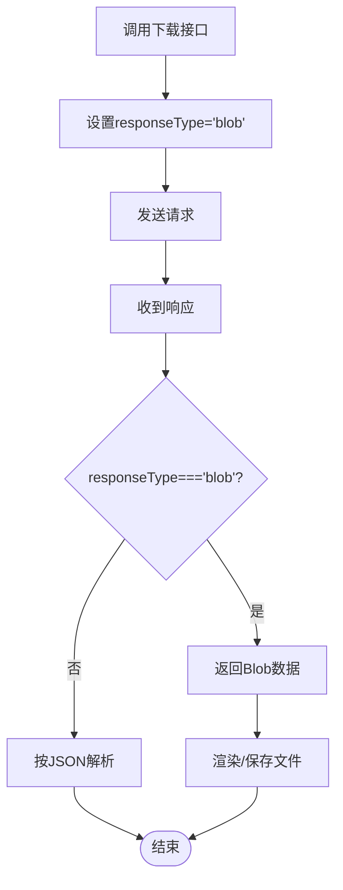
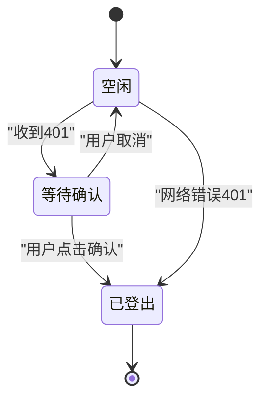
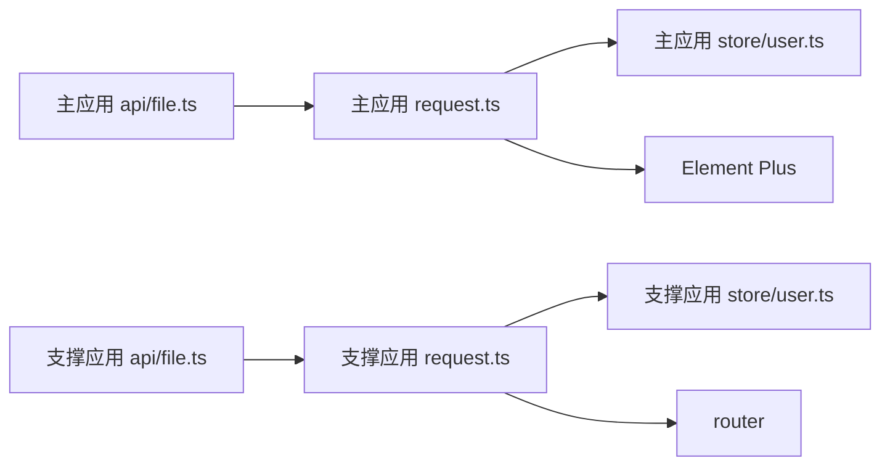

# 请求封装层

<cite>
**本文引用的文件**
- [ele-ai-tender-frontend/src/utils/request.ts](file://ele-ai-tender-frontend/src/utils/request.ts)
- [ele-ai-tender-support-frontend/src/utils/request.ts](file://ele-ai-tender-support-frontend/src/utils/request.ts)
- [ele-ai-tender-frontend/src/store/user.ts](file://ele-ai-tender-frontend/src/store/user.ts)
- [ele-ai-tender-support-frontend/src/store/user.ts](file://ele-ai-tender-support-frontend/src/store/user.ts)
- [ele-ai-tender-frontend/src/api/file.ts](file://ele-ai-tender-frontend/src/api/file.ts)
- [ele-ai-tender-support-frontend/src/api/file.ts](file://ele-ai-tender-support-frontend/src/api/file.ts)
</cite>

## 目录
1. [简介](#简介)
2. [项目结构](#项目结构)
3. [核心组件](#核心组件)
4. [架构总览](#架构总览)
5. [详细组件分析](#详细组件分析)
6. [依赖关系分析](#依赖关系分析)
7. [性能与优化建议](#性能与优化建议)
8. [故障排查指南](#故障排查指南)
9. [结论](#结论)

## 简介
本文件面向基于 Axios 的前端 HTTP 客户端封装层，聚焦以下目标：
- 实例配置与默认行为（基础地址、超时、通用请求头）
- 请求拦截器实现（Token 自动注入、统一请求头设置）
- 响应拦截器处理（统一业务码解析、错误提示、Blob 下载特殊处理）
- 401 状态码与登录过期检测、重复弹窗防抖逻辑
- 全局错误提示集成（Element Plus 消息框/消息）
- 自定义配置选项、超时策略与重试方案（设计建议）
- 性能优化与调试技巧

## 项目结构
前端包含两个独立应用，各自维护一套 Axios 封装：
- 主应用（ele-ai-tender-frontend）：通过 utils/request.ts 提供统一的 request 实例，并在 api 层复用。
- 支撑应用（ele-ai-tender-support-frontend）：同样在 utils/request.ts 提供 service 实例，并导出 get/post/put/delete 方法；同时存在独立的 fileService 用于文件服务。

图表来源
- [ele-ai-tender-frontend/src/utils/request.ts:1-80](file://ele-ai-tender-frontend/src/utils/request.ts#L1-L80)
- [ele-ai-tender-support-frontend/src/utils/request.ts:1-116](file://ele-ai-tender-support-frontend/src/utils/request.ts#L1-L116)
- [ele-ai-tender-frontend/src/store/user.ts:1-75](file://ele-ai-tender-frontend/src/store/user.ts#L1-L75)
- [ele-ai-tender-support-frontend/src/store/user.ts:1-122](file://ele-ai-tender-support-frontend/src/store/user.ts#L1-L122)
- [ele-ai-tender-support-frontend/src/api/file.ts:1-82](file://ele-ai-tender-support-frontend/src/api/file.ts#L1-L82)

章节来源
- [ele-ai-tender-frontend/src/utils/request.ts:1-80](file://ele-ai-tender-frontend/src/utils/request.ts#L1-L80)
- [ele-ai-tender-support-frontend/src/utils/request.ts:1-116](file://ele-ai-tender-support-frontend/src/utils/request.ts#L1-L116)

## 核心组件
- 主应用 Axios 实例（utils/request.ts）
  - 默认 baseURL 为空字符串，timeout 30s，Content-Type 为 application/json
  - 请求拦截器：从本地存储读取 token 并注入 Authorization 头
  - 响应拦截器：
    - Blob 响应直接返回原始数据
    - 业务码 200 返回 data
    - 业务码 401 触发“登录已过期”确认框，带防抖锁，确认后执行登出
    - 其他业务错误弹出错误消息并拒绝 Promise
    - 网络错误分支：HTTP 401 直接登出；其他错误显示网络错误提示
- 支撑应用 Axios 实例（utils/request.ts）
  - baseURL 为 /support-api，timeout 30s，Content-Type 为 application/json
  - 请求拦截器：从 store 中取 token 并注入 Authorization 头
  - 响应拦截器：
    - 业务码非 200 时弹出错误消息；若为 401，弹出确认框后登出并跳转登录页
    - 网络错误分支：按 HTTP 状态码给出友好提示；ECONNABORTED 提示超时
  - 额外导出 request 对象，封装 get/post/put/delete，统一返回 response.data

章节来源
- [ele-ai-tender-frontend/src/utils/request.ts:17-77](file://ele-ai-tender-frontend/src/utils/request.ts#L17-L77)
- [ele-ai-tender-support-frontend/src/utils/request.ts:8-94](file://ele-ai-tender-support-frontend/src/utils/request.ts#L8-L94)
- [ele-ai-tender-support-frontend/src/utils/request.ts:97-113](file://ele-ai-tender-support-frontend/src/utils/request.ts#L97-L113)

## 架构总览
下图展示一次典型请求的生命周期：发起 → 请求拦截器 → 服务端 → 响应拦截器 → 业务结果或错误处理。

图表来源
- [ele-ai-tender-frontend/src/utils/request.ts:25-77](file://ele-ai-tender-frontend/src/utils/request.ts#L25-L77)
- [ele-ai-tender-support-frontend/src/utils/request.ts:17-94](file://ele-ai-tender-support-frontend/src/utils/request.ts#L17-L94)
- [ele-ai-tender-frontend/src/store/user.ts:41-48](file://ele-ai-tender-frontend/src/store/user.ts#L41-L48)
- [ele-ai-tender-support-frontend/src/store/user.ts:98-105](file://ele-ai-tender-support-frontend/src/store/user.ts#L98-L105)

## 详细组件分析

### 主应用 Axios 实例（ele-ai-tender-frontend）
- 实例配置
  - baseURL 为空字符串，便于通过代理或部署路径转发
  - timeout 30s
  - 默认 Content-Type 为 application/json
- 请求拦截器
  - 从 localStorage 读取 token，若存在则注入 Authorization: Bearer {token}
- 响应拦截器
  - Blob 响应：当 responseType 为 blob 时，直接返回 response.data，不做 JSON 解构
  - 业务码 200：返回 data
  - 业务码 401：使用 isShowing401Dialog 标志位防止重复弹窗；确认后调用 userStore.logout()
  - 其他业务错误：弹出 ElMessage.error 并拒绝 Promise
  - 网络错误分支：HTTP 401 直接登出；其他错误弹出网络错误提示
- 类型扩展
  - 自定义 CustomAxiosInstance 以匹配拦截器返回 data 的行为，简化上层调用

图表来源
- [ele-ai-tender-frontend/src/utils/request.ts:38-77](file://ele-ai-tender-frontend/src/utils/request.ts#L38-L77)
- [ele-ai-tender-frontend/src/store/user.ts:41-48](file://ele-ai-tender-frontend/src/store/user.ts#L41-L48)

章节来源
- [ele-ai-tender-frontend/src/utils/request.ts:17-77](file://ele-ai-tender-frontend/src/utils/request.ts#L17-L77)
- [ele-ai-tender-frontend/src/store/user.ts:41-48](file://ele-ai-tender-frontend/src/store/user.ts#L41-L48)

### 支撑应用 Axios 实例（ele-ai-tender-support-frontend）
- 实例配置
  - baseURL 为 /support-api，timeout 30s
  - 默认 Content-Type 为 application/json
- 请求拦截器
  - 从 store.user.token 读取 token 并注入 Authorization 头
- 响应拦截器
  - 业务码非 200：弹出错误消息；若为 401，弹出确认框后登出并路由到 /login
  - 网络错误分支：按 HTTP 状态码给出友好提示；ECONNABORTED 提示超时
- 方法封装
  - 导出 request.get/post/put/delete，统一返回 response.data

图表来源
- [ele-ai-tender-support-frontend/src/utils/request.ts:17-94](file://ele-ai-tender-support-frontend/src/utils/request.ts#L17-L94)
- [ele-ai-tender-support-frontend/src/utils/request.ts:97-113](file://ele-ai-tender-support-frontend/src/utils/request.ts#L97-L113)
- [ele-ai-tender-support-frontend/src/store/user.ts:98-105](file://ele-ai-tender-support-frontend/src/store/user.ts#L98-L105)

章节来源
- [ele-ai-tender-support-frontend/src/utils/request.ts:8-94](file://ele-ai-tender-support-frontend/src/utils/request.ts#L8-L94)
- [ele-ai-tender-support-frontend/src/utils/request.ts:97-113](file://ele-ai-tender-support-frontend/src/utils/request.ts#L97-L113)
- [ele-ai-tender-support-frontend/src/store/user.ts:98-105](file://ele-ai-tender-support-frontend/src/store/user.ts#L98-L105)

### Blob 文件下载特殊处理
- 主应用
  - 在 utils/request.ts 的响应拦截器中，当 responseType 为 blob 时直接返回 response.data，避免 JSON 解析失败
  - api/file.ts 在下载接口显式设置 responseType: 'blob'
- 支撑应用
  - api/file.ts 单独创建 fileService 实例，并在响应拦截器中对 blob 响应做特殊处理
  - download 方法设置 responseType: 'blob'，返回 Blob 供预览或保存

图表来源
- [ele-ai-tender-frontend/src/utils/request.ts:40-43](file://ele-ai-tender-frontend/src/utils/request.ts#L40-L43)
- [ele-ai-tender-frontend/src/api/file.ts:30-34](file://ele-ai-tender-frontend/src/api/file.ts#L30-L34)
- [ele-ai-tender-support-frontend/src/api/file.ts:28-44](file://ele-ai-tender-support-frontend/src/api/file.ts#L28-L44)
- [ele-ai-tender-support-frontend/src/api/file.ts:72-76](file://ele-ai-tender-support-frontend/src/api/file.ts#L72-L76)

章节来源
- [ele-ai-tender-frontend/src/utils/request.ts:40-43](file://ele-ai-tender-frontend/src/utils/request.ts#L40-L43)
- [ele-ai-tender-frontend/src/api/file.ts:30-34](file://ele-ai-tender-frontend/src/api/file.ts#L30-L34)
- [ele-ai-tender-support-frontend/src/api/file.ts:28-44](file://ele-ai-tender-support-frontend/src/api/file.ts#L28-L44)
- [ele-ai-tender-support-frontend/src/api/file.ts:72-76](file://ele-ai-tender-support-frontend/src/api/file.ts#L72-L76)

### 401 状态码处理与登录过期检测
- 主应用
  - 业务码 401：使用 isShowing401Dialog 防抖锁，避免并发 401 导致多次弹窗；确认后调用 userStore.logout()
  - 网络错误分支：HTTP 401 直接登出
- 支撑应用
  - 业务码 401：弹出确认框后登出并跳转 /login
  - 网络错误分支：HTTP 401 登出并跳转 /login

图表来源
- [ele-ai-tender-frontend/src/utils/request.ts:48-76](file://ele-ai-tender-frontend/src/utils/request.ts#L48-L76)
- [ele-ai-tender-support-frontend/src/utils/request.ts:42-74](file://ele-ai-tender-support-frontend/src/utils/request.ts#L42-L74)
- [ele-ai-tender-frontend/src/store/user.ts:41-48](file://ele-ai-tender-frontend/src/store/user.ts#L41-L48)
- [ele-ai-tender-support-frontend/src/store/user.ts:98-105](file://ele-ai-tender-support-frontend/src/store/user.ts#L98-L105)

章节来源
- [ele-ai-tender-frontend/src/utils/request.ts:48-76](file://ele-ai-tender-frontend/src/utils/request.ts#L48-L76)
- [ele-ai-tender-support-frontend/src/utils/request.ts:42-74](file://ele-ai-tender-support-frontend/src/utils/request.ts#L42-L74)

### 全局错误提示集成
- 主应用
  - 业务错误：ElMessage.error(message || '请求失败')
  - 网络错误：ElMessage.error(error.message || '网络错误')
- 支撑应用
  - 业务错误：ElMessage.error(res.message || '请求失败')
  - 网络错误：按 HTTP 状态码映射友好提示；ECONNABORTED 提示超时

章节来源
- [ele-ai-tender-frontend/src/utils/request.ts:64-76](file://ele-ai-tender-frontend/src/utils/request.ts#L64-L76)
- [ele-ai-tender-support-frontend/src/utils/request.ts:38-93](file://ele-ai-tender-support-frontend/src/utils/request.ts#L38-L93)

### 自定义配置选项、超时与重试策略（设计建议）
- 自定义配置
  - 可在调用处传入 config 覆盖 baseURL、timeout、headers 等
  - 针对特定场景（如大文件上传/下载）提高 timeout
- 超时设置
  - 当前默认 30s；对长耗时操作可局部覆盖
- 重试策略（建议）
  - 仅在幂等请求（GET/HEAD/OPTIONS）上启用
  - 指数退避：首次 1s，二次 2s，三次 4s，最大次数 3
  - 白名单：仅对 5xx、网络错误、超时进行重试
  - 注意：需确保不会重复提交敏感数据（POST/PUT/DELETE）

[本节为通用设计建议，不直接分析具体文件，故无章节来源]

## 依赖关系分析
- 主应用
  - utils/request.ts 依赖 store/user.ts（登出）、Element Plus（消息/确认框）
  - api/file.ts 依赖 utils/request.ts，并通过 responseType: 'blob' 触发特殊处理
- 支撑应用
  - utils/request.ts 依赖 store/user.ts、router（跳转登录）
  - api/file.ts 独立创建 fileService，复用相同拦截器模式

图表来源
- [ele-ai-tender-frontend/src/utils/request.ts:1-80](file://ele-ai-tender-frontend/src/utils/request.ts#L1-L80)
- [ele-ai-tender-frontend/src/api/file.ts:1-46](file://ele-ai-tender-frontend/src/api/file.ts#L1-L46)
- [ele-ai-tender-support-frontend/src/utils/request.ts:1-116](file://ele-ai-tender-support-frontend/src/utils/request.ts#L1-L116)
- [ele-ai-tender-support-frontend/src/api/file.ts:1-82](file://ele-ai-tender-support-frontend/src/api/file.ts#L1-L82)

章节来源
- [ele-ai-tender-frontend/src/utils/request.ts:1-80](file://ele-ai-tender-frontend/src/utils/request.ts#L1-L80)
- [ele-ai-tender-frontend/src/api/file.ts:1-46](file://ele-ai-tender-frontend/src/api/file.ts#L1-L46)
- [ele-ai-tender-support-frontend/src/utils/request.ts:1-116](file://ele-ai-tender-support-frontend/src/utils/request.ts#L1-L116)
- [ele-ai-tender-support-frontend/src/api/file.ts:1-82](file://ele-ai-tender-support-frontend/src/api/file.ts#L1-L82)

## 性能与优化建议
- 连接复用与缓存
  - 合理设置 baseURL，减少跨域协商开销
  - 对静态资源与高频只读接口启用浏览器缓存（配合后端 Cache-Control）
- 请求合并与去重
  - 对同一 URL 的并发请求进行去重，避免重复网络请求
- 分片与大文件
  - 大文件上传采用分片与断点续传；下载支持 Range 断点续传
- 错误快速失败
  - 对非关键路径的错误提示尽量轻量，避免阻塞主流程
- 日志与监控
  - 记录关键请求耗时、错误率，结合前端埋点定位瓶颈

[本节为通用指导，不直接分析具体文件，故无章节来源]

## 故障排查指南
- 常见问题
  - Token 未注入：检查请求拦截器是否正确读取 token 并设置 Authorization
  - 401 重复弹窗：确认防抖锁变量作用域与 finally 重置逻辑
  - Blob 下载乱码：确认 responseType 设置为 blob，且未在拦截器中进行 JSON 解析
  - 超时频繁：根据接口耗时调整 timeout，必要时增加重试
- 调试技巧
  - 在请求/响应拦截器中打印请求 URL、方法、状态码与耗时
  - 使用浏览器 Network 面板查看实际请求与响应体
  - 对 401 场景，验证登出后是否成功跳转登录页并清空本地状态

章节来源
- [ele-ai-tender-frontend/src/utils/request.ts:25-77](file://ele-ai-tender-frontend/src/utils/request.ts#L25-L77)
- [ele-ai-tender-support-frontend/src/utils/request.ts:17-94](file://ele-ai-tender-support-frontend/src/utils/request.ts#L17-L94)

## 结论
该请求封装层通过统一的 Axios 实例与拦截器，实现了 Token 自动注入、统一业务码解析、全局错误提示、401 登录过期处理与 Blob 下载特殊处理。主应用与支撑应用在细节上略有差异（如 401 处理与路由跳转），但整体模式一致。建议在后续迭代中引入重试策略、请求去重与更完善的日志监控，以提升用户体验与可观测性。