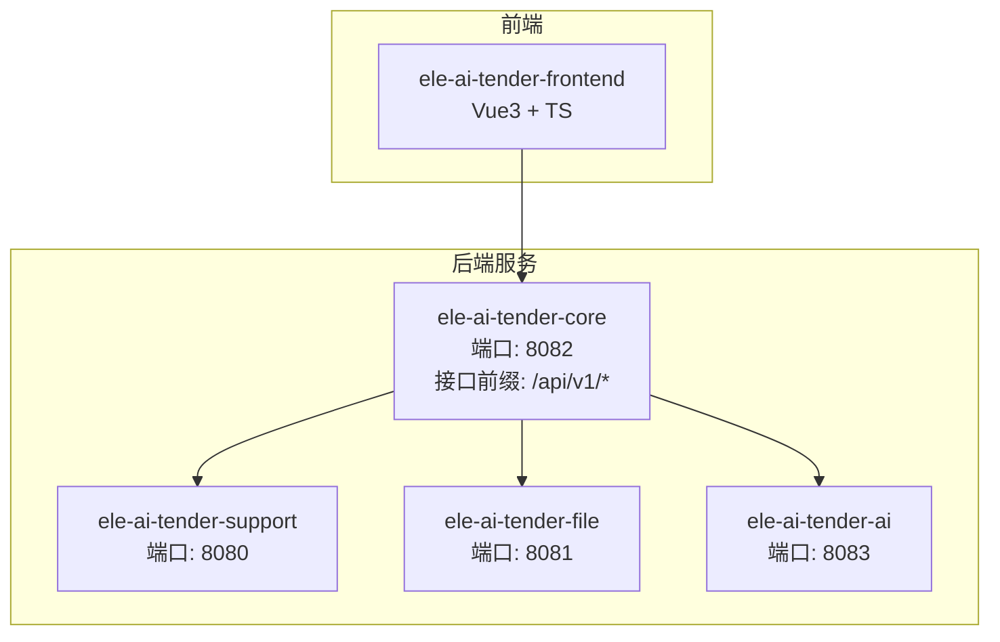
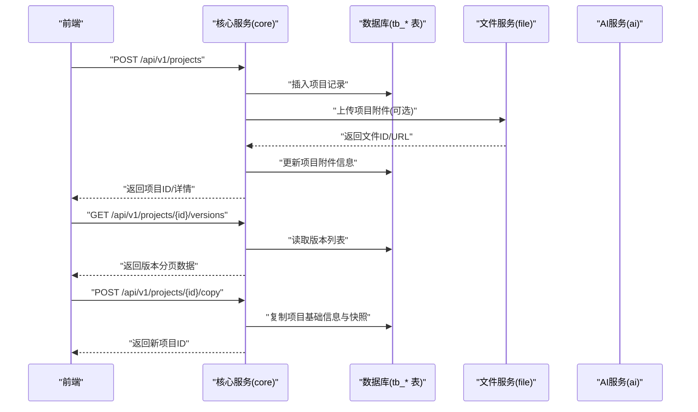
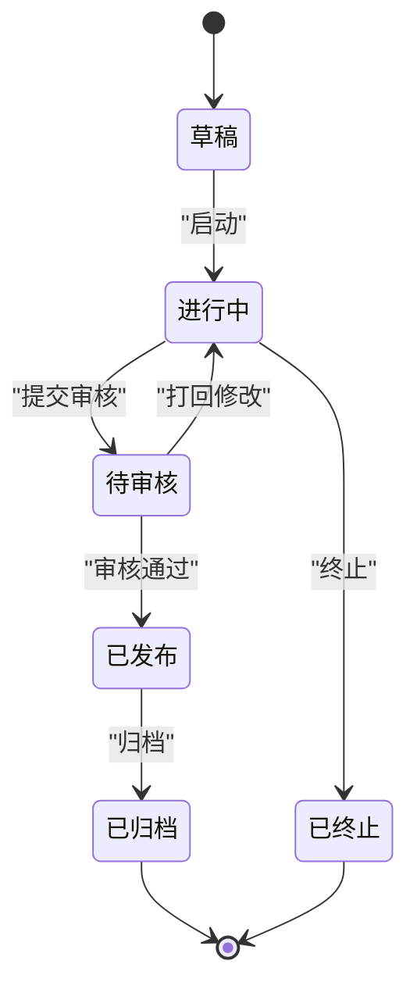
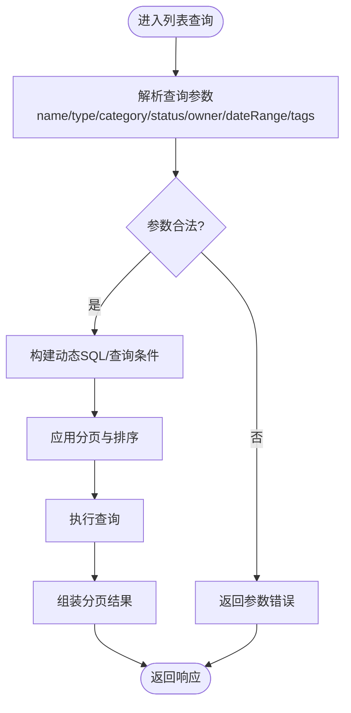
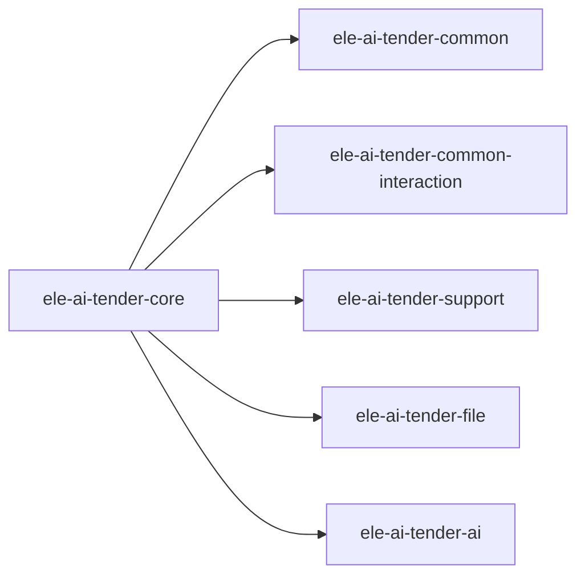

# 项目管理API

<cite>
**本文引用的文件**   
- [PROJECT_SPEC_FINAL.md](file://docs/rules/PROJECT_SPEC_FINAL.md)
</cite>

## 目录
1. [简介](#简介)
2. [项目结构](#项目结构)
3. [核心组件](#核心组件)
4. [架构总览](#架构总览)
5. [详细组件分析](#详细组件分析)
6. [依赖分析](#依赖分析)
7. [性能考虑](#性能考虑)
8. [故障排查指南](#故障排查指南)
9. [结论](#结论)
10. [附录](#附录)

## 简介
本章节面向“项目管理API模块”的文档目标，聚焦以下能力：
- 项目CRUD操作、版本管理、状态流转等核心业务接口的封装实现
- 项目生命周期管理接口：创建、编辑、删除、复制、归档等
- 项目模板应用、批量操作、搜索筛选功能的调用方式
- 项目数据模型定义、参数校验规则、错误处理机制
- 分页查询、条件过滤、排序的实现方案

说明：当前仓库未提供后端Java源码（core/support/file/ai）与前端API实现的具体代码内容。因此，本节为基于规范文档的高层设计与约定说明，不包含具体代码片段或文件级引用。

## 项目结构
根据项目规范，核心业务服务位于 ele-ai-tender-core 模块，对外REST接口前缀为 /api/v1/projects 等；支撑中心、文件服务、AI服务分别承担权限、文件、AI任务编排职责。表前缀约定中，核心业务表以 tb_ 开头。

图表来源
- [PROJECT_SPEC_FINAL.md:15-27](file://docs/rules/PROJECT_SPEC_FINAL.md#L15-L27)
- [PROJECT_SPEC_FINAL.md:48-56](file://docs/rules/PROJECT_SPEC_FINAL.md#L48-L56)
- [PROJECT_SPEC_FINAL.md:57-67](file://docs/rules/PROJECT_SPEC_FINAL.md#L57-L67)

章节来源
- [PROJECT_SPEC_FINAL.md:15-27](file://docs/rules/PROJECT_SPEC_FINAL.md#L15-L27)
- [PROJECT_SPEC_FINAL.md:48-56](file://docs/rules/PROJECT_SPEC_FINAL.md#L48-L56)
- [PROJECT_SPEC_FINAL.md:57-67](file://docs/rules/PROJECT_SPEC_FINAL.md#L57-L67)

## 核心组件
围绕“项目管理API”，建议采用如下分层与职责划分（概念性设计，便于理解整体实现思路）：
- 控制器层（Controller/Facade）
  - 暴露 REST API，负责请求解析、参数校验、响应包装
  - 典型端点：项目列表、详情、创建、更新、删除、复制、归档、版本管理等
- 服务层（Service）
  - 编排业务逻辑，协调多子域（需求、检测、评审、文档、AI任务）
  - 维护项目状态机与版本快照
- 领域实体与DTO
  - 使用 tb_ 前缀的核心业务表映射实体
  - 协议DTO不携带 jakarta.validation 注解，校验在控制器层完成
- 持久化层（Mapper/Repository）
  - 基于 MyBatis-Plus 的数据访问封装
- 外部集成
  - 文件服务：上传/下载/预览
  - AI服务：通过 ai_task 表异步解耦，由 core 写入任务，AI 模块执行并回写结果

说明：以上为通用分层约定，用于指导项目管理API的实现组织。

## 架构总览
项目管理API的整体交互流程如下：
- 前端发起 /api/v1/projects 系列请求
- 核心服务进行鉴权、参数校验、业务编排
- 需要时调用文件服务获取/保存附件，调用AI服务生成/匹配内容
- 通过数据库持久化 tb_ 前缀的项目相关数据

图表来源
- [PROJECT_SPEC_FINAL.md:57-67](file://docs/rules/PROJECT_SPEC_FINAL.md#L57-L67)
- [PROJECT_SPEC_FINAL.md:48-56](file://docs/rules/PROJECT_SPEC_FINAL.md#L48-L56)

## 详细组件分析

### 项目生命周期管理接口
- 创建项目
  - 方法：POST /api/v1/projects
  - 输入：项目名称、类型、分类、负责人、开始/结束时间、描述、附件ID集合等
  - 输出：项目ID、基础信息、初始版本
  - 行为：校验必填字段、初始化默认状态、写入 tb_project 及审计字段
- 查询项目详情
  - 方法：GET /api/v1/projects/{id}
  - 输出：项目详情、关联需求/检测/评审/文档概览
- 更新项目
  - 方法：PUT /api/v1/projects/{id}
  - 输入：可编辑字段集
  - 行为：增量更新、记录变更日志
- 删除项目
  - 方法：DELETE /api/v1/projects/{id}
  - 行为：软删除或归档策略，清理关联资源引用
- 复制项目
  - 方法：POST /api/v1/projects/{id}/copy
  - 行为：复制基础信息、阶段配置、模板快照，生成新项目
- 归档项目
  - 方法：POST /api/v1/projects/{id}/archive
  - 行为：状态变更为归档，禁止后续编辑，保留历史版本

说明：上述接口为概念性定义，实际字段与校验规则需结合具体实现与规范文档对齐。

### 版本管理与状态流转
- 版本管理
  - 版本列表：GET /api/v1/projects/{id}/versions
  - 版本详情：GET /api/v1/projects/{id}/versions/{versionId}
  - 版本对比：GET /api/v1/projects/{id}/versions/{v1}/compare/{v2}
  - 版本发布：POST /api/v1/projects/{id}/versions/{versionId}/publish
- 状态流转
  - 建议状态：草稿、进行中、待审核、已发布、已归档、已终止
  - 状态转换受权限与前置条件约束，变更需记录审计日志

[此图为概念性状态图，无需图表来源]

### 项目模板应用
- 模板选择与应用
  - 接口：POST /api/v1/projects/{id}/apply-template
  - 输入：模板ID、覆盖策略（新增/合并/替换）、阶段开关
  - 行为：加载模板快照，按策略生成项目阶段与评审项基线
- 模板版本控制
  - 模板变更需生成新版本，项目应用后形成独立快照，避免回溯影响

### 批量操作
- 批量启用/停用：POST /api/v1/projects/batch/status
- 批量归档：POST /api/v1/projects/batch/archive
- 批量删除：POST /api/v1/projects/batch/delete
- 注意：批量操作需幂等与事务保障，失败部分回滚或记录明细

### 搜索与筛选
- 列表查询：GET /api/v1/projects
- 支持条件：名称模糊、类型、分类、状态、负责人、时间范围、标签
- 分页：page、size
- 排序：sortField、sortOrder（asc/desc）
- 输出：分页数据、总数、筛选统计

[此图为概念性流程图，无需图表来源]

### 数据模型与字段约定
- 表前缀：tb_（核心业务）
- 关键字段建议：
  - 主键：id（自增或雪花）
  - 基础信息：name、type、category、description、owner_id、start_date、end_date
  - 状态与版本：status、current_version、version_count
  - 审计字段：created_by、created_at、updated_by、updated_at、deleted_flag
- 枚举与字典：
  - 项目类型、分类、状态等使用统一枚举，便于前后端一致

### 参数校验与错误处理
- 校验位置：控制器层对入参进行非空、长度、格式、范围校验
- 协议DTO不携带 jakarta.validation 注解，校验逻辑在控制器或服务层显式实现
- 错误码与消息：
  - 统一错误码体系，区分系统错误、业务错误、参数错误
  - 异常捕获与标准化响应体

### 分页、过滤、排序实现方案
- 分页：page、size 边界检查，默认值设置
- 过滤：动态拼接条件，防注入，索引优化
- 排序：白名单字段，限制排序列，防止全表扫描

## 依赖分析
- 模块边界
  - 非交互公共类型 → common
  - 协议DTO、SPI、路径常量 → common-interaction
  - controller/facade 通过 mapper 显式转换，service 层不直接透传协议DTO
- 关键依赖
  - Spring Boot 3.2.2、MyBatis-Plus 3.5.5、MySQL 8.4.0、Redis、Milvus
  - 前端：Vue 3 + TypeScript + Vite + Pinia + Vue Router

图表来源
- [PROJECT_SPEC_FINAL.md:40-46](file://docs/rules/PROJECT_SPEC_FINAL.md#L40-L46)
- [PROJECT_SPEC_FINAL.md:29-38](file://docs/rules/PROJECT_SPEC_FINAL.md#L29-L38)

章节来源
- [PROJECT_SPEC_FINAL.md:40-46](file://docs/rules/PROJECT_SPEC_FINAL.md#L40-L46)
- [PROJECT_SPEC_FINAL.md:29-38](file://docs/rules/PROJECT_SPEC_FINAL.md#L29-L38)

## 性能考虑
- 分页与索引
  - 针对常用过滤字段建立复合索引（如 status、owner_id、create_time）
  - 大对象（附件、富文本）走文件服务，数据库仅存引用
- 缓存策略
  - 热点项目详情、字典、模板元数据可缓存至 Redis
  - 版本列表与对比结果可短期缓存
- 异步解耦
  - AI任务通过 ai_task 表异步执行，避免阻塞主流程
- 批量操作
  - 分批提交、事务粒度控制、失败重试与补偿

## 故障排查指南
- 常见问题定位
  - 参数校验失败：检查控制器层校验规则与错误码
  - 权限不足：确认用户角色与数据权限（DataScope）
  - 文件上传失败：核对文件服务连通性与存储配额
  - AI任务无结果：检查 ai_task 状态与消费者消费情况
- 日志与追踪
  - 统一链路追踪，关键节点记录上下文（项目ID、版本ID、操作人）
  - 异常堆栈与错误码规范化，便于快速定位

## 结论
本项目规范明确了核心业务服务的端口、接口前缀、表前缀与模块边界。项目管理API应遵循这些约定，结合控制器/服务/持久化分层，实现项目CRUD、版本管理、状态流转、模板应用、批量操作与搜索筛选等功能。为保证质量，需在参数校验、错误处理、分页排序、缓存与异步等方面落实最佳实践。

## 附录
- 技术基线与模块端口参考
  - Java/JDK、Spring Boot、MyBatis-Plus、MySQL、Redis、Milvus
  - 前端技术栈：Vue 3 + TypeScript + Vite + Pinia + Vue Router
- 接口前缀与表前缀
  - 核心业务接口前缀：/api/v1/projects 等
  - 核心业务表前缀：tb_

章节来源
- [PROJECT_SPEC_FINAL.md:29-38](file://docs/rules/PROJECT_SPEC_FINAL.md#L29-L38)
- [PROJECT_SPEC_FINAL.md:57-67](file://docs/rules/PROJECT_SPEC_FINAL.md#L57-L67)
- [PROJECT_SPEC_FINAL.md:48-56](file://docs/rules/PROJECT_SPEC_FINAL.md#L48-L56)