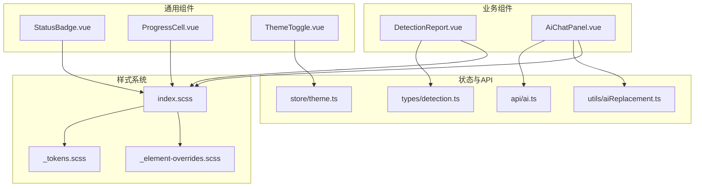
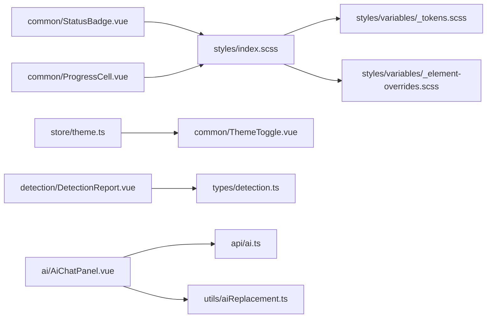
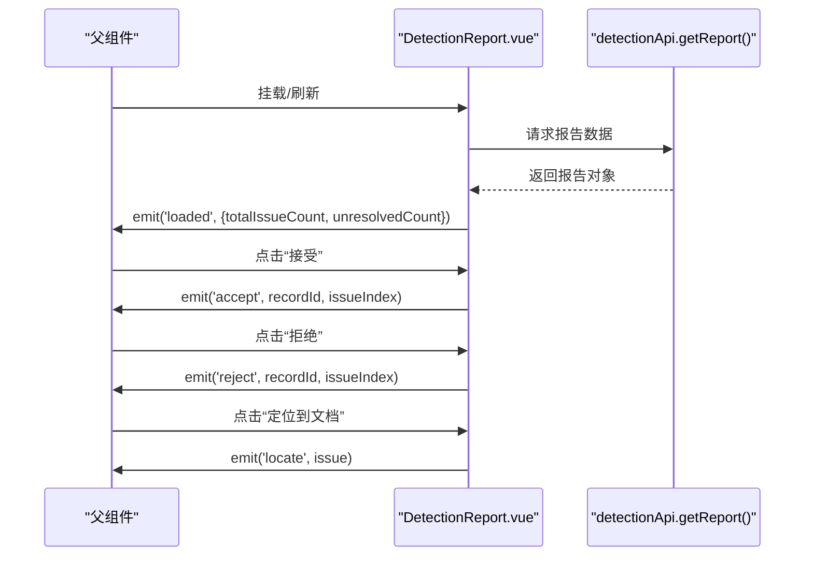
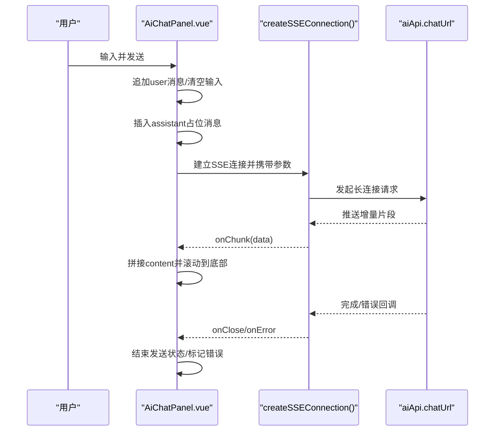
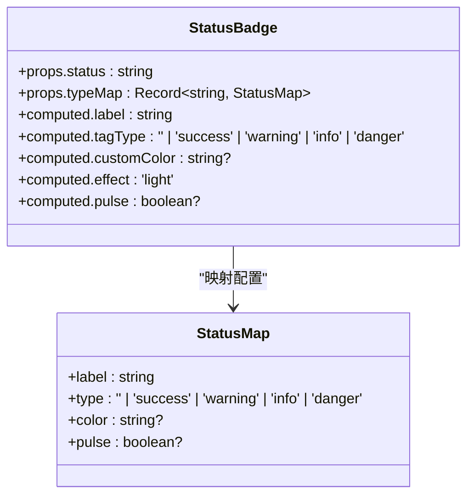
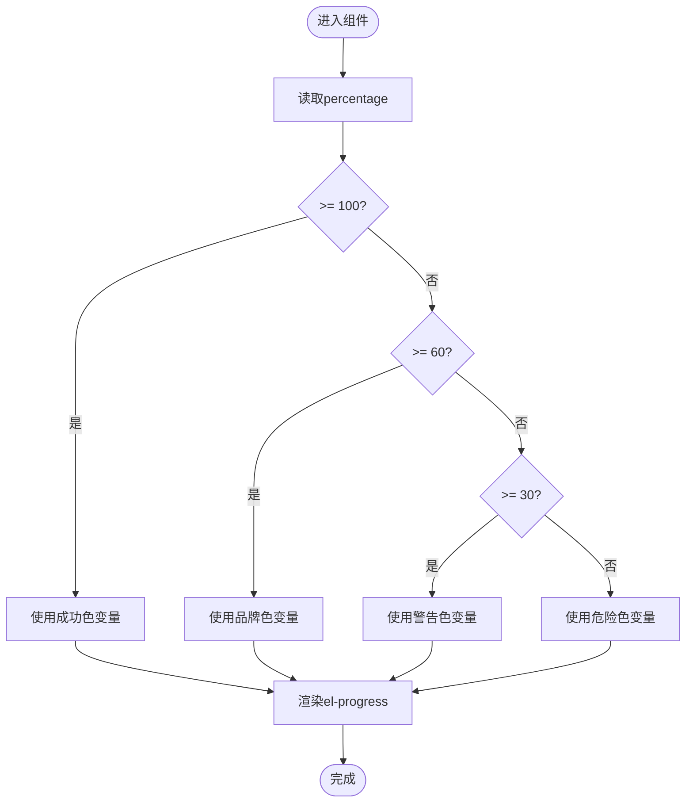
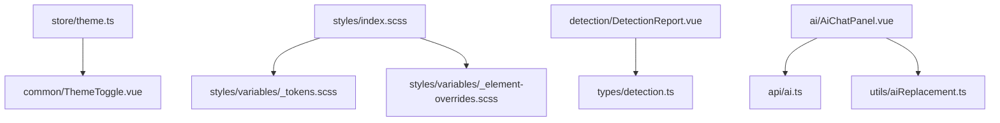

# UI组件库

<cite>
**本文引用的文件**
- [StatusBadge.vue](file://ele-ai-tender-frontend/src/components/common/StatusBadge.vue)
- [ProgressCell.vue](file://ele-ai-tender-frontend/src/components/common/ProgressCell.vue)
- [ThemeToggle.vue](file://ele-ai-tender-frontend/src/components/common/ThemeToggle.vue)
- [DetectionReport.vue](file://ele-ai-tender-frontend/src/components/detection/DetectionReport.vue)
- [AiChatPanel.vue](file://ele-ai-tender-frontend/src/components/ai/AiChatPanel.vue)
- [theme.ts](file://ele-ai-tender-frontend/src/store/theme.ts)
- [index.scss](file://ele-ai-tender-frontend/src/styles/index.scss)
- [_tokens.scss](file://ele-ai-tender-frontend/src/styles/variables/_tokens.scss)
- [_element-overrides.scss](file://ele-ai-tender-frontend/src/styles/variables/_element-overrides.scss)
- [detection.ts](file://ele-ai-tender-frontend/src/types/detection.ts)
- [ai.ts](file://ele-ai-tender-frontend/src/api/ai.ts)
- [aiReplacement.ts](file://ele-ai-tender-frontend/src/utils/aiReplacement.ts)
</cite>

## 目录
1. [简介](#简介)
2. [项目结构](#项目结构)
3. [核心组件](#核心组件)
4. [架构总览](#架构总览)
5. [详细组件分析](#详细组件分析)
6. [依赖关系分析](#依赖关系分析)
7. [性能与优化](#性能与优化)
8. [测试策略](#测试策略)
9. [故障排查](#故障排查)
10. [结论](#结论)

## 简介
本文件面向前端UI组件库，聚焦基于Element Plus的定制与扩展，覆盖全局主题配置、样式覆盖、通用组件与业务复杂交互组件的实现规范。文档重点解析以下组件：
- 通用组件：状态徽章(StatusBadge)、进度单元格(ProgressCell)、主题切换器(ThemeToggle)
- 业务组件：AI聊天面板(AiChatPanel)、检测报告(DetectionReport)

同时提供Props设计、事件通信、插槽使用、类型定义说明，以及组件测试策略、性能优化技巧与复用模式建议。

## 项目结构
前端工程采用Vue 3 + TypeScript + Vite组织，组件按功能域划分在src/components下，样式变量集中于src/styles/variables，主题与Element Plus覆盖通过SCSS变量与CSS自定义属性实现。

图表来源
- [index.scss](file://ele-ai-tender-frontend/src/styles/index.scss)
- [_tokens.scss](file://ele-ai-tender-frontend/src/styles/variables/_tokens.scss)
- [_element-overrides.scss](file://ele-ai-tender-frontend/src/styles/variables/_element-overrides.scss)
- [ThemeToggle.vue](file://ele-ai-tender-frontend/src/components/common/ThemeToggle.vue)
- [status-maps.ts](file://ele-ai-tender-frontend/src/constants/status-maps.ts)
- [DetectionReport.vue](file://ele-ai-tender-frontend/src/components/detection/DetectionReport.vue)
- [AiChatPanel.vue](file://ele-ai-tender-frontend/src/components/ai/AiChatPanel.vue)
- [theme.ts](file://ele-ai-tender-frontend/src/store/theme.ts)
- [ai.ts](file://ele-ai-tender-frontend/src/api/ai.ts)
- [aiReplacement.ts](file://ele-ai-tender-frontend/src/utils/aiReplacement.ts)
- [detection.ts](file://ele-ai-tender-frontend/src/types/detection.ts)

章节来源
- [index.scss](file://ele-ai-tender-frontend/src/styles/index.scss)
- [_tokens.scss](file://ele-ai-tender-frontend/src/styles/variables/_tokens.scss)
- [_element-overrides.scss](file://ele-ai-tender-frontend/src/styles/variables/_element-overrides.scss)

## 核心组件
本节对通用组件进行统一说明，包括Props、事件、插槽、样式与可访问性要点。

### 状态徽章 StatusBadge
- 职责：将状态码映射为标签展示，支持颜色、脉冲动画等可视化增强。
- Props
  - status: string — 当前状态键
  - typeMap: Record<string, { label, type?, color?, pulse? }> — 状态到显示配置的映射表
- 行为
  - 根据status查找typeMap，若未命中则回退为info类型并显示原始值
  - 支持自定义color与pulse动画
- 样式
  - 通过el-tag渲染，effect固定为light；当customColor存在时覆盖边框与文字色
  - 通过is-pulse类名触发呼吸动画
- 使用建议
  - 集中维护typeMap（例如constants/status-maps.ts），避免硬编码
  - 需要强调的状态可使用pulse=true

章节来源
- [StatusBadge.vue](file://ele-ai-tender-frontend/src/components/common/StatusBadge.vue)
- [status-maps.ts](file://ele-ai-tender-frontend/src/constants/status-maps.ts)

### 进度单元格 ProgressCell
- 职责：以简洁单元格形式展示进度条，并根据阈值动态选择主题色。
- Props
  - percentage: number — 进度百分比
- 行为
  - 根据percentage区间选择不同CSS变量作为颜色：成功/品牌/警告/危险
  - 通过getComputedStyle读取根元素变量，确保跟随主题
- 样式
  - 内部el-progress宽度自适应，便于嵌入表格或列表行
- 使用建议
  - 传入前做边界校验（0~100）
  - 结合主题变量统一管理色彩语义

章节来源
- [ProgressCell.vue](file://ele-ai-tender-frontend/src/components/common/ProgressCell.vue)
- [_tokens.scss](file://ele-ai-tender-frontend/src/styles/variables/_tokens.scss)

### 主题切换器 ThemeToggle
- 职责：提供一键切换明暗主题的按钮，图标随主题变化。
- 依赖
  - useThemeStore()：从Pinia中获取当前mode并提供toggle方法
- 行为
  - 点击调用themeStore.toggle()
  - 根据mode切换Sunny/Moon图标与title提示
- 样式
  - 使用Element Plus圆形按钮，无额外样式
- 使用建议
  - 建议在布局头部常驻，配合持久化存储保持用户偏好

章节来源
- [ThemeToggle.vue](file://ele-ai-tender-frontend/src/components/common/ThemeToggle.vue)
- [theme.ts](file://ele-ai-tender-frontend/src/store/theme.ts)

## 架构总览
下图展示了通用与业务组件之间的依赖关系及数据流向，突出主题系统与外部API的集成点。

图表来源
- [ThemeToggle.vue](file://ele-ai-tender-frontend/src/components/common/ThemeToggle.vue)
- [StatusBadge.vue](file://ele-ai-tender-frontend/src/components/common/StatusBadge.vue)
- [ProgressCell.vue](file://ele-ai-tender-frontend/src/components/common/ProgressCell.vue)
- [DetectionReport.vue](file://ele-ai-tender-frontend/src/components/detection/DetectionReport.vue)
- [AiChatPanel.vue](file://ele-ai-tender-frontend/src/components/ai/AiChatPanel.vue)
- [theme.ts](file://ele-ai-tender-frontend/src/store/theme.ts)
- [index.scss](file://ele-ai-tender-frontend/src/styles/index.scss)
- [_tokens.scss](file://ele-ai-tender-frontend/src/styles/variables/_tokens.scss)
- [_element-overrides.scss](file://ele-ai-tender-frontend/src/styles/variables/_element-overrides.scss)
- [detection.ts](file://ele-ai-tender-frontend/src/types/detection.ts)
- [ai.ts](file://ele-ai-tender-frontend/src/api/ai.ts)
- [aiReplacement.ts](file://ele-ai-tender-frontend/src/utils/aiReplacement.ts)

## 详细组件分析

### 组件A：检测报告 DetectionReport
- 职责：汇总检测摘要、列出问题分组、支持接受/拒绝建议、定位原文等交互。
- Props
  - projectId: number — 项目ID
  - readonly?: boolean — 是否只读模式
- Emits
  - accept(recordId, issueIndex)
  - reject(recordId, issueIndex)
  - accept-all
  - loaded({ totalIssueCount, unresolvedCount })
  - locate(issue)
- 数据与计算
  - 内部维护report引用，挂载后自动刷新
  - summaryItems：按检测类型统计未处理问题数
  - groupedIssues：按类型分组的问题列表
  - severityLabel/typeBadgeClass：用于严重等级与类型徽章的文本与样式映射
- 交互流程
  - 查看原文：弹出对话框展示位置、原文与建议替换内容
  - 接受/拒绝：向上冒泡事件由父组件驱动后端更新
  - 定位到文档：向上冒locate事件供父组件滚动至对应位置
- 对外暴露
  - refresh(): Promise<void> — 手动刷新报告
  - unresolvedCount: ComputedRef<number> — 未解决问题数量
- 样式与主题
  - 大量使用CSS变量（如--app-bg-tertiary、--app-brand-color等）保证主题一致
- 复杂度与性能
  - 主要计算为O(n)遍历issues，适合中等规模数据；大数据时可考虑分页或虚拟列表

图表来源
- [DetectionReport.vue](file://ele-ai-tender-frontend/src/components/detection/DetectionReport.vue)
- [detection.ts](file://ele-ai-tender-frontend/src/types/detection.ts)

章节来源
- [DetectionReport.vue](file://ele-ai-tender-frontend/src/components/detection/DetectionReport.vue)
- [detection.ts](file://ele-ai-tender-frontend/src/types/detection.ts)

### 组件B：AI聊天面板 AiChatPanel
- 职责：提供流式对话界面，支持选中上下文、反馈点赞/踩、一键替换建议等。
- Props
  - context?: string — 上下文（Markdown或纯文本）
  - projectId?: number / requirementId?: number — 业务上下文标识
  - showClose?: boolean — 是否显示关闭按钮
  - greeting?: string — 欢迎语
  - selectedText?: string — 选中文本
- v-model
  - messages: AiChatMessage[] — 双向绑定消息列表
- Emits
  - close
  - feedback(type, msg)
  - message(content, hadSelection)
  - replace({ selectedText, replacement })
  - 'update:selectedText'
- 关键逻辑
  - 首次加载且messages为空时，插入greeting作为首条助手消息
  - 发送消息：构造user消息，创建assistant占位，建立SSE连接接收增量片段
  - 打字指示器与输出光标：在assistant消息正在生成时显示
  - 反馈：本地记录uid→LIKE/DISSTATE，并向上冒泡
  - 替换：从assistant内容中提取可替换段落，支持多方案选择与应用
- 对外暴露
  - sendQuickAction(text): void — 快捷操作发送
- 样式与主题
  - 通过MdPreview渲染Markdown，并适配深色/浅色主题
  - 使用CSS变量控制气泡背景、边框、文本色等

图表来源
- [AiChatPanel.vue](file://ele-ai-tender-frontend/src/components/ai/AiChatPanel.vue)
- [ai.ts](file://ele-ai-tender-frontend/src/api/ai.ts)
- [aiReplacement.ts](file://ele-ai-tender-frontend/src/utils/aiReplacement.ts)

章节来源
- [AiChatPanel.vue](file://ele-ai-tender-frontend/src/components/ai/AiChatPanel.vue)
- [ai.ts](file://ele-ai-tender-frontend/src/api/ai.ts)
- [aiReplacement.ts](file://ele-ai-tender-frontend/src/utils/aiReplacement.ts)

### 组件C：状态徽章 StatusBadge（类图）

图表来源
- [StatusBadge.vue](file://ele-ai-tender-frontend/src/components/common/StatusBadge.vue)

章节来源
- [StatusBadge.vue](file://ele-ai-tender-frontend/src/components/common/StatusBadge.vue)

### 组件D：进度单元格 ProgressCell（流程图）

图表来源
- [ProgressCell.vue](file://ele-ai-tender-frontend/src/components/common/ProgressCell.vue)
- [_tokens.scss](file://ele-ai-tender-frontend/src/styles/variables/_tokens.scss)

章节来源
- [ProgressCell.vue](file://ele-ai-tender-frontend/src/components/common/ProgressCell.vue)

## 依赖关系分析
- 主题系统
  - ThemeToggle依赖store/theme.ts中的mode与toggle方法
  - 样式入口index.scss引入_tokens.scss与_element-overrides.scss，统一注入CSS变量与Element Plus覆盖
- 业务组件
  - DetectionReport依赖types/detection.ts的类型定义，并通过detectionApi拉取数据
  - AiChatPanel依赖api/ai.ts的chatUrl与createSSEConnection，以及utils/aiReplacement.ts的提取替换内容能力
- 通用组件
  - StatusBadge依赖统一的类型映射（建议集中在constants/status-maps.ts）
  - ProgressCell依赖CSS变量实现主题色联动

图表来源
- [ThemeToggle.vue](file://ele-ai-tender-frontend/src/components/common/ThemeToggle.vue)
- [theme.ts](file://ele-ai-tender-frontend/src/store/theme.ts)
- [index.scss](file://ele-ai-tender-frontend/src/styles/index.scss)
- [_tokens.scss](file://ele-ai-tender-frontend/src/styles/variables/_tokens.scss)
- [_element-overrides.scss](file://ele-ai-tender-frontend/src/styles/variables/_element-overrides.scss)
- [DetectionReport.vue](file://ele-ai-tender-frontend/src/components/detection/DetectionReport.vue)
- [detection.ts](file://ele-ai-tender-frontend/src/types/detection.ts)
- [AiChatPanel.vue](file://ele-ai-tender-frontend/src/components/ai/AiChatPanel.vue)
- [ai.ts](file://ele-ai-tender-frontend/src/api/ai.ts)
- [aiReplacement.ts](file://ele-ai-tender-frontend/src/utils/aiReplacement.ts)

章节来源
- [ThemeToggle.vue](file://ele-ai-tender-frontend/src/components/common/ThemeToggle.vue)
- [theme.ts](file://ele-ai-tender-frontend/src/store/theme.ts)
- [index.scss](file://ele-ai-tender-frontend/src/styles/index.scss)
- [_tokens.scss](file://ele-ai-tender-frontend/src/styles/variables/_tokens.scss)
- [_element-overrides.scss](file://ele-ai-tender-frontend/src/styles/variables/_element-overrides.scss)
- [DetectionReport.vue](file://ele-ai-tender-frontend/src/components/detection/DetectionReport.vue)
- [detection.ts](file://ele-ai-tender-frontend/src/types/detection.ts)
- [AiChatPanel.vue](file://ele-ai-tender-frontend/src/components/ai/AiChatPanel.vue)
- [ai.ts](file://ele-ai-tender-frontend/src/api/ai.ts)
- [aiReplacement.ts](file://ele-ai-tender-frontend/src/utils/aiReplacement.ts)

## 性能与优化
- 列表渲染
  - 对问题列表等长列表，建议结合虚拟滚动或分页加载，减少DOM节点数量
- 计算属性
  - 将summaryItems与groupedIssues的计算结果缓存于computed，避免重复遍历
- 主题变量
  - 优先使用CSS变量而非内联style，减少运行时样式计算开销
- 网络请求
  - 对检测报告接口增加防抖与重试机制，失败时给出友好提示
- 流式输出
  - 对SSE增量更新，尽量使用splice原地更新，避免整段重建
- 资源加载
  - Markdown预览按需引入，必要时懒加载md-editor-v3

[本节为通用指导，不直接分析具体文件]

## 测试策略
- 单元测试
  - 针对计算属性与工具函数（如extractReplaceableContents）编写用例，验证边界条件与异常分支
- 组件测试
  - 使用Vitest + Vue Test Utils对组件进行渲染与交互断言
    - StatusBadge：验证不同status下的标签类型与颜色
    - ProgressCell：验证不同percentage区间的颜色选择
    - ThemeToggle：验证点击后store.mode变化与图标切换
    - DetectionReport：模拟API响应，断言loaded事件与分组统计
    - AiChatPanel：模拟SSE片段推送，断言消息拼接、滚动与错误状态
- 端到端测试
  - 使用Playwright/Cypress对关键用户路径（发送消息、接受/拒绝建议）进行回归

[本节为通用指导，不直接分析具体文件]

## 故障排查
- 主题不生效
  - 检查index.scss是否正确引入变量文件
  - 确认CSS变量命名与取值正确，浏览器开发者工具中查看根元素变量
- Element Plus样式覆盖无效
  - 确认_element-overrides.scss的优先级与选择器作用域
- 进度条颜色异常
  - 检查CSS变量是否存在，或在非浏览器环境（SSR）下提供降级色
- 检测报告数据为空
  - 检查projectId是否正确传递，API返回结构与types/detection.ts是否一致
- AI对话无响应
  - 检查SSE连接是否建立成功，服务端是否返回增量片段
  - 关注onError回调，必要时增加超时与重连逻辑

章节来源
- [index.scss](file://ele-ai-tender-frontend/src/styles/index.scss)
- [_element-overrides.scss](file://ele-ai-tender-frontend/src/styles/variables/_element-overrides.scss)
- [ProgressCell.vue](file://ele-ai-tender-frontend/src/components/common/ProgressCell.vue)
- [DetectionReport.vue](file://ele-ai-tender-frontend/src/components/detection/DetectionReport.vue)
- [AiChatPanel.vue](file://ele-ai-tender-frontend/src/components/ai/AiChatPanel.vue)

## 结论
本组件库围绕Element Plus进行了系统化定制，通过CSS变量与SCSS覆盖实现主题一致性，通用组件提供高内聚低耦合的基础能力，业务组件封装了复杂交互与数据流。建议持续完善类型定义、测试覆盖率与性能监控，逐步沉淀为可复用的企业级UI资产。