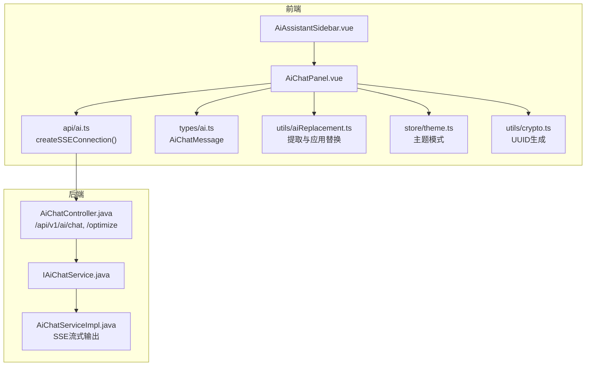
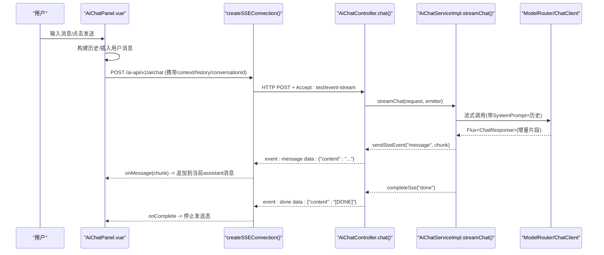
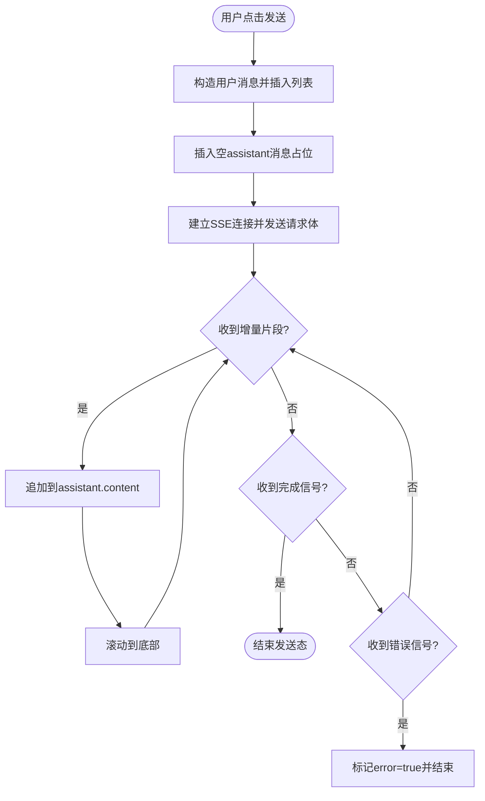
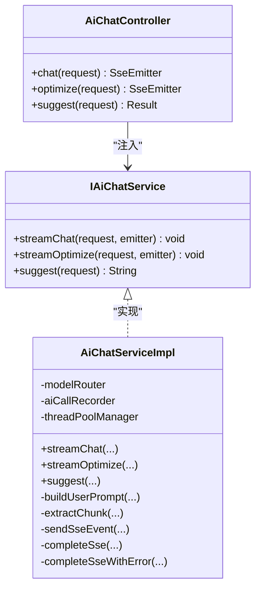
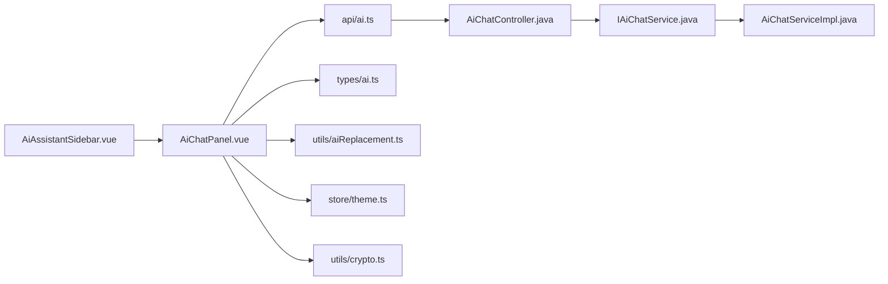

# AI助手模块

<cite>
**本文引用的文件列表**   
- [AiChatPanel.vue](file://ele-ai-tender-frontend/src/components/ai/AiChatPanel.vue)
- [AiAssistantSidebar.vue](file://ele-ai-tender-frontend/src/components/ai/AiAssistantSidebar.vue)
- [ai.ts](file://ele-ai-tender-frontend/src/api/ai.ts)
- [message.ts](file://ele-ai-tender-frontend/src/api/message.ts)
- [useTaskPolling.ts](file://ele-ai-tender-frontend/src/composables/useTaskPolling.ts)
- [ai-task.ts](file://ele-ai-tender-frontend/src/types/ai-task.ts)
- [ai.ts](file://ele-ai-tender-frontend/src/types/ai.ts)
- [AiChatController.java](file://ele-ai-tender-system/ele-ai-tender-ai/src/main/java/com/jy/eleaitender/ai/controller/AiChatController.java)
- [IAiChatService.java](file://ele-ai-tender-system/ele-ai-tender-ai/src/main/java/com/jy/eleaitender/ai/service/IAiChatService.java)
- [AiChatServiceImpl.java](file://ele-ai-tender-system/ele-ai-tender-ai/src/main/java/com/jy/eleaitender/ai/service/impl/AiChatServiceImpl.java)
- [aiReplacement.ts](file://ele-ai-tender-frontend/src/utils/aiReplacement.ts)
- [theme.ts](file://ele-ai-tender-frontend/src/store/theme.ts)
- [crypto.ts](file://ele-ai-tender-frontend/src/utils/crypto.ts)
</cite>

## 目录
1. [简介](#简介)
2. [项目结构](#项目结构)
3. [核心组件](#核心组件)
4. [架构总览](#架构总览)
5. [详细组件分析](#详细组件分析)
6. [依赖关系分析](#依赖关系分析)
7. [性能与可靠性](#性能与可靠性)
8. [故障排查指南](#故障排查指南)
9. [结论](#结论)
10. [附录：配置与模板定制](#附录配置与模板定制)

## 简介
本章节面向AI助手模块，聚焦以下目标：
- 深入解析聊天面板 AiChatPanel.vue 的对话界面实现，包括消息流式传输、上下文管理、历史记录、替换方案应用等。
- 说明侧边栏 AiAssistantSidebar.vue 的任务管理与状态透传机制。
- 详解前端SSE（Server-Sent Events）实时通信、任务轮询机制与错误处理策略。
- 提供AI模型集成配置、提示词模板定制和对话流程设计指南（基于后端服务接口与实现）。

## 项目结构
AI助手模块由前后端协同组成：
- 前端：Vue 3 + TypeScript，使用 md-editor-v3 渲染Markdown，Element Plus UI，Pinia主题存储，自定义工具函数与组合式函数。
- 后端：Spring Boot + Spring AI，通过 SseEmitter 提供流式响应，支持对话与文本优化场景。

图表来源
- [AiAssistantSidebar.vue:1-60](file://ele-ai-tender-frontend/src/components/ai/AiAssistantSidebar.vue#L1-L60)
- [AiChatPanel.vue:130-356](file://ele-ai-tender-frontend/src/components/ai/AiChatPanel.vue#L130-L356)
- [ai.ts:60-126](file://ele-ai-tender-frontend/src/api/ai.ts#L60-L126)
- [ai.ts:1-87](file://ele-ai-tender-frontend/src/types/ai.ts#L1-L87)
- [aiReplacement.ts:1-133](file://ele-ai-tender-frontend/src/utils/aiReplacement.ts#L1-L133)
- [theme.ts:1-28](file://ele-ai-tender-frontend/src/store/theme.ts#L1-L28)
- [crypto.ts:26-44](file://ele-ai-tender-frontend/src/utils/crypto.ts#L26-L44)
- [AiChatController.java:24-56](file://ele-ai-tender-system/ele-ai-tender-ai/src/main/java/com/jy/eleaitender/ai/controller/AiChatController.java#L24-L56)
- [IAiChatService.java:10-26](file://ele-ai-tender-system/ele-ai-tender-ai/src/main/java/com/jy/eleaitender/ai/service/IAiChatService.java#L10-L26)
- [AiChatServiceImpl.java:64-123](file://ele-ai-tender-system/ele-ai-tender-ai/src/main/java/com/jy/eleaitender/ai/service/impl/AiChatServiceImpl.java#L64-L123)

章节来源
- [AiAssistantSidebar.vue:1-60](file://ele-ai-tender-frontend/src/components/ai/AiAssistantSidebar.vue#L1-L60)
- [AiChatPanel.vue:130-356](file://ele-ai-tender-frontend/src/components/ai/AiChatPanel.vue#L130-L356)
- [ai.ts:60-126](file://ele-ai-tender-frontend/src/api/ai.ts#L60-L126)
- [AiChatController.java:24-56](file://ele-ai-tender-system/ele-ai-tender-ai/src/main/java/com/jy/eleaitender/ai/controller/AiChatController.java#L24-L56)
- [IAiChatService.java:10-26](file://ele-ai-tender-system/ele-ai-tender-ai/src/main/java/com/jy/eleaitender/ai/service/IAiChatService.java#L10-L26)
- [AiChatServiceImpl.java:64-123](file://ele-ai-tender-system/ele-ai-tender-ai/src/main/java/com/jy/eleaitender/ai/service/impl/AiChatServiceImpl.java#L64-L123)

## 核心组件
- 聊天面板 AiChatPanel.vue
  - 负责消息展示、用户输入、快捷操作、选中内容引用、反馈按钮、可替换正文识别与应用、SSE流式接收与增量拼接、滚动定位、历史构建与发送。
- 侧边栏 AiAssistantSidebar.vue
  - 作为容器承载聊天面板，透传可见性、消息数组、上下文、项目/需求ID、选中文本，并转发事件给上层。
- SSE客户端 ai.ts
  - 封装 createSSEConnection，使用 fetch + ReadableStream 实现POST+body的SSE，兼容JSON data行与纯文本data行，统一完成与错误信号处理。
- 类型定义 types/ai.ts
  - 定义 AiChatMessage、请求参数等数据结构，支撑前端状态与交互。
- 替换工具 utils/aiReplacement.ts
  - 从AI回复中按固定标记提取“可替换正文”，并提供应用到原文的能力。
- 主题与工具 store/theme.ts、utils/crypto.ts
  - 提供Markdown预览主题与会话唯一标识生成。

章节来源
- [AiChatPanel.vue:130-356](file://ele-ai-tender-frontend/src/components/ai/AiChatPanel.vue#L130-L356)
- [AiAssistantSidebar.vue:32-70](file://ele-ai-tender-frontend/src/components/ai/AiAssistantSidebar.vue#L32-L70)
- [ai.ts:60-126](file://ele-ai-tender-frontend/src/api/ai.ts#L60-L126)
- [ai.ts:1-87](file://ele-ai-tender-frontend/src/types/ai.ts#L1-L87)
- [aiReplacement.ts:1-133](file://ele-ai-tender-frontend/src/utils/aiReplacement.ts#L1-L133)
- [theme.ts:1-28](file://ele-ai-tender-frontend/src/store/theme.ts#L1-L28)
- [crypto.ts:26-44](file://ele-ai-tender-frontend/src/utils/crypto.ts#L26-L44)

## 架构总览
前后端通过SSE进行流式对话，前端在收到增量片段后即时更新UI；同时提供同步建议接口用于非流式场景。

图表来源
- [AiChatPanel.vue:286-330](file://ele-ai-tender-frontend/src/components/ai/AiChatPanel.vue#L286-L330)
- [ai.ts:60-126](file://ele-ai-tender-frontend/src/api/ai.ts#L60-L126)
- [AiChatController.java:30-38](file://ele-ai-tender-system/ele-ai-tender-ai/src/main/java/com/jy/eleaitender/ai/controller/AiChatController.java#L30-L38)
- [AiChatServiceImpl.java:64-123](file://ele-ai-tender-system/ele-ai-tender-ai/src/main/java/com/jy/eleaitender/ai/service/impl/AiChatServiceImpl.java#L64-L123)

## 详细组件分析

### 聊天面板 AiChatPanel.vue
- 消息流式传输
  - 使用 createSSEConnection 发起POST请求，Accept为text/event-stream，服务端以event:message推送增量数据，event:done结束，event:error异常。
  - 每收到一个增量片段，将当前assistant消息content拼接，并触发滚动到底部。
- 上下文与历史记录
  - 构建最近若干条有效对话作为history发送给后端；当存在选中内容时，将选中内容与完整Markdown上下文一并传入，以便后端精准替换。
- 可替换正文
  - 根据后端约定的固定标记【可替换正文开始】【可替换正文结束】提取多个替换方案，并在UI上提供“应用替换”按钮，结合选中原文位置执行替换。
- 反馈与状态
  - 对assistant消息提供点赞/点踩反馈，记录本地状态并向上冒泡。
- 安全提示与主题
  - 顶部显示安全提示；Markdown预览跟随全局主题模式。

图表来源
- [AiChatPanel.vue:267-330](file://ele-ai-tender-frontend/src/components/ai/AiChatPanel.vue#L267-L330)
- [ai.ts:135-166](file://ele-ai-tender-frontend/src/api/ai.ts#L135-L166)

章节来源
- [AiChatPanel.vue:130-356](file://ele-ai-tender-frontend/src/components/ai/AiChatPanel.vue#L130-L356)
- [ai.ts:60-126](file://ele-ai-tender-frontend/src/api/ai.ts#L60-L126)
- [ai.ts:135-166](file://ele-ai-tender-frontend/src/api/ai.ts#L135-L166)
- [aiReplacement.ts:1-133](file://ele-ai-tender-frontend/src/utils/aiReplacement.ts#L1-L133)
- [theme.ts:1-28](file://ele-ai-tender-frontend/src/store/theme.ts#L1-L28)
- [crypto.ts:26-44](file://ele-ai-tender-frontend/src/utils/crypto.ts#L26-L44)

### 侧边栏 AiAssistantSidebar.vue
- 作为外层容器，控制可见性与尺寸，透传消息数组、上下文、项目/需求ID、选中文本等属性。
- 暴露sendQuickAction方法供父级直接触发快捷发送。
- 转发所有事件（关闭、反馈、消息、替换、选中文本更新）给父组件，便于上层统一管理。

章节来源
- [AiAssistantSidebar.vue:1-70](file://ele-ai-tender-frontend/src/components/ai/AiAssistantSidebar.vue#L1-L70)

### SSE客户端 ai.ts
- createSSEConnection
  - 使用fetch发起POST，设置Authorization与Accept头，读取ReadableStream并按\n\n分割事件块，解析event/data行。
  - 兼容两种格式：JSON data行（如{"content":"..."}）与纯文本data行；遇到done或[DONE]结束；遇到error则回调错误。
- 错误与完成
  - 正常结束调用onComplete；网络错误或AbortError区分处理；返回关闭连接的函数，组件卸载时主动断开。

章节来源
- [ai.ts:60-126](file://ele-ai-tender-frontend/src/api/ai.ts#L60-L126)
- [ai.ts:135-166](file://ele-ai-tender-frontend/src/api/ai.ts#L135-L166)

### 后端控制器与服务
- AiChatController
  - 暴露/chat与/optimize两个SSE接口，/suggest为同步接口。
- IAiChatService
  - 定义streamChat、streamOptimize、suggest三个方法。
- AiChatServiceImpl
  - 构建SystemPrompt与历史消息，调用Spring AI ChatClient流式获取增量片段，通过SseEmitter.event(name="message"/"done"/"error")推送。
  - 记录调用日志，包含系统提示、用户提示、模型名称、会话ID等。

图表来源
- [AiChatController.java:24-56](file://ele-ai-tender-system/ele-ai-tender-ai/src/main/java/com/jy/eleaitender/ai/controller/AiChatController.java#L24-L56)
- [IAiChatService.java:10-26](file://ele-ai-tender-system/ele-ai-tender-ai/src/main/java/com/jy/eleaitender/ai/service/IAiChatService.java#L10-L26)
- [AiChatServiceImpl.java:64-123](file://ele-ai-tender-system/ele-ai-tender-ai/src/main/java/com/jy/eleaitender/ai/service/impl/AiChatServiceImpl.java#L64-L123)

章节来源
- [AiChatController.java:24-56](file://ele-ai-tender-system/ele-ai-tender-ai/src/main/java/com/jy/eleaitender/ai/controller/AiChatController.java#L24-L56)
- [IAiChatService.java:10-26](file://ele-ai-tender-system/ele-ai-tender-ai/src/main/java/com/jy/eleaitender/ai/service/IAiChatService.java#L10-L26)
- [AiChatServiceImpl.java:64-123](file://ele-ai-tender-system/ele-ai-tender-ai/src/main/java/com/jy/eleaitender/ai/service/impl/AiChatServiceImpl.java#L64-L123)

### 替换能力与数据处理
- 提取可替换正文
  - 根据固定标记扫描全文，收集多组替换方案。
- 应用替换
  - 匹配选中原文位置，考虑重复前缀裁剪与整行删除场景，返回替换后的新内容。
- 前端交互
  - 当存在选中原文且AI回复包含可替换正文时，展示“应用替换”按钮，选择方案后触发replace事件，由上层编辑器应用。

章节来源
- [aiReplacement.ts:1-133](file://ele-ai-tender-frontend/src/utils/aiReplacement.ts#L1-L133)
- [AiChatPanel.vue:209-230](file://ele-ai-tender-frontend/src/components/ai/AiChatPanel.vue#L209-L230)

### 任务轮询与状态监控
- useTaskPolling
  - 定时轮询任务状态，终态时停止；COMPLETED需等待resultSynced结束才算真正完成。
  - 提供start/stop/skip等方法，自动监听taskId变化。
- 任务类型与状态
  - 定义任务类型、状态集合、进度计算、是否可创建新任务等工具函数。

章节来源
- [useTaskPolling.ts:1-74](file://ele-ai-tender-frontend/src/composables/useTaskPolling.ts#L1-L74)
- [ai-task.ts:1-221](file://ele-ai-tender-frontend/src/types/ai-task.ts#L1-L221)

## 依赖关系分析
- 组件耦合
  - AiAssistantSidebar仅做透传与事件转发，低耦合高内聚。
  - AiChatPanel依赖SSE客户端、类型定义、替换工具、主题与UUID工具。
- 外部依赖
  - 前端依赖md-editor-v3渲染Markdown，Element Plus提供UI控件。
  - 后端依赖Spring AI ChatClient与SseEmitter。

图表来源
- [AiAssistantSidebar.vue:1-70](file://ele-ai-tender-frontend/src/components/ai/AiAssistantSidebar.vue#L1-L70)
- [AiChatPanel.vue:130-356](file://ele-ai-tender-frontend/src/components/ai/AiChatPanel.vue#L130-L356)
- [ai.ts:60-126](file://ele-ai-tender-frontend/src/api/ai.ts#L60-L126)
- [AiChatController.java:24-56](file://ele-ai-tender-system/ele-ai-tender-ai/src/main/java/com/jy/eleaitender/ai/controller/AiChatController.java#L24-L56)
- [IAiChatService.java:10-26](file://ele-ai-tender-system/ele-ai-tender-ai/src/main/java/com/jy/eleaitender/ai/service/IAiChatService.java#L10-L26)
- [AiChatServiceImpl.java:64-123](file://ele-ai-tender-system/ele-ai-tender-ai/src/main/java/com/jy/eleaitender/ai/service/impl/AiChatServiceImpl.java#L64-L123)

## 性能与可靠性
- 流式体验
  - 增量拼接避免全量重绘，配合nextTick滚动，提升长对话流畅度。
- 资源释放
  - 组件卸载时主动关闭SSE连接，防止内存泄漏。
- 错误处理
  - 前端区分AbortError与真实错误；后端在异常时发送error事件并结束连接。
- 任务轮询
  - 使用指数曲线估算PROCESSING进度，减少频繁刷新带来的抖动；终态自动停止轮询。

[本节为通用指导，不直接分析具体文件]

## 故障排查指南
- SSE无法建立或立即断开
  - 检查Authorization是否正确传递；确认后端Accept:text/event-stream与路径映射。
  - 查看浏览器Network面板，确认响应头与事件流。
- 消息未增量更新
  - 确认后端发送的是event:message与data字段；前端handleSseData是否正确解析JSON或纯文本。
- 替换无效
  - 检查AI回复是否包含固定标记；确认选中原文是否存在且未被取消替换。
- 任务卡住
  - 使用skip接口跳过；观察isTaskTerminal判断逻辑与resultSynced状态。

章节来源
- [ai.ts:60-126](file://ele-ai-tender-frontend/src/api/ai.ts#L60-L126)
- [AiChatServiceImpl.java:217-249](file://ele-ai-tender-system/ele-ai-tender-ai/src/main/java/com/jy/eleaitender/ai/service/impl/AiChatServiceImpl.java#L217-L249)
- [useTaskPolling.ts:1-74](file://ele-ai-tender-frontend/src/composables/useTaskPolling.ts#L1-L74)
- [ai-task.ts:147-154](file://ele-ai-tender-frontend/src/types/ai-task.ts#L147-L154)

## 结论
AI助手模块以前端SSE流式对话为核心，结合上下文与历史记录，实现了即时的交互式体验；通过可替换正文机制提升了编辑效率；侧边栏提供轻量化的入口与事件透传；后端采用Spring AI与SseEmitter保障流式输出与可扩展性。整体架构清晰、职责明确，具备良好的扩展与维护性。

[本节为总结，不直接分析具体文件]

## 附录：配置与模板定制
- AI模型集成配置
  - 通过ModelRouter路由至不同模型，可在路由层配置模型名称、超时、重试等策略（参考AiChatServiceImpl中对RoutedChatClient的使用）。
- 提示词模板定制
  - SystemPromptTemplates.AI_ASSISTANT与TEXT_OPTIMIZE分别用于对话与文本优化场景；REPLACEABLE_CONTENT_FORMAT_INSTRUCTION约束可替换正文的输出格式。
- 对话流程设计
  - 前端构建历史（最近若干条），携带conversationId保证会话一致性；后端组装SystemPrompt+历史+用户提示，流式返回增量片段。

章节来源
- [AiChatServiceImpl.java:39-52](file://ele-ai-tender-system/ele-ai-tender-ai/src/main/java/com/jy/eleaitender/ai/service/impl/AiChatServiceImpl.java#L39-L52)
- [AiChatServiceImpl.java:82-86](file://ele-ai-tender-system/ele-ai-tender-ai/src/main/java/com/jy/eleaitender/ai/service/impl/AiChatServiceImpl.java#L82-L86)
- [AiChatServiceImpl.java:185-204](file://ele-ai-tender-system/ele-ai-tender-ai/src/main/java/com/jy/eleaitender/ai/service/impl/AiChatServiceImpl.java#L185-L204)