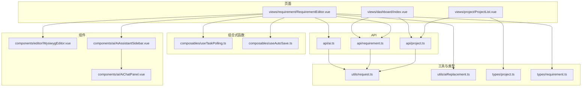
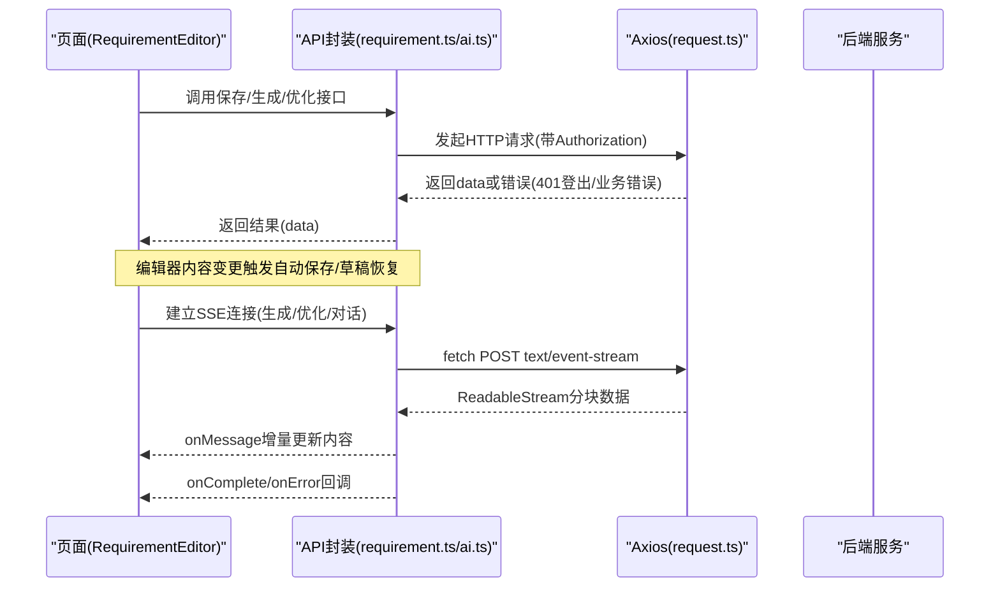
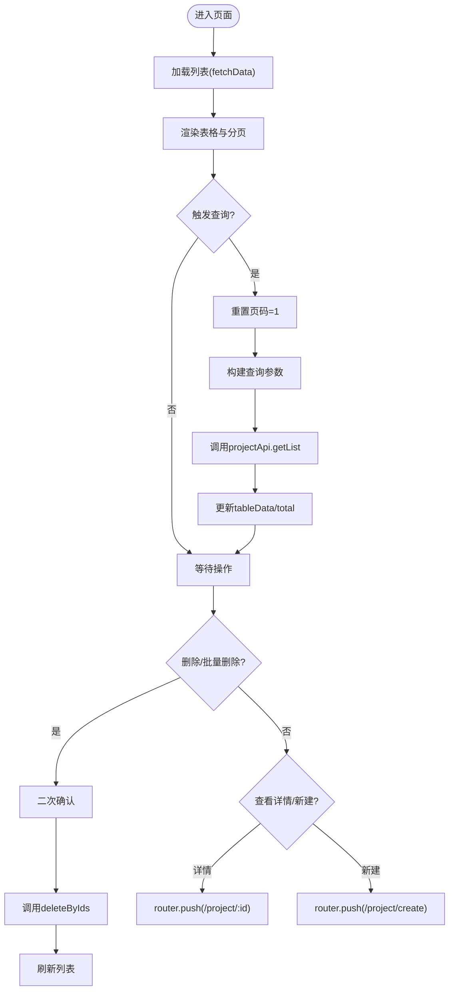
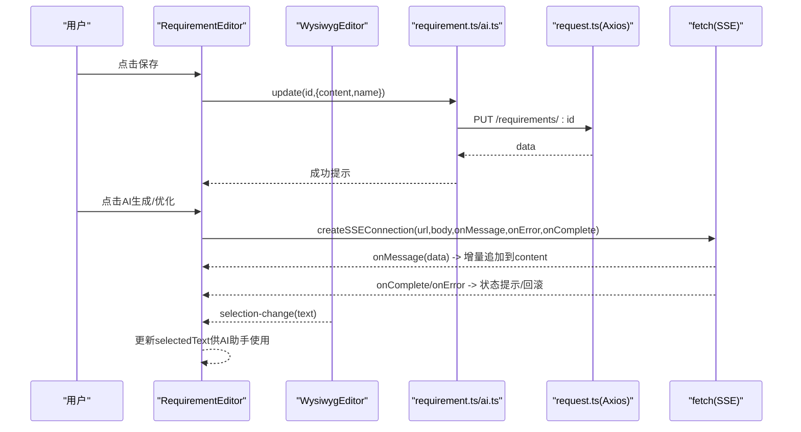
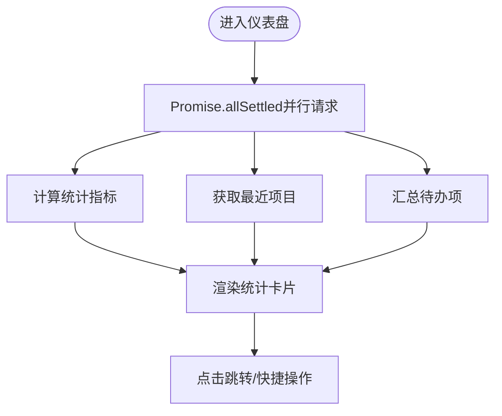
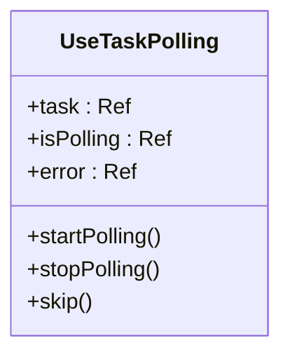
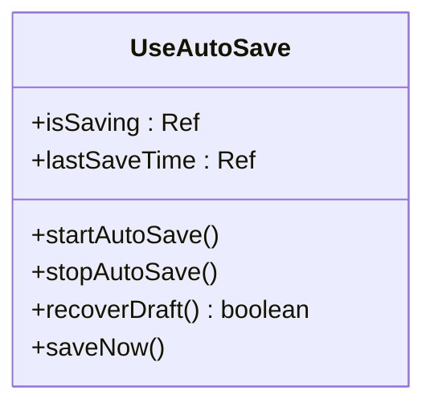
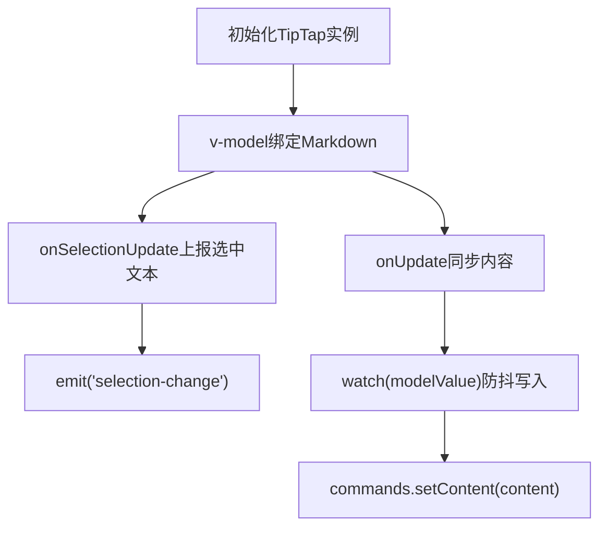
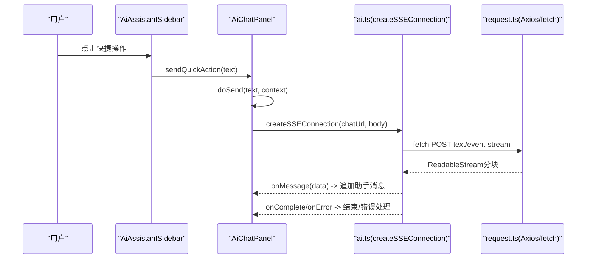
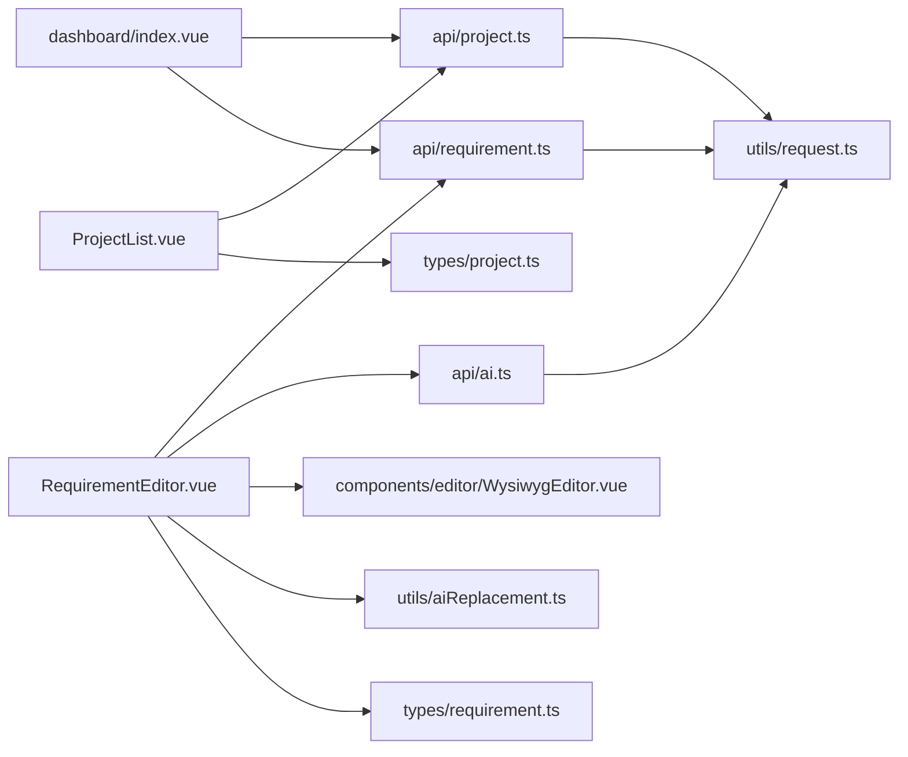

# 业务模块

<cite>
**本文引用的文件**   
- [ProjectList.vue](file://ele-ai-tender-frontend/src/views/project/ProjectList.vue)
- [RequirementEditor.vue](file://ele-ai-tender-frontend/src/views/requirement/RequirementEditor.vue)
- [dashboard/index.vue](file://ele-ai-tender-frontend/src/views/dashboard/index.vue)
- [useTaskPolling.ts](file://ele-ai-tender-frontend/src/composables/useTaskPolling.ts)
- [useAutoSave.ts](file://ele-ai-tender-frontend/src/composables/useAutoSave.ts)
- [WysiwygEditor.vue](file://ele-ai-tender-frontend/src/components/editor/WysiwygEditor.vue)
- [AiAssistantSidebar.vue](file://ele-ai-tender-frontend/src/components/ai/AiAssistantSidebar.vue)
- [AiChatPanel.vue](file://ele-ai-tender-frontend/src/components/ai/AiChatPanel.vue)
- [project.ts](file://ele-ai-tender-frontend/src/api/project.ts)
- [requirement.ts](file://ele-ai-tender-frontend/src/api/requirement.ts)
- [ai.ts](file://ele-ai-tender-frontend/src/api/ai.ts)
- [request.ts](file://ele-ai-tender-frontend/src/utils/request.ts)
- [aiReplacement.ts](file://ele-ai-tender-frontend/src/utils/aiReplacement.ts)
- [project.ts（类型）](file://ele-ai-tender-frontend/src/types/project.ts)
- [requirement.ts（类型）](file://ele-ai-tender-frontend/src/types/requirement.ts)
</cite>

## 目录
1. [简介](#简介)
2. [项目结构](#项目结构)
3. [核心组件与页面](#核心组件与页面)
4. [架构总览](#架构总览)
5. [详细组件分析](#详细组件分析)
6. [依赖关系分析](#依赖关系分析)
7. [性能与体验优化建议](#性能与体验优化建议)
8. [故障排查指南](#故障排查指南)
9. [结论](#结论)

## 简介
本文件聚焦前端业务模块，围绕三大关键页面与通用组合式函数展开：
- 项目列表页（ProjectList.vue）：提供项目的查询、分页、批量删除等基础管理能力。
- 需求编辑器（RequirementEditor.vue）：基于富文本编辑器的内容创作、AI生成/优化、自动保存与草稿恢复、协作式替换等能力。
- 仪表盘（dashboard/index.vue）：聚合项目与需求的统计指标、最近项目与待办事项，辅助快速导航。
同时，深入解析组合式函数 useTaskPolling.ts 与 useAutoSave.ts 的设计与使用方式，并说明页面间数据传递、表单校验、文件下载、实时通信（SSE）等复杂交互的实现路径。

## 项目结构
前端采用按功能域组织的目录结构：
- views：页面级视图（项目、需求、仪表盘等）
- components：可复用组件（编辑器、AI助手侧边栏与聊天面板等）
- composables：组合式函数（任务轮询、自动保存等）
- api：领域 API 封装（项目、需求、AI 等）
- types：统一类型定义
- utils：工具函数（请求封装、AI 替换算法等）

图表来源
- [ProjectList.vue:1-360](file://ele-ai-tender-frontend/src/views/project/ProjectList.vue#L1-L360)
- [RequirementEditor.vue:1-465](file://ele-ai-tender-frontend/src/views/requirement/RequirementEditor.vue#L1-L465)
- [dashboard/index.vue:1-289](file://ele-ai-tender-frontend/src/views/dashboard/index.vue#L1-L289)
- [WysiwygEditor.vue:1-597](file://ele-ai-tender-frontend/src/components/editor/WysiwygEditor.vue#L1-L597)
- [AiAssistantSidebar.vue:1-160](file://ele-ai-tender-frontend/src/components/ai/AiAssistantSidebar.vue#L1-L160)
- [AiChatPanel.vue:1-668](file://ele-ai-tender-frontend/src/components/ai/AiChatPanel.vue#L1-L668)
- [useTaskPolling.ts:1-74](file://ele-ai-tender-frontend/src/composables/useTaskPolling.ts#L1-L74)
- [useAutoSave.ts:1-83](file://ele-ai-tender-frontend/src/composables/useAutoSave.ts#L1-L83)
- [project.ts（API）:1-59](file://ele-ai-tender-frontend/src/api/project.ts#L1-L59)
- [requirement.ts（API）:1-80](file://ele-ai-tender-frontend/src/api/requirement.ts#L1-L80)
- [ai.ts:1-181](file://ele-ai-tender-frontend/src/api/ai.ts#L1-L181)
- [request.ts:1-80](file://ele-ai-tender-frontend/src/utils/request.ts#L1-L80)
- [aiReplacement.ts:1-133](file://ele-ai-tender-frontend/src/utils/aiReplacement.ts#L1-L133)
- [project.ts（类型）:1-72](file://ele-ai-tender-frontend/src/types/project.ts#L1-L72)
- [requirement.ts（类型）:1-79](file://ele-ai-tender-frontend/src/types/requirement.ts#L1-L79)

章节来源
- [ProjectList.vue:1-360](file://ele-ai-tender-frontend/src/views/project/ProjectList.vue#L1-L360)
- [RequirementEditor.vue:1-465](file://ele-ai-tender-frontend/src/views/requirement/RequirementEditor.vue#L1-L465)
- [dashboard/index.vue:1-289](file://ele-ai-tender-frontend/src/views/dashboard/index.vue#L1-L289)

## 核心组件与页面
- 项目列表页（ProjectList.vue）
  - 筛选条件：支持名称/编号模糊搜索、状态、类别、类型、创建时间范围。
  - 列表展示：分页表格，包含项目编号、名称、类别、类型、预算、进度、创建时间与操作列。
  - 操作：新建跳转、查看详情跳转、单条删除、批量删除确认与执行。
  - 数据获取：通过 projectApi.getList 拉取分页数据，结合常量映射进行标签渲染。
- 需求编辑器（RequirementEditor.vue）
  - 富文本编辑：集成 WysiwygEditor，双向绑定内容，支持选择变化事件。
  - AI 协作：侧边栏 AiAssistantSidebar + 聊天面板 AiChatPanel，支持快捷操作、选中上下文、消息反馈、一键替换。
  - AI 生成/优化：基于 SSE 流式输出，增量拼接至编辑器内容，失败回滚与完成提示。
  - 自动保存：定时保存草稿，支持打开时恢复草稿；底部状态栏显示保存状态与时间。
  - 提交检测：跳转到检测流程页面。
- 仪表盘（dashboard/index.vue）
  - 统计卡片：项目总数、需求总数、检测通过率、进行中项目数。
  - 最近项目：调用项目列表接口取前 N 条，点击跳转详情。
  - 快捷操作：新建需求/项目、查看需求/项目列表。
  - 待办事项：根据各状态计数动态生成。

章节来源
- [ProjectList.vue:1-360](file://ele-ai-tender-frontend/src/views/project/ProjectList.vue#L1-L360)
- [RequirementEditor.vue:1-465](file://ele-ai-tender-frontend/src/views/requirement/RequirementEditor.vue#L1-L465)
- [dashboard/index.vue:1-289](file://ele-ai-tender-frontend/src/views/dashboard/index.vue#L1-L289)

## 架构总览
前后端交互以 Axios 拦截器为中心，统一处理鉴权、错误与 Blob 响应；页面通过领域 API 封装访问后端；编辑器与 AI 助手通过 SSE 实现实时流式更新；组合式函数将通用逻辑（轮询、自动保存）从页面中解耦。

图表来源
- [RequirementEditor.vue:1-465](file://ele-ai-tender-frontend/src/views/requirement/RequirementEditor.vue#L1-L465)
- [requirement.ts:1-80](file://ele-ai-tender-frontend/src/api/requirement.ts#L1-L80)
- [ai.ts:1-181](file://ele-ai-tender-frontend/src/api/ai.ts#L1-L181)
- [request.ts:1-80](file://ele-ai-tender-frontend/src/utils/request.ts#L1-L80)

## 详细组件分析

### 项目列表页（ProjectList.vue）
- 数据模型与查询参数
  - 使用 ProjectInfo 与 ProjectQueryParams 类型约束列表项与查询条件。
  - 搜索关键词同步到 projectName 与 projectCode 字段，便于后端模糊匹配。
- 交互流程
  - 初始化加载：onMounted 触发 fetchData。
  - 查询/重置：handleSearch/handleReset 重置分页为第一页并刷新数据。
  - 删除/批量删除：二次确认后调用 deleteByIds，成功后刷新列表。
  - 跳转：新建与查看详情分别路由到 /project/create 与 /project/:id。
- 样式与展示
  - 使用常量映射 PROJECT_STATUS_MAP/PROJECT_CATEGORY_MAP/PROJECT_TYPE_MAP 渲染标签与颜色。
  - 预算格式化与时间格式化在本地完成。

图表来源
- [ProjectList.vue:1-360](file://ele-ai-tender-frontend/src/views/project/ProjectList.vue#L1-L360)
- [project.ts（API）:1-59](file://ele-ai-tender-frontend/src/api/project.ts#L1-L59)
- [project.ts（类型）:1-72](file://ele-ai-tender-frontend/src/types/project.ts#L1-L72)

章节来源
- [ProjectList.vue:1-360](file://ele-ai-tender-frontend/src/views/project/ProjectList.vue#L1-L360)
- [project.ts（API）:1-59](file://ele-ai-tender-frontend/src/api/project.ts#L1-L59)
- [project.ts（类型）:1-72](file://ele-ai-tender-frontend/src/types/project.ts#L1-L72)

### 需求编辑器（RequirementEditor.vue）
- 生命周期与初始化
  - 从路由参数读取 id，加载需求详情，记录原始内容与名称用于差异对比。
  - 检查草稿恢复：若存在草稿，弹窗询问是否恢复。
  - 启动自动保存定时器。
- 保存与草稿
  - 手动保存：调用 requirementApi.update 持久化标题与内容。
  - 自动保存：定时调用 requirementApi.autoSave，并在状态栏显示“已保存/保存中/失败”。
  - 草稿恢复：调用 requirementApi.getAutoSave 获取草稿，用户确认后回填内容。
- AI 生成/优化（SSE）
  - 生成：POST /core-api/v1/requirements/:id/generate，增量追加 content。
  - 优化：POST /ai-api/v1/ai/optimize，传入 type=requirement 与当前内容，失败时回滚到原始内容。
  - 关闭机制：再次点击按钮或组件卸载时中止连接。
- AI 助手协作
  - 侧边栏 AiAssistantSidebar 透传快捷操作与消息事件。
  - 聊天面板 AiChatPanel 负责消息渲染、打字动画、Markdown 预览、反馈与替换操作。
  - 替换逻辑：提取“可替换正文”，结合选中原文进行精准替换，重复出现时仅替换首处并提示。
- 选择变化
  - 监听编辑器 selection-change，将选中文本传递给 AI 助手作为上下文。

图表来源
- [RequirementEditor.vue:1-465](file://ele-ai-tender-frontend/src/views/requirement/RequirementEditor.vue#L1-L465)
- [requirement.ts:1-80](file://ele-ai-tender-frontend/src/api/requirement.ts#L1-L80)
- [ai.ts:1-181](file://ele-ai-tender-frontend/src/api/ai.ts#L1-L181)
- [request.ts:1-80](file://ele-ai-tender-frontend/src/utils/request.ts#L1-L80)
- [WysiwygEditor.vue:1-597](file://ele-ai-tender-frontend/src/components/editor/WysiwygEditor.vue#L1-L597)

章节来源
- [RequirementEditor.vue:1-465](file://ele-ai-tender-frontend/src/views/requirement/RequirementEditor.vue#L1-L465)
- [requirement.ts:1-80](file://ele-ai-tender-frontend/src/api/requirement.ts#L1-L80)
- [ai.ts:1-181](file://ele-ai-tender-frontend/src/api/ai.ts#L1-L181)
- [WysiwygEditor.vue:1-597](file://ele-ai-tender-frontend/src/components/editor/WysiwygEditor.vue#L1-L597)
- [aiReplacement.ts:1-133](file://ele-ai-tender-frontend/src/utils/aiReplacement.ts#L1-L133)

### 仪表盘（dashboard/index.vue）
- 数据聚合
  - 并发拉取项目与需求列表，计算项目总数、需求总数、进行中项目数。
  - 通过不同状态的列表计数计算检测通过率。
- 交互
  - 最近项目点击跳转详情。
  - 快捷操作跳转至对应页面。
  - 待办事项根据计数动态展示。

图表来源
- [dashboard/index.vue:1-289](file://ele-ai-tender-frontend/src/views/dashboard/index.vue#L1-L289)
- [project.ts（API）:1-59](file://ele-ai-tender-frontend/src/api/project.ts#L1-L59)
- [requirement.ts（API）:1-80](file://ele-ai-tender-frontend/src/api/requirement.ts#L1-L80)

章节来源
- [dashboard/index.vue:1-289](file://ele-ai-tender-frontend/src/views/dashboard/index.vue#L1-L289)
- [project.ts（API）:1-59](file://ele-ai-tender-frontend/src/api/project.ts#L1-L59)
- [requirement.ts（API）:1-80](file://ele-ai-tender-frontend/src/api/requirement.ts#L1-L80)

### 组合式函数设计

#### 任务轮询（useTaskPolling.ts）
- 目标：对 AI 任务状态进行周期性轮询，到达终态后自动停止。
- 行为
  - watch(taskId) 变化时重启轮询。
  - 内部维护 isPolling/error/task 状态，暴露 startPolling/stopPolling/skip。
  - 组件卸载时清理定时器。
- 复杂度
  - 时间复杂度 O(1) 每次轮询；空间复杂度 O(1)。
- 适用场景
  - 需要异步任务状态更新的页面（如检测、生成任务）。

图表来源
- [useTaskPolling.ts:1-74](file://ele-ai-tender-frontend/src/composables/useTaskPolling.ts#L1-L74)

章节来源
- [useTaskPolling.ts:1-74](file://ele-ai-tender-frontend/src/composables/useTaskPolling.ts#L1-L74)

#### 自动保存（useAutoSave.ts）
- 目标：周期性地保存编辑器内容，并提供草稿恢复能力。
- 行为
  - save：调用 saveApi 保存内容，记录 lastSaveTime。
  - startAutoSave/stopAutoSave：控制定时器。
  - recoverDraft：getApi 获取草稿，用户确认后回填，否则 clearApi 清除。
  - 组件卸载时清理定时器。
- 复杂度
  - 时间复杂度 O(1) 每次保存；空间复杂度 O(1)。
- 适用场景
  - 长文编辑、易丢失内容的场景（如需求编辑器）。

图表来源
- [useAutoSave.ts:1-83](file://ele-ai-tender-frontend/src/composables/useAutoSave.ts#L1-L83)

章节来源
- [useAutoSave.ts:1-83](file://ele-ai-tender-frontend/src/composables/useAutoSave.ts#L1-L83)

### 富文本编辑器（WysiwygEditor.vue）
- 技术栈：基于 TipTap（Vue 3），启用 StarterKit、Markdown、表格、占位符与自定义高亮扩展。
- 双向绑定：v-model 绑定 Markdown 字符串，onUpdate 同步到父组件。
- 选择变化：防抖上报选中文本，供 AI 助手使用。
- 性能优化：
  - 节流合并高频 setContent 更新，避免频繁重排。
  - 内部变更标记防止 onUpdate 循环触发。
- 主题与只读：通过 CSS 类名切换只读模式与主题变量。

图表来源
- [WysiwygEditor.vue:1-597](file://ele-ai-tender-frontend/src/components/editor/WysiwygEditor.vue#L1-L597)

章节来源
- [WysiwygEditor.vue:1-597](file://ele-ai-tender-frontend/src/components/editor/WysiwygEditor.vue#L1-L597)

### AI 助手（AiAssistantSidebar.vue + AiChatPanel.vue）
- 侧边栏：负责显隐控制与透传快捷操作。
- 聊天面板：
  - 消息渲染：用户/助手气泡、Markdown 预览、失败提示、反馈按钮。
  - 发送流程：doSend 插入用户消息与空助手消息，建立 SSE 连接，增量更新助手消息。
  - 替换能力：解析“可替换正文”，弹出多个替换方案，应用替换后向上冒发 replace 事件。
  - 历史上下文：保留最近若干条对话历史，提升生成质量。

图表来源
- [AiAssistantSidebar.vue:1-160](file://ele-ai-tender-frontend/src/components/ai/AiAssistantSidebar.vue#L1-L160)
- [AiChatPanel.vue:1-668](file://ele-ai-tender-frontend/src/components/ai/AiChatPanel.vue#L1-L668)
- [ai.ts:1-181](file://ele-ai-tender-frontend/src/api/ai.ts#L1-L181)
- [request.ts:1-80](file://ele-ai-tender-frontend/src/utils/request.ts#L1-L80)

章节来源
- [AiAssistantSidebar.vue:1-160](file://ele-ai-tender-frontend/src/components/ai/AiAssistantSidebar.vue#L1-L160)
- [AiChatPanel.vue:1-668](file://ele-ai-tender-frontend/src/components/ai/AiChatPanel.vue#L1-L668)
- [ai.ts:1-181](file://ele-ai-tender-frontend/src/api/ai.ts#L1-L181)

## 依赖关系分析
- 页面到 API
  - ProjectList.vue → projectApi（列表、删除、版本、导出、阶段推进等）
  - RequirementEditor.vue → requirementApi（CRUD、自动保存、检测）、aiApi（SSE）
  - dashboard/index.vue → projectApi、requirementApi（统计与最近项目）
- API 到网络层
  - 所有 API 均通过 request.ts（Axios）发起请求，统一注入 Authorization、处理 401 与业务错误。
- 编辑器与工具
  - WysiwygEditor.vue 依赖 TipTap 扩展与 detection-highlight 自定义扩展。
  - RequirementEditor.vue 使用 aiReplacement.ts 进行智能替换。
- 类型系统
  - project.ts/requirement.ts 类型文件为页面与 API 提供强类型约束。

图表来源
- [ProjectList.vue:1-360](file://ele-ai-tender-frontend/src/views/project/ProjectList.vue#L1-L360)
- [RequirementEditor.vue:1-465](file://ele-ai-tender-frontend/src/views/requirement/RequirementEditor.vue#L1-L465)
- [dashboard/index.vue:1-289](file://ele-ai-tender-frontend/src/views/dashboard/index.vue#L1-L289)
- [project.ts（API）:1-59](file://ele-ai-tender-frontend/src/api/project.ts#L1-L59)
- [requirement.ts（API）:1-80](file://ele-ai-tender-frontend/src/api/requirement.ts#L1-L80)
- [ai.ts:1-181](file://ele-ai-tender-frontend/src/api/ai.ts#L1-L181)
- [request.ts:1-80](file://ele-ai-tender-frontend/src/utils/request.ts#L1-L80)
- [WysiwygEditor.vue:1-597](file://ele-ai-tender-frontend/src/components/editor/WysiwygEditor.vue#L1-L597)
- [aiReplacement.ts:1-133](file://ele-ai-tender-frontend/src/utils/aiReplacement.ts#L1-L133)
- [project.ts（类型）:1-72](file://ele-ai-tender-frontend/src/types/project.ts#L1-L72)
- [requirement.ts（类型）:1-79](file://ele-ai-tender-frontend/src/types/requirement.ts#L1-L79)

章节来源
- [project.ts（API）:1-59](file://ele-ai-tender-frontend/src/api/project.ts#L1-L59)
- [requirement.ts（API）:1-80](file://ele-ai-tender-frontend/src/api/requirement.ts#L1-L80)
- [ai.ts:1-181](file://ele-ai-tender-frontend/src/api/ai.ts#L1-L181)
- [request.ts:1-80](file://ele-ai-tender-frontend/src/utils/request.ts#L1-L80)

## 性能与体验优化建议
- 列表与仪表盘
  - 使用 Promise.allSettled 并行请求，减少首屏等待时间（已在仪表盘中使用）。
  - 列表分页与按需加载，避免一次性渲染大量数据。
- 编辑器
  - 节流合并高频 setContent 更新，降低重排开销（已在 WysiwygEditor 中实现）。
  - 自动保存间隔可调，避免频繁网络请求（useAutoSave 支持 interval 参数）。
- SSE 实时通信
  - 合理设置轮询/连接超时与重试策略，异常时友好提示与回滚。
  - 大段内容增量更新时，注意 DOM 更新频率，必要时进一步节流。
- 用户体验
  - 操作反馈：保存/删除/生成/优化等操作均有明确的成功/失败提示。
  - 草稿恢复：打开编辑器时主动提示恢复，降低数据丢失风险。
  - 只读模式与主题切换：通过 CSS 类名与变量实现，无侵入性。

[本节为通用指导，不直接分析具体文件]

## 故障排查指南
- 登录过期（401）
  - 现象：请求返回 401，弹出重新登录对话框并登出。
  - 定位：检查 request.ts 的响应拦截器与 401 处理逻辑。
- 自动保存失败
  - 现象：状态栏显示“保存失败”，但不阻塞用户操作。
  - 定位：检查 requirementApi.autoSave 与 useAutoSave 的错误分支。
- SSE 连接异常
  - 现象：AI 生成/优化中断或报错。
  - 定位：检查 ai.ts 的 createSSEConnection 与 onError 回调，确认后端 event/error/done 协议。
- 替换未生效
  - 现象：提示“原文已被修改”或“多处相同内容”。
  - 定位：检查 aiReplacement.ts 的 applyAiReplacement 与重复检测逻辑。

章节来源
- [request.ts:1-80](file://ele-ai-tender-frontend/src/utils/request.ts#L1-L80)
- [requirement.ts（API）:1-80](file://ele-ai-tender-frontend/src/api/requirement.ts#L1-L80)
- [ai.ts:1-181](file://ele-ai-tender-frontend/src/api/ai.ts#L1-L181)
- [aiReplacement.ts:1-133](file://ele-ai-tender-frontend/src/utils/aiReplacement.ts#L1-L133)

## 结论
本项目前端以清晰的模块化组织与组合式函数抽象，实现了项目管理的 CRUD、需求编辑器的富文本与 AI 协作、以及仪表盘的聚合展示。通过 Axios 拦截器统一处理鉴权与错误，结合 SSE 实现实时通信，配合自动保存与草稿恢复，显著提升了编辑体验与数据安全性。建议在后续迭代中继续完善错误边界、性能监控与单元测试覆盖，进一步提升稳定性与可维护性。