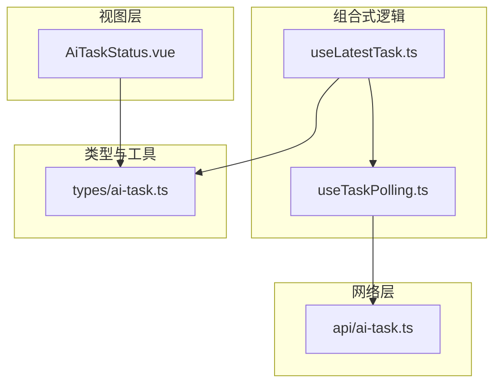
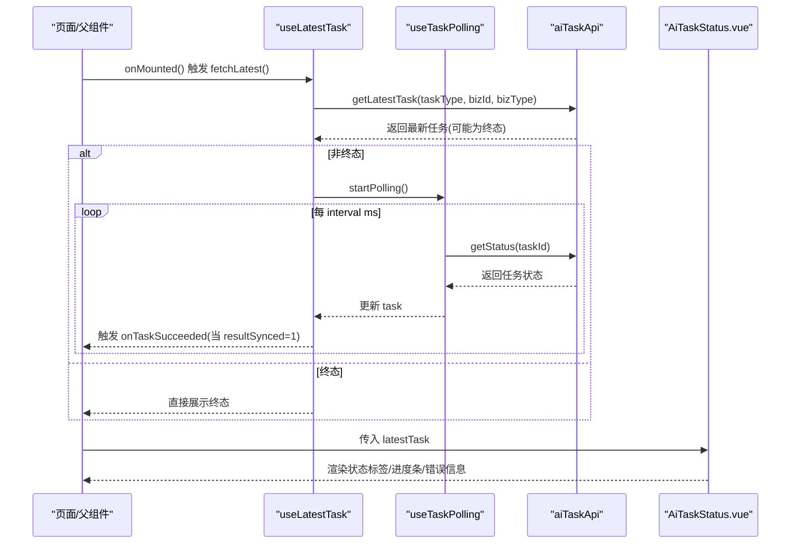
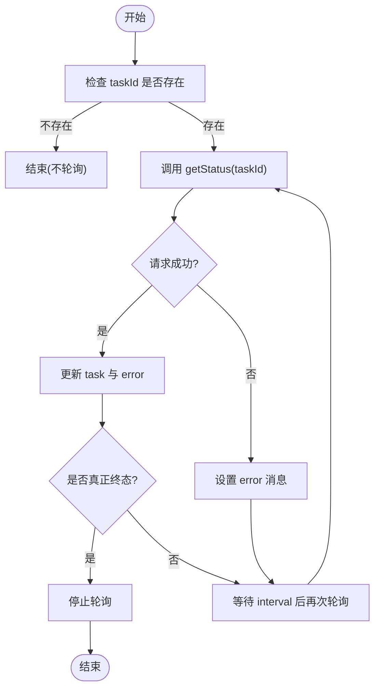
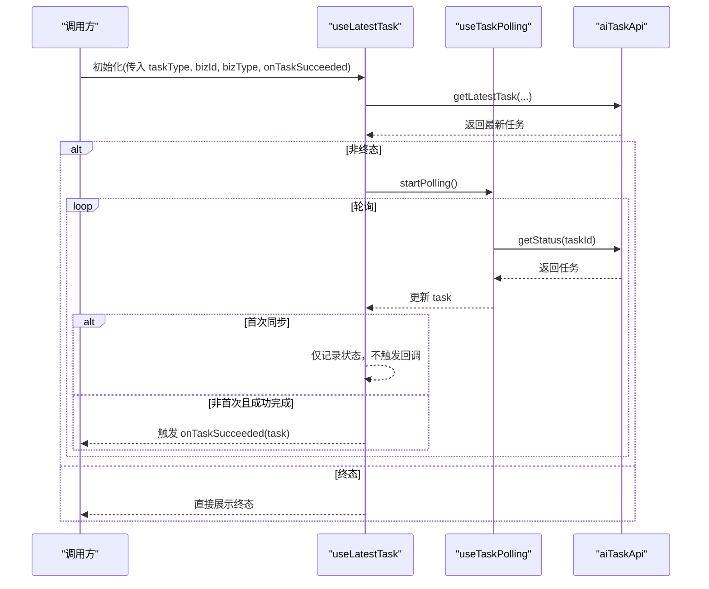
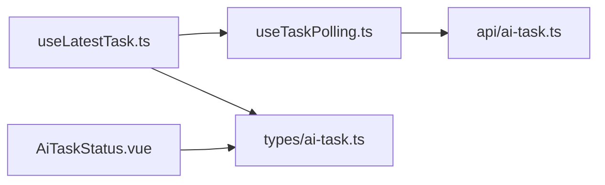

# 任务轮询机制

<cite>
**本文引用的文件**   
- [useTaskPolling.ts](file://ele-ai-tender-frontend/src/composables/useTaskPolling.ts)
- [useLatestTask.ts](file://ele-ai-tender-frontend/src/composables/useLatestTask.ts)
- [AiTaskStatus.vue](file://ele-ai-tender-frontend/src/components/AiTaskStatus.vue)
- [ai-task.ts（类型与工具）](file://ele-ai-tender-frontend/src/types/ai-task.ts)
- [ai-task.ts（API）](file://ele-ai-tender-frontend/src/api/ai-task.ts)
</cite>

## 目录
1. [简介](#简介)
2. [项目结构](#项目结构)
3. [核心组件](#核心组件)
4. [架构总览](#架构总览)
5. [详细组件分析](#详细组件分析)
6. [依赖关系分析](#依赖关系分析)
7. [性能与稳定性](#性能与稳定性)
8. [故障排查指南](#故障排查指南)
9. [结论](#结论)
10. [附录：使用示例与最佳实践](#附录使用示例与最佳实践)

## 简介
本文件围绕前端“任务轮询机制”展开，系统性说明以下三个关键实现：
- 任务轮询组合式函数 useTaskPolling.ts：封装定时轮询、生命周期清理、错误状态暴露。
- 最新任务获取 useLatestTask.ts：负责页面加载时拉取最新任务、非终态自动启动轮询、成功完成回调时机控制。
- 任务状态组件 AiTaskStatus.vue：基于统一类型工具进行状态映射与进度展示。

文档将深入解析轮询间隔控制、错误重试策略、内存泄漏防护、结果同步语义、UI 状态映射等关键技术点，并提供队列管理、性能监控与调试建议。

## 项目结构
与任务轮询相关的前端代码集中在如下位置：
- composables：组合式逻辑（轮询、最新任务）
- components：状态展示组件
- types：任务类型定义与工具函数（终态判断、进度计算、样式映射）
- api：任务相关 HTTP 接口封装



图表来源
- [useTaskPolling.ts:1-74](file://ele-ai-tender-frontend/src/composables/useTaskPolling.ts#L1-L74)
- [useLatestTask.ts:1-116](file://ele-ai-tender-frontend/src/composables/useLatestTask.ts#L1-L116)
- [AiTaskStatus.vue:1-81](file://ele-ai-tender-frontend/src/components/AiTaskStatus.vue#L1-L81)
- [ai-task.ts（类型与工具）:1-221](file://ele-ai-tender-frontend/src/types/ai-task.ts#L1-L221)
- [ai-task.ts（API）:1-29](file://ele-ai-tender-frontend/src/api/ai-task.ts#L1-L29)

章节来源
- [useTaskPolling.ts:1-74](file://ele-ai-tender-frontend/src/composables/useTaskPolling.ts#L1-L74)
- [useLatestTask.ts:1-116](file://ele-ai-tender-frontend/src/composables/useLatestTask.ts#L1-L116)
- [AiTaskStatus.vue:1-81](file://ele-ai-tender-frontend/src/components/AiTaskStatus.vue#L1-L81)
- [ai-task.ts（类型与工具）:1-221](file://ele-ai-tender-frontend/src/types/ai-task.ts#L1-L221)
- [ai-task.ts（API）:1-29](file://ele-ai-tender-frontend/src/api/ai-task.ts#L1-L29)

## 核心组件
- useTaskPolling：提供通用轮询能力，内部维护 task、isPolling、error 响应式状态；根据任务终态自动停止轮询；在 taskId 变化或组件卸载时清理定时器，避免内存泄漏。
- useLatestTask：面向业务页面的“最新任务”聚合器，负责首次查询、非终态自动轮询、成功完成回调触发、可创建新任务守卫、刷新与跳过操作。
- AiTaskStatus.vue：纯展示组件，通过类型工具将任务状态映射为标签颜色与进度条样式，并显示错误信息。

章节来源
- [useTaskPolling.ts:1-74](file://ele-ai-tender-frontend/src/composables/useTaskPolling.ts#L1-L74)
- [useLatestTask.ts:1-116](file://ele-ai-tender-frontend/src/composables/useLatestTask.ts#L1-L116)
- [AiTaskStatus.vue:1-81](file://ele-ai-tender-frontend/src/components/AiTaskStatus.vue#L1-L81)
- [ai-task.ts（类型与工具）:1-221](file://ele-ai-tender-frontend/src/types/ai-task.ts#L1-L221)

## 架构总览
从调用链看，页面通过 useLatestTask 发起“最新任务”查询，若为非终态则交由 useTaskPolling 定时拉取任务状态；最终由 AiTaskStatus.vue 渲染当前任务的状态与进度。



图表来源
- [useLatestTask.ts:33-97](file://ele-ai-tender-frontend/src/composables/useLatestTask.ts#L33-L97)
- [useTaskPolling.ts:17-58](file://ele-ai-tender-frontend/src/composables/useTaskPolling.ts#L17-L58)
- [ai-task.ts（API）:12-28](file://ele-ai-tender-frontend/src/api/ai-task.ts#L12-L28)
- [AiTaskStatus.vue:21-51](file://ele-ai-tender-frontend/src/components/AiTaskStatus.vue#L21-L51)

## 详细组件分析

### 任务轮询组合式函数 useTaskPolling
职责与行为
- 接收一个响应式的 taskId，周期性调用后端接口获取任务状态。
- 当任务进入“真正终态”时自动停止轮询。
- 暴露 error 用于上层捕获异常；暴露 skip 以支持手动跳过卡住的任务。
- 监听 taskId 变化：切换任务时先停止旧轮询再启动新轮询。
- 组件卸载时清理定时器，防止内存泄漏。

轮询终止条件
- 终态集合包含 FAILED、AI_UNAVAILABLE、SKIPPED。
- COMPLETED 需结合 resultSynced：仅当 resultSynced 为 1 时才视为真正终态；0/3 表示仍在等待或正在同步结果，仍需继续轮询。

错误处理
- 单次请求失败不会中断轮询，仅记录 error 消息，供上层提示。
- 未实现指数退避或最大重试次数限制，属于“尽力而为”的轮询模型。

内存泄漏防护
- 每次 taskId 变化或组件卸载前都会 clearInterval，确保无悬挂定时器。



图表来源
- [useTaskPolling.ts:17-44](file://ele-ai-tender-frontend/src/composables/useTaskPolling.ts#L17-L44)
- [ai-task.ts（类型与工具）:147-154](file://ele-ai-tender-frontend/src/types/ai-task.ts#L147-L154)

章节来源
- [useTaskPolling.ts:1-74](file://ele-ai-tender-frontend/src/composables/useTaskPolling.ts#L1-L74)
- [ai-task.ts（类型与工具）:147-154](file://ele-ai-tender-frontend/src/types/ai-task.ts#L147-L154)

### 最新任务获取 useLatestTask
职责与行为
- 页面挂载时查询“最新任务”，无论其状态如何。
- 若非终态，立即启动轮询；若为终态，直接展示。
- 提供 canCreateNew 计算属性，用于“是否允许发起新任务”的守卫。
- 提供 setActive 方法，在用户提交新任务成功后激活该任务并开始轮询。
- 提供 refresh 方法，用于任务创建后重新拉取最新任务。
- 提供 skip 方法，透传到底层轮询器以支持跳过卡住任务。

数据同步策略
- 首次同步标记 firstSync：页面加载恢复场景下，若已处于终态，不应触发成功回调，避免误报。
- 成功完成回调触发时机：当 isTaskSucceeded 从 false 变为 true（即 resultSynced 从非 1 变为 1），此时业务数据可读，适合执行后续动作。

生命周期联动
- 监听 bizId 变化：当 bizId 从无效变为有效值时，自动触发 fetchLatest，解决异步数据延迟赋值问题。
- 内部复用 useTaskPolling 的 startPolling/stopPolling/skip，保证统一的轮询与清理策略。



图表来源
- [useLatestTask.ts:33-97](file://ele-ai-tender-frontend/src/composables/useLatestTask.ts#L33-L97)
- [useTaskPolling.ts:31-44](file://ele-ai-tender-frontend/src/composables/useTaskPolling.ts#L31-L44)
- [ai-task.ts（API）:22-28](file://ele-ai-tender-frontend/src/api/ai-task.ts#L22-L28)

章节来源
- [useLatestTask.ts:1-116](file://ele-ai-tender-frontend/src/composables/useLatestTask.ts#L1-L116)
- [ai-task.ts（类型与工具）:139-154](file://ele-ai-tender-frontend/src/types/ai-task.ts#L139-L154)

### 任务状态组件 AiTaskStatus.vue
职责与行为
- 接收 AiTaskVO | null 作为 props。
- 根据任务状态映射标签类型：如 PENDING/PROCESSING/COMPLETED/FAILED/AI_UNAVAILABLE/SKIPPED。
- 特殊处理：当 status=COMPLETED 且 resultSynced=2 时，标签显示为危险状态。
- 进度百分比与进度条样式分别通过类型工具计算与映射。
- 若有 errorMsg，则以危险文本形式展示。

状态与进度映射
- 进度百分比：PENDING 固定低进度；PROCESSING 中等进度；COMPLETED 根据 resultSynced 决定 100%/0%/90%。
- 进度条样式：resultSynced=2 或 FAILED 为异常；AI_UNAVAILABLE 为警告；其他为空。

```mermaid
classDiagram
class AiTaskStatus {
+props : { task : AiTaskVO | null }
+computed : statusTagType
+computed : progressPercent
+computed : progressStatusValue
}
class Types {
+getTaskProgress(task) : number
+getProgressStatus(task) : string
}
AiTaskStatus --> Types : "使用"
```

图表来源
- [AiTaskStatus.vue:21-51](file://ele-ai-tender-frontend/src/components/AiTaskStatus.vue#L21-L51)
- [ai-task.ts（类型与工具）:157-214](file://ele-ai-tender-frontend/src/types/ai-task.ts#L157-L214)

章节来源
- [AiTaskStatus.vue:1-81](file://ele-ai-tender-frontend/src/components/AiTaskStatus.vue#L1-L81)
- [ai-task.ts（类型与工具）:157-214](file://ele-ai-tender-frontend/src/types/ai-task.ts#L157-L214)

## 依赖关系分析
- useLatestTask 依赖 useTaskPolling 提供的轮询能力，并通过类型工具判定终态与成功完成。
- useTaskPolling 依赖 aiTaskApi 的 getStatus 与 skip 接口。
- AiTaskStatus.vue 依赖类型工具中的进度与样式映射函数。



图表来源
- [useLatestTask.ts:1-116](file://ele-ai-tender-frontend/src/composables/useLatestTask.ts#L1-L116)
- [useTaskPolling.ts:1-74](file://ele-ai-tender-frontend/src/composables/useTaskPolling.ts#L1-L74)
- [ai-task.ts（类型与工具）:1-221](file://ele-ai-tender-frontend/src/types/ai-task.ts#L1-L221)
- [ai-task.ts（API）:1-29](file://ele-ai-tender-frontend/src/api/ai-task.ts#L1-L29)
- [AiTaskStatus.vue:1-81](file://ele-ai-tender-frontend/src/components/AiTaskStatus.vue#L1-L81)

章节来源
- [useLatestTask.ts:1-116](file://ele-ai-tender-frontend/src/composables/useLatestTask.ts#L1-L116)
- [useTaskPolling.ts:1-74](file://ele-ai-tender-frontend/src/composables/useTaskPolling.ts#L1-L74)
- [ai-task.ts（类型与工具）:1-221](file://ele-ai-tender-frontend/src/types/ai-task.ts#L1-L221)
- [ai-task.ts（API）:1-29](file://ele-ai-tender-frontend/src/api/ai-task.ts#L1-L29)
- [AiTaskStatus.vue:1-81](file://ele-ai-tender-frontend/src/components/AiTaskStatus.vue#L1-L81)

## 性能与稳定性
轮询间隔控制
- 默认间隔为 8000ms，可通过 useTaskPolling 的 interval 参数调整。
- 建议在长耗时任务中适当增大间隔以降低服务器压力；短任务可缩短以提升实时性。

错误重试机制
- 当前实现未内置指数退避或最大重试次数限制。
- 建议：在更高层封装中增加重试上限与退避策略，或在网络层拦截器中统一处理。

内存泄漏防护
- 已在 taskId 变化与组件卸载时清理定时器，避免悬挂定时器导致内存泄漏。
- 注意：若父组件频繁切换任务 ID，应确保 stopPolling 被正确调用后再设置新 ID。

结果同步语义
- COMPLETED 不等于真正完成，需等待 resultSynced=1。
- 成功完成回调仅在 resultSynced 从非 1 变为 1 时触发，避免重复通知。

UI 渲染优化
- AiTaskStatus.vue 仅做展示，所有计算均委托给类型工具，保持组件轻量。
- 可在大数据量列表中使用虚拟滚动或按需加载，减少重渲染开销。

[本节为通用指导，无需具体文件引用]

## 故障排查指南
常见问题与定位步骤
- 轮询未停止
  - 检查是否在终态时仍继续轮询：确认 isTaskTerminal 的判断逻辑是否正确覆盖 COMPLETED+resultSynced 的情况。
  - 检查组件卸载或路由切换时是否触发了清理逻辑。
- 成功回调未触发
  - 确认 onTaskSucceeded 仅在 resultSynced 从非 1 变为 1 时触发，避免首次同步场景误触发。
  - 检查父组件是否正确传递了最新的 task 引用。
- 进度显示异常
  - 核对 getTaskProgress 与 getProgressStatus 的分支逻辑是否与后端状态一致。
  - 对于 PROCESSING 状态，如需时间驱动的动态进度，可使用 getProcessingProgressByTime 并结合 startedAt 字段。
- 网络错误
  - 查看 error 响应式变量，必要时在 UI 层提示用户稍后重试。
  - 若需要重试，可在上层封装中增加重试按钮或自动重试逻辑。

章节来源
- [useTaskPolling.ts:17-44](file://ele-ai-tender-frontend/src/composables/useTaskPolling.ts#L17-L44)
- [useLatestTask.ts:71-88](file://ele-ai-tender-frontend/src/composables/useLatestTask.ts#L71-L88)
- [ai-task.ts（类型与工具）:139-214](file://ele-ai-tender-frontend/src/types/ai-task.ts#L139-L214)

## 结论
本方案通过组合式函数分层设计，将“轮询能力”与“业务聚合”解耦，既保证了通用性与可复用性，又提供了清晰的终态判定与成功回调时机。配合统一的类型工具，UI 层得以简洁稳定地展示任务状态与进度。针对生产环境，建议在网络层或上层封装中补充重试与退避策略，并根据业务场景调优轮询间隔，以获得更好的用户体验与系统稳定性。

[本节为总结性内容，无需具体文件引用]

## 附录：使用示例与最佳实践
典型用法要点
- 在页面挂载时调用 useLatestTask，传入任务类型、业务 ID、业务类型以及成功回调。
- 将 latestTask 传递给 AiTaskStatus.vue 进行展示。
- 在用户提交新任务成功后，调用 setActive 激活任务并开始轮询。
- 需要刷新时调用 refresh；遇到卡住任务可调用 skip。

最佳实践清单
- 合理设置轮询间隔：长任务 8-15s，短任务 3-5s。
- 避免在同一页面同时轮询过多任务：优先只轮询当前活跃任务。
- 在路由切换或组件销毁时确保 stopPolling 被调用。
- 对错误进行友好提示，并提供手动重试入口。
- 使用 canCreateNew 守卫防止并发创建任务造成资源竞争。

[本节为通用指导，无需具体文件引用]