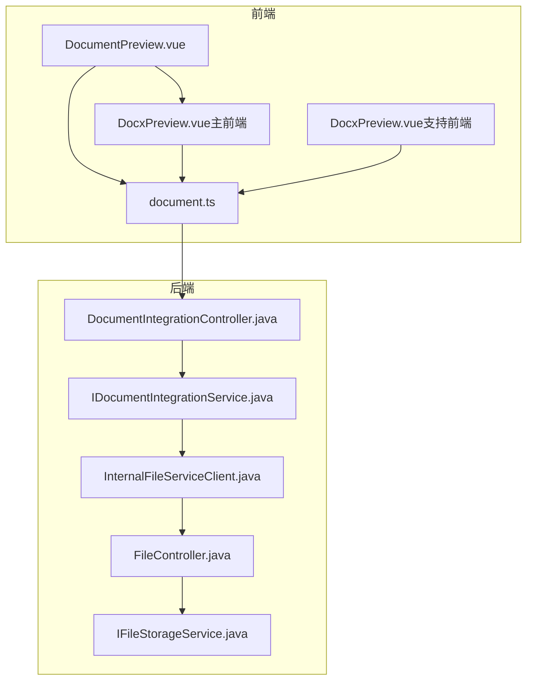
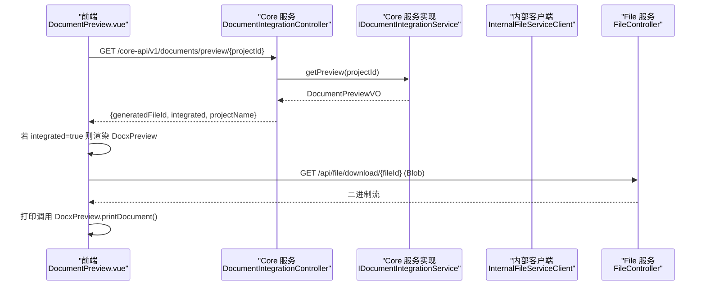
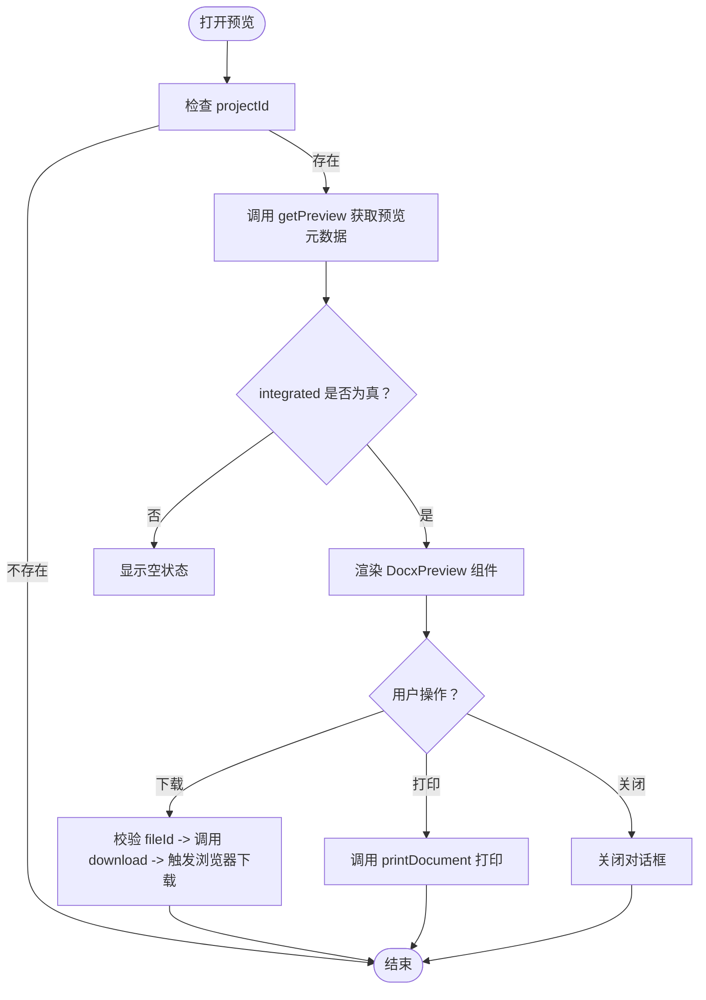
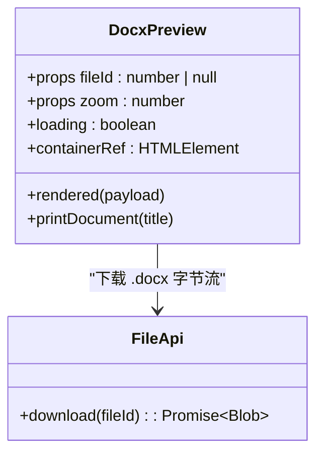
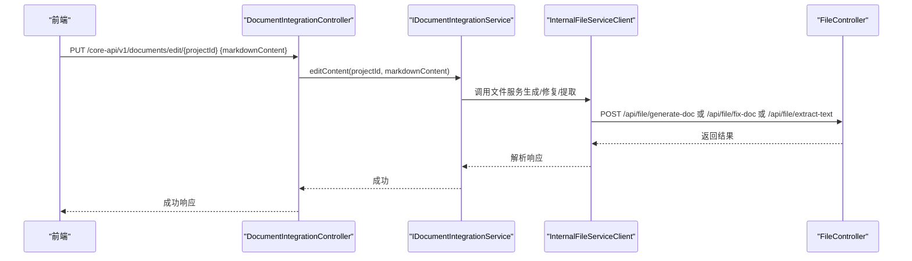
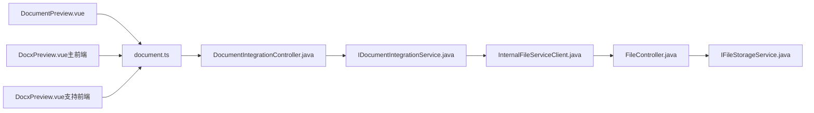

# 文档管理模块

<cite>
**本文引用的文件**   
- [DocumentPreview.vue](file://ele-ai-tender-frontend/src/components/document/DocumentPreview.vue)
- [DocxPreview.vue（主前端）](file://ele-ai-tender-frontend/src/components/document/DocxPreview.vue)
- [DocxPreview.vue（支持前端）](file://ele-ai-tender-support-frontend/src/components/document/DocxPreview.vue)
- [document.ts](file://ele-ai-tender-frontend/src/api/document.ts)
- [FileController.java](file://ele-ai-tender-system/ele-ai-tender-file/src/main/java/com/jy/eleaitender/file/controller/FileController.java)
- [IFileStorageService.java](file://ele-ai-tender-system/ele-ai-tender-file/src/main/java/com/jy/eleaitender/file/service/IFileStorageService.java)
- [InternalFileServiceClient.java](file://ele-ai-tender-system/ele-ai-tender-common/src/main/java/com/jy/eleaitender/common/client/InternalFileServiceClient.java)
- [DocumentIntegrationController.java](file://ele-ai-tender-system/ele-ai-tender-core/src/main/java/com/jy/eleaitender/core/controller/DocumentIntegrationController.java)
- [IDocumentIntegrationService.java](file://ele-ai-tender-system/ele-ai-tender-core/src/main/java/com/jy/eleaitender/core/service/IDocumentIntegrationService.java)
- [FILE_SERVICE_SPEC.md](file://docs/rules/FILE_SERVICE_SPEC.md)
</cite>

## 目录
1. [简介](#简介)
2. [项目结构](#项目结构)
3. [核心组件](#核心组件)
4. [架构总览](#架构总览)
5. [详细组件分析](#详细组件分析)
6. [依赖关系分析](#依赖关系分析)
7. [性能与优化](#性能与优化)
8. [故障排查指南](#故障排查指南)
9. [结论](#结论)
10. [附录](#附录)

## 简介
本模块聚焦于“文档管理”的前后端能力，覆盖多格式预览、Word 文档渲染与打印、文档集成与在线编辑、文件上传下载、以及文档转换服务集成等关键能力。重点包括：
- 文档预览入口 DocumentPreview.vue 的多格式支持与渲染优化策略
- Word 文档预览 DocxPreview.vue 的格式保持与交互功能（缩放、打印、页面计数）
- 文件上传下载的进度管理与断点续传方案建议
- 文档版本控制、权限管理、在线编辑的核心流程
- 文档转换服务集成（Markdown→Word、模板填充、文本提取）、缓存策略与性能优化

## 项目结构
围绕文档管理的关键代码分布在前后端多个模块中：
- 前端主应用（ele-ai-tender-frontend）提供文档预览入口与 Word 渲染组件
- 前端支持系统（ele-ai-tender-support-frontend）提供独立的 Word 预览组件
- 后端 File 服务（ele-ai-tender-file）提供文件上传/下载/信息/结构/生成/修复/文本提取等接口
- 后端 Core 服务（ele-ai-tender-core）提供文档集成、预览与内容编辑接口
- 通用客户端（ele-ai-tender-common）封装内部服务调用（如 InternalFileServiceClient）

图表来源
- [DocumentPreview.vue:1-123](file://ele-ai-tender-frontend/src/components/document/DocumentPreview.vue#L1-L123)
- [DocxPreview.vue（主前端）:1-243](file://ele-ai-tender-frontend/src/components/document/DocxPreview.vue#L1-L243)
- [DocxPreview.vue（支持前端）:1-121](file://ele-ai-tender-support-frontend/src/components/document/DocxPreview.vue#L1-L121)
- [document.ts:1-20](file://ele-ai-tender-frontend/src/api/document.ts#L1-L20)
- [DocumentIntegrationController.java:1-50](file://ele-ai-tender-system/ele-ai-tender-core/src/main/java/com/jy/eleaitender/core/controller/DocumentIntegrationController.java#L1-L50)
- [IDocumentIntegrationService.java:1-26](file://ele-ai-tender-system/ele-ai-tender-core/src/main/java/com/jy/eleaitender/core/service/IDocumentIntegrationService.java#L1-L26)
- [FileController.java:1-177](file://ele-ai-tender-system/ele-ai-tender-file/src/main/java/com/jy/eleaitender/file/controller/FileController.java#L1-L177)
- [IFileStorageService.java:1-65](file://ele-ai-tender-system/ele-ai-tender-file/src/main/java/com/jy/eleaitender/file/service/IFileStorageService.java#L1-L65)
- [InternalFileServiceClient.java:220-327](file://ele-ai-tender-system/ele-ai-tender-common/src/main/java/com/jy/eleaitender/common/client/InternalFileServiceClient.java#L220-L327)

章节来源
- [DocumentPreview.vue:1-123](file://ele-ai-tender-frontend/src/components/document/DocumentPreview.vue#L1-L123)
- [DocxPreview.vue（主前端）:1-243](file://ele-ai-tender-frontend/src/components/document/DocxPreview.vue#L1-L243)
- [DocxPreview.vue（支持前端）:1-121](file://ele-ai-tender-support-frontend/src/components/document/DocxPreview.vue#L1-L121)
- [document.ts:1-20](file://ele-ai-tender-frontend/src/api/document.ts#L1-L20)
- [FileController.java:1-177](file://ele-ai-tender-system/ele-ai-tender-file/src/main/java/com/jy/eleaitender/file/controller/FileController.java#L1-L177)
- [IFileStorageService.java:1-65](file://ele-ai-tender-system/ele-ai-tender-file/src/main/java/com/jy/eleaitender/file/service/IFileStorageService.java#L1-L65)
- [InternalFileServiceClient.java:220-327](file://ele-ai-tender-system/ele-ai-tender-common/src/main/java/com/jy/eleaitender/common/client/InternalFileServiceClient.java#L220-L327)
- [DocumentIntegrationController.java:1-50](file://ele-ai-tender-system/ele-ai-tender-core/src/main/java/com/jy/eleaitender/core/controller/DocumentIntegrationController.java#L1-L50)
- [IDocumentIntegrationService.java:1-26](file://ele-ai-tender-system/ele-ai-tender-core/src/main/java/com/jy/eleaitender/core/service/IDocumentIntegrationService.java#L1-L26)
- [FILE_SERVICE_SPEC.md:1-153](file://docs/rules/FILE_SERVICE_SPEC.md#L1-L153)

## 核心组件
- 文档预览入口（DocumentPreview.vue）
  - 负责打开全屏预览对话框，根据后端返回的 integrated 字段决定是否使用 DocxPreview 进行集成渲染
  - 提供下载与打印操作；下载通过 fileApi.download(fileId) 获取 Blob 并触发浏览器下载
  - 打印委托给 DocxPreview 的 printDocument 方法，确保样式与分页正确
- Word 文档预览（DocxPreview.vue，主前端）
  - 基于 docx-preview 渲染 .docx 为 HTML，支持 zoom 缩放、页面计数、打印
  - 渲染完成后通过事件向上层暴露 pageCount，便于统计或展示
  - 打印时克隆 DOM 到隐藏 iframe，注入样式并调用 window.print()
- Word 文档预览（DocxPreview.vue，支持前端）
  - 简化版渲染逻辑，监听 fileId 变化自动渲染，清理容器避免内存泄漏
- 文档集成接口（Core 服务）
  - 提供 integrate、getPreview、editContent 三个接口，用于执行集成、获取预览元数据、编辑 Markdown 内容
- 文件服务接口（File 服务）
  - 提供 upload、download、info、delete、structure、generate-doc、fix-doc、extract-text 等接口
  - 下载接口返回二进制流，文件名经 URL 编码处理
- 内部服务客户端（InternalFileServiceClient）
  - 封装对 File 服务的 HTTP 调用，包含 extractText、解析结构、生成文档等方法的响应解析与错误处理

章节来源
- [DocumentPreview.vue:1-123](file://ele-ai-tender-frontend/src/components/document/DocumentPreview.vue#L1-L123)
- [DocxPreview.vue（主前端）:1-243](file://ele-ai-tender-frontend/src/components/document/DocxPreview.vue#L1-L243)
- [DocxPreview.vue（支持前端）:1-121](file://ele-ai-tender-support-frontend/src/components/document/DocxPreview.vue#L1-L121)
- [DocumentIntegrationController.java:1-50](file://ele-ai-tender-system/ele-ai-tender-core/src/main/java/com/jy/eleaitender/core/controller/DocumentIntegrationController.java#L1-L50)
- [IDocumentIntegrationService.java:1-26](file://ele-ai-tender-system/ele-ai-tender-core/src/main/java/com/jy/eleaitender/core/service/IDocumentIntegrationService.java#L1-L26)
- [FileController.java:1-177](file://ele-ai-tender-system/ele-ai-tender-file/src/main/java/com/jy/eleaitender/file/controller/FileController.java#L1-L177)
- [InternalFileServiceClient.java:220-327](file://ele-ai-tender-system/ele-ai-tender-common/src/main/java/com/jy/eleaitender/common/client/InternalFileServiceClient.java#L220-L327)

## 架构总览
文档预览与集成的端到端流程如下：
- 前端打开预览对话框，调用 Core 服务获取预览元数据（是否已集成、生成的文件 ID、项目名称）
- 若已集成，则使用 DocxPreview 组件加载并渲染 .docx
- 用户可执行下载或打印操作；下载走 File 服务二进制流，打印由 DocxPreview 完成
- 文档集成与编辑通过 Core 服务协调，必要时调用 File 服务进行文档生成、修复与文本提取

图表来源
- [DocumentPreview.vue:1-123](file://ele-ai-tender-frontend/src/components/document/DocumentPreview.vue#L1-L123)
- [DocxPreview.vue（主前端）:1-243](file://ele-ai-tender-frontend/src/components/document/DocxPreview.vue#L1-L243)
- [DocumentIntegrationController.java:1-50](file://ele-ai-tender-system/ele-ai-tender-core/src/main/java/com/jy/eleaitender/core/controller/DocumentIntegrationController.java#L1-L50)
- [IDocumentIntegrationService.java:1-26](file://ele-ai-tender-system/ele-ai-tender-core/src/main/java/com/jy/eleaitender/core/service/IDocumentIntegrationService.java#L1-L26)
- [FileController.java:1-177](file://ele-ai-tender-system/ele-ai-tender-file/src/main/java/com/jy/eleaitender/file/controller/FileController.java#L1-L177)

## 详细组件分析

### 文档预览入口（DocumentPreview.vue）
- 多格式支持与渲染优化
  - 通过后端返回的 integrated 字段判断是否启用集成渲染；若未集成则显示空状态提示
  - 使用 v-loading 在加载期间显示遮罩，避免重复请求
  - 下载前校验目标 fileId 是否存在，防止无效操作
- 交互功能
  - 下载：调用 fileApi.download(fileId) 获取 Blob，创建临时链接触发下载，成功后释放对象 URL
  - 打印：委托 DocxPreview 的 printDocument 方法，传入文件名作为打印标题
- 错误处理
  - 获取预览失败时清空 fileId 与 integrated 标志，并给出错误提示
  - 下载失败时提示用户重试

图表来源
- [DocumentPreview.vue:1-123](file://ele-ai-tender-frontend/src/components/document/DocumentPreview.vue#L1-L123)

章节来源
- [DocumentPreview.vue:1-123](file://ele-ai-tender-frontend/src/components/document/DocumentPreview.vue#L1-L123)

### Word 文档预览（DocxPreview.vue，主前端）
- 格式保持与渲染配置
  - 使用 renderAsync 渲染 .docx，配置 includeWrapper、breakPages、ignoreFonts 等参数以尽量保持原始格式与分页
  - 渲染完成后通过 nextTick 计算页面数量，向上层 emit rendered 事件
- 交互功能
  - 缩放：通过容器 style.zoom 动态调整缩放比例
  - 打印：克隆当前 DOM 到隐藏 iframe，注入 @page 与 section 分页样式，调用 window.print()
- 生命周期与资源清理
  - onBeforeUnmount 时设置取消标志并清空容器 innerHTML，避免内存泄漏
  - watch fileId 变化时重新渲染或清空

图表来源
- [DocxPreview.vue（主前端）:1-243](file://ele-ai-tender-frontend/src/components/document/DocxPreview.vue#L1-L243)

章节来源
- [DocxPreview.vue（主前端）:1-243](file://ele-ai-tender-frontend/src/components/document/DocxPreview.vue#L1-L243)

### Word 文档预览（DocxPreview.vue，支持前端）
- 简化渲染逻辑，监听 fileId 变化自动渲染
- 清理容器避免内存泄漏，渲染失败时提示用户下载查看

章节来源
- [DocxPreview.vue（支持前端）:1-121](file://ele-ai-tender-support-frontend/src/components/document/DocxPreview.vue#L1-L121)

### 文档集成与在线编辑（Core 服务）
- 集成预览
  - 提供 /core-api/v1/documents/preview/{projectId} 接口，返回集成后的预览元数据（包含 generatedFileId、integrated、projectName）
- 在线编辑
  - 提供 /core-api/v1/documents/edit/{projectId} 接口，接收 markdownContent 更新集成后的文档内容
- 集成执行
  - 提供 /core-api/v1/documents/integrate/{projectId} 接口，异步执行文档集成任务（返回 AI 任务信息）

图表来源
- [DocumentIntegrationController.java:1-50](file://ele-ai-tender-system/ele-ai-tender-core/src/main/java/com/jy/eleaitender/core/controller/DocumentIntegrationController.java#L1-L50)
- [IDocumentIntegrationService.java:1-26](file://ele-ai-tender-system/ele-ai-tender-core/src/main/java/com/jy/eleaitender/core/service/IDocumentIntegrationService.java#L1-L26)
- [InternalFileServiceClient.java:220-327](file://ele-ai-tender-system/ele-ai-tender-common/src/main/java/com/jy/eleaitender/common/client/InternalFileServiceClient.java#L220-L327)
- [FileController.java:1-177](file://ele-ai-tender-system/ele-ai-tender-file/src/main/java/com/jy/eleaitender/file/controller/FileController.java#L1-L177)

章节来源
- [DocumentIntegrationController.java:1-50](file://ele-ai-tender-system/ele-ai-tender-core/src/main/java/com/jy/eleaitender/core/controller/DocumentIntegrationController.java#L1-L50)
- [IDocumentIntegrationService.java:1-26](file://ele-ai-tender-system/ele-ai-tender-core/src/main/java/com/jy/eleaitender/core/service/IDocumentIntegrationService.java#L1-L26)
- [InternalFileServiceClient.java:220-327](file://ele-ai-tender-system/ele-ai-tender-common/src/main/java/com/jy/eleaitender/common/client/InternalFileServiceClient.java#L220-L327)
- [FileController.java:1-177](file://ele-ai-tender-system/ele-ai-tender-file/src/main/java/com/jy/eleaitender/file/controller/FileController.java#L1-L177)

### 文件上传下载（File 服务）
- 上传
  - POST /api/file/upload，要求 file 与 bizType 参数，默认最大文件大小 500MB
- 下载
  - GET /api/file/download/{fileId}，返回二进制流，文件名经 UTF-8 URL 编码
- 其他能力
  - info、delete、structure、generate-doc、fix-doc、extract-text 等接口供 Core 服务内部调用

章节来源
- [FileController.java:1-177](file://ele-ai-tender-system/ele-ai-tender-file/src/main/java/com/jy/eleaitender/file/controller/FileController.java#L1-L177)
- [FILE_SERVICE_SPEC.md:1-153](file://docs/rules/FILE_SERVICE_SPEC.md#L1-L153)

## 依赖关系分析
- 前端依赖
  - DocumentPreview.vue 依赖 document.ts 提供的集成预览与编辑接口
  - DocxPreview.vue 依赖 fileApi.download 获取 .docx 字节流
- 后端依赖
  - Core 服务通过 InternalFileServiceClient 调用 File 服务
  - File 服务通过 IFileStorageService 访问文件系统与数据库元信息

图表来源
- [DocumentPreview.vue:1-123](file://ele-ai-tender-frontend/src/components/document/DocumentPreview.vue#L1-L123)
- [DocxPreview.vue（主前端）:1-243](file://ele-ai-tender-frontend/src/components/document/DocxPreview.vue#L1-L243)
- [DocxPreview.vue（支持前端）:1-121](file://ele-ai-tender-support-frontend/src/components/document/DocxPreview.vue#L1-L121)
- [document.ts:1-20](file://ele-ai-tender-frontend/src/api/document.ts#L1-L20)
- [DocumentIntegrationController.java:1-50](file://ele-ai-tender-system/ele-ai-tender-core/src/main/java/com/jy/eleaitender/core/controller/DocumentIntegrationController.java#L1-L50)
- [IDocumentIntegrationService.java:1-26](file://ele-ai-tender-system/ele-ai-tender-core/src/main/java/com/jy/eleaitender/core/service/IDocumentIntegrationService.java#L1-L26)
- [InternalFileServiceClient.java:220-327](file://ele-ai-tender-system/ele-ai-tender-common/src/main/java/com/jy/eleaitender/common/client/InternalFileServiceClient.java#L220-L327)
- [FileController.java:1-177](file://ele-ai-tender-system/ele-ai-tender-file/src/main/java/com/jy/eleaitender/file/controller/FileController.java#L1-L177)
- [IFileStorageService.java:1-65](file://ele-ai-tender-system/ele-ai-tender-file/src/main/java/com/jy/eleaitender/file/service/IFileStorageService.java#L1-L65)

章节来源
- [document.ts:1-20](file://ele-ai-tender-frontend/src/api/document.ts#L1-L20)
- [FileController.java:1-177](file://ele-ai-tender-system/ele-ai-tender-file/src/main/java/com/jy/eleaitender/file/controller/FileController.java#L1-L177)
- [InternalFileServiceClient.java:220-327](file://ele-ai-tender-system/ele-ai-tender-common/src/main/java/com/jy/eleaitender/common/client/InternalFileServiceClient.java#L220-L327)

## 性能与优化
- 渲染优化
  - 按需渲染：仅在 integrated=true 且 fileId 有效时渲染 DocxPreview，减少不必要的 DOM 操作
  - 增量更新：watch fileId 变化后先清空容器再渲染，避免重复渲染导致的内存占用
  - 打印隔离：打印时使用隐藏 iframe 与独立样式，避免影响主界面布局与性能
- 下载优化
  - 使用 Blob 与 URL.createObjectURL 触发下载，完成后及时 revokeObjectURL 释放内存
- 转换服务集成
  - 利用 File 服务的 generate-doc、fix-doc、extract-text 接口进行文档生成、修复与文本提取，避免前端直接处理复杂文档格式
- 缓存策略（建议）
  - 预览元数据缓存：对 getPreview 的结果按 projectId 做短期缓存，减少频繁请求
  - 文件下载缓存：对常用 .docx 文件使用浏览器缓存（Cache-Control）或 CDN 缓存，提升二次访问速度
  - 文本提取缓存：对 extract-text 的结果按 fileId 做短期缓存，避免重复解析大文档
- 并发与限流（建议）
  - 对 generate-doc 与 fix-doc 等耗时接口增加队列与限流，避免瞬时高并发导致服务抖动
  - 前端在下载大文件时增加进度反馈与重试机制，提升用户体验

[本节为通用指导，不直接分析具体文件]

## 故障排查指南
- 预览失败
  - 检查 getPreview 返回的 integrated 与 generatedFileId 是否正确
  - 确认 File 服务 download 接口返回的二进制流是否正常
- 下载失败
  - 检查 fileId 是否存在，File 服务路径是否有效，磁盘文件是否存在
  - 确认文件名编码是否正确（UTF-8 URL 编码）
- 打印异常
  - 确认 DocxPreview 已渲染完成，容器内存在可打印内容
  - 检查 iframe 注入样式与分页规则是否生效
- 内部服务调用错误
  - 遵循规范：检查响应 code 字段，非 200 时抛出具体错误
  - 服务间认证：确保使用 TOKEN_TYPE_SERVICE 类型的 JWT
  - ObjectMapper 复用：禁止每次调用 new ObjectMapper()
  - fix-doc locationRef：replacements 反序列化必须用 Map<String, Object>，否则嵌套对象丢失

章节来源
- [FILE_SERVICE_SPEC.md:123-153](file://docs/rules/FILE_SERVICE_SPEC.md#L123-L153)
- [InternalFileServiceClient.java:220-327](file://ele-ai-tender-system/ele-ai-tender-common/src/main/java/com/jy/eleaitender/common/client/InternalFileServiceClient.java#L220-L327)
- [FileController.java:60-86](file://ele-ai-tender-system/ele-ai-tender-file/src/main/java/com/jy/eleaitender/file/controller/FileController.java#L60-L86)
- [DocxPreview.vue（主前端）:110-203](file://ele-ai-tender-frontend/src/components/document/DocxPreview.vue#L110-L203)

## 结论
文档管理模块以前端预览入口为核心，结合 Core 服务的集成与编辑能力、File 服务的文件与文档处理能力，实现了多格式预览、Word 渲染与打印、在线编辑与转换服务集成。通过合理的渲染优化、缓存策略与错误处理，提升了整体性能与用户体验。后续可在断点续传、更细粒度的权限控制与版本对比方面进一步增强。

[本节为总结性内容，不直接分析具体文件]

## 附录
- 相关接口清单
  - 文档集成：/core-api/v1/documents/integrate、/preview、/edit
  - 文件服务：/api/file/upload、/download/{fileId}、/info/{fileId}、/delete/{fileId}、/structure/{fileId}、/generate-doc、/fix-doc、/extract-text
- 关键约束与建议
  - 文件字段命名与摘要规范
  - 内部服务调用错误处理与服务间认证
  - poi-tl 引擎与 Word 文档修复引擎的使用约束

章节来源
- [FILE_SERVICE_SPEC.md:1-153](file://docs/rules/FILE_SERVICE_SPEC.md#L1-L153)
- [FileController.java:1-177](file://ele-ai-tender-system/ele-ai-tender-file/src/main/java/com/jy/eleaitender/file/controller/FileController.java#L1-L177)
- [DocumentIntegrationController.java:1-50](file://ele-ai-tender-system/ele-ai-tender-core/src/main/java/com/jy/eleaitender/core/controller/DocumentIntegrationController.java#L1-L50)