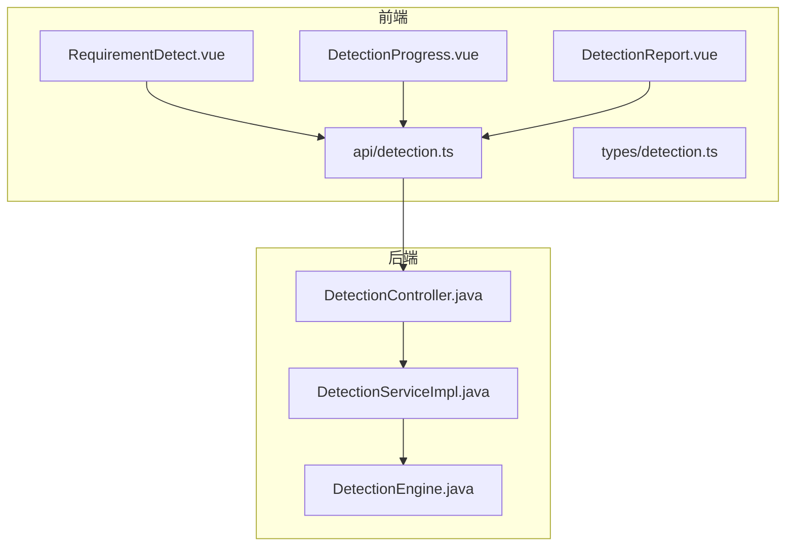
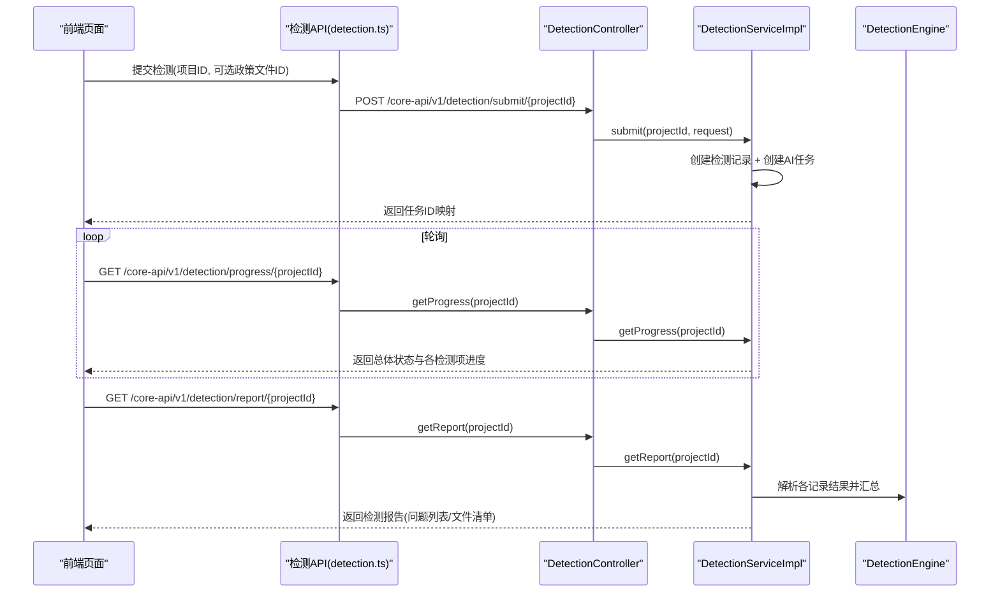
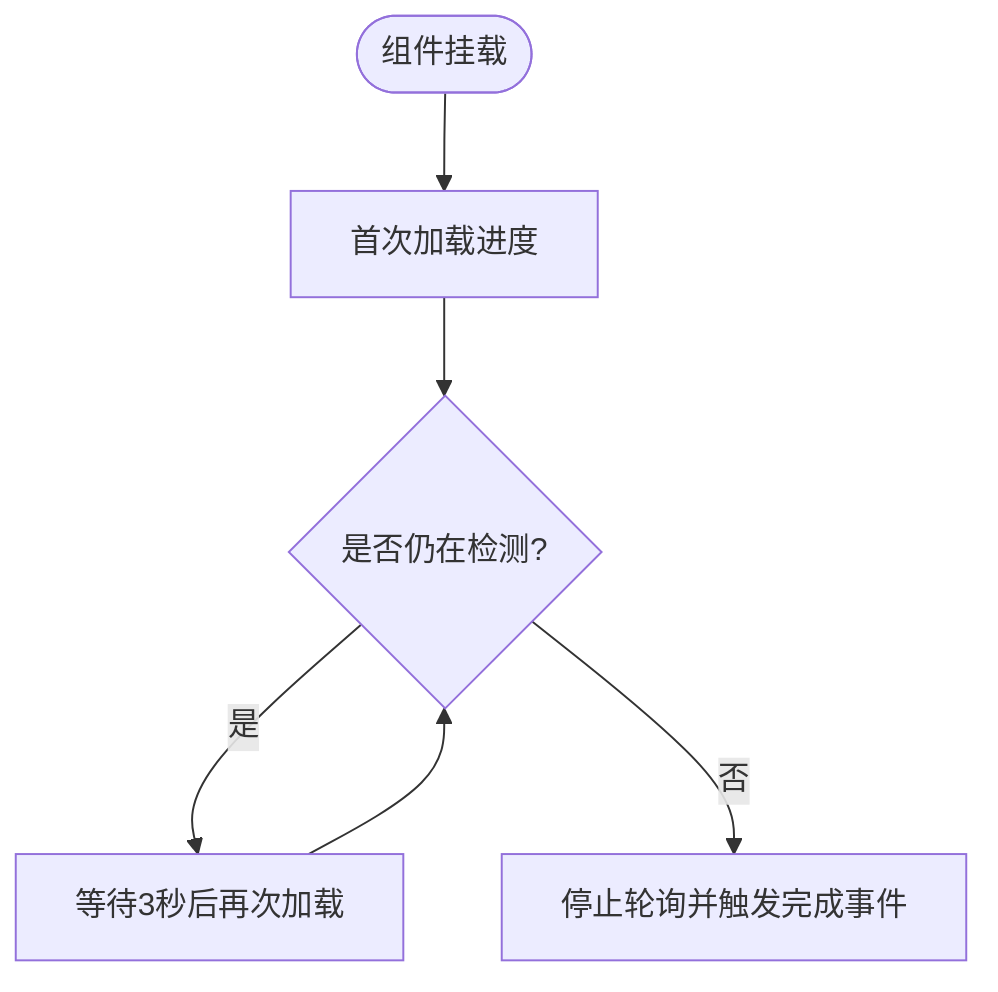
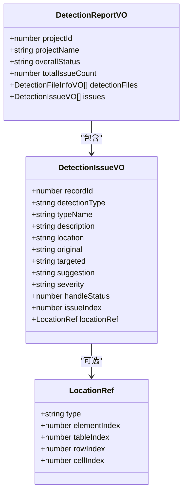
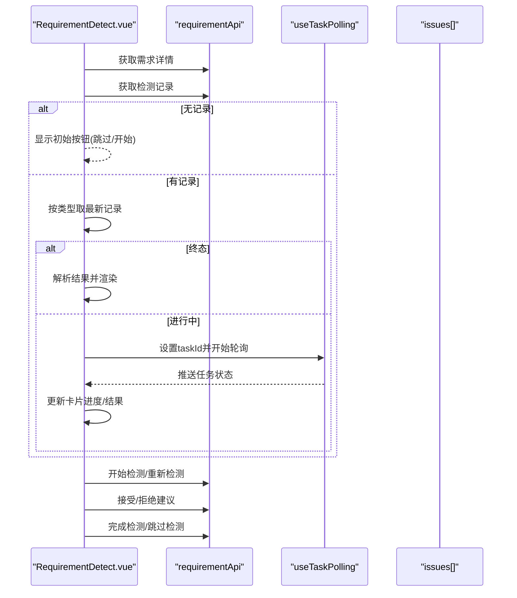
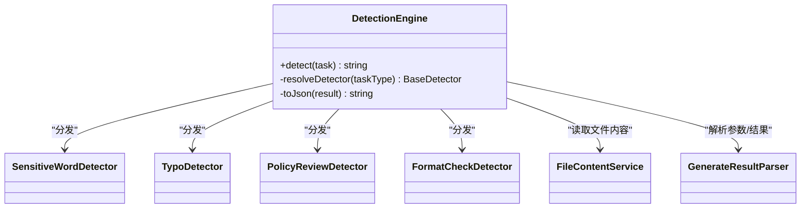
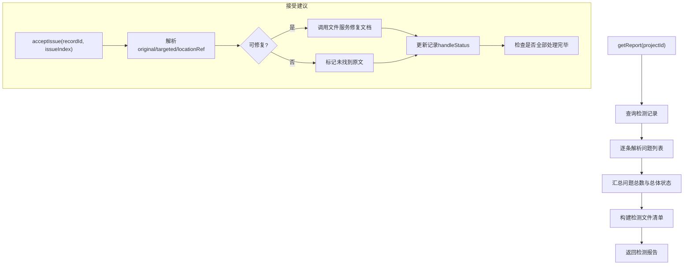
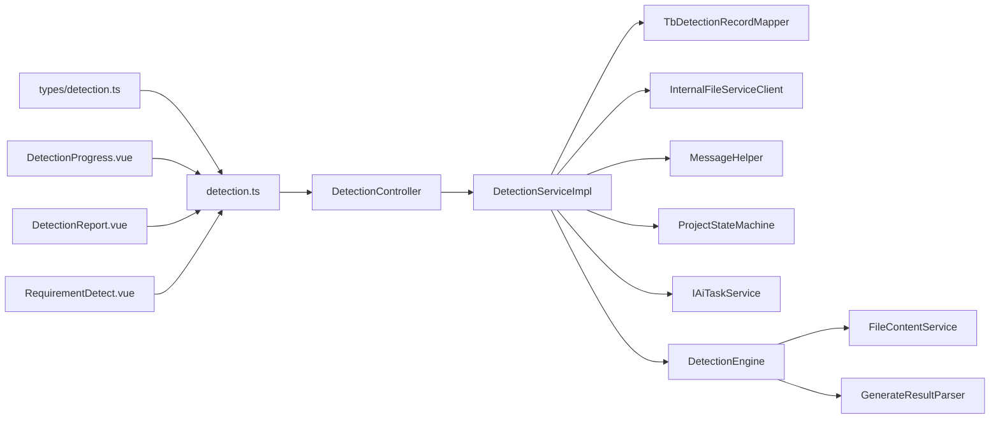

# 智能检测模块

<cite>
**本文引用的文件**   
- [DetectionProgress.vue](file://ele-ai-tender-frontend/src/components/detection/DetectionProgress.vue)
- [DetectionReport.vue](file://ele-ai-tender-frontend/src/components/detection/DetectionReport.vue)
- [RequirementDetect.vue](file://ele-ai-tender-frontend/src/views/requirement/RequirementDetect.vue)
- [detection.ts](file://ele-ai-tender-frontend/src/api/detection.ts)
- [detection.ts（类型）](file://ele-ai-tender-frontend/src/types/detection.ts)
- [DetectionController.java](file://ele-ai-tender-system/ele-ai-tender-core/src/main/java/com/jy/eleaitender/core/controller/DetectionController.java)
- [DetectionServiceImpl.java](file://ele-ai-tender-system/ele-ai-tender-core/src/main/java/com/jy/eleaitender/core/service/impl/DetectionServiceImpl.java)
- [DetectionEngine.java](file://ele-ai-tender-system/ele-ai-tender-ai/src/main/java/com/jy/eleaitender/ai/processor/checker/DetectionEngine.java)
</cite>

## 目录
1. [简介](#简介)
2. [项目结构](#项目结构)
3. [核心组件](#核心组件)
4. [架构总览](#架构总览)
5. [详细组件分析](#详细组件分析)
6. [依赖关系分析](#依赖关系分析)
7. [性能与可扩展性](#性能与可扩展性)
8. [故障排查指南](#故障排查指南)
9. [结论](#结论)
10. [附录](#附录)

## 简介
本模块面向招标文件智能检测，提供从提交、进度监控、报告展示到问题定位与修复的完整前端体验；后端通过统一控制器与服务编排，将检测任务分发至AI引擎执行，并持久化检测结果。需求级检测包含“敏感词检测”和“错别字检查”，项目级检测还包含“政策文件审查”和“格式规范检测”。

## 项目结构
- 前端
  - 组件：检测进度、检测报告
  - 页面：需求检测提交页
  - API：检测相关接口封装
  - 类型：检测相关数据结构定义
- 后端
  - 控制器：检测流程对外API
  - 服务：检测编排、结果解析、状态流转、文档修复
  - AI引擎：按任务类型分发到具体检测器，输出结构化结果

图表来源
- [DetectionProgress.vue:1-280](file://ele-ai-tender-frontend/src/components/detection/DetectionProgress.vue#L1-L280)
- [DetectionReport.vue:1-497](file://ele-ai-tender-frontend/src/components/detection/DetectionReport.vue#L1-L497)
- [RequirementDetect.vue:1-800](file://ele-ai-tender-frontend/src/views/requirement/RequirementDetect.vue#L1-L800)
- [detection.ts:1-45](file://ele-ai-tender-frontend/src/api/detection.ts#L1-L45)
- [detection.ts（类型）:1-79](file://ele-ai-tender-frontend/src/types/detection.ts#L1-L79)
- [DetectionController.java:1-90](file://ele-ai-tender-system/ele-ai-tender-core/src/main/java/com/jy/eleaitender/core/controller/DetectionController.java#L1-L90)
- [DetectionServiceImpl.java:1-578](file://ele-ai-tender-system/ele-ai-tender-core/src/main/java/com/jy/eleaitender/core/service/impl/DetectionServiceImpl.java#L1-L578)
- [DetectionEngine.java:1-126](file://ele-ai-tender-system/ele-ai-tender-ai/src/main/java/com/jy/eleaitender/ai/processor/checker/DetectionEngine.java#L1-L126)

章节来源
- [DetectionProgress.vue:1-280](file://ele-ai-tender-frontend/src/components/detection/DetectionProgress.vue#L1-L280)
- [DetectionReport.vue:1-497](file://ele-ai-tender-frontend/src/components/detection/DetectionReport.vue#L1-L497)
- [RequirementDetect.vue:1-800](file://ele-ai-tender-frontend/src/views/requirement/RequirementDetect.vue#L1-L800)
- [detection.ts:1-45](file://ele-ai-tender-frontend/src/api/detection.ts#L1-L45)
- [detection.ts（类型）:1-79](file://ele-ai-tender-frontend/src/types/detection.ts#L1-L79)
- [DetectionController.java:1-90](file://ele-ai-tender-system/ele-ai-tender-core/src/main/java/com/jy/eleaitender/core/controller/DetectionController.java#L1-L90)
- [DetectionServiceImpl.java:1-578](file://ele-ai-tender-system/ele-ai-tender-core/src/main/java/com/jy/eleaitender/core/service/impl/DetectionServiceImpl.java#L1-L578)
- [DetectionEngine.java:1-126](file://ele-ai-tender-system/ele-ai-tender-ai/src/main/java/com/jy/eleaitender/ai/processor/checker/DetectionEngine.java#L1-L126)

## 核心组件
- 检测进度监控（DetectionProgress.vue）
  - 每3秒轮询获取检测进度，渲染总体状态与各检测项状态、百分比与图标
  - 当整体状态非进行中时停止轮询并向上层触发完成事件
- 检测报告（DetectionReport.vue）
  - 汇总四类检测的问题数量卡片、检测文件清单、按类型分组的问题列表
  - 支持接受/拒绝建议、查看原文、定位到文档等交互
- 检测提交页面（RequirementDetect.vue）
  - 需求级检测仅两项：错别字检查、敏感词检测
  - 支持开始检测、重新检测、跳过检测、完成检测
  - 为每个检测项独立轮询任务进度，解析任务结果并聚合问题列表
  - 支持接受/拒绝建议，并在接受时自动修正内容

章节来源
- [DetectionProgress.vue:1-280](file://ele-ai-tender-frontend/src/components/detection/DetectionProgress.vue#L1-L280)
- [DetectionReport.vue:1-497](file://ele-ai-tender-frontend/src/components/detection/DetectionReport.vue#L1-L497)
- [RequirementDetect.vue:1-800](file://ele-ai-tender-frontend/src/views/requirement/RequirementDetect.vue#L1-L800)

## 架构总览
前后端协作的关键路径：
- 前端调用检测API提交或查询
- 后端控制器路由到服务层
- 服务层创建检测记录与AI任务，编排检测流程
- AI引擎根据任务类型选择检测器执行，返回JSON结果
- 服务层解析结果、更新记录、驱动状态机与文档修复

图表来源
- [DetectionController.java:27-47](file://ele-ai-tender-system/ele-ai-tender-core/src/main/java/com/jy/eleaitender/core/controller/DetectionController.java#L27-L47)
- [DetectionServiceImpl.java:86-230](file://ele-ai-tender-system/ele-ai-tender-core/src/main/java/com/jy/eleaitender/core/service/impl/DetectionServiceImpl.java#L86-L230)
- [DetectionEngine.java:53-95](file://ele-ai-tender-system/ele-ai-tender-ai/src/main/java/com/jy/eleaitender/ai/processor/checker/DetectionEngine.java#L53-L95)
- [detection.ts:6-18](file://ele-ai-tender-frontend/src/api/detection.ts#L6-L18)

## 详细组件分析

### 检测进度监控（DetectionProgress.vue）
- 实时状态更新
  - 使用定时器每3秒调用进度接口，直到整体状态不再为进行中
  - 计算总进度百分比：已完成/失败项占比
- 可视化展示
  - 顶部状态图标与文案随整体状态切换
  - 每项检测显示名称、状态图标、中文标签与进度条
  - 底部显示总进度条与百分比
- 关键实现要点
  - 状态映射：等待中/检测中/已完成/失败/AI不可用
  - 单项进度映射：PENDING=10%，PROCESSING=60%，COMPLETED/FAILED=100%
  - 生命周期钩子：挂载时加载并启动轮询，卸载前清理定时器

图表来源
- [DetectionProgress.vue:80-97](file://ele-ai-tender-frontend/src/components/detection/DetectionProgress.vue#L80-L97)
- [DetectionProgress.vue:106-120](file://ele-ai-tender-frontend/src/components/detection/DetectionProgress.vue#L106-L120)
- [DetectionProgress.vue:122-127](file://ele-ai-tender-frontend/src/components/detection/DetectionProgress.vue#L122-L127)

章节来源
- [DetectionProgress.vue:1-280](file://ele-ai-tender-frontend/src/components/detection/DetectionProgress.vue#L1-L280)

### 检测报告（DetectionReport.vue）
- 结果呈现
  - 摘要卡片：按检测类型统计未处理问题数，区分通过/警告
  - 检测文件：主招标文件与政策文件清单
  - 问题列表：按类型分组，显示位置、描述、严重级别、修改建议
- 问题定位与交互
  - 接受/拒绝建议，查看原文弹窗，定位到文档（locationRef）
  - 暴露刷新方法与未处理计数供父组件使用
- 数据模型
  - 使用统一的检测类型映射与严重级别映射
  - 基于issues数组进行分组与统计

图表来源
- [detection.ts（类型）:46-79](file://ele-ai-tender-frontend/src/types/detection.ts#L46-L79)

章节来源
- [DetectionReport.vue:1-497](file://ele-ai-tender-frontend/src/components/detection/DetectionReport.vue#L1-L497)
- [detection.ts（类型）:1-79](file://ele-ai-tender-frontend/src/types/detection.ts#L1-L79)

### 检测提交页面（RequirementDetect.vue）
- 规则配置与批量处理
  - 需求级检测固定两项：错别字检查、敏感词检测
  - 支持“开始检测”、“重新检测”、“跳过检测”、“完成检测”
  - 为每个检测项维护独立的轮询实例，避免相互干扰
- 任务恢复与容错
  - 进入页面先拉取历史检测记录，按类型取最新一条
  - 若处于终态则直接渲染结果；若进行中则设置轮询
  - 对特定错误码进行友好提示与恢复
- 结果解析与交互
  - 解析任务结果中的问题列表，合并到全局issues
  - 接受建议时调用后端接口并自动修正内容，拒绝建议时标记已拒绝
  - 查看原文弹窗高亮原始片段

图表来源
- [RequirementDetect.vue:319-391](file://ele-ai-tender-frontend/src/views/requirement/RequirementDetect.vue#L319-L391)
- [RequirementDetect.vue:423-476](file://ele-ai-tender-frontend/src/views/requirement/RequirementDetect.vue#L423-L476)
- [RequirementDetect.vue:478-504](file://ele-ai-tender-frontend/src/views/requirement/RequirementDetect.vue#L478-L504)
- [RequirementDetect.vue:507-533](file://ele-ai-tender-frontend/src/views/requirement/RequirementDetect.vue#L507-L533)

章节来源
- [RequirementDetect.vue:1-800](file://ele-ai-tender-frontend/src/views/requirement/RequirementDetect.vue#L1-L800)

### 检测引擎集成与规则匹配算法
- 引擎编排（DetectionEngine）
  - 根据任务类型选择对应检测器：敏感词、错别字、政策审查、格式检查
  - 组装输入内容：文本参数 + 可选文件内容提取
  - 若无政策文件且类型为政策审查，直接返回通过结果
  - 将检测器结果序列化为统一JSON：包含问题列表与评分
- 检测器能力
  - 敏感词检测：匹配敏感词库，输出命中位置与建议替换
  - 错别字检测：识别错别字并提供修正建议
  - 政策文件审查：结合用户选择的政策文件进行合规性比对
  - 格式规范检测：校验标题层级、编号、表格等格式一致性
- 结果解析与持久化
  - 服务层解析问题数、评分、handleStatus、locationRef等字段
  - 接受建议时调用文件服务进行精准替换，并回写新文件ID

图表来源
- [DetectionEngine.java:53-126](file://ele-ai-tender-system/ele-ai-tender-ai/src/main/java/com/jy/eleaitender/ai/processor/checker/DetectionEngine.java#L53-L126)

章节来源
- [DetectionEngine.java:1-126](file://ele-ai-tender-system/ele-ai-tender-ai/src/main/java/com/jy/eleaitender/ai/processor/checker/DetectionEngine.java#L1-L126)

### 报告生成机制
- 服务层聚合
  - 遍历项目下所有检测记录，解析每条记录的问题列表
  - 汇总问题总数与总体状态（存在未处理问题则为失败）
  - 构建检测文件清单：主招标文件 + 政策文件（去重并按优先级命名）
- 文档修复联动
  - 接受单个建议：尝试基于original/targeted与locationRef进行精准替换
  - 一键接受全部：收集所有替换项，批量修复并回写文件ID
  - 自动推进状态：当所有问题均已处理，自动转为通过并创建版本快照

图表来源
- [DetectionServiceImpl.java:205-230](file://ele-ai-tender-system/ele-ai-tender-core/src/main/java/com/jy/eleaitender/core/service/impl/DetectionServiceImpl.java#L205-L230)
- [DetectionServiceImpl.java:290-336](file://ele-ai-tender-system/ele-ai-tender-core/src/main/java/com/jy/eleaitender/core/service/impl/DetectionServiceImpl.java#L290-L336)
- [DetectionServiceImpl.java:361-394](file://ele-ai-tender-system/ele-ai-tender-core/src/main/java/com/jy/eleaitender/core/service/impl/DetectionServiceImpl.java#L361-L394)

章节来源
- [DetectionServiceImpl.java:205-394](file://ele-ai-tender-system/ele-ai-tender-core/src/main/java/com/jy/eleaitender/core/service/impl/DetectionServiceImpl.java#L205-L394)

## 依赖关系分析
- 前端依赖
  - 组件依赖API封装与类型定义
  - RequirementDetect.vue依赖任务轮询组合式函数与AI任务类型工具
- 后端依赖
  - Controller依赖Service
  - Service依赖Mapper、AI任务服务、文件服务客户端、消息助手、状态机
  - AI引擎依赖文件内容服务与结果解析器

图表来源
- [detection.ts:1-45](file://ele-ai-tender-frontend/src/api/detection.ts#L1-L45)
- [detection.ts（类型）:1-79](file://ele-ai-tender-frontend/src/types/detection.ts#L1-L79)
- [DetectionController.java:1-90](file://ele-ai-tender-system/ele-ai-tender-core/src/main/java/com/jy/eleaitender/core/controller/DetectionController.java#L1-L90)
- [DetectionServiceImpl.java:1-120](file://ele-ai-tender-system/ele-ai-tender-core/src/main/java/com/jy/eleaitender/core/service/impl/DetectionServiceImpl.java#L1-L120)
- [DetectionEngine.java:1-46](file://ele-ai-tender-system/ele-ai-tender-ai/src/main/java/com/jy/eleaitender/ai/processor/checker/DetectionEngine.java#L1-L46)

章节来源
- [detection.ts:1-45](file://ele-ai-tender-frontend/src/api/detection.ts#L1-L45)
- [detection.ts（类型）:1-79](file://ele-ai-tender-frontend/src/types/detection.ts#L1-L79)
- [DetectionController.java:1-90](file://ele-ai-tender-system/ele-ai-tender-core/src/main/java/com/jy/eleaitender/core/controller/DetectionController.java#L1-L90)
- [DetectionServiceImpl.java:1-120](file://ele-ai-tender-system/ele-ai-tender-core/src/main/java/com/jy/eleaitender/core/service/impl/DetectionServiceImpl.java#L1-L120)
- [DetectionEngine.java:1-46](file://ele-ai-tender-system/ele-ai-tender-ai/src/main/java/com/jy/eleaitender/ai/processor/checker/DetectionEngine.java#L1-L46)

## 性能与可扩展性
- 前端轮询优化
  - 按需轮询：仅在检测进行中开启定时器，完成后立即停止
  - 独立轮询：需求级检测为每个检测项单独轮询，避免互相阻塞
  - 防抖与节流：可在高频场景下增加请求节流策略
- 后端并发与批处理
  - 批量接受建议时一次性修复文档，减少多次IO
  - 定时任务同步待处理记录状态，降低前端压力
- 可扩展点
  - 新增检测类型：在引擎中注册新检测器，并在服务层枚举中添加类型
  - 自定义规则：在对应检测器中扩展匹配逻辑与结果结构
  - 文档修复增强：完善locationRef定位精度，提升替换成功率

[本节为通用指导，不直接分析具体文件]

## 故障排查指南
- 常见问题
  - 检测未完成：部分检测项标记为失败或AI不可用，需重试或检查AI连通性
  - 无法定位原文：locationRef缺失或原文不匹配，导致修复失败
  - 重复记录：重新检测后出现多条记录，应只取最新一条
- 排查步骤
  - 确认提交成功：检查返回的任务ID映射
  - 查看进度：观察总体状态与各检测项状态
  - 查看报告：核对问题列表与处理状态
  - 重试流程：走状态机回到进行中再重新提交
- 日志与断点
  - 关注服务层日志：提交、重试、接受/拒绝、批量修复
  - 关注引擎日志：检测开始/结束、跳过原因、序列化异常

章节来源
- [DetectionServiceImpl.java:414-468](file://ele-ai-tender-system/ele-ai-tender-core/src/main/java/com/jy/eleaitender/core/service/impl/DetectionServiceImpl.java#L414-L468)
- [DetectionServiceImpl.java:290-336](file://ele-ai-tender-system/ele-ai-tender-core/src/main/java/com/jy/eleaitender/core/service/impl/DetectionServiceImpl.java#L290-L336)
- [DetectionEngine.java:81-95](file://ele-ai-tender-system/ele-ai-tender-ai/src/main/java/com/jy/eleaitender/ai/processor/checker/DetectionEngine.java#L81-L95)

## 结论
智能检测模块以前端三件套（进度、报告、提交页）为核心入口，配合后端控制器与服务编排，实现了多类型检测任务的统一提交、进度跟踪、结果聚合与文档修复闭环。通过引擎分发与结果解析，系统具备良好的可扩展性与容错能力，适合持续演进更多检测规则与更精准的文档修复。

## 附录
- API参考
  - 提交检测：POST /core-api/v1/detection/submit/{projectId}
  - 获取进度：GET /core-api/v1/detection/progress/{projectId}
  - 获取报告：GET /core-api/v1/detection/report/{projectId}
  - 接受建议：POST /core-api/v1/detection/{recordId}/accept?issueIndex=...
  - 拒绝建议：POST /core-api/v1/detection/{recordId}/reject?issueIndex=...
  - 一键接受：POST /core-api/v1/detection/accept-all/{projectId}
  - 跳过检测：POST /core-api/v1/detection/skip/{projectId}
  - 重新检测：POST /core-api/v1/detection/retry/{projectId}

章节来源
- [DetectionController.java:27-88](file://ele-ai-tender-system/ele-ai-tender-core/src/main/java/com/jy/eleaitender/core/controller/DetectionController.java#L27-L88)
- [detection.ts:6-43](file://ele-ai-tender-frontend/src/api/detection.ts#L6-L43)