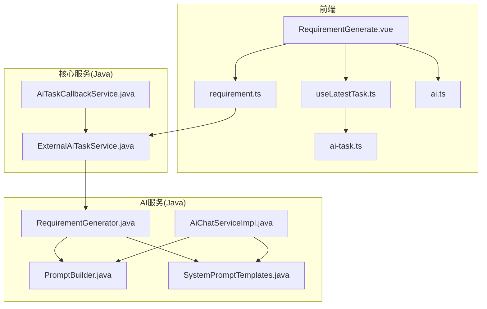
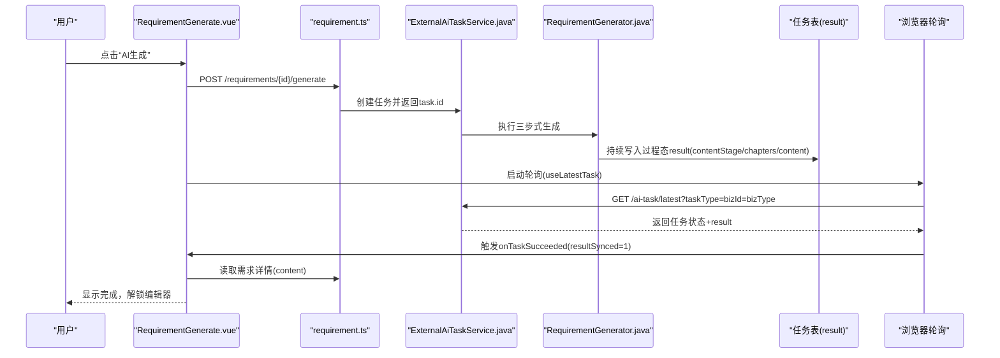
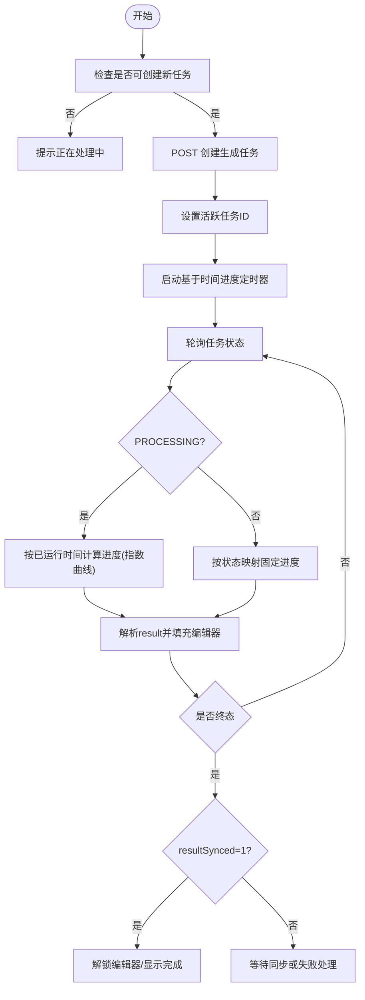
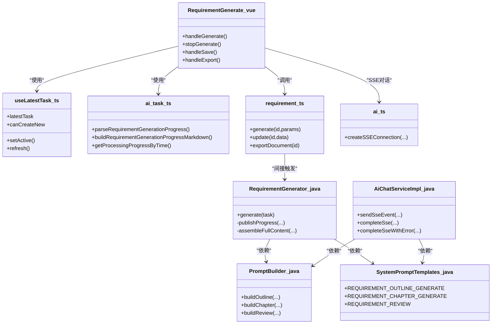

# AI内容生成

<cite>
**本文引用的文件列表**
- [RequirementGenerate.vue](file://ele-ai-tender-frontend/src/views/requirement/RequirementGenerate.vue)
- [useLatestTask.ts](file://ele-ai-tender-frontend/src/composables/useLatestTask.ts)
- [ai-task.ts](file://ele-ai-tender-frontend/src/types/ai-task.ts)
- [requirement.ts](file://ele-ai-tender-frontend/src/api/requirement.ts)
- [ai.ts](file://ele-ai-tender-frontend/src/api/ai.ts)
- [FRONTEND_CONVENTIONS.md](file://docs/rules/FRONTEND_CONVENTIONS.md)
- [RequirementGenerator.java](file://ele-ai-tender-system/ele-ai-tender-ai/src/main/java/com/jy/eleaitender/ai/processor/generator/RequirementGenerator.java)
- [PromptBuilder.java](file://ele-ai-tender-system/ele-ai-tender-ai/src/main/java/com/jy/eleaitender/ai/processor/prompt/PromptBuilder.java)
- [SystemPromptTemplates.java](file://ele-ai-tender-system/ele-ai-tender-ai/src/main/java/com/jy/eleaitender/ai/processor/prompt/SystemPromptTemplates.java)
- [AiChatServiceImpl.java](file://ele-ai-tender-system/ele-ai-tender-ai/src/main/java/com/jy/eleaitender/ai/service/impl/AiChatServiceImpl.java)
- [ExternalAiTaskService.java](file://ele-ai-tender-system/ele-ai-tender-core/src/main/java/com/jy/eleaitender/core/service/external/ExternalAiTaskService.java)
- [AiTaskCallbackService.java](file://ele-ai-tender-system/ele-ai-tender-core/src/main/java/com/jy/eleaitender/core/service/external/AiTaskCallbackService.java)
</cite>

## 目录
1. [简介](#简介)
2. [项目结构](#项目结构)
3. [核心组件](#核心组件)
4. [架构总览](#架构总览)
5. [详细组件分析](#详细组件分析)
6. [依赖关系分析](#依赖关系分析)
7. [性能与体验优化](#性能与体验优化)
8. [故障排查指南](#故障排查指南)
9. [结论](#结论)
10. [附录：协议与数据格式](#附录协议与数据格式)

## 简介
本文件面向“AI内容生成功能”，聚焦需求文档的自动生成流程，围绕前端页面 RequirementGenerate.vue 的实现逻辑展开，涵盖：
- SSE流式响应处理（对话场景）与任务轮询（生成场景）
- AI提示词工程（大纲、分章、审查）与结果拼装
- 生成进度可视化、编辑器锁定与内容插入机制
- 错误处理、重试策略与任务状态管理
- 与后端AI服务的通信协议和数据格式约定

## 项目结构
该功能横跨前后端多个模块：
- 前端页面与组合式函数负责用户交互、任务轮询、进度渲染与内容编辑
- 后端AI服务负责提示词组装、模型路由、三步式Agent编排（大纲→分章→审查）、过程态持久化与SSE推送（对话）
- 核心服务提供外部系统回调与任务查询能力

图表来源
- [RequirementGenerate.vue:1-800](file://ele-ai-tender-frontend/src/views/requirement/RequirementGenerate.vue#L1-L800)
- [useLatestTask.ts:1-116](file://ele-ai-tender-frontend/src/composables/useLatestTask.ts#L1-L116)
- [ai-task.ts:1-221](file://ele-ai-tender-frontend/src/types/ai-task.ts#L1-L221)
- [requirement.ts:1-80](file://ele-ai-tender-frontend/src/api/requirement.ts#L1-L80)
- [ai.ts:88-180](file://ele-ai-tender-frontend/src/api/ai.ts#L88-L180)
- [RequirementGenerator.java:124-195](file://ele-ai-tender-system/ele-ai-tender-ai/src/main/java/com/jy/eleaitender/ai/processor/generator/RequirementGenerator.java#L124-L195)
- [PromptBuilder.java:1-173](file://ele-ai-tender-system/ele-ai-tender-ai/src/main/java/com/jy/eleaitender/ai/processor/prompt/PromptBuilder.java#L1-L173)
- [SystemPromptTemplates.java:71-188](file://ele-ai-tender-system/ele-ai-tender-ai/src/main/java/com/jy/eleaitender/ai/processor/prompt/SystemPromptTemplates.java#L71-L188)
- [AiChatServiceImpl.java:217-262](file://ele-ai-tender-system/ele-ai-tender-ai/src/main/java/com/jy/eleaitender/ai/service/impl/AiChatServiceImpl.java#L217-L262)
- [ExternalAiTaskService.java:95-175](file://ele-ai-tender-system/ele-ai-tender-core/src/main/java/com/jy/eleaitender/core/service/external/ExternalAiTaskService.java#L95-L175)
- [AiTaskCallbackService.java:30-190](file://ele-ai-tender-system/ele-ai-tender-core/src/main/java/com/jy/eleaitender/core/service/external/AiTaskCallbackService.java#L30-L190)

章节来源
- [RequirementGenerate.vue:1-800](file://ele-ai-tender-frontend/src/views/requirement/RequirementGenerate.vue#L1-L800)
- [FRONTEND_CONVENTIONS.md:45-56](file://docs/rules/FRONTEND_CONVENTIONS.md#L45-L56)

## 核心组件
- RequirementGenerate.vue：需求生成主页面，负责加载需求信息、发起生成任务、展示进度、锁定编辑器、保存/导出、反馈与AI助手交互。
- useLatestTask.ts：封装“最新AI任务”查询与轮询，提供 canCreateNew、setActive、refresh 等能力，并在任务完成时触发回调。
- ai-task.ts：定义任务类型、状态、进度解析与Markdown构建工具，以及进度百分比与样式映射。
- requirement.ts：封装需求相关REST接口，包括创建/更新/导出/检测/生成等。
- ai.ts：封装SSE客户端，用于对话场景的流式接收与事件解析。
- RequirementGenerator.java：实现“三步式Agent”需求生成（大纲→分章→审查），持续写入任务result作为过程态，供前端轮询渲染。
- PromptBuilder.java / SystemPromptTemplates.java：动态构建User Prompt与固定System Prompt模板，支撑高质量生成。
- AiChatServiceImpl.java：对话SSE服务端实现，发送 message/done/error 事件。
- ExternalAiTaskService.java / AiTaskCallbackService.java：对外暴露任务查询与终态回调，支持重试与签名校验。

章节来源
- [RequirementGenerate.vue:256-780](file://ele-ai-tender-frontend/src/views/requirement/RequirementGenerate.vue#L256-L780)
- [useLatestTask.ts:1-116](file://ele-ai-tender-frontend/src/composables/useLatestTask.ts#L1-L116)
- [ai-task.ts:87-221](file://ele-ai-tender-frontend/src/types/ai-task.ts#L87-L221)
- [requirement.ts:37-40](file://ele-ai-tender-frontend/src/api/requirement.ts#L37-L40)
- [ai.ts:88-180](file://ele-ai-tender-frontend/src/api/ai.ts#L88-L180)
- [RequirementGenerator.java:124-195](file://ele-ai-tender-system/ele-ai-tender-ai/src/main/java/com/jy/eleaitender/ai/processor/generator/RequirementGenerator.java#L124-L195)
- [PromptBuilder.java:48-88](file://ele-ai-tender-system/ele-ai-tender-ai/src/main/java/com/jy/eleaitender/ai/processor/prompt/PromptBuilder.java#L48-L88)
- [SystemPromptTemplates.java:71-188](file://ele-ai-tender-system/ele-ai-tender-ai/src/main/java/com/jy/eleaitender/ai/processor/prompt/SystemPromptTemplates.java#L71-L188)
- [AiChatServiceImpl.java:217-262](file://ele-ai-tender-system/ele-ai-tender-ai/src/main/java/com/jy/eleaitender/ai/service/impl/AiChatServiceImpl.java#L217-L262)
- [ExternalAiTaskService.java:95-175](file://ele-ai-tender-system/ele-ai-tender-core/src/main/java/com/jy/eleaitender/core/service/external/ExternalAiTaskService.java#L95-L175)
- [AiTaskCallbackService.java:30-190](file://ele-ai-tender-system/ele-ai-tender-core/src/main/java/com/jy/eleaitender/core/service/external/AiTaskCallbackService.java#L30-L190)

## 架构总览
从用户点击“AI生成”到最终内容落库，整体流程如下：

图表来源
- [RequirementGenerate.vue:594-624](file://ele-ai-tender-frontend/src/views/requirement/RequirementGenerate.vue#L594-L624)
- [requirement.ts:37-40](file://ele-ai-tender-frontend/src/api/requirement.ts#L37-L40)
- [ExternalAiTaskService.java:95-175](file://ele-ai-tender-system/ele-ai-tender-core/src/main/java/com/jy/eleaitender/core/service/external/ExternalAiTaskService.java#L95-L175)
- [RequirementGenerator.java:124-195](file://ele-ai-tender-system/ele-ai-tender-ai/src/main/java/com/jy/eleaitender/ai/processor/generator/RequirementGenerator.java#L124-L195)
- [useLatestTask.ts:33-63](file://ele-ai-tender-frontend/src/composables/useLatestTask.ts#L33-L63)

## 详细组件分析

### RequirementGenerate.vue 实现要点
- 初始化与数据加载
  - 根据路由参数加载需求详情、参考文件、检测记录，并生成标签。
  - 使用 useLatestTask 监听最新任务，非终态自动轮询；任务成功后回调中拉取业务内容。
- 生成流程控制
  - 点击“AI生成”后调用 requirementApi.generate 创建任务，设置活跃任务ID并启动基于时间的统一进度定时器。
  - 生成期间编辑器锁定（generationLocked/editorReadonly），完成后解锁。
- 进度渲染
  - 通过 ai-task.ts 的 parseRequirementGenerationProgress 和 buildRequirementGenerationProgressMarkdown 将后端 result 转为Markdown实时填充编辑器。
  - 结合 getProcessingProgressByTime 在 PROCESSING 阶段给出平滑进度曲线，避免回退。
- 保存/导出/下一步
  - 保存调用 requirementApi.update；导出为docx；下一步进入智能检测页。
- AI助手与替换
  - 侧边栏AiAssistantSidebar支持快捷操作与选中替换，使用 applyAiReplacement 精准替换原文。

章节来源
- [RequirementGenerate.vue:285-367](file://ele-ai-tender-frontend/src/views/requirement/RequirementGenerate.vue#L285-L367)
- [RequirementGenerate.vue:394-441](file://ele-ai-tender-frontend/src/views/requirement/RequirementGenerate.vue#L394-L441)
- [RequirementGenerate.vue:446-519](file://ele-ai-tender-frontend/src/views/requirement/RequirementGenerate.vue#L446-L519)
- [RequirementGenerate.vue:594-624](file://ele-ai-tender-frontend/src/views/requirement/RequirementGenerate.vue#L594-L624)
- [RequirementGenerate.vue:632-676](file://ele-ai-tender-frontend/src/views/requirement/RequirementGenerate.vue#L632-L676)
- [RequirementGenerate.vue:698-725](file://ele-ai-tender-frontend/src/views/requirement/RequirementGenerate.vue#L698-L725)
- [ai-task.ts:87-137](file://ele-ai-tender-frontend/src/types/ai-task.ts#L87-L137)
- [ai-task.ts:190-204](file://ele-ai-tender-frontend/src/types/ai-task.ts#L190-L204)

#### 生成进度与编辑器锁定时序

图表来源
- [RequirementGenerate.vue:594-624](file://ele-ai-tender-frontend/src/views/requirement/RequirementGenerate.vue#L594-L624)
- [ai-task.ts:157-204](file://ele-ai-tender-frontend/src/types/ai-task.ts#L157-L204)
- [ai-task.ts:87-137](file://ele-ai-tender-frontend/src/types/ai-task.ts#L87-L137)

### createSSEConnection 的使用方式（对话场景）
- 前端 ai.ts 实现了通用SSE客户端：
  - 以 ReadableStream 逐块解码，按 \n\n 分割事件块
  - 解析 event/data 行，兼容 data:value 与 data: value
  - 事件名 message/done/error 分别对应消息、完成、错误
  - 支持 JSON content 字段提取与纯文本兜底
- 典型用法：
  - 建立连接后注册 onMessage/onError/onComplete
  - 在 onMessage 中将增量内容追加到编辑器或聊天面板
  - 在 onComplete 中清理状态与UI
  - 返回取消函数，便于主动中断

章节来源
- [ai.ts:88-180](file://ele-ai-tender-frontend/src/api/ai.ts#L88-L180)
- [AiChatServiceImpl.java:217-262](file://ele-ai-tender-system/ele-ai-tender-ai/src/main/java/com/jy/eleaitender/ai/service/impl/AiChatServiceImpl.java#L217-L262)

### 错误处理与重试机制
- 前端
  - 任务创建失败：捕获异常并提示，重置生成标志位与定时器
  - 轮询失败：useLatestTask 内部捕获异常并清空任务状态
  - SSE错误：ai.ts 将 error 事件转换为 onError 回调
- 后端
  - 分章生成异常：记录日志并返回占位提示，保证整体流程不中断
  - 审查修订异常：回退到原始内容，确保可用性
  - 外部回调重试：AiTaskCallbackService 支持最大重试次数与状态回写

章节来源
- [RequirementGenerate.vue:619-624](file://ele-ai-tender-frontend/src/views/requirement/RequirementGenerate.vue#L619-L624)
- [useLatestTask.ts:33-56](file://ele-ai-tender-frontend/src/composables/useLatestTask.ts#L33-L56)
- [ai.ts:119-126](file://ele-ai-tender-frontend/src/api/ai.ts#L119-L126)
- [RequirementGenerator.java:482-490](file://ele-ai-tender-system/ele-ai-tender-ai/src/main/java/com/jy/eleaitender/ai/processor/generator/RequirementGenerator.java#L482-L490)
- [RequirementGenerator.java:688-692](file://ele-ai-tender-system/ele-ai-tender-ai/src/main/java/com/jy/eleaitender/ai/processor/generator/RequirementGenerator.java#L688-L692)
- [AiTaskCallbackService.java:157-185](file://ele-ai-tender-system/ele-ai-tender-core/src/main/java/com/jy/eleaitender/core/service/external/AiTaskCallbackService.java#L157-L185)

### 任务状态管理
- 状态维度
  - status：PENDING/PROCESSING/COMPLETED/FAILED/AI_UNAVAILABLE/SKIPPED
  - resultSynced：0未同步/1已同步/2同步失败/3同步中
- 关键判定
  - isTaskSucceeded：status=COMPLETED 且 resultSynced=1
  - isTaskResultSyncing：status=COMPLETED 且 resultSynced∈{0,3}
  - isTaskTerminal：终态集合 + COMPLETED 且不在同步中
- 进度映射
  - getTaskProgress：按状态映射百分比
  - getProcessingProgressByTime：PROCESSING 阶段按已运行时间计算指数曲线进度

章节来源
- [ai-task.ts:139-221](file://ele-ai-tender-frontend/src/types/ai-task.ts#L139-L221)

### AI提示词工程与生成质量优化
- 三步式Agent
  - Step1 大纲生成：根据项目信息输出JSON大纲，包含章节标题、核心要点与预估字数
  - Step2 分章并行生成：并发度可控，每章独立生成Markdown正文，实时拼接可用内容
  - Step3 全文审查与局部修订：AI输出修订列表，代码层精确替换，避免误改
- 提示词模板
  - SystemPromptTemplates 定义各场景角色与规则约束（如禁止歧视性表述、必须量化指标、严格字数上限等）
  - PromptBuilder 动态组装User Prompt，注入项目类型、类别、预算、描述等上下文
- 质量保障
  - 大纲预估总字数压缩至阈值内，防止超长
  - 分章生成限流并发，避免触发速率限制
  - 修订应用前进行匹配次数校验与最小长度保护，从后向前替换避免偏移漂移

章节来源
- [RequirementGenerator.java:124-195](file://ele-ai-tender-system/ele-ai-tender-ai/src/main/java/com/jy/eleaitender/ai/processor/generator/RequirementGenerator.java#L124-L195)
- [RequirementGenerator.java:347-428](file://ele-ai-tender-system/ele-ai-tender-ai/src/main/java/com/jy/eleaitender/ai/processor/generator/RequirementGenerator.java#L347-L428)
- [RequirementGenerator.java:646-692](file://ele-ai-tender-system/ele-ai-tender-ai/src/main/java/com/jy/eleaitender/ai/processor/generator/RequirementGenerator.java#L646-L692)
- [PromptBuilder.java:48-88](file://ele-ai-tender-system/ele-ai-tender-ai/src/main/java/com/jy/eleaitender/ai/processor/prompt/PromptBuilder.java#L48-L88)
- [SystemPromptTemplates.java:71-188](file://ele-ai-tender-system/ele-ai-tender-ai/src/main/java/com/jy/eleaitender/ai/processor/prompt/SystemPromptTemplates.java#L71-L188)

### 生成结果处理与内容插入机制
- 后端
  - 每个阶段通过 publishProgress/updateTaskResult 写入 result（contentStage/chapters/content）
  - 分章生成过程中 assembleAvailableContent 仅拼接已有章节，形成渐进式预览
- 前端
  - 监听 latestTask.result 变化，parseRequirementGenerationProgress 解析结构
  - buildRequirementGenerationProgressMarkdown 将大纲骨架与已完成章节内容合并为Markdown，直接覆盖编辑器内容
  - 生成完成后由 onTaskSucceeded 回调拉取需求详情中的 content，确保最终一致性

章节来源
- [RequirementGenerator.java:532-580](file://ele-ai-tender-system/ele-ai-tender-ai/src/main/java/com/jy/eleaitender/ai/processor/generator/RequirementGenerator.java#L532-L580)
- [RequirementGenerator.java:511-530](file://ele-ai-tender-system/ele-ai-tender-ai/src/main/java/com/jy/eleaitender/ai/processor/generator/RequirementGenerator.java#L511-L530)
- [ai-task.ts:87-137](file://ele-ai-tender-frontend/src/types/ai-task.ts#L87-L137)
- [RequirementGenerate.vue:305-327](file://ele-ai-tender-frontend/src/views/requirement/RequirementGenerate.vue#L305-L327)

### 与后端AI服务的通信协议与数据格式
- 任务创建与查询
  - 前端 requirementApi.generate 调用后端创建任务，返回 task.id
  - useLatestTask 轮询获取最新任务状态与 result
- 任务结果结构（result）
  - contentStage：OUTLINE_GENERATED → CHAPTER_GENERATING → DRAFT_COMPLETED → REVIEWING → COMPLETED
  - outline：projectOverview 与 chapters 列表（含 chapterNo/title/corePoints/estimatedWords）
  - chapters：每章的 status 与 content（逐步填充）
  - completedChapterCount/totalChapterCount：统计信息
  - reviewStatus：NOT_STARTED/PROCESSING/COMPLETED
- 对话SSE协议
  - 事件名：message/done/error
  - data 行：JSON对象 {content:"..."} 或纯文本
  - done 信号：data:[DONE] 或 event:done

章节来源
- [requirement.ts:37-40](file://ele-ai-tender-frontend/src/api/requirement.ts#L37-L40)
- [ai-task.ts:74-97](file://ele-ai-tender-frontend/src/types/ai-task.ts#L74-L97)
- [ai.ts:135-166](file://ele-ai-tender-frontend/src/api/ai.ts#L135-L166)
- [AiChatServiceImpl.java:217-262](file://ele-ai-tender-system/ele-ai-tender-ai/src/main/java/com/jy/eleaitender/ai/service/impl/AiChatServiceImpl.java#L217-L262)

## 依赖关系分析
- 前端依赖
  - RequirementGenerate.vue 依赖 useLatestTask、ai-task、requirement、ai 等模块
  - useLatestTask 依赖 ai-task 的类型与工具函数
- 后端依赖
  - RequirementGenerator 依赖 PromptBuilder 与 SystemPromptTemplates
  - AiChatServiceImpl 提供SSE事件推送
  - ExternalAiTaskService 提供任务创建与查询
  - AiTaskCallbackService 负责终态回调与重试

图表来源
- [RequirementGenerate.vue:256-780](file://ele-ai-tender-frontend/src/views/requirement/RequirementGenerate.vue#L256-L780)
- [useLatestTask.ts:1-116](file://ele-ai-tender-frontend/src/composables/useLatestTask.ts#L1-L116)
- [ai-task.ts:87-221](file://ele-ai-tender-frontend/src/types/ai-task.ts#L87-L221)
- [requirement.ts:1-80](file://ele-ai-tender-frontend/src/api/requirement.ts#L1-L80)
- [ai.ts:88-180](file://ele-ai-tender-frontend/src/api/ai.ts#L88-L180)
- [RequirementGenerator.java:124-195](file://ele-ai-tender-system/ele-ai-tender-ai/src/main/java/com/jy/eleaitender/ai/processor/generator/RequirementGenerator.java#L124-L195)
- [PromptBuilder.java:48-88](file://ele-ai-tender-system/ele-ai-tender-ai/src/main/java/com/jy/eleaitender/ai/processor/prompt/PromptBuilder.java#L48-L88)
- [SystemPromptTemplates.java:71-188](file://ele-ai-tender-system/ele-ai-tender-ai/src/main/java/com/jy/eleaitender/ai/processor/prompt/SystemPromptTemplates.java#L71-L188)
- [AiChatServiceImpl.java:217-262](file://ele-ai-tender-system/ele-ai-tender-ai/src/main/java/com/jy/eleaitender/ai/service/impl/AiChatServiceImpl.java#L217-L262)

## 性能与体验优化
- 进度体验
  - 使用指数曲线进度，前期增长快、后期趋缓，避免长时间无感
  - 进度只增不减，防止视觉回退造成困惑
- 并发控制
  - 分章生成使用信号量限制并发，避免触发模型速率限制
- 内容稳定性
  - 修订应用前进行匹配次数与最小长度校验，从后向前替换，降低误替换风险
- 资源释放
  - 组件卸载时停止定时器并清空内容，避免内存泄漏与DOM报错

章节来源
- [ai-task.ts:190-204](file://ele-ai-tender-frontend/src/types/ai-task.ts#L190-L204)
- [RequirementGenerator.java:361-401](file://ele-ai-tender-system/ele-ai-tender-ai/src/main/java/com/jy/eleaitender/ai/processor/generator/RequirementGenerator.java#L361-L401)
- [RequirementGenerator.java:702-764](file://ele-ai-tender-system/ele-ai-tender-ai/src/main/java/com/jy/eleaitender/ai/processor/generator/RequirementGenerator.java#L702-L764)
- [RequirementGenerate.vue:564-568](file://ele-ai-tender-frontend/src/views/requirement/RequirementGenerate.vue#L564-L568)

## 故障排查指南
- 常见问题
  - 任务一直“处理中”：检查轮询是否正常、任务是否处于 PROCESSING 或 resultSyncing
  - 编辑器无法编辑：确认 generationLocked/editorReadonly 条件，是否在生成或审查阶段
  - 生成内容为空或章节缺失：查看后端日志中章节生成失败占位提示
  - SSE无消息：确认事件名与 data 格式，检查网络与跨域
- 定位建议
  - 前端：打开控制台查看轮询返回的任务状态与 result 结构
  - 后端：查看需求生成日志与AI调用记录，关注分章生成与审查修订步骤
  - 回调：若涉及外部系统，检查回调重试与签名校验

章节来源
- [RequirementGenerate.vue:358-367](file://ele-ai-tender-frontend/src/views/requirement/RequirementGenerate.vue#L358-L367)
- [RequirementGenerator.java:482-490](file://ele-ai-tender-system/ele-ai-tender-ai/src/main/java/com/jy/eleaitender/ai/processor/generator/RequirementGenerator.java#L482-L490)
- [AiTaskCallbackService.java:157-185](file://ele-ai-tender-system/ele-ai-tender-core/src/main/java/com/jy/eleaitender/core/service/external/AiTaskCallbackService.java#L157-L185)

## 结论
本方案以前端轮询为主、SSE为辅，兼顾了长耗时生成的稳定推进与对话场景的即时反馈。通过“三步式Agent”与严格的提示词约束，提升了生成内容的规范性与可编辑性；同时借助过程态 result 与统一的进度算法，提供了良好的用户体验。后续可在提示词模板与模型路由上进一步调优，以获得更高质量的生成结果。

## 附录：协议与数据格式

### 任务创建与查询接口
- 创建任务
  - 方法：POST
  - 路径：/core-api/v1/requirements/{id}/generate
  - 请求体：params（可选扩展参数）
  - 响应：返回任务基本信息（含 id）
- 查询最新任务
  - 方法：GET
  - 路径：/ai-task/latest?taskType=bizType&bizId=xxx
  - 响应：AiTaskVO（含 status/result/resultSynced）

章节来源
- [requirement.ts:37-40](file://ele-ai-tender-frontend/src/api/requirement.ts#L37-L40)
- [ExternalAiTaskService.java:120-175](file://ele-ai-tender-system/ele-ai-tender-core/src/main/java/com/jy/eleaitender/core/service/external/ExternalAiTaskService.java#L120-L175)

### 任务结果结构（result）
- contentStage：OUTLINE_GENERATED | CHAPTER_GENERATING | DRAFT_COMPLETED | REVIEWING | COMPLETED
- outline：{ projectOverview, chapters[] }
- chapters[]：{ chapterNo, chapterTitle, corePoints, estimatedWords, status?, content? }
- completedChapterCount / totalChapterCount
- reviewStatus：NOT_STARTED | PROCESSING | COMPLETED
- content：当前可用的完整Markdown内容（草稿/审查后）

章节来源
- [ai-task.ts:74-97](file://ele-ai-tender-frontend/src/types/ai-task.ts#L74-L97)
- [RequirementGenerator.java:554-580](file://ele-ai-tender-system/ele-ai-tender-ai/src/main/java/com/jy/eleaitender/ai/processor/generator/RequirementGenerator.java#L554-L580)

### 对话SSE事件规范
- 事件名
  - message：data 为 {content:"..."} 或纯文本
  - done：data 为 "[DONE]" 或 event:done
  - error：data 为 {error:"..."}
- 客户端处理
  - 按 \n\n 分割事件块，解析 event/data 行
  - 兼容 data:value 与 data: value 两种格式
  - 遇到 done 或 content="[DONE]" 结束流

章节来源
- [ai.ts:135-166](file://ele-ai-tender-frontend/src/api/ai.ts#L135-L166)
- [AiChatServiceImpl.java:217-262](file://ele-ai-tender-system/ele-ai-tender-ai/src/main/java/com/jy/eleaitender/ai/service/impl/AiChatServiceImpl.java#L217-L262)