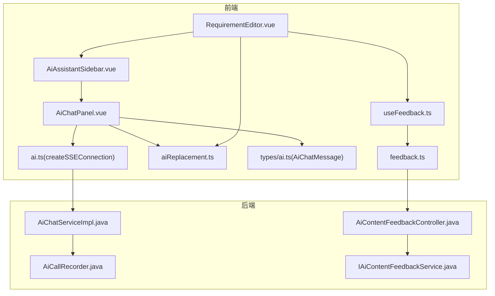
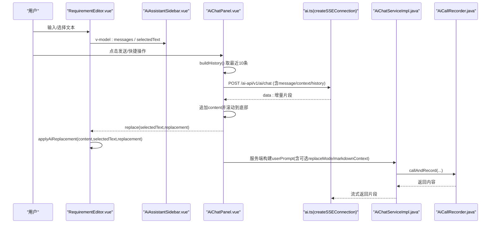
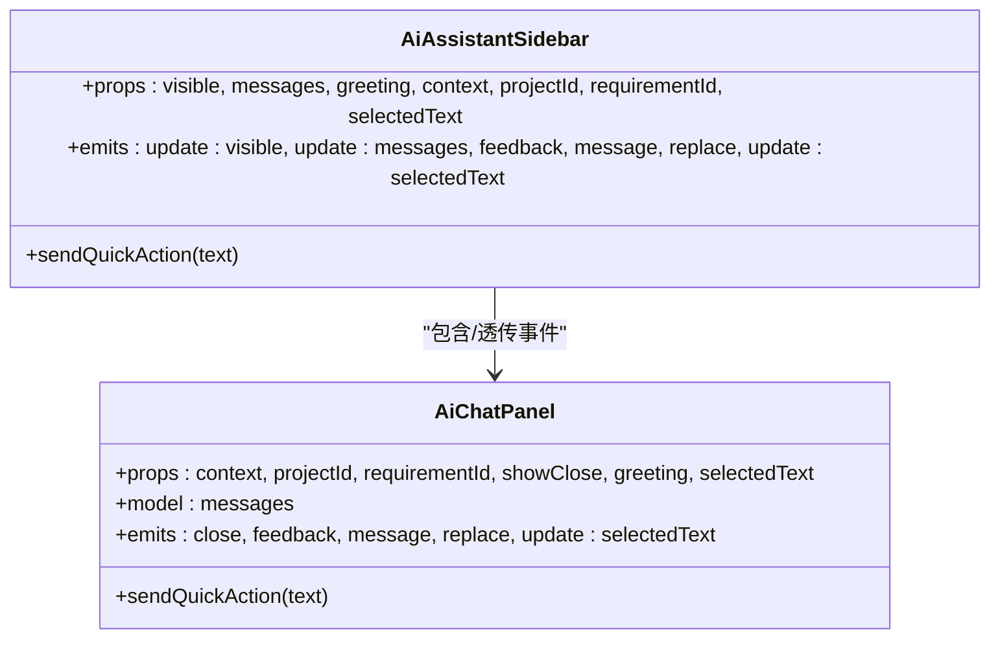
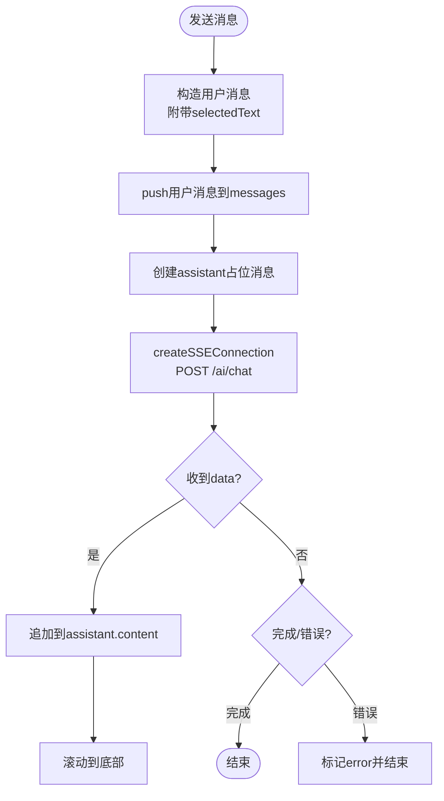
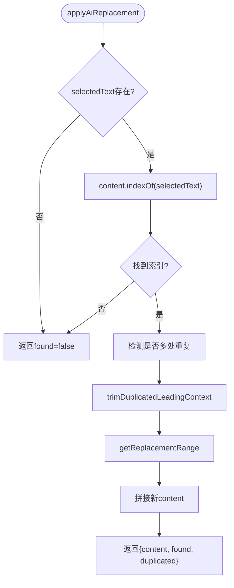
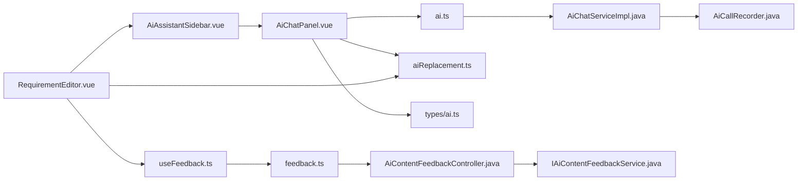

# AI助手集成

<cite>
**本文引用的文件**   
- [AiAssistantSidebar.vue](file://ele-ai-tender-frontend/src/components/ai/AiAssistantSidebar.vue)
- [AiChatPanel.vue](file://ele-ai-tender-frontend/src/components/ai/AiChatPanel.vue)
- [aiReplacement.ts](file://ele-ai-tender-frontend/src/utils/aiReplacement.ts)
- [ai.ts](file://ele-ai-tender-frontend/src/api/ai.ts)
- [ai.ts（类型）](file://ele-ai-tender-frontend/src/types/ai.ts)
- [RequirementEditor.vue](file://ele-ai-tender-frontend/src/views/requirement/RequirementEditor.vue)
- [useFeedback.ts](file://ele-ai-tender-frontend/src/composables/useFeedback.ts)
- [feedback.ts](file://ele-ai-tender-frontend/src/api/feedback.ts)
- [AiContentFeedbackController.java](file://ele-ai-tender-system/ele-ai-tender-core/src/main/java/com/jy/eleaitender/core/controller/AiContentFeedbackController.java)
- [IAiContentFeedbackService.java](file://ele-ai-tender-system/ele-ai-tender-core/src/main/java/com/jy/eleaitender/core/service/IAiContentFeedbackService.java)
- [AiCallRecorder.java](file://ele-ai-tender-system/ele-ai-tender-ai/src/main/java/com/jy/eleaitender/ai/processor/recorder/AiCallRecorder.java)
- [AiChatServiceImpl.java](file://ele-ai-tender-system/ele-ai-tender-ai/src/main/java/com/jy/eleaitender/ai/service/impl/AiChatServiceImpl.java)
</cite>

## 目录
1. [简介](#简介)
2. [项目结构](#项目结构)
3. [核心组件](#核心组件)
4. [架构总览](#架构总览)
5. [详细组件分析](#详细组件分析)
6. [依赖关系分析](#依赖关系分析)
7. [性能与体验优化](#性能与体验优化)
8. [故障排查指南](#故障排查指南)
9. [结论](#结论)
10. [附录：API与数据模型](#附录api与数据模型)

## 简介
本文件面向“AI助手”在前端侧的集成方案，围绕以下目标展开：
- 深入解析 AiAssistantSidebar.vue 与 AiChatPanel.vue 的组件架构、对话管理、上下文传递、快捷操作等能力。
- 详细说明 aiReplacement.ts 的内容替换算法、文本匹配策略与安全验证机制。
- 提供 AI 助手配置选项、对话历史管理、反馈收集机制说明。
- 解释与富文本编辑器的深度集成、实时协作支持、多轮对话处理。

## 项目结构
前端侧与 AI 助手相关的核心文件分布如下：
- 组件层：AiAssistantSidebar.vue（侧边容器）、AiChatPanel.vue（聊天面板）
- 工具层：aiReplacement.ts（内容替换与匹配）
- API 层：ai.ts（SSE 流式连接封装）、feedback.ts（反馈接口）
- 组合式函数：useFeedback.ts（统一反馈行为）
- 页面集成：RequirementEditor.vue（需求编辑器，承载侧边栏与替换逻辑）
- 后端支撑：AiChatServiceImpl.java（构建用户提示词并调用模型）、AiCallRecorder.java（记录调用日志）、AiContentFeedbackController.java + IAiContentFeedbackService.java（反馈服务）

图表来源
- [AiAssistantSidebar.vue:1-160](file://ele-ai-tender-frontend/src/components/ai/AiAssistantSidebar.vue#L1-L160)
- [AiChatPanel.vue:1-668](file://ele-ai-tender-frontend/src/components/ai/AiChatPanel.vue#L1-L668)
- [ai.ts:1-181](file://ele-ai-tender-frontend/src/api/ai.ts#L1-L181)
- [ai.ts（类型）:1-87](file://ele-ai-tender-frontend/src/types/ai.ts#L1-L87)
- [aiReplacement.ts:1-133](file://ele-ai-tender-frontend/src/utils/aiReplacement.ts#L1-L133)
- [RequirementEditor.vue:1-465](file://ele-ai-tender-frontend/src/views/requirement/RequirementEditor.vue#L1-L465)
- [useFeedback.ts:1-106](file://ele-ai-tender-frontend/src/composables/useFeedback.ts#L1-L106)
- [feedback.ts:1-14](file://ele-ai-tender-frontend/src/api/feedback.ts#L1-L14)
- [AiChatServiceImpl.java:177-206](file://ele-ai-tender-system/ele-ai-tender-ai/src/main/java/com/jy/eleaitender/ai/service/impl/AiChatServiceImpl.java#L177-L206)
- [AiCallRecorder.java:35-121](file://ele-ai-tender-system/ele-ai-tender-ai/src/main/java/com/jy/eleaitender/ai/processor/recorder/AiCallRecorder.java#L35-L121)
- [AiContentFeedbackController.java:1-41](file://ele-ai-tender-system/ele-ai-tender-core/src/main/java/com/jy/eleaitender/core/controller/AiContentFeedbackController.java#L1-L41)
- [IAiContentFeedbackService.java:1-21](file://ele-ai-tender-system/ele-ai-tender-core/src/main/java/com/jy/eleaitender/core/service/IAiContentFeedbackService.java#L1-L21)

章节来源
- [AiAssistantSidebar.vue:1-160](file://ele-ai-tender-frontend/src/components/ai/AiAssistantSidebar.vue#L1-L160)
- [AiChatPanel.vue:1-668](file://ele-ai-tender-frontend/src/components/ai/AiChatPanel.vue#L1-L668)
- [ai.ts:1-181](file://ele-ai-tender-frontend/src/api/ai.ts#L1-L181)
- [ai.ts（类型）:1-87](file://ele-ai-tender-frontend/src/types/ai.ts#L1-L87)
- [aiReplacement.ts:1-133](file://ele-ai-tender-frontend/src/utils/aiReplacement.ts#L1-L133)
- [RequirementEditor.vue:1-465](file://ele-ai-tender-frontend/src/views/requirement/RequirementEditor.vue#L1-L465)
- [useFeedback.ts:1-106](file://ele-ai-tender-frontend/src/composables/useFeedback.ts#L1-L106)
- [feedback.ts:1-14](file://ele-ai-tender-frontend/src/api/feedback.ts#L1-L14)
- [AiChatServiceImpl.java:177-206](file://ele-ai-tender-system/ele-ai-tender-ai/src/main/java/com/jy/eleaitender/ai/service/impl/AiChatServiceImpl.java#L177-L206)
- [AiCallRecorder.java:35-121](file://ele-ai-tender-system/ele-ai-tender-ai/src/main/java/com/jy/eleaitender/ai/processor/recorder/AiCallRecorder.java#L35-L121)
- [AiContentFeedbackController.java:1-41](file://ele-ai-tender-system/ele-ai-tender-core/src/main/java/com/jy/eleaitender/core/controller/AiContentFeedbackController.java#L1-L41)
- [IAiContentFeedbackService.java:1-21](file://ele-ai-tender-system/ele-ai-tender-core/src/main/java/com/jy/eleaitender/core/service/IAiContentFeedbackService.java#L1-L21)

## 核心组件
- AiAssistantSidebar.vue：侧边栏容器，负责显示/隐藏、透传快捷操作、将消息列表与选中文本双向绑定到父级，并将子组件事件冒泡给上层。
- AiChatPanel.vue：聊天面板，实现消息渲染、打字动画、Markdown 预览、反馈按钮、可替换内容识别与应用、SSE 流式接收、对话历史构建与发送。
- aiReplacement.ts：提供可替换内容提取、应用替换、重复前缀裁剪、整行替换范围计算、空 Markdown 壳判断等能力。
- RequirementEditor.vue：在需求编辑器中集成侧边栏，处理选择变更、替换结果应用到编辑器内容、反馈提交与快捷操作触发。

章节来源
- [AiAssistantSidebar.vue:1-160](file://ele-ai-tender-frontend/src/components/ai/AiAssistantSidebar.vue#L1-L160)
- [AiChatPanel.vue:1-668](file://ele-ai-tender-frontend/src/components/ai/AiChatPanel.vue#L1-L668)
- [aiReplacement.ts:1-133](file://ele-ai-tender-frontend/src/utils/aiReplacement.ts#L1-L133)
- [RequirementEditor.vue:1-465](file://ele-ai-tender-frontend/src/views/requirement/RequirementEditor.vue#L1-L465)

## 架构总览
AI 助手的前端通过 SSE 与后端进行流式对话；后端根据请求参数组装用户提示词，必要时注入“可替换正文”格式指令，返回增量片段；前端逐段拼接并渲染，同时提供“应用替换”能力，结合编辑器内容进行精准替换。

图表来源
- [AiChatPanel.vue:267-332](file://ele-ai-tender-frontend/src/components/ai/AiChatPanel.vue#L267-L332)
- [ai.ts:60-126](file://ele-ai-tender-frontend/src/api/ai.ts#L60-L126)
- [AiChatServiceImpl.java:177-206](file://ele-ai-tender-system/ele-ai-tender-ai/src/main/java/com/jy/eleaitender/ai/service/impl/AiChatServiceImpl.java#L177-L206)
- [AiCallRecorder.java:35-121](file://ele-ai-tender-system/ele-ai-tender-ai/src/main/java/com/jy/eleaitender/ai/processor/recorder/AiCallRecorder.java#L35-L121)
- [RequirementEditor.vue:294-309](file://ele-ai-tender-frontend/src/views/requirement/RequirementEditor.vue#L294-L309)

## 详细组件分析

### AiAssistantSidebar.vue 组件分析
- 职责
  - 作为固定定位的侧边容器，控制可见性。
  - 透传 AiChatPanel 的事件：关闭、反馈、消息、替换、选中文本更新。
  - 暴露 sendQuickAction 方法供父组件调用。
- 关键交互
  - 通过插槽 quick-actions 注入快捷操作按钮。
  - 使用 defineModel 双向绑定 messages，保持与父组件状态一致。
- 样式
  - 右侧固定定位，收起时仅露出切换按钮。

图表来源
- [AiAssistantSidebar.vue:1-160](file://ele-ai-tender-frontend/src/components/ai/AiAssistantSidebar.vue#L1-L160)
- [AiChatPanel.vue:1-668](file://ele-ai-tender-frontend/src/components/ai/AiChatPanel.vue#L1-L668)

章节来源
- [AiAssistantSidebar.vue:1-160](file://ele-ai-tender-frontend/src/components/ai/AiAssistantSidebar.vue#L1-L160)

### AiChatPanel.vue 组件分析
- 对话管理
  - 欢迎语：当消息为空且传入 greeting 时，自动插入一条 assistant 欢迎消息，不参与后续历史构建。
  - 消息模型：AiChatMessage 包含 role/content/timestamp/uid/error/isGreeting/selectedText。
  - 历史构建：过滤掉错误和欢迎语，保留最近10条，以 role/content 形式发送给后端。
- 上下文传递
  - 普通模式：context = 选中内容或空。
  - 替换模式：当存在选中内容时，设置 replaceMode=true，并将完整 markdown 上下文作为 markdownContext 传入，以便后端生成“可替换正文”。
- 流式输出
  - 使用 createSSEConnection 发起 POST 请求，按事件块解析 data 行，兼容 JSON 与纯文本两种格式。
  - 收到增量片段后，追加到当前 assistant 消息 content，并滚动到底部。
- 反馈机制
  - 每条 assistant 消息具备 uid，用于关联反馈；本地维护 chatFeedbackMap 避免重复提交。
  - 点击赞/踩后，向上冒泡 feedback(type, msg)，由父组件持久化。
- 可替换内容
  - 从 assistant 回复中提取“可替换正文”，若存在且上一条为用户消息且携带 selectedText，则展示“应用替换”按钮。
  - 点击后 emit('replace', { selectedText, replacement })，由父组件执行替换。
- 快捷操作
  - 通过 ref 暴露 sendQuickAction，父组件可直接调用，内部会优先使用选中内容作为 context，否则回退到 props.context。

图表来源
- [AiChatPanel.vue:267-332](file://ele-ai-tender-frontend/src/components/ai/AiChatPanel.vue#L267-L332)
- [ai.ts:60-126](file://ele-ai-tender-frontend/src/api/ai.ts#L60-L126)

章节来源
- [AiChatPanel.vue:1-668](file://ele-ai-tender-frontend/src/components/ai/AiChatPanel.vue#L1-L668)
- [ai.ts:1-181](file://ele-ai-tender-frontend/src/api/ai.ts#L1-L181)
- [ai.ts（类型）:1-87](file://ele-ai-tender-frontend/src/types/ai.ts#L1-L87)

### aiReplacement.ts 内容替换算法
- 可替换内容提取
  - 基于前后标记“【可替换正文开始】/【可替换正文结束】”扫描全文，提取所有被包裹的段落作为候选替换方案。
- 应用替换
  - 在文档内容中查找 selectedText 首次出现位置；若未找到直接返回 found=false。
  - 检测是否多处相同内容，返回 duplicated 标志。
  - 对 replacement 进行“重复前缀裁剪”，避免与选中内容前的同行前缀重复。
  - 计算替换范围：若 replacement 为空且所选内容为“空 Markdown 壳”（如仅标题/列表/引用等），则扩展至整行替换，否则仅替换选中区间。
- 安全与健壮性
  - 不修改非目标区域，仅在精确匹配范围内替换。
  - 对空 Markdown 壳的判断覆盖常见空白结构，防止误删有效内容。
  - 重复前缀裁剪限制最大长度，避免长串误剪。

图表来源
- [aiReplacement.ts:34-83](file://ele-ai-tender-frontend/src/utils/aiReplacement.ts#L34-L83)
- [aiReplacement.ts:55-68](file://ele-ai-tender-frontend/src/utils/aiReplacement.ts#L55-L68)
- [aiReplacement.ts:70-105](file://ele-ai-tender-frontend/src/utils/aiReplacement.ts#L70-L105)
- [aiReplacement.ts:107-117](file://ele-ai-tender-frontend/src/utils/aiReplacement.ts#L107-L117)

章节来源
- [aiReplacement.ts:1-133](file://ele-ai-tender-frontend/src/utils/aiReplacement.ts#L1-133)

### 与富文本编辑器的深度集成
- 选择联动
  - 编辑器监听 selection-change，将选中文本同步到 AiAssistantSidebar 的 selectedText，从而在聊天中体现“引用上下文”。
- 一键替换
  - 聊天面板识别可替换内容后，父组件调用 applyAiReplacement 将替换结果写回编辑器内容，保证内容与替换意图一致。
- 快捷操作
  - 父组件通过 ref 调用 AiAssistantSidebar.sendQuickAction，快速发送预设指令，并根据是否有选中内容决定 context 的来源。

章节来源
- [RequirementEditor.vue:290-315](file://ele-ai-tender-frontend/src/views/requirement/RequirementEditor.vue#L290-L315)
- [AiAssistantSidebar.vue:60-65](file://ele-ai-tender-frontend/src/components/ai/AiAssistantSidebar.vue#L60-L65)
- [AiChatPanel.vue:339-347](file://ele-ai-tender-frontend/src/components/ai/AiChatPanel.vue#L339-L347)

### 实时协作支持与多轮对话
- 实时协作
  - 当前实现为单用户编辑+AI流式输出，未引入多人协同协议。如需协作，可在编辑器层引入 CRDT/OT 方案，并在 AI 建议落地前进行冲突合并。
- 多轮对话
  - 通过 buildHistory 截取最近10条有效消息，配合 conversationId 维持会话上下文；后端可根据需要扩展会话存储与路由。

章节来源
- [AiChatPanel.vue:259-265](file://ele-ai-tender-frontend/src/components/ai/AiChatPanel.vue#L259-L265)
- [AiChatPanel.vue:286-297](file://ele-ai-tender-frontend/src/components/ai/AiChatPanel.vue#L286-L297)

## 依赖关系分析
- 组件耦合
  - AiAssistantSidebar 与 AiChatPanel 通过 props/events 解耦，便于复用与测试。
  - RequirementEditor 作为编排者，聚合编辑器、侧边栏与替换逻辑。
- 外部依赖
  - md-editor-v3 用于 Markdown 预览。
  - Element Plus 提供 UI 组件与消息提示。
  - SSE 封装依赖 fetch + ReadableStream，兼容 JSON 与纯文本。
- 后端依赖
  - AiChatServiceImpl 负责构建 userPrompt，并在替换模式下附加“可替换正文”格式指令。
  - AiCallRecorder 记录系统提示、用户提示与模型响应，便于审计与回溯。
  - 反馈接口由 AiContentFeedbackController 暴露，IAiContentFeedbackService 实现业务规则。

图表来源
- [AiAssistantSidebar.vue:1-160](file://ele-ai-tender-frontend/src/components/ai/AiAssistantSidebar.vue#L1-L160)
- [AiChatPanel.vue:1-668](file://ele-ai-tender-frontend/src/components/ai/AiChatPanel.vue#L1-L668)
- [ai.ts:1-181](file://ele-ai-tender-frontend/src/api/ai.ts#L1-L181)
- [ai.ts（类型）:1-87](file://ele-ai-tender-frontend/src/types/ai.ts#L1-L87)
- [aiReplacement.ts:1-133](file://ele-ai-tender-frontend/src/utils/aiReplacement.ts#L1-L133)
- [RequirementEditor.vue:1-465](file://ele-ai-tender-frontend/src/views/requirement/RequirementEditor.vue#L1-L465)
- [useFeedback.ts:1-106](file://ele-ai-tender-frontend/src/composables/useFeedback.ts#L1-L106)
- [feedback.ts:1-14](file://ele-ai-tender-frontend/src/api/feedback.ts#L1-L14)
- [AiChatServiceImpl.java:177-206](file://ele-ai-tender-system/ele-ai-tender-ai/src/main/java/com/jy/eleaitender/ai/service/impl/AiChatServiceImpl.java#L177-L206)
- [AiCallRecorder.java:35-121](file://ele-ai-tender-system/ele-ai-tender-ai/src/main/java/com/jy/eleaitender/ai/processor/recorder/AiCallRecorder.java#L35-L121)
- [AiContentFeedbackController.java:1-41](file://ele-ai-tender-system/ele-ai-tender-core/src/main/java/com/jy/eleaitender/core/controller/AiContentFeedbackController.java#L1-L41)
- [IAiContentFeedbackService.java:1-21](file://ele-ai-tender-system/ele-ai-tender-core/src/main/java/com/jy/eleaitender/core/service/IAiContentFeedbackService.java#L1-L21)

章节来源
- [AiChatPanel.vue:1-668](file://ele-ai-tender-frontend/src/components/ai/AiChatPanel.vue#L1-L668)
- [ai.ts:1-181](file://ele-ai-tender-frontend/src/api/ai.ts#L1-L181)
- [aiReplacement.ts:1-133](file://ele-ai-tender-frontend/src/utils/aiReplacement.ts#L1-L133)
- [RequirementEditor.vue:1-465](file://ele-ai-tender-frontend/src/views/requirement/RequirementEditor.vue#L1-L465)
- [AiChatServiceImpl.java:177-206](file://ele-ai-tender-system/ele-ai-tender-ai/src/main/java/com/jy/eleaitender/ai/service/impl/AiChatServiceImpl.java#L177-L206)
- [AiCallRecorder.java:35-121](file://ele-ai-tender-system/ele-ai-tender-ai/src/main/java/com/jy/eleaitender/ai/processor/recorder/AiCallRecorder.java#L35-L121)
- [AiContentFeedbackController.java:1-41](file://ele-ai-tender-system/ele-ai-tender-core/src/main/java/com/jy/eleaitender/core/controller/AiContentFeedbackController.java#L1-L41)
- [IAiContentFeedbackService.java:1-21](file://ele-ai-tender-system/ele-ai-tender-core/src/main/java/com/jy/eleaitender/core/service/IAiContentFeedbackService.java#L1-L21)

## 性能与体验优化
- 流式渲染
  - 采用 SSE 增量推送，减少首屏等待时间；前端按需追加内容并滚动，避免全量重绘。
- 历史截断
  - 仅发送最近10条有效消息，降低请求体大小与后端处理压力。
- 替换范围优化
  - 针对“空 Markdown 壳”整行替换，减少多余换行与格式残留。
- 防抖与节流
  - 建议在编辑器 selection-change 与自动保存处增加节流，避免频繁触发。
- 资源加载
  - Markdown 预览样式按需加载，避免影响主线程。

[本节为通用指导，无需源码引用]

## 故障排查指南
- SSE 连接失败
  - 检查 Authorization 头是否正确携带 token；确认后端 /ai-api/v1/ai/chat 路径可达。
  - 查看 onError 回调中的错误信息，必要时打印原始 data 行。
- 替换未生效
  - 确认 selectedText 未被用户中途修改；若已修改，handleReplace 会提示“原文已被修改，请手动替换”。
  - 检查 assistant 回复是否包含“可替换正文”标记；若无，需引导用户手动复制。
- 反馈无法提交
  - 确认 useFeedback 场景与 taskId 正确；dislike 时会弹出原因收集框，取消不会提交。
  - 后端校验反馈类型与场景枚举，非法值将抛出参数错误。

章节来源
- [ai.ts:60-126](file://ele-ai-tender-frontend/src/api/ai.ts#L60-L126)
- [RequirementEditor.vue:294-309](file://ele-ai-tender-frontend/src/views/requirement/RequirementEditor.vue#L294-L309)
- [useFeedback.ts:46-97](file://ele-ai-tender-frontend/src/composables/useFeedback.ts#L46-L97)
- [AiContentFeedbackController.java:25-41](file://ele-ai-tender-system/ele-ai-tender-core/src/main/java/com/jy/eleaitender/core/controller/AiContentFeedbackController.java#L25-L41)

## 结论
本方案通过轻量化的前端组件与稳健的后端服务，实现了“选中文本→AI建议→一键替换”的闭环体验。借助 SSE 流式输出与可替换内容标记，既保证了交互流畅度，又提升了内容改写的准确性。反馈机制与调用记录为持续优化提供了数据基础。未来可在协作编辑、会话持久化与更丰富的快捷动作方面继续演进。

[本节为总结，无需源码引用]

## 附录：API与数据模型
- 对话接口
  - URL: /ai-api/v1/ai/chat
  - 方法: POST
  - 请求体关键字段: message、context、projectId、requirementId、conversationId、replaceMode、markdownContext、history
  - 响应: SSE 事件流，event:message/data 或 event:done/event:error
- 反馈接口
  - 提交: POST /core-api/v1/feedback
  - 查询: GET /core-api/v1/feedback?taskId=&feedbackScene=&chatMessageId=
- 数据类型
  - AiChatMessage: role/content/timestamp/uid/error/isGreeting/selectedText
  - FeedbackSubmitRequest/FeedbackVO: 见 types/feedback 定义

章节来源
- [ai.ts:12-48](file://ele-ai-tender-frontend/src/api/ai.ts#L12-L48)
- [ai.ts:60-126](file://ele-ai-tender-frontend/src/api/ai.ts#L60-L126)
- [ai.ts（类型）:1-21](file://ele-ai-tender-frontend/src/types/ai.ts#L1-L21)
- [feedback.ts:1-14](file://ele-ai-tender-frontend/src/api/feedback.ts#L1-L14)